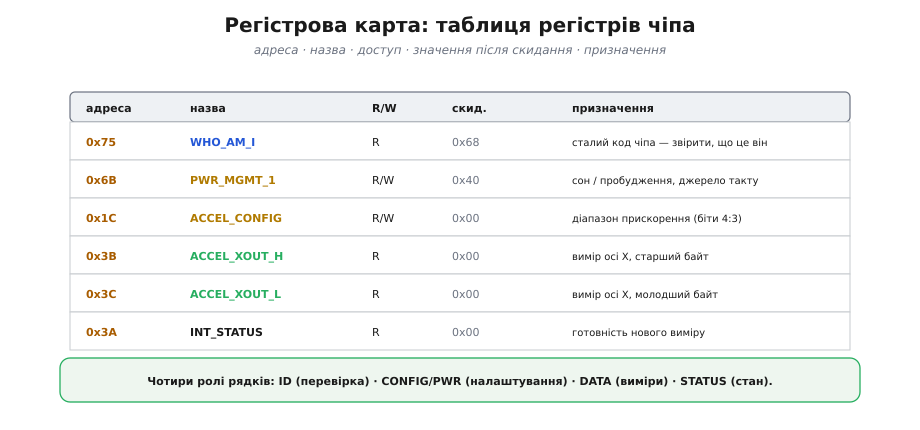
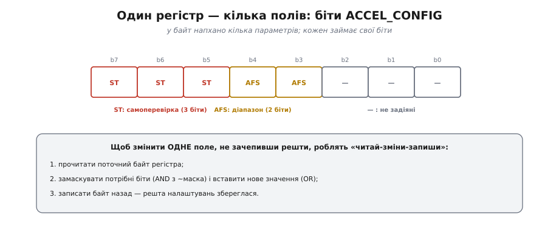
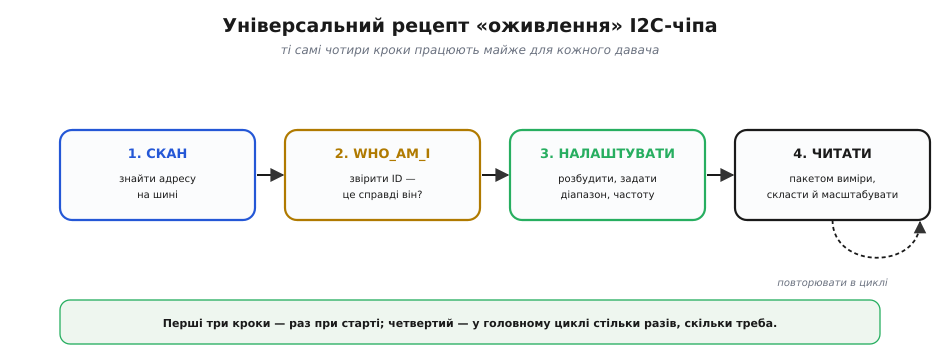
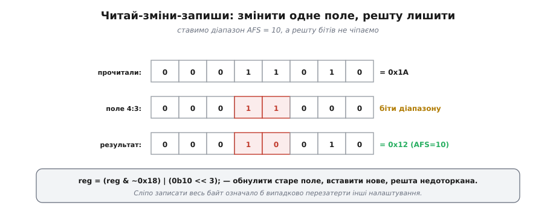
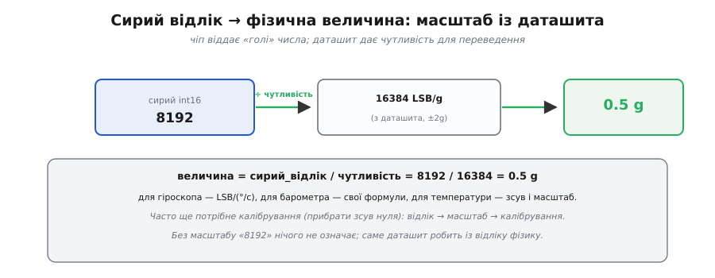
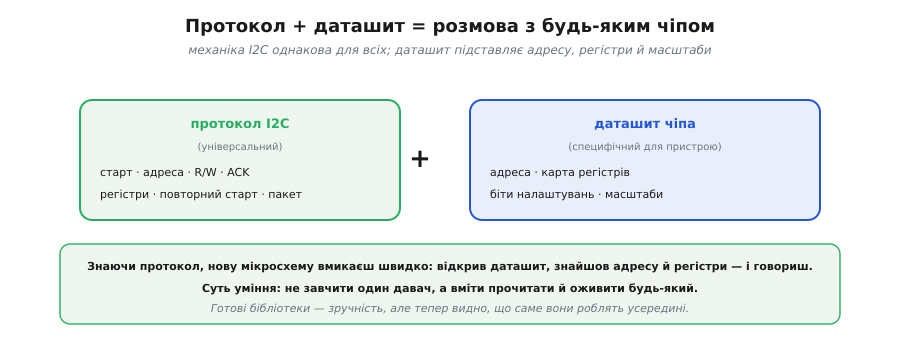

# Регістрова карта

Уся механіка [шини I2C](topic:com-devices/i2c-bus) — старти, [адреси](topic:com-devices/i2c-addressing), [транзакції до регістрів](topic:com-devices/i2c-transaction), підтвердження — варта чогось лише тоді, коли з її допомогою вдається оживити реальний чіп. І тут чудова новина: хоч давачів тисячі, «розмовляють» вони майже однаково, а ключ до кожного — його **регістрова карта** в даташиті. Опанувавши один універсальний підхід, можна взяти будь-який незнайомий I2C-пристрій і за пів години змусити його працювати — не покладаючись на готову бібліотеку, а розуміючи, що саме відбувається.

### Регістрова карта: інструкція до чіпа

Усередині давача сидить набір **регістрів** — однобайтових комірок, у кожної свій номер (адреса). Записати в комірку — означає віддати чіпу команду чи налаштування; прочитати — забрати вимір чи стан. Перше, що шукають у даташиті, — **регістрова карта** (*register map*, «карта регістрів»): таблиця всіх таких комірок. Вона і є інструкція, як із чіпом говорити.


*Карта дає для кожного регістра адресу, назву, доступ (читання R чи запис W), значення після ввімкнення й призначення. Рядки бувають чотирьох ролей: ID — сталий код для перевірки, CONFIG/PWR — налаштування, DATA — виміри, STATUS — стан. Прочитати карту означає знати, що куди писати й звідки що читати.*

У карті варто бачити саме ці **чотири ролі** рядків — і будь-який чіп стає зрозумілим. **ID-регістр** (часто з назвою WHO_AM_I, «хто я») — сталий код, за яким переконуються, що на шині справді той чіп. **Регістри налаштувань** (CONFIG, PWR_MGMT — від *power management*, «керування живленням») — комірки, куди пишуть, щоб увімкнути давач і задати режим. **Регістри даних** (DATA) — звідки читають виміри. **Регістр стану** (STATUS) — звідки дізнаються, чи готовий новий вимір. Робота з чіпом зводиться до цих чотирьох груп.

Числа в підписах вище — не вигадані: це реальний акселерометр-гіроскоп MPU-6050. WHO_AM_I у нього лежить за адресою 0x75 і завжди віддає 0x68; живленням керує PWR_MGMT_1 (0x6B); діапазон акселерометра задають у ACCEL_CONFIG (0x1C); виміри осі X читають із пари 0x3B/0x3C. Ці адреси нам ще знадобляться в коді.

### Біти всередині регістра

Часто один регістр налаштувань пакує **кілька** параметрів — кожен у своїх бітах. Це **бітові поля** (*bit fields*, «бітові поля»): окремі ділянки байта, кожна зі своїм змістом.


*Байт ACCEL_CONFIG чіпа MPU-6050: біти 4:3 — діапазон прискорення (поле AFS), старші біти — самоперевірка осей, молодші не задіяні. Три різні налаштування живуть в одному байті. Щоб змінити одне поле, не зачепивши інших, застосовують «читай-зміни-запиши».*

Тут ховається важлива пастка: якщо просто записати весь байт заради одного поля, інші поля випадково **перезатруться**. Тому поля міняють обережно — прийомом «читай-зміни-запиши». Головне правило просте: один регістр ≠ одне налаштування, і дивитися треба на **біти**, а не на байт цілком.

### Універсальний рецепт оживлення

Є послідовність, що працює майже для кожного I2C-давача — назвімо її рецептом оживлення.


*Чотири кроки: (1) скан — знайти адресу на шині; (2) WHO_AM_I — звірити ID, що це справді той чіп; (3) налаштувати — розбудити, задати діапазон і частоту; (4) читати — пакетом виміри, скласти й масштабувати. Перші три виконують раз при старті, четвертий крутиться в головному циклі стільки разів, скільки треба вимірів.*

Цей рецепт — серце всієї теми. Кроки 1–3 виконують **один раз** при старті: знайшов, перевірив, налаштував. Крок 4 крутиться в головному циклі. Два кроки рецепта заслуговують уважнішого погляду — звірка ID й обережна зміна поля; з них і почнемо.

### WHO_AM_I: перша перевірка

Найрозумніше, що можна зробити перед будь-яким налаштуванням, — прочитати ID-регістр і звірити його з очікуваним значенням.


*Читаємо WHO_AM_I, очікуємо сталий код (у MPU-6050 це 0x68), отримали 0x68 — збіглося: це той чіп, адреса й дроти справні, можна налаштовувати. Якщо ж повернулося 0x00, 0xFF чи інше — налаштування не починають, спершу розбираються з підключенням.*

> 🔧 **Навіщо це.** Звірка WHO_AM_I економить **години** налагодження. Вона одразу відділяє два зовсім різні класи проблем: «чіп живий і відповідає» (ID збігся — далі шукай помилку в логіці) від «щось із підключенням» (ID не той — підтяжки, живлення, адреса, дроти). Значення 0xFF на всіх регістрах зазвичай означає обірвану лінію (підтяжка тримає «1»), а 0x00 — часто відсутнє живлення. Цю перевірку ставлять **першою**: за один обмін вона каже, чи варто рухатися далі.

### Читай-зміни-запиши

Тепер про обережну зміну бітового поля. Щоб поставити, скажімо, поле діапазону AFS = 10, не зіпсувавши біти поряд, застосовують прийом **читай-зміни-запиши** (*read-modify-write*, «прочитай, зміни, запиши»).


*Прочитали поточний байт (0x1A); замаскували старі біти діапазону (4:3) і вставили нове значення 10; записали назад (0x12). Біти поряд лишилися недоторканими.*

**Поставити лише поле AFS, решту лишити.** Хай регістр ACCEL_CONFIG зараз містить 0x1A, а діапазон (біти 4:3) треба виставити в 0b10, не чіпаючи решти:

```
reg = 0x1A                       // прочитали:          0001 1010
reg = reg & ~0x18                // обнулили біти 4:3:   0000 0010   (~0x18 = 1110 0111)
reg = reg | (0b10 << 3)          // вставили 10:         0001 0010 = 0x12
// записати 0x12 назад у регістр ACCEL_CONFIG
```

Якби ми просто записали `0b10 << 3` (тобто 0x10) у весь регістр, то випадково обнулили б решту бітів. «Читай-зміни-запиши» — стандартний і безпечний спосіб міняти **одне** поле, лишаючи сусідні як були.

> 🔧 **Навіщо це.** Майже кожне ввімкнення давача проходить через цей прийом: розбудити чіп, виставити діапазон, увімкнути переривання — усе це окремі біти в спільних регістрах. Сліпий запис байта — класичне джерело «працювало вчора, сьогодні ні»: змінив одне поле, мовчки скинув інше. Звичка читати-зміни-записувати знімає цілий клас таких помилок.

### Сирий відлік у фізичну величину

Останній крок рецепта — перетворити «голі» числа давача у фізичні величини. Чіп віддає **сирий відлік** (*raw count*, «сирий відлік»); даташит дає **чутливість** (*sensitivity*, «чутливість») — на скільки відліків припадає одиниця величини, щоб перевести їх у g, °/с, °C тощо.


*Сирий int16 (8192), поділений на чутливість із даташита (16384 LSB/g для діапазону ±2g), дає фізичну величину (0.5 g). Без масштабу «8192» нічого не означає — саме даташит робить із відліку фізику.*

**Відлік у прискорення.** Хай акселерометр MPU-6050 у діапазоні ±2g віддав сирий відлік 8192, а даташит для цього діапазону каже чутливість 16384 LSB/g:

```
величина = сирий_відлік / чутливість
величина = 8192 / 16384
величина = 0.5 g
```

Для гіроскопа масштаб буде в LSB/(°/с), для барометра — своя формула, для температури — зсув і коефіцієнт. А ще виміри часто потребують [калібрування](topic:hw-sensing/calibration) (прибрати зсув нуля): сирий відлік → масштаб → калібрування → справжня величина.

### Усе разом: оживлення в коді

Зберімо рецепт у код. Хай яке середовище, потрібні рівно дві дії: записати байт у регістр і прочитати байт із регістра — усе інше з них складається. Кожна I2C-бібліотека дає їх під своєю назвою: в Arduino це `Wire`, в ESP-IDF — `driver/i2c.h`, у STM32 HAL — `HAL_I2C_Mem_*`, у Linux — `smbus`. Спершу два маленькі помічники: один читає байт регістра за адресою, другий — записує.

:::tabs
```arduino
#include <Wire.h>

// --- адреси з даташита MPU-6050 ---
const uint8_t ADDR        = 0x68;   // адреса чіпа на шині I2C
const uint8_t REG_WHO     = 0x75;   // WHO_AM_I
const uint8_t EXPECTED_ID = 0x68;   // сталий код саме цього чіпа
const uint8_t REG_PWR     = 0x6B;   // PWR_MGMT_1
const uint8_t REG_CFG     = 0x1C;   // ACCEL_CONFIG (діапазон у бітах 4:3)
const uint8_t REG_XOUT_H  = 0x3B;   // старший байт виміру осі X

// прочитати один байт регістра reg
uint8_t readReg(uint8_t reg) {
    Wire.beginTransmission(ADDR);
    Wire.write(reg);                 // назвати номер регістра…
    Wire.endTransmission(false);     // …і ПОВТОРНИЙ старт (без stop)
    Wire.requestFrom(ADDR, (uint8_t)1);
    return Wire.read();
}

// записати один байт val у регістр reg
void writeReg(uint8_t reg, uint8_t val) {
    Wire.beginTransmission(ADDR);
    Wire.write(reg);
    Wire.write(val);
    Wire.endTransmission();
}
```
```esp-idf
#include "driver/i2c.h"
#include "esp_log.h"
#include "freertos/FreeRTOS.h"

static const char *TAG = "mpu6050";

// --- адреси з даташита MPU-6050 ---
#define PORT        I2C_NUM_0       // шина I2C, налаштована через i2c_param_config()
#define ADDR        0x68            // адреса чіпа на шині I2C
#define REG_WHO     0x75            // WHO_AM_I
#define EXPECTED_ID 0x68            // сталий код саме цього чіпа
#define REG_PWR     0x6B            // PWR_MGMT_1
#define REG_CFG     0x1C            // ACCEL_CONFIG (діапазон у бітах 4:3)
#define REG_XOUT_H  0x3B            // старший байт виміру осі X

// прочитати один байт регістра reg
static uint8_t read_reg(uint8_t reg) {
    uint8_t val = 0;
    // драйвер сам робить «запис номера — повторний старт — читання»
    esp_err_t err = i2c_master_write_read_device(PORT, ADDR, &reg, 1,
                                                 &val, 1, pdMS_TO_TICKS(100));
    if (err != ESP_OK) ESP_LOGE(TAG, "читання 0x%02X: %s", reg, esp_err_to_name(err));
    return val;
}

// записати один байт val у регістр reg
static void write_reg(uint8_t reg, uint8_t val) {
    uint8_t buf[2] = { reg, val };   // номер регістра й значення — одним записом
    esp_err_t err = i2c_master_write_to_device(PORT, ADDR, buf, 2, pdMS_TO_TICKS(100));
    if (err != ESP_OK) ESP_LOGE(TAG, "запис 0x%02X: %s", reg, esp_err_to_name(err));
}
```
```stm32
#include "stm32f4xx_hal.h"

extern I2C_HandleTypeDef hi2c1;     // ініціалізований у MX_I2C1_Init()

// --- адреси з даташита MPU-6050 ---
#define ADDR        (0x68 << 1)     // HAL чекає 8-бітову адресу: 7 біт зсунуті вліво
#define REG_WHO     0x75            // WHO_AM_I
#define EXPECTED_ID 0x68            // сталий код саме цього чіпа
#define REG_PWR     0x6B            // PWR_MGMT_1
#define REG_CFG     0x1C            // ACCEL_CONFIG (діапазон у бітах 4:3)
#define REG_XOUT_H  0x3B            // старший байт виміру осі X

// прочитати один байт регістра reg
static uint8_t read_reg(uint8_t reg) {
    uint8_t val = 0;
    // Mem_Read і є шаблон «номер регістра, повторний старт, читання»
    HAL_I2C_Mem_Read(&hi2c1, ADDR, reg, I2C_MEMADD_SIZE_8BIT, &val, 1, 100);
    return val;
}

// записати один байт val у регістр reg
static void write_reg(uint8_t reg, uint8_t val) {
    HAL_I2C_Mem_Write(&hi2c1, ADDR, reg, I2C_MEMADD_SIZE_8BIT, &val, 1, 100);
}
```
```python
from smbus2 import SMBus

# --- адреси з даташита MPU-6050 ---
ADDR        = 0x68   # адреса чіпа на шині I2C
REG_WHO     = 0x75   # WHO_AM_I
EXPECTED_ID = 0x68   # сталий код саме цього чіпа
REG_PWR     = 0x6B   # PWR_MGMT_1
REG_CFG     = 0x1C   # ACCEL_CONFIG (діапазон у бітах 4:3)
REG_XOUT_H  = 0x3B   # старший байт виміру осі X

bus = SMBus(1)       # шина I2C №1 (типова на Raspberry Pi)

# прочитати один байт регістра reg
def readReg(reg):
    # назвати номер регістра, повторний старт, читання — усе в одному виклику
    return bus.read_byte_data(ADDR, reg)

# записати один байт val у регістр reg
def writeReg(reg, val):
    bus.write_byte_data(ADDR, reg, val)
```
:::

Маючи ці двоє, увесь рецепт лягає у кілька рядків:

:::tabs
```arduino
// 1. Перевірка: чи це той чіп?
if (readReg(REG_WHO) != EXPECTED_ID) {
    // біда з дротами або адресою — далі не йти
    return;
}

// 2. Налаштування (раз при старті):
writeReg(REG_PWR, 0x00);                       // вийти зі сну
uint8_t c = readReg(REG_CFG);                  // читай-зміни-запиши:
writeReg(REG_CFG, (c & ~0x18) | (0b10 << 3));  // діапазон AFS = ±8g

// 3. Читання виміру осі X (у головному циклі):
uint8_t hi = readReg(REG_XOUT_H);
uint8_t lo = readReg(REG_XOUT_H + 1);          // сусідня комірка 0x3C
int16_t raw = (int16_t)((hi << 8) | lo);       // склали два байти в число
float ax = raw / 4096.0f;                       // сирий відлік → g (±8g → 4096 LSB/g)
```
```esp-idf
// 1. Перевірка: чи це той чіп?
if (read_reg(REG_WHO) != EXPECTED_ID) {
    ESP_LOGE(TAG, "чіпа нема на 0x%02X — дроти або адреса", ADDR);
    vTaskDelete(NULL);                         // задачу далі не крутити
}

// 2. Налаштування (раз при старті задачі):
write_reg(REG_PWR, 0x00);                      // вийти зі сну
uint8_t c = read_reg(REG_CFG);                 // читай-зміни-запиши:
write_reg(REG_CFG, (c & ~0x18) | (0b10 << 3)); // діапазон AFS = ±8g

// 3. Читання виміру осі X (у циклі задачі FreeRTOS):
uint8_t hi = read_reg(REG_XOUT_H);
uint8_t lo = read_reg(REG_XOUT_H + 1);         // сусідня комірка 0x3C
int16_t raw = (int16_t)((hi << 8) | lo);       // склали два байти в число
float ax = raw / 4096.0f;                      // сирий відлік → g (±8g → 4096 LSB/g)
vTaskDelay(pdMS_TO_TICKS(10));                 // віддати процесор іншим задачам
```
```stm32
// 1. Перевірка: чи це той чіп?
if (read_reg(REG_WHO) != EXPECTED_ID) {
    Error_Handler();                           // біда з дротами або адресою
}

// 2. Налаштування (раз при старті, після MX_I2C1_Init()):
write_reg(REG_PWR, 0x00);                      // вийти зі сну
uint8_t c = read_reg(REG_CFG);                 // читай-зміни-запиши:
write_reg(REG_CFG, (c & ~0x18) | (0b10 << 3)); // діапазон AFS = ±8g

// 3. Читання виміру осі X (у головному циклі):
uint8_t hi = read_reg(REG_XOUT_H);
uint8_t lo = read_reg(REG_XOUT_H + 1);         // сусідня комірка 0x3C
int16_t raw = (int16_t)((hi << 8) | lo);       // склали два байти в число
float ax = raw / 4096.0f;                      // сирий відлік → g (±8g → 4096 LSB/g)
HAL_Delay(10);
```
```python
# 1. Перевірка: чи це той чіп?
if readReg(REG_WHO) != EXPECTED_ID:
    # біда з дротами або адресою — далі не йти
    return

# 2. Налаштування (раз при старті):
writeReg(REG_PWR, 0x00)                        # вийти зі сну
c = readReg(REG_CFG)                           # читай-зміни-запиши:
writeReg(REG_CFG, (c & ~0x18) | (0b10 << 3))   # діапазон AFS = ±8g

# 3. Читання виміру осі X (у головному циклі):
hi = readReg(REG_XOUT_H)
lo = readReg(REG_XOUT_H + 1)                   # сусідня комірка 0x3C
raw = int.from_bytes([hi, lo], "big", signed=True)  # склали два байти в знакове число
ax = raw / 4096.0                              # сирий відлік → g (±8g → 4096 LSB/g)
```
:::

Кожен рядок спирається на просту механіку шини. Усередині `readReg`/`writeReg` — той самий шаблон [«запис номера регістра, повторний старт, читання»](topic:com-devices/i2c-transaction); перевірка ID — це WHO_AM_I; конфіг — це читай-зміни-запиши; зчитування двох сусідніх байтів — старший і молодший півбайти виміру. Уся складність схована за чотирма кроками рецепта.

Цей приклад навмисно спрощений: він читає осі по байту й не перевіряє помилок шини. Надійніший варіант віддає три осі одним пакетом (щоб вісь не «склеїлася» з двох різних вимірів), повертає код помилки з кожної функції й правильно складає знаковий відлік. Як це оформити в невеликий, але чесний драйвер у три шари — у вставці [мінімальний драйвер давача](topic:com-devices/register-map/proj-sensor-driver.md).

### Універсальне вміння

І ось головний підсумок.


*Розмова з будь-яким чіпом = протокол I2C (універсальний) плюс даташит (специфічний для пристрою: адреса, карта регістрів, біти, масштаби). Знаючи протокол, нову мікросхему вмикаєш швидко: відкрив даташит, знайшов адресу й регістри — і говориш.*

> 🔧 **Навіщо це.** Суть уміння: не завчити один конкретний давач, а навчитися оживляти будь-який. Готові бібліотеки — зручність, і ними варто користуватися; але тепер видно, що саме вони роблять усередині, і драйвер можна полагодити, коли щось піде не так, чи написати з нуля для чіпа, на який бібліотеки ще немає. Протокол відомий — лишається відкрити даташит і прочитати таблицю.

---

Варто бачити й межі самого I2C. Це дотепний компроміс: [дві лінії](topic:com-devices/i2c-bus), багато пристроїв на спільній шині, помірна швидкість — ціною [адресації](topic:com-devices/i2c-addressing) й повільного [відкритого колектора](topic:hw-digital/open-drain-bus-pullup-sizing). Коли потрібна швидкість і не шкода кількох зайвих ліній, беруть іншу синхронну шину — [SPI](topic:com-devices/spi-bus): повнодуплексну, без адрес і підтяжок, із роздільними лініями даних в обидва боки. Але регістрова карта лишається тією самою ідеєю незалежно від шини: відкрив даташит, знайшов адресу й регістри — і говориш.
