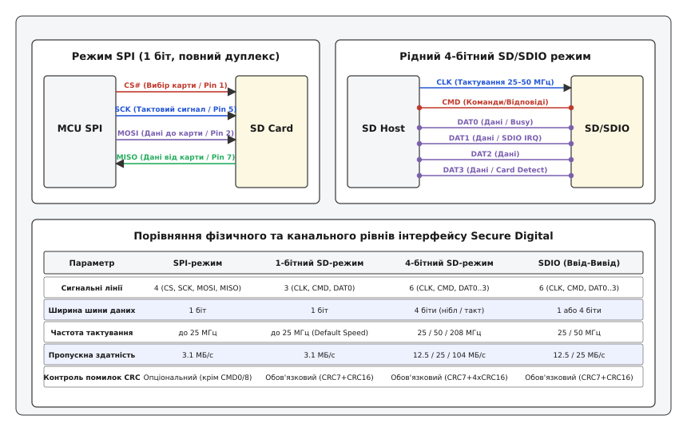
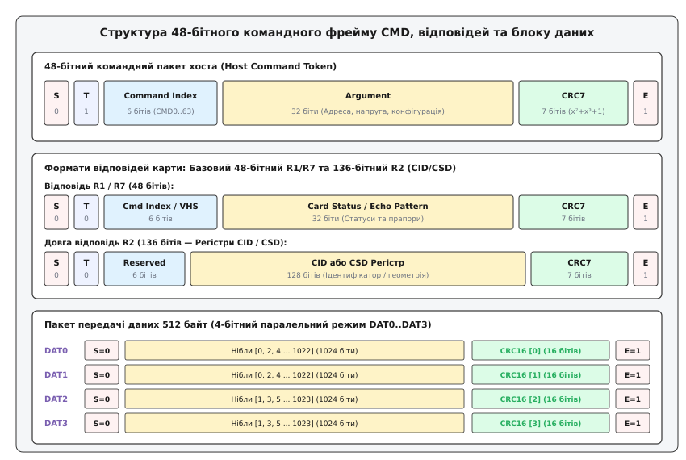
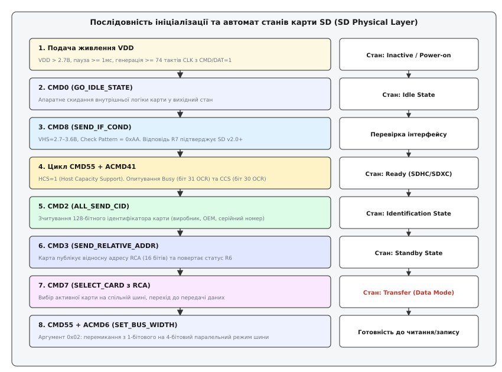
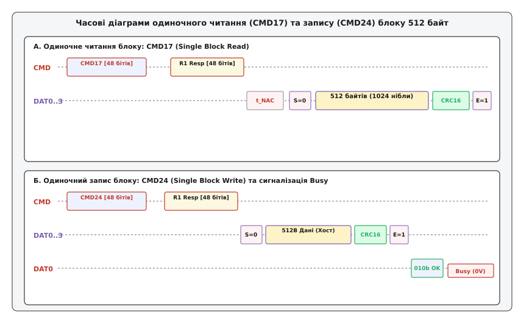

# Протокол SD/SDIO

<preknowlist>
- [Шина SPI](root:com-devices/spi-bus) — синхронний послідовний інтерфейс ведучий-ведений, тактування та лінії MOSI/MISO.
- [Вихід із відкритим стоком](root:hw-digital/open-drain-output) — монтажне «АБО» та безпечне паралельне з'єднання ліній кількох ведених.
- [Двотактний вихід (Push-Pull)](root:hw-digital/push-pull-output) — активне перемикання високого та низького рівнів на великій частоті.
- [Циклічний надлишковий код (CRC)](root:com-modulation/crc) — поліноміальний контроль цілісності даних у каналах зв'язку.
- [Високоімпедансний стан (Hi-Z)](root:hw-digital/hi-z-state) — відключення виходу драйвера для розділення шини між пристроями.
</preknowlist>

Розробник портативного накопичувача або відеореєстратора підключає знімну карту Flash-пам'яті до мікроконтролера. Якщо використовувати класичну шину SPI на частоті 25 МГц, швидкість передачі обмежується 2.5–3.0 МБайт/с через однобітовий канал і відсутність конвеєризації запитів — цього недостатньо навіть для запису одного відеопотоку 1080p 60 fps без втрати кадрів. З іншого боку, підключення карти через широку паралельну шину з фіксованою адресацією вимагало б понад 30 сигнальних виводів, а різниця в напругах живлення та поколіннях пам'яті (SDSC, SDHC, SDXC) загрожувала б електричним пошкодженням або некоректним декодуванням адрес.

Для розв'язання цієї суперечності асоціація SDA розробила спеціалізований протокол SD/SDIO — дворівневу шинну архітектуру, що поєднує зворотну сумісність із простим SPI-режимом та високошвидкісний 4-бітовий режим із динамічним конфігуруванням напруг, арбітражем і вбудованим автоматом ідентифікації.

---

### Фізична топологія та подвійний інтерфейсний режим: SPI проти 1/4-біт SD

Інтерфейс Secure Digital спроєктовано як універсальну шину, здатну адаптуватися як до найпростіших 8-бітних мікроконтролерів без спеціалізованої периферії, так і до потужних 32/64-бітних процесорів із вбудованими апаратними контролерами SDIO/SDMMC.


*Порівняння фізичної структури шини: 4-дротовий режим SPI для простих систем проти рідного 4-бітного паралельного інтерфейсу SD/SDIO з роздільними лініями такту CLK, команд CMD та даних DAT0..DAT3.*

#### 1. Режим SPI (Serial Peripheral Interface)
У режимі SPI карта пам'яті виступає стандартним веденим пристроєм (*Slave*). Зв'язок здійснюється чотирма лініями:
* `CS#` (*Chip Select*, активний низький рівень) — вибір карти хостом.
* `SCK` (*Serial Clock*) — тактовий сигнал, що генерується хостом (частота до 25 МГц).
* `MOSI` (*Master Out, Slave In*) — лінія передачі команд та даних від хоста до карти.
* `MISO` (*Master In, Slave Out*) — лінія повернення відповідей та даних від карти до хоста.

Головна перевага режиму SPI — можливість роботи через звичайний апаратний блок SPI мікроконтролера або навіть програмною емуляцією виводів (*bit-banging*). Проте в режимі SPI карта працює з обмеженою швидкістю (піковий потік до 3.1 МБ/с при 25 МГц), контрольні суми CRC за замовчуванням відключаються (крім первинної команди скидання `CMD0` та перевірки напруги `CMD8`), а доступ до апаратних регістрів конфігурації є спрощеним.

#### 2. Рідний режим SD (Native SD Mode: 1-біт та 4-біти)
Рідний інтерфейс Secure Digital використовує роздільні шини для керування та передачі даних:
* `CLK` (*Clock*) — тактовий сигнал синхронізації (від 400 кГц на етапі ініціалізації до 25 МГц у режимі Default Speed, 50 МГц у High Speed та 208 МГц у UHS-I).
* `CMD` (*Command/Response*) — двонаправлена сигнальна лінія, по якій хост передає 48-бітні команди, а карта повертає 48-бітні або 136-бітні відповіді.
* `DAT0..DAT3` (*Data Lines*) — чотири двонаправлені лінії паралельної передачі блоків даних.

#### Електричні особливості та динамічна зміна режиму лінії CMD
Лінія `CMD` має унікальну електричну поведінку:
1. **Режим відкритого стоку (Open-Drain)**: активується під час увімкнення живлення та на етапі ініціалізації. Усі підключені до шини карти слухають лінію `CMD` одночасно. Якщо кілька карт відповідають одночасно, схема монтажного «АБО» з зовнішнім резистором підтяжки (pull-up 10–100 кОм до лінії `VDD`) запобігає виникненню короткого замикання між вихідними каскадами.
2. **Двотактний режим (Push-Pull)**: після завершення ідентифікації та присвоєння кожній карті унікальної адреси RCA лінія `CMD` апаратно перемикається у двотактний режим (*Push-Pull*). Це забезпечує круті фронти наростання сигналу та дозволяє підняти тактову частоту шини понад 25–50 МГц.

Лінії даних `DAT0..DAT3` завжди працюють у режимі Push-Pull і потребують обов'язкових підтягуючих резисторів (10–100 кОм) до `VDD` для запобігання плаванню рівнів (*floating inputs*) під час переходів шини у високоімпедансний стан (Hi-Z).

Історію виникнення стандарту SD, подолання 2-гігабайтного бар'єра ємності та еволюцію швидкісних класів розібрано у вставці про [еволюцію карт пам'яті від MMC до SDHC, SDXC та SD Express](root:com-devices/sd-card-protocol/hist-sd-card.md).

---

### Формат командного фрейму CMD (48-бітний пакет)

Усі керуючі транзакції на шині SD ініціюються виключно хостом. Будь-яка команда передається по лінії `CMD` у вигляді суворо структурованого 48-бітного синхронного пакета.


*Анатомія пакетів шини SD: структура 48-бітної команди хоста, 48-бітних (R1, R7) та 136-бітних (R2) відповідей карти, а також розпаралелювання 512-байтного блоку на 4 канали DAT0..DAT3 з індивідуальними контрольними сумами CRC16.*

Повний 48-бітний пакет команди має таку структуру бітів:

```
  ┌─────────┬──────────────┬───────────────┬───────────────────────────┬──────────────┬─────────┐
  │ Біт 47  │ Біт 46       │ Біти [45:40]  │ Біти [39:8]               │ Біти [7:1]   │ Біт 0   │
  ├─────────┼──────────────┼───────────────┼───────────────────────────┼──────────────┼─────────┤
  │ Start=0 │ Direction=1  │ Command Index │ Command Argument (32 біти)│ CRC7 (7 бітів│ Stop=1  │
  └─────────┴──────────────┴───────────────┴───────────────────────────┴──────────────┴─────────┘
```

1. **Стартовий біт (Start Bit, біт 47)**: завжди дорівнює логічному нулю `0`. Оскільки в стані спокою лінія `CMD` утримується підтяжкою у високому рівні `1`, спадний фронт сигналізує приймачу карти про початок нового кадру.
2. **Біт напрямку (Transmission Bit, біт 46)**: визначає напрямок передачі сигналу по шині. Для пакетів від хоста до карти цей біт завжди встановлюється в одиницю `1`. У відповідях від карти до хоста цей біт завжди скидається в нуль `0`.
3. **Індекс команди (Command Index, біти 45..40)**: 6-бітне двійкове число від `0` (`000000b`) до `63` (`111111b`), що задає номер інструкції (`CMD0`..`CMD63` або `ACMD0`..`ACMD63`).
4. **Аргумент команди (Argument, біти 39..8)**: 32-бітне поле корисного навантаження. Залежно від типу команди аргумент містить адресу 512-байтного сектора, діапазон підтримуваних напруг, маску конфігураційних бітів або відносну адресу цільової карти `RCA`.
5. **Контрольна сума (CRC7, біти 7..1)**: 7-бітний циклічний надлишковий код, розрахований над першими 40 бітами пакета за породжувальним многочленом `G(x) = x⁷ + x³ + 1`. Карта пам'яті апаратно перевіряє CRC7 кожного прийнятого кадру; у разі невідповідності команда відкидається, а у відповіді фіксується помилка `COM_CRC_ERROR`.
6. **Стоповий біт (End Bit, біт 0)**: завжди дорівнює логічній одиниці `1`. Після стопового біта передавач відпускає лінію `CMD` у стан спокою (High).

Детальний математичний вивід полінома ділення, покрокові розрахунки контрольних сум та алгоритми розпаралелювання наведено у вставці про [математичний апарат і алгоритми розрахунку контрольних сум CRC7 та паралельного CRC16](root:com-devices/sd-card-protocol/math-sd-crc.md).

---

### Спектр відповідей: анатомія пакетів R1, R2, R3, R6, R7

Після отримання командного фрейму карта пам'яті зобов'язана надіслати відповідь по лінії `CMD` протягом фіксованого інтервалу затримки `t_Ncr` (від 2 до 64 періодів тактового сигналу `CLK`). Протокол SD визначає п'ять основних форматів відповідей для карт пам'яті та додаткові формати для пристроїв вводу-виводу SDIO.

#### 1. Відповідь R1 (Normal Response Command — Базовий статус, 48 бітів)
Найпоширеніший формат відповіді, що повертається більшістю базових команд (`CMD13`, `CMD16`, `CMD17`, `CMD24`, `CMD55` тощо).

Пакет містить:
* Біт старту `0` та біт напрямку `0`.
* 6 бітів індексу команди, на яку повертається відповідь.
* **32-бітний регістр Card Status**: докладний звіт про стан карти. Старші біти фіксують критичні помилки: `OUT_OF_RANGE` (вихід за межі пам'яті), `ADDRESS_ERROR` (невирівняна адреса), `WP_VIOLATION` (спроба запису на захищений сектор), `ILLEGAL_COMMAND` (неприпустима команда в поточному стані), `COM_CRC_ERROR` (збій контрольної суми). Біти `[12:9]` кодують поточний стан автомата `CURRENT_STATE` (`0`=idle, `1`=ready, `2`=ident, `3`=stby, `4`=tran, `5`=data, `6`=rcv, `7`=prg, `8`=dis).
* 7-бітний код `CRC7` та стоповий біт `1`.

#### 2. Відповідь R1b (R1 з сигналізацією зайнятості Busy)
Має ідентичну структуру фрейму до R1 на лінії `CMD`, проте додає апаратне керування лінією `DAT0`. Карта утримує лінію `DAT0` у нулі (Low), доки її внутрішній мікроконтролер виконує фізичний запис сторінки Flash-пам'яті або високовольтне стирання блоків (`CMD12`, `CMD28`, `CMD29`, `CMD38`).

#### 3. Відповідь R2 (CID/CSD Register — Довга відповідь, 136 бітів)
Повертається виключно на команди `CMD2` (запит CID), `CMD9` (запит CSD) та `CMD10` (запит CID конкретної карти). 

Фрейм містить 136 бітів: стартові біти, 6 зарезервованих бітів `0x3F`, повний **128-бітний вміст регістра CID** (ідентифікатор виробника, OEM, назва виробу, ревізія, серійний номер, дата виготовлення) або **регістра CSD** (структура комірок, максимальний струм, допустимі частоти, розміри блоків читання/стирання), 7 бітів `CRC7` та стоповий біт `1`.

#### 4. Відповідь R3 (OCR Register — Регістр умов експлуатації, 48 бітів)
Повертається у відповідь на команду ініціалізації `ACMD41` (або `CMD58` у SPI-режимі).

Пакет повертає 32-бітне значення регістра `OCR` (*Operation Conditions Register*):
* **Біт 31 (Busy)**: `0` — карта виконує внутрішню ініціалізацію; `1` — карта завершила стабілізацію і готова до роботи.
* **Біт 30 (CCS — Card Capacity Status)**: `0` — стандартна ємність SDSC (побайтова адресація); `1` — висока ємність SDHC або SDXC (блокова адресація секторів по 512 байт).
* **Біт 24 (S18A)**: підтвердження можливості перемикання на напругу 1.8 В для UHS-I.
* **Біти [23:15]**: бітова маска підтримуваних робочих напруг живлення в діапазоні від 2.7 до 3.6 Вольт.
* *Особливість*: поле CRC7 у відповіді R3 заповнюється одиницями (`0x7F`) і не перевіряється хостом.

#### 5. Відповідь R6 (Published RCA Response, 48 бітів)
Повертається картою у відповідь на команду `CMD3` (*SEND_RELATIVE_ADDR*). Фрейм передає новопризначену **16-бітну відносну адресу RCA** у старших 16 бітах поля даних та 16 бітів скороченого статусу карти у молодших розрядах.

#### 6. Відповідь R7 (Card Interface Condition, 48 бітів)
Повертається картою у відповідь на команду `CMD8`. Пакет дзеркально повертає підтверджений картою діапазон напруг `VHS` та 8-бітний тестовий патерн відлуння `Check Pattern` (зазвичай `0xAA`), підтверджуючи коректність узгодження електричних рівнів шини.

Повний перелік команд із побітовим описом полів аргументів та масками статусів наведено у вставці [довідник команд, аргументів, регістрів та форматів відповідей шини SD/SDIO](root:com-devices/sd-card-protocol/api-sd-commands.md).

---

### Автомат станів карти: від подачі живлення до Transfer State

Внутрішня логіка карти Secure Digital функціонує як детермінований скінченний автомат (*Finite State Machine*, FSM). Робота карти ділиться на два великі режими: режим ідентифікації (*Card Identification Mode*) та режим передачі даних (*Data Transfer Mode*).


*Граф переходів автомата станів SD: покроковий конвеєр ідентифікації від скидання живлення Power-on та перевірки напруг до вибору карти CMD7 і перемикання ширини шини в 4-бітний режим.*

```
                 Конвеєр станів ініціалізації SD Physical Layer
  [ Power-On ] ──► (VDD стабілізація >= 1мс, >= 74 тактів CLK)
        │
        ▼
  [ Idle State ] ◄── CMD0 (Скидання логіки, вибір SPI або SD)
        │
        ├──► CMD8 (Перевірка напруги VHS=2.7-3.6В, Echo Pattern 0xAA)
        │      └─► Підтвердження версії SD Version 2.00+
        │
        ▼
  [ Ready State ] ◄── Цикл CMD55 + ACMD41 (HCS=1, опитування Busy OCR[31])
        │               └─► CCS=1: SDHC/SDXC (Сектори 512Б) | CCS=0: SDSC
        │
        ▼
  [ Identification ] ◄── CMD2 (ALL_SEND_CID: Зчитування 128-бітного CID)
        │
        ▼
  [ Standby State ] ◄── CMD3 (SEND_RELATIVE_ADDR: Отримання 16-бітної RCA)
        │
        ▼
  [ Transfer State ] ◄── CMD7 (Вибір карти за адресою RCA, f_CLK -> 25/50 МГц)
        │
        └─► ACMD6 (SET_BUS_WIDTH: Активація 4-бітної паралельної шини DAT0..3)
```

#### Послідовність проходження станів:

1. **Стан Inactive / Power-on**:
   - Напруга живлення `VDD` подається на карту. Хост витримує паузу стабілізації щонайменше 1 мс.
   - Хост встановлює частоту тактування `f_OD = 400 кГц` і генерує щонайменше 74 тактові імпульси `CLK` при високому рівні на лініях `CMD` та `DAT`.

2. **Стан Idle (Команда CMD0)**:
   - Хост надсилає `CMD0` (*GO_IDLE_STATE*). Внутрішня цифрова схема карти скидається у вихідний стан. Лінія `CMD` налаштовується на роботу у режимі відкритого стоку (Open-Drain).

3. **Перевірка інтерфейсу (Команда CMD8)**:
   - Хост надсилає `CMD8` (*SEND_IF_COND*) з аргументом `0x000001AA`. Карти версії SD v2.0+ повертають відповідь `R7` із підтвердженням напруги та байтом відлуння `0xAA`. Якщо карта не відповідає, вона класифікується як SD v1.x (без підтримки SDHC).

4. **Узгодження робочих умов (Цикл ACMD41)**:
   - Хост у циклі надсилає послідовність `CMD55` (*APP_CMD*) та `ACMD41` (*SD_SEND_OP_COND*) з аргументом `0x40FF8000` (встановлений біт `HCS = 1` та маска напруг).
   - Карта повертає відповідь `R3` із вмістом регістра `OCR`. Цикл повторюється з інтервалом 10 мс доти, доки біт `Busy` (біт 31 OCR) не встановиться в `1` (готовність).
   - Якщо біт `CCS` (біт 30 OCR) дорівнює `1`, карта переходить у стан **Ready State** як накопичувач **SDHC або SDXC** з блоковою адресацією.

5. **Зчитування ідентифікатора CID (Команда CMD2)**:
   - Хост надсилає `CMD2` (*ALL_SEND_CID*). Карта повертає відповідь `R2` із 128 бітами унікальних паспортних даних CID та переходить у стан **Identification State**.

6. **Отримання відносної адреси RCA (Команда CMD3)**:
   - Хост надсилає `CMD3` (*SEND_RELATIVE_ADDR*). Карта генерує 16-бітну адресу `RCA`, повертає її у відповіді `R6` і переходить у стан **Standby State**.

7. **Перехід до передачі даних (Команда CMD7)**:
   - Хост надсилає команду `CMD7` (*SELECT/DESELECT_CARD*) з отриманою адресою `RCA` у старших 16 бітах аргументу. Карта збігається за адресою і переходить у стан **Transfer State**.
   - Лінія `CMD` перемикається у високошвидкісний двотактний режим (Push-Pull). Тактова частота шини підвищується з 400 кГц до робочої частоти 25 МГц або 50 МГц.

8. **Розширення шини до 4 бітів (Команда ACMD6)**:
   - Хост надсилає префікс `CMD55` та інструкцію `ACMD6` (*SET_BUS_WIDTH*) з аргументом `0x00000002`. Карта активує одночасний обмін по лініях `DAT0..DAT3`, збільшуючи пропускну здатність шини в 4 рази.

---

### Конвеєр передачі даних: блоковий обмін по лініях DAT0..DAT3

Обмін корисним навантаженням на шині Secure Digital виконується виключно блоками фіксованого розміру **512 байтів**.


*Часові діаграми пакетного обміну: (А) одиночне читання блоку 512 байт за командою CMD17; (Б) одиночний запис блоку CMD24 із квитуванням токеном відповіді та сигналізацією зайнятості Busy на лінії DAT0.*

#### 1. Читання одиночного блоку (CMD17) та множинне читання (CMD18)
* Хост надсилає команду `CMD17` (*READ_SINGLE_BLOCK*) із номером цільового сектора.
* Карта підтверджує отримання статусною відповіддю `R1` по лінії `CMD`.
* Через інтервал затримки доступу `t_NAC` (від 100 мкс до кількох мілісекунд, під час якого контролер карти вичитує фізичну сторінку NAND Flash у свій внутрішній буфер RAM) карта виставляє **старт-біт `0`** одночасно на всіх чотирьох лініях `DAT0..DAT3`.
* Протягом наступних 1024 періодів `CLK` по лініях `DAT0..DAT3` транслюються 512 байтів даних (по одному 4-бітному ніблу за такт).
* Безпосередньо за даними карта передає **16 періодів коду CRC16**, сформованого індивідуально для кожної з 4 ліній DAT.
* Завершує пакет **стоповий біт `1`**, після чого лінії повертаються у високий рівень.

У разі множинного читання (`CMD18`) блоки передаються безперервно один за одним. Для зупинки потоку хост у будь-який момент може надіслати команду `CMD12` (*STOP_TRANSMISSION*).

#### 2. Запис одиночного блоку (CMD24) та множинний запис (CMD25)
* Хост надсилає команду `CMD24` (*WRITE_BLOCK*) та перевіряє статус у відповіді `R1`.
* Хост формує пакет даних: виставляє старт-біт `0` на лініях `DAT0..DAT3`, транслює 512 байтів (1024 нібли), 16 тактів 4-канального CRC16 та стоповий біт `1`.
* Карта верифікує контрольні суми і повертає по лінії `DAT0` 3-бітний токен відповіді **Data Response Token**:
  - `010b` (`0x05`): дані прийняті без помилок (*Data Accepted*).
  - `101b` (`0x0B`): помилка контрольної суми CRC (*CRC Error*).
  - `110b` (`0x0D`): помилка внутрішнього запису (*Write Error*).
* Відразу після токена відповіді карта опускає лінію `DAT0` у логічний нуль `0`, активуючи стан **Busy**. У цей момент внутрішній контролер карти записує дані з RAM у фізичні комірки Flash.
* Хост зобов'язаний тактувати лінію `CLK` і очікувати повернення лінії `DAT0` до логічної одиниці `1` (готовність до наступної транзакції).

---

### Взаємодія протоколу SD із транслятором Flash-пам'яті (FTL)

Низькорівневий протокол передачі 512-байтних секторів тісно пов'язаний з архітектурою внутрішнього транслятора Flash-пам'яті (*Flash Translation Layer*, FTL). 

Фізична структура пам'яті NAND Flash не дозволяє записувати дані довільними порціями по 512 байт:
1. **Розмір фізичної сторінки (Page Size)** у сучасній Flash-пам'яті становить від 4 КБайт до 16 КБайт.
2. **Розмір блоку стирання (Erase Block)** становить від 128 КБайт до 4–8 Мегабайтів.
3. Комірки пам'яті не можна перезаписати без попереднього стирання всього високовольтного блоку.

Коли хост надсилає поодинокі команди запису `CMD24` у випадкові адреси, внутрішній контролер карти змушений виконувати операцію **Read-Modify-Write**: зчитувати всю фізичну сторінку 16 КБ у внутрішній буфер RAM, оновлювати в ній 512 байтів, шукати новий чистий фізичний блок і записувати всю сторінку наново. Це призводить до різкого коефіцієнта посилення запису (*Write Amplification Factor*, WAF) та падіння швидкості до часток мегабайта за секунду.

Для запобігання деградації швидкодії та зносу комірок стандарт SD визначає два протокольні механізми:
* **Попереднє стирання через ACMD23**: перед викликом множинного запису `CMD25` хост надсилає команду `ACMD23` із зазначенням загальної кількості секторів. FTL-контролер карти заздалегідь готує неперервний діапазон стертих блоків у фоновому режимі, що скорочує тривалість сигналу Busy між секторами до мінімуму.
* **Апаратне стирання та тримінг (CMD32 / CMD33 / CMD38)**: повідомляє FTL-контролеру, що діапазон секторів більше не містить валідних даних файлової системи, дозволяючи контролеру не копіювати їх під час збору сміття (*Garbage Collection*).

---

### Фізичні часові параметри та вимоги до цілісності сигналів

Надійний обмін даними на частотах 25–50 МГц вимагає точного дотримання часового бюджету шини:

1. **Час встановлення вхідного сигналу (Input Setup Time, t_IS)**:
   Дані на лініях `CMD` та `DAT` повинні бути стабільно виставлені передавачем за `t_IS ≥ 5.0 нс` (Default Speed) або `t_IS ≥ 6.0 нс` (High Speed) до наростаючого фронту тактового сигналу `CLK`.
2. **Час утримання вхідного сигналу (Input Hold Time, t_IH)**:
   Рівень на лінії повинен залишатися незмінним протягом `t_IH ≥ 5.0 нс` (Default Speed) або `t_IH ≥ 2.0 нс` (High Speed) після проходження активного фронту такту.
3. **Затримка видачі вихідного сигналу (Output Delay, t_ODLY)**:
   При видачі даних картою вихідні рівні стабілізуються із затримкою `t_ODLY ≤ 14.0 нс` відносно тактового фронту при ємнісному навантаженні лінії `C_L ≤ 30 пФ`.
4. **Таймаут доступу до даних читання (Data Read Access Time, t_NAC)**:
   Максимальний допустимий час від стопового біта команди `CMD17` до першого старт-біта пакета на лінії DAT становить 100 мілісекунд. Перевищення цього значення фіксується хостом як апаратний таймаут носія.
5. **Таймаут програмування Flash (Write Busy Timeout, t_WR)**:
   Максимальна тривалість стану Busy на лінії `DAT0` після запису блоку або стирання становить 250–500 мілісекунд для одиночного сектора та до 1000 мілісекунд при масовому стиранні блоків.

---

### Швидкісні режими UHS-I та процедура перемикання напруги 1.8 Вольта

Для досягнення швидкостей понад 25 МБайт/с стандарт SD Version 3.01 визначає інтерфейс **Ultra High Speed (UHS-I)**. Класичні сигнальні рівні 3.3 В на частотах понад 50 МГц викликають неприпустимо високий рівень електромагнітної емісії та паразитних шумів перемикання. UHS-I переводить лінії шини на низьковольтний рівень **1.8 Вольта**, що дозволяє підняти тактову частоту до **208 МГц** у режимі `SDR104`.

#### Послідовність перемикання напруги (Voltage Switch Sequence):
1. Під час опитування `ACMD41` хост виставляє біт `S18R = 1` (*Switching to 1.8V Request*). Карта підтверджує підтримку встановленням біта `S18A = 1` у відповіді `R3`.
2. Хост надсилає спеціальну команду `CMD11` (*VOLTAGE_SWITCH*).
3. Отримавши підтвердження `R1`, хост зупиняє тактовий генератор `CLK` і опускає лінії `CMD` та `DAT0..DAT3` у нуль.
4. Карта притягує лінії `DAT0..DAT3` до нуля на 5 мілісекунд, підтверджуючи готовність до зміни живлення.
5. Апаратний стабілізатор хоста перемикає вихідні буфери GPIO з 3.3 В на 1.8 В.
6. Хост відновлює подачу тактового сигналу `CLK`. Карта переводить лінії `DAT0..DAT3` у високий рівень 1.8 В, що сигналізує про успішний перехід у низьковольтний режим.

#### Процедура підлаштування фази (Tuning Sequence):
На частотах 100–208 МГц (режими SDR50 та SDR104) затримки поширення сигналу по доріжках друкованої плати стають порівнянними з тривалістю тактового періоду (`T = 4.8 нс` при 208 МГц). Для точного потрапляння точки вибірки (*Sampling Point*) у середину «ока» сигналу даних хост запускає процедуру тюнінгу:
* Хост надсилає команду `CMD19` (або `CMD21` для eMMC).
* Карта генерує спеціальний 64-байтний псевдовипадковий тестовий патерн.
* Хост зсуває фазу внутрішнього стробу зчитування з кроком у кілька десятків пікосекунд, фіксуючи вікно валідного прийому без помилок CRC, і фіксує оптимальну затримку в центрі стабільного інтервалу.

---

### Розширення SDIO (Secure Digital Input/Output)

Специфікація SDIO адаптує фізичний рівень SD для підключення апаратних периферійних модулів: Wi-Fi адаптерів (наприклад, ESP8089, Murata), Bluetooth-контролерів, GPS-приймачів та камер.

Ключові відмінності SDIO від звичайних карт пам'яті:
1. **Ініціалізація через CMD5**: замість опитування пам'яті через `ACMD41` хост викликає `CMD5` (*IO_SEND_OP_COND*). Карта повертає відповідь `R4`, яка містить кількість реалізованих функцій (від `Function 0` — загальне керування, до `Function 1..7` — спеціалізовані апаратні модулі, наприклад, окремо Wi-Fi та Bluetooth на одному чипі).
2. **Прямий доступ до регістрів (CMD52, IO_RW_DIRECT)**: дозволяє хосту побайтово читати та записувати конфігураційні регістри функцій без відкриття блокового потоку даних на лініях DAT. Команда повертає 48-бітну відповідь `R5`.
3. **Блоковий обмін через FIFO (CMD53, IO_RW_EXTENDED)**: реалізує високошвидкісне перекачування мережевих пакетів через апаратні черги FIFO модулів по 4-бітній шині даних `DAT0..DAT3`.
4. **Асинхронні переривання по лінії DAT1**: коли карта SDIO потребує уваги хоста (наприклад, прийнято новий Wi-Fi пакет), вона притягує лінію `DAT1` до нуля в паузах між передачами даних, викликаючи апаратне переривання мікроконтролера.

---

### Інженерна реалізація в коді та типові пастки

Приклади реалізації низькорівневого драйвера ініціалізації та читання/запису блоків мовами C та C++:

:::tabs
```c
#include <stdint.h>
#include <stdbool.h>

// Приклад відправлення 48-бітної команди SD та прийому відповіді R1
typedef struct {
    uint8_t cmd_idx;
    uint32_t argument;
    uint32_t response_r1;
} sd_cmd_transaction_t;

extern void hal_sd_send_cmd_48bit(uint8_t idx, uint32_t arg);
extern bool hal_sd_wait_r1_response(uint32_t *r1_out, uint32_t timeout_ms);
extern bool hal_sd_poll_dat0_busy(uint32_t timeout_ms);

bool sd_execute_block_write(uint32_t sector_addr, const uint8_t data_512b[512]) {
    uint32_t r1_status = 0;

    // 1. Відправлення CMD24 (WRITE_BLOCK)
    hal_sd_send_cmd_48bit(24, sector_addr);
    if (!hal_sd_wait_r1_response(&r1_status, 100)) {
        return false; // Таймаут очікування відповіді на команду
    }

    // 2. Перевірка прапорців помилок у Card Status R1
    if (r1_status & 0xFFD98008) {
        return false; // Апаратна помилка карти або захист від запису
    }

    // 3. Передача 512 байтів даних по лініях DAT0..DAT3 з апаратним CRC16
    // (Апаратний контролер автоматично надсилає Start bit, 512B, CRC16, Stop bit)
    
    // 4. Опитування лінії DAT0 до зняття сигналу Busy (повернення в High)
    if (!hal_sd_poll_dat0_busy(500)) {
        return false; // Таймаут запису у фізичні комірки Flash
    }

    return true;
}
```
```cpp
#include <cstdint>
#include <span>
#include <expected>

namespace sd {

enum class DriverStatus : uint8_t {
    Success,
    ResponseTimeout,
    CardStatusError,
    BusyTimeout
};

class SdProtocolEngine {
public:
    // Безпечний запис 512-байтного сектора в стилі C++20
    static std::expected<void, DriverStatus> write_sector(
        uint32_t sector_index, 
        std::span<const uint8_t, 512> sector_data) noexcept 
    {
        uint32_t r1_response = 0;

        send_raw_command(24, sector_index);
        if (!receive_r1_response(r1_response, 100)) {
            return std::unexpected(DriverStatus::ResponseTimeout);
        }

        // Перевірка бітів помилок у Card Status
        if ((r1_response & 0xFFD98008) != 0) {
            return std::unexpected(DriverStatus::CardStatusError);
        }

        transmit_dat_payload(sector_data);

        // Очікування зняття Busy на лінії DAT0
        if (!wait_dat0_ready(500)) {
            return std::unexpected(DriverStatus::BusyTimeout);
        }

        return {};
    }

private:
    static void send_raw_command(uint8_t cmd, uint32_t arg) noexcept;
    static bool receive_r1_response(uint32_t& out_r1, uint32_t timeout_ms) noexcept;
    static void transmit_dat_payload(std::span<const uint8_t, 512> data) noexcept;
    static bool wait_dat0_ready(uint32_t timeout_ms) noexcept;
};

} // namespace sd
```
:::

Повну реалізацію низькорівневого драйвера з обробкою таймаутів, автоініціалізацією та дескрипторами геометрії наведено у вставці про [практичну реалізацію низькорівневого драйвера ініціалізації та обміну блоками](root:com-devices/sd-card-protocol/proj-sd-driver.md).

#### Головні інженерні пастки при роботі з протоколом SD:
1. **Пропуск 74 тактів після подачі живлення**: внутрішній мікрокод контролера карти виходить на стабільний режим лише після отримання стартової серії імпульсів CLK. Відправлення `CMD0` без попереднього тактування призводить до ігнорування команди.
2. **Ігнорування біта HCS у циклі ACMD41**: якщо хост не встановлює біт `HCS = 1`, карта SDHC/SDXC залишається в режимі сумісності SDSC і вимагає побайтової адресації замість номерів секторів, що призводить до руйнування файлової системи.
3. **Передчасне надсилання команд під час стану Busy**: надсилання будь-якої нової команди до того, як лінія `DAT0` повернулася у високий рівень після запису, викликає помилку `ILLEGAL_COMMAND` та скидання попереднього блоку.
4. **Некоректний розрахунок таймінгів затримки t_IS / t_IH**: на частотах понад 25–50 МГц ємність друкованої плати та довжина провідників зміщують фазу даних відносно тактового сигналу CLK, що вимагає правильного налаштування фази семплювання (*Input Delay / Tuning*) в апаратному контролері хоста.
