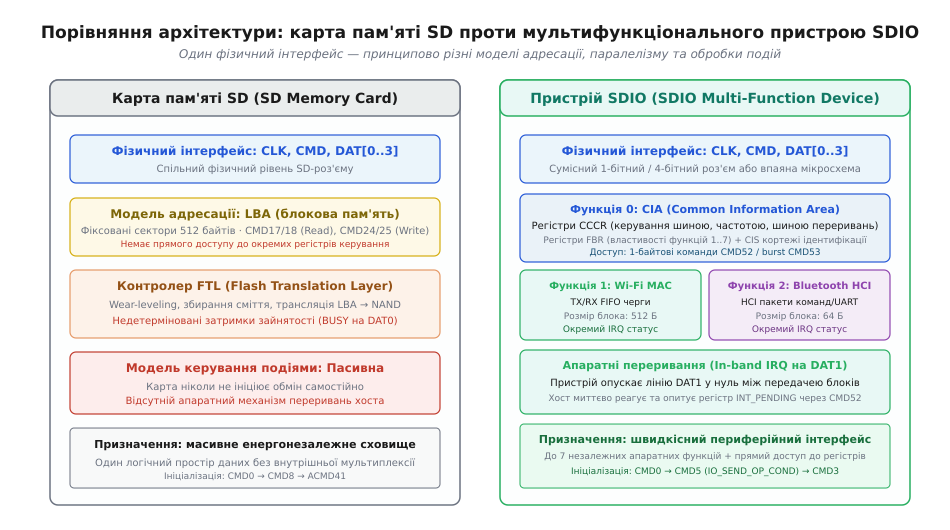
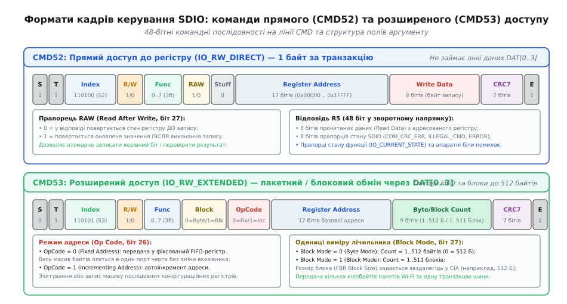
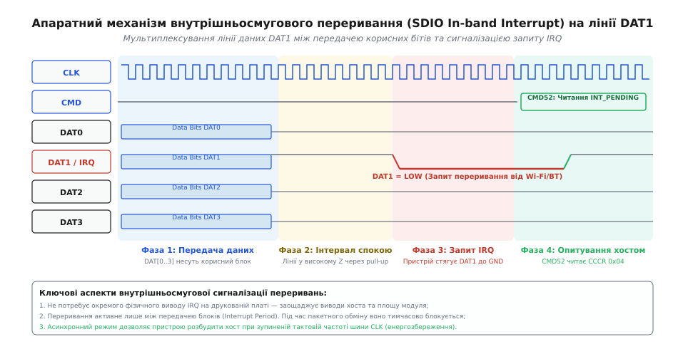
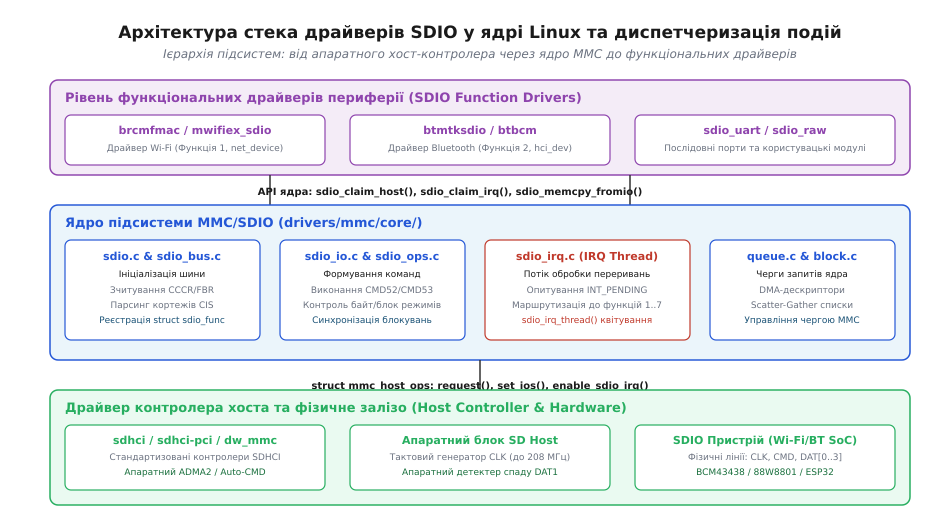

# Шина SDIO

<preknowlist>
- [Шина SPI](root:com-devices/spi-bus) — синхронний послідовний інтерфейс із тактуванням (SCLK) та окремими лініями даних.
- [Пакетне зчитування регістрів](root:com-devices/burst-read) — автоінкремент покажчика адреси та неперервна передача даних за один транзакційний заголовок.
- [Регістрова карта](root:com-devices/register-map) — організація пам'яті керування, простори адрес та бітові поля конфігурації.
- [FIFO-регістр](root:com-devices/fifo-register) — буферизація черг байтів для узгодження швидкостей між апаратним контролером та шиною.
</preknowlist>

Підключення швидкісного бездротового модуля Wi-Fi стандарту 802.11n/ac або стільникового модема до мікропроцесора вбудованої системи через традиційні інтерфейси UART або SPI призводить до критичного падіння пропускної здатності та перевантаження центрального процесора. Послідовний порт UART на типовій швидкості 3 Мбіт/с витрачає понад 4 мілісекунди на передачу одного мережевого кадру Ethernet розміром 1500 байтів, обмежуючи реальну швидкість зв'язку рівнем 0.35 МБ/с. Шина SPI на частоті 40 МГц теоретично забезпечує до 5 МБ/с, проте відсутність стандартизованого протоколу мультиплексування потоків вимагає виділення окремих виводів вибору кристала (CS) та ліній апаратних переривань (IRQ) для кожної функції мікросхеми, а ручне опитування стану буферів генерує до 100 000 переривань ядра щосекунди.

Спроба передати довільні потоки даних через стандартну шину карт пам'яті SD Memory також зазнає невдачі: протокол пам'яті жорстко прив'язаний до адресації фіксованих блоків по 512 байтів (LBA, Logical Block Addressing). Щоб зчитати 1 байт статусу черги давача, хост змушений ініціювати транзакцію зчитування повного сектора, а внутрішній контролер флешпам'яті вносить недетерміновані затримки тривалістю в десятки мілісекунд під час виконання операцій вирівнювання зносу (wear-leveling) та збирання сміття у NAND-комірках.

Для вирішення цієї інженерної суперечності асоціація SD Card Association (SDA) розробила специфікацію **SDIO** (Secure Digital Input/Output). Інтерфейс SDIO зберіг фізичний рівень та часові діаграми шини SD, але повністю перетворив протокольний рівень на універсальну, масштабовану системну шину з байтовою адресацією регістрів, одночасною підтримкою до 7 незалежних логічних функцій на одному кристалі та механізмом внутрішньосмугової сигналізації переривань через спільну лінію даних.

---

## Відмінність SDIO від карт пам'яті SD: архітектурна трансформація

Фізично інтерфейс SDIO використовує той самий набір сигнальних ліній, що й класична картка пам'яті SD: лінію тактового сигналу (CLK), двонаправлену лінію команд і відповідей (CMD) та 4-бітну паралельну шину даних (DAT0, DAT1, DAT2, DAT3). Завдяки цьому пристрої SDIO можуть підключатися як до розпаяних на платі мікропроцесорних контролерів MMC/SD, так і до стандартних зовнішніх слотів SD/microSD.

Проте логічна модель та поведінка контролера на шині докорінно відрізняються від накопичувачів пам'яті.


*Порівняння архітектури: карта пам'яті SD з блоковою моделлю LBA проти мультифункціонального пристрою SDIO з байтовою адресацією та внутрішньосмуговими перериваннями*

У картці пам'яті хост взаємодіє з єдиним масивом енергонезалежних секторів через команди `CMD17`/`CMD18` (читання одиночного або послідовних блоків) та `CMD24`/`CMD25` (запис блоків). Картка є суто пасивним пристроєм: вона ніколи не ініціює обмін самостійно, а у разі внутрішньої зайнятості тримає лінію DAT0 на низькому рівні (`BUSY`), блокуючи подальші команди хоста.

На противагу пам'яті, пристрій SDIO функціонує як багатофункціональний периферійний концентратор (Multi-Function Peripheral):

1. **Байтова та регістрова адресація:** замість номерів секторів LBA хост адресує безпосередні зміщення регістрів (від `0x00000` до `0x1FFFF`) всередині кожної функції. Доступний як атомарний 1-байтовий доступ, так і пакетний блоковий обмін довільної довжини.
2. **Паралельне існування кількох функцій (Functions 1..7):** один фізичний модуль (наприклад, комбінований чип Wi-Fi + Bluetooth + GPS) надає хосту три незалежні віртуальні пристрої, кожен з яких має власні буфери FIFO, конфігураційні регістри, параметри швидкості та маски переривань.
3. **Активна сигналізація подій (In-band Interrupts):** периферійний пристрій самостійно сигналізує операційній системі про прийом радіопакета або готовність даних через стягування лінії DAT1 до землі у проміжках між передачею блоків.

Історичний процес заміни громіздких 50-контактних карт розширення CompactFlash на компактний стандарт SDIO у кишенькових комп'ютерах та смартфонах детально викладено у нарисі про [історію стандартизації SDIO та еволюцію бездротових модулів](root:com-devices/sdio-bus/hist-sdio-evolution.md).

---

## Ієрархія логічних функцій: простір CIA та користувацькі пристрої

Кожен пристрій SDIO має строго стандартизовану ієрархічну структуру пам'яті, поділену на вісім можливих логічних функцій: обов'язкову службову **Функцію 0 (Function 0 CIA)** та від однієї до семи користувацьких **Функцій 1..7 (Functions 1..7)**.

```
                  ┌────────────────────────────────────────┐
                  │          Фізичний чип SDIO             │
                  ├────────────────────────────────────────┤
                  │  Function 0: CIA (Common Information)  │
                  │   ├── CCCR (0x00000 .. 0x00013)        │
                  │   ├── FBR  (0x00100 .. 0x007FF)        │
                  │   └── CIS  (0x00800 .. 0x1FFFF)        │
                  ├────────────────────────────────────────┤
                  │  Function 1: Wi-Fi 802.11ac MAC/PHY    │
                  │   ├── TX / RX FIFO черги (0x00050)     │
                  │   └── Регістри керування радіотрактом  │
                  ├────────────────────────────────────────┤
                  │  Function 2: Bluetooth 5.2 HCI         │
                  │   ├── UART-емуляція / HCI пакети       │
                  │   └── Регістри стану з'єднання         │
                  └────────────────────────────────────────┘
```

### Функція 0: Загальна інформаційна зона CIA (Common Information Area)

Функція 0 реалізується апаратною логікою інтерфейсного ядра пристрою і доступна завжди, незалежно від стану живлення користувацьких функцій. Простір CIA містить три ключові структурні блоки:

1. **CCCR (Card Common Control Registers, адреси `0x00000`–`0x000FF`):**
   Регістри загального конфігурування карти. Тут задається версія специфікації SDIO, здійснюється програмне скидання модуля (`RES`), вмикається 4-бітний режим шини (`BUS_WIDTH`), активуються та деактивуються живлення окремих функцій (`IO_ENABLE`), перевіряється їхня готовність (`IO_READY`) та адмініструються внутрішньосмугові переривання (`INT_ENABLE`, `INT_PENDING`).
   
   Особливу роль відіграє регістр `CARD_CAPABILITY` (CCCR `0x08`), який визначає розширені апаратні можливості пристрою:
   - `SMB` (Support Multi-Block): здатність передавати кілька блоків за одну команду `CMD53`;
   - `SRW` (Support Read Wait): підтримка зупинки потоку зчитування без розриву з'єднання;
   - `SBS` (Support Bus Suspend): здатність тимчасово призупинити тривалий фоновий обмін однієї функції для термінового обслуговування переривання іншої функції;
   - `S4MI` та `E4MI` (Enable 4-bit Mode Interrupt): дозвіл генерації переривань безпосередньо під час багатоблокової передачі даних.

2. **FBR (Function Basic Registers, адреси `0x00100`–`0x007FF`):**
   Сім стандартизованих таблиць по 256 байтів для кожної з функцій 1..7 (базова адреса блоку для функції `n` дорівнює `0x00100 · n`). Кожен блок FBR повідомляє хосту стандартизований клас інтерфейсу (наприклад, `0x1` — UART, `0x2` — Bluetooth, `0x7` — Wi-Fi), зберігає покажчик на розширену інформаційну структуру функції та містить 16-бітний регістр розміру блока (Block Size).
   
   Крім того, регістри FBR підтримують область зберігання коду **CSA (Code Storage Area)**: через виділене вікно регістрів хост може завантажити базову мікропрограму (firmware) у внутрішню пам'ять модуля ще до того, як основна логіка функції буде активована та вийде зі стану скидання.

3. **CIS (Card Information Structure, адреси `0x00800`–`0x1FFFF`):**
   Послідовний ланцюжок кортежів (Tuples), що містить паспортні характеристики модуля: унікальний код виробника та ідентифікатор моделі (`CISTPL_MANFID`), вимоги до напруги та струму живлення (`CISTPL_FUNCE`), граничні часові затримки перемикання станів та максимальну підтримувану частоту шини.

### Функції 1..7: Незалежні периферійні пристрої

Кожна користувацька функція отримує власний ізольований адресний простір обсягом 128 кілобайтів (адреси `0x00000`–`0x1FFFF`). Внутрішня схемотехніка функції повністю визначається виробником мікросхеми.

Наприклад, у дводіапазонному бездротовому модулі:
- **Функція 1 (Wi-Fi):** простір адрес відображається на порти прямого доступу до апаратних дескрипторів пакетів DMA. Запис масиву байтів за фіксованою адресою `0x00050` передає сформований пакет IEEE 802.11 безпосередньо у внутрішній передавальний FIFO-буфер трансивера.
- **Функція 2 (Bluetooth):** адресує регістри контролера HCI (Host Controller Interface), емулюючи високошвидкісний послідовний порт для передачі команд ініціалізації з'єднання та аудіопотоків A2DP.

Операційна система керує живленням кожної функції окремо: якщо Bluetooth не використовується, драйвер скидає біт у регістрі `IO_ENABLE`, і внутрішній стабілізатор знеструмлює відповідний радіоблок, зберігаючи працездатність каналу Wi-Fi.

Повний побітовий опис кожного регістру CCCR, таблиць FBR та структур кортежів CIS наведено у [довіднику регістрової карти та протоколу SDIO](root:com-devices/sdio-bus/api-sdio-linux.md).

---

## Протокольні команди: прямий доступ CMD52 та розширений обмін CMD53

Для забезпечення низьких затримок керування та високої швидкості потокової передачі даних специфікація SDIO ввела дві фундаментальні команди: `CMD52` та `CMD53`.


*Структура бітових полів 48-бітних команд: прямий 1-байтовий доступ CMD52 на лінії CMD та блоковий burst-обмін CMD53 через лінії DAT[0..3]*

### Прямий доступ до регістрів: CMD52 (IO_RW_DIRECT)

Команда `CMD52` є базовим інструментом опитування та конфігурації. Вона передає рівно один байт даних в одному напрямку за один 48-бітний командний цикл.

Транзакція виконується виключно по сигнальній лінії CMD і не потребує відкриття ліній DAT[0..3]. У полі аргументу хост вказує:
- напрямок операції (`R/W`: `0` — читання, `1` — запис);
- номер функції (`0`..`7`);
- 17-бітну адресу цільового регістру (`0x00000`–`0x1FFFF`);
- прапорець `RAW` (Read After Write: при значенні `1` пристрій повертає у відповіді нове значення регістру одразу після запису, що забезпечує атомарну перевірку без повторного читання);
- 8 бітів даних для запису.

У відповідь пристрій надсилає 48-бітний пакет R5, який містить 8 бітів прочитаних даних та 8 бітів діагностичних прапорців стану:
- `COM_CRC_ERROR`: помилка контрольної суми CRC7 отриманої команди;
- `ILLEGAL_COMMAND`: спроба виклику забороненої команди або звернення до вимкненої функції;
- `IO_CURRENT_STATE`: стан внутрішнього автомата станів (Dis/Cmd/Trn);
- `FUNCTION_NUMBER_ERROR`: адресація неіснуючої функції;
- `OUT_OF_RANGE`: вихід адреси за межі фізично реалізованої пам'яті.

### Розширений пакетний доступ: CMD53 (IO_RW_EXTENDED)

Команда `CMD53` призначена для високошвидкісного переміщення масивів даних (мережевих пакетів, блоків прошивки) між системною оперативною пам'яттю хоста та внутрішніми буферами пристрою. Сама команда передається по лінії CMD і задає правила наступної передачі, після чого по лініях даних DAT[0..3] починається високошвидкісний потік.

`CMD53` підтримує два критично важливі режими адресації та дві одиниці вимірювання обсягу:

1. **Режим адреси (Op Code, біт 34):**
   - `Op Code = 0 (Fixed Address / FIFO Mode):` операція виконується за фіксованою адресою. Усі байти потоку спрямовуються в один і той самий апаратний порт FIFO (наприклад, вікно приймання пакетів). Внутрішній лічильник адреси пристрою не змінюється під час передачі.
   - `Op Code = 1 (Incrementing Address Mode):` автоінкремент адреси. Після передачі кожного байта покажчик зміщується вперед, що дозволяє за один пакет зчитати або записати суцільний масив конфігураційної пам'яті чи таблицю калібрувань радіотракту.
2. **Одиниці обсягу передачі (Block Mode, біт 35):**
   - `Block Mode = 0 (Byte Mode):` передача від 1 до 512 байтів (поле `Count` від `1` до `512`, де значення `0` кодує рівно 512 байтів). Цей режим використовується для коротких дескрипторів або заголовків пакетів, не кратних розміру сектора.
   - `Block Mode = 1 (Block Mode):` передача від 1 до 511 блоків фіксованого розміру (наприклад, 3 блоки по 512 байтів для передачі кадру Ethernet MTU). Кожен блок передається з окремими контрольними сумами CRC16 на кожній із 4 ліній даних, що дозволяє локалізувати поодинокі збої на платі.

### Послідовність початкової ініціалізації шини

Процедура розпізнавання пристрою SDIO на шині починається зі скидання `CMD0`, після чого хост надсилає спеціальну команду опитування робочих умов `CMD5` (`IO_SEND_OP_COND`):

```
Хост                                     SDIO Модуль
 │                                            │
 ├────────── CMD0 (Go Idle State) ───────────►│ (Скидання шини)
 │                                            │
 ├────────── CMD5 (Опитування OCR) ──────────►│ (Запит діапазонів напруг)
 │◄───────── Відповідь R4 (I/O Ready) ────────┤ (Повертає к-ть функцій 1..7)
 │                                            │
 ├────────── CMD3 (Send Relative Addr) ──────►│ (Запит адреси карти RCA)
 │◄───────── Відповідь R6 (Нова RCA) ─────────┤
 │                                            │
 ├────────── CMD7 (Вибір карти RCA) ─────────►│ (Перехід у стан Transfer)
 │                                            │
 ├────────── CMD52 (Читання CCCR 0x00) ──────►│ (Перевірка ревізії SDIO)
 │◄───────── Відповідь R5 (Значення 0x32) ────┤
```

Команда `CMD5` принципово відрізняє SDIO від карт пам'яті: звичайна пам'ять повертає помилку `ILLEGAL_COMMAND`, тоді як SDIO повертає відповідь R4 з кількістю активних функцій (біти 30:28) та прапорцем готовності системи живлення (біт 31).

---

## Апаратний механізм внутрішньосмугового переривання (SDIO In-band Interrupt)

Одним із головних обмежень стандартного 9-контактного слота SD була відсутність окремого виводу для передачі сигналу апаратного переривання від периферійного пристрою до процесора. Введення додаткового фізичного контакту зруйнувало б зворотну сумісність із наявними роз'ємами та материнськими платами.

Інженери консорціуму SDA вирішили цю проблему за допомогою **внутрішньосмугової сигналізації (In-band Signaling)**: функція передачі сигналу переривання була покладена на наявну сигнальну лінію **DAT1**.


*Часова діаграма роботи In-band Interrupt: пристрій стягує лінію DAT1 до рівня землі під час пауз між передачею блоків, ініціюючи транзакцію CMD52*

### Механізм роботи сигналізації на лінії DAT1

1. **Фаза передачі блоку:** коли лініями даних передається корисний блок пакета `CMD53`, лінія DAT1 функціонує як звичайна лінія передачі бітів даних `Data[1]`.
2. **Фаза переходу в стан спокою:** після передачі стопового біта блока шина переходить в інтервал спокою (Interrupt Period). Усі лінії даних переводяться у високий стан за допомогою зовнішніх підтягуючих резисторів (Pull-Up).
3. **Генерація запиту IRQ:** якщо будь-яка з функцій 1..7 потребує обслуговування (наприклад, приймальний FIFO-буфер Wi-Fi отримав новий пакет із радіоефіру), внутрішній тригер пристрою відкриває транзисторний ключ із відкритим колектором і **примусово стягує лінію DAT1 до рівня землі (GND)**.
4. **Реакція хост-контролера:** апаратний детектор спаду рівня в контролері SDHCI процесора фіксує низький стан лінії DAT1 і генерує системне переривання для ядра операційної системи.
5. **Опитування та очищення:** потік ядра надсилає швидку команду `CMD52` за адресою `0x05` у простір Функції 0 (читання регістра `INT_PENDING`). Отримавши 8-бітну маску, хост миттєво визначає, яка саме з функцій 1..7 згенерувала запит, і передає керування зареєстрованому обробнику відповідного драйвера. Після зчитування даних із FIFO пристрій відпускає лінію DAT1, і вона повертається у високий рівень.

### 1-бітний проти 4-бітного режиму переривань

- **У 1-бітному режимі шини (1-bit Mode):** лінія DAT0 використовується виключно для передачі даних, а лінія DAT1 повністю вивільняється і працює як **постійна виділена апаратна лінія переривання** (Dedicated Interrupt Line). У цьому режимі периферія може виставляти сигнал IRQ у будь-який момент часу, навіть під час активної передачі блоку даних по DAT0.
- **У 4-бітному режимі шини (4-bit Mode):** лінія DAT1 мультиплексується між передачею бітів даних та сигналізацією переривання. За замовчуванням периферія має право стягувати DAT1 лише у проміжках між блоками (Interrupt Period). Проте якщо в регістрі `CARD_CAPABILITY` встановлено прапорець `E4MI` (Enable 4-bit Mode Interrupt), пристрій отримує право виставляти переривання у спеціальних часових вікнах між пакетами без очікування повного завершення всієї багатоблокової транзакції.

### Синхронний та асинхронний режими переривання

Специфікація SDIO визначає два режими обробки переривань:

- **Синхронний режим (Synchronous Interrupt):** активний під час звичайної роботи шини. Хост-контролер опитує стан лінії DAT1 за кожним наростаючим фронтом тактового сигналу `CLK` у періодах спокою між командами.
- **Асинхронний режим (Asynchronous Interrupt):** критично важливий для енергозбереження мобільних пристроїв. Коли процесор переходить у стан глибокого сну (Suspend to RAM), генератор тактової частоти шини SDCLK повністю вимикається для економії заряду акумулятора. Пристрій SDIO, зафіксувавши низький рівень активності, перемикає лінію DAT1 у режим асинхронного тригера. При надходженні радіосигналу Wake-on-WLAN модуль стягує DAT1 до нуля, що викликає асинхронне пробудження хост-контролера та відновлення подачі тактових імпульсів `CLK`.

---

## Стек драйверів SDIO в ядрі Linux

У ядрі Linux підтримка інтерфейсу SDIO реалізована як невіддільна частина підсистеми MMC (MultiMediaCard/SD/SDIO Subsystem) у каталозі `drivers/mmc/core/`. Архітектура стека побудована за суворою модульною трирівневою моделлю.


*Архітектура підсистеми SDIO у ядрі Linux: від драйвера апаратного хоста до функціональних драйверів бездротових адаптерів*

### Структура підсистеми ядра

1. **Драйвер хост-контролера (Host Controller Driver):**
   Модулі `sdhci.c`, `sdhci-pci.c`, `dw_mmc.c` керують конкретним апаратним контролером процесора (SDHCI, DesignWare MMC). Вони налаштовують дільники частоти генератора CLK, конфігурують лінії введення-виведення, керують напругою живлення та програмують ланцюжки дескрипторів прямого доступу до пам'яті ADMA2.
2. **Ядро підсистеми MMC/SDIO (Core Layer):**
   - `sdio.c` та `sdio_bus.c`: реалізують протокол виявлення (Enumeration), читання структур CCCR/FBR, парсинг кортежів CIS та реєстрацію логічних пристроїв `struct sdio_func` на віртуальній шині `sdio_bus_type`.
   - `sdio_io.c` та `sdio_ops.c`: реалізують функції формування та відправки команд `CMD52` та `CMD53`, автоматично обираючи між байтовим і блоковим режимами, розбиваючи великі запити на фрагменти розміром `func->cur_blksize` та транслюючи списки розсіювання/збирання (Scatter-Gather Lists) структури `struct mmc_data` у дескриптори DMA.
   - `sdio_irq.c`: керує потоком диспетчеризації переривань `sdio_irq_thread`, що опитує регістри `INT_PENDING` і маршрутизує події до зареєстрованих обробників.
3. **Функціональні драйвери пристроїв (SDIO Function Drivers):**
   Клієнтські драйвери конкретних периферійних модулів: `brcmfmac` (драйвер Wi-Fi модулів Broadcom/Cypress), `mwifiex_sdio` (модулі Marvell/NXP), `btmtksdio` (Bluetooth-модулі MediaTek).

### Життєвий цикл функціонального драйвера

Клієнтський драйвер описує підтримувані ідентифікатори обладнання через таблицю `sdio_device_id` та реєструється у підсистемі ядра за допомогою макросу `module_sdio_driver()`:

```c
static const struct sdio_device_id brcmf_sdio_ids[] = {
    { SDIO_DEVICE(SDIO_VENDOR_ID_BROADCOM, SDIO_DEVICE_ID_BROADCOM_43430) },
    { SDIO_DEVICE(SDIO_VENDOR_ID_CYPRESS,  SDIO_DEVICE_ID_CYPRESS_43455)  },
    { /* кінцевий нульовий елемент */ }
};
MODULE_DEVICE_TABLE(sdio, brcmf_sdio_ids);

static struct sdio_driver brcmf_sdiod_driver = {
    .name     = "brcmfmac",
    .id_table = brcmf_sdio_ids,
    .probe    = brcmf_sdiod_probe,
    .remove   = brcmf_sdiod_remove,
};
```

Коли ядро виявляє на шині функцію з відповідним кодом виробника (Vendor ID) та моделі (Device ID), викликається функція `probe`:

1. **Захоплення шини:** драйвер викликає `sdio_claim_host(func)`, блокуючи м'ютекс хост-контролера для ексклюзивного доступу.
2. **Активація функції:** виклик `sdio_enable_func(func)` встановлює біт у регістрі `IO_ENABLE` (CCCR `0x02`) та очікує підтвердження готовності в `IO_READY`.
3. **Налаштування розміру блока:** виклик `sdio_set_block_size(func, 512)` програмує 512-байтові блоки у регістрі FBR функції.
4. **Реєстрація обробника переривань:** виклик `sdio_claim_irq(func, my_irq_handler)` активує маску переривання у регістрі `INT_ENABLE` (CCCR `0x04`) та закріплює функцію зворотного виклику за даною функцією.
5. **Звільнення шини:** виклик `sdio_release_host(func)` повертає контроль над контролером системному диспетчеру.

Практичний приклад створення власного клієнтського драйвера та симулятора обміну даними наведено у [проекті програмного драйвера та емулятора SDIO](root:com-devices/sdio-bus/proj-sdio-driver.md).

---

## Взаємодія з мережевим стеком ядра та прямий доступ до пам'яті (Scatter-Gather DMA)

Висока продуктивність бездротових адаптерів у Linux досягається завдяки тісній інтеграції підсистеми SDIO з мережевим стеком ядра (`net_device`) та механізмом прямого доступу до пам'яті (DMA).

### Трансляція мережевих буферів sk_buff у дескриптори DMA

Коли мережевий стек надсилає пакет через інтерфейс `ndo_start_xmit()`, дані розміщуються у структурі `struct sk_buff`. Мережевий кадр Ethernet складається з 14 байтів заголовка канального рівня, 20 байтів IP-заголовка, 20 байтів TCP-заголовка та корисного навантаження (разом до 1514 байтів).

```
                      ┌────────────────────────────────────────┐
                      │    sk_buff (Мережевий кадр 1514 Б)     │
                      └───────────────────┬────────────────────┘
                                          │
                        sg_init_table()   │ dma_map_sg()
                                          ▼
                      ┌────────────────────────────────────────┐
                      │     struct scatterlist (SG List)       │
                      │  [0]: Базова адреса буфера (1514 Б)    │
                      └───────────────────┬────────────────────┘
                                          │
                        Розбиття на блоки │ BlkSize = 512 Б
                                          ▼
        ┌──────────────────────────────────────────────────────────────────┐
        │ Блок 1 (512 Б) │ Блок 2 (512 Б) │ Блок 3 (512 Б, з них 22 Б Pad) │
        └──────────────────────────────────────────────────────────────────┘
                                          │
                                          ▼ CMD53 Block Mode (Count = 3)
                      ┌────────────────────────────────────────┐
                      │    Апаратний ADMA2 Контролер SDHCI     │
                      └────────────────────────────────────────┘
```

1. **Побудова списку розсіювання/збирання (Scatterlist):** драйвер перетворює фрагменти пам'яті `sk_buff` у масив структур `struct scatterlist` за допомогою функції `sg_init_table()`.
2. **DMA-мапінг та когерентність кешу:** виклик `dma_map_sg()` синхронізує кеш-пам'ять процесора та генерує фізичні шинні адреси для контролера прямого доступу до пам'яті.
3. **Обробка некратних розмірів:** якщо довжина кадру (1514 байтів) не кратна розміру блока (512 байтів), драйвер передає 3 блоки (1536 байтів), де останні 22 байти заповнюються нулями. Апаратний MAC-контролер бездротового модуля на стороні приймача відсікає надлишкові байти заповнення на основі поля довжини, вказаного в заголовку першого блока.

---

## Мультиплексування шини та ієрархія відновлення після збоїв

У комбінованих мікросхемах (Wi-Fi + Bluetooth Combo SoC) обидва бездротові інтерфейси змагаються за спільну 4-бітну фізичну шину SDIO.

### Арбітраж трафіку між функціями

Якщо під час завантаження великого файлу через Wi-Fi (Функція 1) користувач підключає Bluetooth-навушники (Функція 2), підсистема ядра Linux забезпечує чесний розподіл пропускної здатності за допомогою механізму м'ютексів `sdio_claim_host()`:

1. **Пакетне чергування:** блокові передачі `CMD53` розбиваються на кванти (наприклад, по 4–8 блоків за транзакцію). Після завершення кожного кванта драйвер Wi-Fi тимчасово відпускає блокування шини викликом `sdio_release_host()`.
2. **Пріоритетне обслуговування аудіо:** якщо драйвер Bluetooth фіксує переривання на DAT1 про готовність черги аудіопотоку реального часу (A2DP), він негайно захоплює шину, виконує коротку передачу `CMD53` (64–128 байтів) і повертає шину для передачі масивного трафіку Wi-Fi. Це повністю виключає заїкання та переривання звуку в навушниках.

### Трирівнева ієрархія відновлення після збоїв (Reset Hierarchy)

При виникненні сильних електромагнітних завад (наприклад, імпульсних наведень від вихідного каскаду підсилювача потужності антени PA) шина SDIO може втратити синхронізацію або заблокуватися лінією `BUSY`. Драйвери ядра застосовують трирівневий каскад відновлення:

- **Рівень 1 (Функціональне скидання через IO_ABORT):** надсилання команди `CMD52` у регістр CCCR `0x06` із номером завислої функції. Це скидає вказівники FIFO конкретної функції без перезавантаження сусідніх бездротових служб.
- **Рівень 2 (Програмне скидання карти через RES):** запис `1` у біт `RES` регістра CCCR `0x06`. Це скидає всі конфігураційні регістри CCCR/FBR до початкових значень, після чого драйвер повторно виконує процедуру ініціалізації.
- **Рівень 3 (Апаратне пересмикування живлення через GPIO):** більшість вбудованих модулів (наприклад, Broadcom BCM43438 на платах Raspberry Pi) мають окремі фізичні виводи апаратного скидання живлення `WL_REG_ON` та `BT_REG_ON`, підключені до GPIO процесора. Якщо модуль перестає відповідати на команди лінії CMD, ядро примусово опускає `WL_REG_ON` у нуль на 50 мілісекунд, повністю знеструмлюючи аналогову та цифрову логіку мікросхеми.

---

## Швидкісні режими, фізичний рівень та цілісність сигналів

Зі зростанням швидкостей бездротових стандартів специфікація SDIO поетапно впроваджувала швидкісніші фізичні режими роботи, підвищуючи частоту та оптимізуючи сигнальні рівні напруги.

| Режим роботи SDIO | Версія стандарту | Тактова частота CLK | Напруга сигналів I/O | Режим вибірки даних | Пропускна здатність (4-bit) |
| :--- | :--- | :--- | :--- | :--- | :--- |
| **Default Speed (DS)** | SDIO 1.10 | До 25 МГц | 3.3 В | SDR (1 біт за такт) | **12.5 МБ/с** (100 Мбіт/с) |
| **High Speed (HS)** | SDIO 2.00 | До 50 МГц | 3.3 В | SDR (1 біт за такт) | **25.0 МБ/с** (200 Мбіт/с) |
| **UHS-I SDR50** | SDIO 3.00 | До 100 МГц | 1.8 В | SDR (1 біт за такт) | **50.0 МБ/с** (400 Мбіт/с) |
| **UHS-I DDR50** | SDIO 3.00 | До 50 МГц | 1.8 В | DDR (2 біти за такт) | **50.0 МБ/с** (400 Мбіт/с) |
| **UHS-I SDR104** | SDIO 3.00 | До 208 МГц | 1.8 В | SDR (1 біт за такт) | **104.0 МБ/с** (832 Мбіт/с) |

### Перемикання на низьковольтний режим 1.8 В (UHS-I)

Робота на тактових частотах понад 50 МГц (режими UHS-I) при напрузі 3.3 В стає енергетично невигідною та генерує значні електромагнітні завади для радіочастотних антен бездротового модуля. Тому специфікація SDIO 3.00 ввела процедуру перемикання напруги сигнальних ліній з 3.3 В на 1.8 В за допомогою спеціальної послідовності `CMD11` (`VOLTAGE_SWITCH`):

```
Хост                                     SDIO Модуль
 │                                            │
 ├────────── CMD11 (Voltage Switch) ─────────►│ (Запит перемикання на 1.8 В)
 │◄───────── Відповідь R1 (Готовність) ───────┤
 │                                            │
 ├── (Зупиняє тактову частоту CLK) ──────────┤ (Пристрій стягує DAT[0..3] до GND)
 ├── (Перемикає стабілізатор хоста на 1.8 В)  │
 ├── (Очікує стабілізації напруги 10 мс) ─────┤
 ├── (Відновлює подачу CLK на 1.8 В) ────────►│ (Пристрій відпускає DAT[0..3] у 1)
```

Якщо протягом 1 мілісекунди всі чотири лінії даних повертаються у високий логічний рівень 1.8 В, хост переходить до процедури калібрування фази затримок (**Tuning Sequence**). Під час тюнінгу хост надсилає команду `CMD19`, у відповідь на яку пристрій передає фіксований 64-байтовий тестовий патерн. Змінюючи затримку вхідного стробування в діапазоні від 0 до 31 кроку, хост-контролер знаходить оптимальне фазове вікно вибірки сигналу на частоті 208 МГц.

> 🔧 **Навіщо це в реальній розробці.**
> Під час проектування системних друкованих плат (наприклад, промислових контролерів або автономних модулів зв'язку) доріжки шини SDIO між процесором та чипом Wi-Fi вимагають строгого дотримання правил високочастотного трасування:
> 1. **Вирівнювання довжин трас (Length Matching):** різниця довжин між тактовою лінією `CLK` та будь-якою з ліній даних `DAT[0..3]` або команд `CMD` не повинна перевищувати `±1.0 мм` (що відповідає фазовому розбігу менш як 70 пс). На частоті 208 МГц тривалість одного тактового імпульсу становить лише 4.8 наносекунди, і навіть мінімальний фазовий зсув призведе до руйнування вікна зчитування даних (Setup/Hold Time Violations) та постійних апаратних помилок CRC16.
> 2. **Контрольований імпеданс:** сигнальні лінії розводяться у внутрішніх або зовнішніх шарах плати із хвильовим опором `Z₀ = 50 Ом` відносно суцільного шару заземлення (GND plane) без розривів опорної площини під трасами.
> 3. **Послідовне демпфування:** безпосередньо біля вихідних контактів процесора хоста встановлюють послідовні демпферні резистори номіналом `22–33 Ом`, які гасять паразитні високочастотні відбиття та дзвін на фронтах імпульсів, запобігаючи проникненню перешкод у чутливий радіотракт Wi-Fi/Bluetooth.
