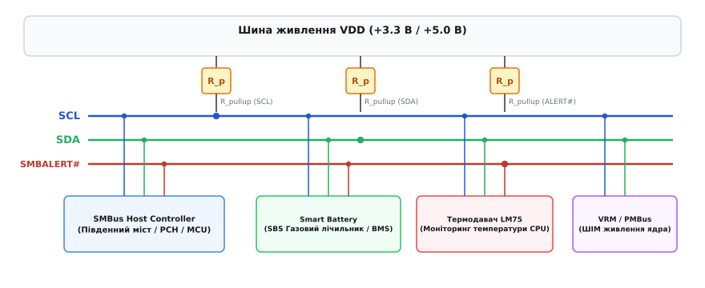
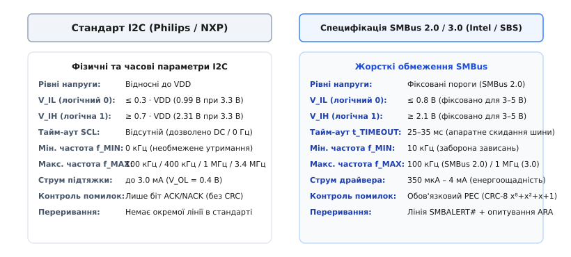
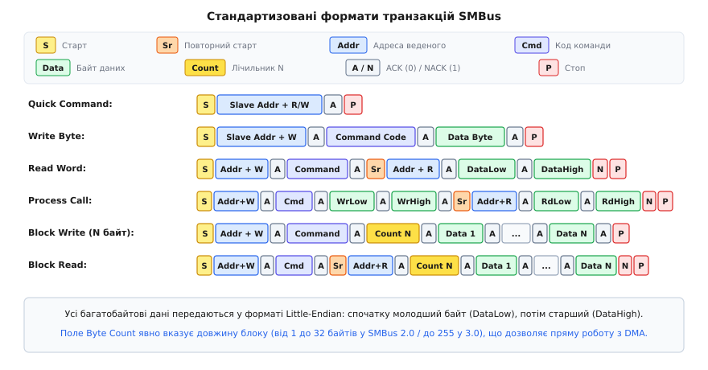
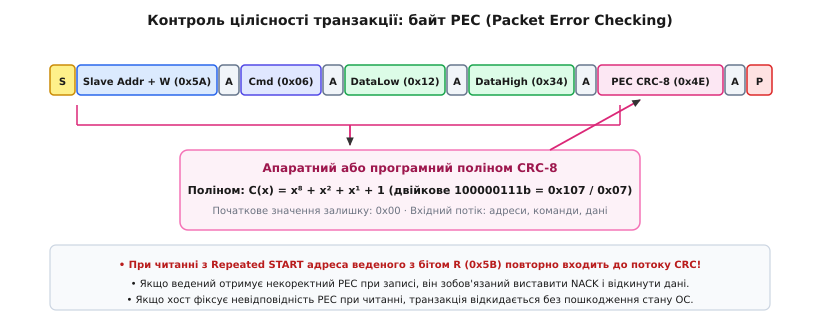
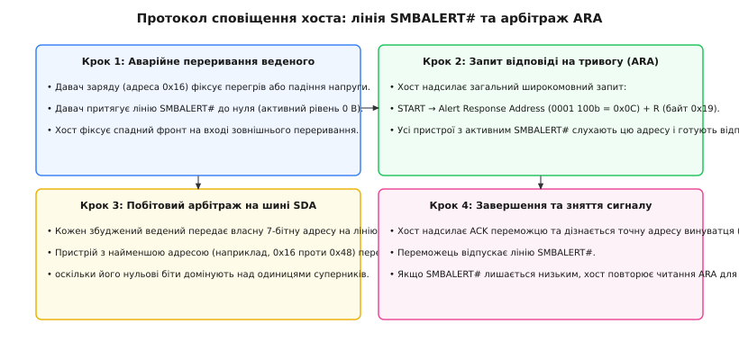

# Протокол SMBus: системна шина керування

<preknowlist>
* [Двопровідна шина I2C](topic:com-devices/i2c-bus)
* [Транзакція I2C](topic:com-devices/i2c-transaction)
* [Конфлікти ресурсів та зависання шини](topic:com-devices/bus-resource-conflicts)
* [Контрольна сума CRC](topic:com-modulation/crc)
</preknowlist>

Коли мікроконтролер керування живленням портативного комп'ютера опитує мікросхему інтелектуального акумулятора через класичну шину I2C, короткочасна завада на лінії тактування здатна перевести ведений пристрій у стан очікування наступного такту, в якому він нескінченно утримує лінію даних на нульовому рівні. У традиційній шині I2C відсутній будь-який часовий ліміт на утримання сигналів, тому таке зависання одного другорядного термодавача повністю блокує зв'язок із контролерами напруги процесора та системою охолодження, перетворюючи локальний збій на аварійне вимкнення всього пристрою. 

Для вирішення цієї фундаментальної проблеми компанії Intel та Duracell у 1995 році розробили специфікацію **SMBus** (*System Management Bus*). SMBus зберіг фізичну двопровідну топологію I2C із відкритим стоком, але докорінно перебудував електричні пороги, часові діаграми, структури пакетів та механізми обробки помилок, перетворивши відкриту шину на передбачувану системну магістраль діагностики, телеметрії та керування електроживленням.


*Архітектура системної шини SMBus та підключення периферійних компонентів*

Детальний контекст появи шини, розробку стандарту Smart Battery System та еволюцію специфікацій від версії 1.0 до 3.2 розібрано в історичній довідці [Історія виникнення SMBus](topic:com-devices/smbus-bus-design/hist-smbus.md).

---

### Фізичні та часові відмінності від класичного I2C

Хоча шина SMBus використовує аналогічні сигнальні лінії **SDA** (*Serial Data*) та **SCL** (*Serial Clock*), її специфікація регламентує жорсткіші та стабільніші електричні й часові правила, які унеможливлюють невизначені стани на материнських платах.


*Порівняння електричних та часових параметрів I2C та SMBus*

#### 1. Фіксовані рівні напруг логічних станів
У стандартній специфікації I2C пороги логічного нуля та одиниці жорстко прив'язані до напруги живлення шини `V_DD`: вхідний низький рівень `V_IL ≤ 0.3 · V_DD`, а вхідний високий рівень `V_IH ≥ 0.7 · V_DD`. Якщо мікросхеми живляться від різних джерел (наприклад, хост-контролер від 3.3 В, а давач заряду від 5.0 В), виникає зона електричної невизначеності, яка вимагає обов'язкових двонапрямлених трансляторів рівнів.

Специфікація SMBus 2.0/3.0 усуває цю проблему, фіксуючи абсолютні пороги TTL-сумісного типу незалежно від напруги живлення шини (`V_DD` від 1.8 В до 5.0 В):
- **Максимальний рівень логічного 0 (`V_IL`):** не більше **0.8 В**;
- **Мінімальний рівень логічної 1 (`V_IH`):** не менше **2.1 В**;
- **Вихідний рівень низького стану (`V_OL`):** не більше **0.4 В** при струмі втікання 350 мкА (для класу низької потужності) або 4 мА (для класу високої потужності).

Це дозволяє пристроям із напругами живлення 3.3 В та 5.0 В безпечно працювати на спільній шині без додаткових перетворювачів напруги.

#### 2. Тайм-аут зависання шини `t_TIMEOUT`
Головною системною відмінністю SMBus є обов'язковий апаратний тайм-аут відновлення після збоїв **`t_TIMEOUT`**. Якщо будь-який пристрій утримує тактову лінію SCL (або лінію даних SDA) у стані логічного 0 довше ніж **25–35 мс**, усі вузли на шині зобов'язані:
1. Скинути внутрішній кінцевий автомат інтерфейсу (*Bus Interface State Machine*) у початковий стан;
2. Відпустити вихідні транзистори ліній SDA та SCL у високоімпедансний стан (Hi-Z);
3. Очистити біжучі буфери прийому й передачі та перейти в режим очікування нового сигналу СТАРТ.

Завдяки цьому тайм-ауту збій окремого веденого пристрою (наприклад, внутрішнє переривання в мікроконтролері або апаратний збій логіки) ніколи не блокує шину назавжди: через 35 мс шина повертається до високого рівня через резистори підтяжки, дозволяючи хосту продовжити опитування решти периферії.

#### 3. Обмеження мінімальної робочої частоти `f_MIN`
Оскільки в I2C відсутні будь-які обмеження на максимальну тривалість низького рівня SCL, ведений пристрій може утримувати тактову лінію (*Clock Stretching*) необмежений час, а ведучий може тактувати шину з частотою аж до частоти постійного струму (0 Гц).

В SMBus введено поняття мінімальної робочої частоти: **`f_MIN = 10 кГц`**. Якщо інтервал між тактовими імпульсами перевищує 100 мкс (а низький напівперіод перевищує 35 мс), спрацьовує лічильник скидання `t_TIMEOUT`. Максимальна тактова частота становить:
- **SMBus 1.0 / 2.0:** до 100 кГц (*Standard-mode*);
- **SMBus 3.0:** до 400 кГц (*Fast-mode*) та до 1 МГц (*Fast-mode Plus*);
- **SMBus 3.2:** підтримка режимів до 1 МГц із оптимізованим енергоспоживанням.

#### 4. Ліміти на розтягнення тактових імпульсів
SMBus жорстко регламентує, скільки часу ведений і ведучий мають право утримувати лінію SCL у нулі під час передачі одного кадру:
- **Кумулятивне розтягнення веденим (`t_LOW:SEXT`):** не більше **25 мс** на одне повідомлення (сума всіх утримань SCL веденим від СТАРТу до СТОПу);
- **Кумулятивне розтягнення ведучим (`t_LOW:MEXT`):** не більше **10 мс** на інтервал між окремими байтами кадру.

Якщо ведений пристрій перевищує цей ліміт (наприклад, завис під час тривалого обчислення даних або операції запису у внутрішню Flash-пам'ять), хост-контролер примусово формує сигнал СТОП або скидає інтерфейс.

---

### Набір протокольних транзакцій SMBus

На відміну від I2C, де протокол на рівні байтів не має фіксованого стандарту і кожен виробник мікросхем винаходить власний формат кадрів, SMBus стандартизує суворий набір транзакцій. Це дозволяє створювати універсальні апаратні хост-контролери (наприклад, інтегровані в південні мости чипсетів Intel/AMD або контролери BMC серверів), які самостійно виконують повні цикли обміну за одну команду центрального процесора.


*Формати стандартних транзакцій та сигналів підтвердження протоколу SMBus*

Повний технічний довідник бітових прапорців, діаграм та кодових констант для всіх видів транзакцій наведено у вставці [Специфікація транзакцій SMBus](topic:com-devices/smbus-bus-design/api-transactions.md).

#### 1. Quick Command (Швидка команда)
Складається виключно з адреси веденого пристрою та біта напрямку `R/W` без подальшої передачі даних. Використовується хостом для сканування активних пристроїв на шині або для простого однобітного керування (наприклад, увімкнення або вимкнення силового ключа живлення підсистеми).

#### 2. Send Byte та Receive Byte (Надіслати / Прийняти байт)
Транзакції передачі одного байта без зазначення номера регістра. При відправці (`Send Byte`) хост передає один байт команди; при читанні (`Receive Byte`) ведений повертає значення з поточного положення свого внутрішнього адресного покажчика.

#### 3. Write Byte та Write Word (Запис байта та 16-бітного слова)
Хост передає 8-бітний код команди або номер регістра (`Command Code`), після чого відправляє 8 або 16 бітів даних. В усіх 16-бітних транзакціях SMBus діє непорушне правило **Little-Endian**: молодший байт `DataLow` (біти 0–7) завжди передається на шину першим, а старший байт `DataHigh` (біти 8–15) — другим.

#### 4. Read Byte та Read Word (Читання байта та 16-бітного слова)
Двофазні складені транзакції:
1. **Фаза запису:** Хост генерує сигнал СТАРТ, передає адресу веденого з бітом `Wr = 0` та надсилає код потрібного регістра `Cmd Code`.
2. **Повторний старт:** Не звільняючи шину, хост формує повторний СТАРТ (*Repeated START* — `Sr`) і передає адресу веденого з бітом `Rd = 1`.
3. **Фаза читання:** Ведений передає один байт (Read Byte) або два байти `DataLow` та `DataHigh` (Read Word). Хост підтверджує кожен проміжний байт сигналом ACK, а після фінального байта виставляє NACK і генерує СТОП.

#### 5. Process Call (Процедурний виклик)
Атомарна операція взаємодії типу «запит-відповідь»: хост надсилає код команди та 16 біт вхідних параметрів, після чого через Repeated START негайно зчитує 16 біт обчисленого веденим результату. Це унеможливлює ситуацію, коли інший ведучий у багатомайстровій системі вклиниться між записом аргументів та зчитуванням відповіді.

#### 6. Block Write та Block Read (Блоковий запис та блокове зчитування)
Транзакції передачі масивів даних змінної довжини. Головна особливість блокових операцій SMBus — наявність обов'язкового поля **Byte Count** (лічильника байтів):
- При `Block Write` хост передає номер регістра, байт кількості даних N (від 1 до 32 у SMBus 2.0 або до 255 у SMBus 3.0), а потім рівно N байтів даних;
- При `Block Read` хост надсилає номер регістра, формує Repeated START, після чого ведений пристрій повертає свій байт лічильника N, а потім передає рівно N байтів даних.

Завдяки полю `Byte Count` контролери прямого доступу до пам'яті (DMA) та драйвери операційних систем знають точний розмір кадру без потреби попереднього опитування дескрипторів.

#### 7. Block Write-Block Read Process Call
Комбінована транзакція, що поєднує передачу блоку аргументів змінної довжини (із власним полем лічильника кількості байтів) та наступне зчитування блоку результату. Застосовується в протоколах криптографічної перевірки автентичності акумуляторів (*Challenge-Response Authentication*), де хост передає випадковий рядок запиту, а контролер батареї повертає обчислений електронний підпис або хеш.

#### 8. Host Notify Protocol (Протокол сповіщення хоста)
Унікальний механізм SMBus, що дозволяє веденому пристрою (наприклад, інтелектуальному зарядному пристрою або модулю аварійного живлення) самостійно ініціювати сеанс зв'язку. Ведений тимчасово перехоплює роль ведучого на шині та відправляє сповіщення про зміну стану на спеціальну зарезервовану системну адресу **SMBus Host Address (`0001 000b` = 0x08)**. Пакет містить власну апаратну адресу джерела та 16-бітний код події (наприклад, перехід на автономне живлення або виявлення перегріву батареї).

---

### Контроль цілісності: Packet Error Checking (PEC)

У серверних стійках, автомобільній електроніці та імпульсних блоках живлення електромагнітні наведені перешкоди від силових ключів здатні викликати хибне спрацьовування компараторів на лініях зв'язку. Якщо перешкода змінить біт у значенні напруги живлення ядра процесора, встановлюваному через цифровий регулятор VRM, мікропроцесор вийде з ладу через критичний перегрів або пробій транзисторів.

Для абсолютного захисту від спотворень специфікація SMBus 1.1 впровадила механізм **PEC** (*Packet Error Checking*).


*Механізм формування контрольної суми Packet Error Checking у транзакціях SMBus*

#### Математична модель PEC
Байт PEC є 8-бітним циклічним надлишковим кодом [CRC-8](topic:com-modulation/crc-algorithm), що обчислюється за незвідним поліномом:

`C(x) = x⁸ + x² + x¹ + 1` (шістнадцятковий коефіцієнт `0x07`)

Порядок розрахунку підпорядкований таким правилам:
- **Початковий стан регістру:** `0x00`;
- **Порядок надходження бітів:** старшим бітом уперед (*MSB first*);
- **Охоплення потоку:** обчислення здійснюється над **усіма** переданими байтами транзакції — адресою веденого з бітом напрямку, кодом команди, повторною адресою читання (у транзакціях із Repeated START), лічильником довжини та всіма байтами корисних даних.

Повний покроковий аналіз алгоритму, генерацію таблиць прискорення під час компіляції (`constexpr` LUT) та робочі модулі перевірки транзакцій розібрано у проектній вставці [Обчислення та перевірка PEC CRC-8](topic:com-devices/smbus-bus-design/proj-pec-crc8.md).

#### Протокол підтвердження при використанні PEC
- **При операціях запису (Write):** Хост передає обчислений байт PEC наприкінці повідомлення перед сигналом СТОП. Ведений пристрій апаратно перевіряє залишок. Якщо розрахований веденим CRC-8 не збігається з переданим байтом PEC, ведений зобов'язаний виставити сигнал **NACK** на 9-му такті після байта PEC, відкинути отримані дані й виставити біт внутрішньої помилки.
- **При операціях читання (Read):** Ведений пристрій самостійно обчислює CRC-8 від усього переданого повідомлення і транслює байт PEC хосту. Хост виставляє сигнал **ACK** на останньому байті даних, приймає байт PEC, перевіряє його збіг із власним накопиченим значенням і лише після цього генерує фінальний **NACK** та сигнал СТОП. Якщо сума не збіглася, драйвер хоста відкидає прочитані дані й виконує повтор транзакції.

---

### Асинхронні сповіщення: лінія SMBALERT# та протокол ARA

У класичній шині I2C відсутній механізм сигналізації переривань від ведених пристроїв. Щоб дізнатися, чи не перевищила температура критичний поріг, ведучий процесор змушений періодично опитувати всі термодавачі методом програмного опитування (*Polling*), що споживає енергію процесора та завантажує шину зайвим трафіком.

SMBus вирішує цю проблему за допомогою третього додаткового фізичного проводу — активної низьким рівнем лінії асинхронного переривання **SMBALERT#** та протоколу опитування **Alert Response Address (ARA)**.


*Послідовність обробки асинхронних переривань через лінію SMBALERT# та адресу Alert Response Address (ARA)*

#### Послідовність обслуговування переривання SMBALERT#

1. **Виникнення критичної події:** Пристрій-термодавач фіксує перегрів і притягує лінію SMBALERT# до нуля (завдяки виходу з відкритим стоком кілька ведених можуть одночасно притягувати одну лінію за схемою «Монтажне АБО»).
2. **Реакція хоста:** Сигнал переривання надходить на вхідний вивід переривання хост-контролера. Хост перериває поточні фонові задачі та ініціює транзакцію читання байта за спеціальною стандартизованою адресою **ARA — `0001 100b` (`0x0C`)**.
3. **Шинний арбітраж серед збуджених пристроїв:** Усі ведені, які виставили сигнал тривоги, відповідають сигналом ACK на адресу ARA. На наступних 8 тактах кожен збуджений ведений починає видавати на лінію SDA власну 7-бітну апаратну адресу.
4. **Визначення джерела за найменшою адресою:** Якщо одночасно спрацювали кілька давачів, перемагає пристрій із **найменшою числовою адресою** (наприклад, давач з адресою `0x18` переможе давач з адресою `0x48`, оскільки нулі в адресі `0x18` притягнуть лінію SDA до нуля, а пристрій `0x48` зафіксує колізію, вимкне свій передавач і поступиться шиною).
5. **Скидання тривоги:** Переможець отримує підтвердження від хоста, відпускає свій ключ лінії SMBALERT# і скидає внутрішній прапорець переривання.
6. **Повторне опитування:** Якщо лінія SMBALERT# залишається притягнутою до нуля іншими пристроями, хост негайно надсилає повторний запит до ARA, послідовно обслуговуючи всі джерела тривоги в порядку їхнього пріоритету.

---

### Динамічна конфігурація: протокол SMBus ARP

Коли на одній системній платі або в кошику серверного шасі встановлюються однакові модулі (наприклад, кілька однакових блоків живлення або планок пам'яті), їхні вбудовані контролери за замовчуванням мають ідентичні апаратні адреси I2C. У класичному I2C для розведення адрес інженерам доводилося встановлювати зовнішні перемикачі (DIP-світчі) або виділяти додаткові адресні виводи мікросхем `A0, A1, A2`.

Специфікація SMBus 2.0 впровадила протокол **Address Resolution Protocol (ARP)**, що реалізує механізм автоматичного конфігурування Plug-and-Play:
- Кожен ARP-сумісний пристрій містить незмінний 128-бітний унікальний ідентифікатор **UDID** (*Unique Device Identifier*), що кодує тип пристрою, код виробника (*Vendor ID*), модель чипа та заводський серійний номер.
- Під час завантаження системи хост звертається до зарезервованої адреси **SMBus Device Default Address (`1100 001b` = 0x61)**.
- За допомогою побітового арбітражу UDID хост послідовно вичитує ідентифікатори всіх підключених чипів і призначає кожному з них унікальну динамічну 7-бітну адресу на шині.

---

### Системна інтеграція: ACPI, Smart Battery та PMBus

Шина SMBus є наріжним каменем стандартів керування електроживленням та апаратної телеметрії в сучасних обчислювальних платформах:

#### 1. ACPI та взаємодія з Embedded Controller (EC)
У ноутбуках та робочих станціях контролер клавіатури та живлення (Embedded Controller / EC) підключений до шини SMBus як автономний хост. Коли операційна система викликає методи ACPI Control Method Battery (`_BST` — Battery Status, `_BIF` — Battery Information), драйвер ACPI звертається до EC через спільні порти вводу-виводу (I/O ports 0x62/0x66). EC виконує апаратні транзакції `Read Word` та `Block Read` за адресою `0x0B` (Smart Battery), вичитує напругу, струм і температуру, після чого повертає сформовану структуру дескрипторів операційній системі.

При переході ноутбука з живлення від мережі на автономну роботу контролер батареї виставляє в регістрі `BatteryStatus` (регістр 0x16) біт розряду `DISCHARGING` та генерує асинхронний пакет `Host Notify` на адресу `0x08`. Отримавши сповіщення, EC миттєво генерує системне переривання SCI (*System Control Interrupt*), спонукаючи драйвер ACPI оновити стан заряду в інтерфейсі операційної системи без постійного фонового опитування шини.

#### 2. Протокол керування силовими перетворювачами (PMBus)
Стандарт **PMBus** (*Power Management Bus*), розроблений консорціумом SMIF, використовує фізичний та канальний рівні SMBus версій 2.0/3.0 для цифрового керування багатофазними перетворювачами живлення процесорів (VRM), імпульсними стабілізаторами DC-DC та серверними блоками живлення:
- **Команди прямого регулювання:** Хост налаштовує вихідну напругу командою `VOUT_COMMAND` (код 0x21), встановлює поріг струмового захисту `IOUT_OC_FAULT_LIMIT` та зчитує миттєву споживану потужність `READ_PIN` / `READ_POUT`.
- **Діагностичний статус:** Регістр `STATUS_WORD` (код 0x79) транслює 16-бітну маску апаратних подій: біт 15 сигналізує про перенапругу на виході `VOUT_OV_FAULT`, біт 14 — про струмове перевантаження `IOUT_OC_FAULT`, біт 11 — про зникнення сигналу готовності живлення `POWER_GOOD#`, а біт 10 — про відмову вентилятора охолодження `FANS_FAULT`.
- **Захист у реальному часі:** При виникненні перевантаження за струмом контролер VRM миттєво притягує лінію SMBALERT# до нуля. Хост через опитування ARA дізнається адресу несправної фази живлення і протягом мікросекунд знижує тактову частоту процесора (*Thermal Throttling*) або вимикає аварійний канал.

---

### Фізичний рівень: розрахунок ємності та резисторів підтяжки

Шина SMBus використовує вихідні каскади типу «відкритий стік» (Open-Drain), де підйом лінії до логічної одиниці здійснюється пасивним підтягувальним резистором `R_PULLUP`. При проектуванні друкованих плат інженер зобов'язаний збалансувати два взаємовиключні фактори: струм споживання та швидкість наростання фронту сигналу.

#### 1. Обмеження сумарної ємності шини
Специфікація SMBus обмежує максимальну сумарну ємність шини значенням **`C_BUS ≤ 400 пФ`**. До цієї величини входять:
- Власна паразитна ємність доріжок друкованої плати (типово 1.5–2.5 пФ на кожен сантиметр траси);
- Вхідна ємність виводів підключених мікросхем (типово 7–10 пФ на кожен чип);
- Ємність рознімів та кабелів підключення батарейного блоку.

#### 2. Розрахунок діапазону опорів резисторів
- **Мінімальний опір (`R_MIN`):** визначається допустимим струмом втікання веденого пристрою `I_OL = 350 мкА` при напрузі насичення `V_OL = 0.4 В`. Для шини 3.3 В:
  `R_MIN = (3.3 В - 0.4 В) / 350 мкА = 8.28 кОм`
- **Максимальний опір (`R_MAX`):** визначається максимально допустимим часом наростання фронту сигналу `t_r ≤ 1000 нс` для стандартного режиму 100 кГц:
  `R_MAX = t_r / (0.8473 · C_BUS)`
  При ємності шини `C_BUS = 100 пФ`:
  `R_MAX = 1000 нс / (0.8473 · 100 пФ) ≈ 11.8 кОм`

Таким чином, для типової материнської плати оптимальним номіналом підтяжки є **10 кОм**. Якщо ж на шині використовуються лише пристрої класу високої потужності (`I_OL = 4 мА`), допускається використання резисторів 2.2–4.7 кОм.

#### 3. Масштабування шини та буфери сегментів
Коли сумарна довжина ліній перевищує 30–50 см (наприклад, у серверних об'єднувальних платах Backplane), ємність перевищує ліміт 400 пФ, що призводить до завалювання фронтів сигналів і помилок бітової дискретизації. Для вирішення цієї проблеми застосовують:
- **Двонапрямлені буфери-повторювачі (наприклад, PCA9515A, TCA9803):** фізично розділяють шину на ізольовані ємнісні сегменти (до 400 пФ кожен), відновлюючи крутизну фронтів і транслюючи рівні напруг без спотворення логіки арбітражу.
- **Мультиплексори шини (наприклад, PCA9548A):** дозволяють хосту динамічно перемикатися між 8 незалежними гілками, усуваючи конфлікти однакових адрес периферійних чипів (наприклад, кількох однакових модулів живлення або планок пам'яті SPD).

---

### Архітектура підсистеми SMBus у ядрі Linux

В операційних системах сімейства Linux шина SMBus повністю інтегрована в підсистему `drivers/i2c/`. Ядро чітко розділяє контролери на два рівні:
1. **Апаратні адаптери SMBus:** такі як драйвер `i2c-i801` для чипсетів материнських плат Intel, драйвер `i2c-piix4` для процесорів AMD або драйвер `i2c-ismt`. Ці контролери мають спеціалізовані апаратні регістри транзакцій і виконують повні цикли SMBus самостійно за одну операцію DMA/переривання.
2. **Програмна емуляція на базі I2C (`i2c_smbus_xfer_emulated`):** якщо фізичний контролер підтримує лише низькорівневі примітиви I2C (наприклад, контролер GPIO або SoC ARM), ядро автоматично збирає транзакції SMBus із окремих повідомлень `struct i2c_msg`.

```
[Драйвер давача (наприклад, lm75, bq20z65)]
                    │
                    ▼
[i2c_smbus_read_word_data() / i2c_smbus_write_block_data()]
                    │
                    ▼
          [Ядро i2c-core-smbus]
                    │
        ┌───────────┴───────────┐
        ▼                       ▼
[Апаратний контролер SMBus]  [Емуляція через класичний I2C]
 (наприклад, i2c-i801)        (i2c_smbus_xfer_emulated)
```

#### Практичний приклад опитування пристрою з контролем PEC

Нижче наведено робочий приклад користувацької програми для зчитування поточної напруги акумулятора (команда `0x09`) з увімкненим контролем цілісності PEC через стандартний пристрій `/dev/i2c-0`:

:::tabs
```c
#include <stdio.h>
#include <stdint.h>
#include <fcntl.h>
#include <unistd.h>
#include <sys/ioctl.h>
#include <linux/i2c-dev.h>
#include <linux/i2c.h>

#define BATTERY_ADDR 0x0B
#define CMD_VOLTAGE  0x09

int main(void) {
    int file = open("/dev/i2c-0", O_RDWR);
    if (file < 0) {
        perror("Не вдалося відкрити I2C пристрій");
        return 1;
    }

    /* Встановлення адреси веденого пристрою */
    if (ioctl(file, I2C_SLAVE, BATTERY_ADDR) < 0) {
        perror("Помилка встановлення адреси веденого");
        close(file);
        return 1;
    }

    /* Увімкнення апаратного/програмного контролю PEC в ядрі */
    if (ioctl(file, I2C_PEC, 1) < 0) {
        perror("Попередження: контролер не підтримує I2C_PEC");
    }

    union i2c_smbus_data data;
    struct i2c_smbus_ioctl_data args = {
        .read_write = I2C_SMBUS_READ,
        .command = CMD_VOLTAGE,
        .size = I2C_SMBUS_WORD_DATA,
        .data = &data
    };

    if (ioctl(file, I2C_SMBUS, &args) < 0) {
        perror("Помилка виконання транзакції SMBus Read Word");
        close(file);
        return 1;
    }

    printf("Напруга акумулятора: %u мВ\n", data.word);
    close(file);
    return 0;
}
```
```cpp
#include <iostream>
#include <cstdint>
#include <expected>
#include <fcntl.h>
#include <unistd.h>
#include <sys/ioctl.h>
#include <linux/i2c-dev.h>
#include <linux/i2c.h>

namespace smbus_client {

class SmbusDevice {
public:
    explicit SmbusDevice(const char* device_path, uint8_t slave_addr) {
        m_fd = ::open(device_path, O_RDWR);
        if (m_fd >= 0) {
            ::ioctl(m_fd, I2C_SLAVE, slave_addr);
            ::ioctl(m_fd, I2C_PEC, 1); // Увімкнути PEC
        }
    }

    ~SmbusDevice() {
        if (m_fd >= 0) {
            ::close(m_fd);
        }
    }

    [[nodiscard]] bool is_valid() const noexcept {
        return m_fd >= 0;
    }

    [[nodiscard]] std::expected<uint16_t, int> read_word(uint8_t command) const noexcept {
        if (m_fd < 0) return std::unexpected(-1);

        i2c_smbus_data data{};
        i2c_smbus_ioctl_data args{
            .read_write = I2C_SMBUS_READ,
            .command = command,
            .size = I2C_SMBUS_WORD_DATA,
            .data = &data
        };

        if (::ioctl(m_fd, I2C_SMBUS, &args) < 0) {
            return std::unexpected(errno);
        }
        return data.word;
    }

private:
    int m_fd{-1};
};

} // namespace smbus_client

int main() {
    smbus_client::SmbusDevice battery{"/dev/i2c-0", 0x0B};
    if (!battery.is_valid()) {
        std::cerr << "Помилка доступу до шини SMBus\n";
        return 1;
    }

    auto voltage = battery.read_word(0x09);
    if (voltage) {
        std::cout << "Напруга акумулятора: " << *voltage << " мВ\n";
    } else {
        std::cerr << "Помилка читання напруги (помилка PEC або відсутність відповіді)\n";
    }
    return 0;
}
```
:::

#### Простеження транзакцій через ftrace
Для глибинного профілювання затримок та моніторингу черги транзакцій ядро Linux надає вбудовані точки трасування `ftrace`:

```bash
# Увімкнення трасування подій SMBus
echo 1 > /sys/kernel/tracing/events/smbus/enable
cat /sys/kernel/tracing/trace_pipe
```

Вивід фіксує точні таймстемпи, параметри кадру та статус виконання:
```text
smbus_read:   i2c-0 a=00b f=0000 c=09 WORD_DATA
smbus_reply:  i2c-0 a=00b f=0000 c=09 WORD_DATA l=2 [0fa0]
smbus_result: i2c-0 a=00b f=0000 c=09 WORD_DATA res=0
```

#### Налагодження та діагностика в Linux
Системні інженери використовують стандартний набір утиліт `i2c-tools` для безпосередньої роботи з шиною SMBus:

- `i2cdetect -y 0` — сканування шини за допомогою транзакцій Quick Command та Receive Byte;
- `i2cget -y 0 0x0b 0x09 w` — зчитування 16-бітного слова з регістра `0x09` (наприклад, поточної напруги батареї з адреси `0x0B`);
- `i2cset -y 0 0x0b 0x00 0x0001 w` — запис 16-бітного слова в регістр керування;
- `i2cdump -y 0 0x0b s` — зчитування повної карти регістрів пристрою в режимі SMBus.

---

### Практичні інженерні пастки та правила проектування

При проектуванні системних плат та написанні драйверів для SMBus необхідно враховувати низку критичних апаратних нюансів:

1. **Сумісність мікросхем I2C та SMBus на одній шині:** Підключення стандартного веденого I2C без підтримки тайм-ауту на шину SMBus є припустимим лише за умови, що цей пристрій гарантовано не зависне у стані утримання нуля лінії SDA. Якщо такий I2C-пристрій зависне, механізм `t_TIMEOUT` хоста SMBus спробує скинути шину, але сам I2C-чип не відпустить лінію без примусового перезавантаження свого живлення `V_CC`.
2. **Вибір номіналу резисторів підтяжки (`R_PULLUP`):** З огляду на ліміт вихідного струму ведених пристроїв низької потужності (350 мкА при `V_OL ≤ 0.4 В`), для шини з напругою живлення 3.3 В мінімальний допустимий опір підтяжки становить:
   `R_MIN = (V_DD - V_OL) / I_OL = (3.3 В - 0.4 В) / 350 мкА ≈ 8.2 кОм`
   Використання занадто низьких резисторів (наприклад, 1–2 кОм, типових для швидкісного I2C) призведе до того, що слабкий вихідний транзистор веденого чипа не зможе притягнути лінію нижче порогу `V_IL = 0.8 В`, викликаючи постійні помилки NACK.
3. **Обробка колізій на лінії SMBALERT#:** Якщо ведений пристрій притягнув SMBALERT#, але хост не підтримує протокол ARA і не опитує адресу `0x0C`, лінія залишиться закороченою на нуль назавжди, блокуючи сповіщення від усіх інших компонентів системи.
4. **Правильне скидання шини хостом (*Bus Clear Sequence*):** Якщо лінія SDA залишається притиснутою до нуля стороннім пристроєм, стандартизована процедура відновлення вимагає від хоста перевести вивід SCL у режим GPIO і згенерувати **9 послідовних тактових імпульсів SCL**, після чого видати умову СТОП. Дев'ять тактів гарантують, що будь-який ведений завершить передачу поточного байта, вийде у стан підтвердження і відпустить лінію SDA.
5. **Захист від переповнення буфера у блокових операціях:** У специфікації SMBus 2.0 максимальний розмір блоку обмежений 32 байтами. Якщо зловмисник або несправний чип поверне байт `Byte Count = 255`, некоректно написаний драйвер із фіксованим буфером на 32 байти зазнає руйнування стека (*Stack Buffer Overflow*). Драйвер зобов'язаний жорстко валідувати лічильник довжини перед читанням наступних байтів.

---

### Підсумкове порівняння стандартів I2C та SMBus

| Характеристика | Класичний I2C | Стандарт SMBus 2.0 / 3.0 |
| :--- | :--- | :--- |
| **Електричні пороги** | Залежні від напруги: `0.3 · V_DD / 0.7 · V_DD` | Фіксовані TTL: `V_IL ≤ 0.8 В`, `V_IH ≥ 2.1 В` |
| **Мінімальна частота** | 0 Гц (довільне тактування) | 10 кГц (захист від зависання) |
| **Тайм-аут скидання (`t_TIMEOUT`)** | Відсутній (можливе вічне блокування) | Обов'язковий: **25 ... 35 мс** |
| **Формати транзакцій** | Не стандартизовані (визначаються виробником) | Стандартизований набір: Byte, Word, Block, Process Call |
| **Контроль цілісності** | Лише 1-бітний сигнал ACK/NACK | 8-бітний **PEC (CRC-8, поліном 0x07)** на весь пакет |
| **Порядок байтів у словах** | Залежить від чипа | Строго **Little-Endian** (DataLow першим) |
| **Асинхронні переривання** | Відсутні | Окрема лінія **SMBALERT#** та арбітраж **ARA (0x0C)** |
| **Розтягнення такту** | Не обмежене в часі | Обмежене: ведений ≤ 25 мс, ведучий ≤ 10 мс |
