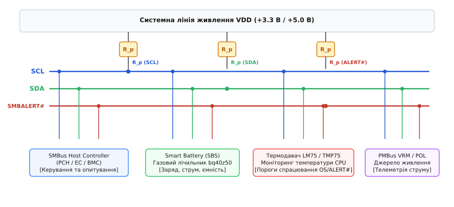
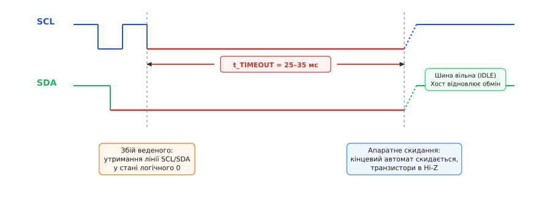
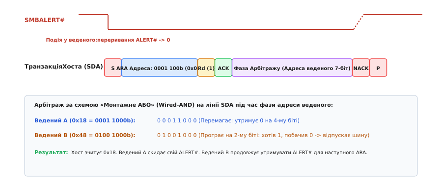
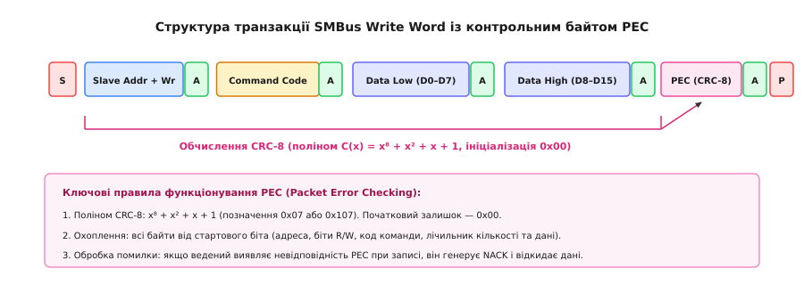
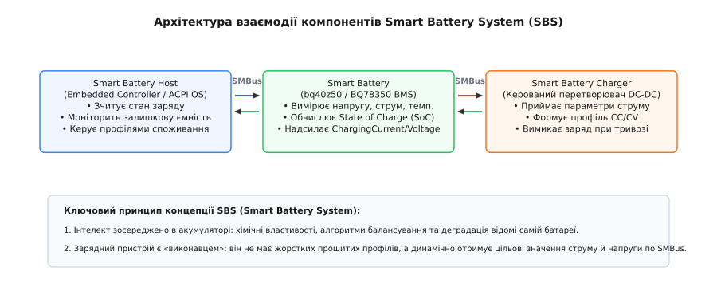

# Системна шина керування SMBus

<preknowlist>
- [Двопровідна шина I2C](topic:com-devices/i2c-bus) — фізична організація ліній із відкритим стоком, тактування та адресація.
- [Транзакція I2C](topic:com-devices/i2c-transaction) — стани СТАРТ, СТОП, передача байта та біти підтвердження ACK/NACK.
- [Конфлікти ресурсів та зависання шини](topic:com-devices/bus-resource-conflicts) — механізми блокування ліній та розтягування такту.
- [Контрольна сума CRC](topic:com-modulation/crc) — виявлення помилок за допомогою поліноміального ділення.
</preknowlist>

Коли мікроконтролер керування живленням портативного комп'ютера або сервера опитує мікросхеми телеметрії через звичайну шину I2C, короткочасна завада на лінії тактування здатна перевести ведений термодавач у стан очікування наступного такту, у якому він нескінченно притискає лінію даних до нуля. Оскільки в класичному стандарті I2C відсутній будь-який часовий ліміт на утримання сигналів, зависання одного другорядного чипа повністю блокує зв'язок із контролерами напруги процесора, модулями пам'яті та системою охолодження. Локальний збій зв'язку перетворюється на аварійне вимкнення всієї обчислювальної системи через втрату контролю над живленням.

Для усунення цієї вразливості та стандартизації системного моніторингу консорціум компаній Intel та Duracell у 1995 році розробив специфікацію **SMBus** (*System Management Bus*, системна шина керування, від латинського *systema* — зв'язне ціле та *manus* — рука, керування). Зберігши фізичну двопровідну топологію I2C, розробники SMBus перетворили відкритий комунікаційний канал на детерміновану системну магістраль із фіксованими електричними порогами, жорсткими часовими таймаутами, асинхронною лінією сповіщень та обов'язковою перевіркою цілісності пакетів.


*Архітектура системної шини SMBus, резистори підтяжки та підключення периферійних компонентів*

Історичний шлях створення консорціуму SBS-IF, причини відмови від пропрієтарних акумуляторів у ноутбуках та еволюцію стандарту від версії 1.0 до 3.2 розібрано у вставці [Історія виникнення SBS-IF та SMBus](topic:com-devices/smbus-standard/hist-sbs-if.md).

---

### Фізичний рівень та електрична сумісність: подолання міждоменного конфлікту

Шина SMBus використовує дві основні сигнальні лінії: **SCL** (*Serial Clock*, лінія тактування) та **SDA** (*Serial Data*, лінія даних). Обидва виводи всіх підключених пристроїв побудовані за схемою відкритого стоку (або відкритого колектора) і підтягнуті до лінії напруги живлення `V_DD` через зовнішні резистори `R_P`. Жоден пристрій на шині не здатний примусово подати високий рівень напруги: логічна одиниця формується виключно пасивно — коли всі транзистори закриті, резистор підтягує лінію до `V_DD`. Логічний нуль формується активно — відкриттям N-канального польового транзистора, який замикає лінію на землю.

У класичній шині I2C логічні рівні прив'язані до напруги живлення конкретної схеми: максимальний вхідний нуль становить `V_IL = 0.3 · V_DD`, а мінімальна одиниця — `V_IH = 0.7 · V_DD`. Якщо на спільній платі мікроконтролер хоста живиться від 3.3 В, а давач заряду батареї — від 5.0 В, виникає критичний конфлікт рівнів. Для хоста з напругою 3.3 В високий рівень починається від 2.31 В, тоді як 5-вольтовий пристрій вимагає щонайменше `0.7 · 5.0 = 3.5 В`. У результаті 5-вольтовий ведений пристрій не розпізнає високий рівень від 3.3-вольтового ведучого, що робить їхню пряму взаємодію без додаткових перетворювачів рівнів неможливою.

Специфікація SMBus 2.0 розв'язує цю проблему через фіксацію абсолютних порогів напруг, сумісних із логікою TTL та CMOS:
* **Максимальна напруга логічного нуля (`V_IL`):** не більше **0.8 В**;
* **Мінімальна напруга логічної одиниці (`V_IH`):** не менше **2.1 В** (для шин із напругою живлення від 3.0 В до 5.5 В);
* **Вихідна напруга низького рівня (`V_OL`):** не більше **0.4 В**.

Завдяки фіксованому порогу `V_IH = 2.1 В` будь-який пристрій із живленням 3.3 В гарантовано перемикає 5-вольтові мікросхеми, усуваючи потребу в трансляторах рівнів між основними цифровими доменами материнської плати. У версії SMBus 3.0 для сучасних енергоефективних процесорів діапазон логічних рівнів розширено вниз до напруг 1.35 В та 1.2 В (`V_IL ≤ 0.35 · V_DD`, `V_IH ≥ 0.65 · V_DD`).

Для узгодження навантажувальної здатності специфікація вводить два класи пристроїв за вихідним струмом:
1. **Клас низької потужності (Low Power):** гарантує струм замикання на землю `I_OL ≥ 350 мкА` при напрузі `V_OL ≤ 0.4 В`. Цей клас оптимізований для автономних мікросхем із батарейним живленням (газові лічильники акумуляторів, RTC), де струм спокою в режимі сну обмежений одиницями мікроамперів.
2. **Клас високої потужності (High Power):** підтримує струм замикання `I_OL ≥ 4.0 мА`, що дозволяє працювати на довгих доріжках друкованих плат із високою паразитними ємностями (до 400 пФ) та низькоомними резисторами підтяжки (близько 1 кОм).

Повний перелік параметрів струмів, ємностей виводів та формули точного розрахунку опору резисторів підтяжки наведено в довіднику [Специфікація електричних рівнів та таймінгів SMBus](topic:com-devices/smbus-standard/api-electrical-timing.md).

---

### Системні інваріанти та ліквідація вічних блокувань: таймаути й тактування

Головною системною відмінністю SMBus від базового I2C є набір суворих динамічних інваріантів, які гарантують самовідновлення магістралі після будь-якого апаратного чи програмного збою.


*Часова діаграма апаратного таймауту t_TIMEOUT: скидання кінцевого автомата веденого при застряганні лінії в нулі*

#### 1. Апаратний таймаут скидання шини `t_TIMEOUT = 35 мс`

В I2C ведений пристрій має право утримувати тактову лінію SCL на рівні нуля (*Clock Stretching*), поки виконує внутрішні обчислення або готує дані для зчитування. Якщо ведений мікроконтролер потрапляє в нескінченний цикл або зазнає впливу електромагнітної завади, він залишає транзистор відкритим, і шина блокується назавжди.

В SMBus введено обов'язковий апаратний таймаут:
```
t_TIMEOUT = 25 – 35 мс
```
Якщо лінія SCL або лінія SDA утримується в стані логічного нуля довше ніж **35 мс**, кожен вузол шини зобов'язаний:
1. Примусово скинути внутрішній кінцевий автомат інтерфейсу (*Bus State Machine*) у вихідний стан IDLE;
2. Закрити вихідні транзистори на обох лініях (перевести виводи в стан високого імпедансу Hi-Z);
3. Очистити вхідні буфери та бути готовим до прийому нового сигналу СТАРТ.

Після того як ведений відпускає лінію, резистор `R_P` підтягує напругу до `V_DD`. Хост-контролер фіксує відновлення високого рівня, очищає статус помилки та продовжує планову роботу без потреби апаратного перезавантаження всього комп'ютера.

#### 2. Обмеження мінімальної робочої частоти `f_MIN = 10 кГц`

Шина I2C є статичною: тактова частота може знижуватися аж до 0 Гц (постійний струм), дозволяючи ведучому призупиняти опитування на довільний час. В SMBus така поведінка заборонена: мінімальна робоча частота тактування становить **`f_MIN = 10 кГц`**. Якщо інтервал між змінами станів SCL перевищує 100 мкс (а низький напівперіод перевищує ліміт `t_TIMEOUT`), це інтерпретується як аварія лінії.

Верхні межі швидкості стандартизовані за категоріями:
* **SMBus 1.0/2.0:** максимальна частота `f_MAX = 100 кГц` (стандартний режим);
* **SMBus 3.0:** додано режим *Fast-mode* (до **400 кГц**) та *Fast-mode Plus* (до **1 МГц**) для передачі великих блоків телеметрії в серверних системах;
* **SMBus 3.2:** покращено енергоефективність на частотах до 1 МГц.

#### 3. Ліміти на розтягування тактових імпульсів

Щоб унеможливити ситуацію, коли повільний пристрій формально вкладається в таймаут 35 мс на кожному біті, але сумарно розтягує передачу одного байта на секунди, SMBus обмежує кумулятивний час утримання SCL:
* **Кумулятивне розтягування веденим (`t_LOW:SEXT`):** не більше **25 мс** на все повідомлення (від сигналу СТАРТ до СТОП);
* **Кумулятивне розтягування ведучим (`t_LOW:MEXT`):** не більше **10 мс** на інтервал між сусідніми байтами транзакції.

Якщо сума пауз перевищує ці значення, хост перериває сесію транзакції сигналом СТОП, вважаючи пристрій несправним.

---

### Асинхронне сповіщення хоста: лінія SMBALERT# та протокол ARA

У системах керування живленням критичні події виникають спонтанно: акумуляторна батарея розряджається до мінімальної межі, температура силового транзистора перевищує 90 °C або вентилятор охолодження зупиняється через механічне блокування. 

У класичній архітектурі I2C єдиним способом дізнатися про подію є регулярне опитування кожного чипа (*polling*). Якщо на шині розташовано 20 давачів, центральний процесор або вбудований контролер повинен безперервно відправляти транзакції зчитування. Це створює паразитичний трафік, завантажує шину і не дозволяє мікроконтролеру перейти в енергоощадний режим сну.

Шина SMBus вирішує цю проблему за допомогою додаткової сигнальної лінії **`SMBALERT#`** та стандартизованого протоколу адреси сповіщення хоста **ARA** (*Alert Response Address*).


*Послідовність обробки переривання SMBALERT# та розв'язання арбітражу за адресою ARA*

#### Механізм роботи лінії SMBALERT# та арбітраж ARA

1. **Спільна лінія переривання:** Вивід `SMBALERT#` кожного веденого пристрою має відкритий стік і підключений до спільної підтягнутої лінії. У нормальному стані на лінії присутній високий рівень напруги.
2. **Формування тривоги:** Коли в будь-якому веденому вузлі виникає аварійна ситуація (наприклад, термодавач зафіксував перегрів), чип відкриває вихідний транзистор і притискає лінію `SMBALERT#` до землі (активний рівень 0).
3. **Обробка переривання хостом:** Падіння напруги на `SMBALERT#` викликає апаратне переривання системного контролера хоста. Хост не знає заздалегідь, який саме з підключених чипів згенерував сигнал.
4. **Запит до ARA:** Хост ініціює транзакцію читання за спеціальною зарезервованою адресою:
```
7-бітна адреса ARA: 0001 100b (0x0C)
Байт на шині (з бітом Rd = 1): 0001 1001b (0x19)
```
5. **Апаратний арбітраж ведених:** Усі ведені пристрої, які утримують `SMBALERT#` у нулі, розпізнають адресу ARA і одночасно починають передавати на лінію SDA власну 7-бітну фізичну адресу, починаючи зі старшого біта.
6. **Правило монтажного АБО (Wired-AND):** На кожному тактовому імпульсі SCL пристрій виставляє свій біт адреси та одночасно читає реальний стан лінії SDA. Якщо пристрій намагається видати логічну 1 (відпускає лінію), але бачить, що інший пристрій притиснув лінію до 0, він фіксує програш в арбітражі, негайно вимикає свій передавач і звільняє шину SDA.
7. **Перемога найменшої адреси:** Арбітраж беззаперечно виграє пристрій із найменшим числовим значенням адреси (оскільки нулі переважають одиниці). Хост безпомилково зчитує повну адресу переможця, підтверджує її та завершує транзакцію сигналом СТОП.
8. **Автоматичне скидання переривання:** Переможець арбітражу, успішно передавши свою адресу, автоматично відпускає лінію `SMBALERT#`. Якщо інші пристрої також виставили тривогу, лінія `SMBALERT#` залишається на нульовому рівні, і хост виконує наступну транзакцію до ARA, обслуговуючи всі черги подій у порядку пріоритету адрес.

Повний вихідний код обробника черги переривань ARA на мовах C та C++ наведено у вставці [Практична реалізація обробника SMBALERT# та черги ARA](topic:com-devices/smbus-standard/proj-smbalert-ara.md).

---

### Цілісність даних у шумному середовищі: пакетний контроль помилок (PEC)

Усередині комп'ютерів та серверів шина SMBus прокладається поруч із потужними імпульсними перетворювачами живлення процесора (VRM), лініями живлення відеокарт та електродвигунами вентиляторів. Комутація струмів у десятки й сотні ампер створює високочастотні електромагнітні наведення. Одиночний імпульсний викид напруги може спотворити біт даних або перетворити біт ACK на NACK. Якщо спотворюється значення поточної напруги акумулятора, зарядний пристрій може подати надмірний струм і зруйнувати літієві комірки.

Для гарантування абсолютної достовірності даних починаючи зі специфікації SMBus 1.1 введено механізм **PEC** (*Packet Error Checking*, пакетний контроль помилок).


*Структура кадру транзакції SMBus Write Word із контрольним байтом PEC та охопленням CRC-8*

#### Математичні основи PEC (CRC-8)

Контрольна сума PEC формується додаванням одного байта в кінець кожної транзакції перед фінальним сигналом СТОП. Байтом PEC є значення циклічного надлишкового коду **CRC-8**, обчислене за твірним поліномом:
```
C(x) = x⁸ + x² + x + 1
```
У двійковій формі поліном записується як `1 0000 0111b` (шістнадцяткове число `0x107`, або `0x07` для 8-бітного залишку). Початковий стан регістра CRC завжди дорівнює `0x00`, пряма та реверсна інверсії відсутні.

Цей твірний поліном має кодову відстань Геммінга `HD = 4` для пакетів довжиною до 15 байтів. Це означає, що алгоритм гарантовано виявляє будь-які комбінації з 1, 2 або 3 поодиноких бітових помилок у будь-яких місцях кадру, а також будь-який пакетний сплеск завади (*Burst Error*) довжиною до 8 бітів поспіль. Для довших пакетів блокового читання (до 32 байтів) гарантується кодова відстань `HD = 3`, що перекриває понад 99.6% усіх можливих завад у промислових умовах.

#### Алгоритм обчислення та охоплення полів

Контрольна сума CRC-8 обчислюється над **усіма без винятку** байтами повідомлення, які передаються на шині між сигналами СТАРТ і СТОП:
1. Адреса веденого пристрою разом із бітом напрямку `R/W`;
2. Байт коду команди або номера регістра (*Command Code*);
3. Повторна адреса веденого пристрою при операціях повторного старту (*Repeated START*);
4. Байт лічильника кількості даних (*Byte Count*) для блокових операцій;
5. Усі байти корисного навантаження даних.

Біти підтвердження ACK/NACK, сигнали СТАРТ та СТОП у розрахунок контрольної суми не входять.

**Порядок обробки помилок:**
* **При записі даних (Master-to-Slave):** Хост передає байт PEC наприкінці повідомлення. Ведений чип, обчисливши свій локальний залишок CRC, порівнює його з прийнятим байтом. Якщо суми збігаються, ведений виставляє біт **ACK**. Якщо виявлено помилку — ведений формує **NACK**, відкидає прийняті байти і не змінює стан своїх внутрішніх регістрів.
* **При читанні даних (Slave-to-Master):** Ведений пристрій сам обчислює CRC над надісланими даними та передає фінальний байт PEC. Хост приймає байт, перевіряє суму локально і, в разі помилки, повторює транзакцію.

---

### Стандартизований набір протокольних транзакцій

Шина I2C не визначає структуру повідомлень на рівні байтів: кожен виробник давача сам обирає, як передавати адресу регістра чи дані. На відміну від I2C, специфікація SMBus регламентує фіксований набір уніфікованих форматів транзакцій. Це дозволяє створювати апаратні контролери шини (вбудовані в південні мости чипсетів Intel/AMD або контролери BMC), які самостійно виконують повний протокольний обмін за одну команду процесора.

У всіх транзакціях SMBus діє непорушне правило формату багатобайтних чисел: **Little-Endian** (молодший байт `DataLow` передається першим, старший байт `DataHigh` — другим).

#### Класифікація транзакцій SMBus

1. **Quick Command (Швидка команда):** Складається лише з адреси веденого та біта напрямку `R/W` без поля команди та даних. Використовується для сканування активних пристроїв на шині або швидкого увімкнення/вимкнення дискретних ключів живлення.
2. **Send Byte та Receive Byte:** Передача або прийом одного байта даних без зазначення номера регістра (велений пристрій використовує поточне значення свого внутрішнього адресного покажчика).
3. **Write Byte та Write Word:** Запис 8 або 16 бітів даних у вказаний регістр веденого пристрою (`Command Code`).
4. **Read Byte та Read Word:** Двофазні транзакції з використанням сигналу Repeated START: спочатку хост записує номер регістра, а потім повторно адресує ведений чип у режимі читання для зчитування 8 або 16 бітів.
5. **Process Call (Процедурний виклик):** Атомарна операція взаємодії: хост записує номер команди та 16 біт аргументів, після чого негайно зчитує 16 біт обчисленого результату через повторний старт без звільнення шини.
6. **Block Write та Block Read:** Передача або читання масивів змінної довжини. Обов'язково містять поле **Byte Count** (лічильник байтів N, від 1 до 32 байтів у SMBus 2.0 або до 255 у SMBus 3.0), що дозволяє системному контролеру DMA виділити точний розмір пам'яті.
7. **Block Write-Block Read Process Call:** Комбінований процедурний виклик для передачі блоку параметрів та зчитування блоку результату. Використовується у криптографічних протоколах перевірки автентичності батарей (*Challenge-Response Authentication*).
8. **Host Notify Protocol (Протокол сповіщення хоста):** Спеціальний режим, у якому ведений пристрій сам тимчасово стає ведучим і надсилає повідомлення на зарезервовану адресу хоста `0x08`, передаючи власну 7-бітну адресу та 16-бітний код статусу. Це дозволяє організувати сповіщення хоста навіть у системах, де лінія `SMBALERT#` фізично відсутня (наприклад, у 3-контактних роз'ємах живлення з лініями GND, SCL, SDA).

---

### Динамічний розподіл адрес ARP та усунення колізій

На складних системних платах серверів нерідко виникає ситуація, коли до однієї шини необхідно підключити кілька абсолютно однакових мікросхем (наприклад, 8 планок пам'яті DDR із чипами SPD або 12 однакових термодавачів силових каскадів). Якщо виробник мікросхеми передбачив лише 2–3 адресні виводи, комбінацій фізичних адрес виявляється недостатньо, що призводить до адресних колізій.

У версії SMBus 2.0 запроваджено протокол динамічного призначення адрес **ARP** (*Address Resolution Protocol*). 

Кожен ARP-сумісний пристрій містить унікальний 128-бітний ідентифікатор **UDID** (*Unique Device Identifier*), прошитий на заводі виробника:
* 16 біт — прапорці можливостей пристрою (швидкість, вимоги до PEC);
* 16 біт — ревізія та версія кремнієвого кристала;
* 16 біт — Vendor ID (ідентифікатор компанії, зареєстрований у PCI-SIG);
* 16 біт — Device ID (модель мікросхеми);
* 16 біт — Interface ID (тип протокольного інтерфейсу: SBS, PMBus чи IPMI);
* 16 біт — Subsystem Vendor ID;
* 32 біти — унікальний серійний номер екземпляра кристала.

Процес ініціалізації відбувається на зарезервованій адресі за замовчуванням `0x61`:
1. Хост транслює команду `Prepare to ARP`, переводячи всі неконфігуровані вузли в режим очікування перерахунку.
2. Хост надсилає команду `Get UDID`. Усі неконфігуровані пристрої одночасно починають передавати свій 128-бітний UDID на лінію SDA. Завдяки схемі монтажного АБО пристрій із меншим числовим значенням UDID безконфліктно виграє побітовий арбітраж.
3. Хост зчитує повний UDID переможця і транзакцією `Assign Address` призначає йому нову, вільну 7-бітну робочу адресу (наприклад, `0x32`).
4. Налаштований пристрій виходить із черги виявлення і більше не відповідає на адресу `0x61`. Хост повторює цикл `Get UDID` доти, доки всі пристрої на шині не отримають унікальні адреси.

---

### Цільові прикладні галузі та екосистема стандартів

Завдяки передбачуваності та надійності шина SMBus стала основою трьох фундаментальних промислових екосистем.


*Архітектура взаємодії компонентів Smart Battery System (SBS) через магістраль SMBus*

#### 1. Smart Battery System (SBS)

Стандарт **SBS** повністю описує взаємодію між трьома вузлами:
* **Smart Battery (Інтелектуальний акумулятор):** Включає контролер газового лічильника (*Gas Gauge*, наприклад Texas Instruments bq40z50 або Maxim MAX17205). Контролер виконує високоточне інтегрування струму, відстежує температуру кожної банки та обчислює точний відсоток заряду (*State of Charge*, SoC) за спеціальним хімічним профілем.
* **Smart Battery Charger (Зарядний пристрій):** Спеціалізований DC-DC перетворювач, який не має власних жорстких налаштувань. Акумулятор сам по шині SMBus надсилає заряднику цільові команди: `ChargingCurrent(струм)` та `ChargingVoltage(напруга)`. Якщо акумулятор фіксує перегрів, він негайно надсилає команду зі значенням струму `0 мА`, зупиняючи процес.
* **SMBus Host (Системний хост):** Вбудований контролер (*Embedded Controller*, EC) ноутбука, який зчитує залишковий час роботи та передає дані операційній системі через інтерфейс ACPI.

Стандарт SBData v1.1 закріплює фіксовану карту 16-бітних регістрів інтелектуального акумулятора за фіксованою адресою `0x0B`:
* `0x08 (Temperature):` абсолютна температура елементів у десятих частках Кельвіна (наприклад, `2982` = 25.0 °C);
* `0x09 (Voltage):` сумарна напруга батарейного блоку в мілівольтах (мВ);
* `0x0A (Current):` миттєвий струм зі знаком у міліамперах (мА, додатний — заряд, від'ємний — розряд);
* `0x0D (RelativeStateOfCharge):` залишковий рівень заряду у відсотках (0–100%);
* `0x0F (RemainingCapacity):` залишкова ємність у мА·год або 10 мВт·год;
* `0x10 (FullChargeCapacity):` реальна скоригована ємність повністю зарядженого акумулятора з урахуванням деградації хімії;
* `0x14 (ChargingCurrent):` струм заряду, який акумулятор вимагає від зарядного пристрою;
* `0x15 (ChargingVoltage):` цільова напруга заряду для перетворювача;
* `0x16 (BatteryStatus):` бітові прапорці аварійного стану (`OverCharged`, `TerminateCharge`, `OverTemp`, `TerminateDischarge`, `RemainingCapacityAlarm`);
* `0x17 (CycleCount):` сумарна кількість повних циклів перезаряду, пройдених елементами за час експлуатації.

Акумулятор періодично (кожні 10–60 секунд) виступає в ролі ведучого на шині, транслюючи значення регістрів `0x14` та `0x15` безпосередньо за адресою зарядного пристрою `0x09`. Якщо зв'язок обривається, зарядний пристрій має власний апаратний таймер безпеки: якщо протягом 175 секунд від акумулятора не надходить нових інструкцій, зарядний струм автоматично скидається до нуля для запобігання неконтрольованому перезаряду.

#### 2. Апаратний моніторинг материнських плат та модулів пам'яті

На будь-якій комп'ютерній материнській платі шина SMBus забезпечує початкову ініціалізацію та безперервний захист:
* **DDR SPD (Serial Presence Detect):** Кожна планка оперативної пам'яті DDR4/DDR5 містить мікросхему EEPROM (адреси `0x50 – 0x57`), підключену до SMBus. Під час завантаження BIOS/UEFI зчитує з неї таймінги, робочі частоти та напруги живлення модулів.
* **Термоконтроль та керування вентиляторами:** Чипи моніторингу (наприклад, LM75, NCT6776) вимірюють температури VRM, чипсета та сокета, автоматично регулюючи шпаруватість ШІМ-сигналів кулерів охолодження.

#### 3. Силовий стандарт PMBus (Power Management Bus)

На базі розширення SMBus розроблено протокол **PMBus**, який стандартизує цифрове керування перетворювачами живлення в серверах і телекомунікаційних станціях. PMBus стандартизує команди встановлення вихідної напруги процесора (*VOUT_COMMAND*), обмеження струму, вимірювання споживаної потужності та калібрування захистів від короткого замикання в режимі реального часу.

Для кодування аналогових параметрів (струм, напруга, потужність, температура) у протоколі PMBus використовується 16-бітний формат чисел із плаваючою комою **Linear11**:
```
Число = Y · 2ᴺ
де N — 5-бітний порядок зі знаком (біти 15–11, від -16 до +15);
   Y — 11-бітний мантиса зі знаком у доповняльному коді (біти 10–0, від -1024 до +1023).
```
Завдяки цьому формату один чип перетворювача може з однаковою легкістю передавати як міліампери споживання чергових кіл, так і сотні ампер струму багатофазного живлення серверного процесора.

---

### Порівняльний аналіз шин I2C та SMBus

Для наочності ключові відмінності між стандартами зведено в єдину таблицю:

| Характеристика | Класичний I2C | Стандарт SMBus (v2.0 / v3.0) | Причина відмінності в SMBus |
| :--- | :--- | :--- | :--- |
| **Мінімальна частота `f_MIN`** | 0 Гц (DC) | **10 кГц** | Запобігання вічному зависанню шини |
| **Максимальна частота `f_MAX`** | 100 кГц / 400 кГц / 3.4 МГц | 100 кГц / 400 кГц / 1 МГц | Стандартизація пропускної здатності |
| **Таймаут скидання `t_TIMEOUT`** | **Відсутній** (можливе вічне блокування) | **25 – 35 мс** | Автоматичне відновлення після збоїв |
| **Логічні пороги напруг** | Залежні від живлення: `0.3/0.7 · V_DD` | **Фіксовані TTL/CMOS:** `0.8 В / 2.1 В` | Сумісність пристроїв 3.3 В та 5.0 В |
| **Струм утримання `I_OL`** | 3.0 мА (Standard-mode) | **350 мкА** (Low-Power) / **4 мА** (High-Power) | Енергозбереження батарейних систем |
| **Контроль помилок** | Лише біти ACK/NACK | **Пакетний PEC (CRC-8)** | Захист від завад потужних кіл живлення |
| **Асинхронні переривання** | Відсутні у специфікації | **Лінія SMBALERT# та протокол ARA** | Миттєва реакція без опитування (polling) |
| **Формат транзакцій** | Довільний на рівні байтів | **Суворо стандартизований** | Апаратна підтримка в чипсетах і драйверах |
| **Порядок байтів слів** | Не визначено (залежить від чипа) | **Little-Endian** (DataLow першим) | Одноманітність обробки 16-бітних даних |

---

### Програмна модель та інтеграція в операційні системи

В операційних системах сімейства Linux та Windows взаємодія з SMBus розділена на два рівні:

1. **Рівень апаратного хост-контролера:** Драйвер чипсета (наприклад, `i2c-i801` для платформ Intel або `i2c-piix4` для AMD) реєструє шину як адаптер підсистеми I2C. Апаратний контролер самостійно керує часовими діаграмами, формує повторні старти та обчислює контрольні суми PEC на рівні регістрів FIFO.
2. **Рівень периферійних драйверів:** Ядро надає уніфікований API викликів `i2c_smbus_*`:
   * `i2c_smbus_read_byte_data(client, command)` — зчитування байта з регістра;
   * `i2c_smbus_write_word_data(client, command, value)` — запис 16-бітного слова;
   * `i2c_smbus_read_block_data(client, command, values)` — читання масиву з урахуванням лічильника довжини.

В операційних системах доступ до шини SMBus регламентується стандартом **ACPI** (*Advanced Configuration and Power Interface*). Таблиці DSDT/SSDT описують сегменти шини SMBus у вигляді об'єктів `OperationRegion`:
```asl
OperationRegion(SMB0, SMBus, 0x00, 0xFF)
Field(SMB0, BufferAcc, NoLock, Preserve)
{
    Connection(I2CSerialBus(0x000B, ControllerInitiated, 100000, AddressingMode7Bit, "\\_SB.PCI0.SBUS")),
    AccessAs(BufferAcc, AttribWord),
    BVOL, 16    // Регістр напруги батареї (SBData 0x09)
}
```
Коли операційна система викликає метод оцінки заряду акумулятора, інтерпретатор ACPI автоматично транслює звернення до поля `BVOL` в апаратну транзакцію `Read Word` контролера SMBus, повертаючи свіже значення мілівольтів безпосередньо в службу керування живленням ОС.

Утиліти простору користувача Linux (пакет `i2c-tools`) дозволяють напряму досліджувати та діагностувати шину:
* `i2cdetect -y <bus>` — сканування активних адрес на шині за допомогою транзакцій `Quick Command` або `Receive Byte`;
* `i2cdump -y -r 0x00-0x1F <bus> <addr> w` — зчитування карти регістрів 16-бітними словами у форматі Little-Endian;
* `i2cget -y <bus> <addr> <reg> w` — отримання поточного значення конкретного телеметричного параметра.

У серверних системах із контролерами базової плати **BMC** (*Baseboard Management Controller*) інтерфейс SMBus підтримує протокол IPMI та OpenBMC, дозволяючи віддалено моніторити стан серверів, навіть коли центральний процесор і операційна система повністю вимкнені.

> 🔧 **Навіщо це.** Без детермінованих інваріантів SMBus неможливо було б побудувати надійний сучасний комп'ютер чи сервер. Якщо стандартна шина I2C чудово підходить для локального зв'язку між мікроконтролером та екраном на одному друкованому вузлі, то SMBus гарантує, що жоден збій окремого давача, перегрів акумулятора чи комутаційна завада перетворювача напруги ніколи не заблокує системну магістраль керування платформою.
