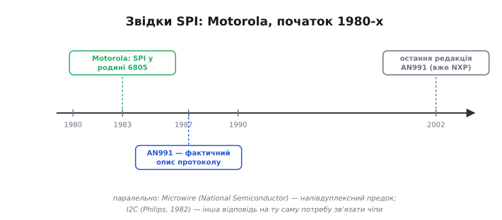

# 📜 Історія: SPI — як Motorola зв'язала чіпи навколо зсувного регістра

Відкривши даташит майже будь-якого швидкого периферійного чіпа — дисплея, флеш-пам'яті, високошвидкісного АЦП, — натрапиш на знайому четвірку контактів: тактова лінія, дві лінії даних і вибір кристала. А поряд, у тому самому даташиті, ця четвірка часто має кілька різних позначень, і ще на кількох сусідніх чіпах усе зветься інакше. Дивно: шина проста до краю, а імен у неї багато. Чому так склалося — і чому сама шина виглядає саме так, з окремими лініями «туди» й «назад» і без жодних адрес, — стає зрозуміло, якщо повернутися до її витоків.

Бо SPI — це не «стандарт, який хтось одного дня сів і написав». Це інтерфейс, що **виріс із заліза**: із того, як фізично влаштований звичайний зсувний регістр усередині мікроконтролера. Хто це зробив і навіщо, видно вже з самого імені.

*SPI з'явився в Motorola на початку 1980-х — спершу в родині мікроконтролерів 6805, далі в добре відомій 68HC11. Окремого «стандарту» в нього немає: фактичним описом протоколу досі служить нота Motorola AN991 (1987, остання редакція 2002 року, вже під NXP). Паралельно жили Microwire від National Semiconductor (напівдуплексний предок) та I2C від Philips (1982) — інша відповідь на ту саму потребу зв'язати чіпи.*

---

## Навіщо ще одна шина, коли вже був UART

На початку 1980-х мікроконтролер усе частіше опинявся в оточенні допоміжних чіпів: окремий перетворювач коду в напругу, окрема пам'ять, окремий годинник. З кожним треба було якось говорити. Спосіб уже існував — [асинхронна послідовна передача](root:com-devices/async-serial), той самий UART: два дроти, ніякого спільного такту, кожен бік сам відлічує час за домовленою швидкістю.

Та для зв'язку **чіпів на одній платі** UART виявився незручним саме через відсутність такту. Без спільного такту обидві сторони мусять наперед точно знати швидкість і незалежно її витримувати; будь-яке розходження у відліку часу псує дані. Для двох плат, з'єднаних кабелем, це прийнятна ціна. Але якщо чіпи сидять поряд на одній платі, у них уже **є** спільний господар — мікроконтролер, який цокає власним тактом. Тягти ще й окремий лічильник часу в кожен чіп, коли поруч є готове джерело ритму, просто марнотратно.

Звідси й перша опора SPI: **синхронність**. Хай ведучий не лише шле дані, а й видає **такт** окремою лінією — тоді ведений не вгадує момент біта, а просто дивиться на фронт такту. Жодного підлаштування швидкості: повільніший чіп — повільніше цокаєш, і він устигає.

> 🔧 **Навіщо це.** Ця відмінність жива й досі. UART беруть, коли два **окремих** пристрої з'єднані лінією й кожен має власний такт; SPI — коли є **один господар такту** й купка периферії під ним на платі. Тому давач на платі майже завжди висить на SPI або I2C, а не на UART: навіщо два лічильники часу там, де вистачить одного спільного.

---

## Ідея, що виросла із зсувного регістра

Друга, головна опора SPI — це не нова вигадка, а пряме використання того, що **й так стояло** в мікроконтролері. Усередині процесора є [зсувний регістр](root:hw-digital/register): ланцюжок тригерів, що за кожним тактом зсуває весь свій вміст на одну позицію, виштовхуючи крайній біт назовні й засовуючи новий біт із входу.

Інженери Motorola зробили крок, який заднім числом здається очевидним: а що, як вивести цей зсувний регістр **назовні**, на ніжки, і з'єднати з таким самим регістром у сусідньому чіпі? З'єднати вихід одного зі входом іншого і навпаки, а зсувати обидва **спільним** тактом. Тоді за кожним тактом біт переходить з регістра ведучого в регістр веденого — і водночас біт веденого вертається у ведучого. Вісім тактів — і регістри обмінялися вмістом.

Так уся «вигадка» SPI звелася до фізики наявного заліза. Звідси одразу випливають дві риси, які потім доводиться окремо пояснювати тим, хто прийшов до SPI «згори», з боку протоколу:

- **Повний дуплекс** — не функція, а **наслідок**. Зсув неподільний: біт, що вийшов, і біт, що зайшов, — це одна й та сама операція. Не можна «лише прийняти», не відіславши, бо приймання і є зсув, а зсув щось виштовхує. Тому в SPI завжди обмін, навіть коли цікавить один напрямок.
- **Окремі лінії «туди» й «назад»** — бо в регістра окремий вхід і окремий вихід. Звідси дві лінії даних замість однієї, як у I2C.

Сам термін **SPI** (*Serial Peripheral Interface* — послідовний інтерфейс для периферії) і назви ліній теж пішли від Motorola. Лінію такту назвали **SCK** (*Serial Clock*), а дві лінії даних підписали з погляду ведучого: **MOSI** (*Master Out, Slave In* — «вихід ведучого, вхід веденого») і **MISO** (*Master In, Slave Out* — «вхід ведучого, вихід веденого»). Лінію вибору — **CS** (*Chip Select* — «вибір кристала»). Ця термінологія «ведучий/ведений» (*master/slave*) міцно прижилася; пізніше частина галузі почала переходити на нейтральніші назви — *controller/peripheral*, звідси сучасні COPI/CIPO замість MOSI/MISO, — але початковий словник саме звідти.

---

## Перші чіпи: 6805 і 68HC11

Апаратний блок SPI Motorola вперше вбудувала у свої 8-бітні мікроконтролери родини **6805** — у документах початку 1980-х (близько 1983 року) вже згадуються її представники з інтегрованим «Serial Peripheral Interface». Згодом SPI став штатною периферією знаменитої родини **68HC11** — одного з найпопулярніших 8-бітних мікроконтролерів свого часу, який і зробив цю шину широковідомою. Саме завдяки 68HC11 ціле покоління інженерів познайомилося зі SPI як зі «звичайним» способом причепити до процесора пам'ять чи перетворювач.

Прикметно, що окремого формального **стандарту** SPI так і не дістав. Те, що сьогодні служить його «офіційним» описом, — це **нота Motorola AN991** «Using the Serial Peripheral Interface to Communicate Between Multiple Microcomputers», уперше випущена **1987 року** (а востаннє перевидана аж 2002-го, коли напівпровідниковий бізнес Motorola вже відходив до Freescale, а далі — NXP). Через цю відсутність єдиного стандарту кожен виробник трактує дрібні деталі по-своєму — звідси й «зоопарк» назв ліній, і відмінності в тому, як чіпи поводяться з лінією вибору. Це пряма ціна того, що шина народилася як зручний внутрішній блок, а не як узгоджена всіма специфікація.

> 🔧 **Навіщо це.** Запам'ятай, що жорсткого стандарту нема, — це рятує нерви. Якщо два SPI-чіпи поводяться трохи по-різному (один смикає вибір на кожне слово, інший — на весь обмін; один зве лінію SDO, інший MISO), це не помилка реалізації, а наслідок історії. Тому в SPI **даташит конкретного чіпа головніший за загальне правило**: дивись, як саме цей пристрій хоче, щоб з ним говорили.

---

## Поряд: Microwire і I2C

SPI з'явився не у вакуумі. Майже водночас National Semiconductor просувала власний синхронний інтерфейс — **Microwire**. По суті це **предок і близький родич** SPI: той самий принцип «такт плюс дані плюс вибір», але **напівдуплексний** і зафіксований в одному-єдиному режимі такту (у термінах SPI — режим 0). Microwire-чіпи зазвичай працювали на нижчих частотах (порядку 2 МГц проти десятків МГц у пізніших SPI). Пізніший варіант Microwire/Plus уже вмів повний дуплекс і два режими такту — тобто фактично дотягувався до SPI. Через цю близькість багато старих чіпів пам'яті, підписаних «Microwire», без проблем працюють із SPI-контролером у режимі 0.

Тоді ж, 1982 року, Philips випустила [I2C](root:com-devices/i2c-bus) — і це була **протилежна** відповідь на ту саму потребу зв'язати чіпи на платі. Якщо SPI оптимізували під **швидкість**, віддавши за неї дроти (окремі лінії даних, окрема CS на кожного), то I2C оптимізували під **мінімум дротів**, віддавши за це швидкість (дві спільні лінії, адреси замість окремих виборів, повільний підйом через підтяжки). Дві шини, народжені майже одночасно, розійшлися в різні боки того самого компромісу — і саме тому й досі чудово доповнюють одна одну на одній платі: повільна дрібнота на I2C, швидка пам'ять і дисплей на SPI.

---

## Що з усього цього лишилось

SPI пережив і свою колиску, і свого творця у первісному вигляді: Motorola давно немає в тому вигляді, а її шина — всюди. Сьогодні це **типова мова швидкої периферії**: дисплеї, флеш- і [SD-пам'ять](root:cat-hw-boards/microsd-card), високошвидкісні перетворювачі, багато радіомодулів спілкуються саме нею. І все це досі тримається на тій самій ідеї виставленого назовні зсувного регістра.

Важливіша за дати — **логіка**, яку ця історія пояснює:

- **Такт окремою лінією** — бо синхронний зв'язок чіпів на платі простіший за асинхронний UART, коли спільний господар такту вже є.
- **Дві лінії даних і повний дуплекс** — бо шина буквально виставляє назовні зсувний регістр з окремим входом і виходом; обмін неподільний за самою будовою.
- **Окрема CS на кожного замість адрес** — бо так найшвидше й найпростіше, ціною зайвих ніжок.
- **Різнобій у деталях і назвах** — бо єдиного стандарту нема, є лише давня нота AN991 і звичка кожного виробника робити по-своєму.

Тримаючи в голові цей зсувний регістр, виведений на ніжки, на решту [шини SPI](root:com-devices/spi-bus) — чотири лінії, повний дуплекс, вибір кристалом — дивишся вже не як на набір правил, а як на природний наслідок одного простого інженерного ходу.
