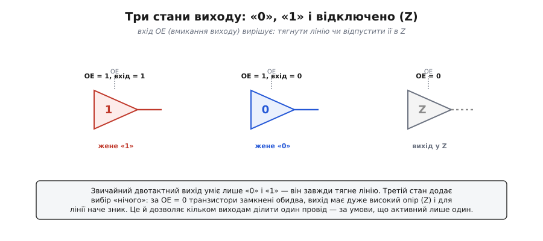

# 🔌 Буфер із третім станом

Звичайний цифровий вихід уміє рівно дві речі: притягнути лінію до «1» або до «0». Це [двотактний (push-pull) вихід](root:hw-digital/push-pull-output) — угорі відкритий верхній транзистор, унизу нижній, і лінію він тримає **завжди**. Саме тому два таких виходи не можна звести на один провід: коли один жене «1», а другий «0», вони закорочують живлення через себе — струм тече наскрізь, обидва гріються, а на лінії виходить невизначена напруга десь посередині.

**Буфер із третім станом** (англ. *three-state* / *tri-state*; «tri-state» — торгова назва National Semiconductor, тому загальний термін — *three-state*) додає до «0» і «1» третій варіант — **відключено**. Це не якийсь проміжний рівень напруги, а **відсутність** з'єднання: обидва транзистори виходу замкнені одночасно, ніжка має дуже високий опір (звідси **високий імпеданс**, *high-Z*) і для лінії наче зникає. Вона ні тягне, ні штовхає — її можна гнути куди завгодно іншим виходом.


*Вхід OE (output enable, вмикання виходу) вирішує долю лінії: за OE = 1 буфер працює звичайним виходом і жене «1» чи «0»; за OE = 0 обидва транзистори замкнені, вихід у Z — наче від'єднаний. Це й дозволяє кільком виходам ділити один провід.*

Керує всім окремий вхід — **OE** (*output enable* — вмикання виходу; буває й активним нулем, тоді його звуть `OE` з рискою згори або `nOE`). Поки OE активний, буфер працює як звичайний вихід: що подали на вхід, те й на виході. Щойно OE знімають, вихід відпускає лінію в Z незалежно від того, що на вході.

## Що відбувається всередині

Двотактний вихід — це пара транзисторів між живленням і землею: верхній відкривається, щоб дати «1», нижній — щоб дати «0», і завжди відкритий рівно один. Третій стан додає до схеми керування одну умову: за OE = 0 логіка **замикає обидва** транзистори одночасно. Тоді між живленням, ніжкою і землею немає жодного відкритого шляху — опір ніжки сягає мегаомів, і крізь неї тече хіба що мізерний струм витоку. Для сусіднього виходу, що жене ту саму лінію, це те саме, що відрізаний дріт: він вільно тягне її куди треба, не відчуваючи опору.

Саме тому «третій стан» — не третій рівень напруги десь між «0» і «1», а **відсутність впливу**. Якщо до лінії в Z не під'єднано жодного активного джерела, її напруга взагалі не визначена: вона «висить» і ловить наводки. Тому спільну шину завжди проєктують так, щоб у кожну мить рівно один вихід був активний, а в паузах лінію притримує слабкий підтяжний резистор — інакше на вході приймача гуляє шум.

## Навіщо клас цих пристроїв

Третій стан — це механізм **спільної шини**: багато джерел, один провід, у кожну мить активне рівно одне. Без нього кожному пристроєві потрібен власний дріт; із ним усі вішають свої виходи на спільну лінію, а зовнішня логіка стежить, щоб OE був активний лише в одного. На цьому стоять і шини даних усередині процесора, і саме та спільна лінія MISO в SPI, де необраний ведений мусить відпустити вихід у Z, аби не заважати обраному.

Звідси й типове застосування буфера як **окремої мікросхеми**: коли пристрій третього стану не має (наприклад, простий давач із жорстким push-pull виходом), його не можна напряму повісити на спільну лінію — він заважатиме решті. Між ним і шиною ставлять зовнішній буфер із третім станом: вхід буфера — на вихід пристрою, вихід буфера — на шину, а OE буфера прив'язують до того ж сигналу вибору (CS), що активує сам пристрій. Поки пристрій не обрано — буфер у Z, і лінія для нього вільна.

## Типовий клас і розпіновка

Буфери третього стану випускають цілими «лінійками» по 4 чи 8 каналів у звичних логічних сімействах (74HC125, 74HC126, 74HC244, 74HC541 — як приклади класу, без прив'язки до конкретного виробника). Спільне в них:

```
вхід  Aₙ  ─►│ буфер │─►  вихід Yₙ      Yₙ = Aₙ,   якщо OE активний
                ▲                       Yₙ = Z (відключено),  якщо ні
              OEₙ
```

- **Aₙ** — вхід каналу; **Yₙ** — його вихід (на спільну лінію).
- **OE** — вмикання виходу: один на групу каналів або по одному на канал (залежить від мікросхеми). Часто активний нулем (`nOE`).
- У 74HC125 кожен із чотирьох буферів має власний `nOE`; у 74HC244 вісім буферів поділені на дві четвірки зі спільним `nOE` на кожну.

Розрізняй буфер третього стану й **[вихід з відкритим стоком](root:hw-digital/open-drain-output)**: відкритий стік теж дозволяє з'єднувати виходи, але інакше — він уміє лише притягувати до «0», а «1» дає спільний підтяжний резистор; буфер же третього стану в активному стані жене обидва рівні (повноцінний push-pull) і лише на час спокою цілком зникає з лінії. Перший — для ліній типу «хтось один тягне донизу» (як-от переривання), другий — для шин «у кожну мить говорить рівно один».

## Головна пастка класу: перекриття

Спільна шина має одне залізне правило: **активний завжди рівно один** вихід. Якщо два виходи на мить опиняться активними одночасно й женуть різні рівні, повторюється та сама біда, що й у двох зведених push-pull виходів, — наскрізний струм, гарячі мікросхеми, спотворені рівні. Англійською це називають *bus contention* — «бійка за шину».

Найпідступніший випадок — не помилка логіки, а **перекриття в часі**: старий господар лінії ще не встиг піти в Z, а новий уже відкрив вихід. Кожен буфер має ненульовий час переходу з активного стану в Z (десятки наносекунд), тож керування OE двох сусідів не можна перемикати «впритик». Між «вимкнути одного» і «увімкнути іншого» лишають невеликий проміжок, у який лінію не жене ніхто (вона короткочасно в Z) — так уникають миті, коли женуть обидва. У SPI цю роль грає сам протокол вибору: ведений відпускає MISO за фронтом CS угору й бере його лише за наступним опусканням свого CS, а ведучий тим часом не очікує даних — тож вікно, коли лінію тримають двоє, не виникає.

## Коли спільної шини краще уникнути

Спільний MISO з третім станом — не єдиний спосіб повісити кілька ведених на SPI. Альтернатива — **ланцюжок** (*daisy chain*): вихід даних одного веденого йде на вхід наступного, усі вони ділять спільні SCK і CS, а ведучий жене дані крізь увесь ланцюг, як крізь один довгий зсувний регістр. Тут MISO взагалі не спільний — кожна ланка має власну лінію до наступної, — тож і третій стан не потрібен. Ціна — інша: дані до останнього чіпа доходять, лише проштовхнувшись крізь усі попередні, а керувати окремим чіпом «адресно» вже не вийде. Через це ланцюжок зручний для однотипних пристроїв (гірлянда світлодіодних драйверів, каскад регістрів), а спільна шина з третім станом і окремими CS — для різнорідних ведених, до кожного з яких звертаються поодинці.

> 🔧 **Навіщо це.** Класичний практичний випадок — спільний MISO в SPI. Якщо потрібний давач не відпускає вихід у Z за CS = 1 (буває в дешевих чи саморобних чіпах), він не дасть жодному іншому веденому на тій лінії й слова сказати. Лікують саме зовнішнім буфером третього стану: вихід давача на вхід буфера, вихід буфера на спільний MISO, `nOE` буфера — на лінію CS того давача. Поки CS високий — буфер у Z, і шина чиста для інших.
