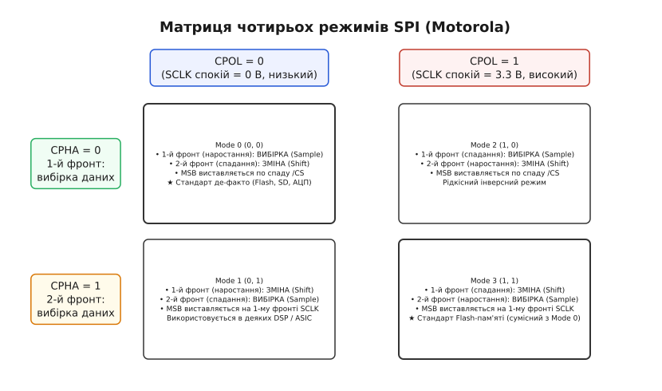
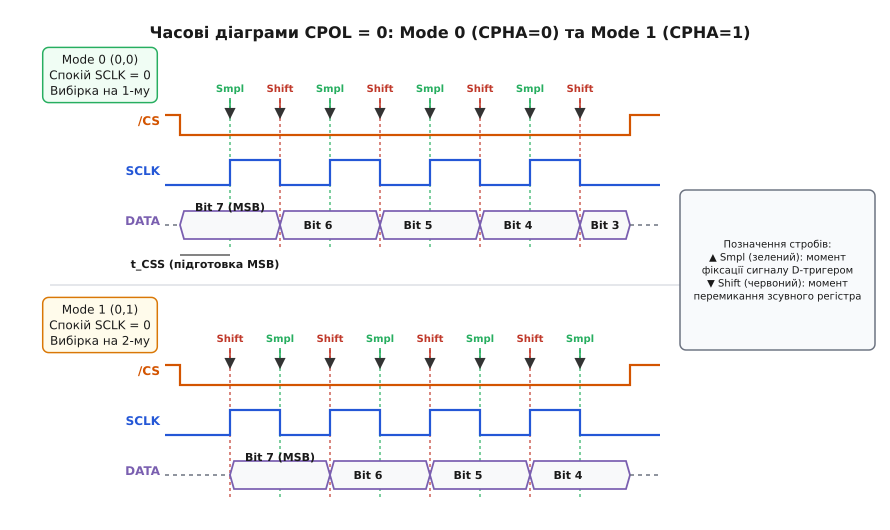
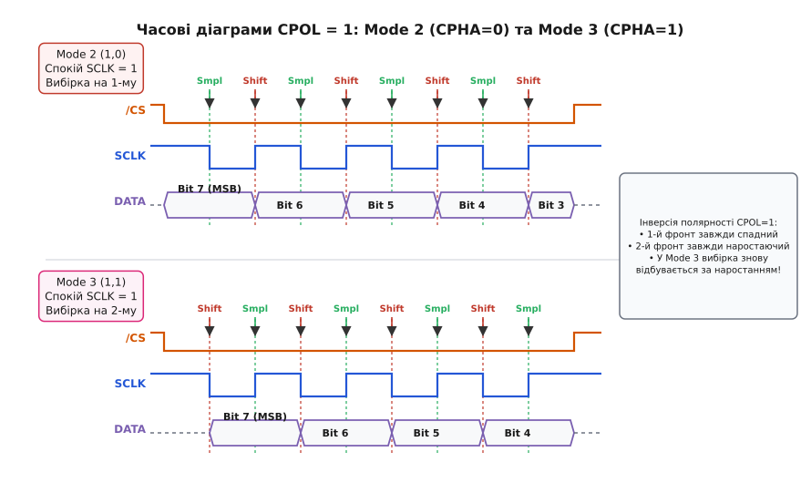
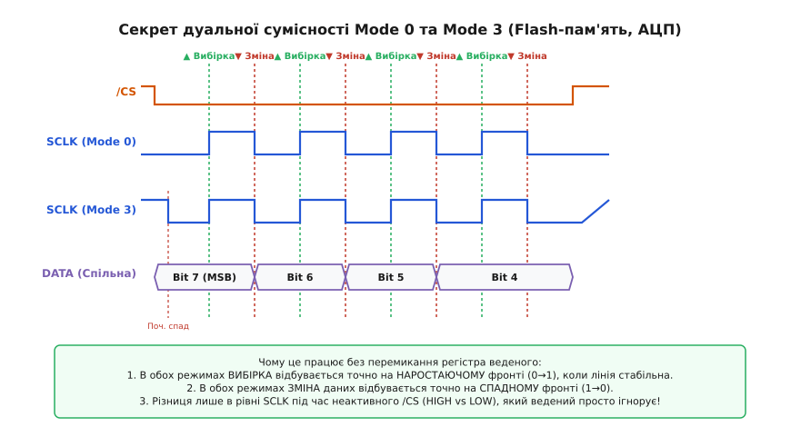
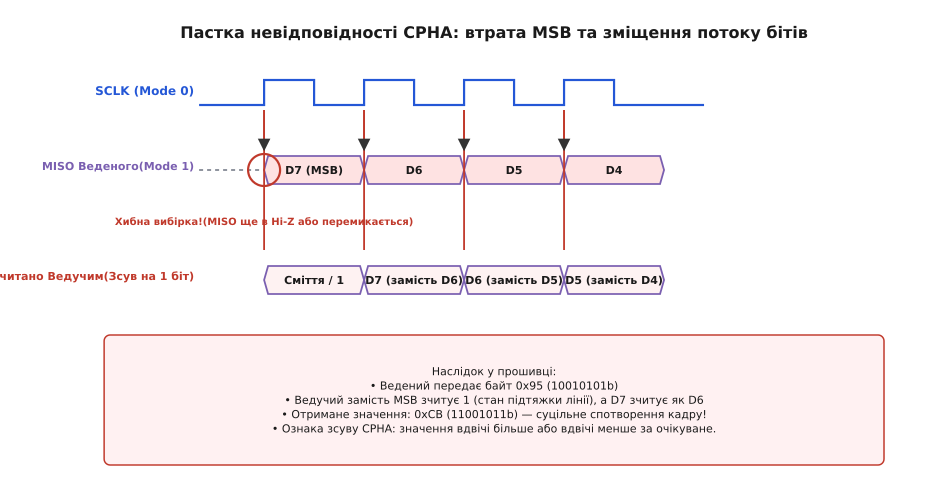
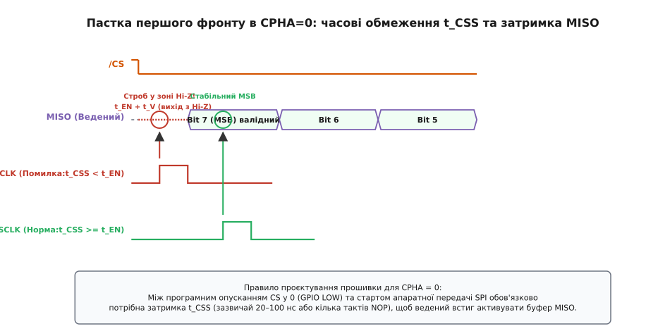

# Режими SPI (CPOL/CPHA)

<preknowlist>
- [Шина SPI](topic:com-devices/spi-bus) — синхронний 4-провідний послідовний інтерфейс обміну даними (SCLK, MOSI, MISO, CS).
- [Вибір кристала (Chip Select)](topic:com-devices/chip-select) — активний низький рівень /CS як межа транзакції та керування Z-станом лінії MISO.
- [D-тригер](topic:hw-digital/d-flip-flop) — базовий логічний елемент захоплення та фіксації логічного рівня напруги за тактовим фронтом.
- [Зсувний регістр](topic:hw-digital/shift-register) — побітове виштовхування та послідовне втягування двійкових даних у буфер процесора.
- [Часові параметри SPI](topic:com-devices/spi-timing) — фізичні часи встановлення (setup), утримання (hold) та затримки поширення сигналу.
</preknowlist>

Мікроконтролер намагається зчитати 3-байтний ідентифікатор мікросхеми Flash-пам'яті NOR через шину SPI, надсилаючи стандартну команду запиту `0x9F`. Усі фізичні з'єднання бездоганні: лінії тактування SCLK, даних MOSI та MISO перевірені мультиметром, активний низький рівень вибору кристала `/CS` опускається в нуль, а частота тактування 1 МГц на порядок нижча за граничну для мікросхеми. Замість очікуваного фірмового байта виробника `0xEF` (`11101111b`) регістр приймача стабільно отримує `0xDF` (`11011111b`) або `0x77` (`01110111b`). Дані надходять не випадковим шумом, а зі зміщенням рівно на один біт ліворуч або праворуч, де старший біт безповоротно втрачений або замінений на стан підтяжки лінії.

Причина такого збою криється у фундаментальній відмінності SPI від інших послідовних інтерфейсів. В асинхронному протоколі UART приймач самостійно підлаштовується під фазу передавача за стартовим бітом кадру, а в шині I2C правила тактування уніфіковані для всіх пристроїв у світі: дані дозволено змінювати лише за низького рівня SCL, а фіксувати — виключно за високого. Натомість шина SPI, розроблена інженерами компанії Motorola у 1980-х роках без створення жорсткого міжнародного стандарту IEEE, надає розробникам мікросхем два незалежні ступені свободи. Перший визначає, у якому логічному стані перебуває лінія тактування у спокої, а другий — на якому саме фронті тактового імпульсу цифрові приймачі зобов'язані стробувати напругу на лініях даних.

Ці два параметри отримали назви **CPOL** (*Clock Polarity*) та **CPHA** (*Clock Phase*). Разом вони утворюють чотири можливі комбінації — стандартизовані **режими SPI** (*SPI Modes 0, 1, 2, 3*). Якщо ведучий мікроконтролер та ведений датчик або мікросхема пам'яті налаштовані на різні режими, момент вибірки потрапляє на перехідний процес перемикання транзисторів, руйнуючи побітову синхронізацію всього кадру.


*Матриця чотирьох режимів Motorola SPI: комбінація полярності такту CPOL (стан спокою 0 або 1) та фази CPHA (вибірка на 1-му чи 2-му фронті) однозначно задає моменти стробування та оновлення ліній даних.*

### Фізичний та логічний зміст конфігураційних бітів CPOL та CPHA

Синхронний послідовний канал вимагає суворої черговості двох взаємовиключних фізичних дій: одна мікросхема повинна **виставити** (*Drive/Shift*) електричний потенціал на лінію, дочекатися заряду паразитної ємності провідника до стабільного рівня напруги логічного нуля або одиниці, після чого інша мікросхема повинна **зафіксувати** (*Sample/Latch*) цей потенціал своїм вхідним тригером. Щоб обидва вузли діяли злагоджено, протокол спирається на два конфігураційні біти.

#### CPOL: Полярність тактового сигналу

Параметр **CPOL** (від англ. *Clock Polarity* — полярність такту; *polarity* від грецьк. *πόλος* — вісь, полюс) визначає виключно електричний стан лінії SCLK у той час, коли шина не здійснює передачу (лінія `/CS` перебуває у неактивному високому стані логічної одиниці):

- **`CPOL = 0` (Базовий рівень — низький, LOW / 0 В):**
  У стані спокою вихідний каскад ведучого утримує лінію SCLK на рівні землі (GND). При початку передачі першим перепадом напруги на лінії є перехід від 0 В до напруги живлення `V_DD` — тобто **наростаючий фронт** (*Rising edge*, 0 → 1). Цей фронт називають **провідним** або **першим фронтом** (*Leading edge / First edge*). Другим перепадом тактового циклу є перехід від `V_DD` назад до 0 В — **спадний фронт** (*Trailing edge / Second edge*, 1 → 0).

- **`CPOL = 1` (Базовий рівень — високий, HIGH / `V_DD`):**
  У стані спокою лінія SCLK підтягнута до напруги живлення `V_DD` (зазвичай 3.3 В або 5 В). При початку передачі першим перепадом напруги є перехід від `V_DD` до 0 В — тобто **спадний фронт** (*Falling edge*, 1 → 0), який тут виступає провідним фронтом. Другим перепадом є зворотне повернення до рівня спокою — **наростаючий фронт** (*Rising edge*, 0 → 1).

Сама по собі зміна біта `CPOL` не впливає на взаємне розташування бітів у часі — вона лише інвертує логічний рівень тактової лінії SCLK, перевертаючи меандр догори дриґом.

#### CPHA: Фаза тактового сигналу

Параметр **CPHA** (від англ. *Clock Phase* — фаза такту; *phase* від грецьк. *φάσις* — поява, вияв, фаза) задає розподіл обов'язків між першим та другим фронтами кожного тактового імпульсу SCLK:

- **`CPHA = 0` (Фіксація за першим фронтом):**
  Вхідні [D-тригери](topic:hw-digital/d-flip-flop) приймача фіксують стан ліній MOSI та MISO на **першому (провідному)** фронті тактового періоду SCLK. Зміна даних передавачем відбувається на **другому (задньому)** фронті кожного такту.
  
  Звідси випливає фундаментальна часова вимога: оскільки вибірка найпершого біта кадру (старшого біта MSB) відбувається на найпершому тактовому фронті SCLK, цей біт повинен бути виставлений на лінію **до** появи першого фронту. Ведучий виставляє свій біт на лінію MOSI одночасно з початком транзакції, а ведений пристрій зобов'язаний виставити свій старший біт на лінію MISO асинхронно — у момент опускання лінії вибору кристала `/CS` у нуль, не чекаючи жодного тактового перепаду SCLK.

- **`CPHA = 1` (Фіксація за другим фронтом):**
  Перший (провідний) фронт тактового сигналу SCLK використовується передавачами для **зміни та виставлення** чергового біта на лінії даних. Вхідні тригери приймачів здійснюють **вибірку та фіксацію** даних на **другому (задньому)** фронті тактового циклу.
  
  За такого налаштування стан ліній даних у момент опускання `/CS` не має значення. Найперший фронт SCLK змушує внутрішній [зсувний регістр](topic:hw-digital/shift-register) виштовхнути старший біт на лінію, а другий фронт фіксує його в приймачі.

> 🔧 **Навіщо це.** Розділення на CPOL та CPHA дозволяє узгоджувати мікроконтролери з різними типами вхідних каскадів. Якщо зовнішня мікросхема побудована на динамічній логіці з попередньою зарядкою внутрішніх вузлів у високий стан під час пасивного такту, для неї природним є режим `CPOL = 1`. Якщо ж датчик має повільний вихідний буфер з високим часом переходу зі стану високого імпедансу (Hi-Z), режим `CPHA = 1` дає йому цілий напівперіод SCLK на встановлення напруги, знімаючи жорсткі обмеження з лінії `/CS`.

---

### Детальний покроковий аналіз чотирьох режимів Motorola SPI

Комбінація двох двійкових параметрів породжує чотири канонічні режими, що позначаються номерами від 0 до 3. Номер режиму утворюється безпосереднім двійковим зчепленням бітів: `Mode = (CPOL << 1) | CPHA`.

```
Mode 0  (CPOL = 0, CPHA = 0):  Двійковий код: 00b = 0
Mode 1  (CPOL = 0, CPHA = 1):  Двійковий код: 01b = 1
Mode 2  (CPOL = 1, CPHA = 0):  Двійковий код: 10b = 2
Mode 3  (CPOL = 1, CPHA = 1):  Двійковий код: 11b = 3
```

Розгляньмо фізичні процеси в кожному режимі крок за кроком під час передачі одного байта.

#### Mode 0 (CPOL = 0, CPHA = 0): Спокій низький, вибірка за наростанням

Mode 0 є загальноприйнятим промисловим стандартом за замовчуванням. Його підтримують практично всі карти пам'яті SD/MMC, мікросхеми Flash-пам'яті Winbond, сенсори руху та графічні дисплеї.

1. **Фаза спокою:** Лінія `/CS` утримується на рівні 3.3 В (HIGH). Лінія SCLK стабільно перебуває на рівні 0 В (GND). Вихід MISO веденого переведений у стан високого імпедансу (Hi-Z).
2. **Ініціалізація транзакції:** Ведучий опускає лінію `/CS` у 0 В. Спадний перепад `/CS` слугує асинхронним стробом для веденого: ведений вимикає стан Hi-Z і виставляє рівень напруги старшого біта (Bit 7, MSB) на лінію MISO. Ведучий одночасно виставляє свій Bit 7 на лінію MOSI.
3. **1-й фронт SCLK (наростання 0 → 1):** Обидві сторони зчитують встановлений біт. D-тригери фіксують логічні рівні напруги MOSI та MISO вхідними каскадами.
4. **2-й фронт SCLK (спадання 1 → 0):** Обидва вузли зсувають внутрішні регістри та виставляють наступний біт (Bit 6) на лінії передачі.
5. **Подальші такти:** Процес повторюється: кожне наступне наростання SCLK стробує черговий біт, а кожне спадання — змінює стан лінії.
6. **Завершення кадру:** Після 8-го спадання SCLK ведучий піднімає лінію `/CS` у високий стан. Ведений негайно переводить свій вивід MISO назад у стан високого імпедансу Hi-Z, звільняючи спільну лінію для інших пристроїв.


*Часові діаграми для полярності CPOL=0 (SCLK у спокої 0 В): у Mode 0 (ліворуч) вибірка виконується за наростаючим фронтом, а старший біт виставляється по спаду /CS; у Mode 1 (праворуч) старший біт виставляється на першому наростанні SCLK, а фіксується на спаданні.*

#### Mode 1 (CPOL = 0, CPHA = 1): Спокій низький, вибірка за спаданням

Mode 1 використовується у деяких цифрових сигнальних процесорах (DSP), вимірювальних АЦП фірми Texas Instruments та специфічних промислових контролерах.

1. **Фаза спокою:** Лінія SCLK утримується на рівні 0 В. Лінія `/CS` перебуває у високому стані 3.3 В.
2. **Ініціалізація транзакції:** Ведучий опускає `/CS` у 0 В. Ведений активує свій вихідний буфер MISO, але виставлення біта ще не відбувається (на лінії може утримуватися попередній рівень або стан підтяжки).
3. **1-й фронт SCLK (наростання 0 → 1):** Цей перепад є сигналом зміни даних. Ведучий виставляє Bit 7 на лінію MOSI, а ведений виставляє свій Bit 7 на лінію MISO. Протягом тривалості високого рівня SCLK напруга на лініях стабілізується.
4. **2-й фронт SCLK (спадання 1 → 0):** Здійснюється вибірка. Вхідні тригери обох пристроїв фіксують логічний стан ліній MOSI та MISO.
5. **Подальші такти:** На кожному непарному наростаючому фронті (3-й, 5-й, 7-й...) виставляються біти 6, 5, 4..., а на кожному парному спадному фронті (4-й, 6-й, 8-й...) ці біти фіксуються приймачами.
6. **Завершення кадру:** Після вибірки останнього біта на 8-му спадному фронті лінія SCLK повертається до рівня спокою 0 В, а підняття `/CS` повертає MISO у стан високого імпедансу.

#### Mode 2 (CPOL = 1, CPHA = 0): Спокій високий, вибірка за спаданням

Mode 2 є дзеркальним відображенням Mode 0 з інвертованою полярністю сигналу SCLK. Зустрічається рідко, переважно в спеціалізованих мікросхемах телеметрії та лінійних кодерах.

1. **Фаза спокою:** Лінія SCLK утримується на рівні живлення `V_DD` (3.3 В). Лінія `/CS` неактивна (HIGH).
2. **Ініціалізація транзакції:** Ведучий переводить `/CS` у 0 В. За цим перепадом ведений негайно виставляє рівень напруги старшого біта (Bit 7) на лінію MISO, а ведучий — на лінію MOSI.
3. **1-й фронт SCLK (спадання 1 → 0):** Оскільки рівнем спокою була одиниця, першим перепадом є спад напруги до 0 В. На цьому спадному фронті приймачі виконують вибірку Bit 7.
4. **2-й фронт SCLK (наростання 0 → 1):** Лінія SCLK повертається до високого рівня `V_DD`. На цьому перепаді передавачі виставляють наступний Bit 6.
5. **Подальші такти:** Усі непарні фронти (спадання) фіксують біти, а всі парні фронти (наростання) перемикають зсувні регістри.


*Часові діаграми для полярності CPOL=1 (SCLK у спокої 3.3 В): у Mode 2 (ліворуч) вибірка здійснюється на першому спадному фронті, а в Mode 3 (праворуч) перший спад виставляє біт даних, тоді як наростаючий фронт надійно його фіксує.*

#### Mode 3 (CPOL = 1, CPHA = 1): Спокій високий, вибірка за наростанням

Mode 3 — другий за поширеністю режим у сучасній електроніці поряд із Mode 0. Майже всі мікросхеми послідовної Flash-пам'яті NOR та EEPROM підтримують Mode 3 нарівні з Mode 0.

1. **Фаза спокою:** Лінія SCLK перебуває на рівні 3.3 В (`V_DD`). Лінія `/CS` утримується на рівні 3.3 В.
2. **Ініціалізація транзакції:** Ведучий опускає лінію `/CS` у 0 В.
3. **1-й фронт SCLK (спадання 1 → 0):** Провідний перепад від `V_DD` до 0 В змушує ведучого та веденого виставити старший біт Bit 7 на лінії MOSI та MISO.
4. **2-й фронт SCLK (наростання 0 → 1):** Зворотний перехід до високого рівня живлення слугує стробом вибірки: вхідні каскади фіксують логічний рівень Bit 7.
5. **Подальші такти:** Кожне спадання SCLK виштовхує черговий біт даних, а кожне наростання фіксує його в приймачі.
6. **Завершення кадру:** Після 8-го наростаючого фронту лінія SCLK залишається на рівні 3.3 В (що є її штатним рівнем спокою), а ведучий піднімає `/CS` у високий стан.

#### Зведена таблиця характеристик режимів SPI

| Режим SPI | CPOL | CPHA | Рівень спокою SCLK | 1-й (провідний) фронт | Дія на 1-му фронті | 2-й (задній) фронт | Дія на 2-му фронті | Момент виставлення MSB |
| :--- | :---: | :---: | :---: | :---: | :---: | :---: | :---: | :--- |
| **Mode 0** | 0 | 0 | LOW (0 В) | Наростання (0 → 1) | **Вибірка (Sample)** | Спадання (1 → 0) | Зміна (Shift) | По спаду `/CS` |
| **Mode 1** | 0 | 1 | LOW (0 В) | Наростання (0 → 1) | Зміна (Shift) | Спадання (1 → 0) | **Вибірка (Sample)** | На 1-му фронті SCLK |
| **Mode 2** | 1 | 0 | HIGH (`V_DD`) | Спадання (1 → 0) | **Вибірка (Sample)** | Наростання (0 → 1) | Зміна (Shift) | По спаду `/CS` |
| **Mode 3** | 1 | 1 | HIGH (`V_DD`) | Спадання (1 → 0) | Зміна (Shift) | Наростання (0 → 1) | **Вибірка (Sample)** | На 1-му фронті SCLK |

---

### Часові параметри та фізичні обмеження

Щоб передача в будь-якому з чотирьох режимів відбувалася без збоїв, форма сигналів повинна відповідати динамічним характеристикам кремнієвих тригерів. Власні затримки логічних вентилів формують часовий бюджет шини, порушення якого викликає метастабільність тригерів.

```
       /CS  ──┐                                                    ┌──
              └────────────────────────────────────────────────────┘
                  │◄─ t_CSS ─►│                            │◄t_CSH►│
      SCLK  ──────────────────┐        ┌───┐        ┌───┐  ─────────
                              └────────┘   └────────┘   └───
                              │◄ t_LO ─►│◄─ t_HI ─►│
                                        ▲
                                   Строб вибірки
                                   │◄t_SU►│◄t_H►│
      DATA  ══════════════════╤═══════════╪═════════╤═══════════════
                              │  Bit N    │ Bit N-1 │
                              └───────────┴─────────┘
                              │◄── t_V ──►│
```

Ключові часові параметри включають:

1. **Час встановлення `t_SU` (*Data Setup Time*):**
   Мінімальний інтервал часу, протягом якого стабільна напруга логічного рівня повинна бути присутня на вході приймача **до** настання стробуючого фронту SCLK. За цей час вхідна ємність затворів вхідних польових транзисторів встигає повністю зарядитися або розрядитися. Для типових мікросхем на частотах 10–50 МГц величина `t_SU` становить від 2 до 10 нс.

2. **Час утримання `t_H` (*Data Hold Time*):**
   Мінімальний інтервал часу після проходження стробуючого фронту SCLK, протягом якого передавач не має права змінювати стан лінії даних. Якщо напруга почне змінюватися занадто швидко, тригер приймача не встигне зафіксувати внутрішній логічний зворотний зв'язок. Типове значення `t_H` становить 2–5 нс.

3. **Час затримки виходу `t_V` або `t_PROP` (*Clock to Output Valid Delay*):**
   Час, необхідний вихідному каскаду передавача для перемикання лінії з моменту настання тактового фронту зміни даних до досягнення валідного рівня напруги `V_OL ≤ 0.4 В` або `V_OH ≥ 2.4 В`. У ведених пристроях час `t_V` зазвичай є найповільнішим параметром (від 8 до 25 нс).

4. **Час витримки вибору кристала `t_CSS` (*CS Setup to SCLK Time*):**
   Часовий інтервал між моментом переведення лінії `/CS` у низький рівень (0 В) та першим стробуючим фронтом сигналу SCLK. Цей параметр має вирішальне значення для режимів `CPHA = 0`. Оскільки ведений повинен виставити старший біт на лінію MISO по спаду `/CS`, затримка `t_CSS` з боку ведучого зобов'язана перекривати час активації вихідного буфера веденого з Z-стану:

```
t_CSS ≥ t_DIS→EN(slave) + t_SU(master)
```

Якщо ведучий подасть перший фронт SCLK раніше, ніж спливе цей час, приймач зафіксує плаваючий потенціал відкритої лінії, що призведе до спотворення старшого біта кадру.

Розрахунок максимальної робочої частоти шини `f_MAX` для вибраного режиму визначається сумою затримок у найгіршому випадку:

```
T_SCLK(min) = 2 · (t_V(slave) + t_PROP(траси) + t_SU(master))
f_MAX = 1 / T_SCLK(min)
```

При довжині провідників на друкованій платі 10 см час поширення електромагнітної хвилі `t_PROP ≈ 0.7 нс`. Якщо `t_V = 15 нс`, а `t_SU = 5 нс`, то мінімальний напівперіод такту становить:

```
t_half(min) = 15 + 0.7 + 5 = 20.7 нс
T_SCLK(min) = 41.4 нс
f_MAX ≈ 24.15 МГц
```

---

### Феномен дуальної сумісності Mode 0 та Mode 3

У документації (*Datasheet*) на популярні мікросхеми Flash-пам'яті (наприклад, Winbond W25Q128, Macronix MX25L, Micron N25Q), послідовні EEPROM (Microchip 25AA040), цифрові акселерометри (Analog Devices ADXL345) та АЦП (MCP3008) інженери часто бачать рядок: *«Supports SPI Mode 0 (0,0) and Mode 3 (1,1)»*. При цьому мікросхема не має жодних додаткових виводів конфігурації або спеціальних бітів у регістрах для вибору режиму.

Як один і той самий апаратний логічний вузол може коректно працювати одночасно у двох режимах із протилежними полярностями такту?


*Механізм дуальної сумісності Mode 0 та Mode 3: під час активного стану /CS обидва режими здійснюють вибірку на наростаючому фронті, а зміну — на спадному. Різниця полягає виключно в рівні SCLK у пасивному стані шини.*

Відповідь полягає в зіставленні фізичних фронтів, що відповідають за операції вибірки та зміни даних у цих двох режимах:

1. **В обох режимах вибірка (Sample) здійснюється суворо за НАРОСТАЮЧИМ фронтом (0 → 1):**
   - У Mode 0 наростання є першим фронтом тактового циклу.
   - У Mode 3 наростання є другим фронтом тактового циклу.
   - Проте фізичний напрямок перепаду напруги абсолютно однаковий — перехід від низького потенціалу до високого.
2. **В обох режимах зміна (Shift) здійснюється суворо за СПАДНИМ фронтом (1 → 0):**
   - У Mode 0 спадання є другим фронтом такту.
   - У Mode 3 спадання є першим фронтом такту.
   - Фізичний перепад напруги ідентичний — перехід від високого потенціалу до низького.

Внутрішня схемотехніка таких ведених мікросхем влаштована гранично просто: тактовий вхід SCLK підключається до логічних вентилів через внутрішній строб дозволу від лінії `/CS`.

- Коли `/CS = 1` (спокій), внутрішній тактовий генератор заблокований, і будь-який постійний логічний рівень на лінії SCLK (0 В для Mode 0 або 3.3 В для Mode 3) повністю ігнорується.
- Коли `/CS = 0` (активна транзакція), внутрішня логіка веденого просто реагує на всі фізичні перепади напруги:
  - Кожен спадний фронт (1 → 0) виштовхує черговий біт із внутрішнього зсувного регістра на лінію MISO.
  - Кожен наростаючий фронт (0 → 1) замикає вхідний D-тригер, фіксуючи поточний стан лінії MOSI.

У Mode 3 після опускання `/CS` лінія SCLK перебуває у високому стані. Перший тактовий імпульс починається зі спаду напруги (1 → 0). Ведений сприймає цей перший спадний фронт як команду на виставлення старшого біта (хоча біт уже було виставлено при опусканні `/CS`), а наступне за ним наростання (0 → 1) фіксує біт у приймачі.

Таким чином, усередині часового вікна активного сигналу `/CS` послідовність фізичних перемикань ліній даних для Mode 0 та Mode 3 є повністю тотожною. Єдина відмінність полягає в тому, з якого рівня напруги стартує лінія SCLK, що дозволяє одному й тому самому веденому кристалу безперешкодно спілкуватися з будь-яким ведучим, налаштованим на Mode 0 або Mode 3.

---

### Діагностика типових апаратних та програмних помилок

Помилки конфігурації фази та полярності належать до категорії «плаваючих» несправностей: логічний аналізатор або осцилограф показує чіткі прямокутні імпульси, живлення стабільне, але передані байти деформуються.

#### Помилка 1: Неузгодженість CPHA та зміщення бітового потоку на 1 такт

Найпоширеніший сценарій: ведучий налаштований на **Mode 0** (`CPHA = 0`), а ведений очікує **Mode 1** (`CPHA = 1`), або навпаки.


*Осцилограма збою при неузгодженості CPHA: ведучий виконує вибірку на першому фронті, коли ведений ще перебуває в стані Hi-Z або тільки починає перемикання. Результатом стає зсув усього байта на 1 позицію та спотворення значення з 0x95 до 0xCB.*

Розгляньмо, що відбувається на фізичному рівні:

1. Ведучий у Mode 0 опускає `/CS` і на першому ж наростаючому фронті SCLK намагається зафіксувати старший біт D7.
2. Ведений, налаштований на Mode 1, вважає перше наростання сигналом для *виставлення* даних. До цього моменту його вихідний каскад або утримувався у стані Hi-Z (з підтяжкою до 3.3 В через резистор), або зберігав залишковий стан.
3. У результаті ведучий зчитує замість реального біта D7 логічну одиницю підтяжки або невизначений стан перехідного процесу.
4. На другому (спадному) фронті ведений виставляє наступний біт, або ведучий зчитує D7 аж на третьому фронті, вважаючи його бітом D6.

**Практичний приклад спотворення даних:**
Ведений передає статусний байт `0x95` (`10010101b`).

```
Реальні біти веденого:      [D7:1] [D6:0] [D5:0] [D4:1] [D3:0] [D2:1] [D1:0] [D0:1]
Зчитано ведучим (Mode 0):   [ 1  ] [D7:1] [D6:0] [D5:0] [D4:1] [D3:0] [D2:1] [D1:0]
Отриманий байт:             11001010b = 0xCA (або 0xCB залежно від D0)
```

**Діагностична ознака:** Зчитані значення завжди зсунуті в бінарному поданні рівно на 1 біт праворуч (`>> 1`) або ліворуч (`<< 1`), а молодший або старший біт стабільно дорівнює `1` чи `0`.

#### Помилка 2: Пастка першого фронту в CPHA=0 та порушення `t_CSS`

У режимі `CPHA = 0` вибірка старшого біта здійснюється за найпершим перепадом SCLK. Якщо мікроконтролер виконує керування виводом `/CS` вручну через регістри GPIO (програмне керування CS), а тактування шини SPI здійснюється швидкісним апаратним периферійним модулем із DMA, виникає часова колізія.


*Пастка першого фронту в режимі CPHA=0: швидкий старт тактування SCLK безпосередньо після опускання /CS призводить до вибірки сигналу в момент перехідного процесу виходу MISO з Z-стану.*

Процесор виконує інструкцію скидання біта GPIO `CS_LOW()` і негайно, на наступному тактовому циклі ядра, записує байт у регістр даних `SPI->DR`. Апаратний модуль SPI миттєво генерує наростаючий фронт SCLK (через 10–20 нс після спаду `/CS`). Проте вихідний буфер веденого датчика вимагає час активації `t_DIS→EN = 50 нс`, щоб відкрити вихідні польові транзистори лінії MISO.

Вхідний D-тригер ведучого стробує напругу рівно в той момент, коли вихід веденого все ще перебуває у стані високого імпедансу. Замість справжнього біта D7 ведучий фіксує одиницю внутрішньої підтяжки.

**Лікування:** Введення гарантованої мікросекундної або наносекундної апаратної паузи між опусканням лінії `/CS` та записом першого байта в буфер SPI (наприклад, виконання кількох інструкцій `__NOP()` або використання апаратного сигналу керування CS периферійного блоку мікроконтролера, який автоматично витримує захисний інтервал `t_CSS`).

#### Помилка 3: Голка на лінії тактування (SCLK Glitch) при зміні CPOL

Якщо мікроконтролер ініціалізує лінію SCLK як звичайний вивід GPIO з початковим низьким рівнем (0 В), а згодом налаштовує периферійний модуль SPI на роботу в **Mode 2** або **Mode 3** (`CPOL = 1`), у момент активації модуля напруга на виводі SCLK стрибкоподібно зростає від 0 В до 3.3 В.

Якщо в цей момент лінія `/CS` якогось із ведених пристроїв на шині була випадково опущена або перебувала в невизначеному стані під час увімкнення живлення, ведений сприймає цей стрибок як повноцінний тактовий імпульс. Його внутрішній зсувний регістр зсувається на 1 біт ще до початку реального сеансу зв'язку. Усі наступні байти виявляються незворотно десинхронізованими.

**Лікування:** До активації периферійного блока SPI вивід GPIO, призначений для SCLK, повинен бути сконфігурований у режим виходу з високим логічним рівнем (HIGH) та підтяжкою до живлення (*Pull-Up*), якщо цільовим режимом є Mode 2 або Mode 3.

#### Помилка 4: Спільна шина з різнорідними режимами пристроїв

Часто на одну апаратну шину SPI підключають кілька ведених з різними вимогами: наприклад, екран працює в Mode 0, а спеціалізований вимірювальний АЦП — виключно в Mode 2 (`CPOL = 1`).

При перемиканні ведучого між цими пристроями неприпустимо змінювати регістр `CPOL` у той час, коли лінія `/CS` одного з пристроїв активна (низька). Зміна полярності породить паразитний фронт на SCLK, який пошкодить кадр активного веденого.

**Алгоритм безпечного перемикання режимів на спільній шині:**
1. Завершити транзакцію з поточним пристроєм, підняти його лінію `/CS` у високий стан (1).
2. Переконатися, що **всі** лінії `/CS` усіх пристроїв на шині стабільно перебувають у високому стані (1).
3. Зупинити або деактивувати модуль SPI (`SPI_CR1_SPE = 0`).
4. Змінити біти `CPOL` та `CPHA` в регістрах керування на значення, необхідні для наступного пристрою.
5. Увімкнути модуль SPI (`SPI_CR1_SPE = 1`).
6. Витримати коротку паузу стабілізації лінії SCLK у новому рівні спокою.
7. Опустити лінію `/CS` цільового пристрою в нуль і розпочати передачу.

---

### Конфігурація режимів у реальних системах

У мікроконтролерних архітектурах та операційних системах вибір режиму реалізується через бітові маски керуючих регістрів або стандартизовані структури дескрипторів.

#### Апаратні регістри STM32

У мікроконтролерах сімейства STM32 конфігурація режимів зосереджена в молодших бітах регістра керування `SPI_CR1`:
- Біт 1 (`CPOL`): Полярність тактового сигналу (0 = рівень спокою 0, 1 = рівень спокою 1).
- Біт 0 (`CPHA`): Фаза тактового сигналу (0 = вибірка за 1-м фронтом, 1 = вибірка за 2-м фронтом).

```
 15   14   13   12   11   10    9    8    7    6    5    4    3    2    1     0
┌────┬────┬────┬────┬────┬────┬────┬────┬────┬────┬────┬────┬────┬────┬─────┬─────┐
│BID │BID │CRC │CRC │DFF │RXO │SSM │SSI │LSB │SPE │BR2 │BR1 │BR0 │MSTR│CPOL │CPHA │
└────┴────┴────┴────┴────┴────┴────┴────┴────┴────┴────┴────┴────┴────┴─────┴─────┘
                                                                       ▲     ▲
                                                                       │     │
                                                                       └─────┴── Вибір Mode 0..3
```

Зміна цих бітів дозволена виключно тоді, коли апаратний периферійний блок вимкнений (біт `SPE = 0`).

#### Конфігурація в ESP-IDF (ESP32)

В операційній системі ESP-IDF конфігурація режиму задається цілочисельним полем `mode` (від 0 до 3) у структурі `spi_device_interface_config_t`:

:::tabs
```c
#include "driver/spi_master.h"

spi_device_handle_t spi_dev;
spi_device_interface_config_t devcfg = {
    .clock_speed_hz = 10 * 1000 * 1000, // Тактова частота 10 МГц
    .mode = 0,                          // Mode 0 (CPOL=0, CPHA=0)
    .spics_io_num = 5,                  // Вивід Chip Select (GPIO 5)
    .queue_size = 7,
};
// Реєстрація пристрою на шині SPI2_HOST
spi_bus_add_device(SPI2_HOST, &devcfg, &spi_dev);
```
```cpp
#include "driver/spi_master.h"
#include <stdexcept>

class EspSpiDevice {
public:
    EspSpiDevice(spi_host_device_t host, int cs_pin, int mode, int speed_hz) {
        spi_device_interface_config_t devcfg{};
        devcfg.clock_speed_hz = speed_hz;
        devcfg.mode = static_cast<uint8_t>(mode); // Вибір режиму 0..3
        devcfg.spics_io_num = cs_pin;
        devcfg.queue_size = 1;

        if (spi_bus_add_device(host, &devcfg, &handle_) != ESP_OK) {
            throw std::runtime_error("Не вдалося додати пристрій SPI до шини");
        }
    }

    ~EspSpiDevice() {
        if (handle_) {
            spi_bus_remove_device(handle_);
        }
    }

    spi_device_handle_t get() const noexcept { return handle_; }

private:
    spi_device_handle_t handle_{nullptr};
};
```
:::

#### Підсистема SPI в ядрі Linux (spidev)

У середовищі Linux режим SPI налаштовується користувацьким простором через системний виклик `ioctl` над файлом пристрою `/dev/spidevX.Y` за допомогою макросів із заголовкового файлу `<linux/spi/spidev.h>`:

:::tabs
```c
#include <fcntl.h>
#include <unistd.h>
#include <sys/ioctl.h>
#include <linux/spi/spidev.h>
#include <stdint.h>
#include <stdio.h>

int set_spi_mode(const char *device_path, uint8_t mode) {
    int fd = open(device_path, O_RDWR);
    if (fd < 0) return -1;

    /* mode може набувати значень: SPI_MODE_0, SPI_MODE_1, SPI_MODE_2, SPI_MODE_3 */
    if (ioctl(fd, SPI_IOC_WR_MODE, &mode) < 0) {
        close(fd);
        return -2;
    }

    return fd;
}
```
```cpp
#include <fcntl.h>
#include <unistd.h>
#include <sys/ioctl.h>
#include <linux/spi/spidev.h>
#include <cstdint>
#include <string_view>
#include <system_error>

class LinuxSpidev {
public:
    enum class Mode : uint8_t {
        Mode0 = SPI_MODE_0,
        Mode1 = SPI_MODE_1,
        Mode2 = SPI_MODE_2,
        Mode3 = SPI_MODE_3
    };

    explicit LinuxSpidev(std::string_view path, Mode mode) {
        fd_ = ::open(path.data(), O_RDWR);
        if (fd_ < 0) {
            throw std::system_error(errno, std::generic_category(), "Не вдалося відкрити пристрій spidev");
        }

        uint8_t raw_mode = static_cast<uint8_t>(mode);
        if (::ioctl(fd_, SPI_IOC_WR_MODE, &raw_mode) < 0) {
            ::close(fd_);
            throw std::system_error(errno, std::generic_category(), "Помилка встановлення режиму SPI_IOC_WR_MODE");
        }
    }

    ~LinuxSpidev() {
        if (fd_ >= 0) ::close(fd_);
    }

    int native_handle() const noexcept { return fd_; }

private:
    int fd_{-1};
};
```
:::

Для вичерпного практичного аналізу того, як алгоритми керування виводами реалізуються на рівні окремих інструкцій мікроконтролера та як будувати власні часові затримки для всіх чотирьох режимів без апаратного модуля, доступна окрема [програмна реалізація біт-бенгінгу](topic:com-devices/spi-mode-timing-and-faults/proj-spi-bitbang.md).

---

### Підсумок інваріантів режимів SPI

Усі чотири режими Motorola SPI спираються на простий і строгий набір інженерних правил:

1. **CPOL змінює лише стан спокою:** `CPOL = 0` означає низький рівень SCLK у спокої, а `CPOL = 1` — високий. Напрямок фаз тактів інвертується, але порядок обробки бітів не порушується.
2. **CPHA визначає розподіл ролей фронтів:** За `CPHA = 0` вибірка завжди відбувається на першому фронті тактового імпульсу, а старший біт кадру зобов'язаний з'явитися на лінії до першого такту (по спаду `/CS`). За `CPHA = 1` перший фронт лише виставляє біт, а вибірка відбувається на другому фронті.
3. **Mode 0 та Mode 3 апаратно сумісні на рівні протоколу:** Обидва режими здійснюють вибірку за наростаючим фронтом ($0 \to 1$), а зміну даних — за спадним ($1 \to 0$), що дозволяє веденим мікросхемам пам'яті та сенсорів підтримувати обидва стандарти одночасно.
4. **Неузгодженість CPHA неминуче зсуває потік даних на 1 біт:** Якщо пристрій зчитує зміщені на 1 позицію байти з фальшивим старшим або молодшим бітом, першочерговою дією є перевірка відповідності біта `CPHA` вимогам документації веденого вузла.
