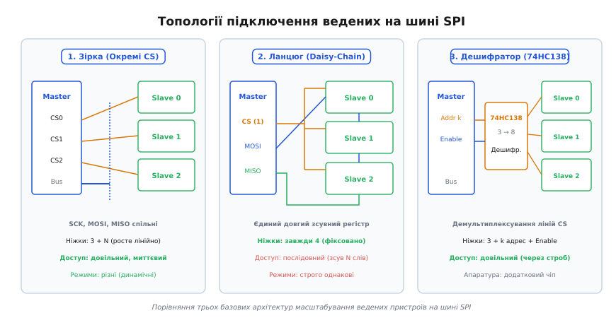
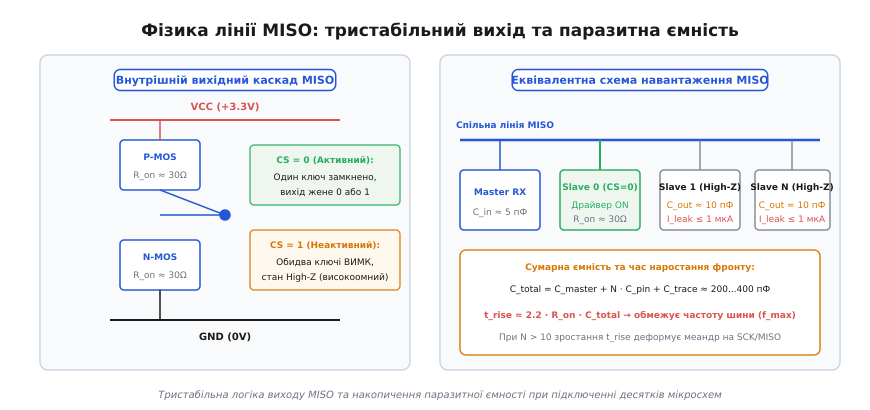
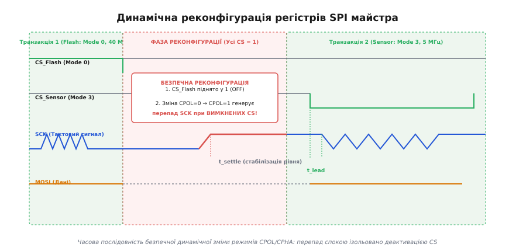
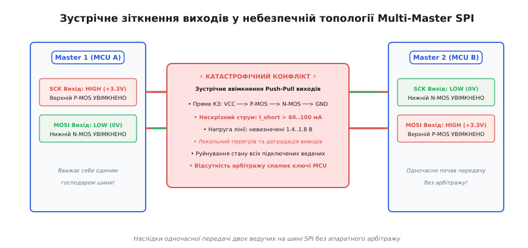
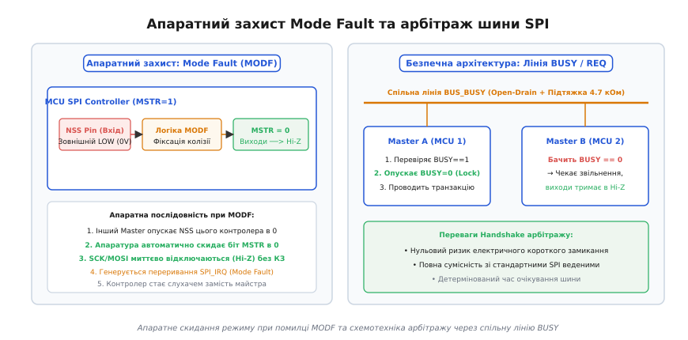

# SPI з кількома веденими і режимами

<preknowlist>
- [Шина SPI](root:com-devices/spi-bus) — кільце зсувних регістрів, чотири базові лінії та концепція повного дуплексу.
- [Лінії SPI](root:com-devices/spi-lines) — ролі сигналів SCK, MOSI, MISO, CS та фізика двотактного виходу push-pull.
- [Режими CPOL/CPHA](root:com-devices/spi-mode-selection) — чотири комбінації полярності й фази тактування та вибірка даних по фронтах.
- [Вибір кристала (CS)](root:com-devices/chip-select) — базова зіркова топологія та активний нуль лінії вибору.
- [Конфлікти шин](root:com-devices/bus-resource-conflicts) — електричні колізії, наскрізні струми та конкуренція ресурсів у спільних лініях.
</preknowlist>

На платі промислового контролера або польотного комп'ютера безпілотника до єдиного апаратного модуля SPI (*Serial Peripheral Interface*) одночасно підключають високошвидкісну Flash-пам'ять на 50 МГц, тривісний гіроскоп на 10 МГц, OLED-дисплей та прецизійний 24-бітний АЦП. Flash-пам'ять вимагає режиму Mode 0 (CPOL=0, CPHA=0), гіроскоп працює виключно у Mode 3 (CPOL=1, CPHA=1), а АЦП потребує Mode 1 на зниженій до 2 МГц частоті. Якщо мікроконтролер просто перемкне регістр полярності такту CPOL посеред роботи, на спільній лінії SCK виникне паразитний перепад напруги, через який АЦП сприйме випадковий імпульс як початок передачі та зсуне всі байти у відповіді рівно на 1 біт.

Ситуація ускладнюється, коли на тій самій платі працює резервний мікроконтролер, здатний перехоплювати керування сенсорами. Оскільки стандарт SPI не має вбудованого апаратного арбітражу, одночасна спроба двох ведучих згенерувати тактовий сигнал призводить до прямого короткого замикання між виходами з наскрізним струмом понад 60 мА. Просте лабораторне з'єднання «один ведучий — один ведений» у реальних виробах перетворюється на складну схемотехнічну та програмну систему, де необхідно узгоджувати топологію вибору, електричні характеристики спільних ліній, динамічну реконфігурацію та безпеку багатомайстрового доступу.

---

### Топології вибору ведених: індивідуальний CS проти Daisy-Chain

Оскільки шина SPI не містить адреси пристрою всередині протокольного пакета (на відміну від I2C або CAN), адресація реалізується суто просторово. Вибір конкретного веденого покладається на схемотехнічну топологію плати.


*Порівняння трьох архітектур масштабування: класична зірка з індивідуальними лініями CS0..CS2 забезпечує довільний доступ за рахунок зростання кількості виводів; послідовний ланцюг Daisy-Chain фіксує кількість ліній до чотирьох, але вимагає монолітного зсуву даних; дешифратор скорочує витрати виводів GPIO для великої кількості незалежних мікросхем.*

#### 1. Зіркова топологія (Independent Slave Selection)

У класичній зірковій конфігурації три сигнальні лінії — тактування SCK (*Serial Clock*), передача даних від ведучого MOSI (*Master Out, Slave In*) та прийом даних MISO (*Master In, Slave Out*) — прокладаються паралельно до всіх мікросхем. Для кожного веденого призначається власна незалежна лінія вибору кристала CS (*Chip Select*, активний логічний нуль).

```
Ведучий (Master)                      Ведені (Slaves)
┌───────────────┐
│           SCK ├─────────────────────────┬───────────────┬───────────────► До всіх
│          MOSI ├─────────────────────────┼───────────────┼───────────────► До всіх
│          MISO ◄─────────────────────────┴───────────────┴───────────────◄ Від усіх
│               │
│           CS0 ├────────────────────────► [Ведений 0]
│           CS1 ├────────────────────────────────────────► [Ведений 1]
│           CS2 ├────────────────────────────────────────────────────────► [Ведений 2]
└───────────────┘
```

**Переваги архітектури:**
1. **Довільний та миттєвий доступ:** Ведучий може в будь-який момент ініціювати транзакцію з довільним чіпом, просто опустивши його лінію CS у нуль.
2. **Повна незалежність параметрів:** Кожен ведений може мати власну розрядність слів (8, 16 або 32 біти), власну граничну швидкість та власний режим CPOL/CPHA.
3. **Мінімальний трафік:** Для оновлення одного регістра в одному датчику передається рівно стільки байтів, скільки вимагає цей регістр, без торкання інших пристроїв.

**Схемотехнічна ціна та обмеження:**
Головна плата за гнучкість — стрімке зростання кількості виводів мікроконтролера. Для підключення `N` пристроїв потрібно `3 + N` фізичних ліній. При `N = 10` шина займає 13 виводів корпусу. 

Крім того, кожен вивід CS вимагає індивідуального зовнішнього підтягуючого резистора до шини живлення `VCC` (номіналом 10 кОм), що збільшує кількість пасивних компонентів на платі. При проектуванні друкованої плати зіркова топологія створює високу щільність трасування довкола корпусу мікроконтролера, а довгі паралельні провідники ліній CS підвищують ризик ємнісного наведення перехресних завад (*crosstalk*).

#### 2. Послідовне каскадне з'єднання (Daisy-Chain)

У топології Daisy-Chain (від англ. *daisy chain* — «гірлянда маргариток», каскадне з'єднання) ведені пристрої з'єднуються послідовно у єдиний довгий зсувний регістр.

Лінії SCK та CS робляться спільними для всіх мікросхем. Вихід MOSI ведучого заходить у вхід даних першого веденого (SDI). Вихід даних першого веденого (SDO) підключається до входу SDI другого веденого, і так далі вздовж усього ланцюга. Вихід SDO останнього веденого повертається на лінію MISO ведучого.

```
┌───────────────┐
│        Master │
│           CS  ├───────────────┬─────────────────────────┬───────────────┐
│           SCK ├───────────────┼─────────────────────────┼───────────────┤
│          MOSI ├──► [SDI    SDO]──► [SDI          SDO]──► [SDI    SDO]──┘
│          MISO ◄─────────────────────────────────────────────────────────┘
└───────────────┘     Ведений 0        Ведений 1             Ведений N-1
```

**Механізм функціонування:**
1. Ведучий опускає спільну лінію CS у логічний нуль.
2. Ведучий генерує `N · B` тактових імпульсів SCK (де `N` — кількість ведених, `B` — розрядність регістра одного пристрою, наприклад 8 бітів).
3. Дані просуваються крізь усі внутрішні зсувні регістри мікросхем, наче по конвеєру.
4. Ведучий піднімає лінію CS у високий рівень. За цим фронтом усі ведені одночасно фіксують (*latch*) накопичені біти зі своїх зсувних регістрів у виконавчі регістри керування.

**Критичні обмеження Daisy-Chain:**
- **Підтримка кремнієм:** Далеко не всі мікросхеми підтримують наскрізний зсув даних. У більшості складних сенсорів (наприклад, SPI Flash пам'яті або акселерометрів) вихід MISO утримується у високому імпедансі під час прийому команди і не ретранслює вхідний потік MOSI. Каскадування застосовують переважно для спеціалізованих класів мікросхем: багатоканальних LED-драйверів (TLC5940, MAX7219), вихідних регістрів зсуву (74HC595), цифрових потенціометрів та спеціалізованих АЦП/ЦАП.
- **Накладні витрати та затримка (*latency*):** Щоб змінити стан одного світлодіода на 8-му чіпі в ланцюзі з 8 драйверів, ведучий зобов'язаний повністю висунути 64 біти даних для всіх 8 пристроїв.
- **Однаковість режимів:** Усі чіпи в ланцюзі зобов'язані працювати на однаковій частоті та з ідентичною конфігурацією CPOL/CPHA.

#### 3. Апаратна дешифрація ліній CS (74HC138)

Якщо ведені вимагають незалежного довільного доступу, але мікроконтролеру бракує фізичних виводів GPIO, застосовують апаратні демультиплексори/дешифратори — наприклад, класичну мікросхему [74HC138](root:cat-hw-parts/74hc138) (дешифратор 3-у-8 з активними низькими виходами) або 74HC238 (з активними високими виходами).

Ведучий використовує `k` ліній GPIO для вибору адреси та 1 додаткову лінію стробування, підключену до дозвільного входу дешифратора (*Enable*):
- 3 адресні лінії керують 8 незалежними лініями CS.
- 4 адресні лінії (з двома 74HC138) керують 16 лініями CS.

```
Кількість ведених N        Пряме підключення CS      Дешифратор 74HC138
4 ведені                   4 GPIO                    2 адреси + 1 Enable = 3 GPIO
8 ведених                  8 GPIO                    3 адреси + 1 Enable = 4 GPIO
16 ведених                 16 GPIO                   4 адреси + 1 Enable = 5 GPIO
```

```
Каскадування двох дешифраторів 74HC138 для 16 ведених:
ADDR[2:0] ───► Спільні адресні входи A0..A2 обох мікросхем
ADDR[3]   ───► Вхід E3 (активний HIGH) першого чіпа та /E1 (активний LOW) другого чіпа
STROBE    ───► Спільний вхід /E2 (дозвіл генерації імпульсу CS)
```

> ⚠️ **Схемотехнічна пастка стробування:** При зміні адресних бітів на входах дешифратора перехідні процеси логічних вентилів викликають короткочасні паразитні імпульси (*glitches*) на виходах CS тривалістю 5–15 нс. Якщо в цей момент лінія SCK випадково перебуває у стані, відмінному від спокою, ведений може зафіксувати хибну команду. Щоб запобігти цьому, адресу встановлюють при **вимкненому** вході Enable (дешифратор заблокований, усі виходи CS=1). Лінію Enable опускають у нуль лише після стабілізації адресних ліній, формуючи чистий імпульс CS.
>
> Крім того, час розповсюдження сигналу крізь дешифратор `t_pd ≈ 12...18 нс` слід враховувати у часовому бюджеті транзакції при високих тактових частотах: строб Enable повинен опускатися заздалегідь перед першим тактовим імпульсом SCK на час `t_lead + t_pd`.

---

### Електрика спільної лінії MISO: тристабільний стан, ємність та витоки

Якщо лінії SCK та MOSI мають єдиного постійного передавача (ведучого), то лінія прийому MISO є розділюваним провідником, до якого одночасно підключені виходи десятків ведених мікросхем. Це висуває суворі вимоги до схемотехніки вихідних каскадів.


*Схемотехніка лінії MISO: всередині кожного веденого встановлено пару комплементарних польових транзисторів (P-MOS та N-MOS). При деактивованому CS обидва транзистори закриті, забезпечуючи стан високого імпедансу (High-Z). При підключенні багатьох мікросхем сумарна ємність шини зростає до сотень пікофарад, обмежуючи максимальну швидкість обміну.*

#### Тристабільна логіка та стан високого імпедансу (High-Z)

Вихідний каскад MISO будь-якого веденого пристрою SPI побудований на базі логіки з трьома станами (*Tri-State Logic*):
1. **Стан логічної одиниці:** Верхній P-канальний транзистор відкритий, з'єднуючи вивід MISO з шиною живлення `VCC` через опір каналу `R_on ≈ 20...50 Ом`.
2. **Стан логічного нуля:** Нижній N-канальний транзистор відкритий, з'єднуючи вивід MISO із землею `GND`.
3. **Високоімпедансний стан (High-Z):** Коли вивід CS мікросхеми перебуває у пасивному високому стані (`CS = 1`), внутрішня логіка закриває **обидва** транзистори. Вихід MISO фактично відключається від внутрішньої схеми чіпа. Опір між виводом MISO та лініями живлення/землі перевищує сотні мегаом, а в лінію протікає лише мізерний струм витоку закритого p-n переходу `I_OZ < 1 мкА`.

#### Механізм колізії на лінії MISO

Якщо через програмну помилку драйвер одночасно опустить лінії CS двох різних ведених, або якщо лінія CS одного з датчиків «зависне» в нулі через обрив підтяжки, виникає електрична катастрофа зустрічного ввімкнення:
- Перший ведений намагається передати біт `1` і відкриває свій верхній P-MOSFET до `VCC` (+3.3 В).
- Другий ведений передає біт `0` і відкриває свій нижній N-MOSFET до `GND` (0 В).

```
+3.3V ───► [P-MOSFET Веденого 0] ───► Спільна лінія MISO ───► [N-MOSFET Веденого 1] ───► GND
            (R_on1 ≈ 30 Ом)               (U_MISO ≈ 1.65 В)          (R_on2 ≈ 30 Ом)
```

Струм короткого замикання обмежується виключно внутрішнім опором напівпровідникових каналів:

```
I_short = VCC / (R_on1 + R_on2)                [струм короткого замикання зустрічних ключів]
= 3.3 В / (30 Ом + 30 Ом)                      [підстановка напруги живлення та опорів]
≈ 55 мА                                        [небезпечний наскрізний струм]
```

Струм у 55 мА вдвічі перевищує максимально допустимий струм виводів більшості мікросхем (зазвичай `I_max = 20...25 мА`). Напруга на лінії провалюється до проміжного невизначеного рівня `~1.65 В`, що потрапляє в зону заборонених порогів вхідного тригера мікроконтролера. Результатом стає читання спотворених байтів, сильний локальний нагрів кремнієвих кристалів обох ведених та виникнення імпульсних завад по шині живлення.

#### Накопичення паразитної ємності та обмеження частоти

Кожна підключена до шини мікросхема додає паразитну ємність свого виводу `C_pin ≈ 5...12 пФ`, а також ємність відповідного відгалуження друкованого провідника плати `C_trace ≈ 1.2...1.5 пФ / см`.

Сумарна ємність лінії `C_total` для системи з `N` пристроями виражається формулою:

```
C_total = C_master + N · C_pin + C_trace      [сумарне ємнісне навантаження лінії]
```

При підключенні `N = 12` мікросхем на платі довжиною магістралі 30 см сумарна ємність лінії MISO сягає `140...160 пФ`.

Оскільки передавач має кінцевий вихідний опір `R_on`, перезаряд цієї ємності формує експоненційний фронт наростання:

```
t_rise ≈ 2.2 · R_on · C_total                  [тривалість фронту наростання напруги]
```

При `R_on = 35 Ом` та `C_total = 150 пФ` тривалість фронту наростання становить `t_rise ≈ 11.5 нс`. Якщо додати необхідний час встановлення сигналу `t_su ≈ 5 нс`, напівперіод тактового сигналу SCK не може бути коротшим за `16.5 нс`, що встановлює жорстку фізичну межу тактової частоти шини на рівні близько `20...25 МГц`. Спроба запустити таку навантажену шину на частоті 40 МГц призведе до того, що рівень напруги MISO просто не встигатиме досягти порогу логічної одиниці `V_IH`.

Детальний математичний апарат розрахунку ємностей, погонних параметрів друкованих плат та граничних частот наведено в окремій вставці:  
[Розрахунок ємності та граничної частоти шини SPI](root:com-devices/spi-multimaster/math-bus-capacitance.md)

#### Проблема «плаваючої» лінії MISO та сумарний струм витоку

Коли жоден ведений не обраний (усі `CS = 1`), виходи всіх мікросхем перебувають у стані High-Z. Лінія MISO опиняється у «підвішеному» стані. Сумарний струм витоку `I_leak_total = N · I_OZ` повільно розряджає або заряджає паразитну ємність лінії.

Якщо напруга на MISO зависає в діапазоні порогів перемикання (`0.3 · VCC < U < 0.7 · VCC`), вхідний тригер Шмітта мікроконтролера починає споживати наскрізний струм по обох вхідних транзисторах, а випадкові електромагнітні наведення сприймаються як хибні нулі та одиниці.

Щоб стабілізувати лінію MISO у стані спокою, її обов'язково підтягують до землі або до `VCC` слабким резистором номіналом `47...100 кОм`.

#### Топологія трасування друкованої плати (PCB Layout)

При розведенні високошвидкісних ліній SPI з багатьма веденими критичне значення має форма топологічної магістралі:
1. **Заборона зіркового розгалуження сигнальних ліній SCK та MOSI:** Прокладання доріжок «зіркою» від виводу MCU створює численні довгі відгалуження (*stubs*). На кожному Т-подібному розгалуженні хвильовий опір стрибкоподібно падає вдвічі (`Z_parallel = Z_0 / 2 = 25 Ом`), що породжує сильні електромагнітні відбиття та дзвін (*ringing*), який тригери сприймають як подвійні тактові імпульси.
2. **Правило магістрального шлейфа (Daisy-Chain Routing):** Лінії SCK та MOSI прокладають єдиною безперервною магістраллю від мікроконтролера послідовно до кожного веденого, мінімізуючи довжину відводів (*stubs < 5...10 мм*).
3. **Послідовні демпферні резистори (*Source Termination*):** Безпосередньо біля виводів передавачів мікроконтролера (на лініях SCK та MOSI) та біля виводу MISO кожного швидкого веденого встановлюють резистори номіналом `22...33 Ом`. Вони гасять добротність паразитного LC-контуру лінії та усувають викиди вище `VCC + 0.3 В`.

---

### Узгодження логічних рівнів у змішаних системах (1.8V / 3.3V / 5.0V)

У багатьох сучасних конструкціях на одній шині об'єднуються прилади з різною напругою живлення: мікроконтролер із напругою `3.3 В`, низьковольтна Flash-пам'ять або GNSS-приймач із живленням `1.8 В` та промисловий АЦП або драйвер реле з живленням `5.0 В`.

Пряме з'єднання різновольтних мікросхем веде до неминучої відмови:
- Подача сигналу з рівнем `3.3 В` на вхід мікросхеми з живленням `1.8 В` відкриває її вбудований захисний ESD-діод, спричиняючи паразитне заживлення (*ghost powering*) та термічну деградацію кристала.
- Логічна одиниця з амплітудою `1.8 В` на вході мікроконтролера `3.3 В` не досягає мінімального порогу спрацьовування `V_IH = 0.7 · 3.3 В = 2.31 В`, що робить прийом неможливим.

```
Неприпустимість резистивних дільників:
MOSI (3.3V) ───► [ R1 = 1 кОм ] ───┬───► Вхід веденого (1.8V)
                                   │
                              [ R2 = 1.2 кОм ]
                                   │
                                  GND
Паразитна ємність входу 10 пФ разом із еквівалентним опором дільника R_eq = (R1 || R2) ≈ 545 Ом
утворює фільтр нижніх частот: t_rise ≈ 2.2 · 545 Ом · 10 пФ ≈ 12 нс, що завалює фронти вище 10 МГц.
```

#### Вибір активних трансляторів рівнів

Для високошвидкісних ліній SPI застосовують спеціалізовані цифрові мікросхеми перетворювачів рівнів:
1. **Спрямовані транслятори (Direction-Controlled Level Shifters):** Мікросхеми сімейства 74LVC1T45, 74AVC4T245 або SN74AXC4T774 мають фіксовані напрямки передачі або апаратні виводи керування `DIR`. Вони забезпечують затримку розповсюдження менше 2–3 нс і дозволяють передавати SPI-трафік на частотах до 50–100 МГц без спотворення форми імпульсів.
2. **Небезпека автонапрямлених трансляторів I2C:** Мікросхеми з автоматичним визначенням напрямку (наприклад, TXS0108E) розроблені для ліній з відкритим стоком і містять внутрішні одновібратори прискорення наростання (*one-shot accelerators*). При підключенні до лінії MISO, коли ведений переходить у стан High-Z, такий одновібратор може випадково здетонувати від крихітної перехресної наводки і сформувати помилковий імпульс амплітудою 3.3 В, спотворивши читання. Для SPI слід застосовувати виключно транслятори прямої передачі (наприклад, серію TXB0104 або 74LVC).

---

### Динамічна реконфігурація: змішування режимів CPOL/CPHA на одній шині

У складних гетерогенних системах різні ведені пристрої вимагають принципово різних параметрів протоколу. Наприклад, Flash-пам'ять W25Q128 працює у Mode 0 (CPOL=0, CPHA=0) на частоті до 50 МГц, інерційний давач BMI088 підтримує Mode 3 (CPOL=1, CPHA=1) на 10 МГц, а радіомодуль NRF24L01 налаштований на Mode 0 на частоті 8 МГц.

Оскільки апаратний периферійний модуль мікроконтролера в кожну мить часу налаштований на конкретну комбінацію регістрів, драйвер операційної системи повинен виконувати **динамічну реконфігурацію** (*Dynamic SPI Reconfiguration*) перед кожною транзакцією.


*Часова діаграма безпечної динамічної реконфігурації: перехід між транзакціями відбувається при деактивованих лініях CS (високий рівень). Зміна полярності CPOL з 0 на 1 викликає зміну рівня спокою лінії SCK, однак жоден ведений не фіксує помилкового такту, оскільки їхні входи вибору неактивні.*

#### Небезпека паразитного тактового перепаду (SCK Glitch)

Найпідступніший збій при змішуванні режимів виникає через зміну полярності тактування **CPOL** (*Clock Polarity*, від грецьк. *πόλος* — полюс, вісь).
- При `CPOL = 0` лінія SCK у стані спокою утримується на рівні **логічного нуля (0 В)**.
- При `CPOL = 1` лінія SCK у стані спокою утримується на рівні **логічної одиниці (+3.3 В)**.

Уявімо послідовність помилкової реалізації:
1. Ведучий опитав Flash-пам'ять (Mode 0, лінія SCK після закінчення транзакції залишається в нулі).
2. Драйвер вирішив звернутися до датчика у Mode 3 і спочатку опустив його лінію CS у нуль (`CS_Sensor = LOW`).
3. Після цього драйвер записує біт `CPOL = 1` у регістр конфігурації SPI.
4. Апаратний блок SPI миттєво переводить лінію SCK з нуля в одиницю, готуючи її до стану спокою Mode 3.
5. **Результат:** Датчик бачить активний перепад `0 → 1` на лінії SCK при вже активному `CS = 0`. Його внутрішній кінцевий автомат сприймає цей стрибок як **перший тактовий імпульс передачі** і зсуває свій вхідний регістр на 1 біт.
6. Усі наступні байти адреси та команд зміщуються на один розряд (*Bit Slip*), перетворюючи обмін на хаотичне сміття.

#### Безпечний протокол реконфігурації регістрів

Щоб унеможливити появу хибних тактових імпульсів, реконфігурація шини повинна підпорядковуватися строгому алгоритму з восьми кроків:

```
Попередня транзакція завершена
            │
            ▼
1. Очікування спустошення буферів: TXE = 1 та BSY = 0
            │
            ▼
2. Деактивація CS попереднього веденого: підняття в HIGH (1)
            │
            ▼
3. Витримка захисної паузи між виборами: t_CS_high (≥ 20...50 нс)
            │
            ▼
4. Тимчасове вимкнення модуля SPI: SPE = 0
            │
            ▼
5. Запис нових параметрів: CPOL, CPHA, дільник швидкості BR, розрядність слів
            │
            ▼
6. Увімкнення модуля SPI: SPE = 1 (лінія SCK встановлює новий рівень спокою)
            │
            ▼
7. Витримка часу стабілізації рівня спокою: t_settle
            │
            ▼
8. Активація CS наступного веденого: опускання в LOW (0)
            │
            ▼
Початок передачі даних (t_lead ──► SCK Clocks ──► t_lag)
```

#### Взаємодія з контролером прямого доступу до пам'яті (DMA)

При передачі великих блоків даних (наприклад, кадрів на дисплей або секторів у Flash-пам'ять) використання процесорного опитування (*polling*) або переривань на кожен байт створює неприпустиме навантаження на процесор. У таких випадках транзакцію обслуговує контролер прямого доступу до пам'яті (DMA).

Особливості динамічної реконфігурації при роботі з DMA:
1. **Дескриптори каналів:** Перед початком транзакції драйвер конфігурує джерело та приймач DMA (вказівники пам'яті, кількість слів, розрядність 8/16 біт).
2. **Активація каналів:** Канал прийому RX-DMA завжди запускається **першим**, а канал передачі TX-DMA — **другим**. Якщо запустити передавач раніше, перший прийнятий байт може надійти до готовності прийомного буфера, викликавши апаратну помилку переповнення `OVR` (*Overrun Flag*).
3. **Завершення обміну:** Переривання про закінчення передачі TX-DMA свідчить лише про те, що DMA вивантажив останній байт у буфер SPI. Лінію CS заборонено деактивувати за подією TX-DMA. Деактивація CS виконується виключно за подією завершення прийому RX-DMA та після перевірки прапорця `BSY == 0` апаратного блоку SPI.

Повна програмна реалізація потокобезпечного драйвера динамічної реконфігурації для вбудованих систем наведена у практичній вставці:  
[Драйвер динамічної реконфігурації шини SPI](root:com-devices/spi-multimaster/proj-dynamic-reconfig.md)

---

### Багатомайстрові системи SPI (Multi-Master): колізії, арбітраж та Mode Fault

Хоча специфікація Motorola спочатку згадувала можливість роботи кількох ведучих на одній шині SPI, фізичний рівень інтерфейсу принципово не оптимізований під топологію Multi-Master.

На відміну від шини [I2C](root:com-devices/i2c-bus), де лінії побудовані за схемою відкритого колектора (*open-drain*) з монтажним «І» та побітовим арбітражем, або шини [CAN](root:com-devices/can-arbitration) з несиметричними домінантними/рецесивними станами, у класичному SPI лінії SCK та MOSI керуються активними двотактними виходами (*push-pull*).


*Аварія зустрічного ввімкнення у некерованій топології Multi-Master SPI. Якщо Master 1 генерує SCK=HIGH і MOSI=LOW, а Master 2 одночасно видає SCK=LOW і MOSI=HIGH, на обох лініях виникає пряме коротке замикання між шиною живлення та землею через відкриті ключі мікроконтролерів.*

#### Апаратне детектування колізії: помилка режиму Mode Fault (MODF)

Для захисту кристала мікроконтролера від вигорання вихідних каскадів виробники кремнію (STM32, NXP, Microchip/Atmel) інтегрували в апаратний модуль SPI спеціальний механізм апаратного захисту — **Mode Fault (MODF)**.


*Апаратний захист Mode Fault та арбітраж шини: вхід NSS контролера слугує датчиком колізії. При опусканні NSS зовнішнім майстром апаратура негайно скидає біт MSTR=0, переводить виводи в Hi-Z та генерує переривання. Праворуч: безпечна архітектура зовнішнього арбітражу через відкритий стік лінії BUS_BUSY.*

**Механізм роботи виводу NSS (Slave Select) в апаратному режимі:**
1. Коли мікроконтролер налаштовано як ведучого (`MSTR = 1`) з увімкненим апаратним керуванням виводом `NSS` (*Hardware NSS Input*), пін `NSS` працює як **вхід**.
2. Поки шина вільна, зовнішній резистор підтягує вхід `NSS` до високого рівня `VCC` (+3.3 В).
3. Якщо на платі інший мікроконтролер (Master 2) вирішує розпочати обмін і опускає лінію вибору, з'єднану з входом `NSS` першого мікроконтролера (Master 1), у нуль:
   - Внутрішня апаратна логіка Master 1 миттєво фіксує стан **Mode Fault**.
   - Апаратура автоматично і без участі процесора **скидає біт `MSTR` в 0**, примусово понижуючи контролер до режиму веденого (*Slave*).
   - Вихідні буфери ліній SCK та MOSI негайно відключаються і переходять у **високоімпедансний стан (High-Z)** за лічені наносекунди, розриваючи коротке замикання.
   - Встановлюється статусний прапорець `MODF` у регістрі `SPI_SR` та генерується апаратне переривання `SPI_IRQ`.

#### Архітектурні стратегії арбітражу в Multi-Master SPI

Оскільки помилка Mode Fault є аварійним засобом порятунку, а не штатним протоколом передачі даних, для побудови надійних систем із кількома процесорами застосовують одну з трьох схемотехнічних стратегій:

```
┌────────────────────────────────────────────────────────────────────────────────────────┐
│                      СТРАТЕГІЇ АРБІТРАЖУ MULTI-MASTER SPI                              │
├────────────────────────────┬─────────────────────────────┬─────────────────────────────┤
│ 1. Лінія зайнятості BUSY   │ 2. Token Passing (Запит/IRQ)│ 3. Апаратний мультиплексор  │
│ (Open-Drain Handshake)     │ (Master-Slave ієрархія)     │ (74LVC157 / Crossbar Switch)│
├────────────────────────────┼─────────────────────────────┼─────────────────────────────┤
│ Спільна лінія з підтяжкою. │ Головний MCU — єдиний       │ Фізичний комутатор каналів. │
│ Хто захопив шину — садить  │ майстер; вторинні MCU —     │ Апаратна лінія Select пере- │
│ BUSY в 0 на час передачі.  │ ведені, що шлють IRQ запит. │ микає SCK/MOSI/MISO на чіп. │
├────────────────────────────┼─────────────────────────────┼─────────────────────────────┤
│ Дешево, мінімум виводів,   │ 100% захист від колізій,    │ Повна електрична ізоляція,  │
│ стандартний SPI на чіпах.  │ простий детермінований код. │ нульова програмна затримка. │
└────────────────────────────┴─────────────────────────────┴─────────────────────────────┘
```

**Реалізація лінії зайнятості (BUSY / REQ Handshake):**
- Мікроконтролери з'єднуються додатковою лінією `BUS_BUSY`, налаштованою як відкритий стік (*Open-Drain*) з підтягуючим резистором 4.7 кОм до `VCC`.
- Перед початком передачі Master A перевіряє стан піна: якщо `BUS_BUSY == 1`, лінія вільна.
- Master A опускає `BUS_BUSY` в нуль, виконує транзакцію через стандартні виводи SPI, після чого відпускає лінію.
- Якщо Master B намагається отримати доступ і бачить `BUS_BUSY == 0`, він призупиняє задачу в RTOS і чекає звільнення ресурсу.

**Реалізація на апаратному комутаторі 74LVC157:**
Мікросхема чотириканального мультиплексора 2-в-1 (74LVC157) встановлюється між двома мікроконтролерами та веденими пристроями. Лінія вибору `SELECT` комутатора керується апаратним тригером або арбітром на базі CPLD/FPGA. Це гарантує, що фізичні виходи SCK та MOSI двох мікроконтролерів ніколи не з'єднуються електрично, повністю виключаючи ймовірність короткого замикання.

---

### Діагностика та простеження (Tracing & Debugging) складних SPI-шин

При зневадженні систем із багатьма веденими та динамічною реконфігурацією класичного вольтметра недостатньо: інженер повинен володіти методикою апаратного та програмного простеження.

#### Налаштування логічного аналізатора та осцилографа

1. **Частота дискретизації:** За теоремою Найквіта-Котельникова та вимогами до вимірювання джиттеру, частота вибірки логічного аналізатора повинна щонайменше вчетверо перевищувати тактову частоту шини: `f_sample ≥ 4 · f_sck` (для шини 25 МГц потрібен семплінг не менше 100 Мвиб/с).
2. **Апаратні тригери зневадження:**
   - **Тригер за тривалістю імпульсу CS (Pulse Width Trigger):** Дозволяє зловити «завислу» транзакцію, коли лінія CS утримується в нулі довше очікуваного часу (наприклад, `t_CS > 2 мс`).
   - **Тригер за станом SCK при переході CS (Pattern Trigger):** Налаштовується на фіксацію активного перепаду SCK протягом перших 50 нс після спаду CS для виявлення ефекту *Bit Slip*.
3. **Аналіз форми сигналів на осцилографі:**
   - Перевірка порогів перенапруги: амплітуда викидів (*overshoot/undershoot*) не повинна перевищувати `VCC + 0.3 В` або опускатися нижче `-0.3 В`.
   - Вимірювання часу наростання `t_rise`: якщо тривалість фронту перевищує 30% від напівперіоду такту, слід знизити тактову частоту або зменшити паразитну ємність шини.

---

### Зведена матриця проектування складних шин SPI

При розробці високонадійних приладів інженер повинен керуватися наступним чек-листом проектування багатоточкових систем SPI:

| Параметр / Вузол системи | Рекомендоване проектне рішення | Наслідки ігнорування |
| :--- | :--- | :--- |
| **Фіксація виводів CS** | Обов'язковий зовнішній резистор 10 кОм підтяжки до `VCC` на кожну лінію CS. | Плаваючий рівень при старті MCU, самовільне ввімкнення MISO, колізія на старті. |
| **Стабілізація MISO** | Резистор підтяжки 47...100 кОм до `GND` або `VCC`. | Плаваючий вхід у стані Hi-Z, наскрізний струм вхідного тригера, шум у молодших бітах. |
| **Демпфування ліній** | Послідовні резистори 22...33 Ом біля виводів передавачів SCK та MOSI. | Дзвін (*ringing*), викиди вище `VCC`, хибні тактові спрацьовування. |
| **Динамічна зміна режимів** | Реконфігурація регістрів SPI виключно при піднятих у `1` усіх лініях CS. | Паразитний тактовий перепад SCK при зміні CPOL, зсув даних на 1 біт (*Bit Slip*). |
| **Очікування кінця кадру** | Обов'язкова перевірка прапорця `BSY == 0` перед підняттям лінії CS у високий стан. | Обрізання останнього біта в байті, пошкодження транзакції. |
| **Багатомайстровий захист** | Апаратне ввімкнення логіки Mode Fault (NSS) або лінія арбітражу `BUS_BUSY`. | Пряме коротке замикання виходів push-pull, вигорання вихідних каскадів MCU. |

Коректне застосування цих схемотехнічних та алгоритмічних правил дозволяє об'єднувати на одній шині десятки різнотипних мікросхем із гарантією цілісності даних, температурної стабільності та повної відсутності апаратних колізій.
