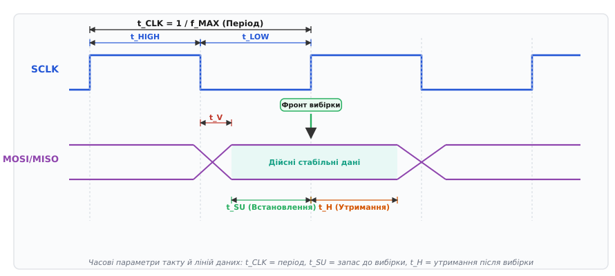
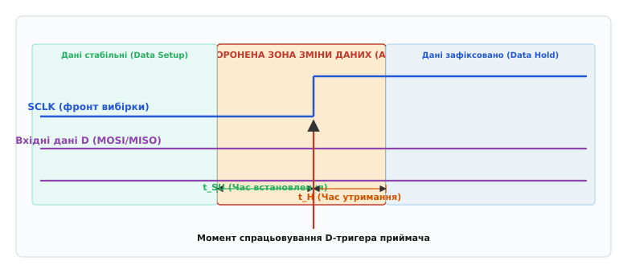
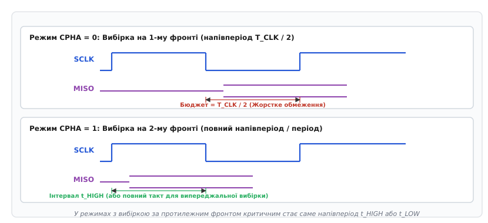

# Тайминг SPI: t_su, t_h, t_clk

<preknowlist>
- [Шина SPI](root:com-devices/spi-bus) — синхронний послідовний протокол обміну даними між ведучим і веденими пристроями.
- [Режими CPOL/CPHA](root:com-devices/spi-mode-selection) — полярність і фаза тактового сигналу, що визначають активний фронт вибірки даних.
- [D-тригер](root:hw-digital/d-flip-flop) — базовий елемент цифрової пам'яті, що фіксує стан входу за фронтом такту.
- [Швидкість SPI](root:com-devices/spi-speed) — фактори впливу тактової частоти на пропускну здатність інтерфейсу.
</preknowlist>

Інженер підключає мікроконтролер до швидкісної мікросхеми Flash-пам'яті або шістнадцятибітного АЦП через плаский стрічковий шлейф довжиною двадцять сантиметрів на тактовій частоті двадцять мегагерців. Програма надсилає стандартну команду читання ідентифікатора, проте замість коректного заводського коду мікроконтролер зчитує суцільні одиниці або байти, у яких кожен біт зміщений на одну позицію ліворуч. Мультиметр показує стабільну напругу живлення 3.3 В, усі чотири провідники шини цілі, а логічний аналізатор фіксує бездоганну форму сигналу на виходах ведучого.

Причина прихованого збою полягає в динамічних часових затримках фізичного рівня. Осцилограф із широкою смугою пропускання показує, що поки тактовий імпульс дійде до веденого пристрою, внутрішні транзистори веденого сформують біт відповіді, а зворотний сигнал лінії MISO повернеться назад через кабель, активний фронт вибірки всередині мікроконтролера вже мине. Сигнал просто запізнився на кілька наносекунд, потрапивши в момент невизначеного логічного переходу.

Синхронний інтерфейс SPI (англ. *Serial Peripheral Interface*) не має окремого апаратного підтвердження успішного прийому або зворотного тактування від веденого пристрою. Уся надійність обміну тримається на жорсткому дотриманні взаємних часових інтервалів (англ. *timing*, від англ. *time* — час): період такту `t_CLK`, час встановлення `t_SU`, час утримання `t_H` та час виходу дійсних даних `t_V`. Якщо сума фізичних затримок у контурі перевищує відведений інтервал, цифровий автомат фіксує метастабільний хаос замість інформації.

---

### Анатомія тактового сигналу: період t_CLK, тривалості t_HIGH та t_LOW

Основою синхронізації в шині SPI є сигнал тактування SCLK (Serial Clock), який генерується виключно ведучим пристроєм (Master). Кожен цикл передачі одного біта вимагає рівно одного повного періоду тактового сигналу `t_CLK` (або `t_SCK`).


*Базові часові параметри синхронного інтерфейсу SPI: тривалість такту t_CLK, тривалості напівперіодів t_HIGH/t_LOW, затримка драйвера t_V, інтервал встановлення t_SU та інтервал утримання t_H.*

Зв'язок між періодом такту та частотою передачі даних визначається базовим співвідношенням:

```
f_CLK = 1 / t_CLK      [частота тактового сигналу]
```

Один повний період тактового імпульсу складається з двох послідовних інтервалів: часу перебування сигналу у високому логічному рівні `t_HIGH` (або `t_CH`, від англ. *Clock High*) та часу перебування в низькому рівні `t_LOW` (або `t_CL`, від англ. *Clock Low*):

```
t_CLK = t_HIGH + t_LOW      [структура періоду такту]
```

Співвідношення між тривалістю активного рівня та повним періодом називається коефіцієнтом заповнення (англ. *duty cycle*, від англ. *duty* — функція, дія та грецьк. *κύκλος* — коло, оберт):

```
Duty_Cycle = t_HIGH / t_CLK      [коефіцієнт заповнення тактового сигналу]
```

В ідеальному цифровому генераторі тактовий сигнал симетричний, тобто `Duty_Cycle = 0.50` (50%), а тривалості напівперіодів однакові: `t_HIGH = t_LOW = 0.5 · t_CLK`. Проте реальні внутрішні дільники мікроконтролерів (особливо при непарних коефіцієнтах ділення системної частоти) та асиметрія вихідних польових транзисторів драйвера спотворюють цю симетрію.

Чому в технічній документації на мікросхеми виробники обов'язково нормують окремо мінімальні значення `t_HIGH_min` та `t_LOW_min`, а не лише загальну частоту `f_MAX`?

Кожен логічний елемент на кристалі веденого пристрою має паразитні внутрішні ємності затворів і дифузійних областей. Щоб вхідний каскад розпізнав перепад напруги, тактовий імпульс повинен утримувати свій рівень достатньо довго, аби вхідні транзистори повністю перезарядилися до порогів логічного перемикання. Якщо імпульс виявиться надто коротким (`t_HIGH < t_HIGH_min`), сигнал не досягне рівня логічної одиниці, внутрішня схема стробування пропустить такт, і зсувний регістр веденого втратить синхронізацію.

> 🔧 **Навіщо це.** Якщо мікроконтролер формує тактовий сигнал 50 МГц (`t_CLK = 20 нс`) з асиметричним коефіцієнтом заповнення 30%/70%, високий рівень триватиме лише `t_HIGH = 6 нс`. Якщо підключений датчик вимагає `t_HIGH_min ≥ 8 нс`, він не працюватиме на частоті 50 МГц, хоча номінальна частота вкладається в його паспортні межі. Для надійної роботи частоту доведеться знизити саме через асиметрію дільника.

---

### Апертура фіксації даних: час встановлення t_SU та час утримання t_H

Передавання даних у шині SPI побудовано на фундаментальному принципі синхронної цифрової схемотехніки: дані на лініях MOSI та MISO змінюються за одним фронтом тактового сигналу (фронт перемикання), а зчитуються приймачем за протилежним або наступним фронтом (активний фронт вибірки).

Щоб вхідний [D-тригер](root:hw-digital/d-flip-flop) приймача міг безпомилково зафіксувати логічний стан лінії (нуль чи одиницю), напруга на вході даних D повинна бути стабільною та незмінною в межах певного часового вікна довкола активного фронту такту. Це вікно називається **апертурою фіксації** (від лат. *apertura* — отвір, вікно).


*Апертура фіксації вхідного сигналу: час встановлення t_SU перед активним фронтом такту та час утримання t_H після нього утворюють заборонену зону.*

Апертура складається з двох критичних інтервалів:

1. **Час встановлення даних `t_SU` (Data Setup Time)** (від англ. *set up* — встановити, налагодити) — мінімальний інтервал часу, протягом якого стабільний логічний рівень сигналу на лінії даних повинен бути присутнім на вході мікросхеми **ДО** моменту появи активного фронту тактового сигналу SCLK.
2. **Час утримання даних `t_H` (Data Hold Time)** (від англ. *hold* — утримувати, зберігати) — мінімальний інтервал часу, протягом якого логічний рівень на лінії даних повинен залишатися незмінним **ПІСЛЯ** проходження активного фронту тактового сигналу SCLK.

Внутрішня будова класичного D-тригера з динамічним керуванням фронтом базується на парі послідовних комірок пам'яті (ведучий-ведений тригер, Master-Slave). Час `t_SU` фізично необхідний для того, щоб заряд вхідного сигналу через відкриті ключі провідності встиг зарядити ємності проміжних вузлів першої комірки. Час `t_H` необхідний для того, щоб перепад тактової напруги встиг надійно закрити вхідні комутаційні ключі до того, як новий стан лінії почне змінювати збережений потенціал.

Що станеться, якщо сигнал на лінії MOSI або MISO зміниться всередині забороненого вікна — між точками `t_edge - t_SU` та `t_edge + t_H`?

У такому разі внутрішній тригер потрапляє в стан **метастабільності** (від грецьк. *μετά* — через, між та лат. *stabilis* — стійкий). Вихідна напруга тригера зависає на проміжному недетермінованому рівні між нулем і одиницею. Вихідний каскад може перебувати в цьому хиткому стані випадковий час (від сотих до десятків наносекунд), після чого спонтанно звалиться в нуль або одиницю під впливом теплового шуму. Для шини SPI це означає появу випадкових бітових помилок, які неможливо передбачити програмно.

Детальні математичні формули розрахунку запасу часу встановлення та утримання наведені у [виведенні часового балансу](root:com-devices/spi-timing/math-timing-budget.md).

---

### Затримка виходу дійсних даних веденого: параметр t_V (Clock-to-Output)

Коли мікроконтролер записує дані у ведений пристрій (тракт MOSI), ведучий сам генерує і тактовий сигнал, і дані. Але коли мікроконтролер зчитує дані з веденого пристрою (тракт MISO), виникає принципова несиметричність.

Ведений пристрій не генерує власний такт: він очікує приходу перепаду SCLK від ведучого і лише після цього починає перемикати вихідний буфер лінії MISO.

Час, який минає від моменту приходу фронту SCLK на вивід веденого пристрою до моменту, коли на виводі MISO встановлюється стабільний, дійсний логічний рівень нового біта, називається **затримкою виходу дійсних даних** (англ. *Data Output Valid Time* або *Clock-to-Output Delay*).

У технічній документації цей параметр позначається як:
- `t_V` (від англ. *Time Valid*);
- `t_CO` (від англ. *Clock to Output*);
- `t_DO` (від англ. *Data Output Delay*).

```
t_V = t_prop_internal + t_driver_rise      [складові затримки виходу веденого]
```

Затримка `t_V` складається з двох фізичних процесів всередині кристала веденого:
1. Затримка поширення сигналу крізь вхідний буфер SCLK, схему керування та внутрішній логічний вентиль вибірки зсувного регістра (`t_prop_internal`).
2. Час перезаряджання вихідного драйвера MISO та зовнішньої паразитної ємності лінії (`t_driver_rise`).

У сучасних швидкісних мікросхемах пам'яті (SPI NOR Flash серій Winbond W25Q або Macronix MX25) затримка `t_V` становить від 5 до 8 нс. Проте в багатьох масових мікроконтролерах, цифрових сигнальних процесорах, промислових датчиках і перетворювачах цей параметр досягає 15–30 нс (а при живленні 1.8 В або зниженій температурі — до 40–50 нс).

Крім того, вихідний каскад веденого утримує попереднє значення біта протягом мінімального часу вихідного утримання `t_HO` (Data Output Hold Time, зазвичай 1.5–3 нс). Лише після завершення `t_HO` рівень на лінії MISO починає рухатися до нового стану.

> 🔧 **Навіщо це.** Затримка `t_V` веденого пристрою майже завжди є головним «вузьким місцем», яке обмежує максимальну швидкість шини SPI під час читання. Якщо мікроконтролер здатен працювати на 50 МГц, але підключений ведений має `t_V = 25 нс`, напівперіод такту 50 МГц (`10 нс`) фізично менший за час реакції веденого. Спроба читання на такій частоті призведе до зчитування попереднього або змішаного стану лінії.

---

### Фізика поширення сигналу та ефект кругової затримки (Round-Trip Delay)

У цифрових схемах електричний сигнал поширюється вздовж провідників не миттєво, а зі скінченною швидкістю електромагнітної хвилі в діелектрику друкованої плати або кабелю.

Швидкість поширення електромагнітної хвилі в середовищі `v_prop` та питома затримка на один метр довжини `τ_prop` (від грецьк. *ταχύς* — швидкий та лат. *propagare* — поширювати, розмножувати) визначаються відносною діелектричною проникністю матеріалу ізоляції `ε_r`:

```
v_prop = c / √(ε_r)      [швидкість поширення сигналу в ізоляторі]
τ_prop = 1 / v_prop = √(ε_r) / c  [питома затримка на одиницю довжини]
```

де `c ≈ 30 см/нс` — швидкість світла у вакуумі.

Для типового склотекстоліту друкованих плат FR-4 (`ε_r ≈ 4.0..4.4`) питома затримка становить приблизно `τ_prop ≈ 6.5..7.0 нс/м` (близько 15 см за одну наносекунду). Для гнучких пласких кабелів з ПВХ-ізоляцією (`ε_r ≈ 2.7`) затримка становить приблизно `τ_prop ≈ 5.5 нс/м`.

Розгляньмо, як ця затримка діє на два зустрічні потоки інформації в шині SPI.

#### Тракт запису (Master → Slave, лінія MOSI)
Під час запису тактовий сигнал SCLK та сигнал даних MOSI виходять одночасно з виводів ведучого і рухаються паралельно в одному напрямку до веденого. Обидва сигнали долають однакову відстань і зазнають практично однакової затримки `t_prop`. Різниця між ними визначається лише незначним просторовим розходженням довжин трас (перекосом або джиттером `t_skew < 0.5 нс`). Тому під час запису довжина кабелю практично не спотворює фазовий зсув між тактом і даними.

#### Тракт читання (Slave → Master, лінія MISO)
Під час читання виникає петля подвійного пробігу:


*Хронологія кругової затримки читання: сигнал SCLK іде вперед, ведений формує відповідь за час t_V, а сигнал MISO повертається назад.*

1. Ведучий перемикає тактову лінію SCLK. Сигнал біжить кабелем до веденого за час `t_prop_out`.
2. Ведений розпізнає перепад і виставляє новий біт на лінію MISO за час `t_V`.
3. Сформований сигнал даних MISO біжить тим самим кабелем у зворотному напрямку до ведучого за час `t_prop_in`.
4. Сигнал надходить на вхід ведучого і мусить відстоятися протягом часу `t_SU_M` до моменту внутрішнього стробування.

Повний час відгуку, необхідний для отримання стабільного біта ведучим (кругова затримка, або Round-Trip Delay), дорівнює сумі всіх чотирьох ланок:

```
t_round_trip = t_prop_out + t_V + t_prop_in + t_SU_M      [повна кругова затримка тракту читання]
```

Оскільки пряма і зворотна лінії прокладені в одному кабелі (`t_prop_out ≈ t_prop_in = t_prop`), отримуємо фундаментальне рівняння подвійного пробігу:

```
t_round_trip = 2 · t_prop + t_V + t_SU_M      [кругова затримка з урахуванням подвійного пробігу лінії]
```

Кожен метр кабелю додає до петлі читання не 5.5 нс, а **11.0 нс** затримки, оскільки хвиля повинна пройти лінію двічі — спочатку вперед у вигляді такту SCLK, а потім назад у вигляді даних MISO.

---

### Розрахунок максимальної частоти шини за довжиною лінії

Знайдемо граничну тактову частоту `f_MAX`, за якої мікроконтролер зможе коректно зчитувати дані веденого пристрою.

Часовий інтервал, який ведучий виділяє на отримання сигналу відповіді, залежить від режиму роботи [CPOL/CPHA](root:com-devices/spi-mode-selection).

#### Режим з вибіркою за протилежним фронтом (класичний CPHA = 0)
У найпоширенішому режимі Mode 0 (CPOL = 0, CPHA = 0) ведений змінює стан лінії MISO за спадним фронтом такту SCLK, а ведучий фіксує біт за наступним наростаючим фронтом.

Часове вікно між моментом зміни даних та моментом їх зчитування дорівнює рівно тривалості напівперіоду низького рівня `t_LOW` (або `t_CLK / 2` при симетричному такті).


*Часові запаси при CPHA=0 (обмеження половиною такту t_CLK/2) та CPHA=1 (можливість використання повного такту при затримці вибірки).*

Усі фізичні затримки кругового циклу повинні вкластися в цей напівперіод:

```
t_LOW ≥ 2 · t_prop + t_V + t_SU_M      [критерій своєчасного читання для CPHA=0]
```

За умови симетричного тактового сигналу `t_LOW = t_CLK / 2`, підставимо цей вираз і виведемо мінімальний допустимий період такту `t_CLK_min`:

```
t_CLK / 2 ≥ 2 · t_prop + t_V + t_SU_M
= t_CLK ≥ 2 · (2 · t_prop + t_V + t_SU_M)
= t_CLK ≥ 4 · t_prop + 2 · t_V + 2 · t_SU_M      [виведення мінімального періоду такту]
```

Гранична робоча частота шини SPI при читанні становить:

```
f_MAX = 1 / t_CLK_min
= 1 / (4 · t_prop + 2 · t_V + 2 · t_SU_M)        [максимальна частота шини для режиму CPHA=0]
```

Зверніть увагу на множник `4` перед затримкою провідника `t_prop`: через те, що на проходження сигналу туди й назад відводиться лише половина періоду такту, кожен метр лінії зв'язку сповільнює допустимий період у чотирикратному масштабі.

---

### Топологія з кількома веденими та ємнісна деградація шини

Коли до однієї шини SPI підключається кілька ведених пристроїв, часовий баланс зазнає додаткової деградації через паразитну ємність відгалужень.

Усі ведені пристрої підключаються до ліній SCLK і MOSI паралельно. Кожен додатковий чіп додає власну вхідну ємність виводу `C_in ≈ 3..7 пФ`, а також ємність контактних площадок і доріжок друкованої плати `C_trace`.

Сумарне ємнісне навантаження лінії `C_total`:

```
C_total = C_line + ∑ C_in_slave + C_master_out      [сумарна паразитна ємність шини]
```

Вихідний опір драйвера мікроконтролера `R_out ≈ 20..40 Ом` разом із ємністю `C_total` утворює інтегруючий [RC-ланцюг](root:hw-analog/rc-time-constant). Час наростання фронту тактового сигналу `t_R` від рівня 10% до рівня 90% зростає за експоненційним законом:

```
t_R ≈ 2.2 · R_out · C_total      [тривалість наростання фронту]
```

Якщо на платі встановлено чотири ведених пристрої з сумарною ємністю `C_total = 60 пФ`, а вихідний опір драйвера дорівнює `30 Ом`, час наростання становитиме `t_R ≈ 2.2 · 30 · 60 · 10⁻¹² ≈ 4.0 нс`. Фронт такту перестає бути крутим прямокутником і перетворюється на пологу криву.

Це призводить до двох негативних наслідків:
1. **Зсув моменту логічного перемикання**: Сигнал досягає порогу `V_IH` пізніше на величину `Δt_delay ≈ 1.2 · R_out · C_total`, що безпосередньо скорочує доступний інтервал встановлення `t_SU`.
2. **Ємнісне навантаження лінії MISO**: Навіть коли ведений не обраний (лінія CS піднята), його вихідний каскад MISO перебуває у високому імпедансі (Z-стані), але зберігає паразитну вихідну ємність `C_out(Z) ≈ 5..8 пФ`. Усі відключені чіпи продовжують навантажувати єдиний активний ведений пристрій, подовжуючи його час реакції `t_V`.

---

### Цифрові ізолятори та перетворювачі рівнів: прихована ціна розв'язки

У промисловій автоматиці, вимірювальних приладах та медичній техніці шину SPI часто пропускають крізь мікросхеми гальванічної розв'язки (наприклад, ємнісні цифрові ізолятори Texas Instruments ISO7741 або оптрони) або двонапрямлені перетворювачі рівнів логіки (Level Shifters, наприклад TXS0108E або TXB0104).

Кожен такий активний компонент додає в лінію власну апаратну затримку перемикання внутрішніх логічних вентилів і трансляторів `t_pd` (Propagation Delay).


*Цифрові ізолятори додають затримку двічі: на прямому шляху SCLK (t_p1) та на зворотному шляху MISO (t_p2).*

Оскільки лінія SCLK проходить крізь перший ізолюючий канал, а лінія MISO повертається крізь другий ізолюючий канал, сумарна додаткова затримка активних елементів становить:

```
Δt_active = t_pd_SCLK + t_pd_MISO = 2 · t_pd_iso      [сумарна затримка активної розв'язки]
```

Повне рівняння мінімального періоду такту для ізольованого каналу SPI набуває вигляду:

```
t_CLK ≥ 2 · (2 · t_prop + 2 · t_pd_iso + t_V + t_SU_M) [період такту з урахуванням гальванічної розв'язки]
```

Навіть найшвидші сучасні цифрові ізолятори (серії ISO77xx) мають паспортну затримку `t_pd ≈ 11 нс`. Пара таких ізоляторів автоматично додає `22 нс` у круговий цикл, що миттєво обмежує тактову частоту читання планкою менше 15 МГц навіть на нульовій довжині проводів.

---

### Worked-приклад: Комплексний розрахунок реального вузла SPI

**Умова.** Мікроконтролер STM32H7 (час встановлення вхідного тригера `t_SU_M = 4.0 нс`, вихідна затримка `t_CO_M = 4.0 нс`) опитує зовнішню Flash-пам'ять Winbond W25Q128JV (час реакції `t_V = 8.0 нс`, час встановлення `t_SU_S = 3.0 нс`, час утримання `t_H_S = 2.0 нс`).

З'єднання виконано пласким стрічковим шлейфом довжиною `L = 30 см` (`0.30 м`, питома затримка `τ_prop = 5.5 нс/м`). Тракт містить цифровий ізолятор ISO7741 із затримкою `t_pd_iso = 10.7 нс` на канал. Генератор такту формує симетричний сигнал (`Duty_Cycle = 50%`).

Необхідно розрахувати:
1. Затримку провідника в один бік `t_prop`.
2. Максимальну теоретичну частоту запису `f_MAX_write` (Master → Slave).
3. Повну кругову затримку читання `t_round_trip`.
4. Максимальну безпечну частоту читання `f_MAX_read` у стандартному режимі Mode 0 (CPHA = 0).
5. Максимальну частоту читання, якщо в контролері STM32 увімкнути режим апаратного зсуву фази вибірки (Sample Shift).

**Розрахунок.**

Крок 1. Затримка в провіднику:
```
t_prop = L · τ_prop
= 0.30 · 5.5
= 1.65 нс                [затримка проходження 30 см шлейфу]
```

Крок 2. Аналіз тракту запису (MOSI):
```
t_write_delay = t_CO_M + t_prop + t_pd_iso
= 4.0 + 1.65 + 10.7
= 16.35 нс               [час прибуття даних до входу веденого]

t_LOW_min_write = t_write_delay + t_SU_S
= 16.35 + 3.0
= 19.35 нс               [мінімальний напівперіод запису]

t_CLK_min_write = 2 · t_LOW_min_write
= 2 · 19.35
= 38.70 нс               [мінімальний період такту для запису]

f_MAX_write = 1 / 38.70 нс
= 25.84 МГц              [максимальна частота запису]
```

Крок 3. Повна затримка кругового циклу читання:
```
t_round_trip = (2 · t_prop) + (2 · t_pd_iso) + t_V + t_SU_M
= (2 · 1.65) + (2 · 10.7) + 8.0 + 4.0
= 3.30 + 21.40 + 8.0 + 4.0
= 36.70 нс               [сумарна затримка кругового циклу]
```

Крок 4. Гранична частота читання у стандартному режимі CPHA = 0:
```
t_LOW_min_read = t_round_trip = 36.70 нс   [напівперіод має покривати повну затримку]
t_CLK_min_read = 2 · t_LOW_min_read
= 2 · 36.70
= 73.40 нс               [мінімальний період такту для читання]

f_MAX_read_cpha0 = 1 / 73.40 нс
= 13.62 МГц              [максимальна безпечна частота читання]
```

Крок 5. Гранична частота з апаратним зсувом вибірки (Sample Shift):
Якщо апаратний SPI-модуль мікроконтролера налаштований фіксувати вхідний біт MISO не на найближчому напівперіоді, а через повний такт `t_CLK`, часовий бюджет подвоюється:
```
t_CLK_min_shifted = t_round_trip = 36.70 нс [весь період відведено під кругову затримку]
f_MAX_read_shifted = 1 / 36.70 нс
= 27.25 МГц              [максимальна частота читання з випереджальною вибіркою]
```

**Висновок.** 
Незважаючи на те, що мікросхема Flash-пам'яті підтримує роботу на частотах до 104 МГц, а контролер STM32 — до 100 МГц, у стандартному режимі CPHA = 0 гранична швидкість шини обмежена значенням **13.62 МГц**. Якщо встановити тактову частоту 20 МГц або 25 МГц, запис працюватиме коректно (запас `f_MAX_write = 25.84 МГц`), але читання повертатиме спотворені дані. Увімкнення зсуву вибірки в конфігураційному регістрі SPI дозволяє підняти робочу частоту до **25 МГц**.

Програмну реалізацію цього алгоритму з автоматичним формуванням звітів дивіться у [проєкті інженерного калькулятора](root:com-devices/spi-timing/proj-timing-calculator.md).

---

### Практична методика діагностики за допомогою осцилографа

Коли шина SPI видає помилки або зависає на високих швидкостях, інженер повинен провести послідовне інструментальне вимірювання часових параметрів на реальній платі.

#### 1. Правильне підключення вимірювальних щупів
Головна помилка при налагодженні швидкісного SPI — використання стандартного довгого дроту заземлення щупа («крокодила»). Дріт заземлення довжиною 10–15 см має власну індуктивність близько `100..150 нГн`, яка разом із вхідною ємністю щупа `10 пФ` утворює коливальний контур. На екрані осцилографа виникає фальшивий високочастотний дзвін з амплітудою до 1–2 В, якого насправді на платі немає.

Для достовірного вимірювання необхідно:
- Зняти пластиковий ковпачок щупа та встановити коротку пружинну насадку заземлення (Ground Spring).
- Підключати земляну пружину безпосередньо до найближчого земляного полігону поруч із досліджуваним виводом чіпа.
- Використовувати щупи з високим вхідним опором та власною ємністю `C_probe < 10 пФ` (а для частот понад 50 МГц — активні диференційні щупи з ємністю менше 1 пФ).

#### 2. Точка вимірювання сигналів
Сигнали необхідно вимірювати **на виводах приймача**, а не передавача:
- Сигнал MOSI та SCLK вимірюють безпосередньо на ніжках веденого пристрою (Slave).
- Сигнал MISO вимірюють безпосередньо на ніжці мікроконтролера (Master).

Лише вимірювання на приймачі показує реальний сигнал, спотворений затримкою лінії, відбиттями та паразитними ємностями монтажу.

#### 3. Побудова очної діаграми (Eye Diagram)
Налаштувавши осцилограф у режим накладання багатьох періодів передачі псевдовипадкових послідовностей (режим Eye Diagram або Persistent Display), оцінюють форму «ока»:
- **Горизонтальне розкриття ока** (Eye Width) показує реальний інтервал часу, протягом якого біт стабільний. Ширина ока повинна з запасом перекривати суму `t_SU + t_H`.
- **Вертикальне розкриття ока** (Eye Height) показує запас за перешкодами по напрузі відносно рівнів `V_IL` та `V_IH`.

Якщо око закрите або розмите через джиттер і похилі фронти, робота на цій частоті гарантовано призведе до бітових збоїв.

---

### Правила трасування високошвидкісних ліній SPI на друкованій платі

Для запобігання фазовим перекосам та перехресним наведенням при частотах понад 20 МГц топологія друкованої плати повинна відповідати набору обов'язкових правил:

1. **Вирівнювання довжин провідників (Length Matching)**: Довжини доріжок SCLK, MOSI та MISO повинні бути узгоджені з точністю до `±2.5 мм` (що відповідає перекосу менше 15–20 пс).
2. **Суцільна опорна площина заземлення (Ground Reference Plane)**: Усі лінії SPI повинні проходити безпосередньо над суцільним шаром заземлення без розривів, щілин або перетинів розділених полігонів живлення. Розрив площини землі змушує зворотний струм високої частоти робити петлю, що різко збільшує паразитну індуктивність лінії та провокує електромагнітне випромінювання.
3. **Захисні інтервали між лініями (Rule 3W)**: Відстань між сусідніми лініями SPI (особливо між тактом SCLK та лініями даних) повинна становити щонайменше три ширини провідника `3W`. Це мінімізує взаємну паразитну ємність та усуває ємнісне просочування тактових фронтів у канал даних (Crosstalk).
4. **Контроль імпедансу**: Для високошвидкісних ліній довжиною понад 10 см геометрію доріжок розраховують на стандартний хвильовий опір `Z_0 = 50 Ом` (або `Z_0 = 33 Ом` для Quad-SPI), використовуючи узгоджувальні резистори для усунення відбитих хвиль.

---

### Інженерні методи компенсації та розширення часових меж

Якщо розрахунок або вимірювання показують від'ємний часовий запас (`M_SU < 0`), інженер може застосувати комплекс схемотехнічних та програмних рішень:

#### 1. Програмний вибір дільника частоти (Clock Prescaler)
Найпростіший і найнадійніший спосіб — знизити частоту шини в регістрах конфігурації мікроконтролера (наприклад, у полі `BR[2:0]` регістру `SPI_CR1` для STM32 або в структурі `spi_device_interface_config_t` для ESP-IDF). Повний перелік конфігураційних інтерфейсів наведено у [довіднику специфікацій і регістрів](root:com-devices/spi-timing/api-spi-timings.md).

#### 2. Зсув фази вибірки (Sample Delay / Rx Tuning)
Сучасні 32-розрядні мікроконтролери (серії STM32H7, NXP i.MX RT, TI Sitara, Espressif ESP32-S3) містять апаратний блок фазового зсуву стробування вхідних даних (позначається як *RX Sample Delay* або *Sample Shift*). Контролер затримує строб вибірки внутрішнього тригера MISO на фіксований час (наприклад, на чверть або половину періоду), дозволяючи веденому спокійно виставити дані на лінію без зниження загальної частоти тактування.

#### 3. Використання холостих тактів (Dummy Cycles)
У протоколах взаємодії зі швидкісними пристроями пам'яті (SPI NOR Flash, SPI PSRAM, Quad-SPI) команда читання передбачає введення конфігурованої кількості порожніх тактів (*dummy cycles*) між передачею адреси та початком видачі першого байта даних. Це дає внутрішній логіці пам'яті необхідний час на вибірку даних з масиву осередків без гальмування тактової частоти.

#### 4. Послідовне термінування ліній зв'язку
При крутих фронтах перемикання драйверів (тривалість наростання `t_R < 2 нс`) довга доріжка або кабель перетворюється на лінію з розподіленими параметрами. Відбиті хвилі створюють дзвін (англ. *ringing*) та хибні перемикання поблизу порогів спрацьовування тригерів. Встановлення послідовних демпфуючих резисторів опором 22–47 Ом безпосередньо біля виводів передавачів (біля виводу SCLK ведучого та біля виводу MISO веденого) згладжує фронти, усуває відбиття та скорочує час заспокоєння сигналу.

#### 5. Мінімізація паразитної ємності монтажу
Зниження ємнісного навантаження ліній `C_L` (короткі доріжки на платі, усунення зайвих контрольних точок, вибір роз'ємів із низькою ємністю) зменшує постійну часу заряду `τ = R_out · C_L`, прискорюючи наростання сигналу і вивільняючи додаткові 2–4 нс у загальному часовому бюджеті.
