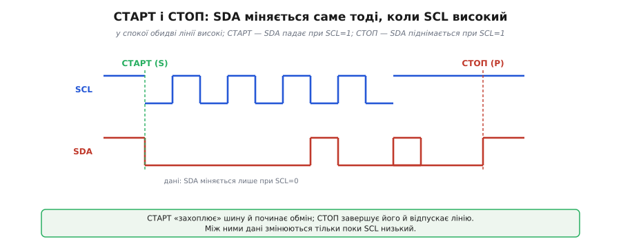
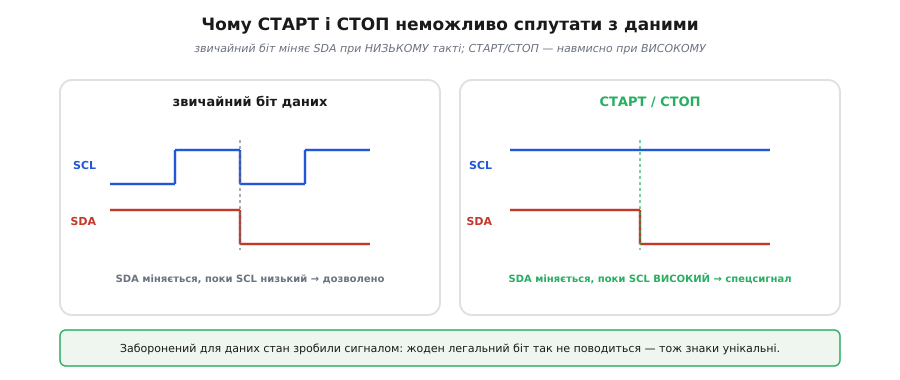
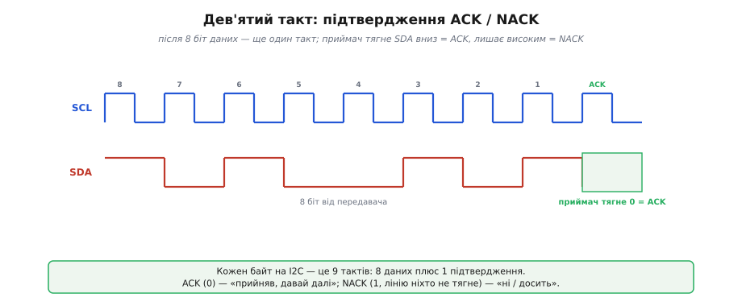
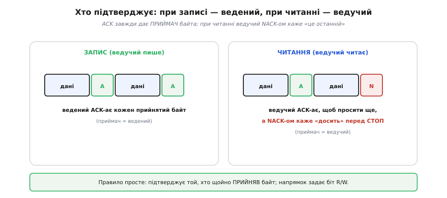
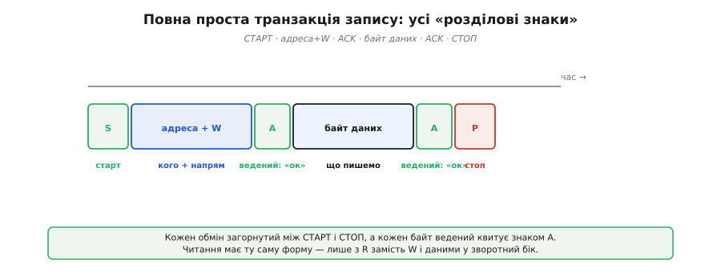
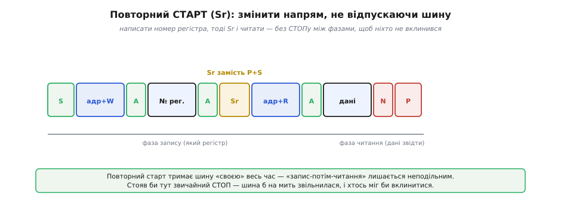
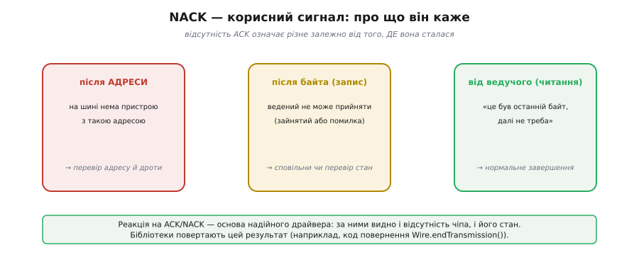

# Старт, стоп, ACK/NACK

Якщо байти адреси й даних — це «слова» I2C (*Inter-Integrated Circuit*, «між інтегральними схемами»), то старт, стоп, ACK і NACK — його **розділові знаки**. Вони не несуть даних, зате задають структуру: де обмін починається, де закінчується і чи дійшов кожен байт. Без них потік байтів був би суцільним і неоднозначним — те саме питання межі повідомлення, що й у [дизайні пакетів](root:com-transport/packet-design). Краса I2C в тому, що всі ці знаки втілені дотепно й мінімальними засобами — самими лініями SDA (лінія даних) і SCL (лінія такту), без жодного зайвого дроту.

### СТАРТ і СТОП: знаки початку й кінця

Будь-який обмін на I2C обрамлений двома особливими сигналами. **СТАРТ** (*START*, «початок»; позначають **S**) — це коли ведучий тягне **SDA вниз** у момент, коли **SCL високий**. **СТОП** (*STOP*, «зупинка»; **P**, від *stoP*) — дзеркальний рух: SDA **піднімається** при високому SCL. У спокої, поки на шині нічого не діється, підтяжки тримають обидві лінії високими — і саме з цього спокою СТАРТ вириває шину в роботу.


*У спокої обидві лінії високі. СТАРТ — SDA падає, поки SCL ще високий: це «захоплює» шину й починає обмін. Далі йдуть такти з даними, де SDA міняється лише при низькому SCL. СТОП — SDA піднімається при високому SCL: обмін завершено, лінія вільна.*

СТАРТ «захоплює» шину: щойно ведені бачать його, вони нашорошуються й чекають адреси. СТОП відпускає шину назад у спокій, сигналізуючи: обмін скінчено, можна починати новий. Усе, що лежить між цими двома знаками, — це один цілісний обмін, який не можна розірвати навпіл.

### Чому їх не сплутати з даними

Чому СТАРТ і СТОП роблять саме зміною SDA при високому SCL, а не якимось окремим маркером? Головне правило передачі даних на [шині I2C](root:com-devices/i2c-bus) таке: поки йдуть дані, SDA дозволено міняти **лише** коли SCL низький, а на час високого такту SDA має стояти незмінною — бо саме у високому такті приймач зчитує біт. Отже, зміна SDA при **високому** SCL — це щось **заборонене** для даних, а тому **унікальне**. Саме на цьому й зіграли творці I2C.


*Звичайний біт даних міняє SDA, поки SCL низький (ліворуч) — це дозволено й нічого особливого не означає. СТАРТ і СТОП навмисно роблять заборонене — міняють SDA при високому SCL (праворуч). Тому їх неможливо сплутати зі звичайними бітами: жоден легальний біт даних так не поводиться.*

Це гарний інженерний хід. Замість вигадувати окрему лінію чи особливий код для «розділових знаків», узяли єдиний стан, який ніколи не трапляється всередині даних, — і зробили його сигналом керування. Дешево, надійно, однозначно: апаратура веденого, що стежить за переходами SDA при високому SCL, ловить початок і кінець обміну простою логікою, без жодного лічильника бітів.

### Дев'ятий такт: ACK і NACK

Тепер про підтвердження. Кожен **байт** на I2C — це не вісім тактів, а **дев'ять**: після восьми біт даних іде ще один, спеціально відведений під **підтвердження**. На цьому дев'ятому такті той, хто щойно **прийняв** байт, відповідає одним бітом: тягне **SDA вниз** — це **ACK** (*acknowledge*, лат. *ad-* + *cognoscere*, «визнати»; «прийняв, давай далі»); або лишає SDA високою — це **NACK** (*not acknowledge*, «не підтверджую»; «ні / досить»).


*Після 8 біт даних передавач відпускає SDA, і на 9-му такті приймач дає відповідь: притягнув лінію вниз — ACK (логічний 0), лишив високою — NACK (логічна 1). Тож кожен байт на I2C — це насправді 9 тактів: 8 даних плюс 1 підтвердження.*

Тут видно, як усе спирається на [відкритий колектор](root:hw-digital/open-drain-bus-pullup-sizing): ACK — це знову принцип «притягнути вниз перемагає». Передавач перед дев'ятим тактом **відпускає** SDA (перестає її тримати), і далі вирішує приймач. Хоче підтвердити — садить лінію на нуль власним транзистором; не хоче або не може — просто нічого не робить, і тоді підтяжка лишає лінію високою, що читається як NACK. Зверни увагу на тонкість: NACK не треба активно «передавати», він виходить сам собою, якщо ніхто не озвався. Тому **кожен** байт коштує не 8, а **9** тактів — це варто пам'ятати, рахуючи час обміну.

> 🔧 **Навіщо це.** Дев'ятий такт прямо впливає на реальну швидкість шини. Корисних даних у байті вісім біт, а тактів витрачається дев'ять, тож на саме підтвердження йде близько 11% пропускної здатності — і це ще без СТАРТ, СТОП та адресного байта. Коли прикидаєш, чи встигне давач віддати свій масив за відведений період опитування, рахуй не байти, а **такти**: інакше бюджет часу зійдеться лише на папері.

**Скільки тактів коштує читання масиву.** Порахуймо це на конкретному прикладі прошивки. Хай ми читаємо `N` байтів даних з давача через типову послідовність «адреса для запису, номер регістра, повторний старт, адреса для читання, дані». Кожен переданий байт — це 9 тактів SCL; СТАРТ, повторний СТАРТ і СТОП кожен бере приблизно по одному такту:

:::tabs
```cpp
// Оцінка тривалості читання N байтів з регістра давача по I2C.
// Послідовність: S · (адр+W) · (№рег) · Sr · (адр+R) · N байтів даних · P
uint32_t i2c_read_ticks(uint32_t n_bytes) {
    uint32_t bytes  = 1 /*адр+W*/ + 1 /*№рег*/ + 1 /*адр+R*/ + n_bytes;
    uint32_t clocks = bytes * 9;     // 9 тактів на кожен байт (8 даних + ACK)
    clocks += 3;                     // S + Sr + P ≈ по одному такту
    return clocks;
}

// За скільки часу це пройде на стандартних 100 кГц?
//   1 такт = 1 / 100000 с = 10 мкс
uint32_t i2c_read_micros(uint32_t n_bytes) {
    return i2c_read_ticks(n_bytes) * 10;   // мкс
}
```
```python
# Оцінка тривалості читання N байтів з регістра давача по I2C.
# Послідовність: S · (адр+W) · (№рег) · Sr · (адр+R) · N байтів даних · P
def i2c_read_ticks(n_bytes):
    bytes_ = 1 + 1 + 1 + n_bytes     # адр+W, №рег, адр+R, дані
    clocks = bytes_ * 9              # 9 тактів на кожен байт (8 даних + ACK)
    clocks += 3                      # S + Sr + P ≈ по одному такту
    return clocks


# За скільки часу це пройде на стандартних 100 кГц?
#   1 такт = 1 / 100000 с = 10 мкс
def i2c_read_micros(n_bytes):
    return i2c_read_ticks(n_bytes) * 10   # мкс
```
```js
// Оцінка тривалості читання N байтів з регістра давача по I2C.
// Послідовність: S · (адр+W) · (№рег) · Sr · (адр+R) · N байтів даних · P
function i2cReadTicks(nBytes) {
    const bytes  = 1 + 1 + 1 + nBytes;   // адр+W, №рег, адр+R, дані
    let   clocks = bytes * 9;            // 9 тактів на кожен байт (8 даних + ACK)
    clocks += 3;                         // S + Sr + P ≈ по одному такту
    return clocks;
}

// За скільки часу це пройде на стандартних 100 кГц?
//   1 такт = 1 / 100000 с = 10 мкс
function i2cReadMicros(nBytes) {
    return i2cReadTicks(nBytes) * 10;   // мкс
}
```
```go
// Оцінка тривалості читання N байтів з регістра давача по I2C.
// Послідовність: S · (адр+W) · (№рег) · Sr · (адр+R) · N байтів даних · P
func i2cReadTicks(nBytes uint32) uint32 {
    bytes := uint32(1) + 1 + 1 + nBytes // адр+W, №рег, адр+R, дані
    clocks := bytes * 9                 // 9 тактів на кожен байт (8 даних + ACK)
    clocks += 3                         // S + Sr + P ≈ по одному такту
    return clocks
}

// За скільки часу це пройде на стандартних 100 кГц?
//   1 такт = 1 / 100000 с = 10 мкс
func i2cReadMicros(nBytes uint32) uint32 {
    return i2cReadTicks(nBytes) * 10 // мкс
}
```
:::

Підставмо читання шести байтів (типовий пакет акселерометра — три осі по два байти):

```
байтів на лінії = 1 + 1 + 1 + 6        = 9
тактів          = 9 × 9 + 3            = 84
час на 100 кГц  = 84 × 10 мкс          ≈ 0.84 мс
час на 400 кГц  = 84 × 2.5 мкс         ≈ 0.21 мс
```

Висновок: навіть короткий обмін на повільній шині — це майже мілісекунда. Хочеш опитувати давач хоч тисячу разів на секунду — або переходь на 400 кГц, або читай рідше: дев'ятий такт мовчки «з'їдає» свою частку, і ця арифметика — перше, з чого починається реальний бюджет часу драйвера.

### Хто підтверджує: запис проти читання

Важлива тонкість: ACK дає **той, хто прийняв** байт, а хто це — залежить від напрямку обміну, який задав біт R/W із [адресного байта](root:com-devices/i2c-addressing).


*При записі (ведучий пише) приймач — це ведений, тож саме він ACK-ає кожен прийнятий байт. При читанні (ведучий читає) приймач — це ведучий: він ACK-ає кожен байт, щоб попросити наступний, а NACK-ом на останньому каже «досить» — і слідом дає СТОП.*

Отже, при записі ведений підтверджує кожен байт, що приймає, а ведучий просто шле далі. При читанні ролі дзеркальні: тепер ведучий керує потоком знаком підтвердження — поки він ACK-ає, ведений шле наступний байт; щойно ведучий дав NACK, ведений розуміє, що цей байт був останній, і відпускає SDA. Так ведучий лишається господарем обміну навіть тоді, коли дані течуть до нього: він сам вирішує, коли спинити струмінь.

### Повна транзакція

Складімо все докупи. Найпростіший обмін — запис одного байта — виглядає так:


*СТАРТ → адресний байт (адреса + W) → ведений ACK → байт даних → ведений ACK → СТОП. Кожен обмін загорнутий між S і P, а кожен байт ведений квитує знаком A. Читання має ту саму форму, лише з R замість W і даними у зворотний бік.*

Цю стрічку можна прочитати як речення: «(старт) звертаюся до пристрою 0x68, писатиму — (ACK, він озвався) — ось такий байт — (ACK, прийняв) — (стоп)». Уся мова I2C зводиться до таких речень: між СТАРТ і СТОП — низка байтів, кожен із підтвердженням. Складніші обміни будують із цих самих цеглинок, просто додаючи байтів усередині або міняючи напрямок.

### Повторний старт: змінити напрям, не відпускаючи шину

Є ще один важливий знак — **повторний СТАРТ** (*repeated START*, **Sr**). Це звичайний СТАРТ, виданий **без** попереднього СТОПу, прямо посеред обміну. Навіщо такий трюк? Щоб **змінити напрям**, не відпускаючи шину.


*Щоб прочитати регістр, ведучий спершу пише його номер (адр+W, № регістра), а тоді дає Sr і читає (адр+R, дані). Між фазами немає СТОПу — лише Sr. Тому шина ні на мить не звільняється, і ніхто інший не може вклинитися: «запис-потім-читання» лишається неподільним.*

Це класичний прийом звертання до регістрів давача: ведучий пише, **який** регістр його цікавить, а потім, не відпускаючи лінію, повторним стартом перемикається на читання й забирає звідти дані. Стояв би між фазами звичайний СТОП — шина б на мить звільнилася, і інший ведучий (або навіть той самий, але збитий з пантелику) міг би вклинитися й зіпсувати обмін. Повторний старт робить усю операцію **атомарною** (*átomos*, грец. «неподільний»). На ньому й тримається [повна транзакція](root:com-devices/i2c-transaction) доступу до регістра.

### NACK як діагностика

Насамкінець — те, що на практиці найцінніше. NACK — це не лише «кінець читання»; залежно від того, **де** він стався, він несе цілком конкретну інформацію про стан шини. Та сама відсутність ACK читається по-різному, і місце підказує причину.


*NACK після адреси означає, що на шині нема пристрою з такою адресою — саме на цьому стоїть I2C-сканер. NACK після байта при записі — ведений не може прийняти (зайнятий чи помилка). NACK від ведучого при читанні — нормальне «це був останній байт». Місце NACK-а підказує, що сталося.*

> 🔧 **Навіщо це.** Реакція на ACK/NACK — основа надійного драйвера. I2C-периферія будь-якого мікроконтролера сама зчитує стан SDA на дев'ятому такті й піднімає в регістрі стану окремий прапорець «підтвердження не було», а бібліотека віддає його вгору кодом повернення: в Arduino це `Wire.endTransmission()`, де 0 — успіх (усе підтверджено), а ненульове — різні види збою (адреса не озвалась, дані не прийнято); в ESP-IDF — `esp_err_t` зі значенням `ESP_ERR_INVALID_RESPONSE` саме на NACK; у STM32 HAL — `HAL_ERROR` плюс біт `HAL_I2C_ERROR_AF` (*acknowledge failure*) у `HAL_I2C_GetError()`. Хоч як зветься виклик, перевіряти треба одне й те саме — чи дійшов ACK. Звикни **перевіряти** цей код, а не сліпо вважати, що запис удався: саме він першим скаже, що давач від'єднався, завис чи його взагалі нема за вказаною адресою. Як грамотно обробити кожен випадок — з таймаутом і повтором, а не «тихим» ігноруванням — розібрано на [робочому драйвері читання регістра](root:com-devices/start-stop-ack/proj-ack-handling.md). «Тихий» I2C-драйвер, що ковтає NACK, рано чи пізно видасть сміття за дані.

Старт, адреса, дані, підтвердження, повторний старт, стоп — це вся «граматика» I2C. Із цих небагатьох знаків складають справжні **речення**: [повні транзакції](root:com-devices/i2c-transaction) читання й запису, якими давачу віддають налаштування, забирають вимір чи дістаються конкретного регістра. Кожна така операція — лише низка вже знайомих знаків, обрамлена СТАРТ і СТОП.

---
