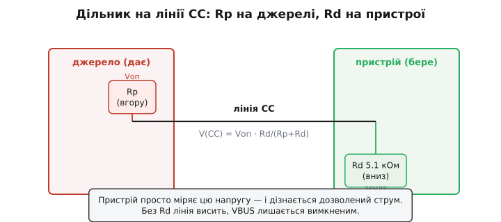
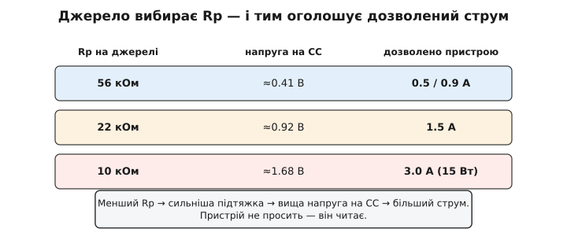
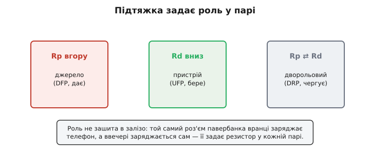
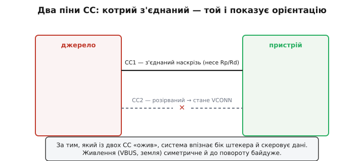
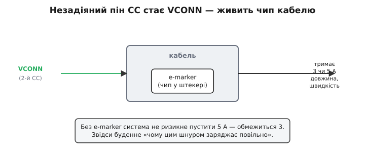
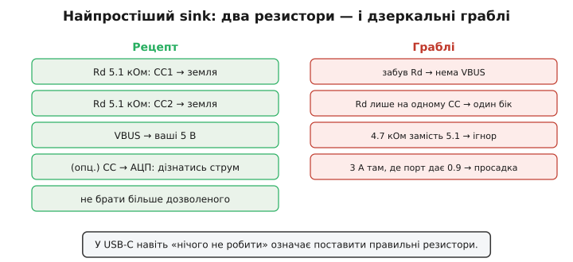

# Type-C без PD: резистори CC і 5 В / 3 А

Базовий USB-C дає до 15 ват **самими резисторами**, без жодного протоколу. Тут — зразок інженерної дотепності: цілих три речі (виявлення, орієнтація, дозволений струм) роблять **два пасивні резистори**, без коду, чипа й навіть увімкненого процесора. Розберіть лінію CC — і вам стане прозорим будь-який USB-C-роз'єм у його найпростішому, найнадійнішому режимі.

### Лінія CC і дільник Rp/Rd

Серце механізму — спеціальна лінія **CC** (*Configuration Channel*) у роз'ємі Type-C і простий **дільник напруги** на ній.


*Джерело вішає на CC підтяжку вгору Rp (до опорної напруги), пристрій — підтяжку вниз Rd = 5.1 кОм. Виходить дільник, і напруга на CC дорівнює Vоп·Rd/(Rp+Rd). Пристрій міряє цю напругу — і дізнається, скільки струму дозволено. А заразом Rd каже джерелу «тут пристрій»: без нього CC висить, і джерело тримає живлення вимкненим.*

Працює це як звичайний [резистивний дільник напруги](root:hw-analog/voltage-divider). Джерело (та сторона, що **дає** живлення) вішає на CC резистор **Rp** (*p* — від англ. *pull-up*, підтяжка вгору) до відомої опорної напруги. Пристрій (той, що **бере**) вішає **Rd** (*d* — від англ. *pull-down*, підтяжка вниз) на землю, стандартного номіналу **5.1 кОм**. Разом вони утворюють дільник, і на лінії CC встановлюється напруга Vоп·Rd/(Rp+Rd). Пристрій просто **міряє** цю напругу своїм входом — і за нею дізнається все потрібне. Жодних команд, тактів чи рукостискань: статичні рівні, які можна прочитати навіть найдешевшим компаратором. У цьому й краса — найпростіший випадок USB-C не вимагає взагалі ніякого розуму.

А **чому** статичні рівні тут кращі за протокол? Резистор не має програмних збоїв, не «зависає», не плутає таймінги й не потребує живлення, щоб працювати, — він просто є. Тому базове виявлення USB-C відбувається ще **до** того, як процесор пристрою прокинувся: щойно штекер у роз'ємі, дільник готовий, напруга стоїть, і будь-яка схема (хоч АЦП мікроконтролера, хоч копійчаний компаратор) її зчитає. Це робить найпростіший USB-C напрочуд **надійним**: менше деталей — менше того, що ламається. Складна цифрова розмова [USB Power Delivery](root:com-devices/usb-pd) знадобиться лише тоді, коли резисторів справді бракне; а для величезної маси дрібних пристроїв уся «розумність» зводиться до двох опорів і вольтметра.

### Три рівні струму: джерело вибирає Rp

Найперше, що кодує ця напруга, — **скільки струму** джерело готове дати. Воно керує цим, вибираючи **значення Rp**.


*Джерело виставляє один із трьох Rp — і тим задає напругу на CC: 56 кОм → ≈0.41 В (стандарт, 0.5/0.9 А), 22 кОм → ≈0.92 В (1.5 А), 10 кОм → ≈1.68 В (3.0 А, тобто 15 Вт). Чим менший Rp, тим вища напруга на CC і тим більший дозволений струм.*

Логіка проста: менший Rp підтягує CC сильніше, отже вища напруга на дільнику — і це сигнал «можна більше». Канонічні три значення: **56 кОм** означає стандартний рівень USB (0.5 чи 0.9 А — як у звичайного порту), **22 кОм** — 1.5 А, **10 кОм** — повні **3 А** (тобто 15 Вт при 5 В). Пристрій, прочитавши напругу на CC, потрапляє в один із трьох діапазонів і **знає свою стелю**: 0.9, 1.5 чи 3 ампери. Він не «просить» — він **читає** те, що джерело вже виставило.

Простежмо це наскрізь на одному пристрої. Усе, що він робить, — тримає на CC свій незмінний **Rd = 5.1 кОм** на землю; решту вирішує джерело тим, який Rp воно почепило. Слабке зарядне виставить 56 кОм — на дільнику з його опорної напруги встановиться ≈0.41 В, і пристрій прочитає «звичайний USB». Потужніше джерело почепить 10 кОм — той самий Rd дасть уже ≈1.68 В, тобто «повні 3 А». Той самий резистор пристрою, та сама виміряна нога — а число на ній різне, бо джерело змінило свій бік дільника:

**Пристрій із Rd 5.1 кОм увімкнули в зарядне на 3 А (Rp = 10 кОм). Який бюджет струму виставити перетворювачу?**

:::tabs
```c
// Пристрій лише міряє напругу на активному CC і вирішує стелю.
uint16_t v_cc = adc_read_mv(PIN_CC1);   // напр., 1680 мВ від джерела з Rp 10к

uint16_t budget_ma;
if      (v_cc < 200)   budget_ma = 0;     // нема джерела — CC «висить»
else if (v_cc < 660)   budget_ma = 500;   // ≈0.41 В → звичайний USB
else if (v_cc < 1230)  budget_ma = 1500;  // ≈0.92 В → 1.5 А
else                   budget_ma = 3000;  // ≈1.68 В → повні 3.0 А

set_input_current_limit(budget_ma);       // 1680 мВ → 3000 мА = 15 Вт при 5 В
```
```python
# Пристрій лише міряє напругу на активному CC і вирішує стелю.
v_cc = adc_read_mv(PIN_CC1)               # напр., 1680 мВ від джерела з Rp 10к

if   v_cc < 200:   budget_ma = 0          # нема джерела — CC «висить»
elif v_cc < 660:   budget_ma = 500        # ≈0.41 В → звичайний USB
elif v_cc < 1230:  budget_ma = 1500       # ≈0.92 В → 1.5 А
else:              budget_ma = 3000       # ≈1.68 В → повні 3.0 А

set_input_current_limit(budget_ma)        # 1680 мВ → 3000 мА = 15 Вт при 5 В
```
:::

Жодного слова назад до джерела: воно вже все «сказало» опором, а пристрій лише зчитав напругу й виставив межу.

Але саме цей крок — `set_input_current_limit` — і є друга половина обов'язку: прочитану стелю треба **поважати**. Прочитати «дозволено 3 А» мало; треба ще й **не перевищити**, бо інакше слабке джерело просяде або вимкнеться. На практиці це означає, що перетворювач за USB-входом (той самий [buck](root:hw-power/buck) чи [buck-boost](root:hw-power/buck-boost)) проєктують так, щоб його вхідний струм лишався в межах прочитаного рівня, а якщо порт дає лише 0.9 А — пристрій або задовольняється меншою потужністю, або заряджається повільніше. Тобто рівень на CC — це не довідка, а **контракт**: джерело пообіцяло стільки, і пристрій зобов'язаний у це вкластися. Гарний sink на старті дивиться на CC й сам обмежує свій апетит під побачений рівень. Точні граничні напруги для кожного рівня прописані в специфікації та зібрані у вставці [🔌 Резистори CC](root:com-devices/type-c-cc/comp-cc-resistors.md) — там і звідки саме 56 / 22 / 10 кОм, і які пороги напруги відповідають кожному рівню, і як sink їх читає рядком коду; а тут важлива сама ідея: один резистор на боці джерела безмовно оголошує дозволений струм.

> 🔧 **Навіщо це.** Якщо ваш пристрій живиться від USB-C і має помітний пік споживання (двигун, передавач, спалах), зчитайте рівень із CC ще до того, як дати навантаження. Побачили «звичайний USB» (≈0.41 В) — не кидайте на вхід 2-амперний кидок: слабке зарядне просяде, ваш буст вимкнеться по недонапрузі, і пристрій перезавантажиться по колу. Один аналоговий вхід і три порівняння рятують від «працює від цього зарядного, а від того ні».

### Rd робить пристрій пристроєм

Друга річ, яку дає Rd, — **саме виявлення** під'єднання. Поки до порту нічого не ввімкнено, лінія CC «висить» у повітрі, і джерело тримає **VBUS вимкненим** — на роз'ємі немає небезпечних вольтів, поки нема чого живити (елегантна вбудована безпека). Щойно ви втикаєте пристрій, його **Rd = 5.1 кОм** притягує CC донизу, дільник «оживає», напруга падає в робочий діапазон — і джерело розуміє: **під'єднано пристрій**, можна вмикати живлення. Тобто той самий резистор Rd водночас і «дзвонить у двері» (я тут), і визначає роль (я — той, хто бере).

Це робить Rd **критичним**: пристрій без правильного Rd на CC для джерела **не існує** — VBUS просто не з'явиться. Звідси найчастіша помилка новачка з USB-C: зробити пристрій, забути 5.1-кілоомні резистори — і дивуватися, чому «немає 5 вольтів». Немає Rd — немає виявлення — немає живлення.

А «вимкнено, поки нема пристрою» — це не дрібниця, а свідома **безпека роз'єму**. У старому USB-A на контактах завжди стояли 5 вольтів, і відкритий роз'єм можна було закоротити чи замкнути на щось металеве. USB-C тримає VBUS **знеструмленим**, доки CC не побачить пристрій, тож голий роз'єм зарядки безпечний — на ньому просто нема напруги. А коли штекер виймають, зникнення Rd одразу каже джерелу **зняти** VBUS — живлення гасне ще до того, як контакти повністю роз'єдналися, що зменшує іскріння й знос. Та сама пара резисторів, що виявляє під'єднання, отже, керує й безпечним вмиканням-вимиканням живлення на роз'ємі.

### Хто кого живить: ролі

Узагальнімо: **сам резистор задає роль** у парі.


*Підтяжка Rp = «я джерело» (DFP, дає живлення). Підтяжка вниз Rd = «я пристрій» (UFP, бере). Дворольовий порт (DRP) — ноутбук чи павербанк — почергово виставляє то Rp, то Rd, поки не вирішить, ким бути в цій конкретній парі.*

Той, хто вішає **Rp**, оголошує себе **джерелом** (у термінах USB — *DFP*, downstream-facing port): зарядка, ПК, павербанк-як-джерело. Той, хто вішає **Rd**, — **пристрій** (*UFP*, upstream-facing port): телефон, навушники. А найцікавіше — **дворольові** порти (*DRP*): сучасний ноутбук чи павербанк уміють і давати, і брати, тож вони почергово виставляють то Rp, то Rd, «питаючи» обидві ролі, аж поки інша сторона не відгукнеться, — і тоді пара домовляється, хто цього разу джерело. Саме завдяки цьому той самий USB-C-роз'єм павербанка вранці заряджає телефон, а ввечері сам заряджається від розетки — роль не зашита в залізо, а визначається резистором у кожному під'єднанні.

У дворольового порту зазвичай є й **уподобання**, ким стати за замовчуванням. Телефон налаштований радше **брати** живлення (бо найчастіше його заряджають), але вміє стати й джерелом, коли в нього встромляють, скажімо, флешку чи навушники, — це той самий «OTG», тепер уже без окремого роз'єму, лише грою резисторів на CC. Ноутбук, навпаки, частіше схиляється **давати**. Коли зустрічаються два дворольові пристрої, перемагає те уподобання, що склалося першим у їхньому «перемиганні» Rp↔Rd, — а далі, якщо обидва підтримують [USB Power Delivery](root:com-devices/usb-pd), вони можуть навіть **поміняти** ролі вже під час роботи (хто заряджає кого) цифровою командою. Тобто резистори вирішують **початкову** роль, а протокол PD — за бажання — дозволяє її потім переграти.

### Орієнтація: два піни CC

Type-C ще й **реверсивний** — втикається будь-яким боком. Як же система знає, яким саме? Знову через CC, бо пінів CC насправді **два**.


*У роз'ємі два піни — CC1 і CC2. Кабель усередині штекера з'єднує наскрізь лише один із них, і саме він несе Rp/Rd. За тим, який із двох «ожив» (побачив дільник), система розуміє, яким боком устромлено штекер, — і відповідно скеровує лінії даних. Другий пін стає VCONN.*

У роз'ємі є **CC1** і **CC2**, симетрично з обох боків. Але кабель усередині штекера з'єднує наскрізь **лише один** із них (залежно від того, яким боком ви втикаєте). Тому дільник Rp/Rd «оживає» тільки на тому піні, що реально з'єднаний, а другий лишається осторонь. Система дивиться, **який** із двох CC побачив підтяжку, — і так дізнається **орієнтацію** штекера, а отже, як скерувати реверсивні лінії даних. Реверсивність роз'єму, що так тішить користувача, тримається на цій дрібниці: два піни CC замість одного й перевірка, котрий ожив.

Чому орієнтація взагалі важить, якщо живлення (VBUS і земля) дублюється з обох боків роз'єму й байдуже до повороту? Бо **дані** не дублюються повноцінно: швидкі пари в перевернутому штекері опиняються «не там», і їх треба **перемкнути**. Тому поряд із роз'ємом стоїть крихітний **мультиплексор** даних, який, дізнавшись орієнтацію з CC, скеровує сигнали на правильні контакти. Для нас, людей живлення, висновок простий і заспокійливий: **саме живлення байдуже до повороту** (VBUS і GND симетричні), морочитися з орієнтацією потрібно лише заради даних. Тому найпростіший зарядний пристрій може взагалі не зважати, який CC ожив, — йому досить факту під'єднання й рівня струму.

### VCONN і чип у кабелі

А що ж стається з **другим**, незадіяним піном CC? Він не марнується — він стає **VCONN**: лінією живлення для електроніки **самого кабелю**.


*Незадіяний пін CC стає VCONN і живить чип усередині кабелю — e-marker. Той «доповідає» системі, скільки ампер кабель тримає (3 чи 5 А), його довжину й швидкість. Без e-marker система не дозволить 5 А (обмежиться 3) — звідси буденне «чому цим шнуром заряджає повільно».*

Ось і пояснення, **чому «розумний» кабель має чип**. Потужні (на 5 А) й активні кабелі містять усередині крихітну мікросхему — **e-marker**, яку живить саме VCONN. Цей чип «доповідає» системі важливе: скільки ампер кабель витримує (3 чи 5 А), яка його довжина й на яку швидкість даних він розрахований. Без e-marker система **не ризикне** пустити 5 ампер — вона свідомо обмежиться безпечними 3, бо не знає спроможності кабелю. Тому повну потужність несуть лише **відповідні** кабелі з чипом, а дешевий шнур без e-marker зарядить повільніше, хоч би які потужні були пристрій і зарядка. Сам e-marker і протокол спілкування з ним розглянуто в темі про [кабелі USB-C на практиці](root:embedded/usb-cables-field); тут досить знати, що другий пін CC годує цей чип.

VCONN живить не лише пасивний e-marker. Довгі чи дуже швидкі кабелі бувають **активними** — зі справжньою електронікою всередині, що підсилює сигнал, аби той не згас на метрах дроту (на високих швидкостях кабель без підсилення «глухне» вже за метр-два). Цю електроніку теж годує VCONN — тобто незадіяний пін CC перетворюється на повноцінну шину живлення для самого кабелю. Звідси й парадокс, що бентежить користувача: «активний» дорогий кабель може **гірше** заряджати простий пристрій чи взагалі не працювати без VCONN, бо без живлення його нутрощі мертві. Більшість зарядних шнурів, на щастя, пасивні й простіші, та знати про активні корисно — інакше «чому цей дорогий кабель не працює» лишиться загадкою.

### Найпростіший sink: рецепт і граблі

Зведімо все в практику. Що треба зробити, щоб ваш пристрій **правильно** брав живлення з USB-C без жодного PD?


*Рецепт простого 5-вольтового sink: Rd = 5.1 кОм з кожного CC на землю (обидва піни — бо роз'єм реверсивний), узяти VBUS як живлення, за бажання зчитати напругу на CC, щоб знати дозволений струм, і не брати більше за дозволене. Праворуч — дзеркальні граблі.*

Рецепт простий до краю: повісьте **Rd = 5.1 кОм** з **кожного** піна CC на землю (саме з обох — бо роз'єм реверсивний, і ви не знаєте наперед, який оживе), беріть **VBUS** як свої 5 вольтів, і — за бажання — зчитайте напругу на активному CC, щоб дізнатися, 0.9, 1.5 чи 3 ампери вам дозволено. От і все: два резистори роблять вас законним USB-C-пристроєм.

Коли ж самих резисторів **не** досить? Тоді, коли вам треба не 5 вольтів, а більше (9, 12, 20 В для потужнішого вузла) — резистори CC такого не вміють, потрібен [USB Power Delivery](root:com-devices/usb-pd), а з ним і керівний чип. Існує й зручний проміжний випадок: готові «**тригери**» — мікросхеми, що самі домовляються по PD про фіксовану напругу (скажімо, 12 В) і просто видають її вам, без жодного коду з вашого боку; для пристрою, якому треба стала вища напруга з USB-зарядки, це найпростіший шлях. Але якщо ваша межа — 5 В і до 3 А, тримайтеся резисторів: це найдешевше, найнадійніше й найменш ризиковане рішення, без жодної електроніки, що могла б зависнути. А типові граблі дзеркальні до кроків: **забув Rd** — пристрій не виявлять і VBUS не з'явиться; **поставив Rd лише на один CC** — пристрій працюватиме тільки одним боком штекера (і ви годинами шукатимете «плаваючий контакт»); **припустив 3 А там, де порт дає 0.9** — перевантажиш джерело й дістанеш просадку. Усі ці помилки — від нехтування простою істиною: у USB-C навіть «нічого не робити» означає **поставити правильні резистори**.

### Підсумок теми

Базовий USB-C — це майстер-клас із того, як **пасивні резистори** замінюють протокол. Лінія **CC** із дільником Rp (на джерелі) і Rd = 5.1 кОм (на пристрої) робить одразу три речі: **виявляє** під'єднання (без Rd джерело не вмикає VBUS), **визначає роль** (Rp = джерело, Rd = пристрій, DRP чергує) і **оголошує дозволений струм** — за значенням Rp (56/22/10 кОм → 0.9/1.5/3 А), яке пристрій просто читає як напругу. Два піни CC дають **орієнтацію** реверсивного роз'єму, а незадіяний пін стає **VCONN**, що живить **e-marker** кабелю — звідси й «розумний» шнур, без якого не буде повних 5 ампер. А зробити простий sink — це лише повісити Rd на обидва CC й не брати більше дозволеного; для величезної маси дрібних 5-вольтових пристроїв цього цілком досить, і це найнадійніший варіант, бо ламатися там майже нічому. Та коли 15 ват замало й треба підняти **напругу** — самих резисторів не вистачить: починається справжня цифрова розмова, [USB Power Delivery](root:com-devices/usb-pd).

---
