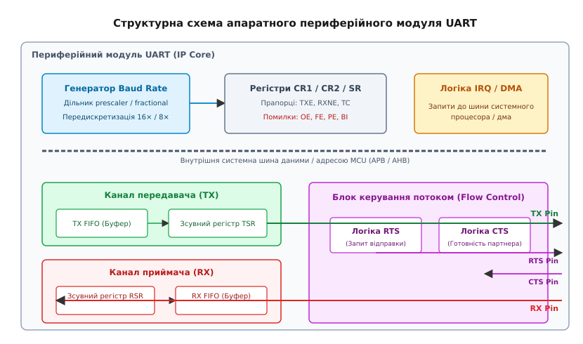
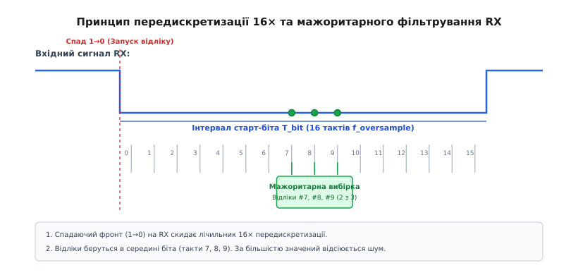
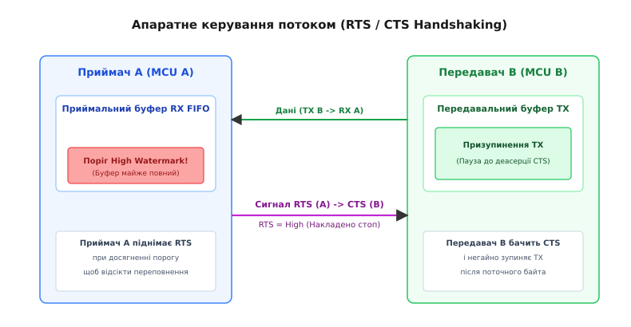
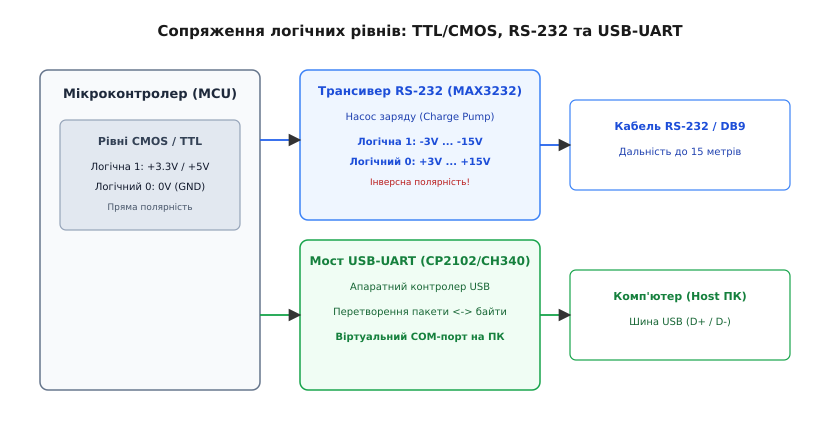

# UART: апаратний модуль і периферійний контролер

<preknowlist>
- [Асинхронна передача](root:com-devices/async-serial) — концепція передачі даних без спільного дроту такту.
- [Кадр UART](root:com-devices/uart-frame) — структура старт-біта, даних, парності й стоп-бітів у послідовному потоці.
</preknowlist>

Коли на послідовній лінії даних з'являється спадаючий фронт напруги, у мікроконтролера є лише частки мікросекунди, щоб зреагувати, розпізнати початок байта та почати відлічувати часові інтервали. Якщо покласти цю роботу безпосередньо на центральний процесор, йому доведеться безперервно опитувати стан виводу в жорсткому циклі, блокуючи виконання будь-яких інших обчислень. Для того щоб звільнити процесор від рутинної роботи з нарізання часу та збирання бітів, у кремній мікроконтролерів інтегрують окремий апаратний вузол — універсальний асинхронний приймач-передавач або **UART** (*Universal Asynchronous Receiver-Transmitter*).

Цей модуль є автономним периферійним автоматом. Він самостійно приймає послідовний потік бітів із зовнішнього виводу, перевіряє їх на помилки, пакує у 8-бітові байти та складає в буферну пам'ять, генеруючи переривання для процесора лише тоді, коли байт повністю готовий до зчитування. Напрямок передачі працює дзеркально: процесор записує байт у буфер, а контролер UART самостійно формує старт-біт, виштовхує біти даних з потрібною швидкістю, додає парність і завершує кадр стоп-бітом.

```
                  ┌─────────────────────────────────────────────────┐
                  │      Внутрішня системна шина MCU                │
                  └───────────────────────┬─────────────────────────┘
                                          │ (байти / регістри)
┌─────────────────────────────────────────▼─────────────────────────────────────────┐
│ Периферійний модуль UART (IP Core)                                                │
│                                                                                   │
│ ┌──────────────────────┐  ┌──────────────────────┐  ┌──────────────────────────┐ │
│ │  Генератор Baud Rate │  │  Регістри CR / SR    │  │  Логіка IRQ / DMA        │ │
│ │  (f_CLK -> f_sample) │  │  (TXE, RXNE, OE...)  │  │  (Запити до шини)        │ │
│ └──────────┬───────────┘  └──────────────────────┘  └──────────────────────────┘ │
│            │                                                                      │
│ ┌──────────▼───────────┐                            ┌──────────────────────────┐ │
│ │  Канал передачі (TX) │                            │  Керування потоком       │ │
│ │  TX FIFO -> TSR      ├───────────────────────────>│  RTS / CTS Handshaking   │ │
│ └──────────────────────┘                            └────────────┬─────────────┘ │
│                                                                  │                │
│ ┌──────────────────────┐                                         │                │
│ │  Канал прийому (RX)  │                                         │                │
│ │  RSR -> RX FIFO      │<────────────────────────────────────────┘                │
│ └──────────────────────┘                                                          │
└────────────▲─────────────────────────────────────────────────────┬────────────────┘
             │ (послідовний потік бітів)                           │
      RX Pin ┴                                              TX Pin ┴
```


*Схема внутрішніх вузлів UART: дільник частоти, зсувні регістри, FIFO буфери та лінії керування потоком.*

---

### Архітектура приймача та передавача: від буфера до зсувного регістра

Серцем будь-якого модуля UART є два незалежні канали — **передавальний (TX)** та **приймальний (RX)**. Вони мають власний апаратний стан і можуть працювати абсолютно одночасно (режим повного дуплексу, *Full-Duplex*).

Щоб зрозуміти, як відбувається обмін усередині кремнію, простежимо шлях байта через обидва тракти.

#### Передавальний тракт (TX Channel)
Передавальний тракт складається з двох послідовних регістрів:
1. **Буферний регістр передачі (Transmit Data Register - TDR / THR):** Сюди центральний процесор або контролер DMA записує черговий байт даних по внутрішній шині MCU.
2. **Зсувний регістр передавача (Transmit Shift Register - TSR):** Це невидимий для розробника внутрішній регістр, який безпосередньо підключений до зовнішнього виводу `TX Pin`.

Коли передавач вільний, запис байта в `TDR` миттєво копіює цей байт у `TSR`. Після цього `TSR` підключає лінію `TX` до логічного нуля на один бітовий інтервал (формуючи старт-біт), а далі під дією тактового генератора зсуває вміст на один біт праворуч кожні T_bit секунд, виштовхуючи біти в лінію від молодшого (LSB) до старшого (MSB).

> 🔧 **Навіщо потрібна подвійна буферизація (Double Buffering).**
> Якби існував лише один зсувний регістр `TSR`, процесор мусив би чекати повного виходу всіх 10 бітів кадру (близько 87 мікросекунд на 115200 біт/с), щоб записати наступний байт. Наявність буферного регістра `TDR` дозволяє записати другий байт **у процесі передачі першого**. Щойно `TSR` виштовхне останній стоп-біт першого байта, апаратна частина за один такт перенесе другий байт із `TDR` у `TSR` і продовжить передачу **без жодного мікросекундного розриву** між кадрами.

У сучасних мікроконтролерах замість однобайтового регістра `TDR` застосовують апаратну чергу **TX FIFO** об'ємом від 16 до 128 байтів. Це дозволяє процесору записати цілу стрічку символів за одну операцію й повернутися до виконання основних завдань.

#### Приймальний тракт (RX Channel)
Приймальний тракт працює зворотно, але влаштований складніше через необхідність фільтрації завад:
1. **Зсувний регістр приймача (Receive Shift Register - RSR):** Приєднаний до виводу `RX Pin`. Він очікує перепаду напруги з одиниці в нуль, після чого зсуває біти з лінії у свій внутрішній стан.
2. **Буферний регістр прийому (Receive Data Register - RDR / RBR):** Сюди копіюється зібраний байт після успішного перевіряння стоп-біта та парності.

Щойно байт потрапляє в `RDR`, апаратна частина піднімає прапорець `RXNE` (*Read Data Register Not Empty*) та генерує переривання для CPU. Якщо процесор не встигне прочитати байт із `RDR` до того моменту, як `RSR` повністю збере наступний байт із лінії, виникає апаратна помилка переповнення — **Overrun Error (OE)**. Про історію боротьби з цією проблемою та появу апаратних черг детально розказано в вставці про [історію мікросхеми 16550](root:com-devices/uart/hist-16550.md).

---

### Синхронізація й передискретизація: виловлювання біта в шумі

Головна складність асинхронного зв'язку полягає в тому, що приймач **не має спільних тактових імпульсів** із передавачем. Годинники двох незалежних мікросхем завжди трохи розходяться через технологічний розкид кварцових резонаторів та температурний дрейф.

Щоб надійно зчитувати стан лінії RX у середині кожного бітового інтервалу й не впіймати крайові перехідні процеси чи електричний шум, модуль UART використовує **генератор передискретизації** (*Oversampling Clock Generator*).

Частота передискретизації f_oversample перевищує обрану швидкість Baud у 16 разів (режим 16× oversampling) або у 8 разів (режим 8× oversampling).

```
USARTDIV = f_CLK / (16 × Baud)
```

Зв'язок між частотою тактування периферії f_CLK та розрахунком регістра швидкості детально розібрано в вставці про [обчислення дільника baud](root:com-devices/uart/proj-baud-calculator.md).


*Принцип передискретизації 16x: відлік посередині бітового інтервалу на відліках 7, 8, 9 із мажоритарним фільтром 2-з-3.*

#### Алгоритм виявлення старт-біта та мажоритарної вибірки
У режимі 16× oversampling один бітовий інтервал ділиться на 16 рівних системних відліків (від 0 до 15):

1. **Очікування лінії в спокої:** У стані спокою на лінії `RX` тримається логічна 1.
2. **Детекція спадаючого фронту:** Коли лінія падає з 1 у 0, вмикається внутрішній 16-кратний лічильник.
3. **Перевірка фальшивого старту (False Start Detection):** На відліках #7, #8 та #9 (точна середина передбачуваного старт-біта) апаратна схема тричі зчитує стан лінії. Якщо принаймні два з трьох відліків дорівнюють 0, старт-біт вважається справжнім, і лічильник скидається для відліку наступного біта. Якщо більшість відліків дорівнює 1, випадок вважається короткочасним сплеском шуму, і модуль повертається в стан очікування.
4. **Мажоритарне фільтрування даних (3-sample Majority Voting):** Для кожного з наступних бітів даних (D0…D7), біта парності та стоп-біта апаратний блок знову бере три відліки на 7-му, 8-му та 9-му такті передискретизації. Значення біта визначається за правилом більшості (2 з 3):

```
Відлік #7 │ Відлік #8 │ Відлік #9 │ Результат вибірки │ Стан
──────────┼───────────┼───────────┼───────────────────┼───────────────────────────
    1     │     1     │     1     │         1         │ Чистий сигнал
    1     │     0     │     1     │         1         │ Зафіксовано шум (Noise Flag)
    0     │     0     │     1     │         0         │ Зафіксовано шум (Noise Flag)
    0     │     0     │     0     │         0         │ Чистий сигнал
```

Якщо під час 3-точкового заміру відліки не збіглися (наприклад, 1-0-1), апаратна частина все одно приймає біт за більшістю, але виставляє прапорець **Noise Error Flag (NF)** у регістрі стану, попереджаючи програму про погану якість лінії.

> 🔧 **Навіщо це.**
> Мажоритарне фільтрування робить UART надзвичайно стійким до імпульсних завад від наводок чи іскріння контактів. Навіть якщо коротка завада спотворить один із трьох відліків у середині біта, приймач усе одно правильно розпізнає логічний рівень.

---

### Керування потоком (Flow Control): апаратні й програмні гальма

Коли передавач надсилає байти на високій швидкості (наприклад, 921 600 біт/с), приймальний пристрій може не встигати обробляти їх або записувати у флеш-пам'ять. Якщо приймальний буфер RX FIFO повністю заповниться, наступні байти будуть втрачені.

Для запобігання втраті даних використовують два методи керування потоком: **апаратний (Hardware)** та **програмний (Software)**.


*Часова діаграма сигналів RTS та CTS при виникненні загрози переповнення приймального буфера FIFO.*

#### 1. Апаратне керування потоком (Hardware Flow Control - RTS/CTS)
Апаратний метод використовує дві додаткові сигнальні лінії:
- **RTS (Request to Send / Ready to Receive):** Вихід приймача. Сигналізує партнеру: «Я готовий приймати байти».
- **CTS (Clear to Send):** Вхід передавача. Передавач перевіряє цей вивід перед відправкою кожного байта: якщо на CTS накладено заборону, передача призупиняється.

З'єднання двох пристроїв через RTS/CTS є перехресним:

```
Приймач A                                    Передавач B
( TX  ) ───────────────────────────────────> ( RX  )
( RX  ) <─────────────────────────────────── ( TX  )
( RTS ) ───────────────────────────────────> ( CTS )  [RTS A підключено до CTS B]
( CTS ) <─────────────────────────────────── ( RTS )  [CTS A підключено до RTS B]
```

**Логіка роботи апаратного автомата:**
1. Приймач A має вільний буфер RX FIFO, тому утримує свій вихід `RTS` в активному стані (низький логічний рівень 0 В для активного-низького сигналу `_RTS`).
2. Передавач B бачить низький рівень на своєму вході `CTS` і безперешкодно надсилає байти.
3. Коли буфер RX FIFO приймача A заповнюється до порогу *High Watermark* (наприклад, лишилося 4 вільні байти), апаратний блок приймача A самостійно піднімає лінію `RTS` у високий рівень (1).
4. Передавач B бачить високий рівень на `CTS` і **негайно зупиняє передачу** після завершення поточного байта, що вже виштовхується з зсувного регістра.
5. Щойно програма на приймачі A зчитає байти з буфера, рівень заповнення впаде нижче порогу *Low Watermark*, `RTS` знову опуститься в 0, і передавач B автоматично продовжить відправку.

Усе це відбувається на рівні кремнієвої логіки **без залучення програмного коду процесора**, що гарантує відсутність переповнень навіть на максимальних швидкостях шини.

#### 2. Програмне керування потоком (Software Flow Control - XON/XOFF)
Програмний метод не вимагає додаткових дротів і працює прямо по основних лініях `TX` та `RX`:
- Коли приймач бачить, що його буфер заповнюється, він надсилає передавачу спеціальний керувальний символ **XOFF** (байт `0x13`, Ctrl+S).
- Отримавши символ `0x13`, передавач призупиняє надсилання даних.
- Коли буфер звільняється, приймач надсилає символ **XON** (байт `0x11`, Ctrl+Q), і передавач відновлює роботу.

> 🔧 **Навіщо це і в чому пастка.**
> Програмний метод XON/XOFF економить ніжки мікроконтролера, бо не вимагає ліній RTS/CTS. Проте він має два суттєві недоліки. **По-перше**, він не підходить для передачі двійкових файлів (прошивок, масивів чисел), бо байт `0x13` або `0x11` може випадково трапитися всередині корисних даних і хибно зупинити передавач. **По-друге**, реація на XOFF є програмною: якщо передавач завантажений, він може встигти надіслати ще десяток байтів після надсилання XOFF, що призведе до втрати даних при малих буферах.

---

### Апаратні прапорці, помилки та переривання

Для зв'язку з програмним забезпеченням периферійний модуль UART використовує регістр стану (`SR` або `ISR`) та регістр керування перериваннями (`CR1`).

#### Прапорці подій передачі та прийому
Розрізнення трьох основних прапорців є класичним джерелом помилок для початківців:

```
Прапорець │ Повна назва                       │ Що означає                                │ Коли скидається
──────────┼───────────────────────────────────┼───────────────────────────────────────────┼─────────────────────────────
RXNE      │ Read Data Register Not Empty      │ У буфері прийому RDR є новий байт        │ Читанням регістра RDR
TXE       │ Transmit Data Register Empty      │ Буфер TDR вільний, можна писати нові байти│ Записом нового байта в TDR
TC        │ Transmission Complete             │ Зсувний регістр TSR виштовхнув останній   │ Записом в TDR або очищенням
          │                                   │ стоп-біт у лінію                          │ прапорця програмно
```

> 🔧 **Пастка прапорців TXE проти TC.**
> Прапорець `TXE` стає рівним 1, як тільки байт перейшов із `TDR` у зсувний регістр `TSR`. У цей момент `TDR` порожній, але байт **все ще біжить по дроту**. Якщо вам потрібно перемкнути напрямок трансивера [RS-485](root:com-medium/rs485-multidrop-bus) із передачі на прийом, **нежна вимикати передавач по прапорцю TXE**! Це відріже останній байт посередині кадру. Перемикати напрямок лінії можна **тільки по прапорцю TC**, який гарантує, що стоп-біт повністю покинув вивід `TX Pin`.

#### Прапорці апаратних помилок
При виникненні відхилень у структурі сигналу UART виставляє відповідні прапорці помилок:

- **Overrun Error (OE):** Байт прибув у RDR, але попередній байт не був зчитаний процесором. Новий байт втрачено або перезаписано.
- **Framing Error (FE):** На місці передбачуваного стоп-біта (який має бути логічною 1) приймач виявив логічний 0. Це виникає при неспівпадінні швидкостей baud, наявності шумів або розриві лінії.
- **Parity Error (PE):** Розрахований біт парності не збігся з прийнятим у кадрі.
- **Break Indicator (BI):** Лінія `RX` утримується в логічному 0 довше, ніж тривалість одного повного кадру. Це використовується як спеціальний сигнал скидання (*Break Condition*), наприклад у протоколах DMX512 або LIN.

Повний програмний інтерфейс драйвера з обробкою переривань та буферизацією наведено у вставці [інтерфейс драйвера UART](root:com-devices/uart/api-uart-driver.md).

---

### Спеціалізовані режими роботи кремнію UART

Сучасні апаратні блоки UART (USART) містять розширену логіку для підтримки специфічних системних протоколів без додаткових зовнішніх ІС.

#### 1. Мультипроцесорний режим (9-бітовий режим та адресація)
У багатоточкових мережах кілька мікроконтролерів з'єднані паралельно по одній лінії. Щоб центральний процесор веденого вузла не переривався на кожен байт чужого трафіку, модуль UART переводять у 9-бітовий режим адресації:
- 9-й біт кадру слугує признаком адреси (`1` — адреса вузла, `0` — байти даних).
- Приймач UART перебуває в стані сну (*Mute Mode*) й ігнорує всі байти з 9-м бітом `0`.
- Коли прибуває байт із 9-м бітом `1`, апаратна частина порівнює його з записаним у регістр `ADDR` значенням. Якщо адреса збіглася, модуль виходить зі стану сну й генерує переривання для CPU.

#### 2. Режим інверсії сигналів та апаратного обміну виводів (TX/RX Swap)
Нові родини мікроконтролерів (наприклад, STM32G4, STM32H7, ESP32-S3) дозволяють програмно змінювати полярність сигналів у регістрі `CR2`:
- `TXINV` / `RXINV`: інвертують полярність ліній на рівні кремнію. Це дозволяє підключати UART безпосередньо до приймачів радіокерування S.BUS (де сигнали інвертовані), не ставлячи зовнішній транзисторний інвертор.
- `SWAP`: апаратно міняє місцями функції виводів `TX` та `RX`, що рятує від помилок проектування друкованої плати без перетрасування доріжок.

#### 3. Апаратне автоматичне керування напрямком RS-485 (Hardware Driver Enable)
У багатьох сучасних мікроконтролерах периферійний модуль UART підтримує апаратний режим `RS485 Driver Enable` (`DE` / `RTS_DE`). Апаратний блок самостійно піднімає вивід `RTS` у логічну 1 за 1-2 такти до відправки старт-біта і примусово опускає його в 0 строго після завершення стоп-біта. Це усуває потребу вручну перемикати напрямок лінії у програмі та запобігає затримкам колізій на напівдуплексній шині.

#### 4. Апаратний протокол LIN (Local Interconnect Network)
Промисловий автомобільний протокол LIN побудований на базе однопровідного UART. Периферійний модуль містить спеціальний детектор `LIN Break Detection`, який розпізнає наддовгий логічний нуль тривалістю 10–13 бітових інтервалів і генерує окреме переривання для вирівнювання тактової частоти ведених вузлів по синхробайту `0x55`.

---

### Прямий доступ до пам'яті (DMA) та фоновий обмін

У високопродуктивних системах на базі ARM Cortex-M чи RISC-V навіть обробка переривань по кожному байту створює надмірне навантаження на процесор при швидкостях вище 1 Мбіт/с. Для вирішення цієї проблеми модуль UART інтегрують із контролером **DMA** (*Direct Memory Access*).

Режими роботи з DMA:
- **TX DMA Stream:** Процесор передає контролеру DMA вказівник на буфер у RAM і його довжину, після чого вмикає біт `DMAT` у регістрі `CR3`. Контролер DMA автоматично записує байти в `TDR` кожного разу, коли виставляється прапорець `TXE`, не викликаючи переривань процесора аж до повної відправки всього масиву.
- **RX DMA Circular Mode:** Контролер DMA підключається до `RDR` і автоматично складає кожен прийнятий байт у кільцевий масив у пам'яті RAM. Процесор взагалі не бере участі в прийомі байтів, а лишь періодично зчитує вказівник поточного стану DMA.

---

### Енергозбереження та пробудження (Wake-on-Activity)

Сучасні вбудовані системи часто перебувають у режимах глибокого сну (*Deep Sleep / Stop Mode*), де тактування периферійних блоків вимкнено для економії енергії акумулятора. Модуль UART містить спеціалізовані схеми пробудження:

1. **Wake-up on Start Bit:** Приймач залишає активною низькоспоживаючу схему детекції спаду 1→0 на виводі `RX`. З появою старт-біта модуль негайно генерує сигнал пробудження для тактового генератора (PLL) та процесора.
2. **Wake-up on Address Match (Multiprocessor Mode):** У 9-бітовому режимі UART старший 9-й біт використовується як маркер адреси. Модуль порівнює прийнятий байт із власною апаратною адресою й пробуджує процесор тільки тоді, коли пакет адресовано саме цьому вузлу.

---

### Фізичні рівні й адаптація до реального світу

Самі по собі виводи `TX Pin` та `RX Pin` мікроконтролера виводять звичайні цифрові сигнали CMOS з амплітудою 3.3 В або 5 В. Для зв'язку з різними типами зовнішніх обладнань застосовують відповідні трансивери.


*Топологія передачі даних від TTL/CMOS рівня мікроконтролера через трансивер RS-232 або мост USB-UART.*

Варіанти сопряження виводів UART:
1. **Пряме з'єднання TTL/CMOS (3.3V / 5V):** Зв'язок між мікроконтролерами на одній друкованій платі або з локальними модулями (GPS, Bluetooth, Wi-Fi).
2. **Трансивер RS-232 (наприклад, MAX3232):** Перетворює 3.3 В у двополярні інверсні сигнали від -12 В до +12 В для підключення до промислових приладів та старого комп'ютерного обладнання.
3. **Диференційний трансивер [RS-422 / RS-485](root:com-medium/rs485-multidrop-bus):** Перетворює однополярні сигнали в диференційну пару ліній A та B для передачі даних у промислових мережах на відстані до 1200 метрів.
4. **Мост USB-UART (наприклад, CP2102, CH340, FT232):** Перетворює послідовний потік UART у бакетний протокол USB. На комп'ютері такий мост відображається як віртуальний послідовний порт (*Virtual COM Port*).

Класифікацію та схемотехнічні пастки цих конвертерів детально описано у вставці про [фізичні рівні та конвертери](root:com-devices/uart/comp-level-shifters.md).

---

### Порівняльний аналіз UART з іншими послідовними інтерфейсами

Щоб чітко розуміти нішу застосування UART у системній архітектурі, порівняємо його з двома іншими найпопулярнішими послідовними інтерфейсами мікроконтролерів — **SPI** та **I2C**:

```
Критерій           │ UART (Асинхронний)   │ SPI (Синхронний)     │ I2C (Синхронний)
───────────────────┼──────────────────────┼──────────────────────┼───────────────────────
Наявність такту    │ Ні (Асинхронний)     │ Так (SCLK)           │ Так (SCL)
Дуплекс            │ Повний (Full-Duplex) │ Повний (Full-Duplex) │ Напівдуплекс (Half)
Кількість дротів   │ 2 (TX, RX) + GND     │ 4 (MOSI, MISO, SCK, CS)│ 2 (SDA, SCL) + GND
Топологія          │ Точка-точка (P2P)    │ Магістраль із CS     │ Мультимастерна шина
Типові швидкості   │ 9600 .. 3 000 000    │ до 50 000 000 біт/с  │ 100k, 400k, 3.4M біт/с
Основні переваги   │ Не потрібен такт,    │ Максимальна          │ Всього 2 дроти для
                   │ простота кабелю      │ пропускна здатність  │ десятків пристроїв
```

UART є беззаперечним лідером у ситуаціях, де пристрої віддалені один від одного, або де прокладання лінії тактування є занадто дорогим чи неможливим.

---

### Практичний чеклист діагностики збоїв UART

Якщо після підключення пристрою зв'язок відсутній або в терміналі з'являється сміття, скористайтеся даним діагностичним чеклистом:

1. **Перевірте кросування ліній:** Переконайтеся, що `TX` передавача підключено до `RX` приймача, а `RX` — до `TX`.
2. **Перевірте спільну землю GND:** Відсутність з'єднання `GND` створює плаваючий потенціал і збої кадру.
3. **Перевірте налаштування Baud Rate:** Переконайтеся, що розраховане значення `BRR` дає похибку менше ±2.5%.
4. **Перевірте підтяжку RX (Pull-Up):** Залишений у повітрі вхід `RX` на знеструмленому роз'ємі генерує хибні старт-біти.
5. **Перевірте формат кадру:** Перевірте кількість бітів даних (8 або 9), наявність парності (Even/Odd/None) та кількість стоп-бітів (1 або 2).

---

### Підсумковий синтез

Периферійний модуль UART є фундаментальним апаратним мостом між паралельним світом системної шини процесора та послідовним часовим потоком на мідному дроті. Розуміння його внутрішньої будови — від генератора передискретизації 16× та мажоритарної вибірки до буферів FIFO, логіки RTS/CTS та режимів DMA — дозволяє проектитувати надійні вбудовані системи, які працюють без втрат даних та помилок кадру на будь-яких швидкостях.
