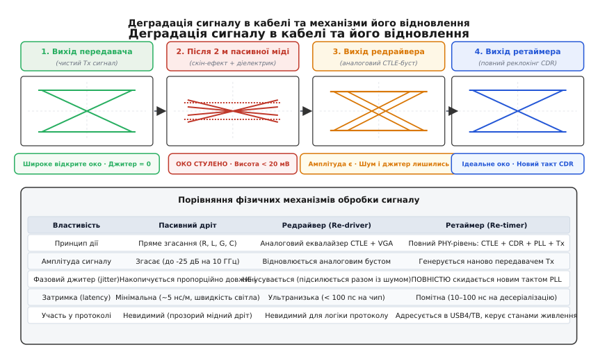
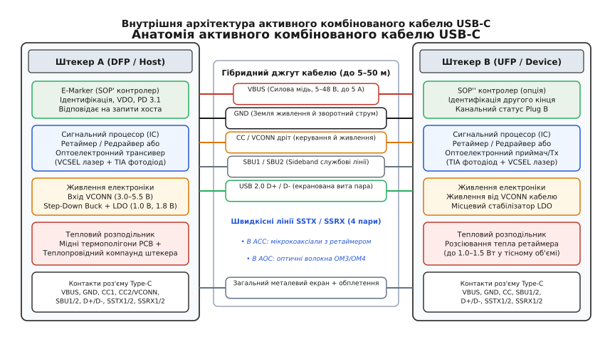
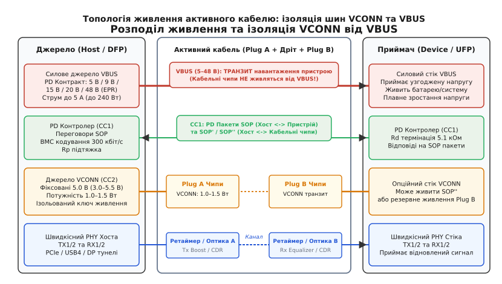
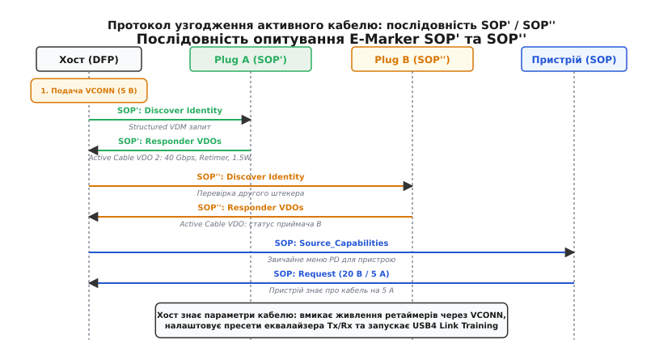

# Активні USB-кабелі

<preknowlist>
- [Скін-ефект](topic:hw-components/skin-effect) — витіснення струму високої частоти до поверхні провідника й зростання омічних втрат.
- [Діаграма ока](topic:hw-pcb/eye-diagram) — оцінка якості високошвидкісного сигналу, міжсимвольна завада та джитер.
- [Лінії передачі](topic:com-medium/transmission-lines) — хвильовий опір, згасання сигналу та узгодження ліній зв'язку.
- [USB Power Delivery](topic:com-devices/usb-pd) — протокол узгодження живлення, пакети по лінії CC та маркери кабелів.
- [Резистори CC у Type-C](topic:com-devices/type-c-cc) — виявлення під'єднання, орієнтація роз'єму та базова роль лінії VCONN.
</preknowlist>

Якщо з'єднати сучасний зовнішній накопичувач NVMe або монітор надвисокої чіткості 8K з комп'ютером за допомогою звичайного пасивного мідного кабелю USB Type-C довжиною два метри, швидкісний лінк USB4 або Thunderbolt 4 на швидкості 40 Гбіт/с взагалі не підніметься. Система або скине швидкість до застарілого режиму USB 2.0 (480 Мбіт/с), або почне циклічно перезапускати інтерфейс через лавину помилок контрольної суми CRC. Водночас півметровий пасивний дріт без жодних проблем передає ті самі сорок гігабітів за секунду.

Причина такої поведінки полягає не в дефектах роз'ємів чи поганому контакті, а у фундаментальних фізичних обмеженнях мідних провідників на частотах у десятки гігагерців. Зі зростанням швидкості передачі даних пасивний кабель перетворюється з прозорого електричного з'єднувача на потужний частотно-залежний атенюатор, який знищує круті фронти імпульсів, розмиває рівні напруги й закриває око сигнальної діаграми. Щоб подолати цей бар'єр і передавати потоки даних зі швидкістю від 10 до 80 Гбіт/с на відстані від двох до кількох десятків метрів, інженерам довелося вбудувати в самі штекери кабелю мініатюрні кремнієві процесори обробки сигналів та оптоелектронні трансивери, створивши клас **активних кабелів** (англ. *active cables*).

### Фізика канальних втрат: чому пасивна мідь впирається в стіну

Щоб зрозуміти, чому пасивні кабелі стають непридатними на великих довжинах, необхідно простежити два головні механізми розсіювання електромагнітної енергії в лінії зв'язку: втрати в провіднику через [скін-ефект](topic:hw-components/skin-effect) та втрати в ізоляційному матеріалі через діелектричну поляризацію.

Коли по диференційній парі передається цифровий сигнал зі швидкістю 20 Гбіт/с на лінію (базовий режим USB4 Gen3), основна гармоніка (частота Найквіста) становить рівно 10 ГГц. На такій частоті змінне магнітне поле всередині провідника індукує вихрові струми, які виштовхують рухомі носії заряду до зовнішньої поверхні дроту. Глибина скін-шару `δ` для чистої міді на частоті 10 ГГц становить:

```
δ = √(ρ / (π · f · μ))
= √(1.68·10⁻⁸ / (π · 10¹⁰ · 1.257·10⁻⁶))   [питомий опір міді ρ та проникність μ]
≈ 0.66 мкм                                  [товщина робочого шару провідника]
```

При товщині провідника 32 AWG (діаметр жили близько 200 мкм) струм тече лише в найтоншій поверхневій плівці товщиною 0.66 мікрометра. Решта 98% площі перерізу мідного дроту виявляється повністю заблокованою для проходження високочастотного сигналу. Омічний опір провідника зростає пропорційно кореню квадратному з частоти `√f`, перетворюючи значну частину енергії сигналу на тепло.

Другий, ще агресивніший чинник — діелектричні втрати в ізоляції кабелю. Електричне поле диференційного сигналу замикається через діелектрик (спінений поліетилен, фторопласт PTFE або термопластичні еластомери), примушуючи молекули ізолятора безперервно переполяризуватися 10 мільярдів разів за секунду. Внутрішнє тертя молекул породжує діелектричне згасання, яке зростає вже не як `√f`, а **прямо пропорційно частоті** `f` та тангенсу кута діелектричних втрат `tan δ`. На частотах понад 5–8 ГГц діелектричні втрати починають переважати втрати на скін-ефекті.

Крім того, на надвисоких частотах критичними стають неоднорідності хвильового опору. У місцях паяння тонких коаксіальних жил до контактних майданчиків мікроплати роз'єму Type-C (paddle card) виникають локальні паразитні індуктивності та ємності. За даними рефлектометрії часової області (TDR), стрибок імпедансу навіть на 5–7 Ом від номінальних 85 Ом породжує зворотні відбиття сигналу (коефіцієнт повернених втрат S11 гірший за -10 дБ), які багаторазово накладаються на наступні імпульси.

Специфікація USB4 встановлює граничний бюджет внесених втрат (англ. *insertion loss*, параметр S21) для всього наскрізного каналу зв'язку від кристала передавача до кристала приймача на рівні близько -16.8 дБ на частоті 10 ГГц. Цей бюджет ділиться між доріжками друкованої плати комп'ютера (до -5.5 дБ), роз'ємами Type-C (-1.5 дБ), платою приймача (-4.3 дБ) та самим кабельним джгутом. На частку власне кабелю залишається не більше **-5.5..-7.0 дБ**. Типовий гнучкий коаксіальний мікродріт калібру 32–34 AWG має згасання близько 7–9 дБ на метр на частоті 10 ГГц. Це означає, що весь допустимий запас згасання повністю вичерпується вже на довжині **0.8 метра**.


*Згасання високих частот у довгому пасивному кабелі розмиває фронти й повністю закриває око сигнальної діаграми (висота менше 20 мВ). Аналоговий редрайвер підсилює амплітуду, але пропускає шум і джитер; цифровий ретаймер повністю відновлює ідеальний такт і форму сигналу за допомогою схеми CDR.*

Коли сигнал проходить через пасивний кабель довжиною понад один метр, високочастотні гармоніки згасають у десятки разів сильніше, ніж низькочастотні. У результаті прямокутні імпульси перетворюються на пологі хвилі: біти не встигають повернутися до вихідного рівня до початку наступного такту. Відбувається змішування сусідніх бітів — явище міжсимвольної завади (англ. *intersymbol interference*, ISI). На [діаграмі ока](topic:hw-pcb/eye-diagram) розкрив ока стрімко зменшується до нуля: висота падає нижче порога чутливості компаратора приймача (менше ніж 15–20 мВ), а фазовий джитер розповзається по всій ширині бітового вікна (понад 0.5 UI). Приймач більше не здатен розрізнити, де одиниця, а де нуль, і коефіцієнт бітових помилок (BER) катастрофічно зростає понад критичну межу `10⁻¹²`.

### Аналогове вирівнювання: активні мідні кабелі з редрайверами

Найпростішим способом повернення сигналу до життя є використання активних мідних кабелів (англ. *Active Copper Cables*, ACC) на базі аналогових **редрайверів** (англ. *re-drivers*).

Редрайвер — це спеціалізований лінійний підсилювач із регульованою амплітудно-частотною характеристикою. Його головний функціональний блок — еквалайзер неперервного часу (CTLE). Схема CTLE має передавальну характеристику високих частот із нулем на нижчих частотах і полюсом на частоті Найквіста. Інженери підбирають параметри CTLE так, щоб його крива підсилення дзеркально повторювала криву втрат мідного дроту:

```
H_каналу(f) · H_CTLE(f) ≈ const      [результуюча АЧХ стає пласкою в робочій смузі]
```

Якщо кабель вносить згасання -12 дБ на частоті 10 ГГц, еквалайзер редрайвера забезпечує підйом коефіцієнта підсилення рівно на ті самі +12 дБ на цій частоті. Після еквалайзера сигнал потрапляє на регульований підсилювач VGA та кінцевий диференційний драйвер, який додатково формує високочастотні викиди на фронтах (pre-emphasis та de-emphasis) для компенсації втрат у роз'ємах.

Головні переваги редрайверів — простота, низька ціна, надзвичайно мала затримка проходження сигналу (менше 100 пікосекунд на мікросхему) та мінімальне енергоспоживання (всього 40–80 мВт на диференційну пару). Редрайвер не втручається у логічну структуру потоку даних і є повністю «прозорим» для протоколів USB чи DisplayPort.

Однак редрайвер має фундаментальне обмеження: він є суто **аналоговою** схемою. Підсилюючи високі частоти, він із таким самим коефіцієнтом підсилює тепловий шум кабелю, електромагнітні наведення від сусідніх ліній і накопичений фазовий джитер. Редрайвер здатен збільшити висоту ока на осцилографі (відновити запас за напругою), але він безсилий перед фазовим тремтінням фронтів (запас за часом лишається зруйнованим). Більше того, внутрішні шуми власного підсилювача редрайвера додаються до сигналу.

Через накопичення шумів та фазового джитеру активні кабелі з редрайверами дозволяють подовжити мідний тракт USB 3.2 Gen2 (10 Гбіт/с) лише до **2.0–3.0 метрів**. Для надшвидкісних стандартів USB4 (20 і 40 Гбіт/с на лінію) аналогового бусту вже недостатньо: залишковий джитер не дозволяє вкластися у маску прийому. Детальний аналіз схемотехніки цих мікросхем наведено у вставці [Редрайвери та ретаймери сигнальних ліній](topic:com-devices/usb-active-cable/comp-retimer-redriver.md).

### Цифрова регенерація: ретаймери та відновлення тактової частоти

Щоб будувати надійні кабелі USB4 довжиною до трьох-п'яти метрів або каскадувати підсилювальні вузли, застосовують принципово інший клас приладів — **ретаймери** (англ. *re-timers*).

Ретаймер не просто підсилює аналогову форму хвилі, а повністю **декодує та наново генерує** цифровий потік. На його вході встановлено повноцінний приймальний каскад із системою відновлення тактової частоти та даних (англ. *Clock and Data Recovery*, CDR). Вузол CDR містить прецизійний фазовий детектор і генератор, керований напругою (VCO) у складі кільця фазового автопідстроювання частоти (PLL).

Схема CDR виділяє переходи між логічними нулями та одиницями у вхідному спотвореному сигналі, підлаштовує під них фазу власного чистого тактового генератора й виконує стробування (дискретизацію) значень напруги точно в центрі бітового інтервалу (UI). Далі розпізнані біти записуються в пружний буфер пам'яті (Elastic FIFO). З цього буфера дані зчитуються вже абсолютно незалежним передавачем (Tx), який генерує свіжі цифрові перепади з бездоганними крутими фронтами, нормованим розмахом амплітуди й нульовим фазовим джитером.

```
Вхідний спотворений сигнал (шум, ISI, джитер)
                 │
                 ▼
     ┌───────────────────────┐
     │ Аналоговий CTLE + DFE │   ── відновлює амплітуду для компаратора
     └───────────┬───────────┘
                 │
                 ▼
     ┌───────────────────────┐
     │ Семплер CDR (з PLL)   │   ── дискретизує біти за новим тактом
     └───────────┬───────────┘
                 │
                 ▼
     ┌───────────────────────┐
     │  Пружний буфер FIFO   │   ── компенсує різницю частот генераторів (ppm)
     └───────────┬───────────┘
                 │
                 ▼
     ┌───────────────────────┐
     │ Новий Tx передавач    │   ── синтезує чистий вихідний сигнал
     └───────────────────────┘
```

Головна фізична перевага ретаймера — **повне знищення накопиченого джитеру**. На виході ретаймера фазове тремтіння вхідного кабелю дорівнює нулю; залишається лише надмалий власний джитер внутрішнього генератора PLL (зазвичай менше ніж 0.05 UI). Це дозволяє ретаймерам повністю відновлювати сигнал навіть із каналів із втратами до -25..-28 дБ, де око на вході було закрите на 100%.

На відміну від редрайверів, ретаймер є повноцінним учасником логічного протоколу. Згідно зі специфікацією USB4, ретаймери розпізнають службові послідовності бітів (Ordered Sets), беруть активну участь у процесі навчання каналу (Link Training), узгоджують пресети передіскажень із хостом і вміють самостійно переходити у стани глибокого енергозбереження (U1, U2, U3 та CL0s/CL1/CL2), коли передача даних припиняється.

Процедура навчання ліній USB4 (Link Training) за участю ретаймерів проходить у три послідовні фази:
1. **Фаза виявлення (Phase 1):** хост та ретаймери обмінюються тренувальними послідовностями TS1 із фіксованими налаштуваннями передавачів. Ретаймер фіксує блокування свого вузла CDR на вхідній частоті.
2. **Фаза вирівнювання еквалайзера (Phase 2):** хост надсилає запити на зміну коефіцієнтів деакцентуації передавача ретаймера, підбираючи оптимальний розкрив ока діаграми за допомогою алгоритму мінімізації середньоквадратичної похибки (LMS).
3. **Фаза фіксації (Phase 3):** сторони обмінюються послідовностями TS2, фіксують досягнутий коефіцієнт помилок BER < `10⁻¹²` та перемикають канальний рівень у повношвидкісний режим передачі даних (Active State).

Плата за якість відновлення — це енергоспоживання (від 400 до 1200 мВт на один штекер із двома дуплексними каналами) та затримка проходження сигналу (15–60 наносекунд на десеріалізацію й буферизацію). Проте саме ретаймери роблять можливим існування мідних кабелів USB4 та Thunderbolt 4 довжиною до 2.0–3.0 метрів.

### Оптичний прорив: активні оптичні кабелі (AOC)

Коли довжина кабелю має перевищувати 3–5 метрів (підключення шоломів віртуальної реальності, студійних 8K камер, медичних томографів чи конференц-систем на відстанях до 20–50 метрів), мідні провідники стають остаточно непридатними: навіть із ретаймерами потрібен такий великий калібр міді, що кабель перетворюється на негнучкий шланг товщиною понад сантиметр і вагою в кілька кілограмів.

У цій зоні домінують **активні оптичні кабелі** (англ. *Active Optical Cables*, AOC). В AOC високошвидкісні мідні коаксіальні пари повністю замінені на тонкі скляні або полімерні оптичні волокна, а всередині кожного металевого штекера Type-C змонтовано мініатюрні оптоелектронні трансивери.


*Комбінована будова активного кабелю: всередині штекерів розташовано мікроконтролер E-Marker, сигнальні ретаймери/трансивери та стабілізатори VCONN. У тілі кабелю швидкісні лінії прокладено оптичним волокном (або коаксіалом), а силові шини VBUS, GND, лінія CC та USB 2.0 лишаються мідними.*

Оптоелектронний тракт штекера працює за наступним ланцюгом:
1. Електричний диференційний сигнал від хоста надходить на вхідний драйвер лазера.
2. Драйвер модулює струм масиву вертикально-випромінювальних лазерів із поверхневим резонатором — **VCSEL** (англ. *Vertical-Cavity Surface-Emitting Laser*), які випромінюють інфрачервоні імпульси на довжині хвилі 850 нм (напівпровідникові структури GaAs).
3. Світловий потік заводиться в багатомодове оптичне волокно стандарту OM3 або OM4 з діаметром світловодної жили 50 мкм і оболонки 125 мкм.
4. На протилежному кінці кабелю світло потрапляє на високошвидкісний фотодіодний масив (GaAs PIN Photodiode), який перетворює світлові спалахи назад на мікроамперні струми.
5. Трансімпедансний підсилювач (TIA) перетворює фотострум на диференційну напругу, а підсилювач-обмежувач формує стандартні рівні для приймача Type-C.

Згасання сигналу в багатомодовому оптичному волокні на довжині хвилі 850 нм становить менше ніж **0.003 дБ на метр** (проти 8.0 дБ/м у міді!). На довжині 50 метрів оптичні втрати складають усього 0.15 дБ — величина, якою можна знехтувати. Крім того, оптоволокно має нульову чутливість до зовнішніх електромагнітних завад (EMI/RFI) і не випромінює шумів на чутливі антени Wi-Fi чи стільникового зв'язку ноутбука.

Проте зробити кабель USB-C **повністю оптичним неможливо**. Специфікація USB Type-C вимагає збереження передачі живлення та низькошвидкісних службових переговорів. Тому всі активні кабелі AOC є **гібридними збірками**:
* Високошвидкісні канали (SSTX1/2, SSRX1/2) реалізовано чотирма або вісьмома оптичними волокнами.
* Силова шина **VBUS** та земляний повернення **GND** прокладені товстими багатожильними мідними провідниками (20–22 AWG), здатними пропускати струм до 5 А при напругах до 48 В (240 Вт у стандарті USB PD EPR).
* Лінії конфігурації **CC**, службові канали **SBU1/SBU2** та сумісність із **USB 2.0 (D+/D-)** здебільшого залишаються мідними провідниками, оскільки їхня робоча частота не перевищує сотень кілогерців чи десятків мегагерців, де мідь не має проблем зі згасанням на великих відстанях.

### Живлення внутрішньої електроніки кабелю: шина VCONN

Мікросхеми ретаймерів, лазерні діоди VCSEL, підсилювачі TIA та контролери E-Marker усередині штекерів потребують постійного електричного живлення потужністю від 0.5 до 1.5 Вт на кожен штекер. Виникає питання: чому б не живити цю електроніку безпосередньо від головної силової шини живлення USB — VBUS?

Відповідь лежить у динаміці роботи стандарту [USB Power Delivery](topic:com-devices/usb-pd). Шина VBUS є вкрай нестабільним джерелом:
1. **Зміна напруги контракту:** під час підключення на VBUS присутні базові 5 вольтів. Під час переговорів PD напруга може стрибкоподібно зростати до 9 В, 15 В, 20 В або 48 В, супроводжуючись значними комутаційними перехідними процесами та викидами напруги `dV/dt`.
2. **Просадки під навантаженням:** включення потужного споживача (наприклад, запуск ігрового режиму ноутбука зі споживанням 100–240 Вт) викликає динамічні просадки напруги на омічному опорі контактів та силового дроту.
3. **Зміна ролей живлення (Role Swap):** стандарти USB PD підтримують процедури зміни джерела живлення без розриву зв'язку (Power Role Swap та Fast Role Swap — FRS). Під час таких процедур напруга на шині VBUS може тимчасово спадати до **0 вольтів** на час до десятків мілісекунд, поки новий постачальник не підніме своє джерело.

Якби мікросхеми ретаймерів або лазери живилися від VBUS, кожна зміна силового контракту чи стрибок навантаження викликали б скидання за напругою (Brownout Reset), перезавантаження кабельної електроніки та **повний обрив високошвидкісного зв'язку**.


*Схема роздільного живлення: силова шина VBUS (до 48 В) проходить кабель транзитом і служить виключно для живлення кінцевого пристрою. Внутрішня електроніка штекерів (E-Marker, ретаймери, оптика) живиться від ізольованої низьковольтної шини VCONN (5 В / 1.5 Вт), що подається через контакт CC2.*

З цієї причини специфікація USB Type-C запровадила окрему ізольовану шину допоміжного живлення — **VCONN**. 

Механізм активації VCONN працює через контактну групу [ліній CC](topic:com-devices/type-c-cc). Роз'єм USB Type-C має два виводи конфігурації: CC1 та CC2. Під час підключення штекера один із контактів (наприклад, CC1) потрапляє на сигнальний провід CC кабелю, де за допомогою [резисторів CC](topic:com-devices/type-c-cc) виявляється підключення пристрою. Другий контакт (CC2) виявляється вільним від сигнальних функцій. Хост автоматично перемикає свій внутрішній ключ і подає на вивід CC2 фіксовану напругу **VCONN (номінально 5.0 В, допустимий діапазон від 3.0 до 5.5 В)** з гарантованою потужністю від 1.0 до 1.5 Вт на порт.

Усередині штекера лінія VCONN проходить через вхідний LC-фільтр перешкод і надходить на високочастотний понижувальний DC-DC конвертер (Step-Down Buck), який із ККД понад 92% знижує напругу до 0.9–1.1 В для живлення цифрової логіки ретаймера. Для живлення чутливих аналогових вузлів генератора PLL та лазерного драйвера встановлюються окремі надмалошумні лінійні стабілізатори (LDO) із коефіцієнтом придушення пульсацій живлення (PSRR) понад 60 дБ на частотах перемикання імпульсного перетворювача.

Завдяки повній гальванічній та схемній ізоляції VCONN від VBUS активний кабель продовжує безперебійно передавати дані на максимальній швидкості незалежно від того, що відбувається на силовій шині — чи то заряджання акумулятора струмом 5 А, чи зміна профілю живлення з 5 на 48 вольтів.

### Взаємодія з E-Marker та протокол переговорів SOP' / SOP''

Щоб хост дізнався про присутність у кабелі активних компонентів, не намагався вимагати від них непідтримуваних режимів і виділив необхідний ліміт потужності по лінії VCONN, у штекерах встановлюється мікросхема електронного маркера — **E-Marker**.

Спілкування з E-Marker відбувається по лінії CC за протоколом USB PD за допомогою спеціальної адресації пакетів:
* **SOP (Start of Packet):** стандартні пакети, якими обмінюються між собою хост (DFP) та кінцевий пристрій (UFP). Кабель лише пропускає їх транзитом.
* **SOP' (SOP Prime):** пакети, адресовані безпосередньо мікроконтролеру першого штекера кабелю (Plug A), увімкненого в джерело VCONN.
* **SOP'' (SOP Double Prime):** пакети, адресовані мікроконтролеру другого штекера на дальньому кінці кабелю (Plug B).


*Послідовність розпізнавання активного кабелю: хост вмикає VCONN, опитує Plug A (SOP') та Plug B (SOP'') структурованими VDM-запитами Discover Identity, зчитує поля Active Cable VDO 2 і лише після цього конфігурує ретаймери та запускає швидкісний Link Training.*

Послідовність запуску активного з'єднання виглядає так:
1. **Виявлення підключення:** хост бачить на лінії CC1 напругу, сформовану дільником із підтяжки Rp хоста та опору Ra кабелю (Ra ≈ 1.0 кОм сигналізує хосту про необхідність подати VCONN).
2. **Подача VCONN:** хост підключає джерело 5 В до лінії CC2. Внутрішня електроніка E-Marker штекера Plug A ініціалізується за час менше 15 мс.
3. **Запит Discover Identity (SOP'):** хост надсилає по лінії CC структуроване повідомлення VDM `Discover Identity` з преамбулою SOP'.
4. **Відповідь Active Cable VDO:** E-Marker відповідає масивом об'єктів VDO (Vendor Defined Objects). Головну роль тут відіграє `Active Cable VDO 2`, який детально описано у вставці [Специфікація Active Cable VDO та протокол SOP'/SOP''](topic:com-devices/usb-active-cable/api-pd-cable-vdo.md). У цьому об'єкті кабель передає:
   * **Тип середовища:** мідний активний кабель (ACC) чи оптичний (AOC).
   * **Підтримувана швидкість:** USB 3.2 Gen2 (10 Гбіт/с), USB4 Gen3 (40 Гбіт/с) чи USB4 Gen4 (80 Гбіт/с).
   * **Кількість ретаймерів:** наявність вбудованих ретаймерів та їхнє розташування (1 чи 2).
   * **Вимоги до живлення VCONN:** запитувана потужність (1.0 Вт, 1.5 Вт чи більше).
   * **Затримка поширення (Cable Latency):** точна величина односторонньої затримки в наносекундах.
5. **Опитування другого кінця (SOP''):** за потреби хост надсилає запит `Discover Identity` з преамбулою SOP'', щоб отримати підтвердження статусу ретаймера у штекері Plug B.
6. **Навчання швидкісного каналу (Link Training):** знаючи характеристики ретаймерів та затримку, хост виставляє оптимальні пресети передіскажень Tx, коригує тайм-аути очікування пакетів у протоколі USB4 і починає обмін послідовностями тренування TS1/TS2.

У сучасних операційних системах сімейства Linux активний кабель та його ретаймери відображаються як окремі вузли в дереві пристроїв підсистеми Thunderbolt/USB4. Їхній стан можна перевірити через інтерфейс `sysfs`:

```
/sys/bus/thunderbolt/devices/0-0:1/
├── cable_type       -> "active"
├── cable_speed      -> "40"
├── link_margin      -> "passed"
├── retimer1/
│   ├── device_name  -> "Intel Gen3 Retimer"
│   └── nvm_version  -> "14.2"
└── retimer2/
    ├── device_name  -> "Intel Gen3 Retimer"
    └── nvm_version  -> "14.2"
```

Нижче наведено фрагмент коду для керівного мікроконтролера PD-контролера, який здійснює виявлення типу кабелю, аналіз полів VDO та конфігурацію лінії VCONN.

:::tabs
```c
#include <stdint.h>
#include <stdbool.h>

/* Константи команд та типів кабелю USB PD */
#define SOP_PRIME                   1
#define CMD_DISCOVER_IDENT          1
#define VDO_INDEX_CABLE_TYPE_2      4

#define CABLE_TYPE_PASSIVE          0
#define CABLE_TYPE_ACTIVE_RETIMER   1
#define CABLE_TYPE_ACTIVE_OPTICAL   2

typedef struct {
    uint8_t  cable_type;
    uint8_t  speed_gbps;
    uint16_t vconn_power_mw;
    uint8_t  latency_ns;
    bool     is_active;
} cable_capabilities_t;

/* Функції драйвера фізичного рівня PD (прототипи) */
extern bool pd_send_vdm_request(uint8_t sop_target, uint8_t cmd, uint32_t *vdo_buf, uint8_t *vdo_count);
extern void pd_set_vconn_power_limit(uint16_t milliwatts);
extern void phy_configure_usb4_retimers(uint8_t retimer_count, uint8_t latency_ns);

/* Обробник розпізнавання та ініціалізації активного кабелю */
bool identify_and_init_cable(cable_capabilities_t *caps) {
    if (!caps) return false;

    uint32_t vdo_response[7] = {0};
    uint8_t vdo_count = 0;

    /* Крок 1: Надсилання запиту Discover Identity до штекера кабелю (SOP') */
    if (!pd_send_vdm_request(SOP_PRIME, CMD_DISCOVER_IDENT, vdo_response, &vdo_count)) {
        /* Кабель не відповів на SOP' -> це звичайний пасивний кабель без E-Marker */
        caps->is_active = false;
        caps->cable_type = CABLE_TYPE_PASSIVE;
        caps->speed_gbps = 5; /* Безпечний дефолт */
        return true;
    }

    /* Крок 2: Перевірка ID Header VDO (vdo_response[0]) */
    uint32_t id_header = vdo_response[0];
    uint8_t product_type = (id_header >> 27) & 0x07;

    if (product_type == 3) {
        /* Product Type = 3 означає Active Cable */
        caps->is_active = true;

        /* Розбір Active Cable VDO 2 (зазвичай у позиції 4 для PD 3.1) */
        if (vdo_count > VDO_INDEX_CABLE_TYPE_2) {
            uint32_t cable_vdo2 = vdo_response[VDO_INDEX_CABLE_TYPE_2];
            uint8_t medium = (cable_vdo2 >> 21) & 0x07;
            uint8_t speed = (cable_vdo2 >> 24) & 0xFF;

            if (medium == 1 || medium == 2) {
                caps->cable_type = CABLE_TYPE_ACTIVE_OPTICAL;
            } else {
                caps->cable_type = CABLE_TYPE_ACTIVE_RETIMER;
            }

            caps->speed_gbps = (speed == 2) ? 40 : ((speed == 3) ? 80 : 20);
            caps->vconn_power_mw = 1500; /* Стандартний запит для активного ретаймера */
            caps->latency_ns = 35;       /* Середнє значення затримки */

            /* Крок 3: Виділення необхідної потужності VCONN */
            pd_set_vconn_power_limit(caps->vconn_power_mw);

            /* Крок 4: Повідомлення PHY-контролера про наявність ретаймерів у тракті */
            phy_configure_usb4_retimers(2, caps->latency_ns);
            return true;
        }
    }

    caps->is_active = false;
    caps->cable_type = CABLE_TYPE_PASSIVE;
    return true;
}
```
```cpp
#include <cstdint>
#include <optional>
#include <span>

enum class CableType : uint8_t {
    Passive,
    ActiveRetimer,
    ActiveOptical
};

struct CableCapabilities {
    CableType type{CableType::Passive};
    uint8_t   speed_gbps{5};
    uint16_t  vconn_power_mw{0};
    uint8_t   latency_ns{0};
    bool      is_active{false};
};

// Інтерфейс контролера фізичного рівня PD
class IPdPhyController {
public:
    virtual ~IPdPhyController() = default;
    virtual bool send_vdm_discover_identity(uint8_t sop_target, std::span<uint32_t> out_vdos, uint8_t& out_count) = 0;
    virtual void set_vconn_limit_mw(uint16_t milliwatts) noexcept = 0;
    virtual void notify_retimer_topology(uint8_t count, uint8_t latency_ns) noexcept = 0;
};

class CableDiscoveryManager {
public:
    explicit CableDiscoveryManager(IPdPhyController& phy) noexcept : phy_(phy) {}

    [[nodiscard]] CableCapabilities discover_cable() {
        CableCapabilities caps{};
        uint32_t vdo_buf[7]{};
        uint8_t count = 0;

        constexpr uint8_t SopPrime = 1;
        constexpr uint8_t VdoIndexCableType2 = 4;

        if (!phy_.send_vdm_discover_identity(SopPrime, vdo_buf, count)) {
            // Немає відповіді на SOP' -> простий пасивний кабель
            caps.is_active = false;
            caps.type = CableType::Passive;
            caps.speed_gbps = 5;
            return caps;
        }

        const uint32_t id_header = vdo_buf[0];
        const uint8_t product_type = (id_header >> 27) & 0x07;

        if (product_type == 3) { // 3 = Active Cable
            caps.is_active = true;

            if (count > VdoIndexCableType2) {
                const uint32_t cable_vdo2 = vdo_buf[VdoIndexCableType2];
                const uint8_t medium = (cable_vdo2 >> 21) & 0x07;
                const uint8_t speed_code = (cable_vdo2 >> 24) & 0xFF;

                caps.type = (medium == 1 || medium == 2) ? CableType::ActiveOptical : CableType::ActiveRetimer;
                caps.speed_gbps = (speed_code == 2) ? 40 : ((speed_code == 3) ? 80 : 20);
                caps.vconn_power_mw = 1500;
                caps.latency_ns = 35;

                phy_.set_vconn_limit_mw(caps.vconn_power_mw);
                phy_.notify_retimer_topology(2, caps.latency_ns);
                return caps;
            }
        }

        caps.is_active = false;
        caps.type = CableType::Passive;
        return caps;
    }

private:
    IPdPhyController& phy_;
};
```
:::

### Інженерні пастки та експлуатаційні компроміси

Проєктування та використання активних USB-кабелів пов'язані з низкою специфічних апаратних викликів:

1. **Односпрямованість оптичних кабелів (AOC):** багато оптичних кабелів розробляються фіксованої спрямованості (мають чітко позначені штекери «Host» та «Display» або «Device»). Лазерні передавачі й приймачі в таких збірках розпаяні односторонньо для економії простору й струму. Якщо увімкнути такий кабель навпаки, альтернативний режим DisplayPort Alt Mode не запуститься взагалі, хоча базова зарядка по шині VBUS працюватиме нормально. Повноцінні кабелі USB4 AOC вимагають двоспрямованих трансиверів у кожному штекері.
2. **Паразитне енергоспоживання (VCONN Drain):** активний кабель споживає 1.0–2.0 Вт навіть у стані простою, якщо контролери не переводять ретаймери в сплячий режим CL0s/CL1. Залишений у роз'ємі ноутбука триметровий активний кабель із підключеним сплячим монітором здатен помітно розрядити акумулятор портативного комп'ютера за кілька діб.
3. **Холодний старт та час готовності (tCableReady):** від моменту подачі напруги VCONN до готовності внутрішніх ретаймерів приймати високошвидкісні пакети минає від 15 до 40 мілісекунд (час заряду конденсаторів, стабілізації LDO та виходу PLL на робочу частоту). Якщо хост почне послідовність Link Training занадто рано, з'єднання провалиться на початковому етапі.
4. **Тепловий бар'єр штекера:** виділення 1.5 Вт усередині герметичного штекера Type-C об'ємом близько 0.8 см³ створює теплове розсіювання, еквівалентне щільності теплового потоку потужних процесорів. При тепловому опорі штекера від кристала до навколишнього повітря `R_th_ja ≈ 35 °C/Вт` внутрішнє перегрівання становить `ΔT = 1.5 · 35 = 52.5 °C`. За температури повітря 25 °C температура кристала досягає майже 78 °C. Без металевого екранування, що виконує роль радіатора, та теплопровідного компаунда кремнієвий ретаймер швидко виходить із ладу через деградацію кристала.
5. **Чутливість до радіуса вигину:** оптичні кабелі AOC містять скляне волокно, яке має мінімально допустимий динамічний радіус вигину (зазвичай не менше 15–20 мм). Гострий перегин кабелю на куті стола викликає або повне зникнення сигналу через витікання оптичної моди крізь оболонку (macro-bending loss), або механічний злам серцевини без зовнішніх пошкоджень ізоляції.

> 🔧 **Навіщо це.** Без розуміння логіки роботи активних кабелів розробник швидкісної електроніки стає безпорадним перед плаваючими збоями в лініях передачі даних: коли пристрій ідеально працює на тестовому столі з коротким шнуром, але відмовляється функціонувати в реальних умовах користувача на кабелі довжиною два метри. Правильна підтримка протоколу опитування E-Marker (SOP'/SOP''), коректне керування лінією живлення VCONN та врахування параметрів внутрішніх ретаймерів у мікропрограмі — єдиний шлях до створення надійних систем поколінь USB 3.2, USB4 та Thunderbolt.
