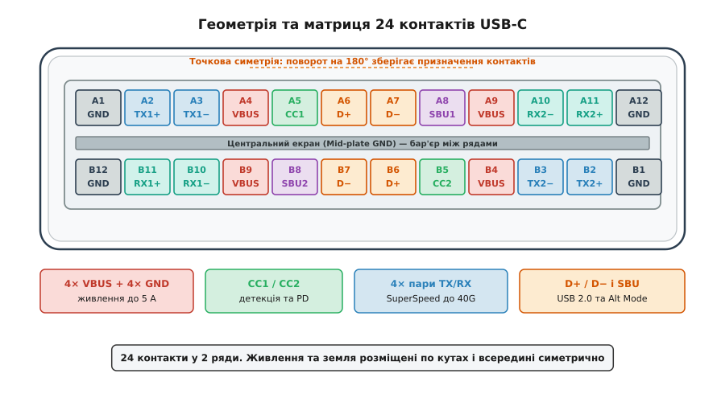
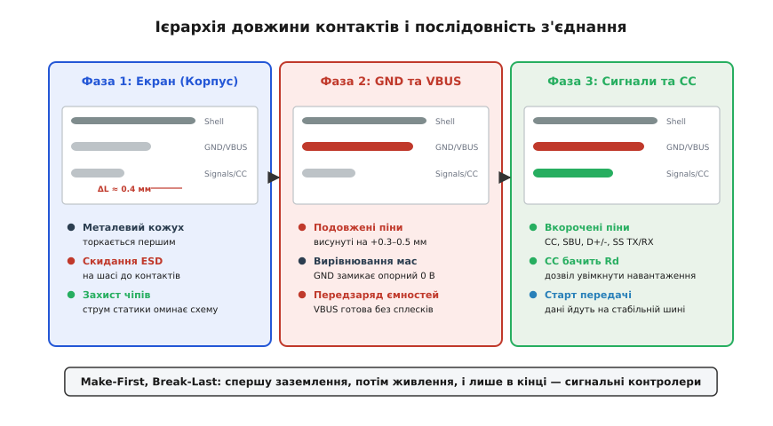
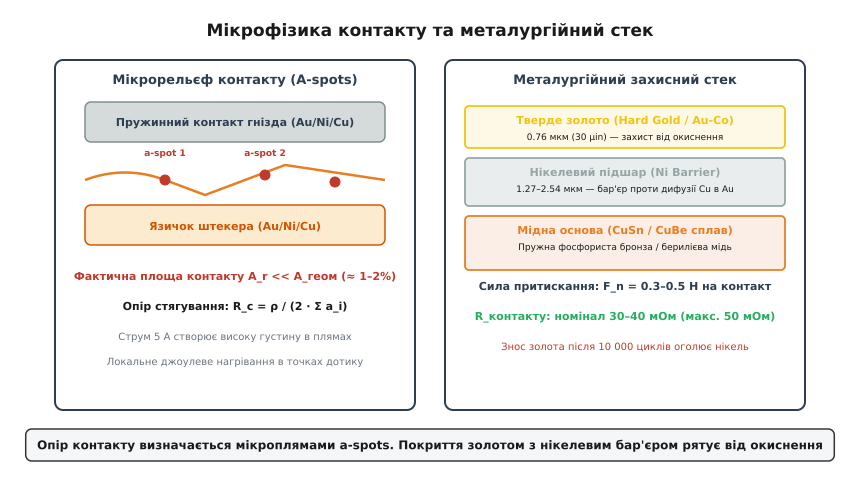
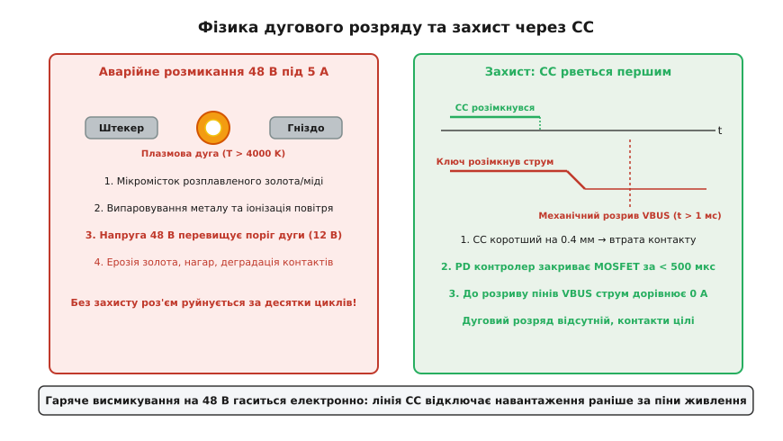
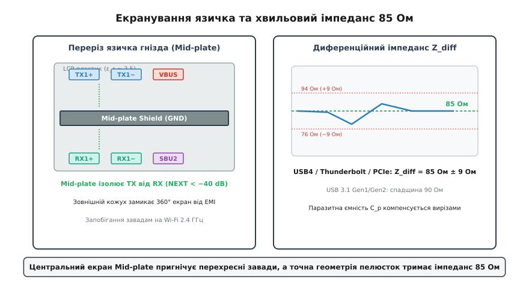
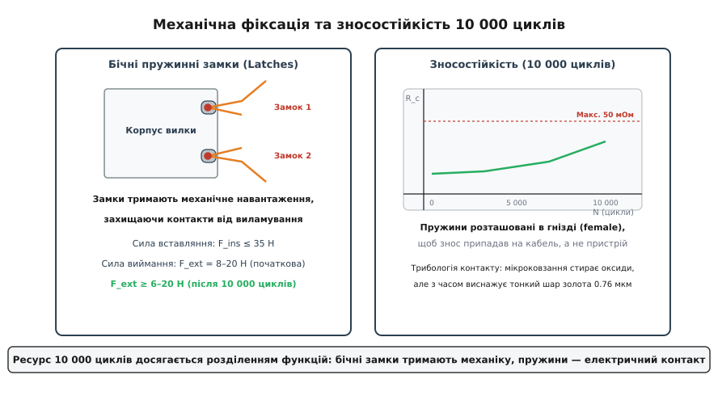

# Фізика роз'єму USB-C

<preknowlist>
* [Type-C без PD](topic:com-devices/type-c-cc) — дві лінії CC, підтяжки Rp/Rd, визначення орієнтації та ролей.
* [USB PD EPR](topic:com-devices/usb-pd-epr) — розширений діапазон 48 В / 5 А (до 240 Вт) та вимоги до кабелю.
* [Диференційна передача сигналу](topic:hw-analog/differential-signaling) — передача даних парою протифазних провідників, хвильовий імпеданс та стійкість до синфазних завад.
* [ESD-пошкодження](topic:hw-components/esd-damage) — електростатичний розряд, пробій діелектрика та необхідність першочергового заземлення.
* [Перехресна завада (crosstalk)](topic:hw-pcb/crosstalk) — ємнісний та індуктивний паразитний зв'язок між сусідніми лініями.
</preknowlist>

Спроба пропустити електричну потужність 240 Вт (напругу 48 В при постійному струмі 5 А) та одночасно високочастотні цифрові потоки зі швидкістю до 80 Гбіт/с крізь роз'єм із поперечним перерізом усього 8.34 мм × 2.56 мм зіштовхує інженера з жорсткими законами електродинаміки, термодинаміки та фізики контактів. За такої надвисокої просторової щільності будь-який зайвий міліом перехідного опору перетворює контактний вузол на мініатюрний нагрівач, кожна десята частка пікофаради паразитної ємності спотворює фронти гігагерцових імпульсів, а некероване висмикування кабелю під повним навантаженням здатне запалити руйнівну плазмову дугу з температурою понад 4000 K.

Щоб розв'язати цей комплекс суперечливих фізичних обмежень, інженерам довелося повністю відмовитися від класичних підходів до побудови роз'ємів і створити складну електромеханічну систему, де геометрія кожного міліметра провідника підпорядкована строгому математичному розрахунку.

## Механічна геометрія та матриця 24 контактів

Фізична оболонка роз'єму USB Type-C (англ. *receptacle* — гніздо, *plug* — штекер) має строго стандартизовані розміри: зовнішній овал вхідного отвору гнізда становить 8.34 мм у ширину та 2.56 мм у висоту. Усередині гнізда розташований центральний ізоляційний язичок товщиною 0.70 мм ± 0.05 мм, на якому з верхнього та нижнього боків розміщено 24 електричні контакти з міжосьовим кроком (англ. *pitch*) 0.50 мм.

Головна споживча особливість роз'єму — повна механічна реверсивність: користувач може вставити штекер у будь-якій орієнтації, перевернувши його на 180°. З погляду математичної теорії симетрії матриця контактів USB-C має точкову симетрію другого порядку (група обертань `C₂`). Це означає, що при повороті площини роз'єму на 180° відносно його геометричного центра кожен контакт ряду A потрапляє на відповідне функціональне місце контакту ряду B.


*Геометрія та матриця 24 контактів USB-C: точкова симетрія відносно центра забезпечує однакову роботу при перевертанні штекера.*

Контакти роз'єму розбиті на чотири чіткі функціональні групи:

1. **Силова група (Power & Ground):** чотири контакти живлення `VBUS` (A4, A9, B4, B9) та чотири контакти заземлення `GND` (A1, A12, B1, B12). Вони розташовані симетрично по краях та всередині матриці. Завдяки паралельному з'єднанню чотирьох провідників сумарний струм 5 А ділиться на порції номіналом по 1.25 А на кожен пін, що знижує теплове навантаження на одиничну контактну пелюстку.
2. **Канал конфігурації (Configuration Channel):** контакти `CC1` (A5) та `CC2` (B5). У стандартному кабелі підключений лише один провідник CC, тоді як другий контакт використовується для живлення електронного маркера кабелю (`VCONN`). Саме лінія CC визначає просторову орієнтацію штекера та передає цифрові пакети протоколу USB Power Delivery.
3. **Високошвидкісні диференційні лінії (SuperSpeed Data):** чотири екрановані пари провідників — дві пари передавача `TX1+/TX1−` (A2, A3), `TX2+/TX2−` (B2, B3) та дві пари приймача `RX1+/RX1−` (B11, B10), `RX2+/RX2−` (A11, A10). Вони забезпечують дуплексну передачу протоколів USB 3.2, USB4, Thunderbolt, PCIe та DisplayPort.
4. **Спадковий інтерфейс USB 2.0 та допоміжні канали:** центральна некомутована пара `D+/D−` (A6, A7 та дублюючі B6, B7), а також контакти вторинної смуги `SBU1` (A8) та `SBU2` (B8), які застосовуються для службових сигналів в альтернативних режимах (Alternate Modes).

Повна реверсивність не вимагає фізичного подвоєння мікросхем усередині пристрою: мультиплексування сигналів здійснюється електронним комутатором (англ. *crossbar switch*) на материнській платі після того, як контролер порту визначить орієнтацію за станом ліній `CC1`/`CC2`.

## Фізика послідовного замикання: Make-First, Break-Last

Якщо одночасно замкнути десятки електричних контактів із різними потенціалами, неминуче виникнуть перехідні процеси колосальної руйнівної сили: високовольтний електростатичний пробій чутливих напівпровідникових затворів, ударні струми заряджання вхідних ємностей та паразитна індуктивна генерація.

Щоб усунути ці явища, у роз'ємі USB Type-C реалізовано прецизійну трирівневу механічну ієрархію довжини контактів, відому в електромеханіці як принцип послідовного ковзання (англ. *pin staggering* або *wipe sequence* — «замикання першим, розмикання останнім»).


*Послідовність замикання контактів при вставлянні: спершу заземлюється металевий екран, потім вирівнюються силові потенціали, і лише в кінці підключаються сигнальні контролери.*

Процес з'єднання штекера з гніздом розбивається на три послідовні фази:

### Фаза 1: Скидання електростатики через зовнішній екран (Shell)
Зовнішній безшовний металевий кожух штекера входить у зачеплення з корпусом гнізда за кілька міліметрів до того, як внутрішній ізоляційний язичок наблизиться до контактних пелюсток. Якщо на тілі людини або на кабелі накопичено статичний потенціал величиною до 8–15 кВ (типовий розряд моделі людського тіла, англ. *Human Body Model*), струм електростатичного розряду (ESD) стікає на заземлене металеве шасі приладу, повністю оминаючи кремнієві структури мікросхем.

### Фаза 2: Вирівнювання опорних потенціалів (GND та VBUS)
Контакти заземлення `GND` (A1, A12, B1, B12) та шини живлення `VBUS` (A4, A9, B4, B9) фізично довші за сигнальні піни на величину `ΔL = 0.35–0.50 мм`. Завдяки цьому під час руху штекера вглиб гнізда земляні пелюстки торкаються ламелей першими.

Це вирівнює опорний нульовий потенціал між двома незалежними пристроями. Одночасно підключаються контакти `VBUS`, забезпечуючи попереднє заряджання вхідних блокувальних конденсаторів через плавні RC-ланцюжки ще до активації логічних схем.

### Фаза 3: Підключення сигнальних ліній та активація навантаження (CC та SuperSpeed)
Усі сигнальні контакти — високошвидкісні диференційні пари, лінії `D+/D−`, `SBU` та лінія конфігурації `CC` — мають укорочену довжину і замикаються останніми.

Контролер джерела живлення тримає силові польові транзистори шини `VBUS` повністю закритими доти, доки лінія `CC` не зафіксує стабільне підключення узгоджувального резистора `Rd = 5.1 кОм` на боці споживача. Тільки після того, як усі 24 контакти стали на свої позиції, джерело плавно відкриває комутувальні ключі та подає напругу живлення.

Під час вилучення кабелю процес відбувається у зворотному порядку: лінія `CC` розривається найпершою. PD-контролер фіксує втрату зв'язку за час менш ніж 100 мкс і вимикає силовий польовий транзистор до того, як подовжені контакти `VBUS` physically розійдуться у просторі.

## Мікрофізика електричного контакту та тепловий баланс

На макроскопічному рівні золочений контакт виглядає ідеально пласкою дзеркальною поверхнею. Проте на мікроскопічному масштабі метал є хвилястим рельєфом із гострими виступами та западинами (мікронерівностями, або *asperities*).

Згідно з класичною контактною теорією Рагнара Гольма (англ. *Ragnar Holm*), коли дві металеві пелюстки притискаються із силою `F_n = 0.3–0.5 Н`, вони торкаються не всією видимою геометричною площею, а лише верхівками мікронерівностей. Під дією прикладеного зусилля метал на верхівках виступів зазнає пластичної деформації, утворюючи крихітні плями фактичного металевого контакту — так звані **a-плями** (англ. *a-spots*).


*Мікроструктура контакту та металургійний стек: лінії струму стягуються до мікроплям a-spots, створюючи перехідний опір.*

Фактична площа дотику `A_r` становить лише 1–2% від уявної геометричної площі контакту:

```
A_r = F_n / H          [дійсна площа контакту через твердість матеріалу H]
```

Оскільки електричний струм змушений різко звужуватися від усього перерізу провідника до мікроскопічних каналів завширшки в кілька мікрометрів, виникає так званий **опір стягування** (англ. *constriction resistance*) `R_c`. Для системи з кількох паралельних плям дотику він описується рівнянням:

```
R_c = ρ / (2 · ∑ a_i)  [опір стягування Гольма для провідника з питомим опором ρ]
```

Повний опір контакту `R_contact` складається з об'ємного опору самої металевої пелюстки `R_bulk`, опору стягування `R_c` та опору тунелювання крізь поверхневі оксидні та адсорбовані плівки `R_film`:

```
R_contact = R_bulk + R_c + R_film
```

У свіжому, незношеному роз'ємі USB-C початковий опір одиночного контакту становить `30–40 мОм`. Гранична специфікація USB-IF допускає зростання опору до `50 мОм` після 10 000 циклів експлуатації.

Детальний математичний виклад формул Гольма, розрахунку радіуса плям деформації та температурного балансу наведено в окремому довіднику [математичного виведення опору стягування](topic:com-devices/usb-c-connector-physics/math-contact-heating.md).

### Металургійний захисний стек

Щоб запобігти утворенню діелектричних оксидних плівок і гарантувати стабільний опір протягом тисяч з'єднань, контактні пелюстки виготовляють у вигляді тришарового металургійного сендвіча:

1. **Основа з пружного мідного сплаву:** фосфориста бронза марки `CuSn8` або берилієва мідь `CuBe2`. Цей шар забезпечує стабільну пружність пелюстки, зберігаючи постійну нормальну силу притискання `F_n` навіть після багатьох років теплових циклів.
2. **Нікелевий бар'єрний підшар (Ni barrier):** гальванічне покриття чистим нікелем товщиною 1.27–2.54 мкм (50–100 мікродюймів). Нікель виконує дві критичні функції: він запобігає термодифузії атомів міді на зовнішню поверхню (мідь, просочуючись крізь золото, миттєво окислюється на повітрі) і створює тверду механічну підкладку, яка не дає м'якому золоту продавитися.
3. **Фінішне покриття твердим золотом (Hard Gold):** шар золота товщиною не менше 0.76 мкм (30 мікродюймів), легований 0.1–0.3% кобальту або нікелю (сплав `Au-Co`). Легування збільшує мікротвердість за Віккерсом до 140–200 HV, що втричі перевищує твердість чистого золота, запобігаючи швидкому стиранню при терті.

### Тепловий баланс і джоулеве нагрівання

Коли крізь роз'єм тече безперервний струм 5 А, потужність теплових втрат Джоуля розсіюється на кожному контактному переході:

```
P_loss = I_pin² · R_contact
```

Навіть за номінального навантаження 1.25 А на кожен із 4 контактів `VBUS` та 4 контактів `GND`, усередині крихітного пластикового об'єму виділяється близько 0.5–0.8 Вт чистого тепла. Оскільки всі вісім силових пінів розташовані на відстані менш ніж 4 мм один від одного, виникає явище сильного теплового зв'язку (англ. *pin-to-pin thermal coupling*).

Специфікація USB-IF вимагає, щоб за безперервного протікання струму 5 А при температурі довкілля 25 °C перегрів контактів над навколишнім середовищем `ΔT` не перевищував `30 °C` (тобто температура всередині роз'єму не повинна перевищувати 55 °C). Якщо конструкція друкованої плати має недостатнє тепловідведення або перехідний опір зріс через знос, температура роз'єму може піднятися вище 100 °C, що призводить до оплавлення пластикового язичка з полімеру LCP.

## Фізика дугового пробою при гарячому висмикуванні під навантаженням

Коли роз'єм працював на спадковій напрузі 5 В або навіть 20 В (стандартний режим USB PD потужністю до 100 Вт), гаряче висмикування штекера споживачем рідко призводило до фатальних наслідків. Проте поява специфікації USB PD EPR (*Extended Power Range*) із напругою **48 В** кардинально змінила фізику комутації.

При розмиканні електричних контактів, якими протікає постійний струм 5 А за напруги 48 В, механічний розрив проходить кілька послідовних стадій:

1. **Руйнування мікроплям та утворення рідкого містка:** у міру витягування штекера сила притискання `F_n` падає до нуля. Кількість контактуючих a-плям зменшується, поки весь струм 5 А не сконцентрується в останній мікроскопічній точці дотику перерізом у частки мікрона.
2. **Термодинамічний вибух і кипіння металу:** густина струму в останній точці перевищує `10⁸ А/см²`. Локальне джоулеве виділення тепла миттєво нагріває метал вище температури плавлення золота (1064 °C) та міді (1085 °C). Між пелюстками на мікросекунди утворюється мікроскопічна перемичка з рідкого розплавленого металу (англ. *molten metal bridge*).
3. **Пароутворення та газовий розряд:** під дією поверхневого натягу та струмового перегріву рідкий місток закипає і вибухає. Простір між контактами заповнюється гарячою сумішшю парів золота, міді та іонізованого повітря.
4. **Запалювання самопідтримуваної плазмової дуги:** напруга 48 В значно перевищує критичний потенціал іонізації та поріг горіння електричної дуги для металів контактної групи (для міді та золота мінімальна напруга горіння дуги становить лише `12–15 В` за струму вище `0.4–0.8 А`).


*Фізика виникнення дуги та її електронне гасіння: випереджальний розрив лінії CC вимикає комутаційний MOSFET до того, як розімкнуться піни живлення.*

Температура плазмового шнура в електричній дузі перевищує `4000–6000 K`. За такої температури тонкий шар золота товщиною 0.76 мкм безслідно випаровується за 2–3 комутації, оголюючи нікель і мідну основу. Метал окислюється, на поверхні утворюється діелектричний нагар, і роз'єм стає непридатним для подальшого використання через катастрофічний ріст перехідного опору.

### Апаратне запобігання дузі через випереджальний розрив CC

Гасіння дуги в роз'ємі USB-C реалізовано не механічними дугогасними камерами, а за допомогою надшвидкого прецизійного електронного керування.

Розрахуємо часовий бюджет під час висмикування штекера:

```
v_pull = 0.5–1.5 м/с   [типова швидкість висмикування кабелю людиною]
ΔL = 0.4 мм            [механічна різниця довжини між піном CC та VBUS]
```

Часове вікно випередження `Δt`, протягом якого лінія `CC` вже розімкнута, а контакти `VBUS` ще зберігають надійний фізичний дотик:

```
Δt = ΔL / v_pull
Δt_min = 0.0004 м / 1.5 м/с ≈ 267 мкс
Δt_max = 0.0004 м / 0.5 м/с ≈ 800 мкс
```

Щойно контакт `CC` втрачає дотик, аналоговий компаратор контролера USB PD реєструє зникнення струму підтяжки і видає сигнал аварійного відключення на драйвер силових ключів. Сучасні MOSFET-комутатори шини `VBUS` (англ. *e-fuse* або *load switch*) повністю переходять у закритий стан за час `t_off = 50–150 мкс`.

Оскільки час електронного вимкнення ключа (`150 мкс`) менший за мінімальний час механічного розмикання силових контактів (`267 мкс`), струм через роз'єм спадає до нуля ще до того, як піни `VBUS` відірвуться один від одного. Розрив силових контактів відбувається в знеструмленому стані, що повністю унеможливлює утворення плазмової дуги.

Огляд реальних конструкцій гнізд, їхніх кріплень та гідроізоляції стандарту IP67/IP68 викладено в огляді [конструктивних типів гнізд USB-C](topic:com-devices/usb-c-connector-physics/comp-type-c-receptacle.md).

## Високошвидкісні диференційні лінії, хвильовий імпеданс та екранування

Передача цифрових даних зі швидкістю 10, 20 або 40 Гбіт/с на одну смугу (стандарти USB 3.2 Gen 2, USB4, PCIe Gen 4 Alt Mode) переводить провідники роз'єму в режим роботи НВЧ-хвилеводів. На таких частотах довжина хвилі сигналу в діелектрику стає сумірною з фізичними розмірами самих контактних ламелей (близько 5–8 мм).

### Диференційний хвильовий імпеданс 85 Ом

Для запобігання паразитним відбиттям електромагнітної хвилі кожен сантиметр тракту повинен мати строго узгоджений хвильовий імпеданс. Якщо в ранніх версіях USB 2.0 та USB 3.0 нормативним був диференційний імпеданс `90 Ом`, то починаючи зі специфікацій USB Type-C 2.0 та USB4 стандарт перейшов на норму **85 Ом ± 9 Ом** (робочий діапазон від 76 до 94 Ом).

Перехід на 85 Ом зумовлений двома фундаментальними факторами:
- **Уніфікація з шиною PCI Express:** інтерфейси PCIe, Thunderbolt та DisplayPort історично розраховані на диференційний імпеданс 85 Ом. Це дозволяє підключати лінії процесора напряму до роз'єму без додаткових трансформаторів опору.
- **Зниження паразитної індуктивності та втрат на платі:** провідники з імпедансом 85 Ом мають трохи ширші доріжки та менший зазор до опорної площини землі, що знижує втрати на випромінювання на частотах понад 10 ГГц.


*Центральний екран Mid-plate та хвильовий профіль: розділення передавачів і приймачів знижує перехресні завади NEXT нижче −40 дБ.*

### Центральний сталевий екран (Mid-plate)

Найбільшу загрозу для цілісності сигналу в 24-контактному роз'ємі становить взаємний електромагнітний зв'язок між верхнім рядом контактів A та нижнім рядом B. Верхній ряд містить передавач `TX1`, а нижній прямо під ним — приймач `RX1`. Оскільки амплітуда сигналу передавача становить близько 800–1000 мВ, а чутливість приймача розрахована на мілівольти після проходження довгого кабелю, пряме наведення сигналу з ряду A на ряд B (перехресна завада на ближньому кінці, англ. *Near-End Crosstalk, NEXT*) здатне повністю заглушити зв'язок.

Щоб ізолювати ряди, усередину полімерного язичка гнізда запресовується суцільна пластина з нержавіючої сталі — **mid-plate**. Вона електрично з'єднується з контактами заземлення `GND`. Цей сталевий бар'єр замикає на себе силові лінії електричного та магнітного полів, забезпечуючи пригнічення перехресних завад `NEXT < −40 дБ` на частотах до 15 ГГц.

### 360-градусний суцільний екран проти завад на Wi-Fi

Цифрові потоки інтерфейсу USB 3.0 / USB4 зі швидкістю 5 Гбіт/с створюють потужний спектр електромагнітного шуму в діапазоні **2.4–2.5 ГГц** через використання кодування 8b/10b та модуляції NRZ/PAM3. Цей діапазон точно збігається з робочими частотами модулів Wi-Fi (IEEE 802.11b/g/n) та Bluetooth.

Якщо корпус роз'єму має щілини або шви, високочастотне електромагнітне поле випромінюється назовні, створюючи завади для вбудованих антен смартфона або ноутбука (явище десенсибілізації радіоприймача, англ. *Wi-Fi desensitization*). З цієї причини специфікація USB-C вимагає використання безшовних, витягнутих методом глибокої витяжки (англ. *deep-drawn*) металевих кожухів без проміжних стиків із суцільним пружинним заземленням на 360° по всьому периметру.

## Трибологія, механічна фіксація та ресурс 10 000 циклів

Згідно зі специфікацією USB-IF, роз'єм USB-C зобов'язаний витримувати не менше **10 000 циклів** з'єднання та роз'єднання без погіршення електричних і механічних характеристик. Для порівняння, стандартний роз'єм USB Type-A розрахований лише на 1500 циклів, а Micro-USB Type-B — на 10 000 циклів у посиленому виконанні.

Щоб зберегти цілісність тонкого золотого покриття товщиною 0.76 мкм протягом 10 000 з'єднань, інженери розділили механічну та електричну функції роз'єму на два незалежні вузли:

1. **Бічні пружинні замки (Detent Latches):** утримання штекера в гнізді забезпечується не тертям електричних контактів, а двома масивними бічними пружинними фіксаторами, розташованими з боків металевого кожуха. При вставлянні штекера ці фіксатори із характерним клацанням замикаються у відповідні пази на язичку. Вони беруть на себе всі зусилля поздовжнього натягу та висмикування кабелю.
2. **Електричні контактні пелюстки:** електричні контакти розраховані на строго нормовану нормальну силу притискання `F_n = 0.3–0.5 Н` (близько 30–50 грамів сили) на кожен контакт. Така помірна сила гарантує руйнування поверхневих оксидів під час мікроковзання при вставлянні (англ. *contact wipe*), але не здирає тонкий захисний шар золота.


*Механіка замків і зносостійкість 10 000 циклів: бічні замки тримають механічне навантаження, переносячи знос на змінний кабель.*

Нормативні сили з'єднання згідно зі специфікацією:
- **Сила вставляння (Insertion force):** не більше `35 Н` (штекер легко вставляється однією рукою).
- **Початкова сила вилучення (Extraction force):** у межах від `8 до 20 Н`.
- **Сила вилучення після 10 000 циклів:** не менше `6 Н` і не більше `20 Н` (роз'єм не розбовтується і не випадає під власною вагою кабелю).

### Чому пружини розміщено в гнізді, а не в штекері

У класичному роз'ємі Micro-USB пружні фіксувальні гачки розташовувалися на кабельному штекері. Якщо користувач смикав за кабель, пружини згинались або ламалися, і кабель переставав триматися.

У роз'ємі USB-C конструкцію оптимізовано з погляду надійності: усі найскладніші пружні пелюстки перенесено всередину гнізда пристрою, де вони захищені міцним металевим корпусом. Кабельний штекер являє собою монолітну вилку з суцільноштампованими внутрішніми доріжками. Якщо ж роз'єм таки зношується, основна механічна втома металу припадає на змінний дешевий кабель, а не на дороге гніздо всередині материнської плати смартфона чи комп'ютера.

Історію боротьби інженерів за створення цього універсального інтерфейсу та хроніку ухвалення стандарту описано в історичній довідці про [народження роз'єму USB Type-C](topic:com-devices/usb-c-connector-physics/hist-type-c-birth.md).

## Інженерні правила проєктування та трасування друкованих плат

Правильне фізичне проєктування роз'єму буде зведене нанівець, якщо розробник апаратури припуститься грубих помилок під час трасування друкованої плати (PCB layout). Нижче наведено звід обов'язкових інженерних правил інтеграції USB-C:

### 1. Трасування силових ліній VBUS та GND
- **Заборона термобар'єрів:** на контактних SMD-майданчиках пінів `VBUS` та `GND` суворо заборонено використовувати вузькі термохрести (thermal relief). З'єднання з полігонами живлення має бути суцільним і прямим.
- **Масив перехідних отворів (Via Stitching):** струм 5 А створює відчутне падіння напруги на тонкій фользі. Безпосередньо біля кожного виводу `VBUS` та `GND` слід встановлювати не менше 3–4 металізованих перехідних отворів діаметром 0.3 мм для рівномірного переходу струму у внутрішні шари міді.

### 2. Компенсація паразитної ємності (Антипеди під контактами)
Контактна пелюстка роз'єму, припаяна до контактного майданчика плати, утворює локальне розширення провідника. Це створює паразитну ємність величиною `C_p ≈ 0.2–0.35 пФ`. На частотах понад 5 ГГц ця ємність викликає різкий локальний провал диференційного імпедансу (до 65–70 Ом замість 85 Ом).

Для компенсації цього ефекту під контактними майданчиками швидкісних ліній SuperSpeed у першому внутрішньому шарі заземлення вирізають прямокутні вікна у міді — **антипеди** (англ. *anti-pads*). Сигнал починає взаємодіяти з глибшим другим шаром землі, що знижує питому ємність і повертає імпеданс у норму 85 Ом.

### 3. Розміщення діодів захисту від ESD
Супресорні діодні збірки (TVS diodes) для ліній SuperSpeed повинні мати власну паразитну ємність не більше `0.15–0.25 пФ` і розміщуватися на платі якомога ближче до виводів роз'єму. Траса сигналу має проходити крізь виводи TVS-діода транзитом (flow-through routing), без відгалужень (stubs), які породжують вторинні паразитні резонанси.

### 4. Фазовий зсув усередині диференційної пари (Intra-Pair Skew)
На швидкостях 20–40 Гбіт/с різниця довжин між прямим (+) та інверсним (−) провідниками однієї диференційної пари не повинна перевищувати `0.15 мм` (що відповідає фазовому зсуву менш ніж `1 пс`). Якщо провідники розходяться при огинанні отворів роз'єму, виникає розфазування, яке перетворює диференційний сигнал на синфазну заваду, руйнуючи очне вікно (eye diagram) на приймачі. Для компенсації різниці довжин у зонах вигину застосовують фазокомпенсувальні змійки (phase-matching jogs) безпосередньо біля виводів гнізда.

### 5. Фізичне ремапування ліній в альтернативних режимах (Alternate Modes)
При переході в альтернативний режим (наприклад, DisplayPort 4-Lane Mode) контролер мультиплексує високошвидкісні канали роз'єму:
- Пари `TX1+/TX1−`, `RX1+/RX1−`, `TX2+/TX2−`, `RX2+/RX2−` перетворюються на 4 односпрямовані лінії передачі відео `Main Link Lane 0..3` із загальною смугою до 32.4 Гбіт/с (DisplayPort HBR3) або 80 Гбіт/с (UHBR20);
- Контакти `SBU1` та `SBU2` перемикаються на двонаправлений допоміжний канал `AUX CH` (1 Мбіт/с Манчестер-кодування) для обміну EDID-даними та керування яскравістю дисплея;
- Центральні контакти `D+/D−` залишаються повністю незалежними, продовжуючи обслуговувати спадковий потік USB 2.0 (наприклад, для роботи тачпаду, веб-камери чи клавіатури у моніторі).

> 🔧 **Навіщо це.** Спроба заощадити на правильному трасуванні силових полігонів VBUS призводить до того, що під час заряджання струмом 5 А напруга на роз'ємі просідає на 150–300 мВ через опір доріжок, що змушує контролер передчасно скидати потужність через локальний перегрів плати.

## Підсумок фізичних принципів USB-C

Роз'єм USB Type-C є прикладом глибокої інженерної оптимізації, де кожен конструктивний елемент вирішує конкретну фізичну проблему:
- **Точкова симетрія матриці контактів** дозволяє обертати штекер на 180° без ускладнення схемотехніки.
- **Ієрархія довжини пелюсток** гарантує першочергове скидання статики на корпус, заземлення пристроїв і повне знеструмлення кола до фізичного розмикання силових ліній.
- **Металургійний стек із твердого золота та нікелевого бар'єра** забезпечує опір дотику 30–40 мОм і захист від стирання протягом 10 000 циклів.
- **Центральний сталевий екран Mid-plate** розділяє високошвидкісні диференційні пари верхнього й нижнього рядів, гарантуючи хвильовий імпеданс 85 Ом та ізоляцію від перехресних завад на гігагерцових частотах.
