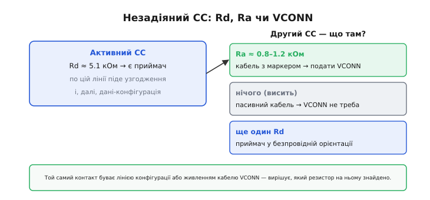
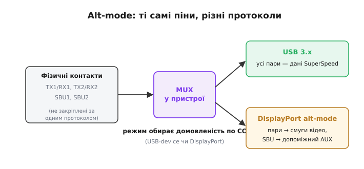

# USB-C конектор — докладно

<preknowlist>
- [Дільник напруги](root:hw-analog/voltage-divider) — два резистори послідовно ділять напругу пропорційно опорам; на цьому тримається вся логіка ліній CC.
- [Підтяжки](root:hw-digital/floating-pullups) — резистор до живлення (pull-up) чи до землі (pull-down) задає рівень вільної лінії; Rp і Rd — саме такі резистори.
</preknowlist>

Базова картина Type-C проста: 24 контакти двома дзеркальними рядами, реверсивність із дублювання й маленька логіка впізнавання на лініях CC. Тут розберемо другий шар — той, що базова версія свідомо стискає. Пройдемо всі двадцять чотири контакти поіменно, розкладемо повну логіку лінії конфігурації (як джерело відрізняє приймача від кабелю й від порожнечі, які напруги воно читає, як міняються ролі), розберемо живлення кабелю через VCONN і мікросхему-маркер, а наприкінці побачимо, як ті самі фізичні контакти ведуть то USB 3.x, то відео DisplayPort. Скрізь тримаємо межу: **скільки** ват тече силовими контактами — тема [живлення через USB](root:embedded/usb-power-map); **як** ходять пакети даних — тема [огляду USB](root:com-devices/usb-overview); тут — сам роз'єм і його впізнавальна логіка.

## Повна розкладка: усі 24 контакти поіменно

Контакти стоять двома рядами по дванадцять. Верхній ряд позначають A1…A12, нижній — B1…B12. Ключ до всього роз'єму — нижній ряд є верхнім, повернутим на 180°: послідовність B1…B12 читається як A12…A1, якщо подумки перевернути колодку. Ось обидва ряди гнізда поряд:

```
A1   A2    A3    A4    A5   A6   A7   A8    A9    A10   A11   A12
GND  TX1+  TX1−  VBUS  CC1  D+   D−   SBU1  VBUS  RX2−  RX2+  GND

B12  B11   B10   B9    B8   B7   B6   B5    B4    B3    B2    B1
GND  TX2+  TX2−  VBUS  CC2  D+   D−   SBU2  VBUS  RX1−  RX1+  GND
```

Прочитаймо групи по черзі — не як список, а як набір рішень, що їх зробили проєктувальники роз'єму.

**Чотири GND (A1, A12, B1, B12) по кутах.** Земля стоїть першою й останньою в кожному ряду не випадково: крайні контакти торкаються першими при вставлянні. Земля встигає зімкнутися раніше за сигнальні лінії — це захищає електроніку від кидків і дає опорний рівень ще до того, як з'явиться все інше.

**Чотири VBUS (A4, A9, B4, B9) ближче до центру.** Живлення розкидано симетрично, по дві точки в кожному ряду. Чотири контакти на одну шину — спосіб провести більший струм через тонкі пружні ламелі. Кожна ламель розрахована на свою частку струму; чотири паралельні дають сумарний без перегріву окремого контакту. Тому, до речі, контакти живлення трохи коротші за землю, але довші за сигнальні: послідовність змикання навмисна — спершу земля, потім живлення, далі сигнали.

**Дві лінії конфігурації — CC1 (A5) і CC2 (B8).** Стоять у дзеркальних позиціях (B8 — це місце навпроти A5 у перевернутому ряду), але, на відміну від живлення, **не з'єднані** між собою в гнізді. У цьому вся суть: якби їх з'єднали, як VBUS, роз'єм утратив би здатність відрізняти орієнтацію. Кожна лінія CC лишається самостійною, і саме асиметрія між ними несе інформацію.

**Дві пари USB 2.0 — D+ (A6, B7) і D− (A7, B6).** Тут є тонкість, яку легко проґавити. У **гнізді** обидві копії D+ з'єднані разом, і обидві D− теж — тому поворот штекера не міняє пару даних. Зверни увагу: у нижньому ряду D+ і D− стоять у дзеркальному порядку (B7, B6) — наслідок того самого повороту на 180°. Але в самому **штекері** задіяна лише одна копія: A6/A7 або B6/B7 залежно від орієнтації. Гніздо «замикає» обидві сторони на свій єдиний USB-контролер, штекер під'єднує ту, що зімкнулася. Результат — повна швидкість працює обома боками без жодного мультиплексора. Це та сама [диференційна пара](root:com-medium/differential-pair), що й у звичайному USB; полярність у ній важить, тож переплутати D+ із D− у розведенні — помилка, навіть якщо роз'єм фізично симетричний.

**Дві лінії SBU — SBU1 (A8), SBU2 (B5).** Боковина (Sideband Use) для USB-режиму просто мовчить. Вона оживає лише в альтернативних режимах: у DisplayPort, наприклад, по SBU йде допоміжний канал AUX, яким монітор і джерело узгоджують роздільність.

**Чотири швидкі пари — TX1/RX1 і TX2/RX2 (решта контактів A2/A3/A10/A11 і B2/B3/B10/B11).** Це SuperSpeed-смуги USB 3.x. У звичайному USB 3.x задіяна одна пара TX і одна RX (та, що лягла під штекер); в альтернативних режимах усі чотири можуть піти під відео. ESP32 їх не торкається.

> 🔧 **Навіщо це.** Послідовність довжини контактів (земля → живлення → сигнали) пояснює, чому «гаряче» під'єднання Type-C безпечне: до моменту, коли зімкнуться сигнальні лінії, земля й живлення вже стабільні. Якщо ви проєктуєте власну колодку чи відлагоджуєте контакт, що «іноді не ловить», згадайте: проблема часто саме в крайніх землях, які мали зімкнутися першими.

## Механіка контакту: чому роз'єм терпить тисячі вставлянь

Електрична розкладка — половина роз'єму; друга половина суто механічна, і вона диктує надійність. Контакти Type-C — це не плоскі площадки, а пружні ламелі: тонкі металеві язички, що відгинаються, коли штекер заходить, і притискаються до його контактів власною пружністю. Притиск тут не випадковий — він задає опір з'єднання. Слабкий притиск дає більший перехідний опір, нагрів на струмі й «контакт, що пропадає»; саме тому зношений роз'єм спершу починає гріти живлення і втрачати дані, а не відмовляє різко.

Коли штекер ковзає всередину, кінчик ламелі проходить уздовж його контакту — це називають протиранням (wipe). Рух не косметичний: він зчищає тонку плівку окису й бруду, що неминуче осідає на відкритому металі, і пробиває її до чистого контакту. Тому роз'єм, у який давно не вставляли штекер, іноді «оживає» після кількох вставлянь — протирання відновило з'єднання. З тієї ж причини контакти золотять: золото не окислюється, тож плівки, яку треба пробивати, майже немає, а м'якість золота дає більшу площу дотику під притиском.

Ресурс роз'єму стандарт задає в циклах вставлянь — для Type-C це порядок десяти тисяч. Звідки межа? Кожне вставляння трохи стирає покриття протиранням і трохи послаблює пружність ламелі від згину. Коли золото протерлося до основи, оголений метал починає окислюватися, опір росте — і роз'єм деградує саме як контакт, а не як механіка. Для приладу, який вставляють раз на день, десять тисяч циклів — десятки років; для гнізда на стенді, куди штекер тицяють сотні разів на день, той самий ресурс вичерпується за місяці, і це вже інженерне міркування при виборі роз'єму.

Симетрія додає тут і навантаження, і витривалість. Кожен контакт у гнізді мейтиться обома орієнтаціями штекера — тобто працює вдвічі частіше, ніж у несиметричному роз'ємі. Але дублювання живлення й даних означає, що знос розподіляється, а не б'є по одному критичному контакту. Лінії CC у цьому сенсі найвразливіші: кожна несе всю логіку впізнавання, і брудний чи зношений CC дає не «трохи гірший» зв'язок, а повну невидимість пристрою — бо дільник Rp–Rd просто не утвориться.

> 🔧 **Навіщо це.** Якщо плата «то бачиться, то ні» при ворушінні кабелю, а паяння й розведення чисті — підозрюй механіку роз'єму: зношені або забруднені ламелі CC. Перш ніж міняти схему, варто спробувати інший роз'єм або обережно почистити контакти; на стендовому обладнанні з частим перетиканням це регулярна процедура, а не екзотика.

## Логіка лінії конфігурації: повний розбір

Базова версія описала дільник Rp–Rd одним рухом. Тепер розкладемо всю послідовність — від голого роз'єму до встановленого з'єднання з відомою орієнтацією, роллю й струмом.

### Три резистори, три ролі

На лініях CC живуть рівно три типи резисторів, і кожен щось означає.

**Rp — підтяжка до напруги (зазвичай 5 В), її виставляє джерело.** Джерело у стандарті зветься DFP (downstream-facing port — «порт, повернутий до підпорядкованого пристрою»). Rp каже: «я тут джерело, і я тримаю лінію високою, доки ніхто її не стягнув».

**Rd — стяжка до землі, 5.1 кОм, її виставляє приймач.** Приймач — UFP (upstream-facing port — «порт, повернутий до головного»). Значення 5.1 кОм фіксоване стандартом саме тому, що джерело за дільником із відомим Rd обчислює, який струм воно само оголосило. Якби Rd «плавав», оголошення струму не читалося б.

**Ra — мала стяжка, близько 1 кОм (800–1200 Ом), її виставляє кабель** на лінії, що стане VCONN. Ra означає: «я кабель з електронікою, мене треба живити».

### Виявлення й орієнтація

Доки нічого не під'єднано, джерело тримає на обох CC підтяжку Rp і бачить там повну напругу. Воно безперервно стежить за обома лініями, чекаючи, доки якась просяде нижче порога «нічого».

Щойно штекер увійшов, у кабелі є лише одна жила конфігурації — вона з'єднує CC одного кінця з CC другого. Залежно від орієнтації ця жила лягає на CC1 або CC2 гнізда. На тій лінії підтяжка джерела Rp і стяжка приймача Rd утворюють дільник, і вона просідає. Друга лінія CC лишається висіти біля 5 В (або, якщо кабель з маркером, притягнута меншим Ra — про це далі).

Звідси джерело читає два факти миттєво. Перший: приймач присутній — бо одна лінія просіла під навантаженням Rd. Другий: орієнтація — бо просіла саме та лінія, де реально зімкнувся CC. Якщо ожив CC1, штекер вставлено одним боком; якщо CC2 — перевернутим. Цю орієнтацію джерело запам'ятовує: вона потрібна, щоб правильно скерувати внутрішній мультиплексор для швидких пар (для USB 2.0, нагадаємо, нічого комутувати не треба — D+/D− дубльовані).

### Скільки струму: читання напруги дільника

Третій факт — дозволений струм — закодовано в номіналі Rp, а отже, в тому, наскільки просіла лінія. Чим менший Rp, тим вище тримається напруга на дільнику з фіксованим Rd 5.1 кОм, і тим більший струм оголошено:

```
Rp джерела   оголошений струм          напруга на активному CC (Rd = 5.1 кОм)
56 кОм       стандартний USB           ≈ 0.4 В   (0.5 А USB 2.0 / 0.9 А USB 3.x)
22 кОм       1.5 А                      ≈ 0.9 В
10 кОм       3.0 А                      ≈ 1.6 В
```

Напруги тут — номінальні центри діапазонів; стандарт задає навколо кожної межі вікно з допусками, щоб АЦП приймача впевнено розрізняв три рівні попри розкид резисторів і опір контактів. Приймач не зобов'язаний брати весь оголошений струм — це стеля, нижче якої він у безпеці без жодних переговорів.

> **Підпис-умова: приймач класифікує оголошений струм за порогами.**
>
> ```c
> // v_cc — виміряна напруга на активній лінії CC (вольти).
> // Пороги — приблизно між номінальними рівнями таблиці вище.
> typedef enum { CC_NONE, CC_DEFAULT, CC_1A5, CC_3A0 } cc_level_t;
>
> cc_level_t cc_classify(float v_cc) {
>     if (v_cc < 0.20f) return CC_NONE;     // лінія не притягнута — нічого нема
>     if (v_cc < 0.66f) return CC_DEFAULT;  // Rp 56 кОм  → стандартний USB
>     if (v_cc < 1.31f) return CC_1A5;      // Rp 22 кОм  → 1.5 А
>     return CC_3A0;                        // Rp 10 кОм  → 3.0 А
> }
> ```
>
> Одна виміряна напруга на одній лінії несе і факт під'єднання, і орієнтацію (яка з двох ліній просіла), і стелю струму. Це і є вся «базова» конфігурація Type-C — ще до будь-якого цифрового протоколу.

Усе вище — лише оголошення струму **резисторами**, на стандартних 5 В. Коли потрібні вищі напруги й потужності, поверх тієї самої лінії CC запускають цифровий протокол, який модулює сигнал по CC й домовляється про профілі живлення. Це окрема велика тема — [живлення через USB](root:embedded/usb-power-map); конектор лише надає для неї фізичну лінію.

### Орієнтаційний мультиплексор

Орієнтація, яку джерело прочитало з активного CC, потрібна не сама по собі — вона керує внутрішнім перемикачем швидких пар. Для USB 2.0, нагадаємо, комутувати нічого: пара D+/D− дубльована й з'єднана в гнізді. А от швидкі пари TX/RX у штекері лежать тільки одним боком — тим, що зімкнувся. Якщо штекер перевернути, «правильна» пара опиниться фізично на інших контактах гнізда. Тому пристрій із USB 3.x чи alt-mode ставить між роз'ємом і своїм контролером мультиплексор: знаючи з CC орієнтацію, він перемикає, котрі фізичні контакти вести на приймач, а котрі — на передавач.

Звідси видно, чому орієнтація читається **до** того, як підуть швидкі дані: без неї мультиплексор не знав би, як з'єднати пари, і SuperSpeed-лінк просто не підняв би. Для плати на ESP32 цього вузла немає взагалі — швидких пар вона не використовує, тож і мультиплексор зайвий, а вся «орієнтаційна» робота зводиться до того, що дільник Rp–Rd утворюється на тому CC, який зімкнувся.

### Послідовність від вставляння до даних

Складемо все докупи як ланцюжок подій, бо порядок тут принциповий. Спершу заходять крайні землі — з'являється опорний рівень. Далі змикаються контакти живлення (поки що знеструмлені) і лінії CC. На активному CC утворюється дільник Rp–Rd, джерело бачить просідання й читає одночасно присутність приймача, орієнтацію та оголошений резистором струм. Лише тепер, переконавшись, що навпроти справді приймач, джерело подає на VBUS напругу. Електроніка приймача прокидається від живлення, ініціалізує свій USB-контролер — і вже він, за правилами шини, вішає підтяжку на лінію D+, сигналізуючи хостові про готовність; далі починається перелік пристроїв, описаний в [огляді USB](root:com-devices/usb-overview).

Ключове тут — VBUS приходить **після** виявлення через CC, а не одночасно зі вставлянням. Саме тому роз'єм безпечно тримати під напругою на хості: голі контакти лишаються знеструмленими, доки Rd не підтвердить приймача. Це фундаментальна відмінність від старих роз'ємів, де живлення сиділо на контакті завжди.

### Зміна ролей

Дільник задає ролі статично: хто з Rp — джерело, хто з Rd — приймач. Але роль не прибита назавжди. Пристрій, здатний і давати, і брати живлення (ноутбук — класичний приклад), може мати на CC керовані резистори й перемикатися. Спочатку він під'єднується в одній ролі, а потім, уже по цифровому протоколу поверх CC, домовляється помінятися — і перемикає свій Rp на Rd чи навпаки. Сам роз'єм цьому не заважає: він лише надає дві симетричні лінії, а хто на них що вішає — рішення електроніки за роз'ємом. Для простої периферії на кшталт плати з ESP32 цього не буває: вона завжди приймач із незмінним Rd на обох CC.

## VCONN: живлення кабелю через незадіяний CC

Тепер про другу лінію CC — ту, що не зімкнулася під дані-конфігурацію. У простому пасивному кабелі вона нічим не зайнята. Але кабель на великий струм або на USB 3.x/4 містить усередині мікросхему-маркер (e-marker — «електронна позначка»), яка зберігає паспорт кабелю: на який струм розрахований, на яку швидкість, чи активний. Цю мікросхему треба живити, і живить її лінія VCONN — нею стає той самий незадіяний CC.

Як джерело розуміє, що треба подати VCONN? Знову за резистором. Знайшовши на активній лінії повноцінний Rd (приймач на місці), воно дивиться на другу лінію CC. Якщо там менший резистор Ra близько 1 кОм — це кабель з маркером, і джерело подає на цей контакт VCONN, оживляючи мікросхему. Якщо друга лінія просто висить — кабель пасивний, маркера нема, VCONN не потрібен.



*Розрізнення Rd, Ra й порожнечі на другій лінії CC. Той самий контакт стає або лінією конфігурації, або живленням кабелю VCONN — усе вирішує, який резистор на ньому знайдено.*

Тонкість, яку легко проґавити: Ra менший за Rd (≈1 кОм проти 5.1 кОм), тому притягує лінію сильніше — інакше джерело сплутало б кабель із другим приймачем. Саме різниця номіналів дозволяє за однією напругою впевнено відрізнити «це кабель» від «це пристрій». Маркер, отримавши VCONN, відповідає по тій самій лінії конфігурації своїм паспортом — і джерело вже знає, чи можна гнати по кабелю обіцяний струм і швидкість.

> 🔧 **Навіщо це.** Якщо «розумна» зарядка не дає повної потужності через сторонній кабель — часто річ саме в маркері: кабель без e-marker або з несправним маркером не підтверджує здатність на великий струм, і джерело свідомо лишається на безпечному мінімумі. Це не дефект зарядки, а захист: гнати 5 А по кабелю, який не назвався, небезпечно.

## Alt-mode: ті самі контакти, інший протокол

Найгнучкіше в роз'ємі — те, що швидкі пари TX/RX і лінії SBU **не закріплені** за одним протоколом намертво. Після того як по CC сторони домовилися, внутрішній мультиплексор пристрою скеровує ці фізичні контакти на потрібний режим. У звичайному USB 3.x вони ведуть SuperSpeed-дані. В альтернативному режимі (alt-mode) ті самі контакти переключаються на зовсім інший інтерфейс — найпоширеніший приклад DisplayPort, коли по швидких парах ідуть смуги відео, а по SBU — допоміжний канал AUX.



*Один комплект швидких контактів — два призначення. Домовленість по лінії конфігурації каже мультиплексору, чи вести ними USB 3.x, чи смуги DisplayPort; для відео ще й SBU стає допоміжним каналом.*

Важливо тримати межу. Сам по собі роз'єм Type-C не «вміє» DisplayPort — він лише надає фізичні контакти й лінію CC, якою сторони домовляються. Чи буде alt-mode, залежить від електроніки за роз'ємом: чи має пристрій відповідний мультиплексор і чи підтримує протокол домовленості. Для прошивача на ESP32 це означає просту річ: на такій платі alt-mode зазвичай і не передбачено, швидкі пари лишаються вільними, і роз'єм працює суто як USB 2.0 для даних і прошивки.

## Граблі конектора одним списком

Зведемо типові помилки, що випливають саме з пристрою роз'єму, з механізмом кожної.

- **Немає Rd на CC узагалі** — джерело не бачить просідання, вважає, що нічого не під'єднано, і не подає VBUS. Плата повністю мертва по USB. Механізм: без стяжки дільник не утворюється, лінія тримається повною.
- **Rd лише на одному CC** — працює тільки тією орієнтацією, де зімкнувся «оснащений» контакт; перевернутим боком мовчить. Механізм: реверсивність вимагає Rd на **обох** лініях, бо наперед невідомо, яка оживе.
- **Переплутані D+ і D−** — на повній швидкості іноді «майже працює» з помилками, бо полярність диференційної пари важить. Симетрія роз'єму стосується дублювання рядів, а не полярності всередині пари.
- **Charge-only кабель або непідведені D+/D−** — живлення і виявлення на місці, даних немає: плата світиться, але COM-порт не з'являється. Механізм: VBUS, GND і CC розведені, а електричного шляху для пари даних немає.
- **Сторонній кабель без e-marker на велику потужність** — «розумна» зарядка лишається на мінімумі, бо кабель не підтвердив здатності через Ra й маркер. Це захист, а не дефект.
