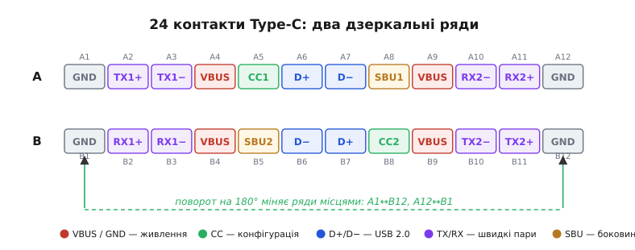
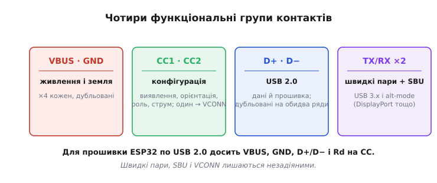
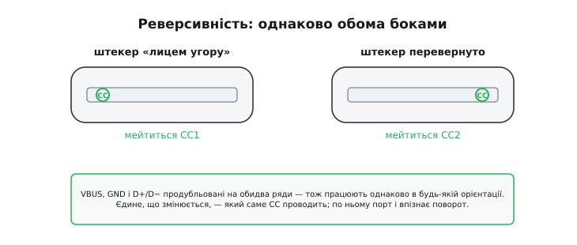
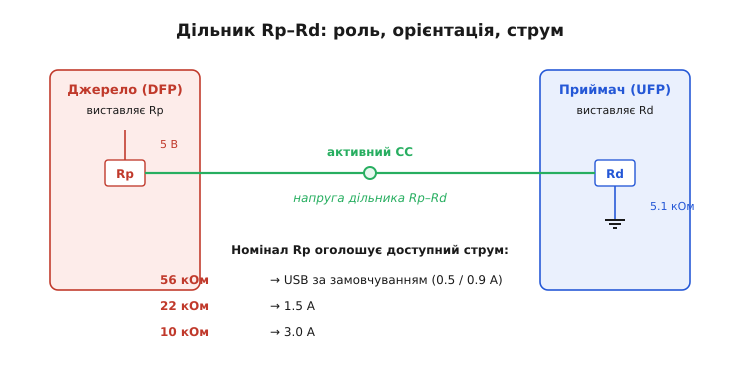

# USB-C конектор

<preknowlist>
- [Дільник напруги](topic:hw-analog/voltage-divider) — два резистори послідовно ділять напругу пропорційно опорам; на цьому тримається вся логіка ліній CC.
- [Підтяжки](topic:hw-digital/floating-pullups) — резистор до живлення (pull-up) чи до землі (pull-down) задає рівень вільної лінії; Rp і Rd — саме такі резистори.
</preknowlist>

USB-C (Type-C — «тип C» у позначенні роз'ємів USB) — це передусім **роз'єм**: овальна металева колодка з 24 контактами, яку можна вставити будь-яким боком. За цією простою на вигляд деталлю ховається акуратно продумана механіка й маленька схема впізнавання, без якої роз'єм лишається мертвим металом. Розберемо саме конектор: як влаштовані його контакти, чому він реверсивний і як дві лінії конфігурації встигають визначити орієнтацію штекера, ролі двох пристроїв і навіть дозволений струм — ще до того, як на роз'єм подадуть живлення.

> 🔧 **Навіщо це.** Пристрій на ESP32-S3 із нативним USB не з'явиться в системі — ні як COM-порт, ні для прошивки — якщо на роз'ємі USB-C забути резистори на лініях CC. Це класична причина «плата мертва по USB»: метал розведено правильно, а маленької пасивної деталі бракує.

## Що штовхнуло зробити роз'єм наново

Старі роз'єми USB мали два болючі місця. По-перше, несиметричність: штекер Type-A входив лише одним боком, і всі ми звикли вставляти його з третьої спроби. По-друге, зоопарк форм-факторів — повнорозмірний A, micro-B, mini-B, окремий B для принтерів. Кожен пристрій тягнув свій кабель.

USB-C відповідає на обидві біди одним роз'ємом. Він **симетричний**: перевертай штекер як хочеш — увійде. І він **єдиний** на обох кінцях кабелю: той самий конектор у телефоні, ноутбуці й зарядці. Щоб це зробити, інженери відмовилися від звички класичного USB сигналізувати про підключення прямо на лінії даних. Там пристрій просто вішав підтяжку на лінію D+ або D−, і хост по цьому розумів, що щось увіткнули; докладніше — [фізичний рівень USB](topic:com-devices/usb-physical). У реверсивному роз'ємі так уже не можна: наперед невідомо, яким боком увійде штекер і де опиниться та підтяжка. Тому виявлення винесли на **окремі лінії конфігурації** — і саме вони роблять Type-C «розумним».

Це стаття про конектор. Те, **скільки** вольт і ват тече по силових контактах і як про це домовляються, — окрема велика тема [живлення через USB](root:embedded/usb-power-map); те, **як** по лініях даних ходять пакети й перелічуються пристрої, — тема [огляду USB](topic:com-devices/usb-overview). Тут — сам роз'єм: контакти, механіка, логіка впізнавання.

## Двадцять чотири контакти у двох дзеркальних рядах

Контакти Type-C стоять двома рядами по дванадцять — верхнім (його позначають A1…A12) і нижнім (B1…B12). Хитрість у тому, що нижній ряд — це верхній, **повернутий на 180°**. A1 опиняється там, де B12; A12 — там, де B1. Завдяки цьому дзеркалу штекер, перевернутий догори дном, лягає на ті самі функції — лише з протилежного ряду.



*Повна розкладка гнізда Type-C. Один ряд є точним дзеркалом другого, тож силові контакти (VBUS, GND) і пара USB 2.0 (D+/D−) повторюються з обох боків і працюють незалежно від повороту. Лінії CC1 і CC2 стоять симетрично, але мейтиться лише одна — звідси й береться орієнтація.*

Контакти діляться на чотири функціональні групи, і прошивачеві варто впізнавати кожну.

**VBUS і GND — живлення й земля.** Їх по чотири, і вони продубльовані на обидва ряди. Тому для живлення поворот штекера абсолютно байдужий: струм завжди має куди йти. Кілька контактів на один сигнал — це не марнотратство, а спосіб провести більший струм через тонкі пружні ламелі, не перегріваючи їх.

**CC1 і CC2 — лінії конфігурації** (Configuration Channel — «канал конфігурації»). Саме тут тепер живе виявлення підключення, яке колись сиділо на D+. Окрема лінія дозволила тримати VBUS знеструмленим доти, доки порт не переконається, що там справді щось є, — і заодно впізнати орієнтацію штекера.

**D+ і D− — пара USB 2.0**, та сама [диференційна пара](topic:com-medium/differential-pair), якою їде шина даних і прошивка. Її теж продубльовано на обидва ряди (контакти A6/A7 і B6/B7), і обидві копії з'єднані разом. Тому для повної швидкості (Full Speed, 12 Мбіт/с) — а саме її використовує нативний USB ESP32 — поворот штекера не перемикає пару даних, і мультиплексор не потрібен.

**TX/RX і SBU — швидкісне й боковина.** Чотири пари TX1/RX1, TX2/RX2 несуть USB 3.x і альтернативні режими; дві лінії SBU (Sideband Use — «бокове використання») оживають лише в alt-mode, наприклад під допоміжний канал DisplayPort. ESP32 їх не використовує, тож для прошивки вони просто незадіяні.



*Двадцять чотири піни згортаються у чотири ролі. Для USB-device на повній швидкості реально потрібні лише VBUS, GND, пара D+/D− і резистори на CC; швидкі пари, SBU та VCONN лишаються вільними.*

## Чому штекер не має «верху»

Реверсивність — не магія, а наслідок того самого дзеркала. Коли штекер входить «лицем угору», його контакти лягають на A-ряд гнізда; коли перевернутий — на B-ряд. Оскільки VBUS, GND і D+/D− повторені в обох рядах і з'єднані попарно, пристрій бачить ті самі сигнали в будь-якій орієнтації. Страх «а що як вставлю навпаки» для USB 2.0 безпідставний: пара даних від цього не міняється.



*Реверсивність очима роз'єму. Силові контакти й пара даних дають той самий результат обома боками; єдине, що змінюється, — який із двох CC реально проводить. По цьому порт і впізнає поворот.*

Лишається одне справді несиметричне місце — лінії CC. Якби обидві, CC1 і CC2, з'єднувалися через кабель, порт не міг би відрізнити один бік від другого. Тому в **кабелі** жила конфігурації лише одна: вона з'єднує CC одного штекера з CC другого. Залежно від того, яким боком вставлено штекер, ця жила лягає або на CC1, або на CC2 гнізда. Який із двох контактів «ожив» — те й каже порту орієнтацію. А другий, незадіяний CC звільняється під іншу роль — про неї нижче.

## Як дві лінії CC визначають усе одразу

Найцікавіше в конекторі — як він примудряється однією парою тонких ліній з'ясувати три речі: чи є з того боку пристрій, яким боком вставлено штекер і хто кому джерело живлення. Працює це на простому дільнику напруги з двох резисторів.

Роль пристрою на роз'ємі задають саме резистори на CC. **Джерело живлення** — його у стандарті звуть DFP (downstream-facing port — «порт, повернутий до підпорядкованого») — вішає на свої CC підтяжку до 5 В, резистор **Rp**. **Приймач живлення**, UFP (upstream-facing port — «порт, повернутий до головного»), вішає на свої CC стягувальний резистор до землі, **Rd**, типово 5.1 кОм. Хост — це звичайно джерело з Rp; проста периферія, як-от плата на ESP32, — приймач із Rd.

Доки нічого не під'єднано, джерело бачить на своїх CC чисті 5 В через підтяжку. Щойно штекер увійшов, на одній лінії CC підтяжка джерела Rp і стяжка приймача Rd утворюють **дільник напруги** — і ця лінія просідає з 5 В до якоїсь проміжної напруги. Джерело помічає просідання й розуміє відразу два факти: по-перше, з того боку справді є приймач (інакше напруга лишилася б повною); по-друге, орієнтацію — бо просіла лише та лінія, де реально зімкнувся CC, а друга так і висить біля 5 В.

> 🔧 **Навіщо це.** Через цей дільник VBUS лишається знеструмленим, доки порт не переконається, що навпроти щось притягує лінію. Тому Type-C можна безпечно тримати під напругою на хості: голі контакти не «живі», доки на них нічого не натиснуло Rd. Забути Rd на платі — те саме, що ніколи не вставити штекер: живлення просто не прийде.

Той самий дільник несе ще й третій факт — **скільки струму** джерело готове дати. Це закодовано в **номіналі** підтяжки Rp, а отже, в тому, до якої саме напруги просідає лінія. Стандартний USB-струм джерело оголошує підтяжкою 56 кОм, півтора ампера — підтяжкою 22 кОм, три ампери — підтяжкою 10 кОм. Що менший Rp, то вище тримається напруга на дільнику з тим самим Rd, і то більший струм читає приймач. Усе це — лише базове оголошення струму через резистори; вищі потужності, де напруга вже не 5 В, узгоджують цифровим протоколом поверх CC, і це тема [живлення через USB](root:embedded/usb-power-map).

> **Підпис-умова: приймач читає оголошений струм за просіданням CC.**
>
> ```c
> // АЦП міряє напругу на активній лінії CC (дільник Rp джерела + Rd 5.1 кОм).
> // Пороги нижче — орієнтовні «середини» діапазонів стандарту Type-C.
> int cc_advertised_ma(float v_cc) {
>     if (v_cc > 1.31f) return 3000;   // Rp 10 кОм  → 3.0 А
>     if (v_cc > 0.66f) return 1500;   // Rp 22 кОм  → 1.5 А
>     if (v_cc > 0.20f) return 500;    // Rp 56 кОм  → стандартний USB
>     return 0;                        // нічого не під'єднано
> }
> ```
>
> Та сама лінія, той самий Rd 5.1 кОм — а пристрій дізнається і що його під'єднали, і скільки струму брати, просто змірявши одну напругу.



*Дільник Rp–Rd робить три роботи одночасно. Просідання активного CC каже джерелу, що приймач на місці; те, яка з двох ліній просіла, дає орієнтацію; а наскільки вона просіла (через номінал Rp) — оголошує дозволений струм.*

## Незадіяний CC і живлення кабелю

Лишився другий CC — той, що не зімкнувся. У простого пасивного кабелю він просто висить вільним. Але товсті кабелі на великий струм або високу швидкість містять усередині маленьку мікросхему-маркер (її звуть e-marker — «електронна позначка»), яка розповідає, на що кабель здатний. Цю мікросхему треба чимось живити, і живлять її окремою лінією **VCONN** — нею стає саме той другий, незадіяний CC.

Розрізняє ці випадки знову резистор. На стороні приймача стоїть Rd; у кабелі з маркером на жилі живлення стоїть інший, помітно менший резистор **Ra** — близько 1 кОм (у діапазоні 800–1200 Ом). Джерело, знайшовши на активній лінії повноцінний Rd, дивиться на другу лінію: якщо там Ra — це кабель з електронікою, і джерело подає на цей контакт VCONN, оживляючи маркер. Якщо там нічого — кабель пасивний, VCONN не потрібен. Так той самий фізичний контакт у різних ситуаціях буває то лінією конфігурації, то живленням кабелю.

## Найчастіша пастка: кабель лише для заряджання

Конектор може бути розведений ідеально, а зв'язку даних усе одно не буде — через кабель. У дешевих «зарядних» кабелях економлять: розводять тільки силові жили VBUS і GND плюс CC для виявлення, а пару даних D+/D− не ставлять узагалі. Зовні такий кабель не відрізнити від повноцінного.

Кусає це боляче саме тому, що половина ознак життя на місці. Живлення є — плата вмикається, світлодіоди горять. Виявлення є — джерело чесно побачило Rd і подало VBUS. А пристрою на шині даних хост не бачить: немає електричного шляху ні для підтяжки на D+, ні для самих даних. Симптом класичний: «плата живиться, але COM-порт не з'являється, не прошивається». Дзеркальний випадок трапляється й на самій платі — розвели VBUS і GND, а D+/D− до контролера не довели або переплутали місцями: ознаки ті самі.

> 🔧 **Навіщо це.** У переважній більшості звернень «ESP32-S3 не прошивається, хоч плата світиться» винні дві речі: charge-only кабель або непідведені чи переплутані D+/D−. Заведи звичку: спершу — завідомо дата-кабель у завідомо робочий порт, і лише потім лізь у драйвери та [прошивку](topic:sys-ide/flashing). Кабель — найдешевша і найшвидша перевірка.
