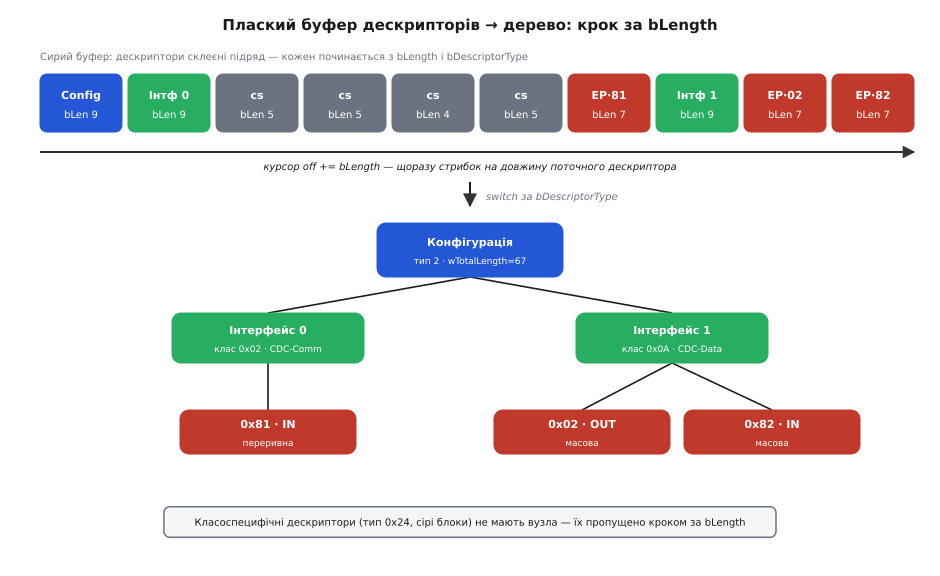

# ⚙️ Дескрипторний дамп у дерево: розбір за bLength

Коли хост запитує конфігурацію, пристрій віддає її одним сирим шматком: байти конфігурації, інтерфейсів і кінцевих точок склеєні підряд, без жодного вказівника, де що починається й що чому належить. Завдання цього коду — пройти такий плаский буфер **один раз** і відновити з нього дерево: яка конфігурація, які в ній інтерфейси, які точки висять на кожному. Це не вправа заради вправи — рівно цей розбір виконує кожен USB-стек на мікроконтролері, і на ньому ж спотикається кожен, хто вперше дивиться на дескрипторний дамп у логах.

## Що на вході

Візьмімо реальний буфер — конфігурацію віртуального COM-порту (клас CDC), 67 байтів. Ось ті самі байти, розкладені по дескрипторах: кожен рядок — один дескриптор, а перші два числа в ньому — завжди `bLength` (довжина) і `bDescriptorType` (рід).

```
09 02 43 00 02 01 00 80 32     Конфігурація   bLength=9,  тип 2;   wTotalLength=0x0043=67
09 04 00 00 01 02 02 01 00     Інтерфейс 0    bLength=9,  тип 4;   клас 0x02 (CDC-Comm)
05 24 00 10 01                 клас-специф.   bLength=5,  тип 0x24 (CS_INTERFACE)
05 24 01 00 01                 клас-специф.   bLength=5,  тип 0x24
04 24 02 02                    клас-специф.   bLength=4,  тип 0x24
05 24 06 00 01                 клас-специф.   bLength=5,  тип 0x24
07 05 81 03 08 00 FF           Точка 0x81     bLength=7,  тип 5;   переривна IN
09 04 01 00 02 0A 00 00 00     Інтерфейс 1    bLength=9,  тип 4;   клас 0x0A (CDC-Data)
07 05 02 02 40 00 00           Точка 0x02     bLength=7,  тип 5;   масова OUT
07 05 82 02 40 00 00           Точка 0x82     bLength=7,  тип 5;   масова IN
```

Пробіли й підписи ми додали для ока; у буфері немає ані переносів, ані меж — суцільний потік із 67 байтів. Розбити його на дескриптори й скласти дерево «конфігурація → інтерфейси → точки» — і є вся робота.

## Головна ідея: буфер сам себе розмічає

Придивімося до перших двох байтів кожного рядка. Перший — завжди `bLength`, довжина цього дескриптора в байтах. Другий — завжди `bDescriptorType`, що це за дескриптор. Це не збіг, а закон формату: **будь-який** USB-дескриптор, стандартний чи класоспецифічний, починається саме цими двома полями. А отже, нічого не знаючи наперед про конкретний дескриптор, ми завжди можемо відповісти на два питання — «якої він довжини» і «якого він роду».

Цих двох відповідей досить, щоб пройти весь буфер:

- **довжина** каже, де починається наступний дескриптор: додай `bLength` до поточного зсуву — і курсор стоїть рівно на першому байті наступного;
- **рід** каже, що з цим дескриптором робити: конфігурацію запам'ятати як корінь, інтерфейс — завести нову гілку, точку — нанизати на поточну гілку.

Формат, у якому кожен запис несе власну довжину й власний тип, називають **TLV** (type-length-value — тип-довжина-значення), і головна його чеснота саме тут: щоб перестрибнути запис, розуміти його не треба — досить знати, де він кінчається. Це й рятує нас від класоспецифічних дескрипторів, яких ми навіть не збираємося тлумачити.

Тонкість, яку варто побачити одразу: щоб зібрати дерево, нам **не потрібен стек**. Байти вже викладені в правильному порядку — спершу конфігурація, потім кожен інтерфейс, а одразу за ним його точки. Тобто це прямий (pre-order) обхід дерева, заздалегідь сплощений у стрічку. Уся пам'ять про «де ми в дереві» зводиться до одного вказівника — на **поточний інтерфейс**, той, на який зараз чіпляються точки. Зустріли новий інтерфейс — перевели вказівник; зустріли точку — доклали до того, куди вказує. Двох рівнів вкладеності й строгого порядку досить, щоб обійтися без рекурсії й без стеку.



*Плаский буфер угорі, дерево внизу — і між ними один рух. Курсор стрибає на `bLength` поточного дескриптора, диспетчер за `bDescriptorType` вирішує, куди його покласти: корінь-конфігурація, гілки-інтерфейси, листя-точки. Класоспецифічні дескриптори (сірі, тип 0x24) не мають вузла — їх просто перестрибнуто тією самою довжиною.*

## Робочий код

Домен диктує мову: байтовий розбір дескрипторів живе в прошивці, часто просто в перериванні, без купи й без алокацій — це C. Дерево складаємо у фіксовані масиви (на мікроконтролері `malloc` у гарячому шляху не роблять), а 16-бітні поля збираємо з байтів вручну — чому саме так, розберемо одразу після коду.

:::tabs
@tab C
```c
#include <stdint.h>
#include <stdio.h>

/* --- типи дескрипторів (поле bDescriptorType) --- */
enum {
    DESC_CONFIGURATION = 0x02,
    DESC_INTERFACE     = 0x04,
    DESC_ENDPOINT      = 0x05,
};

/* --- зібране дерево: фіксовані масиви, без malloc (як на МК) --- */
#define MAX_INTERFACES 8
#define MAX_ENDPOINTS  8

typedef struct {
    uint8_t  address;      /* bEndpointAddress: біт 7 — напрям, біти 3..0 — номер */
    uint8_t  attributes;   /* bmAttributes: біти 1..0 — тип передачі */
    uint16_t max_packet;   /* wMaxPacketSize */
    uint8_t  interval;     /* bInterval */
} endpoint_t;

typedef struct {
    uint8_t    number;       /* bInterfaceNumber */
    uint8_t    class_code;    /* bInterfaceClass */
    uint8_t    declared_eps;  /* bNumEndpoints — скільки точок ОБІЦЯНО */
    endpoint_t endpoints[MAX_ENDPOINTS];
    uint8_t    ep_count;      /* скільки реально нанизали */
} interface_t;

typedef struct {
    uint16_t    total_length;   /* wTotalLength із дескриптора конфігурації */
    uint8_t     num_interfaces; /* bNumInterfaces */
    interface_t interfaces[MAX_INTERFACES];
    uint8_t     if_count;
} config_tree_t;

/* 16-бітне little-endian поле, зібране з двох байтів.
   НЕ розіменовуємо (uint16_t*)(buf+off): поле лежить на довільному,
   часто непарному зсуві, а Cortex-M0 на невирівняному доступі падає. */
static uint16_t le16(const uint8_t *p) {
    return (uint16_t)(p[0] | (p[1] << 8));
}

/* Розбір буфера конфігурації у дерево.
   Повертає 0 при успіху, -1 при пошкодженому буфері. */
int parse_config(const uint8_t *buf, uint16_t len, config_tree_t *tree) {
    tree->if_count = 0;
    tree->total_length = 0;
    tree->num_interfaces = 0;
    interface_t *cur = NULL;    /* інтерфейс, на який зараз нанизуємо точки */

    uint16_t off = 0;
    while (off + 2u <= len) {                       /* треба хоча б bLength + bDescriptorType */
        uint8_t b_len  = buf[off];
        uint8_t b_type = buf[off + 1];

        if (b_len == 0) return -1;                  /* нульова довжина → вічний цикл */
        if ((uint32_t)off + b_len > len) return -1; /* дескриптор вилазить за буфер */

        switch (b_type) {
        case DESC_CONFIGURATION:
            if (b_len < 9) return -1;
            tree->total_length   = le16(buf + off + 2);
            tree->num_interfaces = buf[off + 4];
            break;

        case DESC_INTERFACE:
            if (b_len < 9) return -1;
            if (tree->if_count >= MAX_INTERFACES) return -1;
            cur = &tree->interfaces[tree->if_count++];
            cur->number       = buf[off + 2];
            cur->class_code   = buf[off + 5];
            cur->declared_eps = buf[off + 4];
            cur->ep_count     = 0;
            break;

        case DESC_ENDPOINT: {
            if (b_len < 7) return -1;
            if (cur == NULL) return -1;             /* точка раніше за свій інтерфейс */
            if (cur->ep_count >= MAX_ENDPOINTS) return -1;
            endpoint_t *ep = &cur->endpoints[cur->ep_count++];
            ep->address    = buf[off + 2];
            ep->attributes = buf[off + 3];
            ep->max_packet = le16(buf + off + 4);
            ep->interval   = buf[off + 6];
            break;
        }

        default:
            /* класоспецифічний (0x24/0x25) або невідомий — просто крокуємо далі */
            break;
        }

        off += b_len;   /* КЛЮЧОВИЙ КРОК: рухаємось на довжину поточного дескриптора */
    }
    return 0;
}

/* --- друк зібраного дерева --- */
static const char *xfer(uint8_t attr) {
    switch (attr & 0x03u) {
    case 0:  return "контрольна";
    case 1:  return "ізохронна";
    case 2:  return "масова";
    default: return "переривна";
    }
}

static void dump_tree(const config_tree_t *t) {
    printf("Конфігурація: wTotalLength=%u, інтерфейсів=%u\n",
           t->total_length, t->num_interfaces);
    for (uint8_t i = 0; i < t->if_count; i++) {
        const interface_t *f = &t->interfaces[i];
        printf("  Інтерфейс %u  клас 0x%02X  точок: %u (обіцяно %u)\n",
               f->number, f->class_code, f->ep_count, f->declared_eps);
        for (uint8_t j = 0; j < f->ep_count; j++) {
            const endpoint_t *e = &f->endpoints[j];
            printf("    Точка 0x%02X  %-3s  %s  wMaxPacketSize=%u\n",
                   e->address,
                   (e->address & 0x80u) ? "IN" : "OUT",
                   xfer(e->attributes),
                   e->max_packet);
        }
    }
}

/* Сирий дамп конфігурації віртуального COM-порту (CDC-ACM), 67 байтів. */
static const uint8_t raw[] = {
    /* Конфігурація (9): wTotalLength=0x0043=67, 2 інтерфейси, 100 мА */
    0x09,0x02, 0x43,0x00, 0x02, 0x01, 0x00, 0x80, 0x32,
    /* Інтерфейс 0 (9): CDC-Communications, клас 0x02 */
    0x09,0x04, 0x00, 0x00, 0x01, 0x02, 0x02, 0x01, 0x00,
    /* 4 класоспецифічні дескриптори CDC (тип CS_INTERFACE = 0x24) */
    0x05,0x24, 0x00, 0x10,0x01,          /* Header */
    0x05,0x24, 0x01, 0x00, 0x01,         /* Call Management */
    0x04,0x24, 0x02, 0x02,               /* Abstract Control Management */
    0x05,0x24, 0x06, 0x00, 0x01,         /* Union */
    /* Точка 0x81 (7): переривна IN, wMaxPacketSize=8 */
    0x07,0x05, 0x81, 0x03, 0x08,0x00, 0xFF,
    /* Інтерфейс 1 (9): CDC-Data, клас 0x0A */
    0x09,0x04, 0x01, 0x00, 0x02, 0x0A, 0x00, 0x00, 0x00,
    /* Точка 0x02 (7): масова OUT, wMaxPacketSize=64 */
    0x07,0x05, 0x02, 0x02, 0x40,0x00, 0x00,
    /* Точка 0x82 (7): масова IN, wMaxPacketSize=64 */
    0x07,0x05, 0x82, 0x02, 0x40,0x00, 0x00,
};

int main(void) {
    config_tree_t tree;
    if (parse_config(raw, (uint16_t)sizeof raw, &tree) != 0) {
        printf("пошкоджений дескриптор\n");
        return 1;
    }
    dump_tree(&tree);
    return 0;
}
```
@tab C++
```cpp
#include <cstdint>
#include <iostream>
#include <optional>
#include <span>
#include <string_view>
#include <vector>

enum class DescType : uint8_t {
    Configuration = 0x02,
    Interface     = 0x04,
    Endpoint      = 0x05,
};

struct Endpoint {
    uint8_t  address;      // bEndpointAddress: біт 7 — напрям, біти 3..0 — номер
    uint8_t  attributes;   // bmAttributes: біти 1..0 — тип передачі
    uint16_t max_packet;   // wMaxPacketSize
    uint8_t  interval;     // bInterval
};

struct Interface {
    uint8_t               number;
    uint8_t               class_code;
    uint8_t               declared_eps;
    std::vector<Endpoint> endpoints;
};

struct ConfigTree {
    uint16_t               total_length{0};
    uint8_t                num_interfaces{0};
    std::vector<Interface> interfaces;
};

static uint16_t le16(const uint8_t *p) {
    return static_cast<uint16_t>(p[0] | (static_cast<uint16_t>(p[1]) << 8));
}

std::optional<ConfigTree> parse_config(std::span<const uint8_t> buf) {
    ConfigTree tree;
    Interface *cur = nullptr;

    size_t off = 0;
    while (off + 2 <= buf.size()) {
        uint8_t b_len  = buf[off];
        uint8_t b_type = buf[off + 1];

        if (b_len == 0 || off + b_len > buf.size()) {
            return std::nullopt;
        }

        switch (static_cast<DescType>(b_type)) {
        case DescType::Configuration:
            if (b_len < 9) return std::nullopt;
            tree.total_length   = le16(&buf[off + 2]);
            tree.num_interfaces = buf[off + 4];
            break;

        case DescType::Interface:
            if (b_len < 9) return std::nullopt;
            tree.interfaces.push_back({
                .number       = buf[off + 2],
                .class_code   = buf[off + 5],
                .declared_eps = buf[off + 4],
                .endpoints    = {}
            });
            cur = &tree.interfaces.back();
            break;

        case DescType::Endpoint: {
            if (b_len < 7 || cur == nullptr) return std::nullopt;
            cur->endpoints.push_back({
                .address    = buf[off + 2],
                .attributes = buf[off + 3],
                .max_packet = le16(&buf[off + 4]),
                .interval   = buf[off + 6]
            });
            break;
        }

        default:
            break;
        }

        off += b_len;
    }
    return tree;
}

static std::string_view xfer(uint8_t attr) {
    switch (attr & 0x03u) {
    case 0:  return "контрольна";
    case 1:  return "ізохронна";
    case 2:  return "масова";
    default: return "переривна";
    }
}

void dump_tree(const ConfigTree &t) {
    std::cout << "Конфігурація: wTotalLength=" << t.total_length
              << ", інтерфейсів=" << static_cast<int>(t.num_interfaces) << "\n";
    for (const auto &f : t.interfaces) {
        std::cout << "  Інтерфейс " << static_cast<int>(f.number)
                  << "  клас 0x" << std::hex << static_cast<int>(f.class_code) << std::dec
                  << "  точок: " << f.endpoints.size()
                  << " (обіцяно " << static_cast<int>(f.declared_eps) << ")\n";
        for (const auto &e : f.endpoints) {
            std::cout << "    Точка 0x" << std::hex << static_cast<int>(e.address) << std::dec
                      << "  " << ((e.address & 0x80u) ? "IN " : "OUT")
                      << "  " << xfer(e.attributes)
                      << "  wMaxPacketSize=" << e.max_packet << "\n";
        }
    }
}

static constexpr uint8_t raw[] = {
    0x09,0x02, 0x43,0x00, 0x02, 0x01, 0x00, 0x80, 0x32,
    0x09,0x04, 0x00, 0x00, 0x01, 0x02, 0x02, 0x01, 0x00,
    0x05,0x24, 0x00, 0x10,0x01,
    0x05,0x24, 0x01, 0x00, 0x01,
    0x04,0x24, 0x02, 0x02,
    0x05,0x24, 0x06, 0x00, 0x01,
    0x07,0x05, 0x81, 0x03, 0x08,0x00, 0xFF,
    0x09,0x04, 0x01, 0x00, 0x02, 0x0A, 0x00, 0x00, 0x00,
    0x07,0x05, 0x02, 0x02, 0x40,0x00, 0x00,
    0x07,0x05, 0x82, 0x02, 0x40,0x00, 0x00,
};

int main() {
    auto tree = parse_config(raw);
    if (!tree) {
        std::cout << "пошкоджений дескриптор\n";
        return 1;
    }
    dump_tree(*tree);
    return 0;
}
```
:::

Запустивши це, дістаємо саме те дерево, яке пообіцяв дамп:

```
Конфігурація: wTotalLength=67, інтерфейсів=2
  Інтерфейс 0  клас 0x02  точок: 1 (обіцяно 1)
    Точка 0x81  IN   переривна  wMaxPacketSize=8
  Інтерфейс 1  клас 0x0A  точок: 2 (обіцяно 2)
    Точка 0x02  OUT  масова  wMaxPacketSize=64
    Точка 0x82  IN   масова  wMaxPacketSize=64
```

Серце всього — один рядок: `off += b_len`. Він і робить прохід проходом: хоч який дескриптор під курсором, зрозумілий чи ні, ми зсуваємось рівно на його довжину й опиняємось на початку наступного. Диспетчер `switch` тим часом вирішує, що покласти в дерево, а `default` мовчки пропускає все, чого ми не знаємо.

> 🔧 **Навіщо це.** Ці кількадесят рядків розберуть конфігурацію **будь-якого** пристрою — миші, флешки, камери, — а не лише нашого COM-порту. Бо вони спираються тільки на два універсальні поля, `bLength` і `bDescriptorType`, і ні на що зі специфіки конкретного виробу. Саме тому один і той самий код у стеку хоста читає геть різне залізо, а один і той самий код у прошивці вміє віддавати власні дескриптори: весь формат самоопису тримається на тому, що розбірник ніколи не мусить знати наперед, що саме він розбирає.

## Складність і пастки

Прохід лінійний: кожен байт буфера читається один раз, робота на дескриптор стала, тож час — O(n) від довжини буфера. Додаткової пам'яті поза самим деревом — O(1): ні рекурсії, ні стеку, лише один вказівник `cur`. Це найдешевший з можливих розборів, і саме тому USB-стеки роблять його навіть на найслабших контролерах. Уся хитрість не в алгоритмі — вона в пастках, кожна з яких колись комусь коштувала години в дебагері.

**wTotalLength — це межа циклу, а не сума на око.** Хост читає конфігурацію у два заходи: спершу просить перші 9 байтів (сам дескриптор конфігурації), дізнається з поля `wTotalLength` повний розмір усього дерева — і аж тоді просить рівно стільки байтів. Через це межа нашого циклу — **кількість байтів** (`len`), а не кількість інтерфейсів чи точок. Спокуса крокувати «доки не набрав `bNumInterfaces` інтерфейсів» веде в яму: за останнім інтерфейсом можуть іти ще дескриптори, і ви їх втратите. `wTotalLength` — єдине авторитетне число; `bNumInterfaces` і `bNumEndpoints` — лише підказки для звірки (ми тримаємо `declared_eps` поруч із фактичним `ep_count` саме щоб зловити розбіжність). І навпаки — не можна сліпо вірити самому `wTotalLength`: якщо пристрій набрехав більше, ніж реально прислав, читати треба по меншому з двох чисел, інакше вийдемо за буфер.

**Класоспецифічні дескриптори між стандартними.** Між інтерфейсом 0 і його єдиною точкою в нашому дампі сидять чотири дескриптори типу `0x24` — це функціональні дескриптори CDC, якими клас доповнює стандартний опис. Наївний розбір, збудований на припущенні «за інтерфейсом одразу йдуть його точки», на них ламається: він або прийме класоспецифічний байт за початок точки, або спіткнеться, не знайшовши очікуваного. Наш `switch` із `default`, що просто крокує за `bLength`, ковтає їх без жодного зусилля — бо, знову ж таки, щоб перестрибнути дескриптор, розуміти його не треба. Це не дрібниця формату: класоспецифічні вставки є майже в кожного реального пристрою (HID, Audio, CDC), і розбірник, який їх не переживає, не переживе й першої підключеної флешки.

**Нульовий bLength — захист від вічного циклу.** Уся хода тримається на `off += b_len`. А якщо `b_len` дорівнює нулю? Курсор не зрушить — і цикл крутитиметься вічно на тому самому місці. У прошивці це не «завис застосунок», а завислий контролер: у кращому разі спрацює сторожовий таймер і пристрій перезавантажиться посеред роботи, у гіршому — тихо помре гілка, що обслуговує USB. Один рядок `if (b_len == 0) return -1;` прибирає цілий клас відмов від пошкодженого чи зловмисного дескриптора. Поруч — та сама сім'я перевірок: дескриптор, чия оголошена довжина вилазить за кінець буфера, теж мусить обірвати розбір, а не читати чужу пам'ять (це наш другий guard, `off + b_len > len`).

**Вирівнювання й порядок байтів.** Поля `wTotalLength` і `wMaxPacketSize` — 16-бітні, і лежать вони на довільних зсувах: `wTotalLength` — на зсуві 2, `wMaxPacketSize` точки — усередині сьомого байта свого дескриптора. Звідси дві окремі пастки. Перша — **порядок байтів**: USB кладе 16-бітні поля молодшим байтом уперед (little-endian), тож зібрати число можна лише як `p[0] | (p[1] << 8)`, а не навпаки; це загальне правило [порядку байтів](topic:hw-arch/endianness), і USB закріплює його раз і назавжди — саме щоб дамп читався однаково на будь-якому процесорі. Друга — **вирівнювання**: спокусливо написати `*(uint16_t*)(buf + 2)` замість збирання з байтів, але `buf + 2` може виявитися непарною адресою, а чимало процесорів (зокрема Cortex-M0/M0+) на невирівняному 16-бітному читанні дають виняток і падають; де не падають — читають повільніше. Збирання з окремих байтів не має ні того, ні того ґанджу: воно завжди коректне незалежно від адреси. Це вже [властивість вирівнювання даних](topic:sf-apps/memory-alignment), про яку USB-формат подбав наперед — спакувавши всі поля щільно й без набивки, щоб отакий байтовий розбірник працював усюди однаково.
