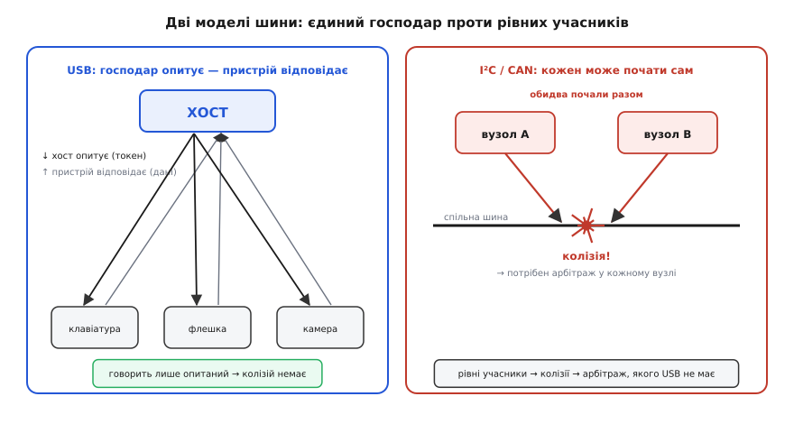
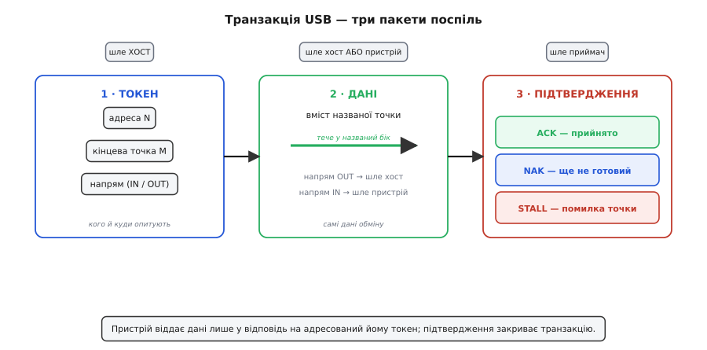
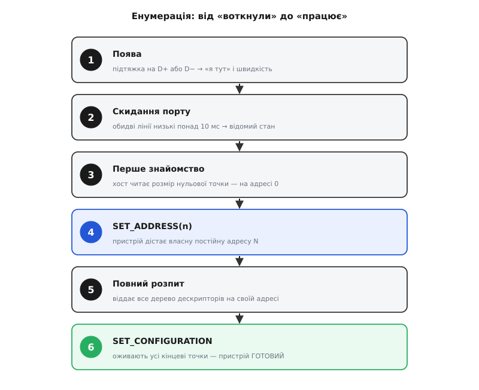

# Пристрій на шині USB: хост, енумерація, кінцеві точки, класи

<preknowlist>
- [Диференційна пара](root:com-medium/differential-pair) — біт передають різницею двох протифазних дротів; саме такою парою D+/D− USB несе кожен свій біт.
- [Шина I²C](root:com-devices/i2c-bus) — шина з адресами й ведучим, де учасники самі починають обмін; відправна точка, з якою весь час порівнюватимемо host-модель USB.
</preknowlist>

До того самого прямокутного гнізда ви втикаєте клавіатуру, флешку, вебкамеру й принтер — чотири пристрої, що всередині не мають між собою майже нічого спільного. Клавіатура шле кілька байтів на натиск і надовго замовкає. Флешка перекачує гігабайти без права загубити хоч байт. Камера ллє рівний потік кадрів, де важлива не цілість кожного пікселя, а сталий темп. Принтер ковтає сторінку й теж надовго замовкає. Природа трафіку геть різна — а гніздо одне, і кожен із цих пристроїв оживає тієї ж миті, коли вставлений: без диска з драйвером, без перемикачів адреси, без перемичок.

Порівняймо це з рештою шин того самого сімейства. [I²C](root:com-devices/i2c-bus) вимагає наперед знати семибітну адресу кожної мікросхеми, інакше ви до неї не достукаєтесь. [SPI](root:com-devices/spi-bus) — тягти окрему лінію вибору кристала до кожного веденого. [CAN](root:com-devices/can-arbitration) — щоб кожен вузол умів побітово змагатися за право говорити. USB (Universal Serial Bus — універсальна послідовна шина) не вимагає нічого з цього: воткнув — працює, причому будь-що з-поміж тисяч геть різних пристроїв. Звідки така різниця?

Уся вона виростає з **двох рішень**, ухвалених ще на етапі проєктування, і решта статті — лише їхні наслідки, розкладені до дна. Перше: на шині USB рівних немає — усім і завжди керує єдиний **хост**. Друге: пристрій **сам себе описує** стандартною мовою, а стандартні категорії пристроїв дозволяють одному драйверові обслужити тисячі різних виробів. З першого рішення випливає вся механіка обміну — топологія, адреси, опитування, кінцеві точки. З другого — енумерація, дескриптори, класи. Візьмімо обидва по черзі й доведімо кожен наслідок до кінця.

## Один господар шини — і чому решта пристроїв мовчать

**Хост** (host — господар) ініціює на шині абсолютно все. Пристрій лише відповідає: він ніколи не говорить першим, не «стукає» в хост, не оголошує сам, що має дані напоготові. На перший погляд це жорстке обмеження — а насправді воно одним рухом прибирає цілий клас проблем, які мучать усі інші шини.

Придивімося, який саме клас. На [I²C](root:com-devices/i2c-bus) або [CAN](root:com-devices/can-arbitration) кілька учасників рівноправні: кожен може сам захотіти почати передачу. А якщо двоє захочуть одночасно, їхні сигнали накладуться на спільних дротах і зіпсують одне одного — це **колізія**. Щоб її пережити, потрібен **арбітраж**: домовлений спосіб вирішити, хто з двох поступиться. I²C і CAN мають хитрий побітовий арбітраж, де той, хто виставив «домінантний» рівень, перемагає, а програвший мовчки відступає й пробує пізніше. Це працює, але коштує складності в кожному вузлі: кожен мусить весь час слухати шину, порівнювати те, що чує, з тим, що передає, і вміти відступити посеред кадру.

USB прибирає це в корені. Якщо ніхто не має права заговорити без явного дозволу хоста, то двоє не заговорять одночасно **в принципі** — отже, колізій не буває взагалі, і арбітраж просто не потрібен. Пристроєві не треба слухати шину в очікуванні чужих передач; він мовчить, доки хост не звернеться особисто до нього. Уся логіка розв'язання конфліктів, яку інші шини несуть у кожному вузлі, тут зникає — бо конфлікту не може виникнути за побудовою.

З цього випливає риса, яку варто засвоїти твердо, бо на ній тримається розуміння всієї прошивки USB-пристрою: **пристрій реактивний**. Він не може «надіслати» дані в комп'ютер за власним бажанням. Навіть коли в нього є що сказати — байт від клавіші, порція з камери, — він лише кладе ці дані у свій буфер і **чекає**, доки хост сам прийде й забере. Натиснута клавіша не летить у ПК; вона лежить у буфері мікросхеми клавіатури, аж поки хост, у своєму власному ритмі, не опитає її й не витягне.



*Одна асиметрія відрізняє USB від сусідів по сімейству. Господар опитує — пристрій відповідає, і двоє ніколи не говорять разом. У рівноправних I²C та CAN кожен учасник може почати обмін сам, тому там неминучі колізії й потрібен арбітраж, якого USB просто не має.*

> 🔧 **Навіщо це.** Реактивність пристрою — не абстракція, а щоденний факт розробки. Коли ви пишете прошивку USB-пристрою (скажімо, віртуального COM-порту для логів), ви не «відправляєте» рядок у термінал — ви кладете його в чергу кінцевої точки, і він піде на хост лише тоді, коли той наступного разу опитає цю точку. Тому логи можуть «застрягати», якщо хост зайнятий або порт ніхто не відкрив: пристроєві нема кому їх віддати. І навпаки — реалізувати пристрій набагато простіше, ніж хост: пристрій тільки відповідає на запити, а от [мікроконтролер у ролі хоста](root:com-devices/usb-host) мусить сам вести всю шину, і складність там на порядок вища.

## Дерево, а не шина: хаби й адресний простір

Слово «шина» в назві збиває з пантелику. Класична шина — це спільний дріт, до якого всі підключені паралельно, як I²C. USB усередині влаштований інакше: це **дерево**, точніше — ярусно-зіркова структура. Чому дерево, а не спільний дріт? Бо спільний дріт повертає нас до колізій: усі чують усіх, і треба знову вирішувати, хто говорить. Дерево з єдиним коренем-хостом дозволяє кожному відрізку дротів бути окремою двоточковою лінією «батько — дитина», де господар відрізка завжди один. Це та сама асиметрія, тільки тепер розкладена по всій топології.

Корінь дерева — хост із одним чи кількома кореневими портами. Від нього ростуть гілки через **хаби** (hub — вузол, розгалужувач). Хаб — сам звичайний USB-пристрій особливого класу: він бере одне з'єднання зверху й розгалужує його на кілька портів донизу, а хостові переповідає, що на цих портах з'являється чи зникає. Листя дерева — це кінцеві пристрої: миша, флешка, камера. [Внутрішня будова хаба](root:com-devices/usb-hub) — окрема тема; тут досить знати, що він розмножує один порт у кілька й сам займає місце на шині, як будь-хто інший.

З дерева з єдиним коренем випливає важлива річ: **листя не бачать одне одного**. Увесь трафік іде через хост. Флешка не може надіслати пакет камері напряму — тільки через хост, і лише якщо той це організує. Це знову та сама централізація: господар не просто головний, він ще й єдиний перехрестя, крізь яке проходить кожен байт.

Скільки пристроїв уміщається в таке дерево? Хост звертається до кожного за **адресою**, а поле адреси в пакеті має сім бітів. Сім бітів — це числа від 0 до 127, але нульова адреса службова (про неї — далі, в енумерації), тож реально доступні адреси з 1 по 127. Звідси знаменита стеля: **до 127 пристроїв на одну шину**. Углиб дерево обмежене приблизно сімома ярусами хабів — обмеження не адресне, а часове: сигнал і його відлуння встигають пробігти ланцюжок кабелів і хабів лише до певної глибини, доки не порушиться тайминг. Важливо не плутати адреси з фізичними гніздами: одного USB-порту ноутбука цілком досить, щоб через ланцюжок хабів обслуговувати десятки пристроїв — усі вони діляться тими самими 127 адресами.

## Час, нарізаний на кадри: токен, дані, підтвердження

Ми сказали «хост опитує пристрій». Тепер розберімо, як саме це відбувається на дротах — бо тут живе вся конкретика провідного обміну. Хост не лише роздає команди; він ще й **задає темп**. Час на шині нарізаний на однакові проміжки — **кадри** (frame): на Full-Speed це 1 мілісекунда, на High-Speed кадр ділиться ще на вісім мікрокадрів по 125 мікросекунд. Хост шле сигнал початку кожного кадру, і весь трафік укладається в цей ритм. Такий поділ часу — фундамент: він дозволяє хостові планувати, кому й коли дістанеться шина, і саме на ньому тримаються гарантії для різних типів даних, про які нижче.

Усередині кадру обмін іде не суцільним потоком, а окремими **транзакціями**, і кожна транзакція складається з трьох кроків — трьох пакетів поспіль.

Перший — **токен** (token — жетон). Це пакет, який шле лише хост, і в ньому записано три речі: адреса пристрою, номер кінцевої точки всередині нього й **напрям** передачі. Токен — це і є «опитування»: хост оголошує на всю шину «зараз розмова з пристроєм номер N, кінцевою точкою M, і дані підуть ось у цей бік». Усі пристрої чують токен, але відгукується лише той, чия адреса названа; решта мовчать далі.

Другий крок — **дані**. Хто їх шле, залежить від напряму в токені. Якщо напрям «до пристрою» — дані шле хост слідом за токеном. Якщо «від пристрою» — тепер, отримавши дозвіл, говорить пристрій: він викладає вміст названої кінцевої точки. Зверніть увагу, як акуратно це обходить колізії: пристрій передає не коли захотів, а рівно у відповідь на адресований йому токен, тобто у виділену йому хостом мить.

Третій крок — **підтвердження** (handshake). Сторона, що прийняла дані, каже одним коротким пакетом, як усе минуло: `ACK` — прийняв справно; `NAK` — «зараз не можу, нема даних / буфер зайнятий, спитай пізніше»; `STALL` — «щось не так, кінцева точка в помилковому стані». Ось де реактивність пристрою стає механізмом: `NAK` — це єдиний спосіб для пристрою сказати «почекай». Він не може відкласти опитування чи попросити хоста прийти згодом — він лише відповідає `NAK` на кожен передчасний токен, аж доки дані не будуть готові, і тоді на черговий токен нарешті віддасть їх з `ACK`. Хост опитує знову й знову; пристрій відмовляє, доки не готовий.



*Кожен обмін — три кроки. Хост завжди починає токеном, де названо адресу, кінцеву точку й напрям. Дані течуть у названий бік — від хоста чи від пристрою. Приймач закриває транзакцію коротким підтвердженням: ACK (прийнято), NAK (ще не готовий, спитай пізніше) або STALL (помилка). Пристрій говорить лише тоді, коли токен це дозволив.*

Це — логічний бік обміну. Як самі біти цих пакетів лягають на пару D+/D− (кодування без окремої лінії такту, вставлення бітів для утримання синхронізації), розібрано на [фізичному рівні USB](root:com-devices/usb-physical); докладніше про будову й типи пакетів — у [статті про протокольний рівень](root:com-devices/usb-protocol-layer). Тут для нас головне — сам каркас: хост опитує токеном, дані йдуть у названий бік, підтвердження закриває транзакцію, і все це вкладено в нарізаний на кадри час.

## Кінцеві точки: буфери, які опитує хост

Токен називає не просто пристрій, а конкретну **кінцеву точку** (endpoint) всередині нього. Що це таке? Найточніше — це адресований буфер: джерело або приймач даних у пристрої, з яким хост веде окрему розмову. Пристрій — не одна суцільна поштова скринька, а кілька пронумерованих кінцевих точок, і хост опитує кожну зі своїм ритмом і призначенням.

Тут криється тонкість, на якій ламаються початківці: **напрям кінцевої точки називають з погляду хоста**, а не пристрою. `IN` означає «в бік хоста» (пристрій → хост), `OUT` — «з хоста» (хост → пристрій). Тож `IN`-точка клавіатури — та, звідки хост *забирає* натиски, хоча для самої клавіатури це вихід. Ця умовність єдина на всю шину саме тому, що хост — центр відліку: він господар, отже й напрями рахують від нього. Кожна кінцева точка однонапрямна: або `IN`, або `OUT`; двобічний обмін — це просто пара точок з тим самим номером, але різним напрямом.

Одна кінцева точка особлива й обов'язкова для всіх — **нульова** (endpoint 0). Вона двонапрямна й існує ще до будь-якого налаштування пристрою; саме через неї хост знайомиться з пристроєм під час увімкнення. Це «парадні двері», крізь які завжди можна достукатися, навіть коли пристрій ще безадресний і нічого про себе не розповів. Решта кінцевих точок оживають пізніше, коли хост налаштує пристрій.

Тепер — навіщо їх узагалі кілька типів. Пригадаймо чотири різні пристрої з початку: у них принципово різні вимоги до трафіку. Клавіші треба доставити швидко, але їх мало. Файл — без жодної втрати, але без поспіху. Звук — рівним темпом, і хай радше загубиться порція, ніж усе застопориться на її перепередачі. Одна дисципліна обміну не задовольнить усіх, тож USB пропонує **чотири типи передач**, і кожна кінцева точка при народженні оголошує свій. Хост планує кадр так, щоб виконати обіцянку кожного типу.

**Контрольна** (control) передача — службова й найнадійніша. Нею йде саме знайомство з пристроєм і команди керування; вона завжди двобічна, з перевіркою й гарантованою доставкою. Нульова точка — завжди контрольна. Це фундамент, на якому стоїть решта: доки контрольний канал не відпрацював, інші типи навіть не існують.

**Переривна** (interrupt) — для дрібних термінових порцій із обмеженою затримкою: клавіатури, миші, сенсори. Назва оманлива: жодного апаратного переривання тут нема. Пристрій не може перервати хоста — той сам опитує таку точку регулярно, скажімо, раз на кожні кілька кадрів, і забирає порцію, якщо вона є. «Переривність» — це гарантія, що хост навідається не рідше за обіцяний період, тож затримка натиску клавіші зверху обмежена. Пристрій просить бажаний період в описі точки, а хост опитує з цим інтервалом.

**Масова** (bulk) — для великих обсягів без терміну, зате з гарантією цілості: накопичувачі, принтери. Масовій точці не обіцяють ані миті, ані смуги — хост возить її дані **вільною смугою**, тим, що лишилося в кадрі після термінових типів. Зате доставку гарантовано: зіпсовану порцію перепередадуть, флешка не втратить байта. Коли шина зайнята, масовий обмін просто сповільнюється; коли вільна — летить на повній.

**Ізохронна** (isochronous — від гр. *isos* + *chronos*, рівночасний) — для потоку, де важливий рівний темп, а не цілість кожного байта: звук, відео. Це дзеркало масової. Ізохронній точці хост **резервує смугу наперед**, у кожному кадрі виділяючи їй місце, — але **не перепередає** втрачене. Якщо порція зіпсувалася, її просто пропускають: у звуці клац на мілісекунду краще, ніж заїкання, що наздоганяє себе перепередачею. Тут своя рація — вчасно важливіше за точно.

> **Підпис-умова: скільки кадру резервує стереозвук 48 кГц ізохронним потоком на Full-Speed**
>
> ```
> потік даних = 48000 відліків/с × 2 канали × 2 байти = 192000 байт/с
> кадр Full-Speed = 1 мс  →  на кадр припадає 192000 / 1000 = 192 байти
> місткість кадру FS = 12 Мбіт/с = 1 500 000 байт/с × 1 мс ≈ 1500 байт
> частка кадру = 192 / 1500 ≈ 0.128 = 12.8 %
> ```
>
> Хост резервує ці ~13 % кожного кадру під звук ще на етапі налаштування. Якщо вільної смуги на момент підключення бракує (кадр уже забитий іншими ізохронними потоками), хост просто **відмовить** у конфігурації цієї точки — і камера чи звукова карта не запустяться. Ось що таке «гарантована смуга»: не обіцянка встигнути, а фізично зарезервоване місце в кожному кадрі, яке або є, або пристрій не працює.

Отже, чотири типи — це чотири різні контракти між хостом і кінцевою точкою: контрольна — надійність службового каналу, переривна — обмежена затримка, масова — цілість без термінів, ізохронна — темп без гарантії цілості. Пристрій вибирає для кожної своєї точки той контракт, що пасує її трафікові. Глибше про те, як хост ділить кадр між типами й скільки точок може мати пристрій, — у [статті про кінцеві точки](root:com-devices/usb-endpoints).

> 🔧 **Навіщо це.** Вибір типу передачі — одне з перших рішень при проєктуванні пристрою, і помилка тут дорога. Поставите звук масовою точкою — отримаєте гарантію цілості, якої не просили, ціною рваного темпу під навантаженням. Поставите файлову передачу ізохронною — загубите байти на завантаженій шині. А ще ізохронні й переривні точки резервують смугу, тож на завантаженому хабі новий пристрій може взагалі не сконфігуруватися — не тому, що несправний, а тому, що вільної смуги в кадрі вже нема.

## Як пристрій потрапляє на шину: енумерація

Ми весь час казали «хост звертається до пристрою за адресою». Але звідки береться адреса, і звідки хост знає, які в пристрою кінцеві точки й чого він узагалі хоче? Коли пристрій щойно ввімкнули, хост не знає про нього нічого. Процедуру знайомства, у якій хост дає пристроєві адресу й розпитує, хто він, називають **енумерацією** (enumeration — перелічення, переписування). Це той самий момент «воткнув — працює», розкладений на кроки. Пройдімо його по порядку, бо кожен крок відповідає на попереднє «звідки хост це знає».

**Крок 1. Поява.** Спершу пристрій має заявити про себе фізично. Він підмикає резистор-підтяжку на одну з ліній даних до живлення: на D+ — якщо працює на Full-Speed, на D− — якщо на Low-Speed. Доти хост тримав обидві лінії низькими й бачив «порожньо»; підтягнута лінія — це сигнал «я тут», і водночас **на якій лінії** вона підтягнута, каже хостові швидкість пристрою. У [роз'ємі USB-C](root:com-devices/usb-c-connector) це відбувається аж після того, як через лінії CC узгоджено живлення й на VBUS з'явилося 5 В: пристрій прокидається, вмикає свій контролер — і той вішає підтяжку.

**Крок 2. Скидання.** Помітивши появу, хост **скидає** порт: тримає обидві лінії даних низькими понад 10 мілісекунд. Це наказ «забудь усе, стань у відомий початковий стан». Після скидання пристрій відгукується лише на **нульову адресу** й лише через нульову кінцеву точку. Ось навіщо адреса 0 службова: це стартова адреса, яку має щойно ввімкнений пристрій, ще безіменний. Саме тому на шині за раз можна енумерувати лише один новий пристрій — двоє з адресою 0 відгукнулися б разом; хаби для того й тримають нові порти, доки хост не займеться кожним по черзі.

**Крок 3. Перше знайомство.** Хост читає початок головного дескриптора пристрою через нульову точку. Найперше йому потрібне одне число — максимальний розмір пакета нульової точки: без нього хост не знає, якими порціями можна вести з нею контрольний обмін. Це знайомство йде на адресі 0.

**Крок 4. Видача адреси.** Хост шле команду `SET_ADDRESS(n)` — і пристрій приймає унікальну адресу, під якою й житиме на шині до від'єднання. З цієї миті адреса 0 знову вільна для наступного новачка, а наш пристрій відгукується вже на свій номер.

**Крок 5. Повний розпит.** Тепер, на власній адресі, пристрій віддає хостові весь свій опис — дерево дескрипторів: що він таке, скільки струму просить, які має інтерфейси й кінцеві точки, до якого класу належить, як зветься людською мовою.

**Крок 6. Налаштування.** З опису хост дізнається, які **конфігурації** пропонує пристрій, обирає одну й шле `SET_CONFIGURATION`. Оце і є вмикання: доти жили лише нульова точка й сама адреса, а тепер оживають усі інші кінцеві точки, і пристрій дістає повний дозволений струм. Пристрій вважається **сконфігурованим** — відтепер він придатний до роботи. Далі операційна система за класом чи ідентифікаторами добирає драйвер — і пристрій з'являється в системі як миша, диск чи порт.



*Шлях від «воткнули» до «працює» — це діалог хоста й пристрою. Пристрій заявляє про себе підтяжкою, хост скидає його до відомого стану, знайомиться на службовій адресі 0, видає постійну адресу, вичитує повний опис і врешті командою конфігурації оживляє всі кінцеві точки. Аж тоді операційна система добирає драйвер.*

Уся ця розмова йде контрольними передачами через нульову точку, а її команди — `SET_ADDRESS`, `GET_DESCRIPTOR`, `SET_CONFIGURATION` та решта — стандартизовані до останнього байта; їхній точний формат і поля зведено в [довідці стандартних запитів](root:com-devices/usb-device-basics/api-standard-requests.md). Байтова розкладка самих дескрипторів і код прошивки, що на ці запити відповідає, — предмет [окремої статті про енумерацію](root:com-devices/usb-enumeration).

## Пристрій, що описує себе: дерево дескрипторів

Тепер — про друге з двох наріжних рішень. Щоб хост зміг увімкнути будь-який пристрій без наперед встановленого драйвера, пристрій мусить **сам себе описати** мовою, яку хост розуміє ще до того, як довідався, що це за виріб. Ця мова — **дескриптори** (descriptor — опис): невеликі структури даних із жорстко визначеними полями, які пристрій віддає на запит хоста. Це самопаспорт, оформлений за єдиним для всієї галузі зразком.

Дескриптори не пласкі — вони складаються в **дерево**, і форма дерева повторює будову пристрою.

Угорі — **дескриптор пристрою** (device descriptor). Він один. У ньому — ідентифікатори виробника й продукту (VID і PID, за якими система впізнає конкретну модель), версія USB, максимальний розмір нульової точки й кількість конфігурацій. Це «титульна сторінка».

Нижче — **дескриптори конфігурації** (configuration descriptor). Конфігурація — це цілісний режим пристрою: скільки струму він у ньому споживає, живиться від шини чи від власного джерела, скільки має інтерфейсів. Зазвичай конфігурація одна, але їх може бути кілька — наприклад, «економний» і «повний» режими, — і хост вибирає одну командою `SET_CONFIGURATION`, якою й завершується енумерація.

Усередині конфігурації — **дескриптори інтерфейсів** (interface descriptor). Ось ключове поняття: **інтерфейс — це одна функція пристрою**. Саме інтерфейс несе **код класу** (про класи — далі), тобто каже «ця функція поводиться як клавіатура» чи «як накопичувач». Один фізичний пристрій може мати кілька інтерфейсів — і тоді це **композитний** (composite — складений) пристрій, що виглядає для системи як кілька приладів одразу, хоч сидить на одній адресі й одному з'єднанні. Мікроконтролер, наприклад, здатний водночас бути віртуальним COM-портом і клавіатурою: два інтерфейси в одній конфігурації, для кожного система вантажить свій драйвер.

У самому низу — **дескриптори кінцевих точок** (endpoint descriptor). Кожен належить своєму інтерфейсові й описує одну кінцеву точку: її номер і напрям (той самий `IN`/`OUT` з погляду хоста), тип передачі (контрольна/переривна/масова/ізохронна), максимальний розмір пакета, а для переривних та ізохронних — бажаний період опитування. Нульова точка в це дерево не входить: вона є завжди й описана в дескрипторі пристрою одним числом.

Побачмо дерево на живому прикладі — віртуальному COM-порті (клас CDC, найпоширеніший спосіб віддати мікроконтролерні логи в комп'ютер):

```
Пристрій            VID/PID; клас на рівні пристрою — 0 (його несуть інтерфейси); розмір EP0 = 64
└─ Конфігурація     живлення 100 мА від шини; 2 інтерфейси
   ├─ Інтерфейс 0   клас CDC-Communications — керування портом
   │   └─ Точка 0x81   IN, переривна        — сповіщення про стан лінії (несе рідко)
   └─ Інтерфейс 1   клас CDC-Data — самі байти потоку
       ├─ Точка 0x02   OUT, масова          — байти з хоста в пристрій
       └─ Точка 0x82   IN,  масова          — байти з пристрою в хост
```

Прочитаймо його як хост. Титульна сторінка каже: клас — на рівні інтерфейсів, нульова точка тримає до 64 байтів. Конфігурація одна, просить 100 мА, містить дві функції. Перша функція (CDC-Communications) — керівна, з однією переривною `IN`-точкою для рідких сповіщень. Друга (CDC-Data) — робоча: дві масові точки, одна в кожен бік, ними й тече потік байтів. За цими класами система розуміє: «це віртуальний послідовний порт» — і вантажить готовий драйвер, після чого пристрій з'являється як звичайний COM-порт. Числа `0x81`, `0x02`, `0x82` — це адреси точок: старший біт кодує напрям (`0x80` = `IN`), молодші — номер, тож `0x81` і `0x82` — це `IN`-точки на номерах 1 і 2.

Чому дерево має саме таку форму — «пристрій → конфігурації → інтерфейси-функції → кінцеві точки»? Бо кожен рівень відповідає на своє питання, яке хост ставить по черзі: що це за виріб, у якому режимі його ввімкнути, з яких функцій він складається, якими каналами кожна функція обмінюється даними. І весь опис має фіксований, самороздільний формат — бо хост читає його **до** будь-якого драйвера, тобто мусить розібрати наосліп, за самими правилами формату. Побудувати таке дерево з сирих байтів капризу — окрема практична вправа: як пройти ланцюжок дескрипторів, розпізнати типи й зібрати з них структуру, показано в [розборі дескрипторного дампа](root:com-devices/usb-device-basics/proj-descriptor-parser.md).

## Класи: один драйвер на цілу категорію

Лишилося пояснити, чому пристрій «просто працює» без диска з драйвером. Уявімо світ без класів: кожен виробник вигадує свій формат обміну, і під кожен пристрій потрібен свій драйвер, який ще треба знайти й встановити. Саме таким був світ до USB — і саме цей біль USB мусив прибрати.

Розв'язок — **класи** (class): стандартні категорії пристроїв зі стандартизованою поведінкою. Пристрій оголошує свій клас **кодом у дескрипторі інтерфейсу**, а операційна система тримає **один вбудований драйвер на весь клас**. Домовилися раз, як поводиться будь-яка «клавіатура» чи будь-який «накопичувач», — і далі кожен новий пристрій цієї категорії працює з тим самим драйвером, без жодного встановлення. Ось звідки plug-and-play: не магія, а угода про спільну мову для цілої категорії.

Код класу може стояти або на рівні всього пристрою, або — частіше — на рівні кожного інтерфейсу. Друге і робить композитний пристрій природним: у нього кожна функція оголошує свій клас окремо, тож одна фізична коробка постає перед системою як миша **і** диск водночас, і система вантажить два різні класові драйвери.

Кілька класів варто знати в обличчя, бо на них тримається майже вся звична периферія:

- **HID** (Human Interface Device — пристрій взаємодії з людиною) — клавіатури, миші, геймпади. Дані ходять короткими «звітами» переривними точками; драйвер вбудований усюди, тож HID-пристрій не потребує нічого стороннього.
- **CDC** (Communications Device Class) — віртуальні послідовні порти й мережеві адаптери; саме він у прикладі вище перетворює пристрій на COM-порт.
- **MSC** (Mass Storage Class) — накопичувачі: флешки, зовнішні диски. Усередині він возить масовими точками команди дискового набору (SCSI), тож система бачить звичний том.
- **Audio**, **Video** (UVC) — звукові інтерфейси й вебкамери; на UVC тримаються майже всі камери, що працюють без драйвера.
- **Hub** — той самий клас, яким оголошує себе хаб-розгалужувач; для хоста хаб — теж просто пристрій відомого класу.

Виграш видно найкраще з боку розробника пристрою. Мікроконтролер може **прикинутися** будь-чим із цього списку, просто виставивши відповідні дескриптори з потрібним кодом класу, — і хост прийме його як звичайну клавіатуру чи флешку, без жодного драйвера. [Реалізація класів у прошивці](root:com-devices/usb-device-classes) — окрема тема, але сама можливість — пряме продовження другого рішення: пристрій себе описав, а стандартний клас дав системі готовий драйвер.

Тут же ховається й слабина, і про неї чесно сказати. Хост **довіряє дескрипторам**: пристрій оголошує клас сам, а система вірить на слово. Отже, невинна з вигляду «флешка» може під час енумерації оголоситися ще й клавіатурою — і почати «набирати» команди, щойно її ввімкнули. Цей клас атак (BadUSB) виростає прямо з довіри до самоопису: сила plug-and-play обертається ризиком, бо перевірити, чи пристрій справді той, за кого себе видає, хостові нема як. [Історія цього прийому](root:com-devices/usb-device-classes/hist-badusb.md) показує, як швидко зручність стала вектором атаки.

## Де закінчується ця модель

Складімо все докупи — не переказом, а як одну причинну сітку. Бо хост єдиний господар — немає колізій, не потрібен арбітраж, а топологія стає деревом із централізованим коренем. Бо хост тактує — час нарізано на кадри, і в них укладаються транзакції «токен — дані — підтвердження» та гарантії чотирьох типів передач. Бо хост опитує — пристрій реактивний, а `NAK` стає його єдиним «почекай». Бо пристрій себе описує — працює енумерація, дерево дескрипторів дає хостові все потрібне наосліп, а коди класів перетворюють опис на готовий драйвер. Два рішення — і з них виводиться кожна риса шини.

Корисно окреслити й межу цієї моделі — що вона свідомо лишає іншим шарам. Вона логічна: про адреси, кінцеві точки, дескриптори й класи, але не про вольти й фронти. **Як біти лежать на дротах** — окрема пара D+/D− і її кодування — це [фізичний рівень](root:com-devices/usb-physical) і сама [диференційна пара](root:com-medium/differential-pair). **Скільки потужності** тече кабелем і як її узгоджують — окрема історія [живлення з USB](root:com-devices/usb-power) та ліній CC у [роз'ємі USB-C](root:com-devices/usb-c-connector). А коли швидкості 480 Мбіт/с стає замало, [USB 3.x](root:com-devices/usb3-physical) додає окремі пари й інший фізичний транспорт — але залишає незмінним усе, про що ми говорили: господар-хост, самоопис, класи. Тобто три десятиліття шину нарощують знизу, з боку дротів і потужності, а логічна модель пристрою, з якої ми почали, тримається та сама — саме тому, що вона виведена з двох рішень, а не з конкретного заліза. Сама ж ця історія — як сім компаній 1996 року домовилися вбити «зоопарк роз'ємів» одним портом — розказана [окремо](root:com-devices/usb-overview/hist-usb-birth.md).
