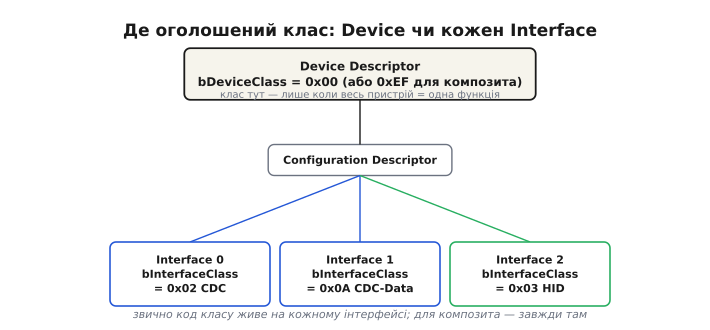
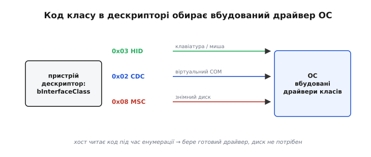
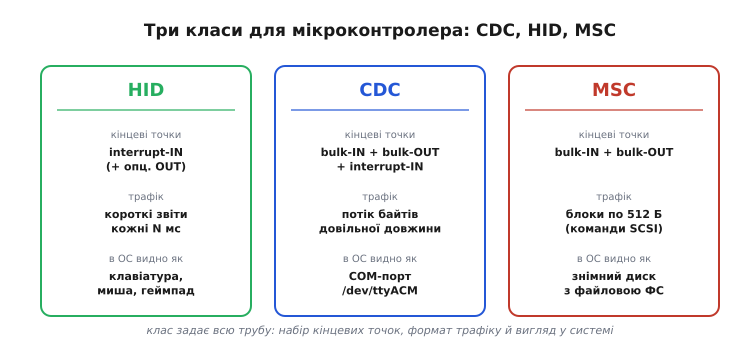
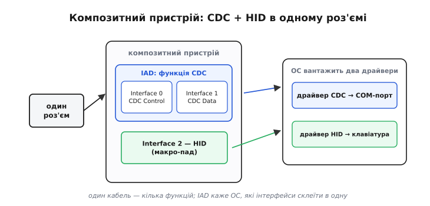

# Класи USB

Уявіть світ, у якому кожен виробник миші, флешки чи перехідника обирає власний набір кінцевих точок, власний формат пакетів і власний протокол розмови з комп'ютером. Тоді під кожен новий пристрій потрібен унікальний драйвер: інсталяція з диска, пошук у мережі, війна з версіями системи. Саме так виглядало підключення периферії наприкінці 1990-х. USB розв'язав це **класами** (англ. class — «розряд», «категорія»): стандарт виділив кілька типових категорій пристроїв, для кожної зафіксував набір кінцевих точок і формат даних, а операційні системи стали постачатися з уже вбудованими драйверами під кожну категорію. Підключили пристрій, хост прочитав код класу в дескрипторі, дістав з полиці готовий драйвер — і все працює без жодного встановлення.

Звідси головна думка, навколо якої тримається вся ця тема: **клас — це стандартний контракт поведінки**. Пристрій обіцяє хосту «я поводжуся як клавіатура» або «я поводжуся як диск», а хост уже знає, чого від такого пристрою чекати, бо драйвер під цей контракт у нього лежить готовий. Розробникові прошивки не треба писати й роками супроводжувати власний драйвер під Windows, macOS і Linux — достатньо чесно заповнити дескриптори за стандартом класу.

> 🔧 **Навіщо це.** Власний USB-драйвер — це місяці роботи й нескінченна сумісність із новими версіями систем. Обравши готовий клас (CDC, HID, MSC), ви отримуєте сумісність із будь-яким комп'ютером безкоштовно: той самий пристрій запрацює і на десятирічному ноутбуці, і на свіжому Linux. Це головна причина, чому USB на мікроконтролері такий зручний.

## Де живе код класу

Категорію пристрою хост дізнається з **коду класу** (class code) у дескрипторі. Це не один байт, а трійка: базовий клас (base class), підклас (subclass) і протокол (protocol) — разом вони звужують «я диск» до «я диск, що розмовляє командами SCSI поверх bulk-передач». Код можна оголосити у двох місцях: у **дескрипторі пристрою** (Device Descriptor) або в **дескрипторі інтерфейсу** (Interface Descriptor — англ. interface, «межа стику»).

Різниця між цими місцями принципова. Код у дескрипторі пристрою каже «весь пристрій — це одна функція такого класу»; так роблять прості однофункційні пристрої. Але звична й гнучкіша практика — оголошувати клас **на кожному інтерфейсі** окремо, а поле класу пристрою лишати нулем. Тоді один фізичний пристрій може нести кілька інтерфейсів різних класів. Для більшості класів — HID, MSC — стандарт навіть вимагає, щоб код жив саме в інтерфейсі, а не в пристрої.



*Дескриптор пристрою каже «вся коробка — одна функція»; дескриптор інтерфейсу — «цей стик поводиться так». Гнучкість і композитні пристрої тримаються на другому варіанті.*

Хост читає код під час [енумерації](topic:com-devices/usb-enumeration) — стартового діалогу, у якому пристрій повідомляє про себе все, — і за цим кодом обирає вбудований драйвер. Клас визначає не лише драйвер: він диктує очікуваний набір кінцевих точок і формат трафіку. Тому «зробити клас» означає не просто вписати потрібний байт у дескриптор, а реалізувати рівно той набір [кінцевих точок](topic:com-devices/usb-endpoints) і той протокол, який описує стандарт цього класу. Збрехати в дескрипторі легко, але якщо за байтом не стоїть очікувана поведінка — драйвер хоста просто не дочекається правильних пакетів.



*Один байт коду класу зводить пристрій із полицею готових драйверів у системі. Диск зі «свіжими драйверами» з 1990-х тут не потрібен.*

## CDC — віртуальний послідовний порт

**CDC** (Communications Device Class — клас комунікаційних пристроїв) дозволяє пристрою виглядати для системи як звичайний **послідовний порт**: COM-порт у Windows, `/dev/ttyACM` у Linux. Це найзручніший спосіб для мікроконтролера «розмовляти текстом» із комп'ютером без власного драйвера — відкрив порт, читаєш і пишеш байти, як по старому UART.

Те, що раніше робив окремий чип USB-UART-міст (CP210x, CH340), через який комп'ютер [прошивав](topic:sys-ide/flashing) плату й слухав її логи, нативний USB-контролер у ESP32-S2 чи S3 робить сам, без зайвого посередника. Плата «відкривається» в системі новим COM-портом так само, як колись відкривався міст; код на боці комп'ютера не помічає різниці.

Набір кінцевих точок CDC незвично багатий, бо клас описує не просто трубу для байтів, а модем: пара **bulk-IN** і **bulk-OUT** несе потік даних, а окрема **interrupt-IN** сигналізує про стан лінії (зміни на кшталт CTS чи DCD). Через bulk-передачі CDC підходить там, де важлива цілісність потоку довільного розміру, але не жорсткий реальний час: bulk віддає всю смугу, що лишилася, проте не гарантує миті доставки.

## HID — людино-машинний інтерфейс

**HID** (Human Interface Device — пристрій взаємодії з людиною) — клас для всього, чим людина керує комп'ютером: клавіатур, мишей, геймпадів, сенсорних екранів, графічних планшетів. Серце HID — **дескриптор звіту** (report descriptor): окрема структура, не частина стандартних дескрипторів, яка описує формат «звітів» (report — «доповідь») — пакетів, якими пристрій обмінюється з хостом. Завдяки дескриптору звіту хост розуміє значення кожного байта у звіті, не знаючи нічого про конкретного виробника: пристрій сам наперед оголошує, «байт нуль — це біти модифікаторів, далі шість кодів клавіш».

Система приймає будь-який HID-пристрій без встановлення стороннього драйвера, тому HID — найпростіший шлях зробити ESP32 клавіатурою, мишею чи ігровим контролером. Спілкується HID короткими [interrupt-передачами](topic:com-devices/usb-endpoints) кожні кілька мілісекунд: маленькі звіти, передбачуваний темп — рівно те, що треба для реакції на натиск без відчутної затримки.

> ⚙️ Як саме описати дескриптор звіту й слати натискання, щоб ОС побачила вашу плату клавіатурою, з робочим C-фрагментом для ESP32 — у вставці [HID-звіти: мікроконтролер як клавіатура](topic:com-devices/usb-device-classes/proj-hid-reports.md).

## MSC — накопичувач

**MSC** (Mass Storage Class — клас масової пам'яті) — клас для пристроїв зберігання: флешок, зовнішніх дисків, карт пам'яті. Поверх USB пристрій MSC реалізує підмножину команд **SCSI** (Small Computer System Interface — інтерфейс малих комп'ютерних систем) — набору команд, старшого за сам USB, який описує читання й запис блоків, запит ємності диска, перевірку готовності тощо. Система бачить такий пристрій як звичайний диск і монтує його файлову систему.

Транспорт під цими командами лаконічний — **Bulk-Only Transport** (BOT, «лише через bulk»): і команда, і дані, і статус ідуть через ту саму пару bulk-кінцевих точок. Хост шле блок-обгортку команди, далі за потреби — блок даних, а пристрій відповідає блоком статусу «виконано / помилка». Уся складність диска ховається за цими трьома кроками.

MSC цінний тим, що ESP32 із [SD-карткою](topic:hw-arch/sd-card) може віддати комп'ютеру доступ до картки як до знімного диска — без жодного стороннього програмного забезпечення. Зручно, щоб скинути зібрані дані чи оновити конфігураційні файли, не піднімаючи термінал.



*Кожен клас задає всю трубу: свій набір [кінцевих точок](topic:com-devices/usb-endpoints), формат трафіку й вигляд у системі. Обрати клас — це обрати весь цей пакет одразу.*

## Композит: кілька класів в одному роз'ємі

Один фізичний пристрій може нести кілька інтерфейсів різних класів одночасно — це [**композитний пристрій**](topic:com-devices/usb-overview) (composite — «складений»). ESP32 може водночас відкриватися як CDC-порт (для логів і команд) і як HID-клавіатура (макро-пад): один кабель, а за ним — кілька незалежних функцій, під кожну з яких система вантажить свій драйвер.

Щоб хост зрозумів, які саме інтерфейси склеїти в одну логічну функцію, у дескриптор додають **IAD** (Interface Association Descriptor — дескриптор об'єднання інтерфейсів). CDC завжди займає два інтерфейси — керування й дані, — і саме IAD каже системі: «оці два інтерфейси разом і є один COM-порт, не плутай їх із сусіднім HID». Без IAD старі системи бачили б розсипані інтерфейси й не зібрали б із них функцію. Для композита поле класу в дескрипторі пристрою при цьому ставлять у спеціальне значення 0xEF (Miscellaneous — «різне»), яким пристрій каже хосту: «дивись клас не на мені, а в кожному інтерфейсі та в IAD».



*IAD склеює два інтерфейси CDC в один COM-порт, а HID лишається окремою функцією. Для системи це два незалежні пристрої на одному кабелі.*

> 📜 Та сама зручність HID — «підключив і одразу довіра без драйвера» — стала вектором атаки: про BadUSB і Rubber Ducky читайте у вставці [коли «клавіатура» — зброя](topic:com-devices/usb-device-classes/hist-badusb.md).

**Worked-приклад: чому ваша плата стає COM-портом**

Мінімальна конфігурація CDC у стилі TinyUSB / ESP-IDF. Два інтерфейси, склеєні через IAD, і три кінцеві точки — рівно той контракт, за яким система впізнає віртуальний послідовний порт:

```c
/* Конфігурація CDC: 2 інтерфейси (керування + дані), склеєні IAD */
uint8_t const desc_configuration[] = {
    /* Config descriptor */
    9, TUSB_DESC_CONFIGURATION,
    U16_TO_U8S_LE(67),  /* wTotalLength = весь блок нижче */
    2,                  /* bNumInterfaces: 2 (CDC = 2 інтерфейси) */
    1,                  /* bConfigurationValue */
    0, 0x80, 250,       /* iConfiguration, bmAttributes, bMaxPower = 500 мА */

    /* Interface Association: каже хосту склеїти інтерфейси 0+1 у CDC */
    8, TUSB_DESC_INTERFACE_ASSOCIATION,
    0, 2,               /* bFirstInterface = 0, bInterfaceCount = 2 */
    TUSB_CLASS_CDC, 2, 0, 0,   /* клас CDC, підклас Abstract Control Model */

    /* Interface 0: CDC Control (керування) */
    9, TUSB_DESC_INTERFACE,
    0, 0, 1,            /* номер = 0, alt = 0, 1 кінцева точка */
    TUSB_CLASS_CDC, 2, 0, 0,   /* bInterfaceClass = CDC (0x02) */

    /* interrupt-IN: сигнали стану лінії */
    7, TUSB_DESC_ENDPOINT,
    0x81,               /* EP 1 IN */
    TUSB_XFER_INTERRUPT, U16_TO_U8S_LE(8), 16,

    /* Interface 1: CDC Data (потік байтів) */
    9, TUSB_DESC_INTERFACE,
    1, 0, 2,            /* номер = 1, alt = 0, 2 кінцеві точки */
    TUSB_CLASS_CDC_DATA, 0, 0, 0,   /* bInterfaceClass = CDC-Data (0x0A) */

    /* bulk-OUT: дані від хоста */
    7, TUSB_DESC_ENDPOINT, 0x02, TUSB_XFER_BULK, U16_TO_U8S_LE(64), 0,
    /* bulk-IN: дані до хоста */
    7, TUSB_DESC_ENDPOINT, 0x82, TUSB_XFER_BULK, U16_TO_U8S_LE(64), 0,
};
/* Хост прочитає клас CDC → підніме драйвер → з'явиться новий COM / ttyACM */
```

Тут видно весь контракт CDC у дескрипторі: IAD оголошує функцію, інтерфейс керування несе interrupt-IN, інтерфейс даних — пару bulk. Жодного власного драйвера: система впізнає код класу й сама дає те, що треба.

---
