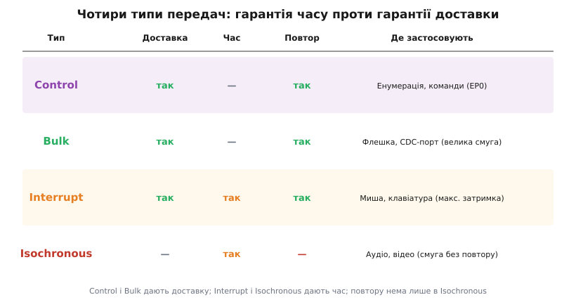
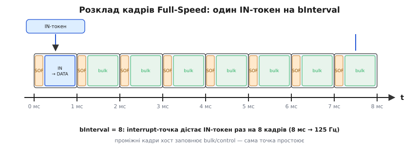

# Кінцеві точки USB — докладно

Базова картина проста: кінцева точка — однонапрямний буфер у пристрої, типів передач чотири, темп задає хост. Та щойно береш у руки логічний аналізатор і дивишся на реальні біти, виринає другий шар. Кожна транзакція — це строга послідовність із трьох фаз. Хост і пристрій обмінюються короткими **токенами** й **квитанціями** з фіксованими іменами. Контролер тримає не один буфер на точку, а два, щоб не простоювати. А «гарантія смуги» для interrupt та isochronous — це не слова, а арифметика, яку хост рахує ще до того, як прийняти конфігурацію пристрою. Розберімо цей шар до дна.

### Транзакція складається з трьох фаз

На дроті немає поняття «передати дані точці». Є **транзакція** — найменша завершена одиниця обміну, і вона завжди має до трьох фаз, кожна з яких — окремий пакет:

```
1. Token    — хост каже, ЩО робить і З КИМ: тип + адреса пристрою + номер точки
2. Data     — летять самі дані (від хоста або до хоста, залежно від напряму)
3. Handshake — приймач підтверджує результат: ACK / NAK / STALL
```

Слово «транзакція» тут має точний сенс, який варто відрізняти від «передачі». **Передача** (transfer) — це логічна операція рівня драйвера: «прочитати дескриптор», «віддати блок флешки». **Транзакція** — це одна її цеглинка на дроті: один обмін токен-дані-квитанція в межах одного кадру. Велика передача складається з багатьох транзакцій, рознесених по кадрах; маленька (як одне опитування миші) вкладається в єдину транзакцію. Плутати їх — означає неправильно читати тайминги: на осі логічного аналізатора видно транзакції, а не передачі, і «одна команда» легко розсипається на десяток рядків.

Token-пакет шле **завжди хост** — це знову та сама ініціатива «один головний». Він буває трьох видів за призначенням:

- **OUT** — «зараз я надішлю дані такій-то точці» (далі йде Data від хоста);
- **IN** — «віддай мені дані, точко» (далі Data летить від пристрою);
- **SETUP** — особливий токен лише для control-передач: «починається службовий запит» (далі йде 8-байтовий пакет запиту).

Напрям Data-фази визначає саме токен. Після OUT дані шле хост, після IN — пристрій. SETUP — це різновид OUT (дані йдуть у пристрій), але виділений окремо, щоб пристрій розпізнав початок керівного діалогу й не сплутав його зі звичайним записом.

> 🔧 **Навіщо це.** Коли в логічному аналізаторі ви бачите `SETUP` там, де чекали `OUT`, — це підказка, що хост заговорив до EP0 службою, а не пише у ваш bulk-канал. Уміння читати токени економить години: половина «незрозумілих зависань» прошивки — це насправді нормальний діалог на EP0, який просто не туди дивилися.

### Біт-перемикач: як приймач ловить загублену квитанцію

Є підступний випадок: пристрій прийняв дані й відіслав ACK, але квитанція згубилась дорогою. Хост ACK не побачив — і шле **той самий** пакет удруге. Якби приймач сліпо взяв його, дані задвоїлися б. Щоб цього не сталося, кожна транзакція (крім isochronous) несе **біт-перемикач даних** — поле, що по черзі набуває значень DATA0 і DATA1.

Працює так: хост і пристрій ведуть власний прапорець очікуваного значення й після кожного успішного ACK його перемикають. Якщо приходить пакет із «не тим» значенням біта, приймач розуміє: це повтор уже прийнятого — він мовчки відкидає дані, але **знову шле ACK** (бо попередній, видно, не дійшов). Так загублена квитанція лагодиться сама, без задвоєння й без участі прошивки.

```
Норма:    DATA0 →ACK→ (перемкнули) DATA1 →ACK→ (перемкнули) DATA0 ...
Збій ACK: DATA0 →ACK(згубився)→ хост повторює DATA0 →
          приймач бачить старий біт → дані відкидає, ACK шле ще раз → синхронні
```

Для прошивки це майже завжди прозоро — біт веде контролер. Але знати про нього треба: рідкісний баг «кожен другий пакет губиться» на саморобному стеку — це майже завжди збитий перемикач даних.

### Квитанції: ACK, NAK, STALL — і що вони кажуть прошивці

Handshake-фаза — це один пакет від приймача, і він буває трьох змістів:

- **ACK** (acknowledge — «підтверджую») — дані прийнято цілими. Все добре, рухаємось далі.
- **NAK** (negative acknowledge — «поки ні») — приймач **тимчасово** не готовий: буфера ще немає (на IN) або місця для прийому ще немає (на OUT). Це **не помилка**. Хост спокійно повторить запит у наступному вікні. Саме NAK миша віддає на IN-токен, коли рух не змінився.
- **STALL** — точка в стані помилки або запит не підтримується. Це **сигнал серйозний**: пристрій каже «я цього не вмію / я зламався на цій точці». Для не-EP0 точки хост зніме STALL лише спеціальним керівним запитом CLEAR_FEATURE(ENDPOINT_HALT); для EP0 STALL стосується одного запиту й знімається наступним SETUP.

Хто яку квитанцію віддає, залежить від напряму. На **OUT/SETUP** квитанцію шле **пристрій** (він приймач даних). На **IN** квитанцію шле **хост** — але пристрій теж може «відмовити» в самій Data-фазі: замість даних він віддає NAK-подібну відповідь, якщо звіту ще нема. Це джерело частої плутанини, тож тримаймо її прямо:

```
OUT-транзакція:   хост → Token(OUT) → Data → ПРИСТРІЙ відповідає ACK/NAK/STALL
IN-транзакція:    хост → Token(IN)  → ПРИСТРІЙ → Data (або NAK/STALL замість даних)
                                    → хост відповідає ACK (якщо взяв дані)
```

Один тонкий момент: **isochronous-транзакції не мають handshake-фази взагалі**. Жодного ACK/NAK/STALL. Дані або долетіли в своє вікно, або ні — і ніхто не повторює й не підтверджує. Це й робить isochronous «безкоштовним» за часом, але беззахисним за цілісністю.

### Чотири типи передач — детально, з гарантіями

Базова стаття дала характери трафіку. Тут — що саме кожен тип гарантує і чим платить.

**Control.** Триетапний діалог: фаза SETUP (8 байтів запиту) → необов'язкова фаза Data → фаза Status (нульова транзакція у зворотному напрямі, що каже «запит виконано»). Доставка гарантована повтором; помилка в будь-якій фазі скасовує запит. Control живе на 10% часу кадру, які хост резервує наперед, тож службовий канал не вмирає навіть на забитій шині. Ціна — мала пропускна здатність: control не для потоків даних, а для команд.

**Bulk.** Найпростіший тип: token → data → ACK/NAK, повтор при потребі. Жодних гарантій часу: bulk бере смугу, яка лишилась **після** всіх периодичних і control-передач. На вільній шині флешка вичавлює майже весь Full-Speed; на зайнятій — той самий файл повзе вдесятеро довше, бо bulk віддає смугу будь-кому, хто має гарантію. Зате цілісність абсолютна: жоден байт не загубиться мовчки.

**Interrupt.** Token(IN) раз на bInterval кадрів; дані або NAK. Гарантія — **максимальна затримка**: хост зобов'язаний опитати точку хоча б раз на заданий інтервал, тож подія дійде не пізніше ніж за bInterval мс. Повтор при помилці є (на відміну від isochronous), тож interrupt поєднує обмежену затримку з надійністю — ціною малого пакета (до 64 байтів на FS) і малої сумарної смуги.

**Isochronous.** Token → data, **без handshake**. Гарантія — **фіксована смуга в кожному кадрі**: хост резервує точці місце наперед і віддає його щокадру, хай там що. Платня подвійна: немає повтору (загублене зникає) і немає захисту від помилок на рівні доставки. Найбільший пакет на FS — до 1023 байтів, бо саме isochronous переганяє об'ємні потоки реального часу.



*Control і Bulk гарантують доставку; Interrupt і Isochronous — час. Повтору й квитанції немає лише в Isochronous.*

### Три стадії control-передачі зблизька

Control варто розглянути окремо, бо це єдиний тип із власною внутрішньою драматургією — і саме на ньому спотикається більшість саморобних стеків. Передача складається з трьох стадій, і кожна — це одна або кілька транзакцій:

```
SETUP-стадія:   SETUP-токен + 8 байтів запиту (bmRequestType, bRequest,
                wValue, wIndex, wLength) + ACK від пристрою
DATA-стадія:    нуль або більше IN/OUT-транзакцій — стільки, скільки треба
                на wLength байтів (необов'язкова: короткі команди її не мають)
STATUS-стадія:  одна нульова транзакція у ЗВОРОТНОМУ до DATA напрямі —
                пристрій каже «виконано» (або STALL, якщо не зміг)
```

Напрям STATUS-стадії — дзеркальний до DATA: якщо хост читав дані (IN-DATA, як у GET_DESCRIPTOR), то STATUS — це OUT нульової довжини; якщо хост писав (OUT-DATA), STATUS — це IN нульової довжини. Сенс цього дзеркала простий: завершити обмін мусить той бік, який досі лише слухав, — так підтвердження не сплутати з даними.

Найтонше місце — поле `wLength` у запиті: воно каже, **скільки байтів хост готовий прийняти**. Пристрій може віддати менше (наприклад, дескриптор коротший за запит), але **ніколи не більше**. Якщо віддав менше й остання порція виявилась повного розміру `wMaxPacketSize`, хост не знатиме, що це кінець, — і тут на сцену виходить нульовий пакет.

### Короткий пакет і ZLP — як позначити кінець

Хост б'є будь-яку передачу на пакети розміром `wMaxPacketSize`, а кінець розпізнає за **коротким пакетом** — тим, що менший за максимум. Прийшов пакет на 40 байтів при максимумі 64 — значить, передача завершена.

Проблема виникає, коли довжина даних кратна `wMaxPacketSize` рівно: тоді останній «справжній» пакет повного розміру, і хост чекає продовження, якого нема. Розв'язок — **ZLP** (zero-length packet, пакет нульової довжини): пристрій додає порожній пакет, який за визначенням коротший за максимум і означає «це все».

```
wMaxPacketSize = 64, треба віддати рівно 128 байтів:
  [64 байти][64 байти][ZLP]   ← без ZLP хост завис би, чекаючи третій пакет
wMaxPacketSize = 64, треба віддати 100 байтів:
  [64 байти][36 байтів]       ← короткий пакет сам означає кінець, ZLP не треба
```

> 🔧 **Навіщо це.** «Передача іноді зависає рівно на круглих розмірах» — класична ознака забутого ZLP. У TinyUSB це здебільшого вирішено за вас, але на власному дескрипторному обробнику чи на bulk-IN із даними, кратними 64, ZLP доводиться додавати руками. Знати правило коротко: кінець = пакет, менший за максимум; немає природного короткого — пошли порожній.

### Бюджет смуги: чому пристрій може «не сконфігуруватися»

«Гарантована смуга» означає, що хтось її **рахує й резервує**. На Full-Speed хост працює за жорстким правилом: усі **периодичні** передачі (interrupt + isochronous) разом можуть зайняти не більш як **90% часу кадру**. Решта — щонайменше 10% — лишається під control (і вже потім bulk бере що завгодно з вільного).

Звідси наслідок, який ловить багатьох уперше: якщо пристрій просить interrupt- або isochronous-точку з такою смугою, що в кадр уже не влазить, хост **відмовляє в конфігурації** — пристрій просто «не заводиться». Bulk так завалити шину не може (він безправний і чекає вільного часу), тому bulk-пристрій ніколи не падає через брак смуги; а от ізохронна камера на вже завантаженій шині цілком може отримати відмову.

Грубо смугу однієї точки за секунду оцінюють так:

```
Full-Speed, 1000 кадрів за секунду.
Interrupt-точка: wMaxPacketSize байтів раз на bInterval кадрів.

  байтів/с ≈ wMaxPacketSize × (1000 / bInterval)

Приклад: wMaxPacketSize = 64, bInterval = 1
  ≈ 64 × 1000 = 64 000 байт/с ≈ 64 КБ/с лише на цю точку.
```

> 🔧 **Навіщо це.** Коли «той самий код» працює на одному ПК і не конфігурується на іншому (з купою під'єднаних пристроїв), перша підозра — переповнений бюджет периодичної смуги хаба чи контролера. Лікується або меншою `wMaxPacketSize`, або більшим `bInterval`, або окремим коренем USB. Це не «глюк драйвера», це арифметика кадру.

Isochronous рахується так само, тільки без `bInterval` у звичному сенсі: точка дістає вікно **щокадру**, тож її смуга — це просто `wMaxPacketSize × 1000` байтів за секунду. Звідси й стеля пакета аж 1023 байти: щоб укласти повноцінний потік (скажімо, стерео-аудіо) в одне вікно на кадр. Один такий потік уже з'їдає помітну частку дозволених 90%, і два незалежні ізохронні пристрої на одній FS-шині часто просто не вживаються — другому бракне смуги, і він отримає відмову при конфігурації. На High-Speed картина легша лише тому, що мікрокадрів увосьмеро більше, а не тому, що правило інше.

### NAK-rate: чому реальна швидкість bulk нижча за розрахункову

Арифметика «64 байти × 1000 = 64 КБ/с» дає **стелю**, якої жоден реальний обмін не досягає. Винні NAK. Згадаймо: на кожен IN-токен пристрій або віддає дані, або відповідає NAK («ще не готовий»). Кожен такий NAK — це змарноване вікно: токен злітав, відповідь повернулась, а корисних байтів — нуль.

На bulk-IN флешки це й визначає реальну швидкість. Хост сипле IN-токенами так часто, як дозволяє вільна смуга; якщо прошивка не встигає підкладати наступний блок у буфер точки, частка відповідей буде NAK, і виміряна швидкість просяде в рази проти теоретичної. Тому головна турбота швидкого bulk-пристрою — **щоб буфер точки ніколи не був порожній у момент IN-токена**. Звідси й цінність подвійної буферизації, і вимога не блокувати головний цикл надовго: кожна пропущена підготовка блоку — це серія NAK і провал у графіку швидкості.

```
Ідеально:  IN→DATA(64) IN→DATA(64) IN→DATA(64) ...   ← повна смуга
Реально:   IN→DATA(64) IN→NAK IN→NAK IN→DATA(64) ...  ← прошивка не встигла
```

> 🔧 **Навіщо це.** Якщо профілювання показує, що bulk-передача йде вдвічі-втричі повільніше за очікувану стелю, не шукайте проблему в шині — дивіться, чи встигає прошивка наповнювати буфер між опитуваннями. Часта причина — довга операція в тому самому циклі (запис у Flash, друк у лог), що краде час у підготовки наступного USB-блоку.

### STALL і відновлення: коли точка «зависла»

STALL — найсерйозніша з квитанцій, і поводження з нею різне для EP0 і для решти точок. На EP0 STALL означає «цей конкретний службовий запит я не підтримую або не зміг виконати»; він стосується лише поточного запиту, і наступний SETUP-токен автоматично знімає стан. Тому невідомий запит на EP0 — не катастрофа: пристрій штатно «столить» його, хост розуміє «не вміє» й рухається далі.

А от на bulk- чи interrupt-точці STALL означає **стійкий стан помилки** («endpoint halt»): точка зупинилась і сама з нього не вийде. Хост мусить явно її розморозити службовим запитом по EP0 — CLEAR_FEATURE(ENDPOINT_HALT), — який скидає і стан помилки, і біт-перемикач даних назад на DATA0. Поки цього не сталося, точка на кожен токен відповідатиме STALL, і обмін через неї стоятиме.

```
EP0:   невідомий SETUP → STALL → наступний SETUP знімає (само)
EPx:   помилка → STALL на КОЖЕН токен → хост шле CLEAR_FEATURE по EP0 →
       стан скинуто, перемикач даних → DATA0 → обмін відновлено
```

> 🔧 **Навіщо це.** Якщо клас-драйвер раптом «замовкає» на одному напрямі, а решта пристрою живе, — типово це halt на тій точці, який ніхто не зняв. У логічному аналізаторі видно суцільні STALL у відповідь на IN/OUT; лікування — переконатися, що прошивка коректно виставляє й знімає halt і що хост-драйвер шле CLEAR_FEATURE. Це частий слід «однобічних» зависань CDC-порту.

### Що лежить у 8 байтах SETUP-запиту

Раз control-діалог крутиться навколо 8-байтового SETUP-пакета, варто знати, з чого він складається — бо саме ці поля прошивка розбирає у власному обробнику керівних запитів:

```
bmRequestType (1 байт) — напрям (хост→пристрій / пристрій→хост),
                         клас запиту (стандартний / класовий / вендорський),
                         адресат (пристрій / інтерфейс / точка)
bRequest      (1 байт) — код запиту: GET_DESCRIPTOR, SET_ADDRESS, SET_CONFIGURATION ...
wValue        (2 байти) — параметр запиту (напр., тип і номер дескриптора)
wIndex        (2 байти) — уточнення (напр., номер інтерфейсу чи точки)
wLength       (2 байти) — скільки байтів даних піде в DATA-стадії
```

Перший байт — найважливіший: його старший біт задає напрям DATA-стадії, а два поля всередині кажуть, **чий** це запит. Стандартні запити (на кшталт SET_ADDRESS) обробляє сам USB-стек; класові (HID GET_REPORT, CDC SET_LINE_CODING) стек передає у твій callback; вендорські — повністю на твоїй совісті. Тому розбір `bmRequestType` — це розвилка, з якої починається будь-який обробник EP0: «це моє чи стекове, і куди слати відповідь».

> 🔧 **Навіщо це.** Коли пристрій не відповідає на класову команду (миша не шле звіти, віртуальний COM ігнорує швидкість), причина часто в обробнику SETUP: прошивка не розпізнала `bmRequestType`/`bRequest` і мовчки «столить» запит замість того, щоб віддати дані. Дамп цих восьми байтів у логічному аналізаторі одразу показує, чого саме хост хотів і де обробник схибив. Правило для зневадження просте: спершу подивись `bmRequestType` (чий і куди), тоді `bRequest` (що саме), і лише тоді шукай помилку в самій відповіді — більшість збоїв EP0 видно вже на першому з цих трьох кроків.

### Кінцева точка й фізичний FIFO контролера

Досі ми звали точку «буфером». На рівні заліза цей буфер — ділянка **FIFO** (first-in-first-out) у пам'яті USB-контролера, прив'язана до номера й напряму точки. Контролер сам приймає байти з дроту у FIFO потрібної точки за адресою з токена й сам збирає вихідні байти з FIFO на дріт — прошивка лише читає й пише цю пам'ять, не торкаючись бітів на лінії.

Звідси два практичні наслідки. По-перше, кількість і розмір FIFO **обмежені залізом**: контролер має скінченний обсяг пам'яті точок, і завести більше точок чи більший `wMaxPacketSize`, ніж він фізично тримає, не можна — дескриптор просто не запрацює. По-друге, подвійна буферизація — це теж про FIFO: «два буфери» означають дві ділянки під одну точку, тож пінг-понг коштує вдвічі більше дефіцитної пам'яті контролера. Саме тому її не вмикають наосліп на кожну точку, а лише там, де смуга справді критична.

### Подвійна буферизація: чому контролер не простоює

Наївно точці вистачило б одного буфера: хост пише — прошивка читає, прошивка пише — хост забирає. Але тоді між «хост забрав» і «прошивка поклала наступне» точка стоїть порожня й змушена відповідати NAK, втрачаючи вікно. На повній швидкості це викидає половину пропускної здатності.

Рятує **подвійна буферизація** (її ще звуть ping-pong, «пінг-понг»): контролер тримає на точку **два буфери** й перемикається між ними. Поки хост вичитує буфер A, прошивка вже наповнює буфер B; наступного разу — навпаки. Точка майже ніколи не стоїть порожньою, NAK зникають, смуга використовується повністю.

```
Без пінг-понгу:   [A: хост читає][A: прошивка пише][A: хост читає] ...  ← паузи, NAK
З пінг-понгом:    [A: хост читає | B: прошивка пише]
                  [B: хост читає | A: прошивка пише]  ← без пауз
```

Платня — удвічі більше пам'яті контролера на таку точку, тож пінг-понг вмикають там, де смуга справді важлива (bulk-IN флешки, isochronous-потік), а не на кожній дрібній точці. У TinyUSB і подібних стеках це здебільшого деталь контролера, але знати про неї треба: саме пінг-понг пояснює, чому виміряна швидкість bulk-передачі різко падає, якщо прошивка не встигає підкладати дані — другий буфер порожніє, і виграш зникає.

### Як усе складається в один обмін

Зведімо шар воєдино на прикладі одного циклу interrupt-миші:

1. Хост на початку кадру шле SOF, а в потрібному кадрі (раз на bInterval) — **Token(IN)** на EP1-IN.
2. Якщо рух був — контролер віддає з активного буфера **Data** (8 байтів звіту), хост відповідає **ACK**, спрацьовує `tud_hid_report_complete_cb`, і пінг-понг перемикає буфери.
3. Якщо руху не було — пристрій замість даних віддає **NAK**; хост спокійно йде далі й спитає в наступному вікні.
4. Усе це вкладено в [розклад кадрів](topic:com-devices/usb-endpoints/proj-frames.md), який хост веде за власним годинником; темп звітів стелить `bInterval`, а не швидкість `loop()`.



*Interrupt-точка з bInterval = 8 дістає IN-токен раз на 8 кадрів; між ними хост зайнятий іншим трафіком, а точка простоює. Звідси 8 мс → 125 Гц.*

Зверни увагу, що з погляду прошивки активної роботи в цьому циклі обмаль: контролер сам зловив токен, сам звірив адресу й номер точки, сам перемкнув біт даних і відіслав квитанцію. Код втручається лише у двох місцях — коли кладе свіжий звіт у буфер і коли callback повідомляє, що попередній забрано. Усе між цими двома моментами — апаратний автомат. Тому «оптимізувати USB» у прошивці майже завжди означає не чіпати протокол, а **встигати готувати дані** до приходу токена: не блокувати цикл, тримати буфер повним, не палити час на зайве в обробниках.

Той самий кістяк — Token → (Data) → (Handshake) — лежить під кожним типом передачі; різниця лише в тому, які фази присутні (isochronous без handshake), хто шле квитанцію і скільки смуги хост зарезервував наперед. Зрозумівши цей кістяк, решту USB читаєш як варіації однієї теми: стандартні [класи пристроїв](topic:com-devices/usb-device-classes) просто домовляються наперед, які точки завести й що класти в їхні пакети.
