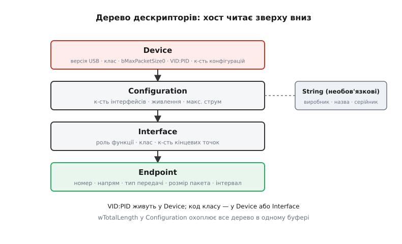
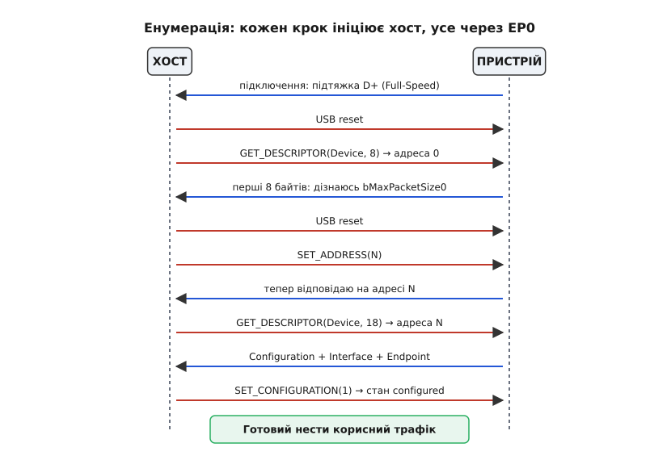
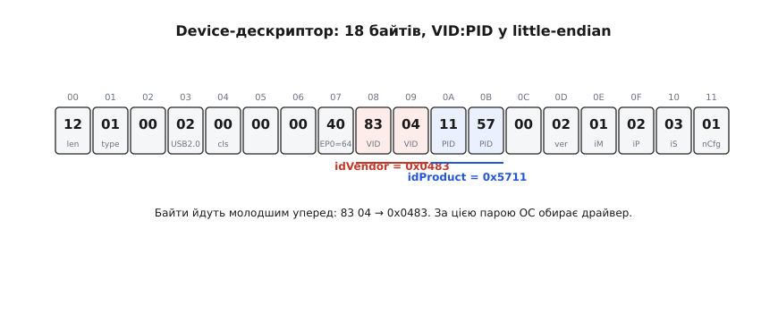

# Енумерація USB

Коли пристрій щойно під'єднали, [хост USB](topic:com-devices/usb-overview) ще нічого про нього не знає — ні що це за клас обладнання, ні яку максимальну швидкість він тримає, ні скільки струму потребує. Усе, що поки сталося на [фізичному рівні](topic:com-devices/usb-physical), — пристрій підтяжкою на лінії даних повідомив про свою присутність і швидкість. Далі починається діалог-знайомство, у якому хост ставить стандартні запити, а пристрій відповідає наперед визначеними структурами. Цей діалог називають **енумерацією** (від латинського *enumeratio* — «перелічення»: хост перелічує й заносить пристрій до свого дерева). Вона відбувається ще до того, як операційна система завантажить будь-який драйвер.

### Адреса за замовчуванням 0

Щойно під'єднаний пристрій відповідає на **USB-адресу 0**. Це єдине місце в USB, де адреса 0 легальна: вона зарезервована саме для пристрою, якому ще не призначено власної адреси. Спершу хост подає на шину **reset** — певний стан ліній D+ і D−, після якого пристрій повертається до початкового стану й слухає адресу 0. Тоді хост опитує його на цій адресі через службовий канал. Коли хост дізнається мінімально необхідне (хоча б розмір буфера керувального каналу), він надсилає команду **SET_ADDRESS** і призначає пристрою унікальну адресу в діапазоні 1–127.

Чому адресу дає хост, а не пристрій сам собі? Тому що в USB [хост — єдиний господар шини](topic:com-devices/usb-overview): він бачить усе дерево й знає, які адреси вже зайняті. Якби кожен пристрій обирав адресу сам, два однакові пристрої легко взяли б одну й ту саму, і хост не зміг би їх розрізнити. Централізована роздача адрес знімає цей конфлікт у корені.

### Кінцева точка 0 і setup-пакети

Уся енумерація проходить через **кінцеву точку 0** (endpoint 0, EP0) — єдину, що завжди є на будь-якому USB-пристрої, і двонапрямну. EP0 — службовий канал типу **control** (це один із [типів передач USB](topic:com-devices/usb-endpoints)). Через нього хост надсилає **setup-пакети** — структури фіксованого формату з кодом стандартного запиту. Основні запити під час енумерації — `GET_DESCRIPTOR` (дай мені структуру з описом), `SET_ADDRESS` (відтепер твоя адреса така) і `SET_CONFIGURATION` (вмикаю на тобі цю конфігурацію). Поки пристрій не отримав адреси, EP0 на адресі 0 — єдиний спосіб із ним поговорити, тож саме він мусить працювати найпершим.

### Дескриптори — анкета пристрою

Уся інформація, яку пристрій надає хосту, лежить у **дескрипторах** (від латинського *describere* — «описувати») — бінарних структурах фіксованого формату в пам'яті самого пристрою. Дескриптори ієрархічні:

- **Device** — загальні відомості: версія USB-специфікації, клас/підклас/протокол, максимальний розмір пакета EP0, ідентифікатори виробника й продукту, версія прошивки, кількість конфігурацій.
- **Configuration** — одна з можливих конфігурацій пристрою (у більшості пристроїв вона одна). Містить кількість інтерфейсів, атрибути живлення, максимальний струм.
- **Interface** — одна функціональна роль у межах конфігурації (клас інтерфейсу, кількість кінцевих точок).
- **Endpoint** — конкретний канал: номер кінцевої точки, напрям, тип передачі, максимальний розмір пакета, інтервал опитування.
- **String** — необов'язкові: назва виробника, назва пристрою, серійний номер у зручному для читання вигляді.

Хост читає дескриптори зверху вниз: спершу Device, далі Configuration, тоді Interface(и), тоді Endpoint(и). Так поступово складається повна картина того, з ким він має справу.



*Де в ієрархії живуть ідентифікатори й [код класу](topic:com-devices/usb-device-classes): VID:PID — у Device, клас — у Device або Interface, а String-дескриптори стоять осторонь основного дерева.*

### Ідентифікатори VID і PID — паспорт пристрою

У Device-дескрипторі є два поля, на які операційна система звертає особливу увагу: **idVendor (VID)** і **idProduct (PID)**. VID — це 16-бітний ідентифікатор виробника, який видає організація USB Implementers Forum (USB-IF), і він коштує грошей: реєстрація обходиться в кілька тисяч доларів. PID — 16-бітний ідентифікатор конкретного продукту, який виробник призначає сам у межах свого VID.

Пара VID:PID — по суті паспорт пристрою: за нею ОС підбирає потрібний драйвер зі своєї бази. Для аматорських і невеликих комерційних проєктів власний VID — розкіш, тож розробники нерідко беруть VID:PID розробницьких інструментів або відкритих проєктів (наприклад, pid.codes) на відповідних ліцензійних умовах.

### Хід знайомства

Складімо всі кроки в один ланцюжок — від моменту під'єднання до готового до роботи пристрою:

1. Під'єднання: підтяжка на лінії даних повідомляє хост про присутність і швидкість.
2. Хост подає **USB reset** — пристрій повертається до початкового стану й слухає адресу 0.
3. `GET_DESCRIPTOR(Device, 8)` на адресу 0 — хост читає перші 8 байтів, щоб дізнатися `bMaxPacketSize0` (розмір буфера EP0). Саме 8, бо стільки гарантовано вміщується в один пакет за будь-якого розміру EP0.
4. Ще один reset — щоб пристрій певно почав із чистого стану перед зміною адреси.
5. `SET_ADDRESS(N)` — пристрій дістає унікальну адресу й відтепер відповідає лише на неї.
6. `GET_DESCRIPTOR(Device, 18)` на нову адресу — повний Device-дескриптор.
7. `GET_DESCRIPTOR(Configuration)` — хост забирає Configuration разом із вкладеними Interface та Endpoint.
8. ОС за VID:PID і класом обирає драйвер, тоді надсилає `SET_CONFIGURATION(1)` — пристрій переходить у стан **configured** і готовий до роботи.



*Уся енумерація проходить через EP0, і кожен крок починає хост: червоні стрілки — запити хоста, сині — відповіді пристрою. Подвійний reset навколо SET_ADDRESS — не випадковість, а вимога надійного старту.*

> ⚙️ **Як зібрати ці дескриптори своїми руками.** Щоб побачити, які саме байти пристрій кладе у флеш у відповідь на `GET_DESCRIPTOR`, розгорнемо Device і Configuration у конкретний масив чисел — без USB-стека, побайтно. Це показано у вставці [Мінімальний дескриптор своїми руками](topic:com-devices/usb-enumeration/proj-descriptors.md).

**Читаємо Device-дескриптор побайтно**

Реальна C-структура Device-дескриптора — 18 байтів, без вирівнювання (`packed`), щоб розкладка в пам'яті точно збіглася з форматом на проводі:

```c
/* usb_descriptors.h — Device Descriptor (USB 2.0, §9.6.1) */
struct __attribute__((packed)) usb_device_descriptor {
    uint8_t  bLength;            /* [00] = 0x12 (18 байтів)        */
    uint8_t  bDescriptorType;   /* [01] = 0x01 (DEVICE)           */
    uint16_t bcdUSB;            /* [02-03] = 0x0200 (USB 2.0)     */
    uint8_t  bDeviceClass;      /* [04] = 0x00 (клас в Interface) */
    uint8_t  bDeviceSubClass;   /* [05] = 0x00                    */
    uint8_t  bDeviceProtocol;   /* [06] = 0x00                    */
    uint8_t  bMaxPacketSize0;   /* [07] = 0x40 (64 байти EP0)     */
    uint16_t idVendor;          /* [08-09] = 0x0483 (STMicro) VID */
    uint16_t idProduct;         /* [0A-0B] = 0x5711           PID */
    uint16_t bcdDevice;         /* [0C-0D] = 0x0200               */
    uint8_t  iManufacturer;     /* [0E] = 1 (індекс String)       */
    uint8_t  iProduct;          /* [0F] = 2                       */
    uint8_t  iSerialNumber;     /* [10] = 3                       */
    uint8_t  bNumConfigurations;/* [11] = 1                       */
};
```

А ось ці самі 18 байтів так, як вони лягають у пам'ять і летять хосту:

```
Зсув  Hex   Поле
00    12    bLength = 18
01    01    bDescriptorType = DEVICE
02    00    bcdUSB (молодший байт)
03    02    bcdUSB (старший байт) → USB 2.0
04    00    bDeviceClass = 0 (клас у Interface)
05    00    bDeviceSubClass
06    00    bDeviceProtocol
07    40    bMaxPacketSize0 = 64
08    83    idVendor  (молодший байт)
09    04    idVendor  (старший байт) → VID = 0x0483
0A    11    idProduct (молодший байт)
0B    57    idProduct (старший байт) → PID = 0x5711
0C    00    bcdDevice (молодший байт)
0D    02    bcdDevice (старший байт)
0E    01    iManufacturer
0F    02    iProduct
10    03    iSerialNumber
11    01    bNumConfigurations = 1
```

Найважливіша деталь тут — порядок байтів. Усі багатобайтові числа в USB ідуть молодшим байтом уперед (little-endian), тож `idVendor = 0x0483` лежить у пам'яті як пара `83 04`, а не `04 83`. Переплутаєш порядок — хост прочитає інший VID і не знайде драйвера.



*Байти 08–0B — це VID і PID у little-endian; пара `83 04` читається як 0x0483. Саме за цією парою ОС обирає драйвер.*

> 🔧 **Навіщо це.** Коли пристрій визначається як «Unknown Device» чи «невідомий USB-пристрій», це майже завжди збій саме під час енумерації: або дескриптор має помилку в полі довжини, або EP0 не встиг відповісти на перший запит, або клас у дескрипторі не збігається з реальними кінцевими точками. Знаючи кроки енумерації, ти читаєш лог USB-аналізатора (наприклад, Wireshark із USB-плагіном) і точно бачиш, на якому кроці все спинилося, — замість того щоб навмання правити прошивку.

Щойно хост отримав підтвердження на `SET_CONFIGURATION`, знайомство завершене: пристрій перейшов у стан configured, ОС підібрала драйвер за VID:PID, а відкриті [кінцеві точки](topic:com-devices/usb-endpoints) готові нести корисний трафік.
