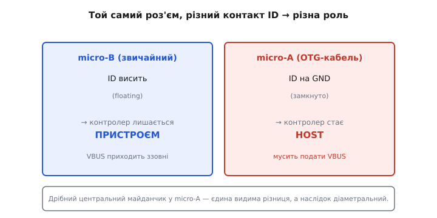
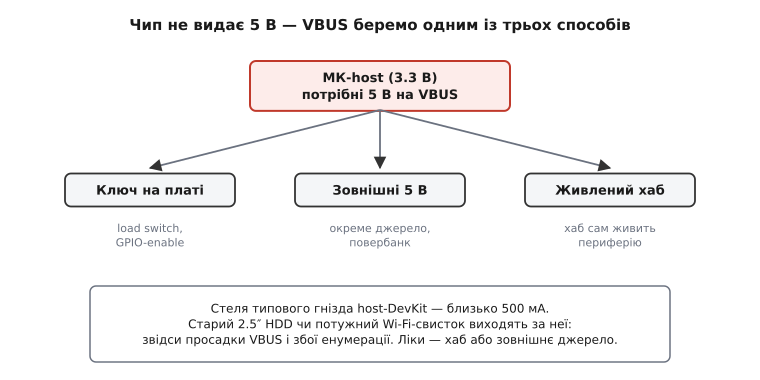

# 🔌 OTG-кабель і host-модулі: що треба, щоб МК став головним

## Що це за клас

На перший погляд здається, що достатньо «якогось OTG-кабелю» — і ESP32-S3 уже бачить флешку. Насправді ж ідеться про **зв'язку з двох речей**: по-перше, OTG-кабель або перехідник, що дає платі *дозвіл* стати host, по-друге, зовнішнє джерело **VBUS 5 В**, що цю роль *живить*. Кабель сам господарем не робить — він лише «відкриває шлагбаум».

Корисно тримати в голові базову [картину USB](topic:com-devices/usb-overview): у шині завжди є одна сторона, що командує (host), і одна чи кілька, що виконують (device). У ESP32-сімействі нативний USB-OTG є лише в **S2 і S3**; класичний ESP32 [USB не має взагалі](topic:sf-devices/esp32-usb).

«Host-модуль» як клас плат — це DevKit із роз'ємом Type-A і **ключем живлення VBUS** вже на борту (наприклад, плати класу ESP32-S3-USB-OTG). Такий модуль — готове рішення, яке економить час проти саморобки «кабель плюс зовнішні 5 В». Обидва підходи робочі; вибір залежить від того, чи є у вас відповідна плата.

## Як кабель перемикає роль: ID-пін



*П'ятий контакт ID вирішує роль: висить (micro-B) — пристрій; замкнутий на GND (micro-A в OTG-кабелі) — host. Контролер читає ID і, ставши хостом, зобов'язаний подати VBUS.*

У роз'ємі micro-USB є **п'ять контактів**: VBUS, D−, D+, ID і GND. У **micro-B** — тому самому, що йде у ваш телефон або давач — пін ID **висить** (floating, не підключений). Контролер dual-role (OTG) читає цей стан і лишається **пристроєм (device)**. У **micro-A** — який буває лише в OTG-кабелі і помітний дрібнішим центральним майданчиком — пін ID **замкнуто на GND**. Побачивши це, контролер перемикається в **host** і, за специфікацією USB OTG, зобов'язаний подати VBUS.

> 🔧 **Навіщо це**
> Саме тут найчастіше застряє новачок: він бере перший-ліпший micro-USB кабель із ящика, з'єднує МК і флешку — і нічого не відбувається. Плата лишилась пристроєм, бо ID не замкнуто. Лікування одне: потрібен **OTG-кабель (або OTG-перехідник)** із micro-A на одному кінці — лише він замикає ID і перемикає роль.

На сучасному **USB-C** механізм інший: там ролі задають [резистори **CC**](topic:com-devices/type-c-cc) (Rp на стороні host тягне лінію вгору, Rd на стороні device — вниз). Ідея та сама — статичний сигнал каже контролеру, хто головний, — але замість п'ятого контакту задіяні дві лінії CC.

## Звідки 5 вольтів: VBUS



*Ставши хостом, МК мусить живити периферію 5-ма вольтами VBUS, а сам чип їх не видає. Звідси три джерела: ключ живлення на платі (GPIO-enable), зовнішні 5 В або живлений хаб; стеля типового гнізда — близько 500 мА.*

Найважливіше і найнеочевидніше: ставши host, МК **мусить живити периферію** — подавати **5 В на лінію VBUS**. Але USB-порт ESP32-S2/S3 сам 5 В не видає — це задокументований факт: чип живе від 3.3 В і не має внутрішнього [boost-перетворювача](topic:hw-power/boost) для шини. Тому **самого OTG-кабелю мало**.

Є три способи отримати VBUS:

- **Ключ живлення (load switch) на платі**, відкритий сигналом GPIO — так влаштовані host-DevKit'и. Наприклад, на платах класу ESP32-S3-USB-OTG є пін DEV_VBUS_EN (≈ GPIO12): підняв — на Type-A гнізді з'явилось 5 В. Це і є «host-модуль» у чистому вигляді.
- **Зовнішні 5 В збоку** (окреме джерело, повербанк) у саморобці «OTG-кабель плюс інжекція 5 В у лінію VBUS». Гнучко, але потребує додаткового дроту.
- **Активний (живлений) USB-хаб** — він сам живить пристрої; МК лише командує по шині. Зручно, якщо потрібно підключити кілька пристроїв або підключений пристрій споживає багато струму.

Важливий і [бюджет струму](topic:com-devices/usb-power): типове гніздо host-DevKit дає **5 В, до приблизно 500 мА**. Старий 2.5″ HDD або потужний Wi-Fi-свисток легко виходять за цю межу — звідси просадки VBUS і збої при енумерації. Лікується живленим хабом або зовнішнім джерелом.

## Розпіновка: що з'являється на стороні host

На боці host чотири сигнальні лінії:

```
VBUS  +5 В      — живлення периферії (видає host)
D+    дані «+»  — диференційна пара USB
D−    дані «−»  — диференційна пара USB
GND   земля
(ID   → GND     — лише micro-A; задає роль host)
```

Підключення елементарне: периферія втикається у Type-A гніздо host-модуля — більше нічого «схрещувати» не треба. У USB, на відміну від [UART](topic:com-devices/uart-frame), роль уже задана кабелем або резисторами CC, тому пари D+/D− з'єднуються напряму, без перехресного комутування.

## «Перший байт»: як господар оживає

Послідовність запуску проста: подаємо VBUS — підключена периферія тягне D+ (Full Speed) або D− (Low Speed) до 3.3 В через свій резистор підтяжки — контролер фіксує **підключення** — запускається [**енумерація**](topic:com-devices/usb-enumeration) — host запитує дескриптори, визначає [клас пристрою](topic:com-devices/usb-device-classes) (MSC-флешка, HID-клавіатура) і завантажує відповідний драйвер.

Найперший крок — підняти enable-пін перед ініціалізацією USB-стека:

:::tabs
```cpp
// ESP32-S3: підняти VBUS-enable ДО старту USB-host стека
#define VBUS_EN_PIN 12          // DEV_VBUS_EN на платах S3-USB-OTG класу

void setup() {
    pinMode(VBUS_EN_PIN, OUTPUT);
    digitalWrite(VBUS_EN_PIN, HIGH);  // +5 В з'являється на Type-A гнізді
    // далі — ініціалізація USB-host стека (USB.begin() або аналог для вашого фреймворку)
}
```
```micropython
# ESP32-S3: підняти VBUS-enable ДО старту USB-host стека
from machine import Pin

VBUS_EN_PIN = 12                # DEV_VBUS_EN на платах S3-USB-OTG класу

vbus_en = Pin(VBUS_EN_PIN, Pin.OUT)
vbus_en.value(1)                # +5 В з'являється на Type-A гнізді
# далі — ініціалізація USB-host стека (залежить від прошивки/фреймворку)
```
:::

Сам запуск стека залежить від фреймворку; тут важливо, що **enable-пін треба підняти першим** — інакше периферія не отримає живлення і підключення не буде зафіксовано.

## Типові граблі

- **Звичайний кабель замість OTG.** ID не замкнуто → плата лишилась пристроєм, нічого не видно. Помилка №1; перевіряється заміною кабелю на OTG.
- **Немає VBUS.** Кабель правильний, ID замкнуто, але 5 В ніхто не подав — enable-пін не піднятий або плата без ключа живлення. Периферія мертва, хоча з боку USB-стека все виглядає нормально.
- **Перевищено бюджет струму (>~500 мА).** Просадка VBUS, перезапуск МК або збої енумерації. Лікується живленим хабом або зовнішніми 5 В.
- **Класичний ESP32 (не S2/S3).** Host не зробити в принципі — [USB-периферії в чипі немає](topic:sf-devices/esp32-usb). Ніякий OTG-кабель не допоможе.
- **Сплутали бік кабелю або перехідника** — micro-A проти micro-B, або взяли «зарядний» кабель без ліній даних.
- **«Зарядний» кабель без ліній даних.** D+ і D− відсутні фізично — шина мовчить незалежно від ID.

## Варіації класу

За роз'ємом і способом задавання ролі розрізняють три варіанти: **micro-OTG** (ID замкнуто в кабелі), **Type-C host** (роль задана резисторами CC) і **готовий host-DevKit** із Type-A гніздом і ключем VBUS на борту. За джерелом живлення розрізняють: саможивний (ключ на платі), зовнішні 5 В і живлений хаб. Нарешті, один кабель — один пристрій: підключити кілька одночасно можна лише через **USB-хаб** (бажано живлений), і стек host на МК мусить підтримувати хаби.
