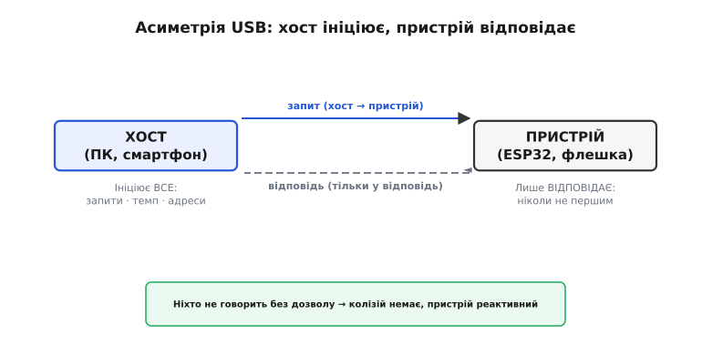
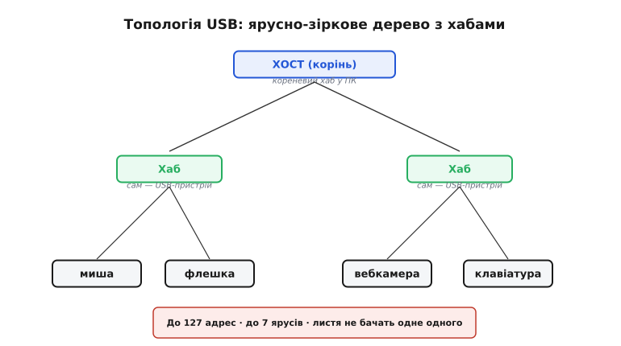
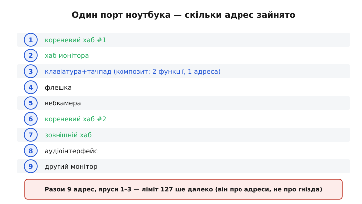

# USB з висоти: хост і пристрій, дерево з хабами

USB (Universal Serial Bus — універсальна послідовна шина) спокушає одразу зануритись у байти й часові діаграми. Цю спокусу краще стримати, бо вся архітектура шини виростає з **одного рішення**, ухваленого ще на етапі проєктування: рівних на USB-шині немає. Хто це рішення зрозумів, тому решта — структура дескрипторів, типи передач, енумерація — лягає в голову природно, як наслідки одного причинного кроку. Тому почнемо згори: хто на шині головний, як влаштована її топологія, хто кого живить і тактує. Деталі кожного шару живуть у сусідніх статтях, і до них тут вестимуть посилання.

Асиметрія ролей одразу відрізняє USB від [I²C](topic:com-devices/i2c-bus) і [SPI](topic:com-devices/spi-bus): там кілька учасників можуть самі почати обмін, є арбітраж шини й ведучий, що в різні моменти може мінятися. У USB ролі **асиметричні й незмінні** — і саме це спрощує систему до краю.

### Один головний — і це навмисно

**Хост** (host — господар, приймач) ініціює абсолютно всі транзакції на шині. **Пристрій** (device) лише відповідає: він ніколи не говорить першим, не «стукає» в хост, не оголошує про свою готовність сам. Здається, це суворе обмеження — а насправді воно прибирає цілий клас проблем. Якщо ніхто не може заговорити без дозволу хоста, то двоє не заговорять одночасно — отже, колізій на шині не буває в принципі, і не потрібен ні арбітраж, ні механізм розв'язання конфліктів. Пристроєві не треба постійно «слухати ефір» в очікуванні чужих передач: він мовчить, поки до нього не звернуться особисто.



*Хост ініціює всі запити, пристрій відповідає тільки у відповідь — на відміну від рівноправних I²C/SPI з арбітражем. Із цієї асиметрії випливає, що колізій немає, а логіка пристрою виходить реактивною.*

> 🔧 **Навіщо це.** Для розробника на ESP32 асиметрія означає конкретну річ: **прошивка-пристрій реактивна**. Вона відповідає на запити хоста, а не ініціює їх — це радикально менше коду, ніж реалізація хоста. Пристрій фізично не може «надіслати» дані в ПК, доки хост не опитає відповідну [кінцеву точку](topic:com-devices/usb-endpoints); коли ж МК сам [береться бути хостом](topic:com-devices/usb-host), складність зростає на порядок.

### Дерево, а не шина

Попри слово «шина» в назві, топологія USB — це **дерево**, точніше ярусно-зіркова структура (tiered star). Корінь дерева — хост (наприклад, контролер у ноутбуці) з одним або кількома кореневими портами. Від нього ростуть гілки через **хаби** (hub — вузол, розгалужувач). Кожен хаб сам є USB-пристроєм хаб-класу: він бере одне з'єднання і розгалужує його на кілька портів. Листя дерева — кінцеві пристрої: миша, флешка, вебкамера.



*Один фізичний порт ПК розгортається в ціле дерево. Шина адресує до 127 пристроїв і дозволяє приблизно до семи ярусів углиб; хаб сам займає адресу як звичайний пристрій.*

З цієї структури випливає важлива річ: листя **не «бачать» одне одного**. Увесь трафік іде через хост. Пристрій А не може надіслати пакет пристрою Б напряму — лише через хост, і тільки якщо хост це організував. Дерево обмежене 127 унікальними адресами (адресне поле має сім бітів, а нульова адреса службова) і приблизно сімома ярусами завглибшки. Адреси не варто плутати з фізичними гніздами: одного USB-порту ноутбука цілком досить, щоб обслуговувати десятки пристроїв через ланцюжок хабів.

### Хто кого живить і тактує

Хост не лише роздає команди — він ще й **живить** шину (5 В по лінії VBUS) і задає її **темп**. Час на USB нарізаний на однакові проміжки — **кадри** (frame), і саме хост шле сигнал початку кожного кадру, у ритмі якого йде весь трафік. Пристрій може живитися від шини (bus-powered) або від власного джерела (self-powered); цей вибір і пов'язаний з ним [бюджет струму](topic:com-devices/usb-power) визначають, скільки пристрій має право споживати, доки хост не дозволить більше.

Так у руках хоста сходяться всі три важелі — ініціатива, живлення й тактування. Пристроєві лишається відповідати вчасно і не споживати понад дозволене. Звідси, до речі, й порядок увімкнення: спершу хост помічає появу пристрою на лінії, потім дає йому живлення в межах стартового ліміту, і лише згодом, під час [енумерації](topic:com-devices/usb-enumeration), піднімає дозволений струм до запитаного.

### Швидкості: чотири покоління на одній шині

Та сама пара дротів за тридцять років пройшла кілька поколінь швидкості, і назви варто знати, бо вони визначають, на що пристрій узагалі здатний. **Low-Speed (LS)** — 1.5 Мбіт/с — для повільної дрібноти на кшталт мишей і клавіатур. **Full-Speed (FS)** — 12 Мбіт/с — базова швидкість USB 1.x, її ж використовує більшість простих мікроконтролерних пристроїв. **High-Speed (HS)** — 480 Мбіт/с — прийшла з USB 2.0 (2000 рік) і відкрила шлях зовнішнім дискам, вебкамерам, відеозахопленню. **SuperSpeed (SS)** — 5 Гбіт/с — прийшла з USB 3.0 і працює вже по окремих парах дротів. «Швидкість» тут — це фізичний режим лінії, а не просто число в документації: пристрій і порт домовляються про найвищий спільний режим під час підключення. Як саме режим кодується в сигналі на дротах — тема [фізичного рівня](topic:com-devices/usb-physical).

> 🔧 **Навіщо це.** Класичний ESP32 спілкується з ПК через зовнішній USB-UART-міст, який працює на Full-Speed, тож для логів і прошивки 12 Мбіт/с — типова стеля. Якщо потрібна реальна пропускна здатність (потік із камери, швидкий накопичувач), дивляться на чипи з нативним High-Speed — інакше шина стане вузьким місцем ще до того, як код встигне щось зробити.

### Як хост дізнається, хто підключився

Коли пристрій з'являється на лінії, хост про нього ще нічого не знає. Перше, що відбувається, — **енумерація** (enumeration — перелічення, переписування): хост дає пристроєві унікальну адресу й розпитує його, хто він такий. Пристрій відповідає **дескрипторами** (descriptor — опис) — невеликими структурами даних, де записано все потрібне: ідентифікатори виробника й продукту (VID/PID), скільки струму він просить, які має [кінцеві точки](topic:com-devices/usb-endpoints) і до якого класу належить. За цими відповідями операційна система й добирає драйвер. Уся ця процедура та формат дескрипторів — предмет окремої [статті про енумерацію](topic:com-devices/usb-enumeration); тут досить знати, що пристрій сам себе «рекомендує», а хост слухає.

### Типи передач: чотири способи возити дані

Не всі дані однакові: натиск клавіші має дійти швидко, але його мало; файл на флешку можна везти повільніше, зате без жодної втрати байта. Тому USB пропонує **чотири типи передач**, і пристрій обирає потрібний для кожної своєї [кінцевої точки](topic:com-devices/usb-endpoints). **Контрольні** (control) — службові, ними йде сама енумерація й команди. **Переривні** (interrupt) — для дрібних термінових порцій: клавіатури, миші. **Масові** (bulk) — для великих обсягів без жорсткого терміну, зате з гарантією доставки: накопичувачі, принтери. **Ізохронні** (isochronous) — для потоку, де важливий рівний темп, а не цілість кожного байта: звук, відео. Деталі кожного типу й те, як вони діляться смугою кадру, розібрано у [статті про кінцеві точки](topic:com-devices/usb-endpoints).

### Композитний пристрій і класи

Одна цікава властивість дерева дескрипторів: **один** фізичний пристрій може нести **кілька функцій** одночасно. Такий пристрій називають **композитним** (composite — складений). Мікроконтролер, наприклад, здатний водночас виглядати для системи як віртуальний COM-порт і як клавіатура: операційна система завантажить для кожної функції свій драйвер, хоча фізично це одне-єдине USB-з'єднання з однією адресою. Тримається це на [класах USB](topic:com-devices/usb-device-classes) — стандартних категоріях пристроїв (клавіатура, диск, послідовний порт), для яких драйвер уже вбудований в ОС. Саме завдяки класам пристрій на ESP32 може «прикинутися» звичайною клавіатурою чи флешкою, і ПК прийме його без жодного окремого драйвера.

**Worked-приклад: скільки пристроїв за одним портом**

Уявімо типове робоче місце. Ноутбук → його кореневий хаб → хаб, вбудований у монітор → до монітора підключено композитну клавіатуру з тачпадом (дві функції, одна адреса), флешку та вебкамеру. Другий кореневий хаб ноутбука → зовнішній хаб → аудіоінтерфейс і другий монітор. Порахуємо адреси на дереві:

```
Адреси на шині:
1 — кореневий хаб #1
2 — хаб монітора
3 — клавіатура+тачпад  (композит: 2 функції, 1 адреса)
4 — флешка
5 — вебкамера
6 — кореневий хаб #2
7 — зовнішній хаб
8 — аудіоінтерфейс
9 — другий монітор
Разом: 9 адрес, яруси 1–3, ліміт 127 ще далеко
```



*Конкретний підрахунок показує головне: ліміт 127 стосується адрес на дереві, а не фізичних гнізд ноутбука. Композитний пристрій бере одну адресу, навіть несучи дві функції.*

> 🔧 **Навіщо це.** Коли проєктуєте пристрій на ESP32, ви майже завжди будете device, а не host. Розуміння «хост головний» одразу пояснює ключовий факт прошивки: пристрій не може сам «відправити» дані в ПК, доки хост не опитає його кінцеву точку. Це прямо впливає на те, як писати прошивку для CDC-логів через [класи USB](topic:com-devices/usb-device-classes) — дані ставляться в чергу й чекають, поки хост по них прийде.

### Як це все тримається купи

Усе, що описано вище, — наслідки однієї асиметрії. Бо хост головний — немає колізій і не потрібен арбітраж. Бо хост тактує — час нарізано на кадри, і в них вкладаються типи передач. Бо хост опитує — пристрій реактивний, а його прошивка проста. Бо хост роздає адреси й читає дескриптори — працює plug-and-play, і композитний пристрій з кількома функціями живе на одній адресі. Це й робить USB зручним: складність винесено в хост і в операційну систему, а на боці пристрою лишається небагато. Кожен із цих шарів — фізичний рівень, енумерація, кінцеві точки, класи — має власну статтю; згори ж їх досить бачити як грані одного рішення: на USB-шині рівних немає.
