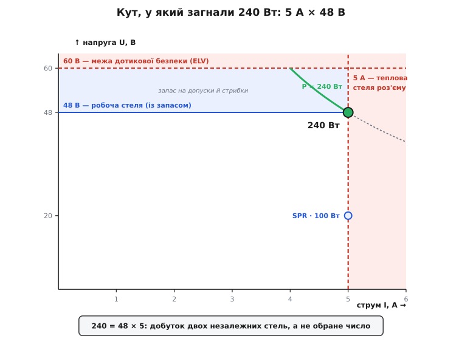
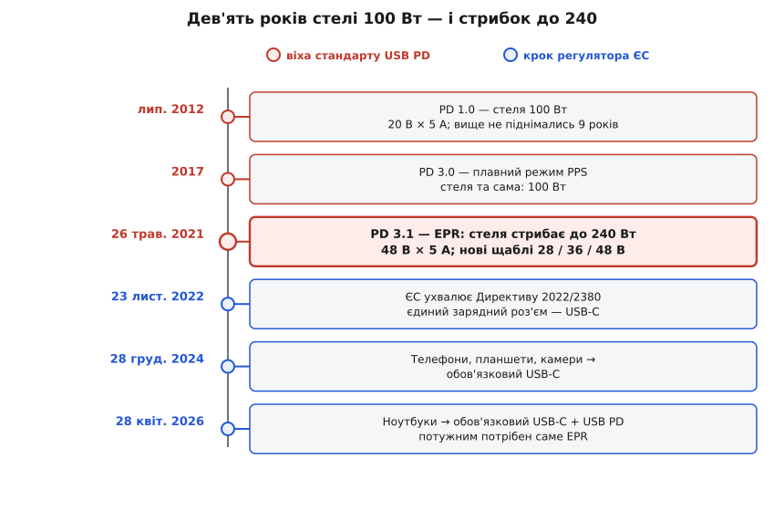

# 📜 Як народилися 240 ват на USB-C

Дев'ять років поспіль стеля USB Power Delivery стояла незрушно — рівно сто ватів. А тоді, одним переглядом специфікації, підскочила більш ніж удвічі, до **240**, і все це — на тому самому роз'ємі, тим самим кабелем за формою. Найцікавіше в цій історії те, що жодне з двох магічних чисел — ні 240 ватів, ні 48 вольтів — насправді **ніхто не обирав**. Вони випали самі, затиснуті між двома твердими стінами, а всю справу підпалили знизу регулятори в Брюсселі. Розберімо, як це сталося.

## Стеля в сто ватів, що трималася дев'ять років

Почнімо з того, звідки взялися ті сто ватів. У липні 2012 року USB Promoter Group — вузьке коло компаній, що веде специфікації USB, — випустила першу редакцію [USB Power Delivery](topic:com-devices/usb-pd), протоколу, яким джерело й пристрій домовляються про напругу та струм. Найвищий профіль тієї першої версії давав **100 ватів: 20 вольтів на 5 амперах**. І ця стеля протрималася майже дев'ять років.

Щоб відчути, чому так довго, згадаймо контекст. На початку 2010-х телефон брав із зарядки ват п'ять, планшет — десяток. Сто ватів здавалися захмарними: їх вистачало навіть тонкому ноутбукові. USB-C, що з'явився 2014-го, разом із оновленим PD пообіцяв солодку мрію — **один кабель на все**: телефон, планшет, ноутбук від однієї цеглинки. І для більшості пристроїв обіцянку дотримали. Специфікація тим часом дорослішала — редакція 3.0 близько 2017-го додала тонкий режим плавної напруги PPS, — але **стеля потужності не рухалася**: усі ці роки вершиною лишалися ті самі сто ватів.

От тільки «все» виявилося не зовсім усім. Ігровий ноутбук, робоча станція, мобільний монітор із яскравою підсвіткою тягли **півтори, дві, а часом і всі дві з чвертю сотні ватів** — і для них сто було замало. Такі пристрої й далі волочили за собою власну цеглину з круглим штекером, кожен виробник — свою. Мрія «один кабель» об них розбивалася: USB-C міг усе, крім найпотужнішого, а найпотужніше і є те, заради чого тягнешся по грубий блок. Щоб мрія справдилася до кінця, стелю треба було зламати.

## 26 травня 2021: сімка знімає стелю

Зламали її **26 травня 2021 року**. Того дня USB Promoter Group оголосила USB Power Delivery редакції **3.1** — оновлення, що піднімало стелю зі ста ватів аж до **240**.

Хто така ця Promoter Group, варто сказати окремо, бо стандарт — це завжди чиясь домовленість. Це семеро: **Apple, Hewlett-Packard, Intel, Microsoft, Renesas, STMicroelectronics і Texas Instruments**, під головуванням **Бреда Сондерса** (Brad Saunders). Саме вони роками ведуть родину специфікацій USB; те, що на пресрелізі коротко звуть «USB PD 3.1», — плід їхньої спільної згоди.

Що ж додала редакція 3.1? Новий, вищий поверх над звичним діапазоном потужності. Старий діапазон до ста ватів заднім числом назвали **SPR** (*standard power range* — стандартний), а надбудову над ним — **EPR** (*extended power range* — розширений). EPR приніс три нові фіксовані щаблі напруги — **28, 36 і 48 вольтів**, — що на п'яти амперах дають 140, 180 і 240 ватів. Роз'єм лишився той самий, форма кабелю — та сама; оновили тільки вимоги до самого шнура (специфікацію USB-C підняли до редакції 2.1, яка визначає кабелі під 240 ватів). Уся суть зміни — наскільки високо система дозволяє собі підняти напругу. І в цьому «наскільки високо» ховається вся інженерія, до якої ми переходимо.

## Заборонений хід: чому не струм

Найперша, найспокусливіша думка, коли потужності бракує, — «хай тече більше струму». Вона **заборонена**, і саме заборона визначила все подальше.

Потужність — це напруга на струм, `P = U · I`, тож дати більше ватів можна, крутячи будь-який множник. Але множники нерівноцінні. Контакти роз'єму USB-C — крихітні мідні пелюстки — розраховані щонайбільше на **5 ампер**. Це теплова стеля: струм гріє контакт за квадратом (грів ∝ I²), і більше п'яти ампер просто перепалило б з'єднання. Щоб видобути 240 ватів на звичних двадцяти вольтах, довелося б пустити 12 ампер — і роз'єм із кабелем спеклися б.

Отже, струм затиснутий п'ятьма амперами намертво, і єдиний вільний множник — напруга. Проста арифметика показує, куди це веде:

```
Потрібно:               P = 240 Вт
Струм — стеля роз'єму:  I = 5 А
Тоді напруга:           U = P / I = 240 / 5 = 48 В
```

Число 48 не вигадали — його **порахували**, поділивши бажану потужність на єдиний струм, який роз'єм фізично тримає. Це перша з двох стін, між якими затисло всю EPR.

## Стеля згори: шістдесят вольтів, за які не можна

Якщо потужність добувають напругою, постає дражлива думка: а чому спинилися на 48? Чому не 60, не 100 вольтів — було б іще більше ватів тим самим струмом? Відповідь — друга стіна, і зроблена вона з людської шкіри.

В електробезпеці побутової електроніки є усталена межа. За чинним стандартом безпеки такої техніки (IEC 62368-1) джерело, якого пересічній людині **вільно можна торкатися**, мусить триматися нижче за **60 вольтів постійного струму** (це поріг класу ES1). Нижче цієї межі напруга за звичайних умов не проб'є суху шкіру й не пожене крізь тіло небезпечного струму. А USB-C — це роз'єм, який мільярди людей стромляють пальцями, часом мокрими, наосліп у темряві. Тримати його напругу під цією межею — не забаганка, а умова, за якої такий роз'єм узагалі можна віддати в руки будь-кому.

Ось чому 48, а не 60. Сорок вісім обрані так, щоб із усіма допусками — просіданнями під навантаженням, перехідними стрибками при перемиканні — напруга **ніколи** не перескочила фатальні 60. Проміжок від 48 до 60 — це не змарновані ватти, а запас безпеки, який поглинає викиди. Піти на 54 чи 56 дало б трохи більше потужності, але з'їло б цей запас; а 60 з гаком уже вивело б USB-C з розряду «безпечно на дотик».

І тут варто помітити красиву річ: число 48 в інженерії далеко не нове. Понад століття телефонні станції живляться від батареї на **мінус 48 вольтів** — і причини того давнього вибору були різні (зручна послідовність свинцевих елементів, боротьба з корозією клем, і серед них — тримання нижче за поріг ураження). Хай яка з причин важила тоді найбільше, підсумок промовистий: 48 вольтів давно осіли в інженерії як «найвища зручна напруга, що ще певно нижча за небезпечну». USB прийшов до того самого числа з тієї самої турботи — і лише успадкував давню стелю дотикової безпеки.

## Число, якого не обирали

Тепер зведімо дві стіни докупи — і побачимо найкрасивіше в усій історії.

Є дві **незалежні** межі, кожна зі свого світу. Одна — з фізики роз'єму: струм не вище **5 ампер**, інакше плавляться контакти. Друга — з безпеки людини: напруга не вище **48 вольтів** робочих, щоб із запасом лишитися під 60. Жодна з них не знає про іншу; одну диктує мідь, другу — шкіра. А тепер перемножмо їх:

```
5 А  (стеля роз'єму)  ×  48 В  (стеля напруги)  =  240 Вт
```

Ось звідки взялися 240. Ніхто не сідав із думкою «зробімо рівно 240 ватів» — це число **випало** саме, як добуток двох стель, що зійшлися. Обидві межі впираються рівно в точку «5 ампер на 48 вольтах»: вище по струму не пускає роз'єм, вище по напрузі — безпека. Двісті сорок — не мета, а наслідок.


*Двісті сорок ватів у кутку між двома стінами. Праворуч — теплова стеля роз'єму (5 А), згори — межа дотикової безпеки (60 В). Крива P = 240 Вт проходить крізь дозволений куток лише вузькою дугою, і робоча точка сідає в самий ріг: 5 А × 48 В. Ще нижче, на тих самих 5 А, сиділа стара стеля SPR — 20 В × 5 А = 100 Вт.*

Саме тому в цих числах є щось невблаганне: їх не було з чого обирати. Дай інженерам ту саму задачу вдруге — і, поки роз'єм тримає 5 ампер, а дотикова безпека кладе стелю коло 48 вольтів, вони знову вийдуть на 240. Це рідкісний випадок, коли «магічне число» стандарту виявляється просто чесною арифметикою двох обмежень.

## Поштовх ззовні: Брюссель і єдиний роз'єм

Лишається питання, від якого історія стає по-справжньому людською: а чому взагалі стелю зламали **саме тоді**? Ігрові ноутбуки хотіли більше давно. Останній поштовх дали не вони, а регулятор.

Європейський Союз довго й безуспішно вмовляв галузь звести всі зарядки до одного роз'єму. Ще 2009-го Єврокомісія виторгувала **добровільну** угоду: чотирнадцять компаній, серед них Apple, Nokia й Samsung, пообіцяли перейти на micro-USB. Та в угоді була шпарина — дозволялися **перехідники**. І коли 2012-го Apple випустила iPhone 5 із власним роз'ємом Lightning, вона формально дотрималася обіцянки, доклавши окремий перехідник Lightning→micro-USB. Добровільний підхід провалився: поки дозволені перехідники, єдиного роз'єму не буде.

Тож ЄС перейшов від умовлянь до закону. **23 листопада 2022 року** ухвалено Директиву (ЄС) 2022/2380 — «про єдиний зарядний пристрій». Вона робить **USB-C обов'язковим** роз'ємом і вимагає, щоб зарядка йшла протоколом USB Power Delivery — тобто будь-яка PD-зарядка мусить працювати з будь-яким пристроєм. Строки — східчасті: з **28 грудня 2024** правило накрило телефони, планшети, камери, навушники, портативні колонки, читалки, миші й клавіатури; а з **28 квітня 2026** — **ноутбуки**. Мотив прямий: викинуті й незужиті зарядки — це близько **11 тисяч тонн** електронного брухту щороку, а єдиний роз'єм заощадить споживачам до **250 мільйонів євро** на рік.

І ось де EPR стає не забаганкою, а необхідністю. Ноутбук, що тягне 140 чи 200 ватів, за новим законом мусить заряджатися по USB-C протоколом PD — тим самим кабелем, що й телефон. Але сто ватів SPR йому мало; дотягтися до його апетиту, лишившись усередині USB-C, здатен **тільки** EPR. Виходить, специфікація 2021-го й закон 2026-го — дві половини однієї історії: спершу мусила з'явитися **спроможність** дати 240 ватів безпечно, і лише тоді регулятор зміг **зажадати**, щоб навіть потужний ноутбук жив на одному спільному роз'ємі.


*Дев'ять років стелі — і стрибок. Червоні віхи — розвиток стандарту USB PD, сині — кроки регулятора. Стеля потужності стояла на 100 ватах від 2012-го й підскочила до 240 аж 2021-го; за нею підтягнувся закон, що з квітня 2026-го жадає USB-C навіть від ноутбуків — а їм для цього потрібен саме EPR.*

Двісті сорок ватів — це, зрештою, число, яким мрію «один кабель від телефона до робочої станції» нарешті **договорили** до кінця. Його не вигадали маркетологи й не спустили згори регулятори: воно випало з добутку п'яти ампер, що їх тримає мідь роз'єму, на сорок вісім вольтів, під якими ще безпечна людська рука. А закон лише подбав, щоб ця арифметика дісталася кожному ноутбукові в Європі.
