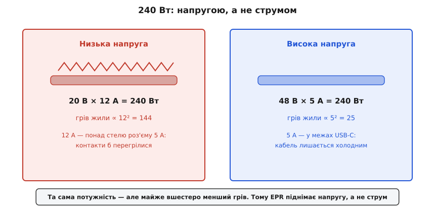
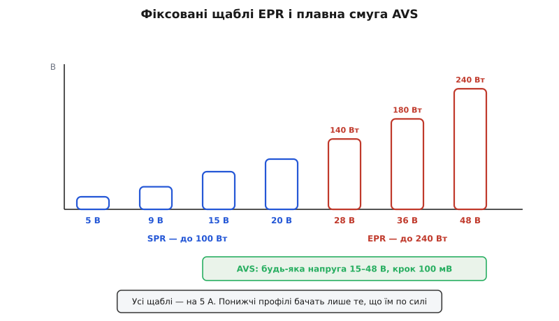
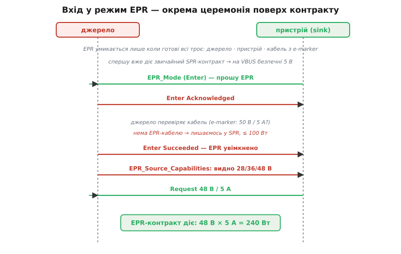
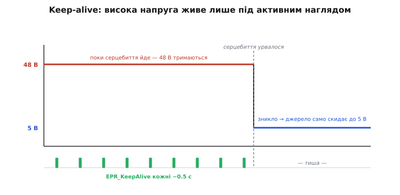

# USB PD EPR: 240 ват на USB-C

<preknowlist>
- [USB Power Delivery](topic:com-devices/usb-pd) — переговори по лінії CC: джерело шле меню профілів (PDO), пристрій просить один, укладається контракт «напруга + струм».
- [Type-C без PD](topic:com-devices/type-c-cc) — дві лінії CC, підтяжки Rp/Rd; саме по CC йде вся цифрова розмова.
- [USB PD sink](topic:hw-power/usb-pd-sink) — дисципліна приймача: висока напруга доходить до схеми лише через ключ, і лише після сигналу «напруга стоїть».
</preknowlist>

Класичний USB Power Delivery упирається в стелю **100 ват** — 20 вольтів на 5 амперах. Телефонові й тонкому ноутбуку цього досить, а от ігровому ноутбуку чи робочій станції — ні: їм треба 140, 180, а часом і всі 240 ват. Постала спокуслива думка: якщо потужності мало, хай тече більше струму. Саме тут і починається вся інженерія EPR — бо цей найпростіший хід **заборонений**, і зрозуміти, чому, означає зрозуміти EPR цілком.

**EPR** (англ. *extended power range* — «розширений діапазон потужності») — це надбудова над звичайним PD, додана у версії PD 3.1, що піднімає стелю зі 100 аж до **240 ват**. Не новий роз'єм, не новий кабель за формою — та сама USB-C, та сама лінія CC, ті самі переговори. Змінюється одне: наскільки високо система дозволяє собі підняти напругу. І геть усе інше в EPR — це запобіжники навколо цієї вищої напруги.

## Чому напругу, а не струм

Потужність — це добуток напруги на струм: `P = U · I`. Щоб дістати більше ват, можна крутити будь-який із двох множників. Але множники ці зовсім нерівноцінні, і причина — у гріві кабелю.

Тонка мідна жила в шнурі має опір, і струм, що крізь неї тече, гріє її за законом Джоуля: втрати ростуть як **квадрат** струму, `P_втрат = I²·R`. Напруга ж на цей грів не впливає ніяк — вона лише «штовхає» ту саму потужність меншим струмом. Тому подвоїти напругу — це подвоїти потужність **задарма**, не додавши кабелю ані градуса; а подвоїти струм — це вчетверо більше тепла в тому самому дроті.


*Однакові 240 Вт двома способами. Зліва — 20 В × 12 А: струм великий, грів кабелю ∝ 12² = 144. Справа — 48 В × 5 А: грів ∝ 5² = 25, майже вшестеро менший. До того ж 12 А розплавили б контакти роз'єму, а 5 А — стеля, яку USB-C витримує. Тому потужність добувають напругою, а не струмом.*

У USB-C є ще й жорстка межа знизу: контакти роз'єму й найтонші жили розраховані щонайбільше на **5 ампер**. Це стеля не з примхи — більший струм просто перегріє мідну пелюстку в роз'ємі. Отже, зверху струм затиснутий п'ятьма амперами, і єдиний спосіб дати більше потужності — піднімати напругу. Ось звідки бере початок увесь EPR.

**Однакові 240 Вт двома способами — і що станеться з кабелем.**
```
Спосіб А (низька напруга):  240 Вт = 20 В × 12 А
Спосіб Б (висока напруга):  240 Вт = 48 В ×  5 А

Грів жили пропорційний квадрату струму (P_втрат = I²·R).
Хай опір усього шляху жили R = 0.05 Ом:
  А:  P_втрат = 12² × 0.05 = 7.20 Вт гріється в кабелі
  Б:  P_втрат =  5² × 0.05 = 1.25 Вт
  А / Б ≈ 5.8 разу
```
**Висновок.** Та сама потужність — але спосіб Б гріє кабель майже вшестеро менше, а струм лишається в тих п'яти амперах, які роз'єм фізично тримає. Дванадцять ампер розплавили б контакти; п'ять — ні. Тому EPR добуває свої 240 ват, піднімаючи напругу до 48 вольтів, а не роздуваючи струм. Повніше цю арифметику — з межами AVS і запасом до безпечної напруги — розібрано в [математиці розподілу потужності EPR](topic:com-devices/usb-pd-epr/math-power-heat.md).

> 🔧 **Навіщо це.** Коли обираєте, як подати потужному вузлу багато ват через USB-C, це правило вирішує все: тягтися по вищу напругу, а не по більший струм. Спроєктуєте вхід на 20 В і спробуєте вичавити з нього 200 ват — упретесь у 10 ампер, яких роз'єм не дасть, і кабель грітиметься. Той самий вузол на 48 В бере 4 ампери, холодний кабель і тонші жили.

## Сходи потужності: 28, 36, 48 вольтів

Звичайний PD (його звуть **SPR**, англ. *standard power range* — «стандартний діапазон потужності») пропонує фіксовані щаблі напруги 5, 9, 15 і 20 вольтів. EPR добудовує над ними три нові: **28, 36 і 48 вольтів**. Усі — на тих самих 5 амперах, тож кожен щабель відкриває свій рівень потужності.


*Фіксовані профілі. SPR-щаблі (5/9/15/20 В) доводять до 100 Вт. EPR додає 28 В (до 140 Вт), 36 В (до 180 Вт) і 48 В (до 240 Вт) — усі на 5 А. Знизу — смуга AVS: у режимі EPR джерело вміє дати будь-яку напругу від 15 до 48 В кроком 100 мВ, а не лише ці щаблі.*

Виходить проста драбина, де кожен щабель — це стеля потужності:

```
28 В × 5 А = 140 Вт
36 В × 5 А = 180 Вт
48 В × 5 А = 240 Вт   ← вершина EPR
```

Джерело виставляє щаблі за своєю спроможністю: зарядка на 140 ват дасть щаблі до 28 вольтів, зарядка на 240 — усі три. Логіка ступінчаста: пристрій, якому треба менш як 140 ват, не побачить 36 і 48 вольтів у меню взагалі — навіщо дражнити напругою, яка не знадобиться. А сам вибір щабля лишається за пристроєм, точнісінько як у звичайному PD: джерело [пропонує меню профілів](topic:com-devices/usb-pd), пристрій бере той, що йому пасує й що він витримає.

## AVS: плавна напруга замість щаблів

Фіксовані щаблі — це грубі сходинки: рівно 28 чи рівно 48 вольтів. Але EPR має й тонший інструмент — **AVS** (англ. *adjustable voltage supply* — «регульоване джерело напруги»). Це не одна напруга, а цілий діапазон: пристрій може попросити **будь-яку напругу від 15 до 48 вольтів** дрібним кроком **100 мілівольтів**, і джерело її видасть.

Навіщо плавність, коли є щаблі? Бо пристрій рідко хоче рівно 48 — йому потрібно рівно стільки, скільки вимагає його вузол просто зараз. Понижувальний перетворювач усередині ноутбука працює тим ефективніше, чим ближча вхідна напруга до тієї, що йому справді треба; AVS дає підігнати вхід під потребу з точністю до десятків мілівольтів, замість гріти зайву різницю на щаблі.

Тут корисно не сплутати AVS із **PPS** (англ. *programmable power supply* — «програмоване джерело живлення»), тонким режимом звичайного PD. Вони схожі — обидва дають плавну напругу, — але різні за призначенням. [PPS](topic:com-devices/usb-pd) працює в низьких напругах, кроком аж 20 мілівольтів, і головне — **сам обмежує струм**, тобто вміє бути повноцінним [CC/CV-джерелом](topic:hw-power/cc-cv-bms) і заряджати літієву банку напряму. AVS ж кроком грубіший (100 мВ) і струм **не обмежує** — його ліміт заданий профілем, а не керується на льоту. Тобто AVS — це «плавна ручка напруги» для великих потужностей, а PPS — «розумна зарядка» для малих. EPR-джерело часто пропонує і те, й те: PPS унизу для прямої зарядки, AVS угорі для гнучкого живлення потужного вузла.

## Чому саме 48, а не 60 чи 100 вольтів

Якщо потужність добувають напругою, чому EPR спинився на 48 вольтах, а не поліз вище? Відповідь — людська рука.

Є усталена межа електробезпеки: напругу **до 60 вольтів постійного струму** вважають **наднизькою** (англ. *extra-low voltage*, ELV) — такою, що за нормальних умов безпечна на дотик, не пробиває суху шкіру й не спричиняє небезпечного струму крізь тіло. USB-C — роз'єм, який мільярди людей стромляють пальцями, часом мокрими, у темряві навпомацки. Тримати його напругу нижче за цю межу — не забаганка, а умова, за якої взагалі можна віддавати такий роз'єм пересічному користувачеві.

Сорок вісім вольтів обрані рівно так, щоб з усіма допусками — коливаннями під навантаженням, перехідними стрибками — напруга ніколи не перескочила ті 60. Лишається запас: піти на 54 чи 56 вольтів дало б трохи більше ват, але з'їло б цей запас безпеки, а 60 з гаком уже вивело б USB-C з категорії «безпечно на дотик» — і тоді довелося б обгороджувати роз'єм зовсім іншими вимогами. Тож 48 — це не кругле число з примхи, а найвища напруга, що ще влазить під стелю дотикової безпеки з розумним запасом.

## Троє мусять погодитися

Оскільки EPR оперує небезпечнішою напругою, він вмикається лише за суворішої умови, ніж звичайний PD. Домовитися про 48 вольтів можуть тільки тоді, коли EPR підтримують **усі троє** учасників: **джерело**, **пристрій** і — що нове — **кабель**.

Кабель тут раптом стає повноправною стороною переговорів, і не дарма. Дешевий п'ятивольтовий шнур не розрахований на 48 вольтів: у нього тонша ізоляція, інші контакти, слабші конденсатори. Пустити по ньому EPR — ризикнути пробоєм. Тому EPR-кабель мусить нести всередині штекера чип — **e-marker** (англ. *electronically marked* — «електронно маркований»), що цифрово засвідчує: «я розрахований на 50 вольтів і 5 ампер, мені можна EPR». Джерело під час переговорів **опитує** цей чип, і якщо кабель EPR не заявляє — або чипа нема взагалі, як у простого шнура, — система чемно лишається на звичних SPR-щаблях до 100 ват. Детальніше, як влаштований і що саме зберігає [чип-маркер кабелю](topic:com-devices/e-marker), — окрема тема; тут важливо, що без його «так» до 48 вольтів справа не дійде.

Ось чому e-marker на EPR **обов'язковий**, а не бажаний, як на простих 5 амперах: 48 вольтів на невідомому дроті — це те, чого стандарт просто не має права допустити наосліп. Кабель мусить сам голосно заявити про свою спроможність, а мовчання читається як «я звичайний, вище 20 вольтів не пускай».

> 🔧 **Навіщо це.** Це найчастіша причина, чому «EPR-зарядка й EPR-ноутбук чомусь дають лише 100 ват»: між ними опинився звичайний кабель без EPR-маркера. Купуючи чи закладаючи в пристрій кабель під високу потужність, перевіряйте не роз'єм, а саме e-marker на 240 ват — без нього два найдорожчі кінці лишаться на SPR.

## Як EPR умикається: вхід у режим

Звичайний PD піднімає напругу одразу після під'єднання. EPR так не робить — він вимагає окремої, свідомої церемонії **входу в режим**, і починається вона вже **поверх** звичайного контракту.


*Спершу вже діє звичайний SPR-контракт (безпечні 5 В). Тоді пристрій (sink) сам просить **EPR_Mode (Enter)** — вхід у режим веде саме приймач. Джерело підтверджує, перевіряє кабель (опитує e-marker: 50 В / 5 А?) і, якщо все гаразд, каже **Enter Succeeded**. Лише тепер джерело шле розширене меню з профілями 28/36/48 В, і пристрій просить потрібний — напр. 48 В / 5 А.*

Послідовність така. Спершу все як завжди: під'єднання, [резистори CC](topic:com-devices/type-c-cc), звичайний PD-контракт на безпечних 5 вольтах. Аж потім пристрій, який хоче більше, надсилає особливе повідомлення **EPR_Mode** зі значенням «Enter» — «прошу увійти в розширений режим». Ініціатива тут завжди за **приймачем** (тим, хто бере живлення): джерело саме на EPR не переходить, воно чекає прохання. Джерело відповідає «підтверджую», перевіряє кабель — опитує e-marker, чи тягне той 50 вольтів, — і, якщо все склалося, завершує «вхід удався». Лише **після** цього джерело викладає **розширене** меню, де вперше з'являються високі профілі 28/36/48 вольтів, і пристрій може попросити свій.

Чому такі складнощі, а не просто ще один рядок у звичайному меню? Бо високих профілів **не має бути видно**, поки система не переконалася, що навпроти справді EPR-здатний пристрій і справжній EPR-кабель. Сама поява 48 вольтів у меню — це вже подія, до якої треба дорости трьома підтвердженнями. До того ж розширене меню довше за звичайне й не влазить у коротке PD-повідомлення, тож його шлють по частинах особливим форматом — це вже [тонкощі рівня повідомлень PD](topic:com-devices/usb-pd-protocol). Для проєктувальника ж головне те, що EPR — це **окремий крок згоди поверх звичайного контракту**, а не автоматичне продовження.

## Живий контракт: серцебиття keep-alive

І остання, найкрасивіша осторога EPR. Домовитися про 48 вольтів мало — цю домовленість треба **безперервно підтверджувати**, інакше вона згасне сама.


*У режимі EPR пристрій мусить приблизно кожні пів секунди слати джерелу коротке **EPR_KeepAlive** — «я живий, тримай напругу». Поки серцебиття йде, на шині стоять 48 В. Щойно імпульси зникли (пристрій завис, кабель смикнули), джерело за таймаутом **само скидає** напругу назад до безпечних 5 В. Небезпечна напруга живе рівно доти, доки її активно підтримують.*

У режимі EPR приймач зобов'язаний періодично — приблизно кожні пів секунди — надсилати джерелу коротеньке повідомлення **EPR_KeepAlive** (англ. *keep-alive* — «підтримання зв'язку»), таке собі серцебиття «я тут, я стежу». Джерело на кожне відповідає й скидає свій таймер. А якщо серцебиття урвалося — пристрій завис, прошивка впала, штекер висмикнули — джерело за таймаутом робить висновок, що на тому кінці вже нема кому відповідати за 48 вольтів, і **само** скидає напругу назад до безпечних п'яти.

Вдумаймося, чому це саме так. Звичайні 5 вольтів безпечні самі собою — їх можна лишити на мертвому, від'єднаному пристрої, нічого не станеться. Сорок вісім вольтів — ні: лишити їх висіти на завислому чи покинутому вузлі означало б тримати небезпечну напругу без нагляду. Серцебиття перетворює високу напругу на щось, що **існує лише під активною увагою**: живий, притомний приймач мусить безперервно доводити, що він на місці й тримає ситуацію. Зникла увага — зникла й напруга. Це та сама наскрізна звичка PD — «за будь-якого сумніву впади в безпечне», — доведена в EPR до постійного, щопівсекундного підтвердження.

> 🔧 **Навіщо це.** Прошивка вашого EPR-приймача мусить мати надійний таймер, що шле keep-alive навіть коли пристрій зайнятий чимось важким. Проґавите кілька імпульсів — джерело скине вас із 48 на 5 вольтів посеред роботи, і потужний вузол просяде на рівному місці. Тому серцебиття keep-alive закладають у найнадійнішу частину прошивки, поряд зі сторожовим таймером, а не в звичайний цикл, який може підвиснути.

## Як дати пристрою EPR

Практично приймач EPR — це той самий [PD-стік](topic:hw-power/usb-pd-sink) з усією його дисципліною, плюс дві нові турботи. Уся звична обережність лишається: висока напруга доходить до чутливої схеми лише через [керований ключ](topic:hw-power/load-switch), який замикають аж після сигналу «напруга стоїть», а до того на пристрої безпечний мінімум. Понад це EPR-приймач мусить уміти **ввійти в режим** (повести церемонію EPR_Mode) і **тримати серцебиття** keep-alive, поки бере високу напругу.

Складність тут зросла, тож і рівнів реалізації, як у звичайного PD, три. Найпростіший — готовий **чип-тригер** з EPR: ви задаєте бажану напругу (скажімо, 28 чи 48 вольтів), а чип сам веде і вхід у режим, і keep-alive, і видає сигнал «контракт є» для ключа — без жодного рядка коду. Складніший — окремий **PD-контролер** під керуванням вашого мікроконтролера. Найгнучкіший — власний **PD-стек** на процесорі, що сам говорить протокол. Робочий приклад такого стіка — з входом у EPR, запитом напруги й таймером keep-alive — розібрано в [прошивці EPR-приймача](topic:com-devices/usb-pd-epr/proj-epr-sink.md).

Що штовхає всю цю складність у життя — не лише ігрові ноутбуки. Із квітня 2026 єдиний зарядний роз'єм для ноутбуків у Євросоюзі — це USB-C, і щоб потужний ноутбук справді заряджався від нього тим самим кабелем, що й телефон, потрібен саме EPR. Як народилися ці 240 ват і чому регулятори вхопилися за USB-C, — окрема [історія розширеного діапазону](topic:com-devices/usb-pd-epr/hist-epr-240w.md).

## Підсумок теми

EPR розширює USB Power Delivery зі 100 до **240 ват**, і роблять це, піднімаючи напругу, а не струм: грів кабелю росте як квадрат струму, а роз'єм USB-C тримає щонайбільше 5 ампер, тож єдиний шлях до більшої потужності — вища напруга. EPR додає фіксовані щаблі **28/36/48 вольтів** (140/180/240 ват на 5 А) і плавний режим **AVS** (15–48 В кроком 100 мВ, без керування струмом — на відміну від PPS). Спинилися на 48 вольтах, щоб з усіма допусками лишитися під **60 В** — межею напруги, безпечної на дотик. Через ту вищу напругу EPR обкладений осторогами: він умикається лише коли готові **всі троє** — джерело, пристрій і кабель з обов'язковим **e-marker** на 50 В; вхід у режим — окрема свідома церемонія **EPR_Mode** поверх звичайного контракту, яку веде приймач; а сама висока напруга живе тільки доки приймач шле щопівсекундне серцебиття **keep-alive**, інакше джерело само скидає її до безпечних 5 вольтів. Реалізують EPR тими ж трьома шляхами, що й PD, — тригер, контролер чи власний стек, — і не ускладнюють без потреби.
