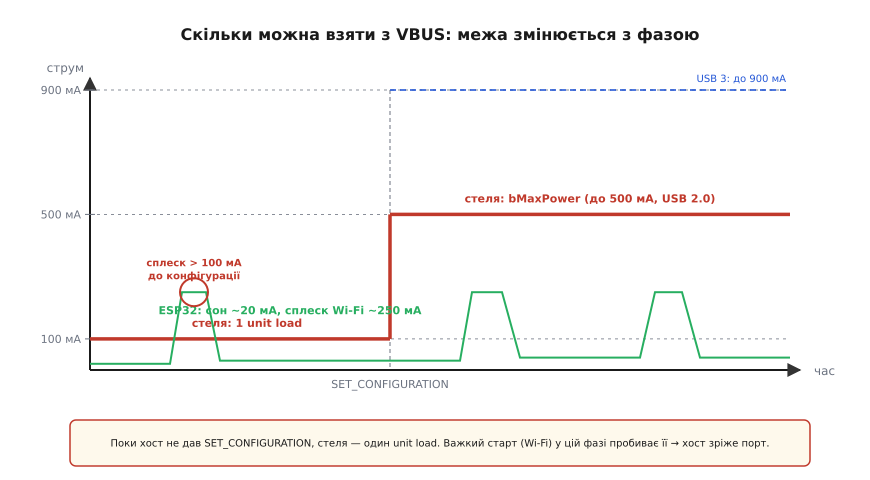
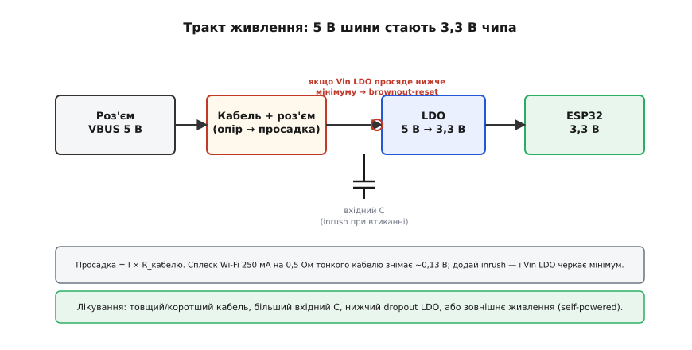

# Живлення з USB

<preknowlist>
- [Енумерація USB](topic:com-devices/usb-enumeration) — хост опитує пристрій і командою `SET_CONFIGURATION` дозволяє йому працювати; саме ця подія ділить бюджет струму на «до» і «після».
- [Закон Ома](topic:hw-analog/ohms-law) — напруга = струм · опір; на опорі кабелю будь-який струм створює падіння напруги.
- [Лінійний стабілізатор LDO](topic:hw-power/ldo) — знижує 5 В шини до 3,3 В чипа й потребує невеликого запасу напруги між входом і виходом (dropout).
</preknowlist>

Кабель USB несе не лише дані. Поряд із лініями зв'язку в ньому йде **VBUS** (від англ. *V* — напруга, *bus* — шина) — провід із постійними **+5 В**. Для розробника прошивки це спокуса: одна розетка — і пристрій працює, не треба окремого блока живлення. Та порт не є бездонним джерелом. Він віддає рівно стільки струму, скільки дозволяє стандарт, і тільки тоді, коли пристрій правильно про себе заявив. Якщо взяти більше, ніж домовлено, хост має повне право вимкнути живлення — і ваш мікроконтролер вимкнеться разом із ним. Тому питання «скільки я можу взяти з USB і як це зробити безпечно» — не дрібниця живлення, а частина того, чи стартує пристрій узагалі.

Тут ми дивимося на USB **з боку розробника пристрою**: скільки міліампер реально доступно, у який момент, і що зробити, щоб плата не перезавантажувалася на рівному місці. Сама карта профілів живлення — звідки беруться 5 В, 9 В, 20 В, як USB виріс від 500 мА до сотень ват — викладена окремо: [карта живлення через USB](root:embedded/usb-power-map). Тут — практика прошивки.

## Дві ролі: bus-powered і self-powered

Перше рішення, яке закладають у пристрій, — звідки він бере енергію.

Пристрій, що живиться **виключно від шини**, називають **bus-powered**: усю свою енергію він тягне з VBUS. Маленький USB-стик, перехідник, брелок, проста плата на мікроконтролері — усе це bus-powered. Пристрій, що має **власне джерело** (зовнішній адаптер, акумулятор), — **self-powered**: VBUS він може взагалі не чіпати або брати з нього зовсім трохи.

Хост мусить знати, до якого табору належить пристрій, бо від цього залежить, чи вистачить йому потужності на всіх. Цю інформацію пристрій повідомляє в [дескрипторі конфігурації](topic:com-devices/usb-enumeration) — структурі, яку хост зчитує при підключенні. Два поля несуть усе потрібне:

- `bmAttributes` — прапорець, чи живиться пристрій від шини, а чи має власне джерело;
- `bMaxPower` — скільки струму пристрій збирається тягти з VBUS, **в одиницях по 2 мА** (USB 2.0). Тобто значення 50 означає 100 мА, значення 250 — максимальні 500 мА.

Хост складає докупи запити всіх під'єднаних пристроїв і порівнює із власним запасом. Якщо сума перевищує те, що він може віддати, він має право **не ввімкнути порт** або **вимкнути** його. Для bus-powered пристрою це фатально: він просто не отримає живлення.

> 🔧 **Навіщо це.** Чесний `bMaxPower` — не формальність. Заявите менше, ніж берете насправді, — пристрій працюватиме, доки хост не вирішить навести лад на перевантаженому хабі й не вимкне «нахабу». Заявите забагато — слабкий хаб може відмовити ще до старту. Цифра в дескрипторі має відповідати реальному піковому споживанню плати.

## Бюджет струму: межа змінюється з фазою

Головна ідея живлення з USB така: **доступний струм не сталий**. Він залежить від того, на якому етапі діалогу з хостом пристрій зараз перебуває. Логіка проста й захисна — хост не довіряє повну потужність комусь, кого ще не впізнав.

**Поки пристрій не сконфігуровано.** З миті, коли його щойно під'єднали, і доти, доки хост не надішле команду `SET_CONFIGURATION` (фінальний акорд [енумерації](topic:com-devices/usb-enumeration)), пристрій має право брати не більше **одного unit load** (англ. *unit load* — одиниця навантаження). Для USB 2.0 це **100 мА**, для USB 3.x — **150 мА**. Сенс межі: хост ще не знає, хто перед ним і скільки той хоче, тож видає лише безпечний мінімум, якого вистачить, щоб пристрій ожив і відповів на запити.

**Після `SET_CONFIGURATION`.** Тепер хост прочитав дескриптори, погодився з конфігурацією й дозволив пристрою брати рівно те, що той задекларував у `bMaxPower`. Стеля стандартного порту — **500 мА** для USB 2.0 і **900 мА** для USB 3.x (шість unit loads по 150 мА). Більше за стандартним механізмом порт не дасть; усе, що понад це, — то вже окремі історії на кшталт виділених зарядних портів чи [USB Power Delivery](root:embedded/usb-power-map), що домовляються інакше.

**У режимі сну (suspend).** Коли шина засинає (хост не шле трафіку понад 3 мс), пристрій мусить опуститися до **2,5 мА** — і це теж жорстка вимога стандарту, однакова для USB 2.0 і USB 3.x. Це болюча межа для bus-powered пристроїв: усе, що лишається ввімкненим уві сні (підтяжки, світлодіоди, кварц, периферія), має разом укластися в ці 2,5 мА.



*До конфігурації пробити стелю в один unit load найлегше сплеском радіо при старті — саме тут народжуються «загадкові» зриви живлення.*

## Що буде, якщо взяти більше

Стандарт описує межі, але фізично струм обмежує **сам порт хоста**. Що станеться при перевищенні — залежить від того, наскільки розумний хаб попався.

Добрий хост або хаб має на кожному порту **обмежувач струму** (зазвичай мікросхему power switch із захистом). Перевищили поріг — він просто **знеструмлює порт**. Для bus-powered пристрою це миттєва смерть живлення: мікроконтролер обривається посеред роботи, наче висмикнули кабель. Дешевий пасивний хаб без захисту поведеться гірше: він **просадить VBUS** — напруга на шині впаде нижче 5 В, і це зачепить усіх сусідів на тому самому хабі, аж до їхніх власних збоїв.

Найпідступніший випадок — коли перевищення **короткочасне**. Сплеск струму не завжди валить порт одразу, зате просаджує напругу рівно настільки, щоб ваш регулятор на платі лишився без запасу. Звідси — найчастіша причина «привидів» у пристроях на USB: плата стабільна в спокої й перезавантажується щойно вмикає щось ненажерливе.

## Від 5 В шини до 3,3 В чипа

VBUS дає 5 В, а більшість сучасних мікроконтролерів живиться від 3,3 В (а то й 1,8 В для ядра). Між шиною і чипом завжди стоїть перетворювач — найчастіше [лінійний стабілізатор LDO](topic:hw-power/ldo) (англ. *low-dropout* — з малим спадом напруги). Тракт виглядає прямим: роз'єм VBUS 5 В → LDO → 3,3 В → мікроконтролер. Та саме в цьому тракті ховаються дві пастки, про які варто знати ще до того, як плата поїде до користувача.

**Просадка на кабелі.** Кабель і роз'єми мають опір. Через закон Ома будь-який струм створює на цьому опорі падіння напруги, і чим тонший та довший кабель — тим більше падіння. На вхід LDO приходить уже не 5 В, а трохи менше. Поки споживання мале, це непомітно. Та коли плата бере пік, напруга на вході LDO просідає, і якщо вона впаде нижче мінімуму, потрібного стабілізатору (його запас між входом і виходом, той самий *dropout*), вихід просяде слідом. Мікроконтролер отримає менше за свої 3,3 В і спрацює [**brownout-детектор**](topic:hw-arch/reset-causes) (англ. *brown-out* — «просідання» напруги, на відміну від повного *black-out*) — пристрій перезавантажиться в найгірший момент.

**Inrush при втиканні.** На вході плати завжди стоїть конденсатор-накопичувач. У перші мікросекунди після під'єднання кабелю він **порожній і поводиться майже як коротке замикання**: миттєвий струм заряду (англ. *inrush* — кидок струму) у рази перевищує робочий. Звідси видима іскра на контактах роз'єму при втиканні й коротка просадка VBUS. Що більший конденсатор і тонший кабель — то глибший провал.



*Глибину просадки задають довжина й товщина кабелю, ємність вхідного конденсатора та піковий струм навантаження — усе разом сходиться на вході стабілізатора.*

## Пік передачі їсть найбільше

На платах із радіо найбільший споживач — не процесор, а **передавач**. [Wi-Fi-радіо ESP32](topic:hw-arch/esp32-architecture) у момент відправлення пакета бере **200–300 мА**, тоді як у паузах споживання падає до десятків міліампер. Ці короткі сплески й визначають піковий струм усієї плати.

Тепер з'єднаймо це з бюджетом. Якщо плата bus-powered і ввімкнена в слабкий хаб (наприклад, вбудований у клавіатуру) чи в довгий тонкий кабель, то саме сплеск Wi-Fi може опустити VBUS до межі. Симптом упізнаваний: пристрій спокійно живе, доки радіо мовчить, і раптово перезавантажується, щойно починає активно передавати.

Окремо небезпечний старт прошивки. Wi-Fi нерідко піднімають **одразу після завантаження** — а в цю мить пристрій ще може бути не сконфігурований, і стеля становить лише один unit load (100 мА для USB 2.0). Сплеск передавача легко її пробиває, і хост зрізає порт ще до того, як прошивка по-справжньому запрацювала.

## Worked-приклад: вкладаємося в бюджет порту

**Умова.** Плата на ESP32-S3 живиться від USB 2.0 bus-powered. Радіо в спокої бере 20 мА, на піку передачі — 250 мА. LDO на платі має ефективність близько 90% і мінімум входу 4,5 В. Треба перевірити, чи вкладаємося в 500 мА після конфігурації, і чи не пробиваємо 100 мА до неї.

```cpp
// Бюджет рахуємо з боку 3.3 В, тоді переводимо на бік шини 5 В.
const float p_chip  = 3.3f * 0.250f;             // 0.825 Вт — потужність чипа на піку передачі
const float i_vbus  = p_chip / (5.0f * 0.90f);   // 0.183 А — стільки LDO бере з шини (ККД 90%)
const float i_total = i_vbus + 0.020f;           // 0.203 А — плюс світлодіод і давач (~20 мА)

// Порівнюємо струм плати зі стелею кожної фази:
const bool fits_run    = i_total < 0.500f;       // true  — після конфігурації в 500 мА є запас
const bool fits_precfg = i_total < 0.100f;       // false — до SET_CONFIGURATION стелю 100 мА пробито

// Поле дескриптора: одиниці по 2 мА, тож 250 мА кодуємо як 125 (заявляємо із запасом).
const uint8_t b_max_power = 250 / 2;             // 125
```

Висновок читається прямо з чисел: на робочій фазі запас величезний, а проблема — лише в **фазі до конфігурації**. Тому важкий старт (підняття Wi-Fi) переносимо на момент, коли хост уже сконфігурував пристрій, а не виконуємо його одразу після `boot`. У прошивці на TinyUSB це означає: чекати на подію переходу в стан `configured` і лише тоді запускати радіо.

```cpp
// TinyUSB: радіо піднімаємо лише після SET_CONFIGURATION
void tud_mount_cb(void) {     // пристрій сконфігуровано хостом
    wifi_start();             // тепер 100-мА стеля знята — можна в пік
}
```

> 🔧 **Навіщо це.** Бюджет шини — причина номер один «загадкових» перезавантажень USB-пристрою. Знаючи три межі (один unit load до конфігурації, повний `bMaxPower` після неї, 2,5 мА уві сні), ви свідомо плануєте порядок старту прошивки — або одразу обираєте self-powered чи зовнішнє живлення, якщо пік плати не вкладається в порт.

## Коли мікроконтролер сам роздає живлення

Усе вищесказане — погляд із боку пристрою, що **бере** струм. Дзеркальна ситуація настає, коли [мікроконтролер сам стає хостом](topic:com-devices/usb-host) і живить підключену до нього периферію. Тоді ті самі межі VBUS він мусить дотримувати вже **як джерело**: видавати 5 В у потрібному допуску, обмежувати струм при перевантаженні, переживати inrush чужого конденсатора при під'єднанні й коректно знеструмлювати порт у разі короткого замикання. Бюджет нікуди не зникає — змінюється лише бік, з якого на нього дивляться.
