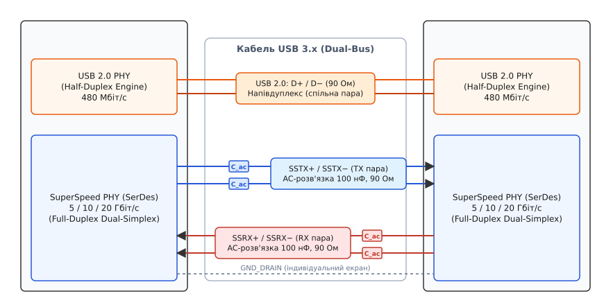
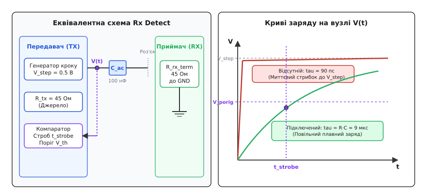
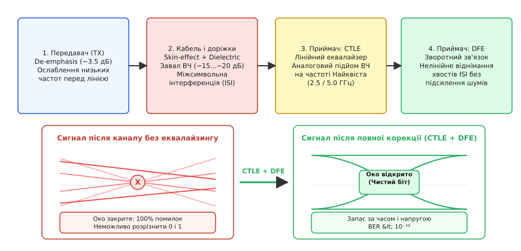
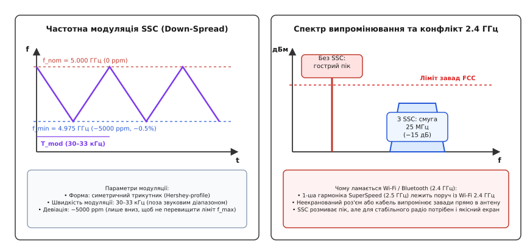

# USB 3.x фізично: SuperSpeed і вище

<preknowlist>
- [Диференційна пара](root:com-medium/differential-pair) — передача сигналу двома протифазними провідниками для компенсації синфазних завад.
- [Узгодження ліній зв'язку](root:com-medium/termination) — термінація хвильового опору резистором для усунення відбиття високочастотних хвиль.
- [Фізичний рівень USB 2.0](root:com-devices/usb-physical) — напівдуплексна пара D+/D−, рівні сигналів та обмеження смуги 480 Мбіт/с.
- [AC-розв'язка](root:hw-analog/ac-coupling) — блокування постійної складової напруги конденсатором при проходженні змінного сигналу.
</preknowlist>

Коли до порту комп'ютера підключають швидкісний зовнішній NVMe-накопичувач або відеокамеру 4K, шина USB 2.0 High-Speed вичерпує свої можливості: теоретична межа 480 Мбіт/с на практиці дає не більше 40–43 Мбайт/с корисного потоку. Причина криється у фізиці єдиної диференційної пари D+/D−, яка працює в напівдуплексному режимі (half-duplex). Щоб змінити напрямок передачі з читання на запис, контролер змушений щоразу чекати перезаряджання ємності лінії, а постійне опитування пристроїв маркерами хоста (polling) марнує смугу пропускання та навантажує центральний процесор перериваннями.

Збільшити швидкість простою зміною тактової частоти на старій парі дротів було фізично неможливо: на гігагерцових частотах ємність довгого кабелю згладжує фронти сигналів, перетворюючи імпульси на нерозпізнавану хвилю, а зміна напрямку передачі створює нездоланні затримки перемикання. Стандарт USB 3.0 розв'язав цю кризу радикальним переходом до архітектури **Dual-Simplex** (подвійний симплекс): передавання й приймання рознесли на дві фізично незалежні екрановані диференційні пари, які працюють одночасно й безперервно на швидкостях 5,0 Гбіт/с (SuperSpeed Gen 1), 10,0 Гбіт/с (SuperSpeed+ Gen 2) та 20,0 Гбіт/с (Gen 2x2).

При цьому розробники зберегли повну фізичну незалежність старої лінії USB 2.0. Як створювався цей компроміс і чому індустрія відмовилася від оптичного кабелю на користь високошвидкісної міді, розказано в [історії народження SuperSpeed та відмови від оптичного волокна](root:com-devices/usb3-physical/hist-superspeed.md).

---

## Подвійна шина: збереження зворотної сумісності

Всередині одного кабелю USB 3.x насправді функціонують дві повністю ізольовані одна від одної шини: класична напівдуплексна пара USB 2.0 (D+/D−) та виділені повнодуплексні швидкісні лінії SuperSpeed (SSTX+/SSTX− та SSRX+/SSRX−).



*Подвійна архітектура шини: лінії USB 2.0 і SuperSpeed працюють незалежно на власних парах провідників.*

У роз'ємі Type-A сумісність досягається двоярусною механічною конструкцією. Чотири стандартні передні ламелі (VBUS, D−, D+, GND) комутують живлення та USB 2.0. У глибині гнізда розташовано п'ять додаткових пружних контактів: пара передавача SSTX+/SSTX−, пара приймача SSRX+/SSRX− та спільний дренажний провідник екранування GND_DRAIN.

В інтегральних контролерах хоста і периферійного пристрою встановлено два автономних фізичних рівні (PHY):
- **USB 2.0 PHY:** традиційний приймач-передавач зі швидкістю 480 Мбіт/с.
- **SuperSpeed PHY:** гігабітний трансивер на базі апаратного серіалізатора-десеріалізатора SerDes (від англійського *Serializer/Deserializer*).

Зв'язок між швидкісним SerDes PHY та логічним рівнем протоколу всередині мікросхеми здійснюється через стандартизований паралельний інтерфейс **PIPE (PHY Interface for the PCI Express and USB SuperSpeed Architectures)**. Інтерфейс PIPE перетворює послідовний 5-гігабітний бітовий потік у 16-бітну або 32-бітну паралельну шину з тактовою частотою 250 МГц або 125 МГц. Це дозволяє цифровому ядру контролера працювати на низькій тактовій частоті, довіряючи всю складну аналогову фізику гігагерцових сигналів виділеному SerDes-блоку.

Коли пристрій під'єднують до порту, обидва контролери стартують паралельно. Якщо SuperSpeed PHY успішно детектує приймач і проходить тренування лінії, стек операційної системи монтує пристрій як SuperSpeed, а блок USB 2.0 переходить у режим очікування або обслуговує службові запити дескрипторів. Якщо швидкісні лінії пошкоджені або підключені через старий подовжувач USB 2.0, зв'язок автоматично й непомітно для користувача встановлюється через пару D+/D− на швидкості High-Speed.

У 24-контактному симетричному роз'ємі USB-C для передачі SuperSpeed задіяно дві швидкісні диференційні смуги: `TX1/RX1` (контакти A2/A3 та B10/B11) і `TX2/RX2` (контакти B2/B3 та A10/A11). У режимах Gen 1 та Gen 2 задіюється одна смуга відповідно до орієнтації штекера, а в режимі Gen 2x2 обидва канали об'єднуються, забезпечуючи сумарну смугу 20 Гбіт/с.

> 🔧 **Навіщо це.** Якщо дорогий зовнішній SSD-диск раптом починає копіювати файли зі швидкістю не вище 40 Мбайт/с, це майже завжди означає механічне забруднення або відгин хоча б одного з п'яти внутрішніх контактів SuperSpeed у гнізді Type-A: контролер не зміг встановити високошвидкісний лінк і прозоро перемкнувся на резервну пару USB 2.0.

---

## Хвильовий опір 90 Ом та узгодження ліній

На тактовій частоті 5,0 Гбіт/с тривалість одного бітового інтервалу (Unit Interval, UI) становить лише 200 пікосекунд (для 10 Гбіт/с — 100 пс). Фронт наростання сигналу триває менше ніж 50 пікосекунд. За такий малий час електромагнітна хвиля в текстоліті FR-4 встигає пройти відстань лише близько 7–10 мм:

```
v = c / √ε_r
= 300 000 км/с / √4.2    [швидкість світла у діелектрику FR-4]
≈ 146 000 км/с           [швидкість поширення електромагнітної хвилі]
= 146 мм/нс              [переведення у міліметри за наносекунду]

l_edge = v · t_rise
= 146 мм/нс · 0.05 нс    [довжина просторового фронту імпульсу]
= 7.3 мм                 [критична довжина лінії переходу]
```

Якщо геометрична довжина друкованої доріжки перевищує половину довжини фронту (понад 3,5 мм), лінія перестає бути простим провідником і перетворюється на довгу лінію передачі з розподіленими параметрами. Будь-яка неоднорідність геометрії викликає відбиття хвилі сигналу назад до передавача.

Стандарт USB 3.x строго регламентує диференційний імпеданс (від латинського *impedio* — перешкоджати) сигнальних пар:

```
Z_diff = 90 Ом ± 10 Ом
```

Кожен окремий провідник пари має непарний хвильовий опір (odd-mode impedance) відносно опорного шару землі:

```
Z_odd = Z_diff / 2
= 90 Ом / 2              [половина диференційного опору симетричної пари]
= 45 Ом                  [хвильовий опір одинарного провідника]
```

```
           Z_diff = 90 Ом (між провідниками)
     TX+ ────┬────────────────────────────┐
             │                          [R_term = 45 Ом]
            ( ) Z_odd = 45 Ом            │
            ─┴─ (до GND)                 ├─── GND (AC-земля)
                                         │
            ─┬─ (до GND)                [R_term = 45 Ом]
            ( ) Z_odd = 45 Ом            │
     TX− ────┴────────────────────────────┘
```

Значення 90 Ом обрано як компроміс між технологічними обмеженнями мінімальної ширини провідників на друкованих платах, паразитними ємностями мініатюрних роз'ємів та збереженням спадкоємності з трасуванням ліній USB 2.0.

Для усунення відбиття хвиль на обох кінцях лінії встановлено внутрішньокристальні термінатори (on-die termination):
- На боці приймача: два високоточних резистори по 45 Ом від кожного сигнального виводу на внутрішню високочастотну AC-землю.
- На боці передавача: внутрішній вихідний імпеданс драйвера, скоригований схемою калібрування точно до 45 Ом на кожне плече.

> 🔧 **Навіщо це.** При розведенні друкованої плати для USB 3.x критично витримувати фазовий зсув (skew) між провідниками однієї пари: різниця довжин доріжок між SSTX+ та SSTX− не повинна перевищувати 0,12 мм (5 mils). Асиметрія довжин перетворює диференційний сигнал на синфазну заваду, яка випромінюється платою в ефір і призводить до зриву зв'язку.

---

## Розв'язувальні конденсатори на лініях TX

На відміну від USB 2.0, де передавач безпосередньо гальванічно з'єднаний із приймачем, на лініях передавання SuperSpeed стандартом вимагається обов'язкове встановлення розв'язувальних конденсаторів (AC-coupling capacitors).

Конденсатори позначаються як `C_TX` і встановлюються послідовно в розрив кожного сигнального провідника передавача (на виводах TX+ та TX−):

```
C_TX = 75 ... 200 нФ   (типовий номінал — 100 нФ, типорозмір 0402 або 0201)
```

Конденсатори розміщуються фізично на платі джерела сигналу: передавач хоста має конденсатори на материнській платі, а передавач пристрою — на платі самого пристрою.

```
Хост (TX)                               Приймач (RX)
┌──────────────┐   C_TX = 100 нФ        ┌──────────────┐
│ Драйвер TX+  ├───┤├───[ Кабель ]──────┤ Вхід RX+     │
│              │                        │              │
│ Драйвер TX−  ├───┤├───[ Кабель ]──────┤ Вхід RX−     │
└──────────────┘   C_TX = 100 нФ        └──────────────┘
  (AC-розв'язка блокує постійний струм і зсув фаз)
```

Встановлення конденсаторів зумовлене трьома інженерними причинами:
1. **Різні технологічні норми кремнію:** Контролер хоста може бути виготовлений за техпроцесом 5 нм із напругою живлення ядра 0,8 В, тоді як мікросхема флешки виготовлена за нормами 28 нм із живленням 1,8 В. Розв'язка дозволяє кожному трансиверу виставляти власну синфазну напругу зміщення (Common Mode Voltage, `V_CM`) без ризику пробою чутливих транзисторів іншого боку.
2. **Захист від блукаючих струмів:** При підключенні пристроїв із власним живленням (наприклад, масивів дисків або принтерів) різниця потенціалів між «землями» комп'ютера та розетки могла б викликати протікання постійного вирівнювального струму через сигнальні лінії.
3. **Реалізація схеми виявлення приймача:** Саме завдяки розриву по постійному струму контролер отримує можливість перевіряти наявність підключеного кабелю за допомогою вимірювання швидкості заряду ємності.

Конденсатор діє як фільтр верхніх частот: він безперешкодно пропускає гігагерцові гармоніки інформаційних бітів, але повністю відсікає постійну складову. Зворотним боком цього рішення є вимога: потік переданих даних повинен бути строго збалансованим за постійним струмом (DC-balanced). Якщо в лінії з'явиться довга послідовність нулів або одиниць, напруга на конденсаторі зміститься, викликаючи так зване плавання базової лінії (baseline wander) та бітові помилки.

---

## Виявлення приймача через заряд ємності (Rx Detect)

Оскільки розв'язувальні конденсатори блокують постійний струм, хост не може дізнатися про підключення пристрою за падінням статичної напруги, як це робиться в USB 2.0 за допомогою підтягувальних резисторів 1,5 кОм.

SuperSpeed застосовує динамічний механізм виявлення приймача (Receiver Detection, Rx Detect). Передавач періодично формує тестовий стрибок синфазної напруги на лініях TX і за часом наростання напруги визначає, чи підключено навантаження.



*Виявлення приймача через заряд RC-ланцюжка: різниця швидкостей наростання напруги сягає п'яти порядків.*

Фізика процесу розкладається на два граничні випадки:

### Випадок 1: До порту нічого не підключено (Open Circuit)
Термінаційні резистори приймача відсутні (`R_rx → ∞`). Коло розімкнене, і струм через розв'язувальний конденсатор `C_TX = 100 нФ` текти не може. Заряджається виключно крихітна паразитарна ємність контактних площадок кристала та роз'єма `C_pad ≈ 1.5–2.0 пФ` через вихідний опір драйвера `R_tx = 45 Ом`.

Часова константа перехідного процесу становить:

```
τ_open = R_tx · C_pad
= 45 Ом · 2.0 · 10⁻¹² Ф   [паразитарне коло контактів]
= 90 · 10⁻¹² с            [обчислення добутку]
= 90 пс                   [переведення у пікосекунди]
```

Напруга на сигнальному виводі передавача підскакує до максимального рівня практично миттєво (за кілька сотень пікосекунд).

### Випадок 2: Приймач підключено (Terminated Receiver)
На дальньому кінці кабелю вхідні термінатори приймача підтягують лінії через `R_rx = 45 Ом` до землі. Утворюється замкнений послідовний RC-ланцюг:

```
R_total = R_tx + R_rx
= 45 Ом + 45 Ом           [повний опір кола передавач-приймач]
= 90 Ом                   [хвильовий опір замкненої петлі]

τ_term = R_total · C_TX
= 90 Ом · 100 · 10⁻⁹ Ф    [коло заряду AC-конденсатора]
= 9.0 · 10⁻⁶ с            [обчислення експоненти]
= 9.0 мкс                 [номінальна часова константа]
```

Часова константа заряду збільшується у 100 000 разів. Напруга на виході передавача наростає дуже повільно за експоненційним законом.

Компаратор усередині передавача стробує рівень напруги у фіксований момент часу `t_strobe ≈ 1.5 мкс`:
- Якщо напруга вже досягла максимуму (`V_sense ≈ V₀`), лінія вільна, приймача немає. Передавач залишається в режимі глибокого енергозбереження.
- Якщо напруга все ще низька (`V_sense < 0.4 В`), приймач виявлено. Фізичний рівень негайно запускає процедуру тренування лінії низькочастотними періодичними сигналами LFPS (Low Frequency Periodic Signaling).

Повний математичний апарат розрахунку експоненційних кривих та допусків наведено в [математичній моделі виявлення приймача SuperSpeed](root:com-devices/usb3-physical/math-receiver-detect.md).

---

## Низькочастотна сигналізація (LFPS) та автомат станів LTSSM

Щойно приймач фізично виявлено, контролер не може одразу запустити передачу на швидкості 5 чи 10 Гбіт/с. На гігагерцових частотах приймач ще не знає коефіцієнтів еквалайзера, фазовий автопідлаштовувач PLL не засинхронізований із лінією, а полярність диференційних дротів може бути апаратно переплутана на платі.

Для початкового узгодження та виходу зі сплячих режимів стандарт застосовує спеціальний надійний протокол низькочастотної сигналізації — **LFPS (Low Frequency Periodic Signaling)**.

Сигнал LFPS є меандром із частотою від 10 до 50 МГц (типово 20 МГц, період 50 нс). Оскільки ця частота у 250 разів нижча за робочу частоту SuperSpeed, вона проходить крізь будь-який кабель і розв'язувальні конденсатори практично без згасання й спотворень. LFPS не потребує роботи еквалайзерів чи відновлення тактової частоти — його детектує звичайний пороговий компаратор пікового детектора.

Усі переходи між режимами зв'язку керуються апаратним кінцевим автоматом **LTSSM (Link Training and Status State Machine)**:

```
[ Rx.Detect ] ──(виявлено заряд RC)──> [ Polling.LFPS ]
                                              │
                                   (обмін пачками LFPS)
                                              ▼
[ Polling.RxEQ ] <──(адаптація еквалайзера приймача)
       │
(старт TS1/TS2)
       ▼
[ Polling.Active ] ──(вирівнювання символів та інверсія)──> [ Polling.Config ]
                                                                  │
                                                               (старт U0)
                                                                  ▼
                                                            [ Стан U0 ]
                                                       (робочий SuperSpeed)
```

1. **`Rx.Detect`:** Виявлення наявності термінації приймача через заряд конденсатора `C_TX`.
2. **`Polling.LFPS`:** Хост і пристрій обмінюються пачками LFPS-сигналів (тривалість сплеску 0,6–1,4 мкс). Обидві сторони підтверджують готовність вийти з режиму скидання.
3. **`Polling.RxEQ`:** Передавач генерує спеціальний псевдовипадковий патерн, під час якого адаптивний приймач підлаштовує коефіцієнти підсилення CTLE та DFE під характеристики конкретного кабелю.
4. **`Polling.Active`:** Передавачі надсилають упорядковані послідовності тренування **TS1** та **TS2** (Training Sequences), що складаються з 16 повторюваних символів. На цьому етапі PLL захоплює частоту, а схема вирівнювання замикає бітову синхронізацію.
5. **Автоматична інверсія полярності (Lane Polarity Inversion):** Якщо розробник друкованої плати для зручності трасування перехрестив доріжки SSTX+ і SSTX−, приймач бачить інвертовані значення символів TS1 (`~D10.2` замість `D10.2`). Апаратний десеріалізатор самостійно фіксує інверсію і вмикає внутрішній інвертор сигналу, повністю усуваючи апаратну помилку розведення без падіння швидкості.
6. **`U0`:** Основний повношвидкісний режим передачі даних.

### Енергетичні стани шини (U0, U1, U2, U3)
Для мінімізації енергоспоживання в мобільних пристроях LTSSM визначає чотири стани зв'язку:
- **`U0` (Operational):** активний стан, передаються пакети даних або тренувальні символи очікування, працюють усі еквалайзери та PLL.
- **`U1` (Standby with Fast Exit):** швидкий режим сну. Вихідні передавачі вимикаються, але внутрішні PLL продовжують працювати. Час пробудження до стану `U0` становить менше 10 мкс через короткий сигнал LFPS.
- **`U2` (Standby with Slow Exit):** глибший сон. Генератори PLL вимикаються для економії енергії. Час виходу становить до 2 мс через необхідність повторного захоплення частоти PLL.
- **`U3` (Suspend):** стан глибокого сну пристрою при призупиненні роботи комп'ютера. Уся високошвидкісна частина PHY знеструмлюється, активним залишається лише низьковольтний компаратор LFPS з часом пробудження до 100 мс.

---

## Канальне кодування: 8b/10b у Gen 1 та 128b/132b у Gen 2

Пряма передача сирих двійкових даних через AC-розв'язаний тракт неможлива з двох причин:
1. Тривала серія однакових бітів (наприклад, 40 нулів поспіль) не містить перепадів напруги, через що фазовий автопідлаштовувач частоти (PLL) приймача втрачає синхронізацію з бітовим потоком (втрата відновлення тактового сигналу CDR).
2. Накопичення постійної складової призводить до перезаряджання конденсаторів `C_TX` і спотворення порогів компаратора.

### SuperSpeed Gen 1: Кодування 8b/10b
У стандарті USB 3.0 (Gen 1, 5 Гбіт/с) застосовується класичне блокове кодування 8b/10b. Кожен 8-бітний інформаційний байт перетворюється на 10-бітний канальний символ:

```
8 біт даних  ──[ Таблиця підстановки 8b/10b ]──>  10 біт у лінію
```

Кодування гарантує:
- Не більше 5 однакових бітів поспіль у будь-якій комбінації даних, що забезпечує високу щільність фронтів для роботи схеми відновлення частоти CDR.
- Нульовий інтегральний баланс постійного струму завдяки механізму **біжучого диспаритету** (Running Disparity, від латинського *disparitas* — нерівність). Диспаритет відстежує різницю між кількістю переданих одиниць та нулів. Якщо блок даних має більше одиниць, наступний блок обирається з інверсною таблицею з переважанням нулів.
- Наявність унікальних керуючих послідовностей — **K-символів**, які ніколи не зустрічаються серед звичайних даних. Головний із них — символ коми `K28.5` (0xBC), за яким апаратний десеріалізатор миттєво знаходить межі байтів у неперервному потоці бітів. Для компенсації різниці частот генераторів використовується символ `K28.1` (SKP).

Ціна надійності 8b/10b — високі накладні витрати:

```
Overhead_8b10b = (10 - 8) / 10
= 2 / 10                 [співвідношення доданих службових бітів]
= 0.20                   [частка накладних витрат коду]
= 20%                    [відсоткове вираження втрати смуги]
```

Із сирої фізичної швидкості 5,0 Гбіт/с корисний потік становить рівно:

```
V_payload = 5.0 Гбіт/с · (1 - 0.20)
= 5.0 Гбіт/с · 0.80      [врахування 80% корисної інформації]
= 4.0 Гбіт/с             [корисна швидкість передачі бітів]
= 500 Мбайт/с            [гранична пропускна здатність Gen 1]
```

### SuperSpeed+ Gen 2: Кодування 128b/132b
При подвоєнні фізичної частоти до 10 Гбіт/с у стандарті USB 3.1 втрачати 20% смуги (2 Гбіт/с на порожні біти) було неприпустимо. Тому для Gen 2 та Gen 2x2 розробили високоефективне кодування 128b/132b.

Дані пакуються великими блоками по 16 байтів (128 бітів), до яких додається 4-бітний префікс заголовка:

```
Заголовок (4 біти) ──┬── Корисне навантаження (128 бітів даних або команд)
                     │
                     ├── 0101b : Блок керування (Control Block)
                     └── 1010b : Блок даних (Data Block)
```

Заголовки мають кодову відстань Геммінга, рівну 2, що дозволяє апаратурі виявляти поодинокі бітові помилки в службових маркерах.

Для забезпечення переходів і балансу постійного струму корисні дані попередньо обробляються 23-бітним поліноміальним скремблером з псевдовипадковою послідовністю (PRBS).

Накладні витрати кодування 128b/132b складають лише:

```
Overhead_128b132b = (132 - 128) / 132
= 4 / 132                [відношення префікса до повного кадру]
≈ 0.0303                 [коефіцієнт накладних витрат]
≈ 3.03%                  [відсоток надлишковості]
```

Корисна пропускна здатність Gen 2 при 10 Гбіт/с сирої швидкості сягає:

```
V_payload_Gen2 = 10.0 Гбіт/с · (128 / 132)
≈ 9.697 Гбіт/с           [чиста інформаційна швидкість каналу]
≈ 1212 Мбайт/с           [максимальна швидкість передачі даних]
```

У режимі Gen 2x2 використовуються дві такі паралельні смуги, подвоюючи корисний потік до понад 2424 Мбайт/с.

Програмну структуру та алгоритм кодування розібрано у [проєкті реалізації кодера 8b/10b з контролем диспаритету](root:com-devices/usb3-physical/proj-8b10b-disparity.md).

---

## Еквалайзинг: відновлення очної діаграми

На частотах 2,5 ГГц (основна гармоніка Gen 1) та 5,0 ГГц (Gen 2) мідний кабель довжиною 1–2 метри та склотекстоліт плати проявляють виражені частотно-залежні втрати.

Головні чинники деградації сигналу:
1. **Скін-ефект:** змінний струм високої частоти витісняється на поверхню провідника, зменшуючи його ефективний переріз; опір дроту зростає пропорційно кореню з частоти `√f`.
2. **Діелектричні втрати:** молекули діелектрика кабелю та плати не встигають переполяризовуватися, перетворюючи енергію високочастотного поля на тепло; втрати зростають прямо пропорційно частоті `f`.

На вході приймача високочастотні складові імпульсів затухають на 15–20 дБ сильніше за низькочастотні. Вершини сигналів завалюються, а енергія попередніх бітів розмивається на сусідні тактові інтервали. Виникає явище **міжсимвольної інтерференції** (Inter-Symbol Interference, ISI). Очна діаграма на вході приймача виявляється повністю закритою: рівні логічного нуля та одиниці зливаються в нерозбірливий шум.



*Еквалайзинг високих частот компенсує скін-ефект і діелектричні втрати, розкриваючи очну діаграму на вході компаратора.*

Для повного відновлення сигналу застосовується трирівневий каскад еквалайзингу (від латинського *aequalis* — рівний):

```
Передавач (TX)                Канал втрат                  Приймач (RX)
┌────────────────┐          ┌──────────────┐          ┌─────────────────────────┐
│  De-emphasis   ├─────────>│  Завал ВЧ    ├─────────>│  CTLE  ──> DFE ──> Слайсер │
│  (-3.5 дБ)     │          │  (-15 дБ)    │          │ (Аналог)   (Цифра)  (Біт) │
└────────────────┘          └──────────────┘          └─────────────────────────┘
```

1. **De-emphasis (деакцентуація на боці передавача):** Якщо біт повторює попереднє значення (серія 1-1-1 або 0-0-0), передавач навмисно зменшує амплітуду на 3,5 дБ (або 6,0 дБ). Повна амплітуда видається лише на першому біті перепаду, який несе високочастотну складову. Це штучно вирівнює амплітуди низьких і високих частот ще до виходу в лінію.
2. **CTLE (Continuous Time Linear Equalization на боці приймача):** Аналоговий диференційний підсилювач із регульованою АЧХ, що має підйом коефіцієнта підсилення саме на частоті Найквіста (2,5 ГГц / 5,0 ГГц). Він дзеркально компенсує спад амплітуди кабелю.
3. **DFE (Decision Feedback Equalization):** Нелінійний цифровий фільтр зі зворотним зв'язком. DFE запам'ятовує вже прийняті попередні біти, обчислює розрахований відгук їхнього «хвоста» інтерференції та апаратно віднімає цю напругу з поточного вхідного сигналу перед стробуванням слайсером.

Завдяки зв'язці CTLE + DFE закрите око повністю розчищається, забезпечуючи рівень бітових помилок (Bit Error Rate, BER) менше ніж `10⁻¹²` (не більше однієї помилки на трильйон переданих бітів).

---

## Бюджет джитера та очна маска

Надійність прийому гігабітного сигналу оцінюється через аналіз часового тремтіння фронтів — **джитера** (Jitter). Повний джитер системи `T_J` розкладається на дві компоненти:

```
T_J = D_J + 14.069 · R_J   (для ймовірності бітової помилки BER = 10⁻¹²)
```

- **Детермінований джитер (`D_J`):** має обмежений розмах і спричиняється недосконалістю лінії, міжсимвольною інтерференцією (ISI) та спотворенням тривалості імпульсів (Duty Cycle Distortion, DCD).
- **Випадковий джитер (`R_J`):** має гауссівський безмежний розподіл і породжується тепловим шумом напівпровідників та флікер-шумом генераторів. Множник 14,069 відповідає інтегралу ймовірності для досягнення рівня `BER = 10⁻¹²`.

Специфікація SuperSpeed Gen 1 жорстко обмежує бюджет джитера в одиничних інтервалах (`UI = 200 пс`):
- **На виході передавача (TX Mask):** максимальний сумарний джитер `T_J ≤ 0.35 UI` (70 пс), детермінований `D_J ≤ 0.18 UI` (36 пс). Мінімальний розмах диференційної напруги передавача становить 800–1200 мВ (пік-пік).
- **На вході приймача після кабелю (RX Mask):** після проходження 3-метрового кабелю сигнал завалюється, тому очна маска вимагає мінімального розкриття вікна всього `0.20 UI` (40 пс) та висоти розкриття не менше ніж 100 мВ. Саме адаптивний еквалайзер CTLE+DFE розширює зашумлене вікно до безпечних значень.

---

## Захист від завад (SSC) та конфлікт із Wi-Fi 2.4 ГГц

Робота диференційної пари на фіксованій тактовій частоті 5,0 ГГц створює потужне паразитарне електромагнітне випромінювання на основній частоті та її гармоніках.

Перша субгармоніка тактового сигналу SuperSpeed (2,5 ГГц) лежить у безпосередній близькості до безліцензійного радіодіапазону ISM 2,400–2,4835 ГГц. У цьому діапазоні працюють модулі Wi-Fi (802.11b/g/n), Bluetooth, а також бездротові радіомодулі мишей і клавіатур. Якщо поряд із приймачем бездротової миші вставити звичайну флешку USB 3.0, радіовипромінювання роз'єма та неекранованого кабелю створює широкосмуговий шум у радіотракті, викликаючи ривки курсора миші та падіння швидкості Wi-Fi.



*Модуляція SSC розмиває пікове випромінювання на смугу 25 МГц, усуваючи блокування сусідніх радіомодулів Wi-Fi та Bluetooth.*

Для придушення пікових завад стандарт USB 3.x впроваджує технологію розширення спектра тактового сигналу — **Spread Spectrum Clocking (SSC)**.

Замість фіксованої частоти 5000 МГц задавальний генератор передавача безперервно модулює тактову частоту за симетричним трикутним законом:
- **Частота модуляції:** `f_mod = 30 ... 33 кГц` (обрана вище чутності людського вуха, щоб уникнути акустичного писку керамічних конденсаторів).
- **Тип модуляції:** Down-Spread (девіація, від латинського *deviatio* — відхилення, строго вниз від номіналу): від 0% до −0.5% (−5000 ppm).
- Тактова частота постійно коливається в діапазоні від 5000 МГц до 4975 МГц.

Модуляція SSC розмазує спектральну щільність потужності випромінювання по смузі 25 МГц. Пікова потужність радіозавади на фіксованій частоті падає на 12–15 дБ, що дозволяє сертифікувати пристрої за суворими нормами електромагнітної сумісності FCC Class B та CISPR-22.

### Пружний буфер (Elasticity Buffer) та символи SKP
Оскільки генератори хоста і пристрою модулюються незалежно і можуть мати власну похибку кварцових резонаторів (до ±300 ppm), миттєві частоти передавача й приймача ніколи не збігаються ідеально. Різниця швидкостей може досягати 5600 бітів на мільйон.

Щоб приймач не втрачав дані при невеликому випередженні або відставанні передавача, у вхідному каскаді десеріалізатора встановлюється пружний FIFO-буфер (Elasticity Buffer).

Вирівнювання здійснюється за допомогою службових символів `SKP` (Skip):
- Якщо буфер переповнюється (передавач працює швидше за приймач), логіка PHY непомітно видаляє надлишковий символ `SKP` з потоку.
- Якщо буфер спустошується (передавач повільніший), приймач дублює символ `SKP`, підтримуючи стабільний потік даних до системного рівня без спотворення корисних пакетів.

---

## Програмний контроль стану Physical Layer у Linux

На рівні вбудованого програмного забезпечення або діагностичного драйвера стан фізичного рівня SuperSpeed контролюється через регістри хост-контролера xHCI (eXtensible Host Controller Interface).

В операційній системі Linux стан високошвидкісного лінка можна перевірити через системні псевдофайли `sysfs` або безпосередній аналіз подій трасування ядра:

```bash
# Перегляд дерева шини USB та реальної швидкості підключених пристроїв
lsusb -t
# /:  Bus 02.Port 1: Dev 1, Class=root_hub, Driver=xhci_hcd/4p, 5000M
#     |__ Port 1: Dev 2, If 0, Class=Mass Storage, Driver=uas, 5000M

# Читання апаратних лічильників помилок фізичного рівня для порту 1
cat /sys/bus/usb/devices/2-1/rx_lanes
cat /sys/bus/usb/devices/2-1/tx_lanes
```

Нижче наведено приклад коду мовами C та C++, що виконує декодування апаратного регістру стану порту `PORTSC` та верифікацію стану кінцевого автомата LTSSM.

:::tabs
```c
#include <stdint.h>
#include <stdbool.h>
#include <stdio.h>

// Бітові маски регістру стану порту xHCI PORTSC
#define PORTSC_CCS         (1U << 0)   // Current Connect Status (наявність зв'язку)
#define PORTSC_PED         (1U << 1)   // Port Enabled/Disabled
#define PORTSC_PLS_MASK    (0xFU << 5) // Port Link State Mask
#define PORTSC_SPEED_MASK  (0xFU << 10)// Port Speed Mask

// Стани кінцевого автомата LTSSM
typedef enum {
    LTSSM_U0            = 0, // Робочий активний стан передачі даних
    LTSSM_U1            = 1, // Енергозбереження (швидкий вихід)
    LTSSM_U2            = 2, // Енергозбереження (повільний вихід)
    LTSSM_U3            = 3, // Стан сну (Suspend)
    LTSSM_SS_DISABLED   = 4, // SuperSpeed вимкнено
    LTSSM_RX_DETECT     = 5, // Виявлення приймача через RC-заряд
    LTSSM_SS_INACTIVE   = 6, // Неактивний стан
    LTSSM_POLLING       = 7, // Тренування лінії (LFPS + екземпляри TS1/TS2)
    LTSSM_RECOVERY      = 8, // Відновлення синхронізації
    LTSSM_HOT_RESET     = 9, // Гаряче скидання
    LTSSM_COMPLIANCE    = 10,// Тестовий режим перевірки стандартів
    LTSSM_LOOPBACK      = 11 // Режим зворотного замикання петлі
} ltssm_state_t;

// Структура для опису стану порту
typedef struct {
    bool is_connected;
    bool is_enabled;
    ltssm_state_t link_state;
    uint8_t speed_id;
} port_status_t;

// Декодування сирого значення регістру PORTSC
port_status_t decode_portsc(uint32_t portsc_raw) {
    port_status_t status;
    status.is_connected = (portsc_raw & PORTSC_CCS) != 0;
    status.is_enabled   = (portsc_raw & PORTSC_PED) != 0;
    status.link_state   = (ltssm_state_t)((portsc_raw & PORTSC_PLS_MASK) >> 5);
    status.speed_id     = (uint8_t)((portsc_raw & PORTSC_SPEED_MASK) >> 10);
    return status;
}

// Друк текстового опису стану
void print_port_diagnostics(const port_status_t *st) {
    printf("SuperSpeed Port Status:\n");
    printf("  Physical Connection : %s\n", st->is_connected ? "Attached" : "Open");
    printf("  Port Enabled        : %s\n", st->is_enabled ? "Yes" : "No");
    
    const char *state_str = "Unknown";
    switch (st->link_state) {
        case LTSSM_U0:          state_str = "U0 (Active SuperSpeed)"; break;
        case LTSSM_RX_DETECT:   state_str = "Rx.Detect (Testing RC charge)"; break;
        case LTSSM_POLLING:     state_str = "Polling (LFPS link training)"; break;
        case LTSSM_RECOVERY:    state_str = "Recovery (Resynchronizing)"; break;
        case LTSSM_U3:          state_str = "U3 (Suspended)"; break;
        default:                state_str = "Other LTSSM State"; break;
    }
    printf("  LTSSM Link State    : %s\n", state_str);
    printf("  Speed Protocol ID   : %u (4 = Gen1 5Gbps, 5 = Gen2 10Gbps)\n", st->speed_id);
}

int main(void) {
    // Приклад емуляції значення PORTSC при підключеному USB 3.0 Gen 1 пристрої у стані U0
    // CCS=1, PED=1, PLS=0 (U0), Speed=4 (SuperSpeed 5 Gbps)
    uint32_t simulated_portsc = 0x00001023;
    
    port_status_t status = decode_portsc(simulated_portsc);
    print_port_diagnostics(&status);
    
    return 0;
}
```
```cpp
#include <cstdint>
#include <string_view>
#include <iostream>
#include <format>

enum class LtssmState : uint8_t {
    U0            = 0, // Робочий активний стан передачі даних
    U1            = 1, // Енергозбереження (швидкий вихід)
    U2            = 2, // Енергозбереження (повільний вихід)
    U3            = 3, // Стан сну (Suspend)
    SsDisabled   = 4, // SuperSpeed вимкнено
    RxDetect     = 5, // Виявлення приймача через RC-заряд
    SsInactive   = 6, // Неактивний стан
    Polling       = 7, // Тренування лінії (LFPS + екземпляри TS1/TS2)
    Recovery      = 8, // Відновлення синхронізації
    HotReset     = 9, // Гаряче скидання
    Compliance    = 10,// Тестовий режим перевірки стандартів
    Loopback      = 11 // Режим зворотного замикання петлі
};

struct PortStatus {
    bool connected{false};
    bool enabled{false};
    LtssmState link_state{LtssmState::SsDisabled};
    uint8_t speed_id{0};

    [[nodiscard]] static constexpr PortStatus from_raw(uint32_t raw) noexcept {
        constexpr uint32_t mask_ccs   = 1U << 0;
        constexpr uint32_t mask_ped   = 1U << 1;
        constexpr uint32_t mask_pls   = 0xFU << 5;
        constexpr uint32_t mask_speed = 0xFU << 10;

        return PortStatus{
            .connected  = (raw & mask_ccs) != 0,
            .enabled    = (raw & mask_ped) != 0,
            .link_state = static_cast<LtssmState>((raw & mask_pls) >> 5),
            .speed_id   = static_cast<uint8_t>((raw & mask_speed) >> 10)
        };
    }

    [[nodiscard]] constexpr std::string_view state_name() const noexcept {
        switch (link_state) {
            case LtssmState::U0:        return "U0 (Active SuperSpeed)";
            case LtssmState::RxDetect:  return "Rx.Detect (Testing RC charge)";
            case LtssmState::Polling:   return "Polling (LFPS link training)";
            case LtssmState::Recovery:  return "Recovery (Resynchronizing)";
            case LtssmState::U3:        return "U3 (Suspended)";
            default:                    return "Other LTSSM State";
        }
    }
};

int main() {
    // Регістр PORTSC: CCS=1, PED=1, PLS=0 (U0), Speed=4 (SuperSpeed 5 Gbps)
    constexpr uint32_t sample_portsc = 0x00001023U;
    const auto status = PortStatus::from_raw(sample_portsc);

    std::cout << "SuperSpeed USB Physical Layer Diagnostics (C++20)\n";
    std::cout << std::format("  Physical Connection : {}\n", status.connected ? "Attached" : "Open");
    std::cout << std::format("  Port Enabled        : {}\n", status.enabled ? "Yes" : "No");
    std::cout << std::format("  LTSSM State         : {}\n", status.state_name());
    std::cout << std::format("  Speed Protocol ID   : {} (4 = 5Gbps, 5 = 10Gbps)\n", status.speed_id);

    return 0;
}
```
:::

---

## Підсумок: єдина фізична машина SuperSpeed

Фізичний рівень USB 3.x поєднує комплекс узгоджених апаратних рішень, що перетворюють звичайний мідний кабель на надійний гігабітний тракт:

| Механізм / Параметр | Значення в SuperSpeed Gen 1 | Значення в SuperSpeed+ Gen 2 | Функціональне призначення |
|---------------------|-----------------------------|------------------------------|---------------------------|
| **Швидкість лінії** | 5,0 Гбіт/с (UI = 200 пс)    | 10,0 Гбіт/с (UI = 100 пс)    | Сира тактова частота передачі бітів |
| **Канальне кодування** | 8b/10b (20% накладних)   | 128b/132b (3,03% накладних)  | Забезпечення щільності фронтів і балансу постійного струму |
| **Корисний потік**  | 500 Мбайт/с                 | 1212 Мбайт/с (2424 для 2x2)  | Максимальна корисна пропускна здатність даних |
| **Хвильовий опір**  | 90 Ом диференційний         | 90 Ом диференційний          | Узгодження ліній і запобігання відбиттям сигналів |
| **AC-розв'язка**    | 75–200 нФ на лініях TX      | 75–200 нФ на лініях TX       | Ізоляція рівнів напруг і відсікання постійного струму |
| **Виявлення приймача** | Вимірювання заряду `RC`  | Вимірювання заряду `RC`      | Детектування наявності пристрою без окремих пінів |
| **Корекція каналу** | De-emphasis + CTLE          | De-emphasis + CTLE + DFE     | Компенсація скін-ефекту та міжсимвольної інтерференції (ISI) |
| **Захист від EMI**  | SSC (30–33 кГц, −0.5%)      | SSC (30–33 кГц, −0.5%)       | Зниження пікових завад і захист радіоканалу 2.4 ГГц |

Кожен рівень працює злагоджено: AC-конденсатори дозволяють безпечно виявляти приймач імпульсом заряду, кодування 8b/10b або 128b/132b утримує заряд цих конденсаторів стабільним, еквалайзери розкривають спотворену лінією очну діаграму, а модуляція SSC усуває завади для радіомодулів. Разом вони формують надійний фізичний фундамент сучасного високошвидкісного зв'язку.
