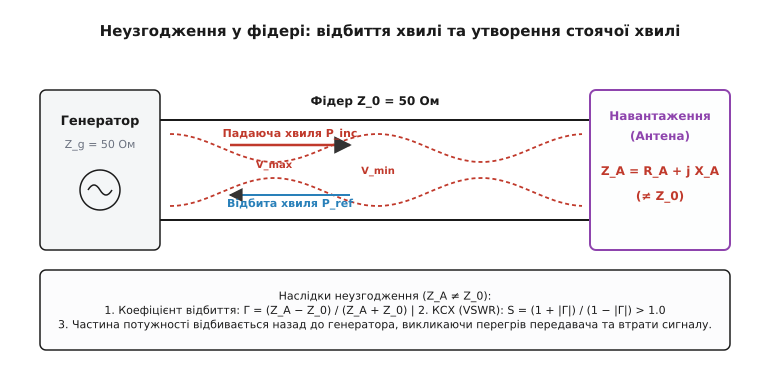
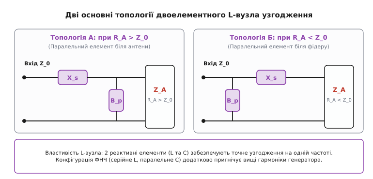
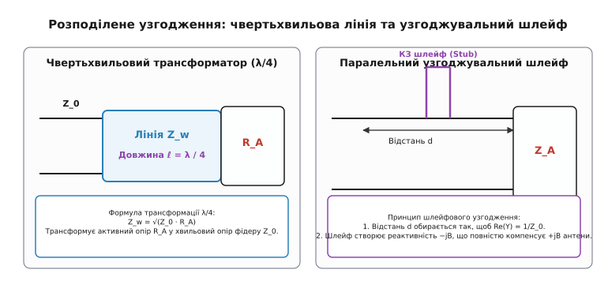
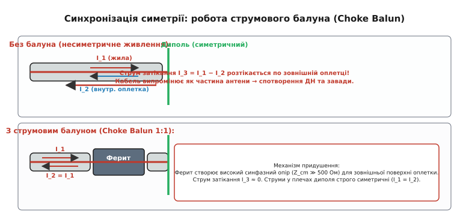
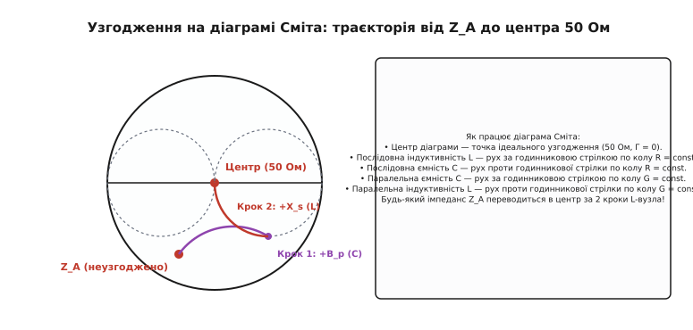

# Узгодження імпедансу антени

<preknowlist>
- [Антена](root:com-medium/antenna) — перетворення веденого струму на вільну хвилю та опір випромінювання.
- [Лінії передачі](root:com-medium/transmission-lines) — хвильовий опір лінії Z₀, стоячі та біжучі хвилі.
- [Коефіцієнт стоячої хвилі (КСХ)](root:com-medium/vswr) — кількісна оцінка неузгодженості та відбитої потужності.
- [Резонанс диполя](root:com-medium/resonance-dipole) — реактивний складник імпедансу при відхиленні від резонансної довжини.
</preknowlist>

Підключення 50-омного радіопередавача безпосередньо до антени з вхідним імпедансом `15 - j45 Ом` завершується розчаруванням: вихідний каскад підсилювача потужності швидко перегрівається, спрацьовує автоматичний захист, а радіосигнал у ефірі виявляється у рази слабшим за розрахований. Більша частина високочастотної енергії взагалі не потрапляє у простір, а відбивається від антени назад у коаксіальний кабель, створюючи виснажливу стоячу хвилю. Щоб змусити антену поглинати та випромінювати всю подану потужність, між фідером і антенними клемами встановлюють **узгоджувальний пристрій** (*impedance matching network*).

---

### Чому виникає неузгодження: анатомія комплексного імпедансу антени

З боку генератора (передавача) або фідерної лінії будь-яка антена виглядає як комплексний двополюсник-навантаження із вхідним імпедансом `Z_A`:

```
Z_A = R_A + j · X_A
```

Активний складник `R_A` складається з двох фізичних частин: `R_A = R_рад + R_втрат`. Опір випромінювання `R_рад` відповідає за корисну електромагнітну енергію, що незворотно відлітає у довкілля вільною хвилею. Опір втрат `R_втрат` враховує омічний нагрів провідників антени, втрати у діелектриках та вихрові струми у поверхні землі або корпусі пристрою.

Реактивний складник `X_A` описує енергію електромагнітного поля, яка запасається у ближній зоні антени і повертається у коло кожного півперіоду:
- Якщо електрична довжина антени менша за резонансну (наприклад, чвертьхвильовий штир, укорочений до довжини `0.2·λ`), реактивність має **ємнісний характер** (`-jX_A`). Напруга на клемах антени відстає від струму.
- Якщо довжина антени більша за резонансну (`> 0.25·λ`), реактивність стає **індуктивною** (`+jX_A`). Струм відстає від напруги.
- Тільки на точній резонансній частоті реактивний опір обнуляється (`X_A = 0`), і вхідний імпеданс антени стає чисто активним `Z_A = R_A`.


*При неузгодженні фідеру із хвильовим опором Z₀ та антени Z_A частина падаючої хвилі відбивається від межі розділу. Сума падаючої та відбитої хвиль створює у фідері стоячу хвилю з амплітудними максимумами V_max та мінімумами V_min.*

Якщо імпеданс антени `Z_A` не дорівнює хвильовому опору кабелю `Z₀` (який для більшості радіочастотних систем становить **50 Ом** або **75 Ом**), на межі розриву середовища виникає відбиття хвилі. Ступінь неузгодження описується **комплексним коефіцієнтом відбиття** `Γ`:

```
Γ = (Z_A - Z₀) / (Z_A + Z₀)
```

Модуль коефіцієнта відбиття `|Γ|` визначає відносну амплітуду відбитої хвилі напруги. Відбита від антени потужність розраховується як `P_відб = P_падаюча · |Γ|²`. Суперпозиція падаючої та відбитої хвиль створює у фідері стоячу хвилю, яка характеризується [коефіцієнтом стоячої хвилі (КСХ / VSWR)](root:com-medium/vswr):

```
SWR = (1 + |Γ|) / (1 - |Γ|)
```

При `Z_A = 50 Ом` отримуємо `Γ = 0` та `SWR = 1.0` — вся потужність передається в антену (стан повного узгодження). При `Z_A = 15 - j45 Ом` та `Z₀ = 50 Ом` отримуємо `|Γ| ≈ 0.73` та `SWR ≈ 6.4`, що означає втрату понад **53%** переданої потужності лише на відбитті. Відбита потужність повертається по кабелю до вихідного транзистора передавача, викликаючи перевищення допустимої напруги на колекторі/стоці та інтенсивне теплове руйнування полупровідникового кристала.

---

### Теорема про максимальну передачу потужності: комплексне спряження

Фундаментальною метою будь-якого узгоджувального пристрою є реалізація умови **комплексно-спряженого узгодження** (*conjugate matching*).

Розглянемо еквівалентний генератор із внутрішнім комплексним імпедансом `Z_g = R_g + j·X_g`, підключений до комплексного навантаження `Z_L = R_L + j·X_L`. Активна потужність `P_L`, яка виділяється у навантаженні, виражається формулою:

```
P_L = I² · R_L = ( |V_g| / |Z_g + Z_L| )² · R_L
= ( |V_g|² · R_L ) / ( (R_g + R_L)² + (X_g + X_L)² )
```

Щоб максимізувати цей вираз при заданих параметрах генератора:
1. Знаменник буде найменшим тоді, коли сумарна реактивність кола дорівнює нулю: `X_g + X_L = 0  ⇒  X_L = -X_g`. Реактивність навантаження повинна бути строго рівною за модулем і протилежною за знаком реактивності генератора.
2. При `X_L = -X_g` вираз спрощується до `P_L = |V_g|² · R_L / (R_g + R_L)²`. Взявши похідну по `R_L` та прирівнявши її до нуля, отримуємо умову `R_L = R_g`.

Умова максимальної передачі активної потужності:
```
Z_L = Z_g*  ⇔  R_L = R_g  та  X_L = -X_g
```

> 🔧 **Навіщо це у радіозв'язку.** У високочастотних трактах передавач розрахований на роботу з фідером чистих `50 Ом` (`Z_g = 50 + j0 Ом`). Тому узгоджувальна мережа, увімкнена між фідером і антеною, виконує подвійну роль: вона компенсує власний реактивний опір антени (`-jX_A`), перетворюючи його на нуль, і одночасно трансформує активний опір `R_A` до значення `50 Ом`. З боку кабелю вся конструкція «узгоджувач + антена» виглядає як ідеальний резистор `50 Ом`.

---

### Сосереджені L-мережі (L-matching networks)

Найпростішим і найефективнішим вузлом для узгодження двох комплексних імпедансів на фіксованій частоті є **L-подібна мережа** (*L-network*). Вона складається всього з **двох реактивних елементів** (індуктивностей та конденсаторів) без застосування резисторів, завдяки чому її коефіцієнт корисної дії наближається до 99%.


*Дві фундаментальні топології L-мережі. Якщо R_A > Z₀ (Топологія А), паралельний елемент B_p підключається паралельно до антени. Якщо R_A < Z₀ (Топологія Б), паралельний елемент B_p підключається паралельно до фідеру.*

Конфігурація L-мережі строго визначається співвідношенням між активним опором антени `R_A` та хвильовим опором фідеру `Z₀`:

#### 1. Топологія А (`R_A > Z₀`) — Понижувальна мережа
Коли опір антени вищий за опір фідеру (наприклад, рамкова антена або диполь на відхиленій частоті з `R_A = 150 Ом`), паралельний реактивний елемент `B_p` шунтує антену, зменшуючи еквівалентний опір вузла до 50 Ом, а послідовний елемент `X_s` компенсує реактивність, що залишилася.

#### 2. Топологія Б (`R_A < Z₀`) — Підвищувальна мережа
Коли опір антени нижчий за 50 Ом (наприклад, укорочений штир або укорочений диполь з `R_A = 15 Ом`), паралельний елемент `B_p` підключається з боку 50-омного фідеру, а послідовний елемент `X_s` вмикається послідовно з антеною.

#### Розрахунок добротності та номіналів

Добротність `Q` L-мережі жорстко прив'язана до співвідношення опорів:

```
Для R_A > Z₀:   Q = √( (R_A / Z₀) - 1 )
Для R_A < Z₀:   Q = √( (Z₀ / R_A) - 1 )
```

Кожна з двох топологій має **два математичні розв'язки**:
- **Конфігурація ФНЧ (Low-pass):** Послідовна індуктивність `L` та паралельна ємність `C`. Додатково послаблює вищі гармоніки передавача (на 12 дБ/октаву).
- **Конфігурація ФВЧ (High-pass):** Послідовний конденсатор `C` та паралельна індуктивність `L`. Відсікає низькочастотні завади та наводки від промислової мережі.

Детальний математичний крок за кроком вивід цих формул з урахуванням реактивності антени дивіться у [🧮 Математичний вивід L-подібного узгоджувального ланцюга](root:com-medium/antenna-feedline-matching-and-balun/math-l-network.md).

> 📜 Історичний крок у візуалізації та розрахунку реактивних кіл зробив Філіп Сміт у 1939 році. Про те, як графічний диск замінив мільйони складних комплексних обчислень, читайте у [📜 Філіп Сміт і діаграма, що скомплексувала калькулятори](root:com-medium/antenna-feedline-matching-and-balun/hist-smith-chart.md).

---

### П- та T-мережі: незалежний контроль добротності

Хоча L-мережа ідеальна за своєю простотою, вона має суттєве обмеження: її нагрузочна добротність `Q` (а отже, і **смуга пропускання**) повністю фіксована співвідношенням `R_A` та `Z₀`. Якщо `R_A = 500 Ом` та `Z₀ = 50 Ом`, добротність `Q = √(10 - 1) = 3`, і ми не можемо зробити вузол більш широкосмуговим або, навпаки, більш селективним.

Додавання **третього реактивного елемента** утворює **П-мережу** (*Pi-network*) або **T-мережу** (*T-network*).

```
   П-мережа (Pi-network)                   T-мережа (T-network)
     ┌───[  X_s  ]───┐                   ┌───[ X_s1 ]───┬───[ X_s2 ]───┐
───  │               │  ───         ───  │              │              │  ───
    [B1]            [B2]                [B_p]          [Load]         [Load]
     │               │                   │              │              │
```

Завдяки третьому елементу інженер отримує **додатковий ступінь свободи**:
1. П-мережу можна уявити як дві L-мережі, з'єднані послідовно через проміжний віртуальний опір `R_virt < min(Z₀, R_A)`.
2. T-мережу можна уявити як дві L-мережі, з'єднані через віртуальний опір `R_virt > max(Z₀, R_A)`.

Це дозволяє довільно обирати значення добротності `Q_node > Q_L`, регулюючи смугу пропускання та забезпечуючи високий рівень придушення побічних випромінювань (типово `-40…-60 дБ` для другої та третьої гармонік у лампових і транзисторних підсилювачах потужності).

---

### Розподілені узгоджувальні елементи: чвертьхвильові трансформатори та шлейфи

На частотах понад 300 МГц (УВЧ та СВЧ діапазони) дискретні катушки й конденсатори втрачають свої властивості через паразитичні параметри корпусів. На їх зміну приходять **розподілені елементи** — відрізки самих ліній передачі (коаксіальних кабелів або мікросмужкових ліній на РСВ).


*Розподілене узгодження. Ліворуч: чвертьхвильовий трансформатор із хвильовим опором Z_w = √(Z₀·R_A). Праворуч: паралельний КЗ-шлейф на відстані d від антени.*

#### 1. Чвертьхвильовий трансформатор (λ/4)
Відрізок лінії передачі довжиною `ℓ = λ / 4` (з урахуванням коефіцієнта укорочення діелектрика `k_ук`) володіє чудовою властивістю інверсії імпедансу:

```
Z_in = Z_w² / Z_L
```

Якщо навантаження є чисто активним `Z_L = R_A`, то для узгодження його з фідером `Z₀` достатньо вставити між ними чвертьхвильовий відрізок кабелю з хвильовим опором `Z_w`:

```
Z_w = √(Z₀ · R_A)
```

*Приклад:* Щоб узгодити петльовий диполь з опором `R_A = 300 Ом` із 75-омним кабелем, потрібен чвертьхвильовий трансформатор з опором `Z_w = √(75 · 300) = √22500 = 150 Ом`.

#### 2. Шлейфове узгодження (Stub Matching)
У мікросмужкових платах широко застосовують **одиночні шлейфи** (*single-stub matching*):
1. На певній відстані `d` від антени активна частина еквівалентної провідності лінії стає строго рівною хвильовій провідності фідеру: `Re(Y(d)) = 1 / Z₀`.
2. У цій точці паралельно підключають відрізок лінії (відкритий або короткозамкнений шлейф) довжиною `ℓ_stub`, реактивна провідність якого `B_stub` строго дорівнює за модулем і протилежна за знаком реактивній провідності лінії `-B(d)`. 

Після підключення шлейфу реактивності взаємно знищуються, і далі в бік генератора біжить чиста біжуча хвиля з `SWR = 1.0`.

---

### Симетрія та струми затікання: роль Балуна (Balun)

Навіть якщо імпеданси антени та кабелю ідеально узгоджені за модулем і фазою, виникає ще одна фундаментальна проблема — **незбіг симетрії**.

Більшість класичних антен (диполь, антена Ягі, логоперіодична антена) є **симетричними** (*balanced*): обидва їхні плечі мають однакову ємність відносно землі та протилежні за фазою потенціали. Натомість коаксіальний кабель є **несиметричною лінією** (*unbalanced*): центральна жила знаходиться всередині екрана, а зовнішня оплетка заземлена.


*При прямому підключенні несиметричного кабелю до симетричного диполя (зверху) струм I_3 затікає на зовнішню поверхню оплетки. Струмовий балун (знизу) створює високий синфазний опір для оплетки, повністю відновлюючи симетрію струмів.*

Якщо підключити коаксіальний кабель напряму до диполя:
1. Струм центральної жили `I_1` повністю витікає в одне плече антени.
2. Струм внутрішньої поверхні оплетки `I_2` витікає у друге плече.
3. Проте на кінці кабелю струм `I_1` та `I_2` більше не компенсують один одного повністю! Виникає різниця струмів `I_3 = I_1 - I_2`, яка витікає на **зовнішню поверхню оплетки кабелю** (*струм затікання* або *common-mode current*).

Наслідки відсутності балуна катастрофічні:
- Коаксіальний кабель починає **випромінювати сам** як частина антени, викривляючи діаграму спрямованості.
- При прийманні кабель збирає всі побутові електромагнітні завади від імпульсних блоків живлення та комп'ютерів у будинку.
- Виникає проблема «ВЧ у шеку»: корпус передавача та мікрофон починають битися струмом при передачі.

Пристрій, що усуває цей ефект, називається **балуном** (від англ. *BALanced to UNbalanced*). 

#### Основні типи балунів:
- **Струмовий балун (Current Balun / Choke Balun):** Надітий на кабель феритовий циліндр або декілька феритових кілець біля точки живлення антени. Для протифазних струмів всередині кабелю ферит «невидимий», але для синфазного струму `I_3` на зовнішній оплетці він створює високий індуктивний опір (`Z_cm > 500…1000 Ом`), повністю блокуючи його затікання.
- **Напруговий балун 1:1 або 4:1 (Voltage Balun):** Трансформатор на феритовому тороїді з автотрансформаторною обмоткою, який одночасно може змінювати імпеданс у 4 рази (наприклад, узгоджувати 200-омний рамковий диполь із 50-омним кабелем).

---

### Графічний аналіз на діаграмі Сміта

Зрозуміти принцип роботи узгоджувальних мереж найпростіше за допомогою **діаграми Сміта**.


*Траєкторія узгодження імпедансу Z_A на діаграмі Сміта за допомогою L-вузла. Крок 1 (паралельна ємність C) зсуває точку вздовж кола постійної провідності G=1. Крок 2 (послідовна індуктивність L) рухає точку вздовж кола постійного опору R=1 прямо в центр (50 Ом).*

На діаграмі Сміта:
1. **Додавання послідовної індуктивності (`+jX_s`)** зсуває точку за годинниковою стрілкою вздовж кола постійного активного опору `R = const`.
2. **Додавання послідовної ємності (`-jX_s`)** зсуває точку проти годинникової стрілки вздовж кола `R = const`.
3. **Додавання паралельної ємності (`+jB_p`)** зсуває точку за годинниковою стрілкою вздовж кола постійної провідності `G = const`.
4. **Додавання паралельної індуктивності (`-jB_p`)** зсуває точку проти годинникової стрілки вздовж кола `G = const`.

Узгодження за допомогою L-мережі зводиться до двох послідовних кроків: перший елемент переводить початкову точку `Z_A` на перетин із колом `R = 1.0` (або `G = 1.0`), а другий елемент рухає точку вздовж цього кола точнісінько у **центр діаграми** (`50 Ом`, `Γ = 0`).

---

### Порівняльний аналіз методів узгодження

| Метод узгодження | Діапазон частот | Регульованість | Смуга пропускання | Втрати (ККД) | Основні застосування |
| :--- | :--- | :--- | :--- | :--- | :--- |
| **L-мережа (SMD / дискретна)** | 1–500 МГц | Фіксована (підлаштовні C/L) | Вузька (фіксована Q) | Дуже низькі (< 0.2 дБ) | Трансивери, IoT (LoRa, Wi-Fi), планарні антени |
| **П / T-мережа (ATU)** | 1.8–50 МГц | Регульована (змінні C і L) | Налаштовна | Низькі (0.3–0.8 дБ) | Автоматичні антенні тюнери (ATU), КХ-передавачі |
| **Чвертьхвильовий λ/4** | > 100 МГц | Фіксована геометрією | Вузька (5–10%) | Мінімальні (< 0.1 дБ) | Узгодження петльових диполів, колінеарні антени |
| **Шлейфове (Stub)** | > 500 МГц | Фіксована геометрією | Середня | Мінімальні (< 0.1 дБ) | СВЧ мікросмужкові плати, базові станції 4G/5G |
| **Балун (Choke / 4:1)** | 1–1000 МГц | Фіксована | Дуже широка | Низькі (0.2–0.5 дБ) | Симетричні диполі, Ягі, рамкові антени |

Для вибору оптимальних пасивних компонентів та захисту кіл від паразитичних параметрів звертайтеся до [🔌 Компоненти узгоджувальних кіл: від паразитів до високочастотної якісності](root:com-medium/antenna-feedline-matching-and-balun/comp-matching-components.md).

Для автоматизованого розрахунку номіналів L-мережі скористайтеся готовим кодом на C та C++ у [⚙️ Практичний калькулятор L-вузла узгодження імпедансу](root:com-medium/antenna-feedline-matching-and-balun/proj-l-match-calc.md).
