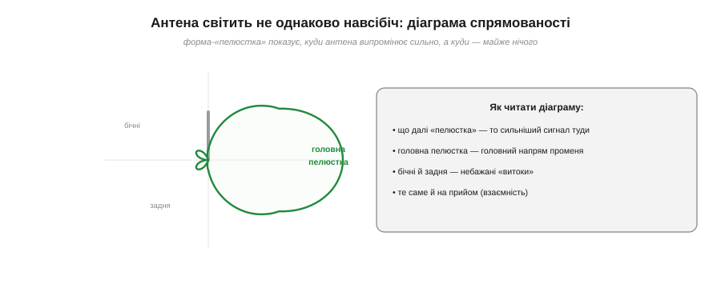
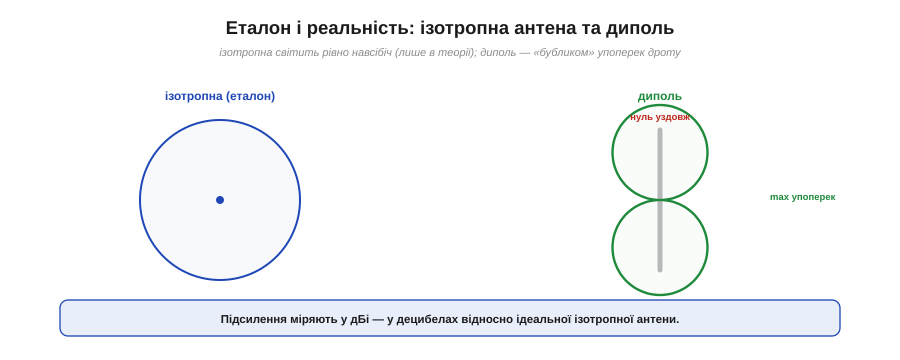
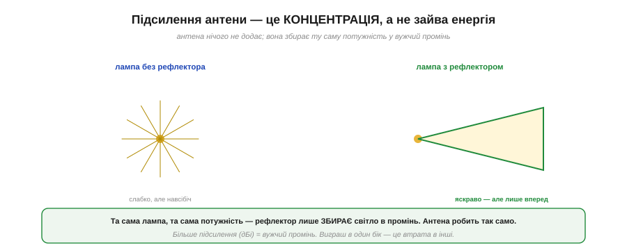
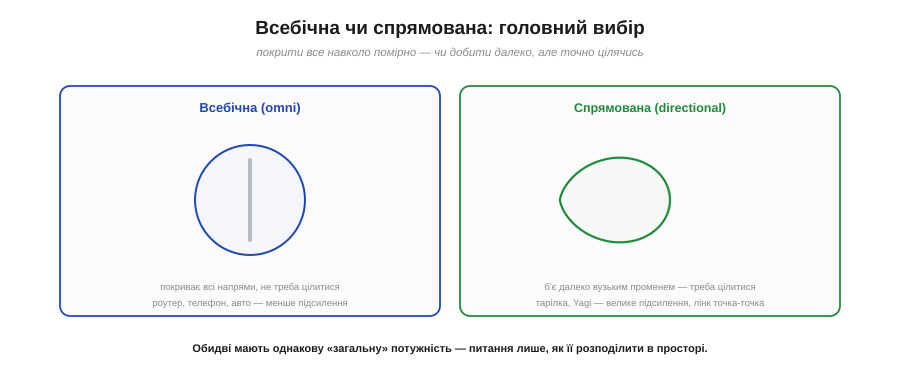
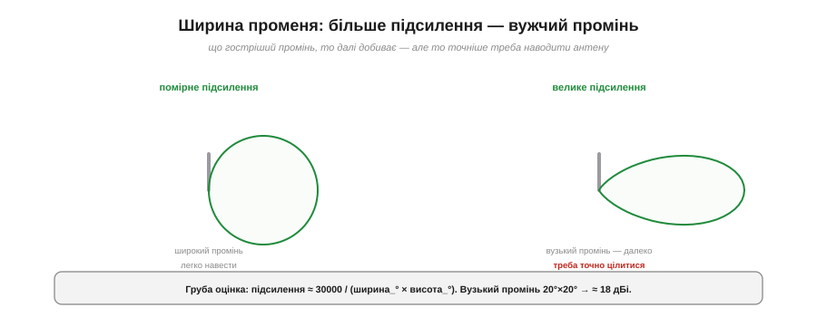
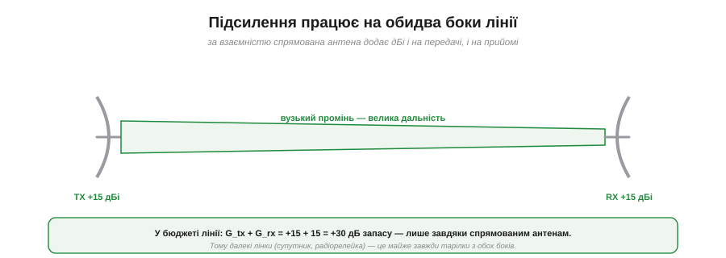
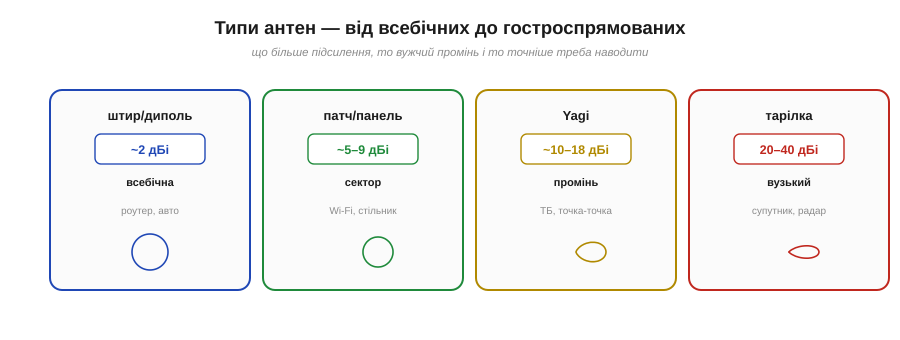

# Підсилення й діаграма спрямованості

Легко уявити, ніби антена випромінює **навсібіч однаково**. Це не так — і саме на цьому стоїть одна з найпотужніших можливостей радіоінженера. Жодна реальна антена не світить рівно в усі боки: вона завжди десь сильніша, десь слабша. А якщо навмисне **сконцентрувати** випромінювання у потрібний бік — можна різко збільшити дальність, не додавши ні вата потужності. Це й називають **підсиленням** антени, а карту «куди світить» — **діаграмою спрямованості**. Розберімо обидва поняття — і навчимося обирати між всебічною та спрямованою антеною.

### Куди світить антена: діаграма спрямованості

Почнімо з самого поняття. **Діаграма спрямованості** (*radiation pattern*) — це наче «карта яскравості» антени: вона показує, у яких напрямках антена випромінює сильно, а в яких — майже нічого.


*Діаграму малюють як «пелюстки»: чим далі контур від антени в якомусь напрямі, то сильніший туди сигнал. **Головна пелюстка** — основний промінь; **бічні** й **задня** — небажані «витоки» енергії не туди. За [взаємністю](topic:com-medium/antenna) ця сама карта діє й на прийом: де антена добре шле, там добре й чує.*

Читати її просто: дивишся, у який бік «пелюстка» витягнута найдалі, — туди й найсильніший сигнал. У спрямованої антени є виразна **головна пелюстка** (головний промінь) і дрібніші **бічні** та **задня** — паразитні напрями, куди трохи енергії все ж тікає. А завдяки [взаємності антени](topic:com-medium/antenna) ця діаграма однакова для передавання й приймання: антена найкраще **чує** з того ж напряму, у який найкраще **шле**. Тобто діаграма спрямованості — це повний «портрет» того, як антена взаємодіє з простором.

### Еталон і реальність: ізотропна антена та диполь

Щоб **виміряти** спрямованість числом, потрібен еталон. Ним служить уявна **ізотропна антена** (гр. *ísos* — рівний, *trópos* — напрям: однакова в усіх напрямах) — ідеальна точка, що світить абсолютно рівно навсібіч, ідеальною кулею.


*Ізотропна антена (ліворуч) — рівна куля випромінювання; вона існує лише в теорії, але служить **еталоном** (0 дБі). Реальний диполь (праворуч) світить «бубликом»: максимум — упоперек дроту, а **точно вздовж** дроту — нуль. Його підсилення — 2.15 дБі.*

Ізотропної антени насправді не існує — це математична зручність, **нульова точка відліку**. Саме від неї міряють підсилення: одиниця **дБі** (*dBi*) означає «децибели відносно ізотропної». Реальний **диполь** (гр. *di-* — двічі, *pólos* — полюс: два плеча-полюси) уже має форму: він випромінює «бубликом» (тором) — найсильніше **впоперек** дроту, а точно **вздовж** осі дроту в нього **нуль** (туди він не світить зовсім). У горизонтальній площині такий вертикальний диполь всебічний, а його підсилення відносно ізотропної — **2.15 дБі**. Це вже наш практичний еталон «звичайної» антени.

### Підсилення — це концентрація, а не зайва енергія

Тут чигає головна пастка розуміння. Слово «підсилення» наводить на думку, ніби антена якось **додає** потужності. Це **не так** — і важливо засвоїти чому.


*Лампа без рефлектора світить слабко, зате навсібіч. Той самий ліхтарик з **рефлектором** не став потужнішим — він лише **зібрав** те саме світло у промінь, який тепер яскравий, але вузький. Антена робить точнісінько те саме з радіохвилею: підсилення — це перерозподіл, а не додавання.*

Тут вирішальне те, що антена **пасивна**: вона не виробляє енергії, лише перерозподіляє ту, що в неї подали (саме тому в [бюджеті радіолінії](root:embedded/link-budget) підсилення антени піднімає ефективну випромінювану потужність, нічого не додаючи до передавача). Її «підсилення» — це чиста **концентрація**. Найкраща аналогія — **ліхтарик**: гола лампочка світить слабко в усі боки, а постав за нею рефлектор — і той самий вогник дає яскравий промінь уперед. Лампа не стала потужнішою — світло просто **зібрали** в один бік, забравши його з інших. Антена з підсиленням +12 дБі робить те саме з радіохвилею: у головному напрямі сигнал такий, ніби передавач у 16 разів потужніший, — але **ціною** того, що в бічні й задні напрями вона світить майже нічого. Виграш в один бік — це завжди втрата в інші; загальна потужність незмінна.

### Всебічна чи спрямована: головний вибір

Звідси випливає головне практичне рішення у виборі антени — між **всебічною** і **спрямованою**.


*Всебічна (omni) антена покриває всі напрями помірно й не потребує наведення — добра для роутера, телефона, авто, але має мале підсилення. Спрямована (тарілка, Yagi) б'є далеко вузьким променем і дає велике підсилення — але її треба **точно навести** на кореспондента.*

Вибір — це компроміс. **Всебічна** (*omnidirectional*) антена — вертикальний штир чи диполь — покриває всі напрями навколо однаково (її «бублик»), тож працює, хоч як її поверни, і хоч де стоїть кореспондент. Це ідеал для **рухомого** й **багатоадресного** зв'язку: роутер, що роздає Wi-Fi на всю квартиру, телефон у кишені, рація в русі. Плата — **мале підсилення**, отже, менша дальність. **Спрямована** (*directional*) — тарілка, Yagi, панель — навпаки: концентрує все у вузький промінь, дає **велике підсилення** й величезну дальність, але вимагає **точного наведення** на партнера. Це ідеал для **стаціонарних** ліній «точка-точка»: радіорелейка між вежами, супутникова тарілка, дальній лінк між будівлями. Питання завжди одне: тобі треба покрити **все навколо** — чи добити **далеко в один бік**?

### Ширина променя: гострий промінь б'є далі

Підсилення й **ширина променя** (*beamwidth*) пов'язані жорстко: одне без іншого не буває.


*Помірне підсилення дає широкий промінь — легко навести, але дальність скромна. Велике підсилення дає вузький, гострий промінь — він добиває далеко, зате антену доводиться наводити дуже точно, бо «мимо» означає втрату зв'язку.*

Логіка проста: та сама потужність, зібрана у **вужчий** конус, дає в ньому сильніший сигнал — отже, більше підсилення завжди означає **гостріший промінь**. Це й корисно, і небезпечно: гострий промінь б'є далеко, але «промазати» повз кореспондента стає легко.

**Приклад (оцінка підсилення з ширини променя).** Існує груба, але корисна формула, що зв'язує підсилення з кутовими розмірами головної пелюстки (у градусах):

```
підсилення ≈ 30000 / (ширина° × висота°)
промінь 20° × 20° → 30000 / 400 ≈ 75 разів ≈ 18.7 дБі
промінь 6° × 6°   → 30000 / 36 ≈ 833 рази ≈ 29 дБі
```

Бачиш закономірність: щоб подвоїти підсилення, треба звузити промінь — а вузький промінь складніше націлити. Супутникова тарілка з її 30+ дБі має промінь у кілька градусів, і саме тому її так ретельно наводять на супутник.

### Підсилення працює на обидва боки

І ще одна радісна звістка з [принципу взаємності](topic:com-medium/antenna): підсилення антени допомагає **і на передачі, і на прийомі** — а отже, у лінії «точка-точка» воно рахується **двічі**.


*Спрямована антена на передавачі концентрує сигнал у промінь (+дБі), а така сама на приймачі краще «вловлює» саме з того напряму (ще +дБі). У [бюджеті лінії](root:embedded/link-budget) обидва підсилення додаються: дві тарілки по +15 дБі дають +30 дБ запасу.*

У [бюджеті радіолінії](root:embedded/link-budget) підсилення антен **G_tx** і **G_rx** входять окремими «плюсами», і причина саме така: спрямована антена на передавачі **посилає** сигнал у промінь, а така сама на приймачі краще **чує** з того ж напряму — і обидва виграші додаються. **Приклад:** дві тарілки по +15 дБі дають разом **+30 дБ** до бюджету — лише завдяки формі діаграми, без жодного зайвого вата! Саме тому всі далекі лінії — супутникові, радіорелейні, міжконтинентальні — це майже завжди **тарілки з обох боків**.

> 🔧 **Навіщо це.** Ось практичне правило вибору антени для будь-якого проєкту. Якщо твій пристрій **рухається** або має зв'язуватися з різних боків (дрон, що кружляє; роутер на всю кімнату; рація в русі) — бери **всебічну** антену й не мороч голову з наведенням. Якщо ж лінія **стаціонарна** й треба **дальність** (міст між двома будинками, прийом далекої станції, зв'язок із віддаленою базою) — бери **спрямовану** й точно наведи її; кожні +3 дБі підсилення подвоюють потужність у промені (а +6 дБі — учетверюють), тобто відчутно додають [дальності](topic:com-medium/free-space-loss). А наведення — це серйозно: тарілку з вузьким променем «мимо» на кілька градусів — і зв'язку немає зовсім.

### Галерея: від всебічних до гостроспрямованих

Зведімо типи антен у єдиний ряд за підсиленням — щоб бачити весь спектр вибору.


*Штир чи диполь (~2 дБі) — всебічні, для роутера й авто. Патч-панель (~5–9 дБі) — секторні, для Wi-Fi і стільникових веж. Yagi (~10–18 дБі) — промінь, для ТБ й ліній точка-точка. Тарілка (20–40 дБі) — дуже вузький промінь, для супутників і радарів. Що більше підсилення — то гостріший промінь.*

Тепер увесь арсенал перед очима. **Штир/диполь** (~2 дБі) — всебічні, ставлять туди, де напрям невідомий. **Патч** і **панель** (~5–9 дБі) — покривають сектор, типові для Wi-Fi-точок і стільникових веж (звідси «сектори» на вишках). **Yagi** (~10–18 дБі) — та сама «риб'яча кістка» старих телевізійних антен, дає виразний промінь для ліній точка-точка. А **параболічна тарілка** (20–40 дБі) — чемпіон підсилення з гострющим променем, для супутникового зв'язку й радарів. Побачивши антену, тепер можна одразу прикинути і її підсилення, і ширину променя, і для чого вона.

Діаграма спрямованості й підсилення описують, **куди** і **наскільки сильно** антена випромінює. Але є ще одна, прихована властивість, від якої залежить, чи «почують» дві антени одна одну взагалі: **орієнтація** коливань хвилі в просторі. Якщо передавальна антена вертикальна, а приймальна — горизонтальна, сигнал може майже зникнути, навіть коли все інше ідеальне — і за це відповідає вже [поляризація антени](topic:com-medium/antenna-polarization).

---
