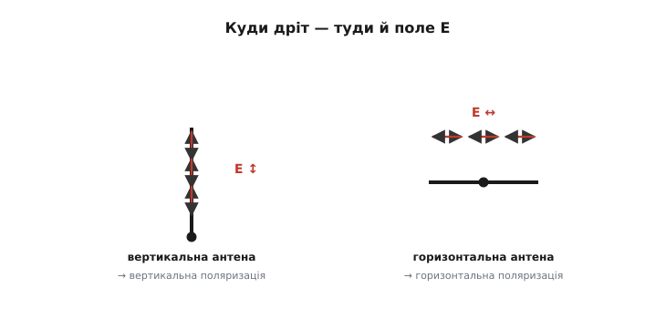
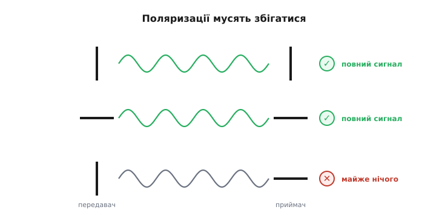
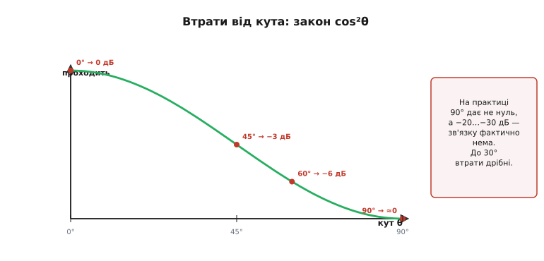
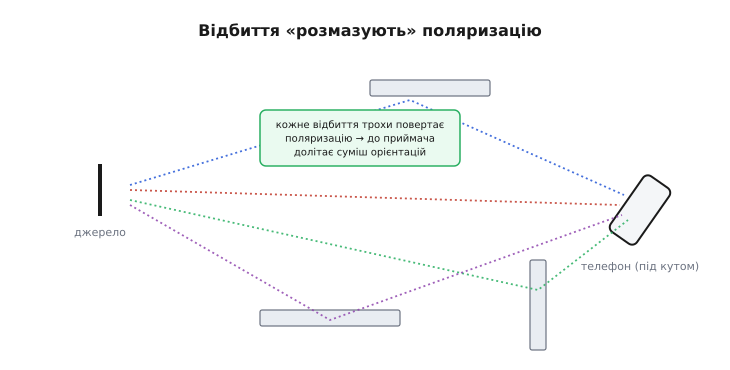
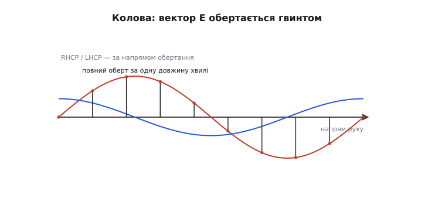
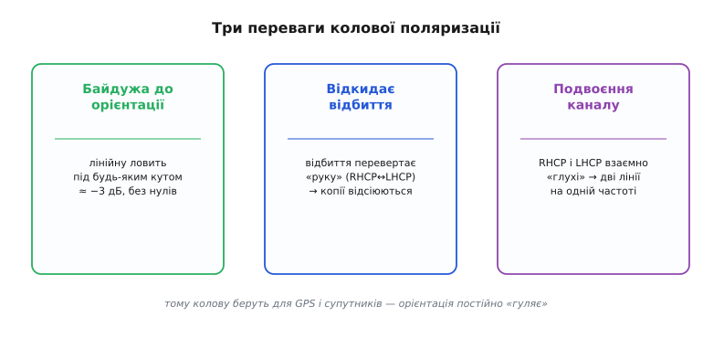
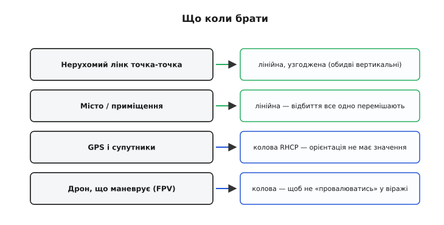

# Поляризація антени

Є прихована властивість антен, через яку два ідеально налаштовані, потужні, точно наведені пристрої можуть **не почути** одне одного зовсім. Усе ж збігається: частота резонансна, антени спрямовані одна на одну, бюджет лінії з запасом. А зв'язку немає. Винна — **поляризація** (від латинського *polus* — полюс, вісь): орієнтація коливань хвилі в просторі. Якщо вона в передавача й приймача не збігається, сигнал тоне. Цю пастку варто знати в обличчя — і вміти її уникати.

### Орієнтація антени задає поляризацію

[Поляризація](root:com-medium/propagation-polarization) хвилі — це напрям, у якому коливається її електричне поле E. Орієнтація антени напряму задає поляризацію випромінюваної хвилі.


*Поле E коливається вздовж дроту антени. Вертикальна антена (ліворуч) дає хвилю з вертикальним полем E — вертикальну поляризацію. Горизонтальна (праворуч) — горизонтальну. Куди спрямований провід, така й поляризація.*

Логіка проста й випливає прямо з того, як [антена випромінює](root:com-medium/antenna): заряди гойдаються вздовж дроту, тож і поле E, яке вони породжують, коливається в тому ж напрямку. Поставив антену вертикально — отримав хвилю з вертикально коливним полем (вертикальна поляризація). Поклав антену горизонтально — поле коливається горизонтально. Антена буквально задає напрям полю E хвилі. Саме тому орієнтація антени — не дрібниця: вона визначає, як хвиля «повернута» в просторі.

### Передавач і приймач мусять збігатися

Тепер головне практичне: приймальна антена найкраще ловить хвилю, поляризація якої збігається з її власною орієнтацією.


*Обидві антени вертикальні — повний сигнал. Обидві горизонтальні — теж повний. А якщо одна вертикальна, а інша горизонтальна (схрещені під 90°), приймач майже нічого не чує, хоч усе інше ідеальне.*

Правило таке. Коли передавальна й приймальна антени орієнтовані однаково (обидві вертикальні або обидві горизонтальні), хвиля «лягає» на приймальну антену ідеально — повний сигнал. А коли вони схрещені під прямим кутом (одна вертикальна, інша горизонтальна), хвиля з вертикальним полем майже не наводить струму в горизонтальному дроті — сигнал майже зникає. Це **неузгодження поляризації** (*polarization mismatch*), і воно здатне «вбити» лінію навіть із величезним запасом бюджету. Класична помилка-новачка: антени стоять правильно, потужність є, а зв'язку нема — бо хтось поклав один штир набік.

### Втрати від кута: закон cos²θ

Між «ідеально збігаються» і «схрещені під 90°» — ціла шкала. Втрати залежать від кута θ між поляризаціями за простим законом: частка потужності, що проходить, дорівнює cos²θ. Це окремий випадок загальнішого правила — повну математику неузгодження, разом із мірою «наскільки кругла» колова хвиля, розбирає [вставка про втрати поляризації](root:com-medium/antenna-polarization/math-mismatch.md).


*Частка потужності, що проходить, дорівнює cos²θ, де θ — кут між поляризаціями. За 0° проходить усе; за 45° — половина (−3 дБ); за 90° — теоретично нуль, а на практиці −20…−30 дБ, тобто фактично мертвий зв'язок.*

**Втрати при неузгодженні поляризації.** Дві вертикальні штирові антени, та приймальна випадково нахилена на θ від вертикалі. Скільки потужності втрачаємо? Частка, що проходить, — cos²θ; переведімо в децибели (10·log₁₀):

```
θ = 0°  : cos²0  = 1.00   →   0 дБ    (ідеально)
θ = 15° : cos²15 = 0.933  →  −0.3 дБ  (непомітно)
θ = 30° : cos²30 = 0.75   →  −1.2 дБ  (дрібниця)
θ = 45° : cos²45 = 0.50   →  −3 дБ    (половина)
θ = 60° : cos²60 = 0.25   →  −6 дБ
θ = 90° : cos²90 = 0      →  −∞       (мертво)
```

До ~30° неузгодження майже не шкодить (менше децибела), а от після 45° втрати ростуть лавиною. На практиці навіть «ідеально схрещені» 90° дають не математичний нуль, а близько **−20…−30 дБ** — через дрібні недосконалості антени й невелику паразитну складову поля, яку в техніці звуть **крос-поляризацією** (*cross-polarization* — частка потужності, що «протекла» в перпендикулярну, чужу поляризацію). Та −25 дБ однаково означає, що зв'язку фактично немає. Висновок простий: узгоджуй поляризацію, особливо в далеких лінках, де кожен децибел на рахунку.

### Чому ж телефон працює під будь-яким нахилом

Тут уважний читач спіткнеться: якщо неузгодження таке згубне, чому телефон ловить Wi-Fi, хоч як його повернути — вертикально, набік, плазом? Адже антена в ньому крихітна й нахиляється разом із корпусом.


*У приміщенні сигнал доходить багатьма шляхами, і кожне відбиття трохи повертає поляризацію. До нахиленого телефона долітає суміш усіх орієнтацій — і він чує. А от у чистій прямій видимості (далекий лінк, FPV) відбиттів нема — і неузгодження б'є на повну.*

Рятує [багатопроменевість](root:com-medium/multipath-fading). У кімнаті чи місті сигнал приходить не прямо, а через купу відбить від стін, меблів, будівель — і кожне відбиття трохи повертає площину поляризації. До приймача долітає **суміш** усіх можливих орієнтацій, і антена за будь-якого нахилу впіймає хоч якусь складову. Відбиття мимоволі «розмазують» поляризацію й прощають неузгодження. Але це працює лише там, де є відбиття. У **прямій видимості** без перешкод (дальній лінк між вежами, FPV-відео з дрона у відкритому небі) суміші немає, і неузгодження поляризації знову стає вбивчим. Тому: у місті чи будинку про поляризацію часто можна не думати, а у відкритих лінках — узгоджуй обов'язково.

### Колова поляризація: поле, що обертається

Є й елегантний спосіб взагалі позбутися проблеми орієнтації — **колова поляризація** (*circular polarization*, від латинського *circulus* — коло).


*Якщо скласти дві схрещені хвилі зі зсувом фази 90°, сумарний вектор поля E не коливається в одній площині, а обертається — описує гвинт уздовж напрямку руху, роблячи повний оберт за одну довжину хвилі. Залежно від напряму обертання це права (RHCP) або ліва (LHCP) колова поляризація.*

Звичайна (лінійна) поляризація — це коли поле E коливається в **одній** площині. А якщо взяти **дві** схрещені антени й живити їх зі [зсувом фази](root:ph-waves/phase) 90° (або скрутити антену в **спіраль** — *helix*, латиною «завиток»), сумарний вектор E почне обертатися, описуючи в просторі гвинт. За один період хвилі він робить повний оберт. Напрям обертання дає два різновиди: **права** (*right-hand circular polarization*, RHCP) і **ліва** (*left-hand circular polarization*, LHCP). Хвиля більше не «прив'язана» до однієї площини — і це міняє все.

### Навіщо колова: байдужа до орієнтації

Колова поляризація знімає головний біль неузгодження, і не одним способом.


*Колова антена ловить лінійну під будь-яким кутом — завжди приблизно −3 дБ, без глибокого провалу. Відбиття перевертає «руку» (RHCP↔LHCP), тож антена відкидає віддзеркалені копії — плюс проти багатопроменевості. Тому колову беруть для GPS і супутників, де орієнтація постійно «гуляє».*

Переваг одразу три. **Перше — байдужість до орієнтації:** колова антена приймає лінійну хвилю майже однаково (≈ −3 дБ) під будь-яким кутом, без глибоких нулів. Половину потужності втрачаєш завжди, зате ніколи не провалюєшся в нуль. **Друге — відсікання відбить:** відбиття від поверхні перевертає напрям обертання (права стає лівою), а антена налаштована лише на «свою» руку — тож віддзеркалені копії вона відкидає, що допомагає проти [багатопроменевості](root:com-medium/multipath-fading). **Третє — повторне використання частоти:** RHCP і LHCP взаємно «глухі», тож на одній частоті можна вести **дві** незалежні лінії з протилежними руками.

Саме тому **GPS** працює на коловій (RHCP). Причин дві, і друга глибша за «орієнтацію». По-перше, супутники високо й постійно змінюють кут відносно тебе — з лінійною поляризацією були б нескінченні провали, а з коловою їх немає. По-друге, дорогою крізь **іоносферу** хвиля проходить **фарадеївське обертання** (*Faraday rotation*): магнітне поле Землі повертає площину **лінійної** поляризації на наперед невідомий кут — для лінійного сигналу це готове неузгодження. А ось «руку» колової хвилі іоносфера **не міняє**: RHCP лишається RHCP. Колова поляризація просто несприйнятлива до цього обертання — тому на супутникових частотах вона майже завжди колова.

> 🔧 **Навіщо це.** Запам'ятай одну річ, яка економить години марних мук: **якщо зв'язку немає, а все начебто правильно — перевір поляризацію.** Для **нерухомих** лінків «точка-точка» став обидві антени однаково (зазвичай вертикально) — це безкоштовні децибели. Для **рухомого** чи **обертового** — наприклад, FPV-камери на дроні, що раз у раз перекидається в маневрі, — бери **колову** антену (характерні «конюшинки» й «пагоди» на FPV — це саме вона), інакше відео «провалюватиметься» щоразу, як дрон ляже на крило. А для GPS-модуля колова RHCP-антена вже вбудована й розрахована — не став її «бочком». Поляризація — невидима, але цілком реальна половина успіху антенної лінії.

### Поляризація на практиці

Зведімо вибір у коротке правило.


*Фіксований лінк точка-точка — лінійна, узгоджена (обидві вертикальні чи горизонтальні). Міський чи кімнатний зв'язок — лінійна, бо відбиття все одно перемішають. GPS і супутники — колова RHCP. FPV-дрон, що крутиться, — колова, щоб не «провалюватися» в маневрі.*

На практиці все зводиться до кількох випадків. **Нерухомий лінк** — узгоджена **лінійна** поляризація, найпростіший спосіб виграти децибели задарма. **Місто чи приміщення** — теж лінійна, бо багатопроменевість усе одно перемішає. **GPS і супутники** — **колова** RHCP, щоб ні орієнтація, ні іоносфера не мали значення. **Дрон, що маневрує** (FPV-відео) — теж **колова**, щоб зв'язок не зникав у віражах. Невидимий параметр, про який легко забути, — але саме він часто відрізняє лінк, що працює, від лінка, що мовчить.

Поляризація — лише один із параметрів, що вирішують долю антенної лінії. Між передавачем і антеною є ще одна ланка, яку легко прийняти за просту дрібницю, — **кабель**, що їх з'єднує. Здавалося б, дріт як дріт. Але на радіочастотах звичайний шматок дроту поводиться геть несподівано: він має власний «хвильовий опір», і якщо його не узгодити, частина дорогоцінного сигналу **відіб'ється** назад, так і не дійшовши до антени. Чому кабель має «опір» 50 Ом і до чого тут хвилі — пояснюють [лінії передачі](root:com-medium/transmission-lines).

---
