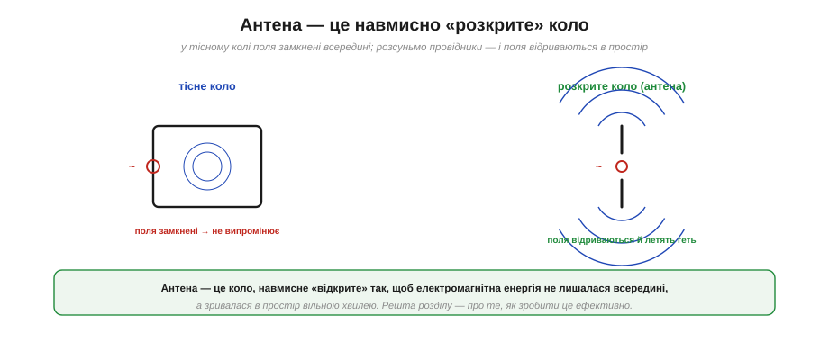
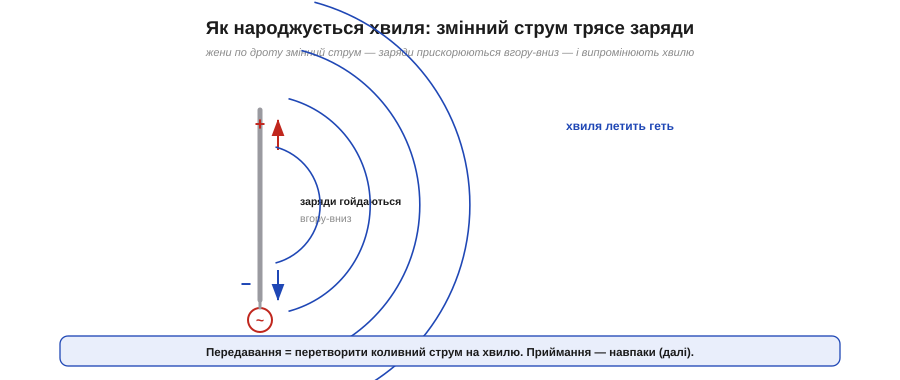
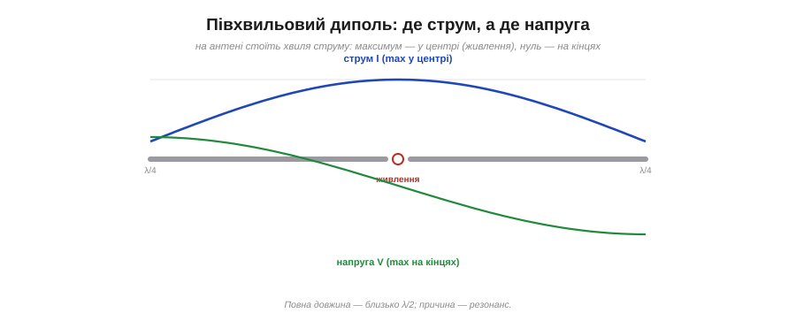
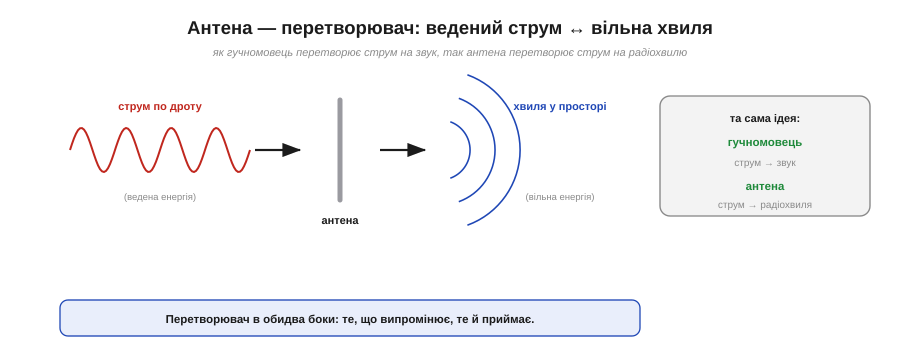
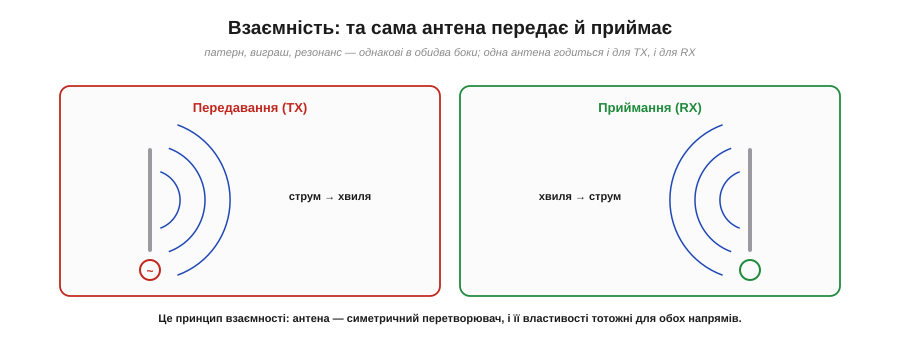
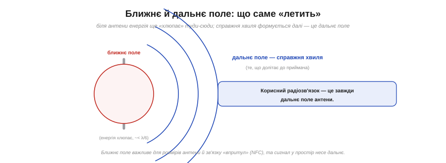

# Антена: перетворити струм у хвилю

Поставмо найперше, найфундаментальніше питання: **що взагалі робить** антена і чому звичайний шматок дроту раптом починає випромінювати радіохвилю? Відповідь напрочуд глибока й елегантна, і вона прямо випливає з фізики [електромагнітної хвилі](topic:ph-electromagnetism/em-wave). Антена — це пристрій, який перетворює **ведену** електромагнітну енергію (струм, що біжить по дроту) на **вільну** (хвилю, що летить простором) — і навпаки. Розберімо, як саме.

### Антена — це навмисно «розкрите» коло

Почнімо з парадокса. У звичайному електричному колі струм тече — а радіо немає. Лампа світить, мотор крутиться, але в простір нічого не випромінюється (на щастя, бо інакше будь-який пристрій «світив» би ефір). Чому ж антена випромінює?


*У тісному колі (ліворуч) електромагнітні поля «замкнені» поряд із провідниками й нікуди не діваються. А якщо провідники **розсунути** (праворуч), поля вже не мають куди замкнутися — вони відриваються від дроту й летять у простір вільною хвилею. Антена — це коло, навмисне розкрите так, щоб енергія тікала назовні.*

Секрет — у **геометрії**. У компактному колі (наприклад, у тісній петлі чи парі близьких дротів) поля двох сусідніх провідників майже **гасять** одне одного, і вся енергія лишається замкненою поряд. Але варто **розсунути** провідники, «розкрити» коло — і поля більше не компенсуються; вони відриваються від дроту й зриваються в простір. Грубо кажучи, **антена — це коло, навмисне відкрите так, щоб «протікати» енергією в простір**. Звичайне коло старанно тримає енергію всередині; антена — навпаки, старанно її випускає. Уся подальша інженерія антен — про те, як зробити це «протікання» якнайефективнішим.

### Трясемо заряди — народжується хвиля

Тепер придивімося, що відбувається в самому дроті антени. Тут діє ключовий факт: хвилю породжує [**прискорений** заряд](topic:ph-electromagnetism/em-wave).


*Передавач жене по антені **змінний** струм — і заряди в дроті гойдаються вгору-вниз, тобто весь час прискорюються (міняють напрям руху). А прискорений заряд випромінює електромагнітну хвилю, що відривається й летить геть.*

Механізм простий до краси. Передавач подає на антену **змінний** струм — мільйони чи мільярди разів на секунду він жене заряди то вгору, то вниз по дроту. А «гойдатися туди-сюди» означає **постійно прискорюватися** — заряд щоразу гальмує, спиняється й розганяється у зворотний бік. Саме це й змушує заряд [**випромінювати**](topic:ph-electromagnetism/em-wave): навколо нього народжується збурення полів, яке відривається й летить простором як хвиля. Тобто **передавання — це перетворення коливного струму на хвилю**, і вся «магія» антени зводиться до старого знайомого: трясеш заряди — родиться хвиля. Що сильніше й узгодженіше трясеш, то потужніша хвиля.

### Розподіл струму: півхвильовий диполь

Найкласичніша й найважливіша антена — **диполь** (*dipole*): два прямі провідники («плечі»), що живляться від передавача посередині. Подивімося, як по ньому розподіляється струм, — це багато що пояснює.


*На півхвильовому диполі стоїть **хвиля струму**: він максимальний у центрі (де живлення) і спадає до нуля на кінцях плечей (зарядам нікуди далі бігти). Напруга — навпаки: нуль у центрі, максимум на кінцях. Повна довжина антени — близько λ/2.*

Поглянь на розподіл. **Струм** найбільший **у центрі**, біля точки живлення, і плавно спадає до **нуля на кінцях** — логічно, бо з кінця дроту зарядам уже нікуди текти. А **напруга** поводиться дзеркально: у центрі нуль, на кінцях — максимум. Тобто на антені стоїть справжня **стояча хвиля** струму й напруги, як у резонаторі. І ось важлива деталь: повна довжина такого диполя — приблизно **половина довжини хвилі** (λ/2), а кожне плече — чверть (λ/4). Чому саме стільки — це питання [**резонансу**](topic:com-medium/resonance-dipole); поки що варто втримати цей зв'язок «довжина антени ↔ довжина хвилі».

### Антена як перетворювач

Корисно подивитися на антену як на **перетворювач** (*transducer*) — пристрій, що переводить енергію з однієї форми в іншу. Цей погляд робить її суть очевидною.


*Антена стоїть на межі двох світів: з одного боку — **ведена** енергія (струм, замкнений у дроті), з іншого — **вільна** (хвиля у відкритому просторі). Антена перекладає одне в інше. Точно так само гучномовець перекладає електричний струм у звук.*

Аналогія з **гучномовцем** тут майже досконала. Гучномовець бере електричний сигнал (струм у котушці) і перетворює його на звукову хвилю в повітрі. Антена робить те саме, тільки на іншому «кінці» спектра: бере струм у дроті й перетворює на електромагнітну хвилю в просторі. В обох випадках це **перетворювач між веденою й вільною формою** хвилі. І, як і гучномовець (що, до речі, може працювати й мікрофоном), антена діє **в обидва боки**.

### Опір випромінювання: куди дівається потужність

Виникає природне питання: якщо передавач «віддає» в антену потужність, а вона кудись зникає (летить у простір), то як це виглядає **з боку передавача**? Відповідь — через гарне поняття **опору випромінювання**.


*Для передавача антена «виглядає» як звичайний опір R_вип, що споживає потужність P = I²·R. Але — на відміну від резистора — ця потужність не перетворюється на тепло, а **випромінюється** у простір. Для півхвильового диполя R_вип ≈ 73 Ом.*

Ось у чому суть. Передавач «бачить» антену як **навантаження**, що споживає потужність, — тобто як певний **опір**. Його так і називають — **опір випромінювання** (*radiation resistance*), R_вип. Потужність, яку він «з'їдає», рахується звичною формулою P = I²·R_вип. Але вся хитрість у тому, що цей «резистор» **не гріється**: енергія йде не в тепло, а **в простір**, вільною хвилею. Це резистор, який світить.

**Приклад (потужність випромінювання диполя).** Для класичного півхвильового диполя опір випромінювання — близько **73 Ом**. Нехай по ньому тече струм 0.5 А:

```
P_вип = I² · R_вип = (0.5)² × 73 = 0.25 × 73 ≈ 18 Вт
```

Ці вісімнадцять ватів **залишають** антену хвилею. А число **73 Ом** не випадкове: саме близькість опору антени до зручних значень стоїть за знаменитими **50 Ом** [кабелів і роз'ємів](topic:com-medium/transmission-lines).

### Взаємність: одна антена на два боки

Досі йшлося про **передавання**. А як же приймання? Відповідь чудова своєю простотою: **та сама антена** приймає точнісінько так само, як передає.


*Передавання: струм трясе заряди — народжується хвиля. Приймання: хвиля з простору трясе заряди вже в **цій** антені — і наводить у ній струм. Процес дзеркальний, тож усі властивості антени (діаграма спрямованості, виграш, резонанс) однакові для обох напрямів — це принцип взаємності.*

Це називають **взаємністю** (*reciprocity*) — і це не випадковість, а глибока властивість. При прийманні все відбувається **навпаки**: хвиля, що прилетіла з простору, трясе заряди вже в приймальній антені — і наводить у ній слабкий струм, який ми підсилюємо. А оскільки фізика тут дзеркальна, то й **усі характеристики антени тотожні** для передавання й приймання: яка в неї діаграма спрямованості на передачу, така й на прийом; який виграш, така й чутливість; на якій частоті резонує — на тій однаково добре і шле, і ловить. Практичний висновок безцінний: **тобі потрібна лише одна антена** і для TX, і для RX, і досить вивчити її властивості один раз.

### Ближнє й дальнє поле

Останній штрих — невелике, але важливе уточнення про те, що саме «летить» від антени. Поле навколо неї неоднорідне.


*Зовсім близько до антени — **ближнє поле**: там енергія здебільшого «хлюпає» туди-сюди між антеною та простором, не відриваючись. Далі формується **дальнє поле** — справжня біжуча хвиля, що й долітає до приймача. Корисний радіозв'язок — це завжди дальнє поле.*

Безпосередньо біля антени живе **ближнє поле** (*near field*): тут енергія значною мірою **коливається туди-сюди** між антеною й простором, запасаючись і повертаючись, а не відлітаючи геть. І лише трохи далі формується **дальнє поле** (*far field*) — та сама самостійна [біжуча хвиля](topic:ph-electromagnetism/em-wave), що відірвалася й мчить до приймача. Для звичайного радіозв'язку важливе саме **дальнє** поле: воно несе сигнал на відстань. (Ближнє поле теж не безкорисне — на ньому працює, наприклад, зв'язок «впритул» NFC у безконтактних картках, — але туди ми зараз не йдемо.)

Отже, головне зрозуміло: антена трясе заряди й перетворює струм на хвилю (і навпаки). Лишається ключове кількісне питання — **якого розміру** має бути антена? Чому диполь — саме λ/2, а штир — λ/4? Чому антена для 2.4 ГГц — кілька сантиметрів, а для довгих хвиль — десятки метрів? Усе це визначає [**резонанс**](topic:com-medium/resonance-dipole) — те саме явище, що керує й коливальними контурами.

> 📜 Саме антена, а не нова фізика, зробила радіо далеким — і навколо цього виросла одна з найгучніших суперечок «хто винайшов радіо». [Як Марконі дотягнув сигнал через Атлантику — і чому це праця багатьох](topic:com-medium/antenna/hist-marconi.md)

---
