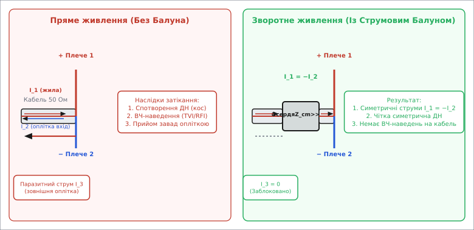
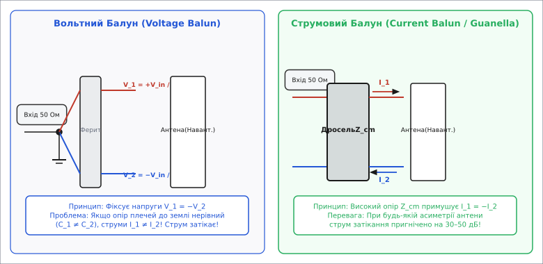
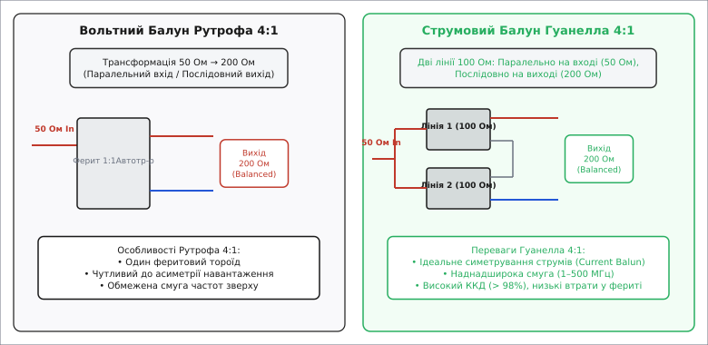
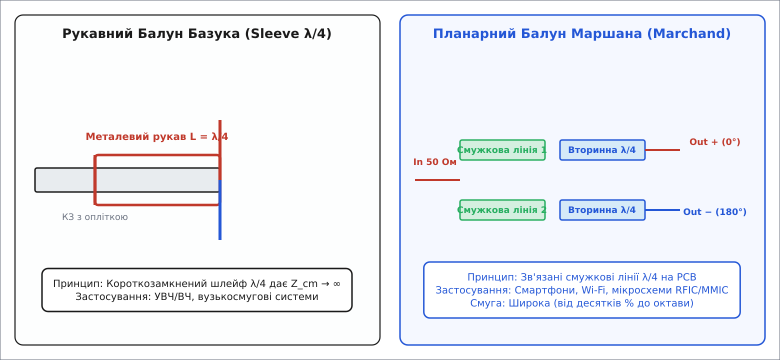

# Балуни (Baluns): Симетруючі та узгоджувальні пристрої радіочастотних трактів

<preknowlist>
- [Лінії передачі](topic:com-medium/transmission-lines) — хвильовий опір, симетричні та несиметричні фідерні лінії.
- [Електромагнітна індукція та трансформатори](topic:ph-electromagnetism/electromagnetic-induction) — взаємоіндукція, трансформація напруг та струмів.
- [Антена](topic:com-medium/antenna) — симетрія плечей вібратора та перетворення веденого струму на електромагнітне поле.
</preknowlist>

Безпосереднє підключення несиметричного 50-омного коаксіального кабелю до симетричного півхвильового диполя викликає затікання до 30% високочастотної потужності передавача на зовнішню поверхню оплітки кабелю. Цей паразитний струм спільної моди перетворює фідер живлення на частину випромінювальної системи: діаграма спрямованості антени спотворюється, у приміщенні виникає потужне ВЧ-наведення (TVI/RFI), а під час прийому кабель працює як антена-уловлювач локальних побутових електромагнітних завад.

Для забезпечення гармонійного переходу між несиметричним каскадом і симетричним навантаженням без витоку ВЧ-енергії на зовнішні оболонки застосовують спеціальний клас радіочастотних пристроїв — **балуни** (від англ. *BALUN — BALanced to UNbalanced*).

## 1. Фізична природа асиметрії та струми спільної моди

У будь-якому двопровідному або коаксіальному фідерному тракті струми, що протікають по провідниках, можна математично та фізично розділити на два незалежних режими коливань: **диференційну моду** (*differential mode*) та **спільну моду** (*common mode*).


*Зліва: безпосереднє підключення коаксіального кабелю до диполя спричиняє затікання струму I_3 на зовнішню поверхню оплітки. Справа: струмовий балун Гуанелла створює високий опір Z_cm для спільної моди, повністю блокуючи струм I_3 та зберігаючи симетрію I_1 = −I_2.*

### Скін-ефект і подвійність оплітки коаксіалу

Для повного розуміння фізики асиметрії необхідно звернутися до явища поверхневого ефекту (скін-ефекту) у провідниках на високих частотах. Глибина проникнення високочастотного струму в мідь `δ` обчислюється за формулою:

```
δ = √( ρ / (π · f · μ_0 · μ_r) )
```

На частоті `14 МГц` глибина скін-шару в міді становить лише `17.5 мкм`, а на частоті `100 МГц` — `6.6 мкм`. Товщина стандартної мідної оплітки коаксіального кабелю (наприклад, RG-58 або RG-213) становить `0.15…0.3 мм`, що в десятки разів перевищує товщину скін-шару.

Завдяки цьому зовнішній трубчастий провідник коаксіального кабелю на радіочастотах поводиться як **два абсолютно незалежних електричних провідники**, розділені товщею металу оплітки:
1. **Внутрішня поверхня оплітки:** По ній протікає зворотний струм диференційної хвилі `I_2`, який повністю зв'язаний електромагнітним полем із струмом центральної жили `I_1`. Внутрішнє поле збалансоване, і за межі екрана ВЧ-енергія не виходить.
2. **Зовнішня поверхня оплітки:** Вона контактує з відкритим простором та заземленими конструкціями. Саме по ній протікає паразитний струм спільної моди `I_3` (`I_cm`).

Коли несиметричний коаксіальний кабель підключають безпосередньо до симетричної антени (наприклад, півхвильового диполя чи антени Ягі-Уда), центральна жила з'єднується з першим плечем диполя, а оплітка — з другим. Усередині кабелю висока частота поширюється у вигляді диференційної хвилі: струм центральної жили `I_1` спрямований у бік антени, а струм внутрішньої поверхні оплітки `I_2` — у бік джерела.

Проте в точці клемного з'єднання з антенним вібратором виникає просторова асиметрія. Друге плече диполя електрично зв'язане не лише з внутрішньою поверхнею оплітки, але й із її **зовнішньою поверхнею**, яка простягається вздовж усієї довжини фідера аж до передавача. Струм другого плеча антени розгалужується: одна частина повертається у внутрішню поверхню екрана, а друга частина затікає на зовнішню поверхню оплітки. Формується паразитний струм спільної моди `I_3` (`I_cm`).

Формування струмів спільної моди, їхній розклад у матриці змішаного режиму та виведення коефіцієнта пригнічення детально розібрано у вставці [🧮 Математична теорія модового розкладу, S-параметрів та пригнічення спільної моди](topic:com-medium/balun/math-mode-decomposition.md).

Зовнішня поверхня оплітки кабелю нічим не закрита, тому струм `I_3` вільно випромінює електромагнітні хвилі в довкілля. Наслідки цього явища руйнівні для радіотракту:
1. **Спотворення діаграми спрямованості (Radiation Pattern Skewing):** Оплітка кабелю починає випромінювати як додатковий паразитний вібратор. Антена втрачає глибокі нулі та симетрію пелюсток; головний промінь відхиляється від розрахункової осі, а коефіцієнт спрямованості падає.
2. **Паразитне ВЧ-випромінювання (RF in the Shack):** Напруга високої частоти на металевих корпусах трансивера, мікрофона та комп'ютера викликає печіння шкіри при дотику, викривлення аудіосигналу, скидання цифрових інтерфейсів USB та завади на побутову електроку.
3. **Деградація відношення сигнал/шум (SNR):** Під час прийому за принципом взаємності зовнішня оплітка працює як довгохвильова приймальна антена. Вона збирає всі імпульсні завади від імпульсних блоків живлення, LED-ламп, сонячних інверторів та ліній електропередач по всій довжині кабелю і заводить їх прямо у вхідний змішувач приймача.

Історія боротьби з цим явищем і еволюція конструкцій балунів висвітлена у вставці [📜 Історія розвитку балунів: від диполів Герца до планарних МІС](topic:com-medium/balun/hist-balun-evolution.md).

## 2. Класифікація балунів: Вольтний проти Струмового

За фізичним принципом забезпечення симетрії всі балуни поділяються на два принципово різних класи: **вольтні балуни** (*Voltage Baluns*) та **струмові балуни** (*Current Baluns*).


*Принципові схеми: Вольтний балун Рутрофа (зліва) фіксує потенціали V_1 = −V_2 відносно землі, але не гарантує рівності струмів при асиметрії антени. Струмовий балун Гуанелла (справа) працює як дросель спільної моди Z_cm, гарантуючи рівність струмів I_1 = −I_2 за будь-якої асиметрії навантаження.*

### Порівняльний аналіз режимів роботи

Для наочності зведемо ключові електричні відмінності обох класів у таблицю:

| Характеристика | Вольтний балун (Voltage Balun) | Струмовий балун (Current Balun) |
| :--- | :--- | :--- |
| **Що фіксує** | Напруги `V_1 = -V_2` відносно землі | Струми `I_1 = -I_2` у плечах антени |
| **Реакція на асиметрію антени** | Викликає затікання струму `I_cm` при `Z_1 ≠ Z_2` | Блокує затікання `I_cm` при будь-якій асиметрії |
| **Магнітне потік в осерді** | Пропорційний вихідній ВЧ-напрузі | Пропорційний лише паразитному струму `I_cm` |
| **Ризик насичення фериту** | Високий при великій потужності чи КСХ | Низький (корисний сигнал не створює поля) |
| **Смуга частот** | Середня (обмежена затримкою лінії) | Надширока (кілька октав) |
| **ККД у реальних антенних трактів** | `90%…95%` (через втрати у фериті) | `98%…99.5%` |

### Вольтний балун (Voltage Balun / Автотрансформатор Рутрофа)

Вольтний балун будується за схемою автотрансформатора із заземленою середньою точкою обмотки. Він примусово фіксує **напруги** на вихідних клемах так, щоб вони були строго рівні за модулем і протилежні за фазою відносно землі:

```
V_1 = +V_in / 2
V_2 = -V_in / 2
```

**Фундаментальна вада вольтного балуна:** У реальних умовах плечі антени завжди мають певну асиметрію відносно землі (різна відстань до даху, дерев, щогл чи проводів заземлення), що виражається різними імпедансами плечей `Z_1 ≠ Z_2` або паразитними ємностями `C_1 ≠ C_2`. Оскільки вольтний балун підтримує рівні напруги `V_1 = -V_2`, струми в плечах виявляються нерівними:

```
I_1 = V_1 / Z_1
I_2 = V_2 / Z_2
I_cm = I_1 + I_2 ≠ 0
```

У результаті через вольтний балун при неідеальному навантаженні продовжує текти струм спільної моди, а феритове осердя піддається дії сумарного магнітного потоку `Ф_cm`, що спричиняє нагрів та магнітне насичення.

### Струмовий балун (Current Balun / Дросель Гуанелла)

Струмовий балун являє собою двопровідну лінію передачі (або коаксіальний кабель), намотану на магнітне осердя (або набір феритових кілець, одягнутих поверх кабелю).

Принцип дії базується на розділенні індуктивностей:
- Для протифазних диференційних струмів `I_1 = -I_2` магнітні поля двох провідників всередині лінії повністю взаємно компенсуються (`Ф = 0`). Осердя не створює жодного індуктивного опору для корисного сигналу, і хвиля поширюється з хвильовим опором `Z_0`.
- Для синфазного струму спільної моди `I_cm`, що намагається текти в один бік по обох провідниках (або по зовнішності оплітки), ферит створює величезний загороджувальний індуктивний опір `Z_cm = R_cm + j·ω·L_cm` (типово `Z_cm > 1000…3000 Ом`).

Струмовий балун примусово фіксує **рівність струмів**:

```
I_1 = -I_2
```

Навіть якщо опір плечей антени відносно землі абсолютно різний (`Z_1 ≠ Z_2`), високий опір `Z_cm` фізично не дає струму затікати на оплітку кабелю. Саме тому в сучасній радіоінженерії струмові балуни Гуанелла є стандартом де-факто для антенно-фідерних узгоджень.

## 3. Трансформація імпедансу: Балуни 1:1, 4:1, 9:1, 16:1, 49:1

Дуже часто завдання симетрування поєднується з необхідністю зміни рівня хвильового опору. Наприклад, несиметричний кабель `50 Ом` необхідно підключити до симетричного складчастого диполя з вхідним опором `200 Ом` (коефіцієнт 4:1) або до замкненого рамкового квадрата `150 Ом` (3:1).


*Порівняння топологій 4:1: Рутроф (зліва) використовує один тороїд із паралельно-послідовним включенням автотрансформатора. Гуанелла (справа) застосовує дві лінії 100 Ом на окремих осердях: паралельно на вході (50 Ом) та послідовно на виході (200 Ом), що забезпечує високий ККД і широку смугу.*

### Струмовий балун Гуанелла 4:1 (ШПТЛ)

Широкосмуговий трансформатор ліній передачі (ШПТЛ) Гуанелла 4:1 складається з двох однакових двопровідних ліній з хвильовим опором `Z_line = 100 Ом`, намотаних на двох окремих феритових осердях:
- **На вході (несиметрична сторона):** Дві лінії з'єднуються **паралельно**. Вхідний опір дорівнює `100 / 2 = 50 Ом`.
- **На виході (симетрична сторона):** Дві лінії з'єднуються **послідовно**. Вихідний опір дорівнює `100 + 100 = 200 Ом`.

Завдяки збереженню хвильового опору ліній `Z_line = √(Z_in · Z_out) = √(50 · 200) = 100 Ом` балун Гуанелла 4:1 має надзвичайно широку смугу частот (від 1 до 500 МГц) із ККД понад 98%.

### Вольтний балун Рутрофа 4:1

Балун Рутрофа 4:1 використовує один феритовий тороїд, на який намотано біфілярну лінію, з'єднану за автотрансформаторною схемою. Сигнал з входу подається на всю обмотку, а вихід знімається з відводу або послідовного з'єднання. 

Головним обмеженням схеми Рутрофа є те, що вихідна напруга створюється за рахунок затримки сигналу в лінії передачі. На високих частотах, коли довжина обмотки стає порівнянною з довжиною хвилі (`l ≈ λ/4`), виникає фазове розбалансування, і трансформація 4:1 руйнується.

### Балуни 9:1, 16:1 та асиметричні унфани (UNUN)

Для підключення антен типу «довгий дріт» (*End-Fed Uncompensated / EFHW*) або нерезонансних довгих провідників із високим вхідним опором (450 Ом або 800 Ом) застосовують трансформатори 9:1 (три лінії паралельно/послідовно) або 16:1 (чотири лінії). 

Для несиметричних антен довжиною `λ/2` (наприклад, провідник, що живиться з кінця) вхідний імпеданс досягає `2400…3200 Ом`. У цьому разі використовують автотрансформаторні балуни-унфани (*UNUN — UNbalanced to UNbalanced*) з коефіцієнтом трансформації 49:1 (обмотки 2 витки до 14 витків, `7² = 49`) або 64:1 (`8² = 64`).

## 4. Вузькосмугові та розподілені балуни (Базука, U-коліно, Маршан)

На високих та надвисоких частотах (УВЧ, НВЧ, діапазони від 100 МГц до 100 ГГц) застосування феритових осердців стає неможливим через високі діелектричні та магнітні втрати фериту. У цьому діапазоні використовуються розподілені балуни на основі відрізків ліній передачі та зв'язаних смужок.


*Розподілені конструкції: Рукавний балун Базука (зліва) створює загороджувальний опір λ/4 шлейфу на коаксіалі. Планарний балун Маршана (справа) будується на зв'язаних смужкових лініях усередині багатошарових друкованих плат або LTCC-кераміки.*

### 1. Рукавний балун «Базука» (Sleeve Balun λ/4)
Поверх зовнішньої оболонки коаксіального кабелю біля точки підключення до антени надівається металева труба (рукав) завдовжки `L = λ / 4`. На нижньому кінці труба електрично з'єднується з опліткою кабелю, а на верхньому — залишається відкритою.

Завдяки властивостям короткозамкненої чвертьхвильової лінії, вхідний опір цієї структури на відкритому верхньому кінці прямує до нескінченності (`Z_cm → ∞`). Це блокує проходження струму спільної моди по зовнішній поверхні оплітки. Недолік — робота лише у вузькій смузі частот (біля резонансу `λ/4`).

### 2. Напівхвильове U-коліно (U-Loop Balun 4:1)
Шматок коаксіального кабелю довжиною `L = (λ / 2) · k_v` (де `k_v` — коефіцієнт укорочення кабелю, типово 0.66 для PE) підключається між плечима диполя. Затримка в півхвилі інвертує фазу сигналу на 180°, створюючи симетричну протифазну пару з коефіцієнтом трансформації опору 4:1.

### 3. Планарний балун Маршана (Marchand Balun)
Бере свій початок від класичної праці Натана Маршана (1944). Балун Маршана складається з двох зв'язаних чвертьхвильових ліній передачі. У сучасному виконанні він формується у вигляді доріжок на друкованій платі (PCB) або всередині багатошарової кераміки LTCC.

Переваги балуна Маршана:
- Відсутність феритів та намотувальних елементів.
- Широка смуга частот (до октави і більше).
- Повна інтегрованість у технологічний процес виготовлення ВЧ-мікросхем (RFIC/MMIC) та планарних антен.

Опис матеріалів феритових осердців, конструкцій намотування та планарних керамічних балунів наведено у вставці [🔌 Практична конструкція феритових, коаксіальних та планарних балунів](topic:com-medium/balun/comp-ferrite-baluns.md).

## 5. Конструктивне виконання, феритові матеріали та теплові межі

При проектуванні практичного балуна інженер мусить враховувати не лише електричну схему, але й фізичні обмеження матеріалів.

### Вибір феритової суміші
- **Низькочастотний КХ-діапазон (1–30 МГц):** Застосовують марганець-цинкові ферити (MnZn), зокрема **Mix 31** (`μ_i = 1500`) або **Mix 77** (`μ_i = 2000`). Вони дають високий індуктивний та активний опір `Z_cm` при малих габаритах тороїда.
- **Високочастотний КХ/УВЧ-діапазон (25–300 МГц):** Застосовують нікель-цинкові ферити (NiZn) **Mix 43** (`μ_i = 850`) або **Mix 61** (`μ_i = 125`). Вони мають низькі діелектричні втрати на високих частотах.

### Магнітне насичення та термічний розгін
При роботі з високою ВЧ-потужністю (100 Вт — 1 кВт) у балуні виникають дві небезпеки:
1. **Насичення осердя (`B > B_sat`):** При значній ВЧ-напрузі пікова магнітна індукція у фериті перевищує межу насичення (`B_sat ≈ 0.25…0.3 Тл`). Проникність `μ` різко падає, балун втрачає опір `Z_cm`, а у вихідному сигналі з'являються сильні гармоніки.
2. **Перегрів вище точки Кюрі:** Активний опір фериту Поглинає енергію затікання. Якщо температура осердя перевищує точку Кюрі (`T_c ≈ 120…150°C`), ферит безповоротно втрачає магнітні властивості під час нагріву, і симетрування припиняється.

> 🔧 **Навіщо це.** Завжди обирай струмовий балун Гуанелла замість вольтного для живлення симетричних антен від коаксіального кабелю. Якщо антена має вхідний опір 50 Ом (диполь, Ягі) — став балун 1:1 (дросель з 5–10 витків коаксіалу на кільці Mix 31 або Mix 43). Якщо антена має опір 200 Ом (складчастий диполь) — застосовуй балун Гуанелла 4:1 на двох тороїдах. Це усуне наведення ВЧ-струму на корпус трансивера, позбавить від завад на побутову техніку та знизить рівень прийому шуму на 2–4 бали за шкалою S.

Розрахунковий калькулятор для обчислення параметрів балунів, кількості витків та магнітної індукції мовами C та C++ наведено у вставці [⚙️ Розрахунок параметрів балуна та феритового осердя](topic:com-medium/balun/proj-balun-designer.md).

## 6. Практичні інженерні пастки та проектирування ВЧ-трактів

Під час розробки та експлуатації балунів у реальних ВЧ-трактах виникає низка типових проблем:

1. **Паразитна ємність обмотки:** При занадто великій кількості витків на тороїді між першим та останнім витком виникає паразитне ємнісне зчеплення. На високих частотах ця ємність закорочує індуктивність дроселя, і опір `Z_cm` різко падає.
2. **Вплив високого КСХ:** Якщо антена не узгоджена (`КСХ > 3`), напруга на вихідних клемах балуна зростає у кілька разів. Це підвищує ризик електричного пробою ізоляції обмотки або швидкого магнітного насичення феритового тороїда.
3. **Мікросхемний баланс у розробці RFIC:** У сучасних мікросхемах Wi-Fi та Bluetooth диференційний тракт має імпеданс `100 Ом` або `200 Ом`. При використанні планарного LTCC-балуна необхідно стежити за симетрією доріжок на платі: навіть 1 мм різниці в довжині вихідних провідників викликає фазовий зсув, що руйнує CMRR тракту.
