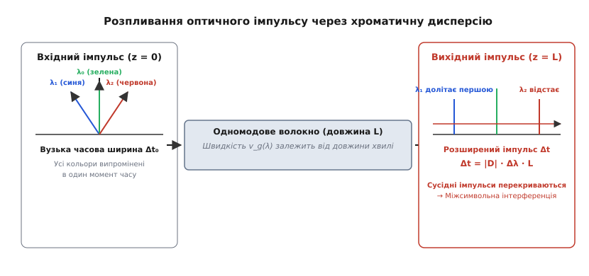
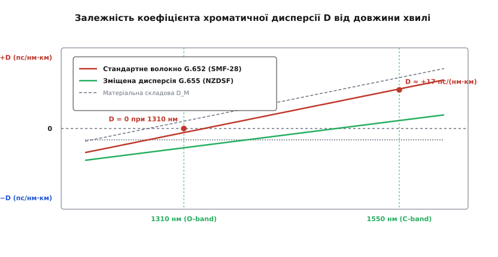
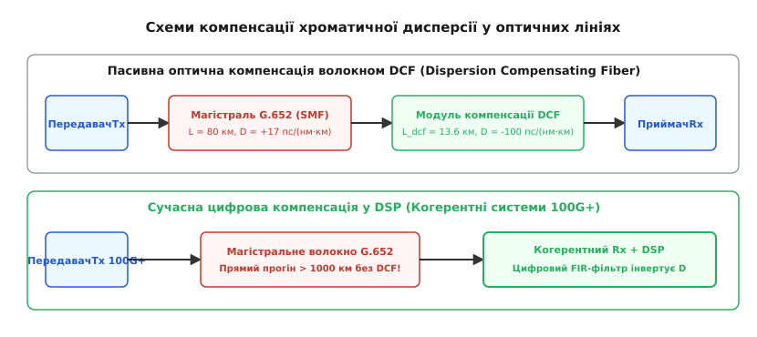

# Хроматична дисперсія у волокні

<preknowlist>
- [Оптоволокно](root:com-medium/optical-fiber) — ядро, оболонка, повне внутрішнє відбиття та загасання у склі.
- [Показник заломлення](root:ph-waves/refractive-index) — сповільнення світла у середовищі та його залежність від довжини хвилі.
</preknowlist>

Якщо передавати дані по одномодовому оптичному волокну зі швидкістю 10 Гбіт/с (стандарт 10GBASE-ER) на довжині хвилі 1550 нм, сигнал зіпсується не через згасання світла. Навіть якщо оптична потужність на приймачі буде з великим запасом, після 70 кілометрів прогону лінія почне приносити суцільні бітові помилки (BER). Причина полягає у часовому розмиванні оптичного імпульсу: короткий світловий спалах тривалістю 100 пікосекунд, що відповідає логічній одиниці, у процесі руху волокном розширюється до 150 пікосекунд і більше, буквально наповзаючи на сусідній часовий інтервал. Приймач замість чіткої послідовності прямокутних спалахів отримує розмазане кашоподібне поле світла й перестає розрізняти, де закінчується один біт і починається наступний. Чому ж світловий імпульс розплавляється в часі, якщо в одномодовому волокні модова дисперсія повністю відсутня?

### Чому світловий імпульс розпадається на швидкості

Відповідь ховається у природі самого світла та матеріалу, крізь який воно біжить. Жоден реальний напівпровідниковий лазер (чи то DFB-лазер з розподіленим зворотним зв'язком, чи тим паче Fabry-Perot лазер) не є ідеально монохроматичним. Його випромінювання завжди має скінченну спектральну ширину Δλ — тобто складається з набору трохи різних довжин хвиль (кольорів) у межах від десятків часток нанометра до кількох нанометрів. 

Понад те, сам процес модуляції лазера — швидке вмикання та вимикання струму або робота зовнішнього оптичного модулятора Маха-Цандера для формування бітів — математично розширює спектр імпульсу. Згідно із фундаментальною властивістю перетворення Фур'є, що коротший імпульс у часовій області Δt₀, то ширший його частотний спектр Δω. На швидкостях у десятки гігабіт за секунду цей спектральний «хвіст» стає вельми відчутним.

Коли такий імпульс потрапляє у скляну серцевину волокна, вмикається фундаментальна фізична властивість скла: **групова швидкість поширення світлової хвилі v_g залежить від довжини хвилі λ**. 

```text
v_g(λ) = c / n_g(λ)
```

Тут `c` — швидкість світла у вакуумі, а `n_g` — **груповий показник заломлення** (*group refractive index*, від латинського *groupus* — «група» та *refringere* — «заломлювати»), який описує швидкість руху обгинаючої оптичного імпульсу (його енергії), а не окремої фазової гребінки хвилі.

Оскільки імпульс містить цілий спектр довжин хвиль, а кожна спектральна складова біжить волокном зі власною груповою швидкістю `v_g(λ)`, різні кольорові компоненти одного й того самого спалаху долають однакову відстань `L` за різний час. Синя складова спектра (коротша довжина хвилі) може обганяти червону (довшу довжину хвилі), або навпаки. Випромінені в один і той самий момент часу на початку волокна (`z = 0`), спектральні складові прибувають до вихідного торця (`z = L`) урізнобій. Приймальний фотодіод підсумовує оптичну потужність усіх складових і «бачить» розширений у часі імпульс.


*Короткий вхідний імпульс складається з набору довжин хвиль. У волокні швидкість поширення залежить від довжини хвилі, тому синя складова долітає раніше за червону. На виході імпульс розширюється, що викликає міжсимвольну інтерференцію (ISI).*

Це явище залежності групової швидкості світлової хвилі у волокні від її довжини хвилі називають **хроматичною дисперсією** (*chromatic dispersion*, від грецького *chroma* — «колір» та латинського *dispergere* — «розсіювати»).

📜 [Історія відкриття довжини хвилі нульової дисперсії та пастки FWM](root:com-medium/chromatic-dispersion/hist-zero-dispersion.md) описує, як у 1970–1980-х роках оптичні інженери намагалися приборкати цей ефект, чому вони створили волокно зі зміщеною дисперсією (DSF) і як поява багатоканальних систем WDM перетворила нульову дисперсію на небезпечну пастку.

### Квантові й геометричні витоки: матеріальна та хвилеводна складові

Чому ж групова швидкість залежить від довжини хвилі? У світловоді ця залежність складається з двох фізично різних механізмів, які додаються один до одного: **матеріальної дисперсії** (`D_M`) та **хвилеводної дисперсії** (`D_W`).

```text
D(λ) = D_M(λ) + D_W(λ)
```

#### 1. Фізична природа матеріальної дисперсії (D_M)
Матеріальна дисперсія корениться у самій квантово-механічній та атомній структурі кварцового скла (SiO₂). Вилучені та зв'язані електромагнітні коливання у склі мають два головні резонансні діапазони поглинання:
- **Ультрафіолетовий резонанс (поблизу λ ≈ 0.1 мкм):** викликаний електронними переходами між валентною зоною та зоною провідності діоксиду кремнію.
- **Інфрачервоний резонанс (поблизу λ ≈ 9–11 мкм):** викликаний фононними коливаннями решітки кремній-кисень (міжкремнієві зв'язки Si–O).

Між цими двома резонансами лежить область прозорості скла (від 0.4 мкм до 2.0 мкм). Згідно з розсіювальними співвідношеннями Крамерса-Кроніга, будь-яке поглинання неминуче спотворює показник заломлення `n(λ)` сусідніх довжин хвиль. Ця залежність математично виражається рівнянням Сельмейєра:

```text
n²(λ) = 1 + ∑ [ B_i · λ² / (λ² − C_i) ]
```

де `B_i` та `C_i` — коефіцієнти Сельмейєра, що характеризують сили та довжини хвиль резонансів.

Оскільки груповий показник заломлення виражається через першу похідну від `n(λ)`:

```text
n_g(λ) = n(λ) − λ · (dn / dλ)
```

коефіцієнт матеріальної дисперсії `D_M` виявляється пропорційним **другій похідній** фазового показника заломлення по довжині хвилі:

```text
D_M(λ) = − (λ / c) · (d²n / dλ²)
```

Для чистого плавленного кварцю друга похідна `d²n/dλ²` змінює знак у інфрачервоній області:
- На коротких довжинах хвиль (менше 1270 нм) `D_M < 0` — це область **нормальної дисперсії**, де короткі хвилі (синіші) біжать повільніше за довгі (червоніші).
- На довжинах хвиль понад 1270 нм `D_M > 0` — це область **аномальної дисперсії**, де довгі хвилі біжать повільніше за короткі.
- Точно на довжині хвилі **λ ≈ 1270 нм** друга похідна дорівнює нулю (`d²n/dλ² = 0`), і матеріальна дисперсія скла повністю зникає (`D_M = 0`)!

Допування серцевини диоксидом германію (GeO₂) підвищує показник заломлення `n₁`, але водночас трохи зміщує резонансні частоти, зсуваючи матеріальну нульову точку `D_M = 0` убік довших хвиль (до 1275–1280 нм).

#### 2. Геометричний механізм хвилеводної дисперсії (D_W)
Хвилеводна дисперсія виникає не через властивості скла як речовини, а через геометричну структуру та хвилеводні обмеження тонкої серцевини одномодового волокна. 

У одномодовому волокні розповсюджується фундаментальна мода `HE₁₁`. Поле цієї моди не є на 100% локалізованим усередині серцевини радіуса `a`. Частина оптичної потужності біжить у ядрі з показником заломлення `n₁`, а частина — у формі «згасаючого поля» (*evanescent field*) заходить у оболонку з меншим показником заломлення `n₂`. Ефективний показник заломлення моди `n_eff` є середнім зваженим між `n₁` та `n₂`:

```text
n_eff = b · n₁ + (1 − b) · n₂
```

де `b` — нормована постійна поширення, яка є функцією нормованої частоти волокна `V`:

```text
V = (2 · π · a / λ) · √(n₁² − n₂²)
```

Коли довжина хвилі `λ` зростає, нормована частота `V` зменшується. Це означає, що світлове поле «роздувається» у просторі: модова пляма (MFD — *Mode Field Diameter*) стає ширшою й глибше проникає у оболонку. Оскільки оболонка має менший показник заломлення `n₂`, вища частка світла опиняється у «швидшому» середовищі оболонки. У результаті ефективний показник заломлення моди `n_eff(λ)` падає зі зростанням `λ` швидше, ніж це відбувалося б у суцільному об'ємі скла.

Цей геометричний ефект розширення поля описується формулою хвилеводної дисперсії:

```text
D_W(λ) = − [ (n₁ − n₂) / (c · λ) ] · V · [ d²(V·b) / dV² ]
```

Для стандартного волокна зі східчастим профілем показника заломлення друга похідна `d²(V·b)/dV²` є додатною у робочому діапазоні `V ∈ (1.5, 2.4)`, тому хвилеводна дисперсія є від'ємною (`D_W < 0`).


*Залежність коефіцієнта D від довжини хвилі для стандартного волокна SMF-28 та зміщеного NZDSF. Матеріальна складова D_M обнуляється біля 1270 нм, а від'ємна хвилеводна D_W зсуває загальну нульову дисперсію D = 0 до 1310 нм.*

Як видно з графіка, накладення від'ємної хвилеводної дисперсії `D_W ≈ −5 пс/(нм·км)` на додатну матеріальну криву `D_M` зсуває точку нульової суммарної дисперсії `D(λ) = 0` з 1270 нм вгору за довжиною хвилі — точно у точку **1310 нм**!

Змінюючи геометрію серцевини (наприклад, створюючи депресивну оболонку, W-подібний профіль або трикутний профіль заломлення), інженери можуть штучно збільшувати |D_W| до −17 пс/(нм·км) і більше. Саме так було створено волокно зі зміщеною дисперсією (DSF / G.653), у якому нульову дисперсію `D = 0` було перенесено з 1310 нм на 1550 нм.

### Коефіцієнт D, нахил дисперсії S та формула розпливання

Для практичних інженерних розрахунків розширювати імпульс через похідні показнику заломлення не потрібно. Використовують один підсумковий параметр — **коефіцієнт хроматичної дисперсії D**.

Коефіцієнт `D` показує, на скільки пікосекунд (пс) розшириться оптичний імпульс від джерела зі спектральною шириною в 1 нанометр (нм), пройшовши волокно довжиною в 1 кілометр (км). Одиниця вимірювання `D`:

```text
[D] = пс / (нм · км)
```

Знаючи коефіцієнт `D` для вибраного волокна, ширину спектра джерела `Δλ` та довжину траси `L`, абсолютне часове розширення імпульсу `Δt` обчислюють за формулою:

```text
Δt = |D| · Δλ · L
```

Розглянемо параметри основних типів одномодових волокон, регламентованих міжнародними стандартами ITU-T:

1. **Стандартне одномодове волокно (SSMF / ITU-T G.652, наприклад Corning SMF-28):**
   - У вікні **1310 нм** (O-band): `D ≈ 0 пс/(нм·км)` (допущений діапазон від −3 до +3 пс/(нм·км)). Дисперсія тут мізерна, але загасання скла становить `α ≈ 0.35 дБ/км`.
   - У вікні **1550 нм** (C-band): `D ≈ +17 пс/(нм·км)`. Тут скло має абсолютний мінімум загасання (`α ≈ 0.19…0.20 дБ/км`), проте хроматична дисперсія є високою та додатною.

2. **Волокно зі ненульовою зміщеною дисперсією (NZDSF / ITU-T G.655):**
   - У вікні **1550 нм**: `D ≈ +2…+6 пс/(нм·км)` (для волокон типу TrueWave RS або LEAF). Дисперсія навмисно зроблена невеликою, але принципово не нульовою, щоб придушити чотирихвильове змішування (FWM) у багатоканальних DWDM-системах.

3. **Волокно зі зменшеним піком води (ZWB / ITU-T G.652.D):**
   - Сучасний магістральний стандарт, що усуває пік поглинання іонів гидроксилу (OH⁻) на 1383 нм, дозволяючи використовувати весь спектральний діапазон від 1260 нм до 1625 нм (CWDM).

#### Нахил хроматичної дисперсії (Dispersion Slope, S)
Оскільки коефіцієнт `D(λ)` залежить від довжини хвилі, його значення змінюється в межах оптичного діапазону. Швидкість зміни коефіцієнта `D` по довжині хвилі називають **нахилом дисперсії** (*dispersion slope*):

```text
S = dD / dλ
```

Одиниця вимірювання `S`: `пс / (нм² · км)`.Для волокна SMF-28 нахил становить `S₀ ≈ 0.092 пс/(нм²·км)`.

Це означає, що у багатоканальній DWDM-системі на 80 каналів у C-діапазоні (1530–1565 нм) крайні канали бачать різний коефіцієнт дисперсії:
- Канал 1 (1530 нм): `D ≈ 15.6 пс/(нм·км)`
- Канал 80 (1565 нм): `D ≈ 18.8 пс/(нм·км)`

Якщо не враховувати нахил `S`, компенсатор дисперсії, ідеально налаштований для центрального каналу, залишить недокомпенсованими крайні канали WDM-спектра!

#### Дисперсія вищого порядку (TOD) та PMD
У високошвидкісних системах (40G / 100G) виникають ще два важливі спотворення:
- **Дисперсія третього порядку (TOD — Third-Order Dispersion, β₃):** описує зміну параметра `β₂` з частотою. TOD важить, коли центральна довжина хвилі лежить точно у точці нульової дисперсії (`β₂ = 0`), створюючи асиметричні спотворення та «осциляційній хвіст» оптичного імпульсу.
- **Поляризаційна модова дисперсія (PMD — Polarization Mode Dispersion):** виникає через мікроскопічну еліптичність серцевини та механічні напруження у склі. Дві ортогональні поляризації світла біжать з трохи різною швидкістю. На відміну від хроматичної дисперсії (яка є детермінованою та постійною), PMD є **випадковою флуктуючою величиною**, що змінюється від температури та вібрацій кабелю.

#### Параметр GVD (β₂) у хвильовій оптиці
У теоретичній фізиці та хвильовій оптиці замість коефіцієнта `D` часто оперують параметром **дисперсії групових швидкостей (GVD)** `β₂`, який описує другу похідную постійної поширення `β` по коловій частоті `ω`:

```text
β₂ = d²β / dω²
```

Зв'язок між інженерним коефіцієнтом `D` та фізичним параметром `β₂` виражається точним співвідношенням:

```text
D = − (2 · π · c / λ²) · β₂
```

Коли `D > 0` (аномальна дисперсія, як у волокні G.652 на 1550 нм), параметр `β₂` є від'ємним (`β₂ ≈ −21.7 пс²/км`). 

🧮 [Математика хроматичної дисперсії: розклад хвильового вектора та розрахунок розширення імпульсу](root:com-medium/chromatic-dispersion/math-dispersion-pulse.md) розгортає повний розклад Фур'є для гаусового імпульсу, показує виведення параметра `β₂` та дає точний розрахунок розширення імпульсу з урахуванням чірпування.

### Межа швидкості й дальності (Inter-Symbol Interference)

Чому саме розширення імпульсу `Δt` встановлює жорстку межу на максимальну довжину оптичної лінії?

У цифровому оптичному зв'язку дані передаються послідовністю імпульсів. Для найпоширенішого кодування без повернення до нуля (NRZ) тривалість одного бітового інтервалу `T_bit` обернено пропорційна бітовій швидкості `B`:

```text
T_bit = 1 / B
```

Наприклад, для швидкості `B = 10 Гбіт/с` тривалість біта становить `T_bit = 1 / (10 · 10⁹) = 100 пікосекунд`.

Щоб приймальний фотодіод міг надійно відрізнити одиницю від нуля у своєму строго визначеному тактному вікні, розширений імпульс не повинен виходити далеко за межі свого часового слота. Згідно з критерієм системного бюджету дисперсії, допустиме розширення `Δt` не має перевищувати приблизно **20–30% від тривалості біта**:

```text
Δt ≤ 0.25 · T_bit  ⇒  Δt ≤ 0.25 / B
```

Підставивши у цю нерівність формулу розширення `Δt = |D| · Δλ · L`, отримуємо межу дальності для систем із безпосередньою модуляцією лазера:

```text
B · |D| · Δλ · L ≤ 0.25
```

Проте найцікавіший і найжорсткіший випадок виникає тоді, коли ми використовуємо високоякісний узкоспектральний DFB-лазер із зовнішнім модулятором. У цьому разі спектральна ширина випромінювання `Δλ` визначається не власною шириною лінії лазера, а саме **частотою модуляції**: спектр імпульсу розширюється за законом Фур'є `Δω ≈ B`. 

Переходячи від частотного спектра `Δω` до спектра довжин хвиль `Δλ = (λ² / c) · B`, підсумкова нерівність граничної дальності набуває вигляду:

```text
B² · |D| · L ≤ 0.104 · c / λ²
```

Зверніть увагу на квадратичну залежність **B²**! Це фундаментальний закон оптичної зв'язку: **підвищення швидкості передачі у N разів зменшує граничну дальність неокомплектованої лінії у N² разів**.

Порахуємо граничну дальність `L_max` для стандартного волокна SMF-28 (`D = 17 пс/(нм·км)`) на довжині хвилі 1550 нм при різних швидкостях:

1. **Швидкість 2.5 Гбіт/с (STM-16 / OC-48):**
   Тривалість біта `T_bit = 400 пс`. Квадратичне обмеження дає граничну дальність **L_max ≈ 900–1000 км**. На такій швидкості хроматична дисперсія майже не заважає, і лінія обмежена лише загасанням світла.

2. **Швидкість 10 Гбіт/с (10GBASE-ER / STM-64):**
   Тривалість біта `T_bit = 100 пс`. Гранична дальність падає у `4² = 16 разів` і становить **L_max ≈ 50–60 км**! Передати 10 Гбіт/с на 80 км без спеціальної компенсації дисперсії вже фізично неможливо.

3. **Швидкість 40 Гбіт/с (STM-256):**
   Тривалість біта `T_bit = 25 пс`. Гранична дальність падає ще у 16 разів — до **L_max ≈ 3–4 км**! 

4. **Швидкість 100 Гбіт/с (100GBASE-LR4):**
   Без компенсації сигнал розплавляється вже через **кількасот метрів** волокна.

#### Штраф за потужністю (Dispersion Power Penalty)
Коли часове розширення `Δt` наближається до тривалості біта, прийом сигналу на фотодіоді стає важчим. Для збереження заданого коефіцієнта бітових помилок (наприклад, `BER = 10⁻¹²`) оптичний приймач вимагає вищої оптичної потужності на вході. Цю додаткову необхідну потужність називають **дисперсійним штрафом за потужністю** (*Dispersion Power Penalty*, `PP`):

```text
PP (дБ) ≈ 4.34 · (2 · π · B · Δt)²
```

Якщо `Δt` становить 20% від бітового інтервалу, штраф за потужністю дорівнює близько `1.0 дБ`. Якщо ж розширення зростає до 50%, штраф росте експоненціально й перевищує `5–6 дБ`, викликаючи різкий «дисперсійний підйом» рівню помилок BER (*dispersion floor*), який неможливо виправити подальшим збільшенням потужності лазера.

#### Вплив чірпування лазера (Chirp parameter, α)
Параметр чірпування `α` напівпровідникового лазера описує динамічну зміну фази випромінювання під час наростання й спаду світлового імпульсу:

```text
α = (d n_real / d N) / (d n_imag / d N)
```

- **Лазери з прямою модуляцією (DML — Directly Modulated Laser):** мають високий позитивний чірп (`α ≈ +2…+6`). При увімкненні лазера густина носіїв `N` змінюється, утворюючи паразитна частотна модуляція (передній фронт імпульсу стає синішим, задній — червонішим). У волокні з додатним `D` (SMF-28 на 1550 нм) такий чірп прискорює розплавання імпульсу у 2–3 рази, зменшуючи досяжність 10G DML лазерів до 10–20 км.
- **Лазери з електроабсорбційним модулятором (EML):** мають низький чірп (`α ≈ 0…+1`), що дозволяє 10G трансиверам досягати 40–80 км.
- **Маха-Цандерові модулятори (LiNbO₃ MZM):** дозволяють створювати від'ємний чірп (`α < 0`), завдяки чому передній фронт умисне роблять червонішим. У волокні з `D > 0` такий імпульс спочатку **стискається** у часі, і лише потім починає розширюватися, додаючи кілометри безкомпенсаційного прогону!

> 🔧 **Навіщо це.**
> Розрахунок бюджету хроматичної дисперсії є обов'язковим етапом проектирування будь-якої оптичної лінії зі швидкістю 10 Гбіт/с і вище. Якщо загальна накопичена дисперсія траси `D_total = D · L` перевищує допустимий ліміт оптичного трансивера (наприклад, 800 пс/нм для стандартного оптичного модуля SFP+ 10G ER на 40 км), лінія не підніметься або генеруватиме хаотичні помилки BER, навіть якщо оптичний потужносний бюджет (згасання в дБ) розрахований із великим запасом.

### Практичний розрахунок магістралі 500 км DWDM

Проілюструємо реальний процес розрахунку бюджету дисперсії для магістральної DWDM лінії довжиною 500 км на волокні G.652.D зі швидкістю 10 Гбіт/с на канал (80 км між підсилювачами EDFA, всього 6 прогонів):

1. **Загальна накопичена дисперсія траси:**
   Для 500 км волокна SMF-28 на 1550 нм (`D = +17 пс/(нм·км)`):
   `D_accum = 17 · 500 = +8500 пс/нм`.
2. **Стратегія компенсації:**
   Використовуємо пасивні модулі DCF на кожній підсилювальній станції (6 модулів DCF).
3. **Розрахунок компенсатора на прогін:**
   На кожному 80 км прогоні накопичується `17 · 80 = +1360 пс/нм`. Встановлюємо модуль DCF-80 з накопиченою від'ємною дисперсією `-1300 пс/нм`.
4. **Залишкова дисперсія (Residual Dispersion):**
   Після кожного прогону залишається незакомпенсованими `+60 пс/нм`. Наприкінці 500 км траси сумарна залишкова дисперсія становить `6 · 60 = +360 пс/нм`.
   Це ідеальне значення, бо приймачі 10G мають оптимальне вікно прийому саме при легкій додатній залишковій дисперсії (+200…+400 пс/нм), що пригнічує самофазову модуляцію (SPM).

### Діагностика в операційній системі та показники трансиверів

При роботі з оптичними інтерфейсами у Linux інженер може знімати внутрішні параметри трансивера SFP+/QSFP28 через підсистему **DDMI / DDM** (Digital Diagnostic Monitoring Interface), яка регламентована специфікаціями SFF-8472 та SFF-8636.

Усі параметри телеметрії транслюються мікроконтролером оптичного модуля через шину I2C за фіксованою адресою пристрою `0xA2`. Базові регістри пам'яті 96–105 містять калібровані значення п'яти головних аналогових величин:
- Температура модуля (`bytes 96-97`)
- Напруга живлення VCC (`bytes 98-99`)
- Струм зсуву лазера Laser Bias Current (`bytes 100-101`)
- Вихідна оптична потужність Tx Power (`bytes 102-103`)
- Вхідна оптична потужність Rx Power (`bytes 104-105`)

Хоча сам коефіцієнт дисперсії волокна не вимірюється фотодіодом трансивера безпосередньо, наслідки хроматичної дисперсії проявляються у формі штрафу за потужністю (Dispersion Power Penalty) та зростанні коефіцієнта бітових помилок (BER).

Утиліта `ethtool` дозволяє прочитати з EEPROM модуля його спектральний тип, довжину хвилі та підтримувану дальність:

```text
# ethtool -m eth0
	Identifier                : 0x03 (SFP+)
	Extended identifier       : 0x04 (POWER CL 1)
	Connector                 : 0x07 (LC)
	Transceiver codes         : 0x20 0x00 0x00 0x00 (10GBASE-ER)
	Laser wavelength          : 1550.00 nm
	Module temperature        : 38.25 degrees C
	Laser bias current        : 28.50 mA
	Laser output power        : 1.25 mW / 0.97 dBm
	Receiver signal average   : 0.12 mW / -9.21 dBm
```

У специфікації модуля 10GBASE-ER вказано терпіння до хроматичної дисперсії (*dispersion tolerance*): від 0 до +800 пс/нм. Це означає, що при перевищенні накопиченої дисперсії понад 800 пс/нм (що відповідає близько 47 км волокна SMF-28 без компенсації) оптичний рівень сигналу `-9.21 dBm` може виявитися недостатнім через розмиття імпульсу, навіть якщо нормальний поріг чутливості фотодіода становить `-15.0 dBm`.

У сучасних Linux-системах на когерентних розширювальних картках (наприклад, карт з когерентними оптичними трансиверами 100G/400G CFP2-DCO чи QSFP-DD) DSP процесор транслює поточне значення **виміряної накопиченої хроматичної дисперсії** траси у реальному часі через sysfs або розширені командні атрибути:

```text
# ethtool --show-coherents eth1
Coherent Optical Diagnostics:
	Carrier Wavelength       : 1550.52 nm (Channel 35, 193.50 THz)
	Accumulated CD           : +12450 ps/nm
	Polarization Mode Disp   : 4.2 ps
	Differential Group Delay : 1.8 ps
	DSP CD Compensation Status: OK (Range -40000 to +40000 ps/nm)
```

Ці показники дозволяють системному адміністратору миттєво оцінити фізичну довжину траси (`L = 12450 / 17 ≈ 732 км`) та переконатися, що DSP працює у безпечному діапазоні цифрової компенсації.

### Способи компенсації хроматичної дисперсії

Оскільки магістральні волоконні лінії протяжністю у сотні й тисячі кілометрів будують на довжині хвилі 1550 нм (де загасання мінімальне — 0.2 дБ/км), інженери мусили знайти способи нейтралізувати накопичену додатну дисперсію `D = +17 пс/(нм·км)`.

Протягом еволюції оптичних мереж викристалізувалися три основні технології компенсації:


*Порівняння двох підходів до компенсації: пасивне волокно DCF проти сучасної цифрової компенсації у DSP когерентного приймача.*

#### 1. Модулі волоконної компенсації (DCF — Dispersion Compensating Fiber)
Найпоширенішим класичним рішенням 2000-х років стало введення в оптичний тракт спеціальних компенсаційних катушок **волокна DCF**.

DCF — це волокно із спеціальним W-подібним профілем заломлення та дуже вузькою серцевиною. У ньому штучно створюють колосальну від'ємну хвилеводну дисперсію, завдяки чому підсумковий коефіцієнт становить `D_DCF ≈ −80…−150 пс/(нм·км)`.

Модуль DCF вставляють у проміжну позицію підсилювальних вузлів (EDFA). Довжину компенсаційного волокна `L_DCF` підбирають так, щоб від'ємна дисперсія катушки повністю погасила додатну дисперсію магістрального волокна `L_SMF`:

```text
D_SMF · L_SMF + D_DCF · L_DCF = 0  ⇒  L_DCF = − (D_SMF · L_SMF) / D_DCF
```

Наприклад, для компенсації 80 км прогону SMF-28 (`D = +17 пс/(нм·км)`, загальна накопичена дисперсія `+1360 пс/нм`) достатньо катушки DCF довжиною близько `13.6 км` з `D_DCF = −100 пс/(нм·км)`.

🔌 [Модулі компенсації дисперсії (DCF та CFBG)](root:com-medium/chromatic-dispersion/comp-dcf-module.md) описує внутрішнє влаштування катушок DCF, брегівських решіток із чірпом (CFBG), а також аналізує їхні головні недоліки: додаткове згасання світла та нелінійні ефекти.

#### 2. Решітки Брегга із чірпом (CFBG — Chirped Fiber Bragg Grating)
Компактна пасивна альтернатива катушкам DCF. У короткому відрізку волокна (10–15 см) створюють фазову решітку з періодом `Λ(z)`, що плавно змінюється вздовж довжини. 

Синя складова спектра відбивається від початку решітки й повертається негайно, тоді як червона складова проходить углиб решітки й відбивається пізніше. Це створює від'ємну часову затримку, яка збирає розплавлений імпульс назад у гострий спалах без використання кілометрових катушок скла та майже без додаткового загасання.

#### 3. Цифрова когерентна компенсація у DSP (Сучасний стандарт 100G / 400G / 800G)
У сучасних високорівневих оптичних мережах зі швидкостями 100 Гбіт/с і вище від оптичних компенсаторів (DCF та CFBG) відмовилися повністю. 

У **когерентних оптичних приймачах** прихідний оптичний сигнал змішують зі світлом локального гетеродинного лазера за допомогою 90-градусного оптичного гібрида. Це дозволяє фотодіодам зняти повну інформацію про комплексну амплітуду та **фазу** оптичного поля.

Далі швидкісні АЦП оцифровують сигнал, і цифровий процесор сигналів (DSP) пропускає його крізь цифровий фільтр із кінцевою імпульсною характеристикою (FIR). Оскільки хроматична дисперсія є строго детермінованою фазовою спотворенням з передавальною функцією `H_CD(ω) = exp(−i · β₂/2 · ω² · L)`, DSP просто застосовує **зворотну фазову функцію** `H_CD⁻¹(ω)` у цифровому вигляді!

Цифровий DSP здатен математично компенсувати до **100 000 пс/нм** накопиченої дисперсії (що відповідає понад 5000 км прямого волокна G.652) без жодного фізичного компенсатора в лінії.

⚙️ [Калькулятор бюджету хроматичної дисперсії та розрахунок модуля DCF](root:com-medium/chromatic-dispersion/proj-dispersion-calc.md) містить готовий інженерний калькулятор мовами C та C++ для оцінки накопиченої дисперсії траси, визначення ширини імпульсу на виході та розрахунку параметрів компенсації.
