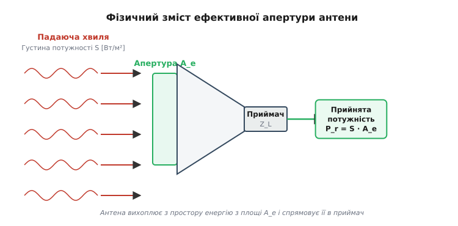
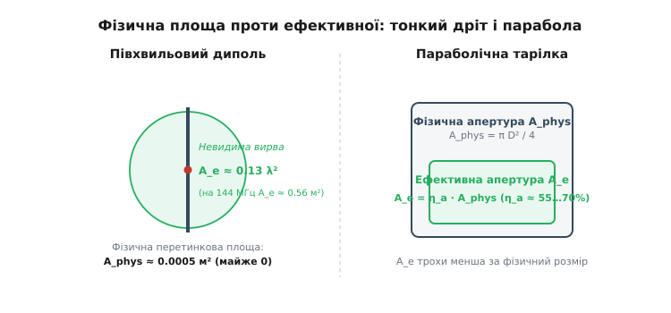
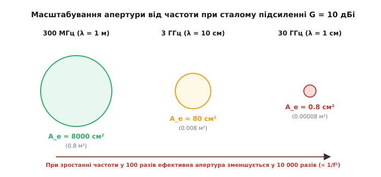
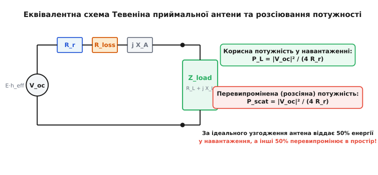
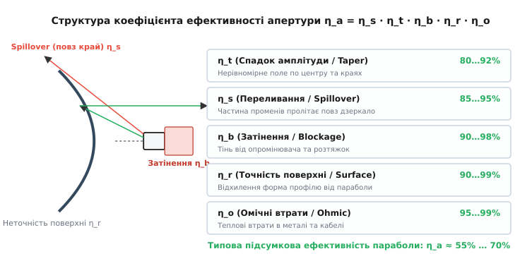

# Ефективна апертура антени

<preknowlist>
- [Антена як транслятор](root:com-medium/antenna) — принципи випромінювання й прийому електромагнітних хвиль.
- [Підсилення й діаграма спрямованості](root:com-medium/antenna-gain) — концентрація енергії в просторі та поняття ізотропного випромінювача.
- [Поляризація антени](root:com-medium/antenna-polarization) — узгодження орієнтації векторів електричного поля.
- [Рівняння передачі Фрііса](root:com-medium/friis-transmission) — розрахунок потужності прийнятого сигналу на відстані.
</preknowlist>

На частоті 144 МГц простий півхвильовий диполь, виготовлений із мідного дроту завтовшки 2 мм, має фізичну площу поперечного перерізу менше ніж 0.001 м². Поруч із ним параболічна тарілка діаметром 20 см на частоті 60 ГГц має суцільну металеву площу близько 0.03 м² — у тридцять разів більшу. Проте за одинакової густини потоку падаючої хвилі 1 мВт/м² той самий «тонкий» диполь вихоплює з простору й віддає в приймач 0.56 мВт потужності, а параболічна тарілка на 60 ГГц — лише 0.015 мВт, тобто у 37 разів менше.

Цей парадокс демонструє головний факт про приймання радіохвиль: антена у просторі не працює як механічна сітка для збирання тенісних м'ячів. Вона взаємодіє з електромагнітним полем через резонанс, дифракцію та інтерференцію. Здатність антени вихоплювати енергію з хвилі визначається не фізичною товщиною її металу, а **ефективною апертурою** (лат. *apertura* — отвір, щілина) — уявна площа у квадратних метрах, з якої антена висмоктує 100% падаючої енергії.

### 1. Невидима вирва: фізична площа проти ефективної

Щоб зрозуміти фізичний зміст ефективної апертури `A_e`, уявимо плоску електромагнітну хвилю, що поширюється у вільному просторі. Хвиля несе енергію, яка характеризується **густиною потоку потужності** `S` — кількістю ватів, що проходять крізь один квадратний метр фронту хвилі (`Вт/м²`). Модуль вектора Пойнтінга визначається через амплітуду електричного поля `E`:

```
S = |E × H| = E² / (2 · Z₀)         [де Z₀ = 120π ≈ 377 Ом — хвильовий опір вакууму]
```


*Антена розглядається як просторовий збирач: із падаючого потоку густиною S вона перехоплює енергію з умовної площі A_e і спрямовує потужність P_r = S · A_e у приймальне навантаження.*

Коли ця хвиля натрапляє на приймальну антену, антена вилучає з хвилі частину енергії й передає її у фідерний кабель до приймача. Прийнята потужність `P_r` (у ватах) пов'язана з густиною потоку `S` співвідношенням:

```
P_r = S · A_e
```

Звідси випливає означення: **ефективна апертура `A_e` — це коефіцієнт пропорційності між густиною потоку потужності падаючої хвилі та прийнятою потужністю у сопряжено узгодженому навантаженні**. Вона вимірюється у квадратних метрах (`м²`).

Тут виникає принципова відмінність між двома основними класами антен:

1. **Апертурні антени** (рупори, параболічні дзеркала, лінзи, плоскі мікросмужкові решітки). Вони мають чітко виражену **фізична площу** `A_phys`. Для них ефективна апертура пропорційна геометричному розміру: `A_e = η_a · A_phys`, де `η_a` — коефіцієнт ефективності апертури (*aperture efficiency*), який для реальних конструкцій становить від 0.5 до 0.85 (50%–85%).
2. **Дротяні антени** (диполі, рамки, штирі, антени Ягі). Фізична площа перерізу самого дроту мізерно мала. Проте їхня ефективна апертура `A_e` пропорційна **квадрату довжини хвилі `λ²`**.


*Тонкий півхвильовий диполь майже не має фізичної поверхні, але створює навколо себе «невидиму вирву» площею 0.13 λ². Параболічна тарілка має реальну металеву площу, але її ефективна апертура трохи менша за фізичний обвід.*

Для півхвильового диполя ефективна апертура дорівнює:

```
A_e,dipole ≈ 0.13 · λ²
```

На діапазоні 144 МГц довжина хвилі `λ ≈ 2.08 м`, тому `A_e ≈ 0.13 · (2.08)² ≈ 0.56 м²`. Диполь створює навколо свого тонкого провідника електромагнітну «невидиму вирву» радіусом близько `λ / π`. Хвилі, що проходять повз дріт у цій зоні, деформуються під дією наведеного в диполі резонансного струму й викривляють лінії вектора Пойнтінга, висмоктуючись у провідник. Подробиці виникнення цього поняття в середині XX століття описано в [історичній вставці](root:com-medium/effective-aperture/hist-aperture.md).

### 2. Фундаментальна теорема: A_e = (λ² / 4π) · G

Уявімо умову: чи існує універсальний закон, що пов'язує підсилення антени `G` (яке характеризує її спрямованість) з її ефективною апертурою `A_e`?

Такий зв'язок існує, і він є одним із найпотужніших результатів електродинаміки. Завдяки [взаємності антени](root:com-medium/antenna) (лат. *reciprocus* — взаємний), властивості антени на прийом і передавання абсолютно тотожні. Якщо антена в режимі передавання концентрує енергію в певному напрямку у `G` разів сильніше за ізотропний випромінювач, то в режимі прийому вона з того ж напрямку вихоплює у `G` разів більше енергії.

Для уявного **ізотропного випромінювача** (еталон із підсиленням `G = 1`, який світить абсолютно однаково в усі боки), його ефективна апертура становить:

```
A_e,iso = λ² / (4π)
```

Для будь-якої реальної антени з коефіцієнтом підсилення `G` (відносно ізотропного) її ефективна апертура в напрямку головного променя дорівнює:

```
A_e = (λ² / 4π) · G
```

Це співвідношення абсолютне. Воно справджується для **будь-якої** пасивної антени незалежно від її фізичної форми, матеріалу чи конструкції: чи це колосальний радіотелескоп діаметром 300 метрів, чи мікроскопічна друкована антена у смартфоні. Повний математичний доказ цієї формули через термодинамічну рівновагу чорного випромінювання наведено у [математичній вставці](root:com-medium/effective-aperture/math-aperture-gain.md).

З цієї формули легко виразити підсилення антени через її ефективну апертуру:

```
G = (4π / λ²) · A_e
```

Якщо антена має фізичну площу `A_phys` та ефективність `η_a`, то її підсилення виражається геометрично:

```
G = (4π / λ²) · η_a · A_phys
```

Для круглої параболічної антени діаметром `D` (де `A_phys = π · D² / 4`):

```
G = η_a · (π · D / λ)²
```

Звідси видно: підсилення параболічної антени зростає пропорційно **квадрату діаметра** та **квадрату частоти**. Подвоїв діаметр тарілки — збільшив підсилення у 4 рази (+6 дБ); подвоїв частоту за того ж діаметра — підсилення зросло ще у 4 рази.

### 3. Парадокс високих частот: чому 5G та супутники вимагають гострих променів

У цій формулі чигає фундаментальна пастка, з якою щодня зіштовхуються інженери бездротового зв'язку.

Подивімося на формулу `A_e = (λ² / 4π) · G`. Що відбувається, коли ми підвищуємо частоту сигналу `f` (зменшуємо довжину хвилі `λ = c / f`), залишаючи підсилення антени `G` незмінним (наприклад, звичайна ненапрямлена штирьова антена з `G = 2.15 дБі`)?


*При постійному підсиленні G = 10 дБі ефективна апертура зменшується пропорційно 1/f². На частоті 30 ГГц площа перехоплення у 10 000 разів менша, ніж на 300 МГц.*

Оскільки `λ` зменшується обернено пропорційно частоті, площа `A_e` падає пропорційно **квадрату частоти `1/f²`**:

```
A_e ∝ 1 / f²
```

Простежимо це на числах для антени з підсиленням `G = 10 дБі` (у 10 разів за потужністю):

```
Частота 300 МГц (λ = 1 м):    A_e = (1² / 12.57) · 10 ≈ 0.796 м² (7960 см²)
Частота 3 ГГц   (λ = 0.1 м):  A_e = (0.01 / 12.57) · 10 ≈ 0.00796 м² (79.6 см²)
Частота 30 ГГц  (λ = 0.01 м): A_e = (0.0001 / 12.57) · 10 ≈ 0.0000796 м² (0.796 см²)
```

За підйому частоти від 300 МГц до 30 ГГц (у 100 разів) ефективна площа тієї ж антени згасла у **10 000 разів** (+40 дБ втрат)! Ненапрямлена антена на міліметрових хвилях 5G (28–39 ГГц) бачить світ крізь «вушко голки» розміром у кілька квадратних міліметрів.

Саме тому на високих частотах неможливо будувати зв'язок на всебічних антенах: щоб компенсувати падіння `λ²`, доводиться різко збільшувати підсилення `G`, застосовуючи вузькоспрямовані параболічні тарілки або фазовані антенні решітки (MIMO).

### 4. Фізика прийому: еквівалентна схема Тевеніна й перевипромінювання

Як саме енергія з падаючої хвилі потрапляє в приймач і яка частина з неї губиться по дорозі?

Приймальну антену в теорії кіл моделюють **еквівалентною схемою Тевеніна**. Вона складається з генератора напруги холостого ходу `V_oc` та внутрішнього імпедансу антени `Z_A = R_r + R_L + j X_A`:

- `V_oc = E · h_eff` — наведена електрорушійна сила (ЕРС), де `E` — напруженість електричного поля хвилі, `h_eff` — ефективна висота антени.
- `R_r` — опір випромінювання (*radiation resistance*).
- `R_L` — опір омічних втрат у металі антени та діелектриках.
- `X_A` — власний реактивний опір антени (індуктивний або ємнісний).


*Приймальна антена замінюється генератором V_oc із внутрішнім опором Z_A. За сопряженого узгодження з навантаженням Z_L = Z_A* рівно 50% зібраної енергії виділяється в приймачі, а інші 50% перевипромінюються назад у простір.*

До клем антени підключається приймач із навантаженням `Z_L = R_L' + j X_L'`.

Згідно з теоремою про максимальну передачу потужності у колі змінного струму, максимальна потужність віддається в приймач за умови **сопряженого узгодження** (*conjugate matching*):

```
X_L' = -X_A             [реактивності взаємно компенсуються]
R_L' = R_r + R_L        [активні опори дорівнюють один одному]
```

Якщо антена ідеальна без омічних втрат (`R_L = 0`), то `R_L' = R_r`. При цьому струм у колі дорівнює `I = V_oc / (2 · R_r)`.

Обчислимо баланс потужностей:

1. Потужність, яка виділяється у корисному навантаженні приймача:
   `P_L = I² · R_r = |V_oc|² / (4 · R_r)`
2. Потужність, яка виділяється на внутрішньому опорі випромінювання `R_r`:
   `P_scat = I² · R_r = |V_oc|² / (4 · R_r)`

Це відкриває фундаментальний фізичний факт: **ідеально узгоджена приймальна антена забирає в навантаження лише 50% енергії, вихопленої з падаючої хвилі. Інші 50% вона перевипромінює (розсіює) назад у вільний простір!**

Ця перевипромінена потужність `P_scat` створює вторинну розсіяну хвилю. Вона відіграє ключову роль у радіолокації, оскільки визначає ефективну площу розсіювання (ЕПР / RCS, *Radar Cross Section*) приймальної антени:

```
σ_scat = (4π / λ²) · A_e²           [ЕПР узгодженої приймальної антени]
```

Якщо клеми антени коротко замкнути (`Z_L = 0`), то струм подвоюється `I = V_oc / R_r`, а перевипромінена потужність зростає у 4 рази! Антена перестає передавати енергію в кабель і працює як потужний електромагнітний відбивач.

#### Втрати узгодження й поляризації

Максимальна ефективна апертура `A_em` досягається лише за ідеальних умов. У реальній системі діють два додаткові множники зменшення апертури:

```
A_e,actual = A_em · PLF · (1 - |Γ|²)
```

- **PLF** (*Polarization Loss Factor*) — коефіцієнт поляризаційних втрат (`cos²θ`). Якщо хвиля мала вертикальну поляризацію, а антена нахилена під кутом 45°, `PLF = 0.5` (−3 дБ), що зменшує апертуру вдвічі.
- `1 - |Γ|²` — коефіцієнт імпедансного узгодження, де `Γ` — коефіцієнт відбиття від клем приймача. За неузгодженого кабелю частина енергії відбивається назад в антену й перевипромінюється.

### 5. Структура ефективності апертури (η_a) у дзеркальних і рупорних антен

Для параболічних дзеркал, рупорів та інших апертурних антен ефективна площа завжди менша за геометричний обвід: `A_e = η_a · A_phys`. Підсумковий коефіцієнт ефективності `η_a` є добутком п'яти часткових коефіцієнтів:

```
η_a = η_t · η_s · η_b · η_r · η_o
```


*Коефіцієнт ефективності апертури параболічної антени складається з амплітудного спаду (η_t), переливання (η_s), затінення (η_b), неточності форми (η_r) та омічних втрат (η_o).*

Розберімо внесок кожного фактора:

1. **Ефективність амплітудного спаду (Illumination Taper, `η_t ≈ 0.80…0.92`).** Якщо обпромінювач освітлює дзеркало рівномірно, поле на краях однакове з центром. Проте рівномірне поле створює високі бічні пелюстки (−13.2 дБ). Щоб їх пригнітити до безпечних −25…−30 дБ, поле до країв дзеркала штучно ослаблюють на 10–12 дБ за допомогою спадаючої діаграми рупора (розподіл Тейлора або Чебишева). Ця нерівномірність зменшує ефективне використання площі дзеркала.
2. **Ефективність переливання (Spillover, `η_s ≈ 0.85…0.95`).** Частина діаграми випромінювання рупорного обпромінювача пролітає повз краї параболічного дзеркала у вільний простір, не відбиваючись від рефлектора.
3. **Ефективність затінення (Blockage, `η_b ≈ 0.90…0.98`).** Сам рупорний обпромінювач та металеві розтяжки (штанги), що тримають його у фокусі, перекривають шлях частині відбитих паралельних променів, створюючи «тінь» у центрі апертури.
4. **Ефективність точності поверхні (Surface Roughness, `η_r ≈ 0.90…0.99`).** Відхилення профілю дзеркала від ідеальної параболи спричиняють фазові помилки. За формулою Рузе (*Ruze's equation*), ця ефективність дорівнює:
   `η_r = exp(-(4π · σ / λ)²)`
   де `σ` — середньоквадратичне відхилення формы дзеркала у метрах. Якщо шорсткість `σ` перевищує `λ / 16`, ефективність апертури стрімко падає до нуля. Для тарілки діапазону 60 ГГц (`λ = 5 мм`) точність виготовлення поверхні повинна бути кращою за 0.3 мм!
5. **Омічна ефективність (Ohmic Loss, `η_o ≈ 0.95…0.99`).** Втрати на нагрівання в металевому рефлекторі та хвилеводному тракті.

Перемноження цих факторів дає типову ефективність комерційних параболічних антен на рівні `η_a ≈ 0.55…0.70` (55%–70%). У високоточних супутникових антенах космічного зв'язку (завдяки двозеркальним схемам Кассегрена чи Грегорі зі спеціальним профільуванням) ефективність вдається підняти до 75%–84%.

### 6. Сканування та апертурний синтез у фазованих решітках

Коли потрібно отримати колосальну ефективну апертуру або здійснювати безінерційне сканування променем у просторі, побудувати суцільне параболічне дзеркало стає технічно неможливим через вітрові навантаження та деформацію під власною вагою. Рішенням є **апертурний синтез** та плоскі фазовані антенні решітки (ФАР).

Якщо розмістити `N` окремих випромінювачів із власною апертурою `A_e,elem` у решітку та когерентно додати їхні сигнали у фазі, сумарна ефективна апертура за нормального падіння дорівнює:

```
A_e,total(0) = N · A_e,elem · η_array
```

де `η_array` — коефіцієнт ефективності об'єднання (враховує втрати у фазообертачах та дільниках потужності).

#### Сканувальне падіння апертури (Scan Loss)

При відхиленні електронного променя ФАР на кут `θ` від нормалі площини решітки її проекційна геометрична площа зменшується внаслідок косинусоїдального ефекту. Відповідно, ефективна апертура падає за законом:

```
A_e(θ) = A_e(0) · cos θ             [косинусоїдальне падіння апертури ФАР]
```

На куті сканування 60° апертура ФАР зменшується вдвічі (−3 дБ), що вимагає розрахунку додаткового запасу потужності у бюджеті радіолінії.

#### Просторовий крок і побічні пелюстки

Важливою умовою для антенних решіток є відстань між елементами `d`. Якщо `d > λ / 2`, у просторовій діаграмі з'являються побічні максимуми — **побічні пелюстки решітки** (*grating lobes*). Це призводить до «розриву» суцільної синтезованої апертури, і частина енергії падаючої хвилі провалюється між елементами без перехоплення.

У радіоастрономії телескопи Very Large Array (VLA, США) або проект ALMA (Чилі) об'єднують десятки параболічних тарілок, розташованих на відстанях у десятки кілометрів. Методом інтерферометрії вони синтезують ефективну апертуру, яка за роздільною здатністю еквівалентна гігантській антені розміром із цілу обсерваторію.

### 7. Рівняння передачі Фрііса через апертури та практичний розрахунок

Повернімося до формули передачі Фрііса й запишемо її безпосередньо через ефективні апертури передавальної `A_e1` та приймальної `A_e2` антен:

```
P_r = P_t · (A_e1 · A_e2 / (λ² · R²))
```

Подивімося на цей вираз очима інженера. Нехай ми маємо дві параболічні антени зі сталими фізичними діаметрами (отже, зі сталими ефективними апертурами `A_e1` та `A_e2`). Якщо ми **підвищуємо частоту** (зменшуємо `λ`), то прийнята потужність `P_r` **зростає** пропорційно `1/λ²`!

Здається, це суперечить попередньому висновку про падіння апертури ізотропної антени на високих частотах. Проте суперечності немає:
- За **сталого підсилення антен** `G₁` та `G₂` прийнята потужність падає як `λ²` (бо зменшується апертура приймача).
- За **сталої фізичної площі антен** `A_e1` та `A_e2` прийнята потужність зростає як `1/λ²` (бо гостріший промінь передавача концентрує куди більше енергії на приймачу, перевищуючи зменшення хвилі).

> 🔧 **Навіщо це.** Рівняння апертур є фундаментом для проектування супутникових та радіорелейних ліній. Під час вибору обладнання інженер оцінює не лише підсилення дБі, а й реальні габарити рефлекторів, бо саме ефективна апертура визначає, скільки мікроватів сигнал вихопить із простору на тлі завад і шумів. Практичний калькулятор для обчислення апертури, діаметра параболи та прийнятої потужності у коді C та C++ наведено у [прикладному інсерті](root:com-medium/effective-aperture/proj-aperture-calculator.md).

Знання ефективної апертури дає чітке розуміння: підсилення антени — це не магічне додавання енергії, а лише просторова концентрація, а ефективна апертура — це точний вимір того, скільки квадратних метрів електромагнітного океану ваша антена здатна перетворити на корисний електричний сигнал.
