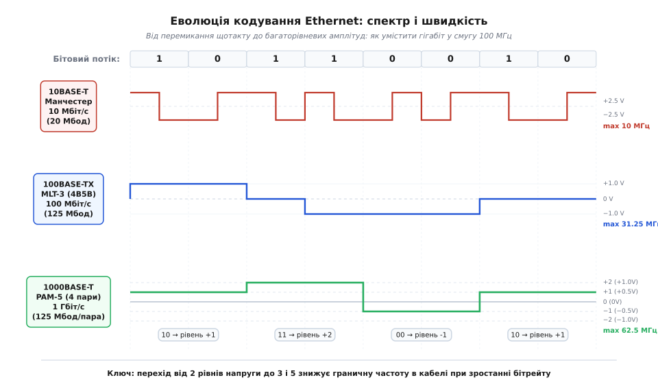
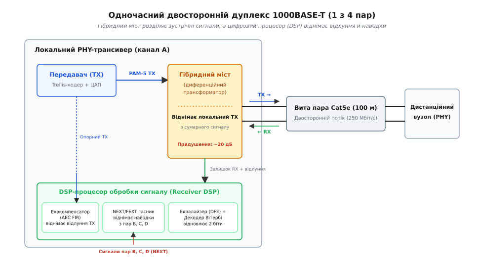
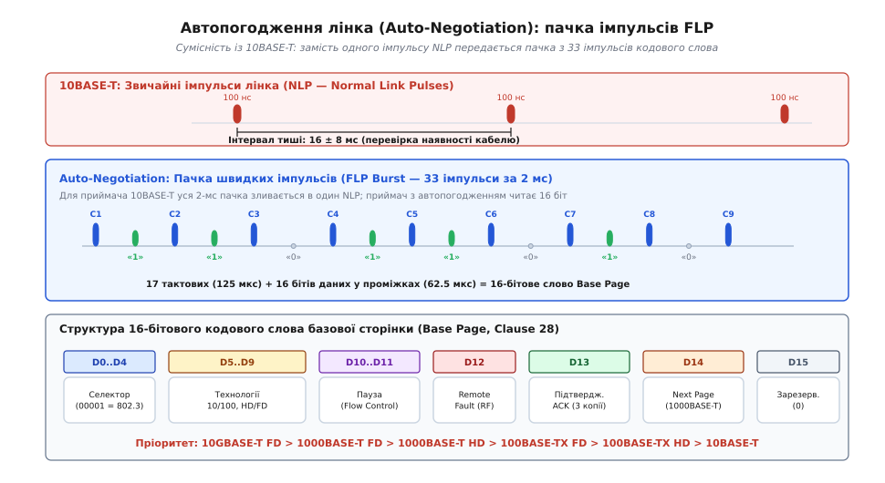
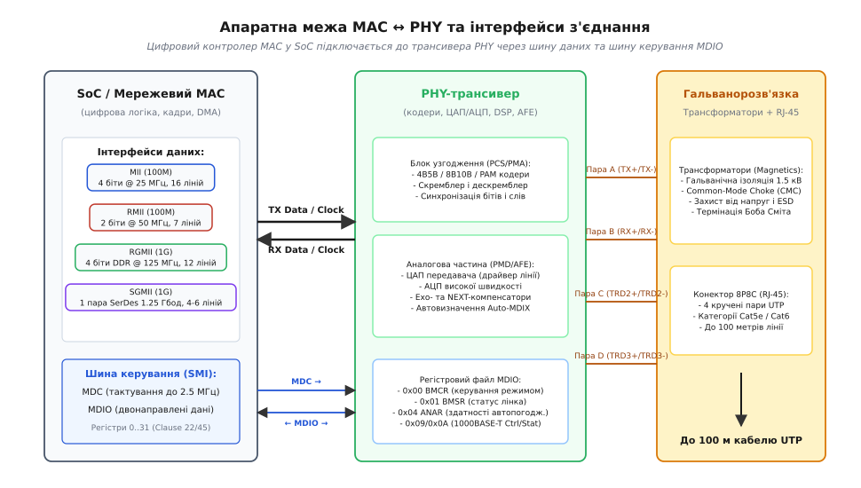

# Фізика лінка Ethernet

<preknowlist>
- [Вита пара](root:com-medium/twisted-pair) — диференційне передавання сигналу, симетрія жил та гасіння зовнішніх магнітних наводок.
- [UTP-кабель](root:com-medium/utp-cable) — категорії неекранованої витої пари (Cat5e, Cat6, Cat6a), смуга частот і загасання сигналу на 100 метрах.
- [Кадр Ethernet](root:com-transport/ethernet-frame) — структура L2-пакета: преамбула, MAC-адреси, поле типу, корисне навантаження та контрольна сума FCS.
- [Коди LDPC](root:com-modulation/ldpc) — матриці перевірки на парність низької щільності та наближення до межі Шеннона.
- [Ємність каналу за Шенноном](root:math-information/bandwidth-capacity) — теоретична межа швидкості передавання даних за заданої смуги частот і співвідношення сигнал/шум.
</preknowlist>

Звичайний мідний кабель завдовжки 100 метрів є вкрай несприятливим середовищем для високошвидкісних цифрових сигналів. Через поверхневий ефект (скін-ефект) у міді та діелектричні втрати в ізоляції провідник діє як фільтр низьких частот: що вища частота коливань, то сильніше загасає сигнал на дальньому кінці лінії. Якщо спробувати передати потік прямокутних імпульсів зі швидкістю 100 Мбіт/с чи 1 Гбіт/с у вигляді простого двійкового перемикання напруг (0 В та 3.3 В), круті фронти імпульсів повністю розмиються, паразитна ємність спотворить форму сигналів, а сам дріт перетвориться на антену, яка випромінює потужні радіозавади й ловить наводки від сусідніх пар.

Щоб передавати гігабітні потоки даних по тонких неекранованих проводах без втрати бітів, мережеву підсистему апаратно розділяють на два рівні. Цифровий контролер доступу до середовища — **MAC** (англ. *Media Access Control* — керування доступом до середовища) оперує чистими двійковими кадрами, формує адреси та перевіряє контрольні суми. За перетворення цих логічних бітів у фізичні хвильові процеси відповідає лінійний трансивер — **PHY** (англ. *Physical Layer* — фізичний рівень). Фізичний рівень Ethernet є шедевром аналогової електроніки та цифрової обробки сигналів: він використовує багаторівневу амплітудну модуляцію, спектральне скремблювання, гібридні розв'язувальні мости та адаптивне цифрове придушення відлуння.

## 1. 10BASE-T: Манчестерське кодування та перші імпульси лінка

Стандарт 10BASE-T (IEEE 802.3i, прийнятий 1990 року; лат. *basis* — основа) заклав основу сучасної топології Ethernet, перевівши мережі з незручного спільного коаксіального кабелю на звичайну виту пару категорії Cat3. Головним інженерним викликом тоді було забезпечення надійної синхронізації приймача та усунення постійної складової напруги без використання окремого тактового дроту.

### Проблема постійної складової та гальванічної розв'язки

Вхідні та вихідні ланцюги будь-якого мережевого порту Ethernet підключаються до кабелю через імпульсні ізоляційні трансформатори (англ. *magnetics*). Трансформатор пропускає лише змінний струм і фізично не здатен передавати постійну напругу (DC). Якщо передавати довгу послідовність однакових логічних одиниць або нулів прямими рівнями напруги (NRZ, англ. *Non-Return-to-Zero*), на клемах трансформатора виникне постійний струм зміщення. Сердечник трансформатора швидко ввійде в магнітне насичення, його індуктивність впаде до нуля, а сигнал на виході спотвориться — це явище називається дрейфом нульової лінії (англ. *baseline wander*).

### Механізм манчестерського кодування

Для розв'язання цієї проблеми в 10BASE-T застосували **манчестерське кодування** (англ. *Manchester coding*). У цьому коді інформація передається не абсолютним рівнем напруги, а **напрямком перепаду (фронту) в середині кожного бітового інтервалу**:

* **Логічний 0**: перехід від від'ємної напруги до додатної в середині такту (`−2.5 В → +2.5 В`);
* **Логічна 1**: перехід від додатної напруги до від'ємної в середині такту (`+2.5 В → −2.5 В`).

```general
Біт:             1                 0                 1
Рівні:    [ +2.5В | −2.5В ] [ −2.5В | +2.5В ] [ +2.5В | −2.5В ]
               \     /           /     \           \     /
Перехід:      спадний           висхідний         спадний
              (High->Low)       (Low->High)       (High->Low)
```

Така схема дає дві ключові властивості:
1. **Самовідновлення тактового сигналу (Self-Clocking)**: У центрі кожного біта гарантовано присутній перепад напруги. Фазовий автопідлаштовувач частоти (PLL) приймача підлаштовує свій внутрішній генератор під ці фронти, що усуває потребу в окремій лінії тактування;
2. **Ідеальний нульовий постійний струм (DC Balance)**: Кожен біт рівно половину свого інтервалу проводить при напрузі `+2.5 В`, а іншу половину — при `−2.5 В`. Середній інтеграл напруги за часом тотожно дорівнює нулю, тому магнітний сердечник трансформатора ніколи не насичується.

### Фізична ціна: Спектральна надмірність

Ціною надійності манчестерського коду є його спектральна неефективність. Оскільки всередині кожного біта відбувається додатковий перепад, частота перемикання сигналу (бодова швидкість, англ. *baud rate*) вдвічі перевищує корисну швидкість передавання даних:

```general
Бодова швидкість = 2 · Бітова швидкість
= 2 · 10 Мбіт/с = 20 Мбод
```

У найгіршому випадку (послідовність однакових бітів `1111...` або `0000...`) сигнал на лінії є меандром із частотою **10 МГц**. Спектральна ефективність становить лише `0.5 біт/Гц`. Телефонний кабель Cat3 ледве справлявся з цією смугою на дистанції 100 метрів.

Для передавання використовувалися дві виті пари: пара контактів 1–2 для передавання (`TX+ / TX-`) та пара 3–6 для прийому (`RX+ / RX-`). Інші дві пари (4–5 та 7–8) залишалися вільними.

### Перевірка цілісності лінка: Імпульси NLP

Коли комп'ютер не передає мережевих кадрів, лінія не може залишатися абсолютно мертвою, інакше приймач не знатиме, чи підключено кабель. Для цього стандарт 10BASE-T ввів періодичні імпульси контролю цілісності — **NLP** (англ. *Normal Link Pulses*).

Кожні `16 ± 8 мс` передавач відправляє в кабель одиночний короткий імпульс тривалістю **100 нс**. Якщо приймач фіксує регулярне надходження NLP, він піднімає апаратний статус лінка (Link Up) і запалює зелений світлодіод на роз'ємі.

## 2. Стрибок до 100BASE-TX: Блокове кодування 4B5B та трьохрівневий код MLT-3

У середині 1990-х років виникла потреба збільшити швидкість мережі вдесятеро — до 100 Мбіт/с (стандарт Fast Ethernet, IEEE 802.3u). Проте просте масштабування манчестерського кодування вимагало б бодової швидкості 200 Мбод і робочої частоти до **100 МГц**. На такій частоті загасання сигналу в кабелі Cat5 на 100 метрах перевищує 22 дБ (напруга падає у понад 12 разів), а високочастотне випромінювання порушує всі міжнародні стандарти електромагнітної сумісності (EMC).

Інженери реалізували триступеневий конвеєр перетворення сигналу: блокове кодування 4B5B, псевдовипадкове скремблювання та трьохрівневе лінійне кодування **MLT-3**.

```general
Дані MAC (100 Мбіт/с)
      │
      ▼
[ Кодер 4B5B ] ──────────► Розширення до 125 Мбіт/с (гарантія переходів)
      │
      ▼
[ Скремблер (LFSR) ] ───► Розмиття спектра (боротьба з піками EMI)
      │
      ▼
[ Лінійний кодер MLT-3 ] ─► Зниження граничної частоти до 31.25 МГц
      │
      ▼
Вита пара Cat5 (100 м)
```

### Крок 1: Блокове кодування 4B5B

Щоб відмовитися від марнотратного манчестерського коду, потрібно було усунути довгі серії нулів, під час яких сигнал не змінюється і приймач втрачає синхронізацію. Для цього кожні 4 біти корисних даних (напівбайт, англ. *nibble*) замінюються на 5-бітовий символ за спеціальною таблицею.

З 32 можливих 5-бітових комбінацій було відібрано 16 «найкращих», у яких:
* Міститься не менше двох логічних одиниць;
* Підряд іде не більше двох нулів.

Це гарантує, що за будь-якої комбінації даних на лінії ніколи не виникне пауза довша за три бітові інтервали. Решта 16 невикористаних 5-бітових слів були призначені для службових команд: символи `J` (`11000`b) та `K` (`10001`b) позначають початок кадру (Start of Stream Delimiter, SSD), символи `T` (`01101`b) та `R` (`00111`b) — кінець кадру (End of Stream Delimiter, ESD), а символ `I` (`11111`b) безперервно передається в паузах між кадрами (символ очікування IDLE).

Ціною додавання одного біта на кожні чотири швидкість передавання символів зросла зі 100 Мбіт/с до **125 Мбіт/с** (надбавка 25%).

### Крок 2: Скремблювання (Scrambling)

Оскільки в стані спокою лінія безперервно передає символ IDLE (`11111`b), у спектрі сигналу виникає потужна гармоніка на фіксованій частоті. Кабель починає працювати як передавач радіоперешкод на частотах радіомовлення та авіаційного зв'язку.

Щоб розмити цей пік, перед передачею в лінію потік бітів пропускається через **скремблер** (англ. *scrambler*, від *scramble* — перемішувати). Скремблер виконує побітове додавання за модулем 2 (XOR) вхідних даних із псевдовипадковою послідовністю, що генерується 11-розрядним регістром зсуву з лінійним зворотним зв'язком (LFSR) за поліномом:

```general
G(x) = x¹¹ + x⁹ + 1
```

Період повторення послідовності становить `2¹¹ − 1 = 2047` бітів. Скремблювання перетворює циклічні патерни на псевдовипадковий білий шум, рівномірно розподіляючи електромагнітну енергію по широкій смузі та знижуючи пікову амплітуду завад на 15–20 дБ.

### Крок 3: Трьохрівневе кодування MLT-3 (Multi-Level Transmit 3)

Завершальний крок — безпосереднє перетворення скрембльованих бітів у рівні напруги за допомогою коду **MLT-3**. Код використовує три дискретні рівні: `+1.0 В`, `0.0 В` та `−1.0 В`.

Правила кодування MLT-3:
1. Якщо поточний біт дорівнює **0**, напруга на лінії **не змінюється**;
2. Якщо поточний біт дорівнює **1**, напруга **переходить на наступний рівень** у циклічній послідовності:

```general
[ 0 В ] ──► [ +1.0 В ] ──► [ 0 В ] ──► [ −1.0 В ] ──► [ 0 В ] ...
```


*Форми сигналів на фізичному рівні: манчестерський код перемикається щотакту, генеруючи спектр до 10 МГц для 10 Мбіт/с. Код MLT-3 проходить повний цикл за 4 одиниці, знижуючи частоту до 31.25 МГц для 125 Мбод. Код PAM-5 використовує 5 рівнів напруги, кодуючи 2 біти в одному символі.*

Для здійснення одного повного коливання напруги (`0 В → +1 В → 0 В → −1 В → 0 В`) передавач повинен надіслати **чотири одиничні біти**. Тому максимальна фундаментальна частота сигналу в кабелі становить рівно одну четверту від бодової швидкості:

```general
f_max = Бодова швидкість / 4
= 125 Мбод / 4 = 31.25 МГц
```

Завдяки MLT-3 смуга частот 100-мегабітного сигналу (31.25 МГц) виявилася лише втричі вищою за 10-мегабітний 10BASE-T (10 МГц). Сигнал чудово проходить по кабелю Cat5, де загасання на частоті 31.25 МГц не перевищує допустимих 10–11 дБ.

> 🔧 **Навіщо це.** Якщо ви бачите на осцилографі прямокутні трирівневі сходинки зі значеннями +1 В, 0 В і -1 В на контактах 1–2 або 3–6 роз'єму RJ-45 — ви спостерігаєте саме потік 100BASE-TX MLT-3. Якщо сигнал стає заваленим або зміщується за рівнем 0 В, це вказує на пошкодження ізоляційного трансформатора чи розрив однієї з жил диференційної пари.

## 3. 1000BASE-T: PAM-5, 4 пари, гібридні мости та цифрова ехокомпенсація

Наприкінці 1990-х років перед комітетом IEEE 802.3ab постало завдання: досягти швидкості **1000 Мбіт/с (1 Гбіт/с)** на тій самій встановленій базі неекранованих кабелів категорії Cat5e. Гранична частота кабелю Cat5e обмежена величиною 100 МГц. Передати 1 Гбіт/с по одній парі в цій смузі фізично неможливо за теоремою Шеннона.

Рішення вимагало революційної зміни всієї парадигми передавання:
1. **Одночасне використання всіх 4 пар кабелю**;
2. **Одночасне двостороннє передавання (Dual-Duplex) по кожній парі**;
3. **П'ятирівнева амплітудна модуляція PAM-5**;
4. **Адаптивна цифрова фільтрація відлуння та перехресних завад (DSP)**.

### Розпаралелювання потоку на 4 пари

Загальний потік 1000 Мбіт/с розбивається порівну між чотирма крученими парами кабелю. Кожна окрема пара передає свій незалежний потік зі швидкістю:

```general
Швидкість на пару = 1000 Мбіт/с / 4 пари = 250 Мбіт/с
```

### Одночасне двостороннє передавання (Dual-Duplex) та гібридний міст

У 10BASE-T та 100BASE-TX одна пара працювала суто на передавання (TX), а інша — на прийом (RX). У 1000BASE-T **кожна з чотирьох пар одночасно передає дані в обох напрямках** (англ. *full duplex on single pair*). 

Як приймач може почути слабкий вхідний сигнал від віддаленого комутатора на фоні власного потужного передавача, підключеного до тих самих двох дротів?

Рішення складається з двох етапів: аналогового віднімання та цифрової ехокомпенсації.

#### 1. Гібридний трансформаторний міст (Hybrid Bridge)
На вході мікросхеми PHY встановлено аналоговий міст (диференційний гібридний трансформатор). Локальний передавач підключається до одного плеча моста, лінія кабелю — до другого, а вхід приймача — до діагоналі моста.

Оскільки мікросхема точно знає напругу, яку вона сама прикладає до кабелю, міст віднімає цю локальну напругу від сумарного сигналу на клемах. Аналоговий гібрид послаблює власний переданий сигнал приблизно на **15–20 дБ**.


*Обробка сигналу в одному каналі 1000BASE-T: передавач і приймач працюють на одній парі. Гібридний міст виконує первинне віднімання переданого сигналу, а DSP-процесор за допомогою FIR-фільтрів віднімає відбите відлуння та перехресні наводки від трьох сусідніх каналів.*

#### 2. Цифровий компенсатор відлуння (Adaptive Echo Canceller, AEC)
Після проходження 100 метрів кабелю вхідний корисний сигнал послаблюється на 20–25 дБ. Водночас через неоднорідності хвильового опору в роз'ємах і скрутках частина власного сигналу передавача відбивається назад (явище зворотних втрат, англ. *Return Loss*). Це відбите відлуння (Echo) потрапляє в приймач і за потужністю перевершує слабкий корисний сигнал віддаленого вузла.

Для його усунення використовується потужний цифровий сигнальний процесор (DSP). Локальний потік переданих символів паралельно подається на адаптивний FIR-фільтр (трансверсальний фільтр із 60–120 ваговими коефіцієнтами). Фільтр у реальному часі моделює імпульсну характеристику відлуння кабелю і синтезує точну копію паразитного сигналу, яка віднімається з виходу АЦП. Завдяки цьому відлуння придушується ще на **40 дБ**.

#### 3. Придушення перехресних завад (NEXT та FEXT)
Оскільки всі 4 пари щільно скручені в одному кабелі, потужний передавач пари A наводить паразитну ЕРС на сусідні пари B, C і D на ближньому кінці — це ближній перехресний перехід (англ. *Near-End Crosstalk*, **NEXT**), а також на дальньому кінці — дальній перехід (**FEXT**).

DSP-блок трансивера містить 12 перехресних адаптивних фільтрів (по 3 компенсатори NEXT та по 3 компенсатори FEXT на кожен із 4 каналів). Кожен канал безперервно віднімає наводки, породжені трьома іншими передавачами цього ж порту.

### Модуляція PAM-5 та Трелліс-кодування

Щоб передати 250 Мбіт/с по кожній парі в смузі до 100 МГц, застосовується 5-рівнева амплітудно-імпульсна модуляція — **PAM-5** (англ. *Pulse Amplitude Modulation 5-level*).

Напруга на лінії набуває одного з п'яти значень:
* Рівень `+2` (`+1.0 В`);
* Рівень `+1` (`+0.5 В`);
* Рівень ` 0` (` 0.0 В`);
* Рівень `−1` (`−0.5 В`);
* Рівень `−2` (`−1.0 В`).

Чотири рівні (`+2, +1, -1, -2`) використовуються для кодування **2 бітів даних за один символ**:
* `00`b → рівень `−1`;
* `01`b → рівень `−2`;
* `10`b → рівень `+1`;
* `11`b → рівень `+2`.

П'ятий рівень (`0 В`) використовується для службової корекції помилок і передавання спеціальних керуючих символів.

Оскільки один символ переносить 2 біти, необхідна бодова швидкість на кожній парі становить:

```general
Бодова швидкість = 250 Мбіт/с / 2 біти/символ = 125 Мбод
```

Максимальна фундаментальна частота сигналу PAM-5 становить половину від бодової швидкості:

```general
f_max = 125 Мбод / 2 = 62.5 МГц
```

Частота **62.5 МГц** ідеально вкладається в 100-мегагерцовий ліміт кабелю Cat5e!

Загальна пропускна здатність системи збирається з 4 каналів:

```general
Сумарна швидкість = 4 пари · 125 Мбод · 2 біти/символ
= 1000 Мбіт/с = 1 Гбіт/с
```

Для захисту від випадкових шумів 8 бітів даних (по 2 біти з 4 пар) перед модуляцією об'єднуються в 4-вимірний символ і кодуються згортковим кодом Трелліс (Trellis Coded Modulation, TCM). Приймач декодує сигнал алгоритмом Вітербі, що дає додатковий енергетичний виграш близько **6 дБ** (еквівалентно подвоєнню стійкості до шуму).

## 4. 10GBASE-T: Фізика на межі можливостей міді

Стандарт 10GBASE-T (IEEE 802.3an, 2006 рік) збільшив швидкість мідного лінка ще в 10 разів — до **10 Гбіт/с** на 100 метрів кабелю категорії Cat6a.

На частотах до 500 МГц (робоча смуга Cat6a) звичайна кручена пара демонструє колосальне загасання: на довжині 100 метрів рівень сигналу падає на **45–50 дБ** (потужність корисного сигналу зменшується у 100 000 разів). На таких масштабах домінуючим фактором стає міжкабельна наводка — **Alien Crosstalk (ANEXT)** (електромагнітний вплив сусідніх кабелів, покладених у спільний лоток).

Щоб «витягнути» 10 Гбіт/с крізь такий шум, застосовано гранично складний математичний апарат:
1. **Модуляція PAM-16**: Сигнал використовує 16 рівнів напруги (від −15 до +15 із кроком 2), передаючи 3.125 корисних бітів на символ при тактовій частоті **800 Мбод** на кожній із 4 пар;
2. **Прекодування Томлінсона-Харашіми (THP — Tomlinson-Harashima Precoding)**: Замість того, щоб підсилювати високочастотні складові на стороні приймача (що неминуче підсилило б і шум кабелю), форма сигналу спотворюється наперед у передавачі (пре-еквалізація), компенсуючи АЧХ кабелю ще до виходу в лінію;
3. **Коди корекції помилок LDPC (Low-Density Parity-Check)**: Дані захищаються потужним кодом LDPC з розміром блоку `(2048, 1723)` бітів, доповненим контрольною сумою CRC-8. Алгоритм LDPC працює на відстані всього 1–1.5 дБ від абсолютної теоретичної межі Шеннона, виправляючи пачки помилок за умов, коли амплітуда завад майже зрівнюється з амплітудою сигналу.

Ціною 10GBASE-T є висока складність обчислень: DSP-процесор кожного порту виконує понад 100 мільярдів операцій на секунду, а енергоспоживання мікросхеми сягає 2.5–5 Вт на порт, що вимагає масивних радіаторів та активного охолодження.

## 5. Механізм автопогодження лінка (Auto-Negotiation FLP)

Коли два пристрої Ethernet з'єднуються кабелем, вони повинні самостійно домовитися про максимальну спільну швидкість (10, 100, 1000 чи 10000 Мбіт/с) та режим дуплексу (Half або Full Duplex). Цей процес стандартизовано в IEEE 802.3 Clause 28 під назвою **Auto-Negotiation**.

Головна вимога до автопогодження полягала в **абсолютній зворотній сумісності**: старий мережевий адаптер 10BASE-T не повинен зависати чи видавати помилки при підключенні до сучасного гігабітного комутатора.

### Імпульси FLP (Fast Link Pulses)

Для передачі цифрової інформації про свої можливості автопогодження замінило поодинокі імпульси NLP (які 10BASE-T надсилав раз на 16 мс) на **пачки швидких імпульсів — FLP** (англ. *Fast Link Pulses*).

Кожна пачка FLP триває близько **2 мс** і містить серію з **33 імпульсних позицій**, розташованих з інтервалом **62.5 мкс**:
* **17 непарних позицій** (C1..C17, інтервал 125 мкс) — це обов'язкові **тактові імпульси (Clock Pulses)**, які задають часову сітку;
* **16 парних позицій** (D0..D15, розташовані посередині між тактовими) — це **імпульси даних (Data Pulses)**: наявність імпульсу кодує логічну `1`, відсутність — логічний `0`.


*Сумісність автопогодження: для приймача 10BASE-T уся 2-мілісекундна пачка FLP сприймається як один звичайний імпульс NLP. Приймач з автопогодженням зчитує 16 бітів інформації базової сторінки.*

Для застарілого обладнання 10BASE-T вся 2-мілісекундна пачка імпульсів через низькочастотну фільтрацію зливається в один енергетичний сплеск і сприймається як стандартний імпульс NLP, підтверджуючи наявність фізичного кабелю.

### Структура 16-бітового кодового слова (Base Page)

16 бітів даних утворюють так звану базову сторінку (англ. *Base Page*):
* `D0..D4` — **Селектор технології**: значення `00001`b позначає стандарт IEEE 802.3 Ethernet;
* `D5` — 10BASE-T Half Duplex;
* `D6` — 10BASE-T Full Duplex;
* `D7` — 100BASE-TX Half Duplex;
* `D8` — 100BASE-TX Full Duplex;
* `D9` — 100BASE-T4;
* `D10` — Керування потоком (Pause Frames, симетричні паузи);
* `D11` — Асиметричні паузи (Asymmetric Pause);
* `D12` — Сигнал віддаленої аварії (Remote Fault);
* `D13` — Підтвердження прийому (**ACK**): виставляється в `1`, коли пристрій отримав і успішно декодував три однакові сторінки FLP від партнера;
* `D14` — Наявність наступної сторінки (**Next Page**): вказує, що пристрій передаватиме розширені сторінки (обов'язково для 1000BASE-T та 10GBASE-T, де потрібно узгодити параметри Master/Slave та частоти вище 100 МГц);
* `D15` — Зарезервовано (0).

### Таблиця пріоритетів (Priority Resolution)

Обидва вузли обмінюються своїми базовими сторінками і знаходять логічний перетин підтримуваних технологій. Якщо обидва вузли підтримують кілька спільних режимів, автоматично обирається найвищий за пріоритетом (IEEE 802.3 Annex 28B):

```general
1. 10GBASE-T Full Duplex        (Найвищий пріоритет)
2. 1000BASE-T Full Duplex
3. 1000BASE-T Half Duplex
4. 100BASE-TX Full Duplex
5. 100BASE-T4
6. 100BASE-TX Half Duplex
7. 10BASE-T Full Duplex
8. 10BASE-T Half Duplex         (Найнижчий пріоритет)
```

### Вибори Master/Slave для 1000BASE-T

Для роботи гігабітного лінка 1000BASE-T один із трансиверів повинен виступати тактовим майстром (**Master**), а інший — веденим (**Slave**). Генератор Master задає опорну частоту тактування, від якої працюють ЦАП усіх 4 передавачів. Трансивер Slave синхронізує свій внутрішній PLL за прийнятим сигналом і повертає свій потік строго у фазі з Master.

Вибір Master/Slave відбувається під час обміну сторінками Next Page:
* Комутатори (багатопортові пристрої) за замовчуванням оголошують вищий пріоритет на статус Master;
* Кінцеві комп'ютери (однопортові пристрої) прагнуть стати Slave;
* Якщо з'єднуються два однакові пристрої (наприклад, два комутатори), вони генерують випадкове 10-бітове число (Seed). Вузол із більшим значенням стає Master.

### Паралельне детектування (Parallel Detection)

Якщо до гігабітного комутатора підключити старий комп'ютер, на якому автопогодження примусово вимкнено або не підтримується, комутатор не отримає пачок FLP. У цьому випадку спрацьовує механізм **паралельного детектування**:
* Аналогові фільтри PHY слухають лінію: якщо виявлено сигнал IDLE 100BASE-TX — встановлюється швидкість 100 Мбіт/с; якщо виявлено пульси NLP — 10 Мбіт/с;
* **Залізне правило стандарту**: оскільки при паралельному детектуванні режим дуплексу віддаленого вузла невідомий, локальний порт **зобов'язаний увімкнути напівдуплексний режим (Half Duplex)**.

> ⚠️ **Класична пастка: Duplex Mismatch.** Якщо на одному кінці дроту примусово налаштувати 100 Мбіт/с Full Duplex, а на іншому залишити Auto-Negotiation, лінк підніметься (паралельне детектування розпізнає 100 Мбіт/с), але автопогодження виставить Half Duplex. Сторона Full Duplex почне надсилати кадри без перевірки несучої, а сторона Half Duplex сприйматиме одночасний прийом як колізію, обриваючи передачу й надсилаючи Jamming-сигнал. Мережа буде працювати вкрай повільно, із втратою до 90% пакетів при появі зустрічного трафіку.

## 6. Інтерфейси з'єднання MAC ↔ PHY та шина керування MDIO

Між цифровою логікою мережевого адаптера (MAC) та аналоговим трансивером (PHY) пролягають стандартизовані шини зв'язку. Їхня еволюція спрямована на скорочення кількості виводів мікросхем при одночасному підвищенні пропускної здатності:

* **MII (Media Independent Interface, 10/100 Мбіт/с)**: 4 біти даних для прийому, 4 біти для передавання, роздільні тактові сигнали 25 МГц (`TX_CLK`, `RX_CLK`). Потребує 16 ліній зв'язку;
* **RMII (Reduced MII, 10/100 Мбіт/с)**: 2 біти даних при єдиному спільному тактовому сигналі 50 МГц (`REF_CLK`). Скорочує кількість виводів до 7;
* **GMII (Gigabit MII, 1 Гбіт/с)**: 8 бітів даних на частоті 125 МГц (`125 МГц · 8 біт = 1000 Мбіт/с`). Потребує понад 24 друковані доріжки;
* **RGMII (Reduced GMII, 1 Гбіт/с)**: Загальноприйнятий стандарт для гігабітного зв'язку. Використовує 4 біти даних і передачу за обома фронтами тактового сигналу 125 МГц (**DDR**). Потребує лише 12 ліній. Вимагає точного зсуву фази тактового сигналу на 1.5–2.0 нс відносно даних (RGMII-ID);
* **SGMII (Serial GMII, 1 Гбіт/с)**: Високошвидкісний диференційний послідовний інтерфейс (SerDes LVDS) зі швидкістю 1.25 Гбод і кодуванням 8B/10B. Потребує всього 4–6 виводів.


*Апаратна межа MAC ↔ PHY: цифрова частина в SoC взаємодіє з аналоговим трансивером через паралельну шину даних кадру (MII/RGMII) та послідовну двопровідну шину налаштування й діагностики MDIO/MDC.*

Для програмного керування параметрами PHY (перезавантаження, читання статусу лінка, налаштування автопогодження) використовується двопровідна послідовна шина **MDIO/MDC** (Management Data Input/Output):
* `MDC` — тактовий сигнал до 2.5 МГц, що генерується контролером MAC;
* `MDIO` — двоспрямована лінія даних із підтяжкою до живлення.

Через шину MDIO процесор звертається до 16-бітових регістрів трансивера: регістр `0x00` (BMCR) керує режимом роботи, `0x01` (BMSR) показує стан лінка, `0x04` (ANAR) задає список оголошуваних швидкостей, а регістри `0x09`/`0x0A` керують гігабітним режимом 1000BASE-T.

Повний опис електричних сигналів, часових затримок інтерфейсів MII/RGMII/SGMII та бітових полів регістрів керування наведено в окремій довідковій вставці [Інтерфейси зв'язку MAC-PHY та карта регістрів MDIO](root:com-medium/ethernet-link-phy/api-phy-interfaces.md).

Практичну реалізацію низькорівневого біт-бенгінг драйвера шини MDIO, функцію програмного скидання та кінцевий автомат розв'язання параметрів лінка мовами C та ідіоматичним C++ винесено у практичну вставку [Реалізація програмного драйвера MDIO та опитування стану лінка](root:com-medium/ethernet-link-phy/proj-mdio-driver.md).

## 7. Вузли гальванічної розв'язки та захисту (Magnetics)

Жоден мідний кабель Ethernet не вмикається безпосередньо в кремнієві виводи трансивера. Між мікросхемою PHY і гніздом 8P8C (RJ-45) обов'язково встановлюється модуль узгоджувальних трансформаторів — **Magnetics** (дискретний або вбудований у сам роз'єм MagJack).

Модуль Magnetics виконує три життєво важливі функції:
1. **Гальванічна ізоляція 1500 В**: За стандартом IEEE 802.3 лінія Ethernet повинна витримувати напругу пробою не менше 1500 В (RMS) частотою 50/60 Гц протягом однієї хвилини. Це захищає комп'ютерне обладнання від вирівнювальних струмів між різними контурами заземлення в будівлі та від наведених імпульсів грозових розрядів;
2. **Синфазний дросель (Common-Mode Choke, CMC)**: Дросель пропускає диференційний корисний сигнал без перешкод, але створює високий індуктивний опір для синфазних завад, що наводяться зовнішніми радіополями одночасно на обидва дроти пари;
3. **Термінація Боба Сміта**: Центральні відводи обмоток трансформатора з боку кабелю з'єднуються через резистори 75 Ом і високовольтний конденсатор (1000 пФ, 2 кВ) із заземленням шасі. Це узгоджує хвильовий опір кабелю для синфазних хвиль (який для витої пари становить приблизно 145 Ом на пару або 75 Ом для двох об'єднаних пар) і швидко стікає електростатичний заряд, запобігаючи іскрінню в роз'ємі.
