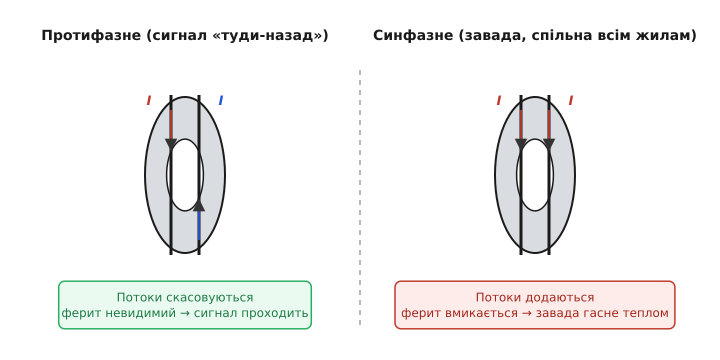
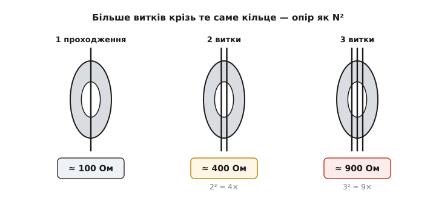

# Феритова клема

Майже на кожному добротному USB-, моніторному чи мережевому шнурі сидить груба чорна потовщеність — «бочечка», у якій ховається феритове кільце, надіте на **весь кабель**. Це феритова клема: литий незнімний варіант заформовують у шнур ще на виробництві, а знімну защіпку (*clamp* — затискач) із двох половинок у пластиковому замку можна за секунду начепити на будь-який готовий кабель і так само зняти. Усередині — той самий магнітом'який ферит, що й у [феритовій намистині](root:hw-components/ferrite-bead), лише у формі тора, надітого на жмут жил; для роботи на десятках-сотнях мегагерців беруть [втратний матеріал](root:hw-components/core-losses) сорту NiZn, бо його опір не провалюється на високих частотах так, як у MnZn.

Питання, на яке клема відповідає, підступне: чому кільце на цілому кабелі гасить заваду, а корисний сигнал крізь нього проходить, наче фериту й немає? Відповідь — у різниці між двома видами струму в кабелі, і саме на ній тримається вся деталь.

### Два струми в одному кабелі

Корисний сигнал і живлення течуть кабелем **парою**: туди однією жилою, назад іншою. Такі струми звуть **протифазними** (*differential mode*, від латинського *differre* — розносити в різні боки): у кожну мить вони рівні й протилежні. А отже, їхні магнітні поля у фериті — теж рівні й протилежні: сумарний потік крізь тор **нуль**. Для корисного струму кільця ніби не існує — ні помітної [індуктивності](root:ph-electromagnetism/inductance), ні втрат, ні падіння сигналу.

Завада поводиться інакше. Вона наводиться чи випромінюється кабелем **як цілим**: однаковий струм тече в усіх жилах **в один бік**, а повертається десь манівцями — через землю, корпус, паразитні ємності до простору. Це **синфазний** струм (*common mode*, від латинського *communis* — спільний): спільний для всіх жил. Для нього поля жил у фериті вже не скасовуються, а **додаються** — кільце бачить повний потік і вмикається на повну, перетворюючи енергію завади на тепло. Той самий синфазний струм у корпусній деталі душить [синфазний дросель](root:hw-components/inductor-types) — котушка з двома обмотками на спільному осерді; клема робить це для готового кабелю без жодної перемотки.


*Ліворуч струм «туди-назад»: потоки двох жил у фериті рівні й протилежні, скасовуються — тор для сигналу невидимий, і сигнал проходить незайманим. Праворуч струм, спільний усім жилам: потоки додаються, ферит бачить повний потік і працює втратною бусиною. Тому кільце вдягають на ввесь кабель одразу, а не на окрему жилу.*

Звідки взагалі береться синфазний струм. Плата всередині пристрою шумить крутими фронтами й перетворювачем живлення, її «земля» трохи гойдається відносно зовнішнього світу — і кабель, припаяний до цієї землі, працює антеною, що випромінює шум назовні. Або навпаки: зовнішнє радіополе наводить однаковий струм у всіх жилах одразу. Клема біля виходу кабелю з корпуса працює в обидва боки — не випускає власний шум пристрою (заради норм випромінювання) і не впускає чужий (заради завадостійкості).

> 🔧 **Навіщо це.** Коли готовий пристрій не проходить вимірювання випромінювання, винний майже завжди кабель: він довгий, стирчить із корпуса й випромінює синфазний шум, як антена. Защіпка на цей кабель — найдешевший спосіб збити викид на проблемній частоті, не чіпаючи плату. Тому феритову клему тримають у шухляді поряд із приладом: це перша річ, яку пробують, коли «фонить».

### Скільки опору дає клема й чому жила має бути в парі

Одне проходження кабелю крізь типову защіпку — це **десятки-сотні ом** для синфазного струму на частотах у десятки-сотні мегагерців. Точне число читається з кривої повного опору в даташиті деталі — рівно так само, як у будь-якої [феритової намистини](root:hw-components/ferrite-bead): робоча зона клеми це горб її кривої, і саме туди треба поцілити частотою завади. Типова снап-он клема дає близько двохсот ом на 25 МГц і піднімається до п'яти сотень ом на сотні мегагерців — небагато поодинці, зате задарма й за секунду.

Тут стає зрозуміло, чому крізь кільце пропускають **обидві** жили разом, а не одну. Надінь клему лише на одну жилу пари — і вона побачить повний потік уже й корисного струму теж: для протифазного сигналу деталь перетвориться на звичайну [послідовну намистину](root:hw-components/ferrite-bead) з усіма наслідками для крутості фронтів. Скасування потоків працює тільки тоді, коли всі жили пари проходять крізь тор разом.

### Кілька витків: опір росте як N²

Якщо опору одного проходження мало, кабель пропускають крізь кільце **кілька разів**. Кожен виток додає своє поле, і повний опір росте приблизно як **N²** — та сама квадратична логіка, що стоїть за [індуктивністю котушки](root:ph-electromagnetism/inductance): подвоїв витки — учетверо більший опір.


*Одне проходження, два й три витки крізь те саме кільце. Опір росте не лінійно, а як N²: три витки дають приблизно вдев'ятеро більший опір, ніж одне проходження. Це майже завжди вигідніше, ніж нанизувати кілька окремих кілець уряд.*

**Защіпка дає 100 Ом на 100 МГц за одне проходження; намотаємо три витки.** Опір на тій самій частоті росте як квадрат числа витків:

```
Z₁ = 100 Ом         (одне проходження, N = 1)
Z₃ = N² · Z₁
   = 3² · 100
   = 9 · 100
   = 900 Ом         (три витки, N = 3)
```

Дев'ятсот ом замість сотні — синфазна завада на цій частоті послаблюється майже на порядок сильніше, і все це без жодної зміни в самій схемі пристрою.

Та квадрат росте не вічно. Сусідні витки лежать поряд і утворюють між собою паразитну ємність; що більше витків, то ця ємність більша — і на високих частотах завада починає **перестрибувати** з витка на виток повз ферит, а не йти крізь нього. Через це горб опору з'їжджає до нижчих частот, і додавати витки понад певну межу марно або й шкідливо. Практична стеля — **два-чотири** проходження.

> 🔧 **Навіщо це.** Коли однієї защіпки не вистачає, перший інстинкт — повісити поряд другу. Та два-три витки крізь одне кільце дадуть учетверо-вдев'ятеро більший опір, ніж два кільця в один прохід (ті додаються лише вдвічі). Тож спершу намотують витки на наявне кільце й аж потім беруть друге — менше заліза за більший ефект.

### Защіпка як інструмент діагностики

Знімна защіпка — улюблений інструмент налагодження електромагнітної сумісності, і не лише як ліки, а і як **проба**. Пристрій «фонить» на вимірюваннях або глючить біля радіопередавача? Начепи кільце на підозрілий кабель і дивись: стало краще — отже, завада синфазна й тікає саме цим шляхом, і тепер відомо, де лікувати по-справжньому (фільтр на платі, кращий екран, чистіша земля). Не змінилося нічого — шлях інший, кабель ні до чого, шукаємо далі. Дешевий дослід на пів хвилини заміняє годину гадань, куди подівся шум.

### Типові граблі

- **Чекати порятунку від гулу 50 Гц.** Клема працює на мегагерцах; мережевий гул, пульсації живлення й низькочастотний «фон» в аудіо вона не чіпає — це просто не її частоти. Від земляної петлі феритом не рятуються.
- **Кільце на одній жилі пари.** Тоді воно бачить повний потік і корисного струму — сигнал гасне разом із завадою, а фронти завалюються. Крізь тор мають іти всі жили пари разом.
- **Нещільно закрита защіпка.** Зазор у магнітному шляху різко зменшує ефект: повітряний проміжок «розмагнічує» осердя так само, як [зазор у котушці](root:ph-electromagnetism/inductance) обвалює її індуктивність. Половинки мають зімкнутися чисто, без бруду й перекосу.
- **Десять витків «про запас».** Міжвиткова ємність шунтує кільце на високих частотах, горб опору з'їжджає вниз — на потрібній високій частоті ефект може навіть погіршати. Два-чотири витки — практична стеля.
- **Не та частота фериту.** Клема з матеріалу під сотні мегагерців майже нічого не дасть проти завади на одиниці мегагерц, і навпаки. Сорт фериту добирають під частоту шуму так само прицільно, як [номінал намистини](root:hw-components/ferrite-bead).

### Рідня тієї самої ідеї

Феритова клема — це лише одне обличчя великої родини. Литі «бочечки» на готових шнурах і знімні защіпки всіх діаметрів роблять те саме на кабелі. Плоскі ферити затискають на шлейфах. А «дротяна» рідня в корпусі для монтажу на плату — [синфазний дросель](root:hw-components/inductor-types): дві обмотки на спільному осерді, той самий принцип «протифазне проходить, синфазне гасне», лише виконаний як деталь, а не як кільце на проводі. Усіх їх єднає одна думка: відрізнити струм, спільний для жил, від струму «туди-назад» — і погасити лише перший, не зачепивши другого.
