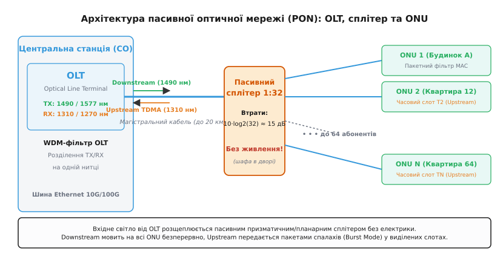
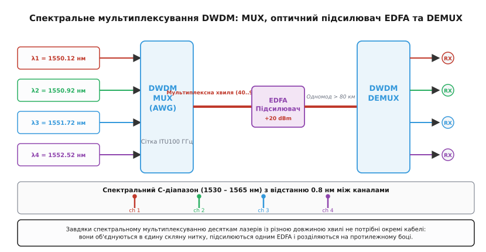
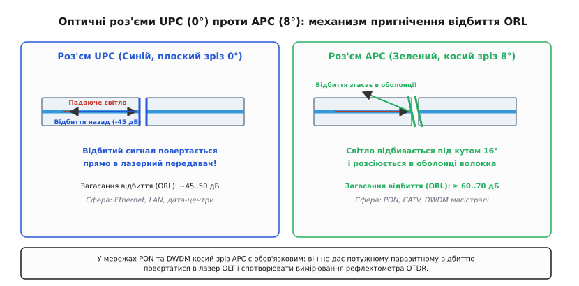

# Мережеве оптичне волокно: архітектури, мультиплексування та оптичний бюджет

<preknowlist>
- [Оптоволокно](topic:com-medium/optical-fiber) — принципи повного внутрішнього відбиття, одномодовий та багатомодовий режими, інфрачервоні вікна прозорості.
- [Децибели](topic:hw-analog/decibels) — логарифмічна шкала відносного підсилення, загасання та абсолютна потужність у дБм (dBm).
- Ethernet, I2C, EEPROM — стандартні апаратно-протокольні інтерфейси зв'язку та цифрової діагностики.
</preknowlist>

Коли мікрорайон на 10 000 абонентів потребує високошвидкісного інтернету, спроба прокласти окрему оптичну нитку від центрального комутатора до кожної квартири розбивається об фізичні й економічні реальності. Прокладання тисяч окремих кабелів вимагає підземних колекторів завтовшки з тунель метро, а комутатор на центральній станції мав би містити тисячі коштовних портів із колосальним енергоспоживанням. Якщо ж спробувати поставити активні комутатори у дворових шафах чи під'їздах, мережа втрачає головную перевагу скляного волокна — незалежність від живлення, захищеність від грози та працездатність під час знеструмлень.

Розв'язок цієї суперечності полягає у переході від поодинокого світловода до **мережевої оптичної архітектури**. Об'єднавши властивості спектрального ділення хвиль із пасивним розщепленням світлового потоку, інженери навчилися живити тисячі абонентів від одного лазера та однієї оптичної нитки.

---

### Топологічні моделі: AON проти PON та концепція FTTx

У побудові оптичних мереж доступу (**FTTx** — *Fiber to the X*) застосовують декілька концептуальних топологій залежно від того, наскільки близько скляне волокно підходить до кінцевого термінала користувача:

```text
 ┌─────────────────────────────────────────────────────────────────────────┐
 │ АКТИВНА МЕРЕЖА (AON / Point-to-Point)                                  │
 │                                                                         │
 │ [Центральна станція] ────(Кабель)────► [Активний комутатор] ──► [ONU 1] │
 │ (OLT / Switch)                          (Потребує 220 В)    ──► [ONU 2] │
 └─────────────────────────────────────────────────────────────────────────┘

 ┌─────────────────────────────────────────────────────────────────────────┐
 │ ПАСИВНА МЕРЕЖА (PON / Point-to-Multipoint)                             │
 │                                                                         │
 │ [Центральна станція] ────(Магістраль)──► [Пасивний сплітер] ──► [ONU 1] │
 │ (OLT)                                    (Без електрики)    ──► [ONU 2] │
 └─────────────────────────────────────────────────────────────────────────┘
```

1. **FTTH (*Fiber to the Home* — Волоконний кабель до квартири/приватного будинку):**
   Оптична нитка заходить безпосередньо в житлове приміщення абонента й підключається до оптичного термінала (ONT). Це забезпечує максимальну пропускну здатність, повну гальванічну розв'язку та абсолютну незалежність від стану електричних мереж будинку.
2. **FTTB (*Fiber to the Building* — Волоконний кабель до будинку):**
   Оптика доходить до підвалу чи технічного поверху багатоквартирного будинку, де встановлюється під'їзний комутатор. Від нього до квартир іде класична мідна кручена пара Ethernet (Cat5e/Cat6). FTTB дешеший у розгортанні, але комутатор будинку вимагає резервного живлення, а мідна ділянка вразлива до грозових наводок.
3. **FTTC / FTTN (*Fiber to the Curb / Node* — Волоконний кабель до шафи/вузла району):**
   Оптика підводиться до вуличного розподільчого шафи на квартал, від якої до будинків використовуються наявні телефонні мідні лінії VDSL2 чи G.fast.

Порівняння двох фундаментальних концепцій побудови FTTx — **AON** та **PON**:

 В **AON (Point-to-Point)** кожен абонент має виділений оптичний канал до проміжного активного комутатора, розташованого у вузлі району.
 - **Переваги:** Повна виділена пропускна здатність (наприклад, 1 або 10 Гбіт/с симетрично на кожного клієнта), проста діагностика стандартним Ethernet-протоколом, відсутність взаємного впливу абонентів.
 - **Недоліки:** Необхідність безперебійного електроживлення, клімат-контролю та резервних акумуляторів у кожній проміжній шафі. У разі вимкнення світла у будинку активний комутатор гасне, позбавляючи зв'язку весь квартал.

 В **PON (Point-to-Multipoint)** проміжне активне обладнання повністю відсутнє. Оптичний промінь від одного порту центрального термінала **OLT** (*Optical Line Terminal*) іде магістральним волокном до пасивного призматичного розгалужувача — **сплітера** (*Optical Splitter*), який фізично розщеплює світловий потік на 8, 16, 32 або 64 окремі нитки до абонентських пристроїв **ONU/ONT** (*Optical Network Unit/Terminal*).


*Схема пасивної оптичної мережі (PON): станційний термінал OLT передає суцільний потік Downstream на довжині хвилі 1490 нм крізь пасивний сплітер 1:32 до всіх ONU. У зворотному напрямку Upstream (1310 нм) абонентські пристрої відповідають у строго виділених часових слотах (TDMA).*

Прозора історія виникнення та випробувань перших трансатлантичних магістралей та перших протоколів розгалуження викладена в матеріалі про [історію оптичних мереж](topic:com-medium/fiber-in-network/hist-optical-networking.md).

---

### Принцип часового та спектрального розділення у PON

Оскільки всі абонентські пристрої ONU підключені до єдиного оптичного дерева сплітера, виникають дві задачі: як розділити зустрічні потоки передачі/прийому та як не допустити зіткнення сигналів від різних абонентів у зворотному напрямку.

1. **Дуплекс по єдиному волокну (WDM Duplex):**
   Прямий потік від станції до абонента (**Downstream**) та зворотний потік від абонента до станції (**Upstream**) біжать однією скляною ниткою, але на **різних довжинах хвиль**:
   - У класичному **GPON** (ITU-T G.984): Downstream = **1490 нм**, Upstream = **1310 нм**.
   - У високошвидкісному **XGS-PON** (ITU-T G.9807.1): Downstream = **1577 нм**, Upstream = **1270 нм**.
   Завдяки різниці хвиль фотони двох потоків проходять крізь один один без найменшої перешкоди або інтерференції.

2. **Мовлення у прямому каналі (Downstream Broadcast):**
   OLT випромінює безперервний оптичний потік на довжині хвилі 1490 нм (чи 1577 нм). Пасивний сплітер дублює цей сигнал на всі вихідні нитки. Кожен абонентський термінал ONU бачить загальний потік кадрів, але за допомогою апаратного MAC-фільтра приймає лише ті пакети, які адресовані його власному ідентифікатору **Port ID / GEM Port**. Для захисту від несанкціонованого перехоплення чужих даних трафік Downstream шифрується симетричним алгоритмом **AES-128** (*Advanced Encryption Standard* із довжиною ключа 128 біт).

3. **Мультиплексування з часовим поділом у зворотному каналі (Upstream TDMA):**
   У зворотному напрямку на довжині хвилі 1310 нм (чи 1270 нм) усі ONU випромінюють світло у спільний сплітер. Якби дві ONU ввімкнули лазери одночасно, їхні оптичні спалахи наклалися б у сплітері й утворили кашу.
   Тому OLT працює арбітром: він розраховує точну відстань до кожного термінала з точністю до сантиметрів (процедура **Ranging**) і видає кожній ONU індивідуальний часовий слот (**Grant Slot**). ONU вмикає свій лазер строго на виділені мікросекунди, відправляє пакунок даних і негайно гасить лазер. Такий режим роботи вимагає спеціальних **Burst-Mode** (імпульсних) лазерів на боці ONU та надшвидких фотоприймачів на боці OLT, здатних підлаштовувати посилення за наносекунди під кожен новий спалах.

```text
 Властивість          GPON (G.984)               XGS-PON (G.9807.1)
 ───────────────────────────────────────────────────────────────────────────
 Швидкість Downstream 2.488 Гбіт/с              9.953 Гбіт/с (10G)
 Швидкість Upstream   1.244 Гбіт/с              9.953 Гбіт/с (10G)
 Довжина хвилі Down   1490 нм                   1577 нм
 Довжина хвилі Up     1310 нм                   1270 нм
 Формат кодування     GEM (GPON Encapsulation)  XGEM frames
 Макс. розщеплення    1:32 / 1:64               1:64 / 1:128
```

4. **Динамічний розподіл смуги (DBA — Dynamic Bandwidth Allocation):**
   Для максимальної ефективності використання висхідного каналу OLT динамічно перерозподіляє тривалість часових слотів між ONU за алгоритмом DBA. Якщо одна ONU мовчить, її часові слоти миттєво віддаються сусідній ONU, яка завантажує великий файл.

---

### Спектральне мультиплексування WDM: CWDM та DWDM

Коли пропускна здатність оптичного кабелю між містами чи дата-центрами вичерпується, будівництво нової кабельної лінії коштує мільйони доларів за перекопування ґрунту та проколи під річками. Технологія **спектрального мультиплексування WDM** (*Wavelength Division Multiplexing*) дозволяє помножити ємність наявної нитки в десятки й сотні разів без укладання нового скла.

Ідея WDM полягає у передачі багатьох незалежних інформаційних каналів по одному волокну за допомогою лазерних променів **різного спектрального кольору** (різної довжини хвилі).


*Спектральне мультиплексування DWDM: лазерні випромінювачі з різними довжинами хвиль (λ1…λn) об'єднуються оптичним мультиплексором (MUX) в єдину нитку, підсилюються Erbium-Doped волоконним підсилювачем (EDFA) та розділяються демультиплексором (DEMUX) на приймальному кінці.*

WDM поділяють на два класи залежно від щільності розміщення каналів у спектрі:

1. **Грубе мультиплексування CWDM (*Coarse WDM*, ITU-T G.694.2):**
   - **Сітка каналів:** 18 довжин хвиль від 1270 нм до 1610 нм з кроком **20 нм**.
   - **Особливості:** Великий спектральний інтервал (20 нм) дозволяє використовувати дешеві неохолоджувані лазери DFB без термоелектричних холодильників (TEC). Проте випромінювання охоплює смугу поглинання води (близько 1383 нм), тому вимагає спеціального волокна з нульовим водяним піком (Zero Water Peak, ITU-T G.652.D).
   - **Дальність:** До 40–80 км у міських мережах (Metro Ethernet).

2. **Щільне мультиплексування DWDM (*Dense WDM*, ITU-T G.694.1):**
   - **Сітка каналів:** Канали упаковані надзвичайно щільно у третьому вікні прозорості (C-діапазон **1530–1565 нм** та L-діапазон **1565–1625 нм**). Частотна відстань між каналами становить **100 ГГц** (близько 0.8 нм) або **50 ГГц** (близько 0.4 нм), що дає від 40 до 96 незалежних каналів в одному волокні!
   - **Особливості:** Лазери DBR/EML вимагають суворого термостабілізування за допомогою Пельтьє-елементів (відхилення температури кристала навіть на 1°C зсуває хвилю на 0.1 нм, спричиняючи міжканальні перешкоди).
   - **Оптичне підсилення (EDFA):** Усі 96 хвиль DWDM потрапляють у спектральне вікно підсилення оптичного ербієвого підсилювача EDFA. Один підсилювач піднімає потужність усіх хвиль разом без розгалуження на окремі кольори.
   - **Динамічна маршрутизація (ROADM):** На вузлах магістралей встановлюють переналаштовувані оптичні мультиплексори виділення/додавання (**ROADM** — *Reconfigurable Optical Add-Drop Multiplexer*). Вони дозволяють перенаправляти конкретні довжини хвиль між напрямками без перетворення світла в електрику (Optical Cross-Connect).

> 🔧 **Навіщо це.** CWDM обирають для з'єднання майданчиків у межах одного міста (наприклад, 8 каналів по 10G між дата-центрами на відстані 20 км): обладнання дешеве, лазери не вимагають охолодження. DWDM беруть для міжміських магістралей та трансокеанських кабелів, де вартість копання чи занурення кабелю колосальна: одна нитка DWDM здатна нести десятки терабітів на секунду на тисячі кілометрів.

---

### Фізичний рівень: втрати в оптичному тракті та тип роз'ємів

Оптичний бюджет потужності визначається сумою втрат у всіх фізичних елементах пасивної лінії (ODN — *Optical Distribution Network*).

#### 1. Зварні та рознімні з'єднання
- **Нерознімні зварні з'єднання (*Fusion Splices*):** Виконуються електричною дугою на автоматичних зварювальних апаратах. Загасання становить від **0.01 дБ до 0.05 дБ** на один стик.
- **Рознімні з'єднувачі (*Connectors*):** З'єднують волокна через керамічні розточені втулки (ферули). Втрати роз'єму складають **0.2…0.5 дБ**.

#### 2. Проблема зворотного відбиття та типи зрізу (UPC проти APC)
Будь-який розрив скляної серцевини (навіть ідеально вишліфований торцевий роз'єм) утворює межу розподілу «скло → повітря → скло». Згідно з формулами Френеля, близько 4% світла відбивається назад у бік лазера.

Це зворотне відбиття вимірюється величиною **ORL** (*Optical Return Loss* — оптичні зворотні втрати) і створює дві проблеми: воно дестабілізує резонатор лазера передавача (викликає оптичний шум і стрибки інтенсивності) та створює відбиті хибні імпульси під час діагностики лінії оптичним рефлектометром часової області (**OTDR** — *Optical Time-Domain Reflectometer*).


*Порівняння оптичних роз'ємів: плоский роз'єм UPC (синій, 0°) повертає відбитий промінь прямо в ядро волокна (ORL ~45 дБ). Косий роз'єм APC (зелений, 8°) відбиває світло під кутом в оболонку, де воно гасне (ORL ≥ 60 дБ).*

1. **UPC (*Ultra Physical Contact*, синій колір корпусу):**
   Торцевий зріз керамічної ферули закруглений під кутом **0°** (перпендикулярно до осі). Світло відбивається назад строго по осі ядра. Зворотні втрати ORL становлять близько **−45…−50 дБ**. Використовується в звичайних мережах Ethernet (LAN, дата-центри).
2. **APC (*Angled Physical Contact*, зелений колір корпусу):**
   Торцевий зріз ферули стачується під кутом **8°**. Відбитий на межі промінь повертається не вздовж осі ядра, а під кутом 16°, виходить за межі критичного кута захоплення і безповоротно **гасне в оболонці скла**. Зворотні втрати ORL падають до **−60…−70 дБ**.

 В усіх мережах **PON** та **DWDM** застосування роз'ємів **APC (зелених)** є суворо обов'язковим. Якщо ввімкнути роз'єм UPC у розетку PON, потужне відбиття від першого ж сплітера зіпсує роботу приймача OLT та аналогового ТВ-сигналу (1550 нм). Плутати та з'єднувати напряму роз'єми UPC (синій) та APC (зелений) заборонено: косий зріз APC роздавить і подряпає плоский торець UPC, назавжди зіпсувавши обидва коннектори.

Детальний перелік побудови трансиверних модулів та правила їх підключення зібрано в довіднику на [оптичні трансивери](topic:com-medium/fiber-in-network/comp-optical-transceivers.md).

---

### Діагностика та рефлектометрія ліній

Основним інструментом інспекції та локалізації пошкоджень оптичних ліній є оптичний рефлектометр часової області (OTDR). Прилад посилає у волокно зондувальні короткі світлові імпульси тривалістю від 3 нс до 20 мкс і вимірює потужність зворотно розсіяного світла у часі.

Два фізичні явища формують рефлектограму траси:
1. **Зворотне розсіяння Релея (*Rayleigh Backscattering*):** Мікроскопічні застиглі неоднорідності густини скла розсіюють світло в усіх напрямках. Мала частка розсіяного світла повертається назад до рефлектометра. На рефлектограмі воно утворює похилу лінію, кут нахилу якої визначає погонний коефіцієнт загасання волокна `α` [дБ/км].
2. **Френелівські відбиття (*Fresnel Reflections*):** Виникають на торцях роз'ємів, обривах волокна та механічних тріщинах. Вони проявляються на графіку у вигляді високих вузьких піків.

```text
 Потужність, дБ
  ▲
  │ [Пік F1: Вхідний роз'єм]
  │   █
  │   █      Сходинка A1 (Зварка 0.04 дБ)
  │   █       │
  │   ├───────┴──────┐
  │                  │       Сходинка A2 (Сплітер 1:16, 13.8 дБ)
  │                  └───────┬──────────────┐
  │                          │              │ [Пік F2: Кінцевий роз'єм ONU]
  │                          └──────────────┤   █
  │                                         └───┼───────► Час (Відстань L, км)
 └──────────────────────────────────────────────┴───────────────────────────►
```

Аналізуючи рефлектограму, інженер з точністю до 0.5 метра визначає відстань до обриву кабелю, знаходить проблемні зварні стики з підвищеним загасанням та виявляє мікровигини кабелю (де загасання на 1550 нм значно вище, ніж на 1310 нм).

---

### Нелінійні оптичні ефекти у високопотужних мережах

У разі передачі потужного лазерного випромінювання (понад +10…+17 дБм) крізь тонке ядро одномодового волокна діаметром 9 мкм густина потужності світла перевищує мільйон ватів на квадратний сантиметр (10⁶ Вт/см²). За такої густоти оптичне середовище перестає бути лінійним.

В інженерії оптичних мереж враховують чотири критичні нелінійні ефекти:
1. **Фазова самомодуляція (SPM — *Self-Phase Modulation*):** Інтенсивне світло змінює показник заломлення ядра за ефектом Керра (`n = n₀ + n₂ · I`). Модуляція амплітуди власного імпульсу призводить до розширення його оптичного спектра, що посилює хроматичну дисперсію.
2. **Перехресна фазова модуляція (XPM — *Cross-Phase Modulation*):** У DWDM-мережах потужний імпульс однієї довжини хвилі змінює фазу сусідніх спектральних каналів, викликаючи міжканальні фазові наводки.
3. **Чотирихвильове змішування (FWM — *Four-Wave Mixing*):** Три оптичні хвилі з частотами `ν_i`, `ν_j`, `ν_k` взаємодіють у склі й генерують четверту комбінаційну хвилю `ν_ijk = ν_i + ν_j − ν_k`. Якщо ця комбінаційна частота збігається з робочим каналом DWDM, виникають неусувні завади.
4. **Вимушене Мандельштам-Бріллюенівське розсіяння (SBS — *Stimulated Brillouin Scattering*):** При перевищенні порогу потужності SBS (зазвичай +7 дБм у неперервному режимі) світлова хвиля генерує акустичні гіперзвукові хвилі в склі, які діють як рухома дифракційна ґратка й відбивають до 90% потужності лазера назад до передавача.

---

### Розрахунок оптичного бюджету лінії

Перед прокладанням мережі інженер зобов'язаний розрахувати **бюджет оптичної потужності** (*Optical Link Power Budget*). Бюджет гарантує, що з урахуванням старіння лазерів та температурного дрейфу світло дійде до приймача з потужністю, вищою за поріг чутливості.

Формула зв'язку параметрів:

```text
P_RX = P_TX − A_fiber − A_splices − A_connectors − A_splitter − A_penalty
```

Де:
- `P_TX` — вихідна потужність передавача лазера [дБм];
- `A_fiber = α · L` — втрати у волокні довжиною `L` км із загасанням `α` [дБ/км] (на 1310 нм `α ≈ 0.35 дБ/км`, на 1550 нм `α ≈ 0.22 дБ/км`);
- `A_splices = N_spl · 0.05 дБ` — втрати на зварних стиках;
- `A_connectors = N_conn · 0.30 дБ` — втрати на рознімних роз'ємах;
- `A_splitter = 10 · log₁₀(N) + A_excess` — втрати на пасивному розгалужувачі 1:N [дБ];
- `A_penalty` — дисперсійний штраф та втрати на вигинах (1.0…1.5 дБ).

Щоб лінія вважалася надійною, розрахований запас потужності **System Margin** повинен становити не менше **3.0 дБ**:

```text
Margin = P_RX − P_sensitivity ≥ 3.0 дБ
```

З математичним виведенням граничних співвідношень для сплітерів та обчисленням OSNR можна ознайомитися у спеціальному викладі про [розрахунок оптичного бюджету](topic:com-medium/fiber-in-network/math-optical-budget.md). Для автоматизації цих розрахунків розроблено готовий [калькулятор оптичного бюджету](topic:com-medium/fiber-in-network/proj-link-budget-calc.md).

---

### Цифровий моніторинг параметрів (DOM/DDM)

Сучасні оптичні трансивери SFP/SFP+/QSFP поєднують високошвидкісні диференціальні електричні лінії передачі даних (**LVDS** — *Low-Voltage Differential Signaling*, низьковольтна диференціальна передача сигналів, або **CML** — *Current Mode Logic*, струмова логіка) з низькошвидкісною шиною керування. Для цифрового моніторингу режимів роботи вони оснащені системою **DOM** (*Digital Optical Monitoring*), стандартизованою специфікацією **SFF-8472**.

Внутрішній мікроконтролер трансивера постійно вимірює 5 аналогових параметрів і записує їх у внутрішній енергонезалежній пам'яті **EEPROM** (*Electrically Erasable Programmable Read-Only Memory* — електрично стираний перепрограмовувальний постійний запам'ятовувальний пристрій) через послідовну двопровідну шину **I2C** (*Inter-Integrated Circuit* — інтерфейс зв'язку між мікросхемами) за адресою `0x51` (Page A2h):
1. **Температура модуля (°C):** Запобігає перегріву лазерного діода.
2. **Напруга живлення VCC (В):** Моніторинг стабільності 3.3 В від шини комутатора.
3. **Струм зміщення лазера TX Bias (мА):** Зростання струму зміщення свідчить про фізичну деградацію та старіння лазерного кристала.
4. **Вихідна потужність TX Power (дБм):** Рівень світла, що виходить у волокно.
5. **Приймана потужність RX Power (дБм):** Головний показник цілісності лінії. Якщо RX Power падає нижче чутливості, комутатор фіксує аварію лінії (Link Down).

Структура реєстрів пам'яті, формули масштабування та готові приклади зчитування телеметрії мовами C і C++ деталізовані у довіднику на [інтерфейс цифрового моніторингу SFF-8472](topic:com-medium/fiber-in-network/api-sfp-dom.md).

---

### Підсумковий порівняльний синтез мережевих архітектур

Обираючи оптичну архітектуру для проектування мережі, інженер зважає на баланс вартості, дальності та пропускної здатності.

```text
 ┌──────────────────┬──────────────────┬──────────────────┬──────────────────┐
 │ Критерій         │ PON (GPON / XGS) │ AON (Point-P2P)  │ DWDM Магістраль  │
 ├──────────────────┼──────────────────┼──────────────────┼──────────────────┤
 │ Топологія        │ Дерево 1:N       │ Зірка 1:1        │ Лінія / Кільце   │
 │ Проміжні вузли   │ Пасивні сплітери │ Активні switch   │ EDFA / ROADM     │
 │                  │ (без електрики)  │ (потребують 220V)│ (підсилювачі)    │
 │ Дальність лінії  │ 10 – 20 км       │ 10 – 40 км       │ 80 – 1000+ км    │
 │ Смуга на клієнта │ 1–10G (динамічна)│ 1–10G (гарантов.)│ 100G–800G / хвилю│
 │ Основне застос.  │ FTTH / Масовий   │ Бізнес / Корп.   │ Міжміські/InterDC│
 │                  │ сектор доступу   │ виділені канали  │ магістралі       │
 └──────────────────┴──────────────────┴──────────────────┴──────────────────┘
```

Поєднання високоочищеного кварцового волокна, пасивного оптичного розщеплення PON та спектрального мультиплексування DWDM створило фундамент сучасного інтернет-простору. Завдяки відсутності активного живлення на проміжних ділянках та велетенській частоті світла мережеве оптичне волокно залишається єдиним середовищем передачі даних, здатним задовольнити зростаючі потреби цифрової цивілізації.
