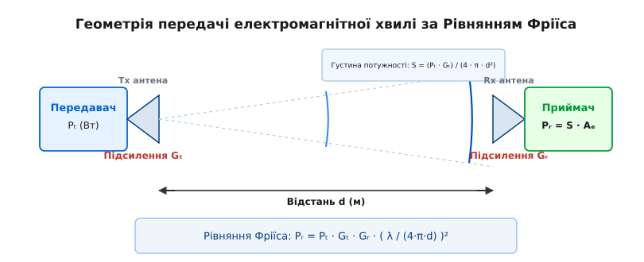
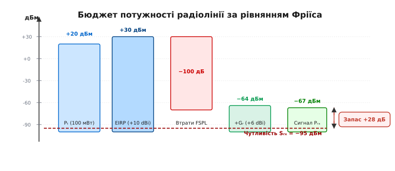
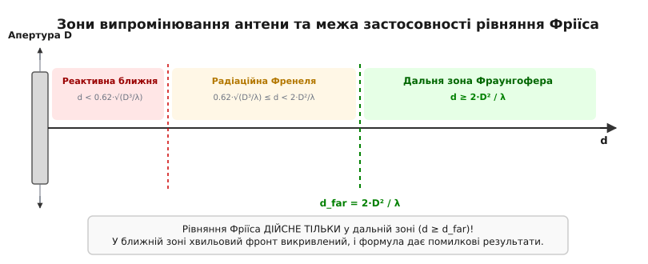

# Рівняння Фріїса

<preknowlist>
- [Згасання у просторі](root:com-medium/free-space-loss) — сферичне розходження електромагнітної хвилі та закон оберненого квадрата відстані.
- [Потужність і децибели](root:com-medium/power-decibels) — логарифмічна шкала дБ, дБм (dBm), дБІ (dBi) та підсумовування рівнів.
- [Поляризація електромагнітних хвиль](root:com-medium/propagation-polarization) — просторова орієнтація вектора електричного поля та втрати неузгодженості.
</preknowlist>

Коли бездротовий передавач потужністю 1 Вт (30 dBm) випромінює радіосигнал, приймач на відстані кількох кілометрів вловлює лише крихітну частку піковата (10⁻¹² Вт або -90 dBm). Майже 99.999999999% випроміненої енергії втрачається по дорозі, не торкнувшись приймальної антени. Щоб спроектувати стабільну радіолінію — супутниковий канал, Wi-Fi міст між будівлями чи мережу LoRa для датчиків — інженер мусить чітко знати: скільки саме потужності досягне цілі за ідеальних умов вільного простору. Фундаментальним інструментом для цього розрахунку є **рівняння передачі Фріїса** (*Friis transmission equation*). Воно пов'язує потужності передавача та приймача, підсилення двох антен, довжину хвилі та відстань між ними в єдине балансове співвідношення.

### Енергетична прірва між передавачем та приймачем

Причина катастрофічного ослаблення радіосигналу у порожньому просторі — не поглинання матерією, а геометричне розходження хвильового фронту. Сигнал від точкового випромінювача поширюється у вигляді сфери, площа якої росте як квадрат відстані `4·π·d²`. Та сама випромінена потужність розтікається по дедалі ширшій поверхні, тож густина потужності спадає за законом оберненого квадрата.

Проте ізотропних антен, що випромінюють однаково в усі боки, у реальності не існує — це лише теоретична абстракція. Справжні антени фокусують енергію у певному напрямку, подібно до ліхтарика або прожектора. Крім того, приймальна антена має власну здатність «уловлювати» хвилю з простору, яка залежить від її геометричної та електромагнітної форми.

До середини 1940-х років обчислення радіоліній вимагало складної комбінації розрахунків напруженості електричного поля `E` (у вольтах на метр) та ефективної висоти антен `h_eff`. Це було зручно на довгих хвилях, але абсолютно непридатно для сантиметрових та мікрохвильових діапазонів із параболічними дзеркалами та рупорами. У 1945 році дансько-американський радіоінженер Гаральд Фріїс із Bell Labs запропонував кардинально новий підхід: об'єднати джерело, простір та приймач через концепцію енергетичного потоку. Детальніше про контекст створення та історичну революцію цього методу висвітлено у вставці [Походження рівняння Фріїса](root:com-medium/friis-transmission/hist-friis-origin.md).

### Направленість антени: перерозподіл потужності у просторі

Щоб зрозуміти будову рівняння Фріїса, простежимо шлях енергії від передавача до приймача крок за кроком.

Нехай передавач подає на вхід антени потужність `P_t` (Вт). Якби антена була ізотропною, густина потужності `S_0` на відстані `d` дорівнювала б загальній потужності, поділеній на площу сфери:

```
S_0 = P_t / (4 · π · d²)      [Вт/м²]
```

Реальна передавальна антена стискає випромінювання у вузький промінь. Просторовий перерозподіл енергії кількісно описується **коефіцієнтом спрямованості** (*directivity*) `D_a(θ, φ)` та **коефіцієнтом підсилення антени** `G_t` (*antenna gain*).

Слід чітко розрізняти ці два поняття:
- **Спрямованість `D_a`** — це чисто геометрична характеристика діаграми спрямованості. Вона показує, у скільки разів густина потужності в напрямку головного променя більша порівняно з ізотропним випромінювачем за умови одинакової випроміненої електромагнітної потужності.
- **Підсилення `G`** враховує омічні втрати в металі та діелектриках антени через її коефіцієнт корисної дії `η_антени` (значення від 0 до 1): `G = η_антени · D_a`.

Важливо пам'ятати: антена є пасивним пристроєм і не додає у сигнал жодного мілівата енергії. Підсилення `G_t` — це відносний коефіцієнт перерозподілу: він показує, у скільки разів густина потужності в напрямку головного променя більша порівняно з ідеальним ізотропним випромінювачем при тій самій підведеній від передавача потужності.

Форма променя описується діаграмою спрямованості (*radiation pattern*), основними параметрами якої є:
- **Ширина головного пелюстка за рівнем половинної потужності (`HPBW` — *Half-Power Beamwidth*):** Кут у градусах (зазвичай від 3° для супутникових тарілок до 65° для секторних антен базових станцій), у межах якого потужність випромінювання зменшується не більше ніж удвічі (-3 дБ).
- **Рівень бічних пелюстків (`SLL` — *Side-Lobe Level*):** Відношення потужності побічних паразитичних променів до головного максимуму.
- **Коефіцієнт захисної дії (`F/B` — *Front-to-Back Ratio*):** Відношення випромінювання «вперед» до випромінювання «назад» (у протилежному напрямку).

З урахуванням підсилення передавальної антени `G_t`, точна густина потужності `S` на відстані `d` вздовж осі максимального випромінювання становить:

```
S = (P_t · G_t) / (4 · π · d²)      [Вт/м²]
```

Добуток `P_t · G_t` радіоінженери називають **ефективною ізотропно випромінюваною потужністю** (*Equivalent Isotropically Radiated Power*, EIRP). Це еквівалентна потужність у Вт або дБм, яку довелося б підвести до ідеального ізотропного випромінювача, щоб отримати таку саму напрямлену густину поля на відстані `d`.


*Енергія від передавача Pₜ спрямовується антеною з підсиленням Gₜ. Густина потужності S спадає пропорційно 1/d². Приймальна антена з підсиленням Gᵣ та апертурою Aₑ збирає частку хвильового фронту й передає потужність Pᵣ у приймач.*

### Збір хвилі: ефективна апертура та підсилення приймача

На іншій стороні радіолінії розташована приймальна антена. Вона вилучає енергію з падаючого плоского хвильового фронту. Скільки саме потужності `P_r` захопить антена з падаючого потоку густиною `S`?

Відповідь дає концепція **ефективної апертури** `A_e` (*effective aperture* або ефективної площі антени). Це уявна площа у квадратних метрах, з якої антена збирає 100% електромагнітної енергії:

```
P_r = S · A_e      [Вт]
```

Ефективна апертура — це не просто фізичний розмір металевого розтруба чи рефлектора. Навіть тонка дротяна антена (наприклад, півхвильовий диполь), яка практично не має фізичної площі поперечного перерізу, завдяки резонансній взаємодії з електромагнітним полем створює навколо себе ефективну зону збору енергії площею `A_e = 0.13 · λ²`.

Фундаментальна теорема електродинаміки антен стверджує, що для будь-якої антени існує строгий зв'язок між її коефіцієнтом підсилення `G` та ефективною апертурою `A_e` через довжину хвилі `λ`:

```
A_e = G · λ² / (4 · π)      [м²]
```

Ця формула універсальна: вона однаково дійсна для елементарного диполя, мікросмужкової патч-антени, хвильового каналу Яґі-Уда, рупора або великого параболоїда.

Для апертурних антен (параболічні тарілки, рупори, лінзи) ефективна апертура пов'язана з фізичною площею апертури `A_фіз` через **коефіцієнт використання апертури** `η_ап` (*aperture efficiency*):

```
A_e = η_ап · A_фіз      [м²]
```

Для типових параболічних антен `η_ап` становить від 0.55 до 0.70 (55–70%). Втрати 30–45% виникають через нерівномірність опромінення рефлектора та затінення дзеркала облучателем і розтяжками.

Зверніть увагу на квадрат довжини хвилі `λ²` у чисельнику виразу `A_e = G · λ² / (4·π)`. Це фундаментальна властивість простору: що вища частота `f` (і, відповідно, коротша довжина хвилі `λ = c / f`), то меншу ефективну площу має антена із зафіксованим коефіцієнтом підсилення `G`. Приймач на частоті 5 ГГц із тією самою спрямованістю, що й на частоті 2.4 ГГц, має вчетверо меншу апертуру й захоплює вчетверо менше енергії.

Для приймальної антени з підсиленням `G_r` її ефективна апертура дорівнює:

```
A_e = G_r · λ² / (4 · π)      [м²]
```

### Лінійна та логарифмічна форма рівняння Фріїса

Тепер підставимо вираз для густини потужності `S` та вираз для апертури `A_e` у формулу прийнятої потужності `P_r`:

```
P_r = S · A_e
    = ( (P_t · G_t) / (4 · π · d²) ) · ( (G_r · λ²) / (4 · π) )
```

Згрупувавши квадратні члени, отримуємо класичне **рівняння передачі Фріїса у лінійній формі**:

```
P_r = P_t · G_t · G_r · ( λ / (4 · π · d) )²
```

Повне математичне виведення кожного перетворення, розклад у компоненти та зв'язок із характеристиками антен наведено у вставці [Виведення рівняння Фріїса та ефективна апертура](root:com-medium/friis-transmission/math-friis-derivation.md).

У лінійній формі співвідношення містить множення та піднесення до квадрата, що незручно для оперативних інженерних обчислень. Перейдімо до логарифмічної шкали. Продегарифмувавши обидві частини рівняння та перевівши потужності у [децибели](root:com-medium/power-decibels) відносно 1 мілівата (дБм), отримуємо **логарифмічну форму рівняння Фріїса**:

```
P_r(дБм) = P_t(дБм) + G_t(dBi) + G_r(dBi) + 20·log₁₀( λ / (4·π·d) )
```

Член `20·log₁₀( 4·π·d / λ )` являє собою [згасання у просторі](root:com-medium/free-space-loss) (FSPL). Тому рівняння перетворюється на елементарну арифметичну суму та різницю:

```
P_r(дБм) = P_t(дБм) + G_t(dBi) + G_r(dBi) − FSPL(дБ)
```

де `FSPL(дБ)` обчислюється через практичні інженерні одиниці — відстань `d` у кілометрах та частоту `f` у гігагерцах:

```
FSPL(дБ) = 20·log₁₀(d_км) + 20·log₁₀(f_ГГц) + 92.45
```

Такий логарифмічний запис робить розрахунок прозорим: підсилення антен `G_t` та `G_r` додають дБм до сигналу, а геометрія розходження простору `FSPL` віднімає їх.

### Бюджет радіолінії: від дБм передавача до чутливості приймача

На практиці рівняння Фріїса є основою для складання **бюджету потужності радіолінії** (*link budget*). Розрахунок дозволяє з'ясувати, чи буде зв'язок надійним, і скільки децибел залишається на випадок завмирань чи негоди.


*Каскадний графік бюджету потужності: передавач +20 дБм та антена +10 dBi створюють EIRP = +30 дБм. Втрати у просторі (-100 дБ) та кабелях (-3 дБ) при додаванні підсилення приймача (+6 dBi) дають підсумковий сигнал -67 дБм, що на 28 дБ вище за поріг чутливості.*

Прийнята потужність `P_r` порівнюється з **порогом чутливості приймача** `S_rx`. Поріг чутливості обчислюється на основі теплового шуму Найквіста:

```
N_0 = k_B · T · B      [Вт]
```

де `k_B = 1.38 × 10⁻²³ Дж/К` — стала Больцмана, `T = 290 К` — стандартна абсолютна температура, а `B` — смуга пропускання приймача в Герцах. У децибелах при смузі 1 Гц теплова підлога шуму становить `-174 дБм/Гц`.

Чутливість приймача залежить від коефіцієнта шуму підсилювача `NF` (*Noise Figure*) та мінімально необхідного співвідношення сигнал/шум (`SNR_мін`) для даної модуляції:

```
S_rx(дБм) = −174 + 10·log₁₀(B_Гц) + NF(дБ) + SNR_мін(дБ)
```

Наприклад, для двійкової фазової модуляції BPSK достатньо `SNR = +10 дБ`, а для високошвидкісної модуляції 64-QAM вимагається `SNR = +22 дБ`.

Розглянемо практичний обчислювальний приклад розрахунку бездротового мосту на частоті 2.4 ГГц на відстані 1 кілометр.

**Вхідні дані:**
- Потужність передавача `P_t = +20 дБм` (100 мВт).
- Підсилення передавальної антени `G_t = +10 dBi` (спрямована секторна антена).
- Підсилення приймальної антени `G_r = +6 dBi`.
- Робоча частота `f = 2.4 ГГц`.
- Відстань `d = 1 км`.
- Чутливість приймача `S_rx = −95 дБм`.

**Покроковий розрахунок:**

1. Обчислюємо випромінювану потужність EIRP:
```
EIRP = P_t + G_t = 20 + 10 = +30 дБм (1 Вт)
```

2. Обчислюємо втрати у вільному просторі FSPL для 1 км на 2.4 ГГц:
```
FSPL = 20·log₁₀(1) + 20·log₁₀(2.4) + 92.45
     = 0 + 7.60 + 92.45 = 100.05 дБ
```

3. Обчислюємо прийняту потужність `P_r` за рівнянням Фріїса:
```
P_r = EIRP + G_r − FSPL
    = 30 + 6 − 100.05 = −64.05 дБм
```

4. Обчислюємо запас лінка (*Link Margin*):
```
Запас = P_r − S_rx = −64.05 − (−95) = +30.95 дБ
```

Запас у 31 дБ означає, що приймач отримає сигнал, який майже в 1200 разів перевищує мінімальний поріг чутливості. Цього запасу цілком достатньо для компенсації атмосферних втрат, шумів та невеликих відхилень у юстуванні антен.

### Зона Фраунгофера: де рівняння Фріїса втрачає силу

Незважаючи на високу точність, рівняння Фріїса не є всемогутнім. Воно має чітко окреслену межу застосовності, вихід за яку призводить до абсурдних результатів.

Якщо у рівняння Фріїса підставити відстань `d → 0`, прийнята потужність `P_r` спрямується до нескінченності. Більше того, при наближенні антен на відстань меншу за `d < λ / (4·π)` формула покаже `P_r > P_t` — тобто приймач нібито отримує більше енергії, ніж видав передавач, що прямо порушує закон збереження енергії!

Це відбувається тому, що рівняння Фріїса виведено в припущенні, що **хвильовий фронт на приймальній антені є строго плоским**, а самі антени знаходяться у **дальній зоні** одна від одної.

Навколо будь-якої випромінювальної антени простір поділяється на три чіткі зони:


*Навколо антени виділяють три зони: реактивну ближню, радіаційну ближню (Френеля) та дальню зону Фраунгофера. Рівняння Фріїса дає точні результати ТІЛЬКИ у дальній зоні при d ≥ 2D²/λ.*

1. **Реактивна ближня зона** (`d < 0.62·√(D³ / λ)`): На цій відстані переважають реактивні індуктивні та ємнісні поля. Енергія циркулює туди-сюди між антеною та простором, не відриваючись у вигляді вільної хвилі. Антени взаємодіють як первинна й вторинна обмотки трансформатора (механізм NFC та бездротової зарядки Qi). Рівняння Фріїса тут повністю недійсне.
2. **Радіаційна ближня зона (зона Френеля)** (`0.62·√(D³ / λ) ≤ d < 2·D² / λ`): Хвиля вже відірвалася від антени, але її фронт є викривленим (сферичним). Фази сигналів від різних ділянок апертури антени додаються несинхронно, викликаючи інтерференційні коливання амплітуди.
3. **Дальня зона Фраунгофера** (`d ≥ 2·D² / λ`): Хвильовий фронт стає практично плоским (фазова помилка по краях апертури не перевищує `π / 8` або 22.5°). Поля `E` та `H` перпендикулярні одне до одного й до напрямку поширення. **Тільки у цій зоні рівняння Фріїса є точним.**

Межа дальньої зони визначається **критерієм Фраунгофера**:

```
d_far = (2 · D²) / λ
```

де `D` — максимальний лінійний розмір апертури антени (наприклад, діаметр параболічного дзеркала або довжина рупора), а `λ` — довжина хвилі. Крім того, обов'язково мають виконуватися умови `d ≫ D` та `d ≫ λ`.

Для дрібних антен (наприклад, штирьової антени Wi-Fi роутера розміром 6 см) межа дальньої зони на 2.4 ГГц становить усього `2 · 0.06² / 0.125 = 0.057 м` (5.7 см). Але для параболічної супутникової тарілки діаметром 2 метри на частоті 10 ГГц (`λ = 0.03 м`) дальня зона починається лише з відстані:

```
d_far = (2 · 2²) / 0.03 = 266.7 метрів
```

Спроба виміряти підсилення такої параболічної антени у лабораторії на відстані 5 метрів за формулою Фріїса дасть грубу помилку, оскільки вимірювання відбуватимуться у зоні Френеля.

### Залежність від частоти та мікрохвильовий парадокс

Розглядаючи формулу Фріїса, можна помітити так званий «мікрохвильовий парадокс». З одного боку, втрати у просторі `FSPL = (4·π·d·f / c)²` зростають як квадрат частоти `f²`. З іншого боку, якщо виразити коефіцієнт підсилення антен через їхню фізичну площу `A_фіз`:

```
G = (4 · π · A_e) / λ² = (4 · π · η_ап · A_фіз · f²) / c²
```

то підставивши ці вирази у рівняння Фріїса, отримуємо:

```
P_r = P_t · ( (4·π·η_t·A_t·f²) / c² ) · ( (4·π·η_r·A_r·f²) / c² ) · ( c / (4·π·d·f) )²
    = ( P_t · η_t · A_t · η_r · A_r · f² ) / ( c² · d² )
```

Зверніть увагу: якщо **фізичні розміри двох апертурних антен (наприклад, двох параболічних тарілок зафіксованого діаметра) залишаються незмінними**, то прийнята потужність `P_r` росте як **квадрат частоти `f²`**!

Це здається протиріччям, але має просте пояснення: при підвищенні частоти параболічне дзеркало того самого діаметра стискає випромінювання у набагато вужчий промінь (підсилення `G` росте як `f²`). Це зростання фокусування з лишком компенсує зменшення ефективної апертури приймача.

Порівняймо поведінку рівняння Фріїса у різних частотних діапазонах при стаціонарній відстані `d = 1 км`:

| Частотний діапазон | Довжина хвилі λ | FSPL (на 1 км) | Тип антен | Типове застосування |
| :--- | :--- | :--- | :--- | :--- |
| **Sub-1 GHz (868 МГц)** | 34.5 см | 91.2 дБ | Диполі, штирі (0 dBi) | LoRaWAN, Smart Grid, IoT |
| **2.4 GHz ISM** | 12.5 см | 100.0 дБ | Патчі, сектори (+6...15 dBi) | Wi-Fi 4/6, Bluetooth, Zigbee |
| **5.8 GHz ISM** | 5.17 см | 107.7 дБ | Параболи, панелі (+20...27 dBi) | Wi-Fi мости, FPV відео |
| **24 GHz K-band** | 1.25 см | 120.0 дБ | Рупори, решітки (+30 dBi) | Автомобільні радари, РРЛ |
| **60 GHz mmWave** | 5.00 мм | 128.0 дБ | Фазовані решітки (+35 dBi) | WiGig, 5G NR mmWave |

На надвисоких частотах (мікрохвилі 10–80 ГГц та міліметрові хвилі mmWave 60 ГГц) вдається створювати надзвичайно компактні фазовані антенні решітки. На частоті 60 ГГц довжина хвилі становить усього `λ = 5 мм`. Антенна решітка з 64 мікросмужкових елементів розміром 2×2 см має підсилення понад +20 dBi та дозволяє формувати динамічний промінь (beamforming) для компенсації втрат у просторі.

### Двопроменева модель відбиття від землі та межі ідеальної моделі

Рівняння Фріїса отримано для ідеального вільного простору без жодних перешкод. Проте при розташуванні антен поблизу поверхні Землі (наприклад, зв'язок між двома автомобільними радіостанціями або смартфонами) сигнал досягає приймача двома шляхами: прямим променем та променем, відбитим від ґрунту.

Ця ситуація описується **двопроменевою моделлю відбиття від землі** (*Two-Ray Ground Reflection Model*). Якщо відстань між антенами `d` набагато більша за їхні висоти підвісу `h_t` та `h_r` (`d ≫ h_t + h_r`), то через інтерференцію прямої та відбитої хвиль прийнята потужність описується формулою:

```
P_r = P_t · G_t · G_r · ( (h_t · h_r) / d² )²
```

У цій моделі прийнята потужність згасає пропорційно **четвертому ступеню відстані `1/d⁴`** (втрати 40 дБ на десятикратне віддалення замість 20 дБ у моделі Фріїса)!

Критична відстань переходу (*crossover distance*) від прямолінійного згасання Фріїса (`1/d²`) до двопроменевого згасання (`1/d⁴`) становить:

```
d_cross = (4 · π · h_t · h_r) / λ
```

До відстані `d < d_cross` сигнал згасає за рівнянням Фріїса. Поза цією межею відбитий від землі промінь перебуває майже у протифазі з прямим променем, і згасання стрімко прискорюється. Це пояснює, чому наземний радіозв'язок на рівні землі втрачає силу набагато швидше, ніж зв'язок із літаком або супутником.

### Особливості супутникових та космічних радіоліній

У космічному просторі середовище є практично ідеальним вакуумом, тому рівняння Фріїса працює з найвищою точністю. Для супутникових ліній розраховують параметр якості прийому `G/T` (*Figure of Merit*) — відношення підсилення антени до еквівалентної шумної температури системи (у дБ/К).

Для зв'язку з міжпланетними станціями (наприклад, апаратами «Вояджер-1» та «Вояджер-2» на межах Сонячної системи на відстані понад 24 мільярди кілометрів) рівняння Фріїса визначає межу передачі даних:

- Відстань `d ≈ 2.4 × 10¹³ м`.
- Частота X-діапазону `f = 8.4 ГГц` (`λ = 0.0357 м`).
- Потужність бортового передавача `P_t = 20 Вт` (+43 дБм).
- Діаметр бортової параболічної антени `D_борту = 3.7 м` (`G_t ≈ +48 dBi`).
- Наземна антена мережі Deep Space Network (DSN) має діаметр `D_землі = 70 м` (`G_r ≈ +73 dBi`).

Втрати у вільному просторі становлять астрономічну величину `FSPL ≈ 308 дБ`. Завдяки гігантському підсиленню 70-метрової тарілки DSN (+73 dBi) та надзвичайно вузькій смузі пропускання, підсумкова прийнята потужність становить близько `-160 дБм` (10⁻¹⁹ Вт). Цього вистачає для передачі даних зі швидкістю 160 біт/с.

### Реальне середовище: втрати неузгодженості, поляризації та атмосфери

У реальних земних умовах на прийняту потужність впливає низка додаткових факторів, які послаблюють сигнал порівняно з ідеальною формулою Фріїса. Узагальнене рівняння передачі враховує ці коефіцієнти:

```
P_r = P_t · G_t · G_r · ( λ / (4·π·d) )² · (1 − |Γ_t|²) · (1 − |Γ_r|²) · PLF / L_sys
```

Розглянемо кожен із додаткових членів:

1. **Неузгодженість імпедансу антен `(1 − |Γ|²)`:** Якщо імпеданс антени не дорівнює хвильовому опору кабелю (зазвичай 50 Ом), частина потужності відбивається назад. Коефіцієнт відбиття `Γ` за напругою визначає втрати на неузгодженість.
2. **Фактор втрат поляризації `PLF` (*Polarization Loss Factor*):** Визначає неузгодженість між вектором електричного поля падаючої хвилі та орієнтацією приймальної антени. Для лінійно поляризованих антен під кутом `ψ` один до одного `PLF = cos²(ψ)`. Якщо передавальна антена вертикальна, а приймальна горизонтальна (`ψ = 90°`), `PLF = 0`, і прийнята потужність теоретично дорівнює нулю! При переході від кругової поляризації до лінійної втрачається рівно 3 дБ (половина потужності). Докладний аналіз просторової орієнтації векторів викладено у статті [Поляризація електромагнітного випромінювання](root:com-medium/propagation-polarization).
3. **Омічні втрати в антенах (КПД антени `η`):** Підсилення антени `G` пов'язане з її чисто геометричною спрямованістю `D_a` через коефіцієнт корисного дії: `G = η · D_a`. Частина потужності втрачається у вигляді тепла в металі випромінювача та діелектриках.
4. **Системні втрати `L_sys`:** Включають загасання у фідерних кабелях, роз'ємах, дуплексерах, а також додаткове загасання хвилі в атмосферних газах, дощі та тумані.

У децибельному виразі розширене рівняння Фріїса набуває остаточного інженерного вигляду:

```
P_r = P_t + G_t + G_r − FSPL − L_pol − L_match − L_cable − L_atm      [дБм]
```

### Інженерна практика та розрахунок дальності

Рівняння Фріїса можна розвернути відносно відстані `d`, щоб визначити **максимально можливу дальність зв'язку** `d_max` для заданої чутливості приймача `S_rx`:

```
d_max = ( λ / (4 · π) ) · √( (P_t · G_t · G_r) / S_rx )
```

У логарифмічній формі це обчислення зводиться до визначення максимально припустимих втрат шляху `FSPL_max`:

```
FSPL_max = P_t(дБм) + G_t(dBi) + G_r(dBi) − S_rx(дБм) − L_sys(дБ)
```

Знаючи `FSPL_max`, дальність обчислюється зворотним логарифмуванням:

```
d_max(км) = 10^( (FSPL_max − 20·log₁₀(f_ГГц) − 92.45) / 20 )
```

Для автоматизації цих розрахунків, аналізу чутливості та програмної перевірки умов дальньої зони розроблено модуль розрахунку, поданий у вставці [Розрахунок бюджету радіолінії за рівнянням Фріїса](root:com-medium/friis-transmission/proj-friis-calculator.md).

> 🔧 **Навіщо це.** Рівняння Фріїса — це «верхня ідеальна межа» для будь-якої бездротової системи. Якщо розрахунок за Фріїсом показує, що сигнал на приймачі нижчий за поріг чутливості, то лінія **не запрацює за жодних умов**, навіть якщо прибрати всі перешкоди й стіни. Воно задає абсолютну фізичну стелю дальності, від якої відраховують усі реальні втрати на відбиття, мультипроменевість та поглинання.

Підсумовуючи: рівняння Фріїса пов'язує випромінену енергію з прийнятою через геометричний фактор сферичного розходження `1/d²` та квант ефективної апертури `λ²/(4π)`. Воно є першим і найважливішим кроком при проектуванні супутникових каналів, радіорелейних ліній, радіолокаторів та будь-яких пристроїв бездротового зв'язку.
