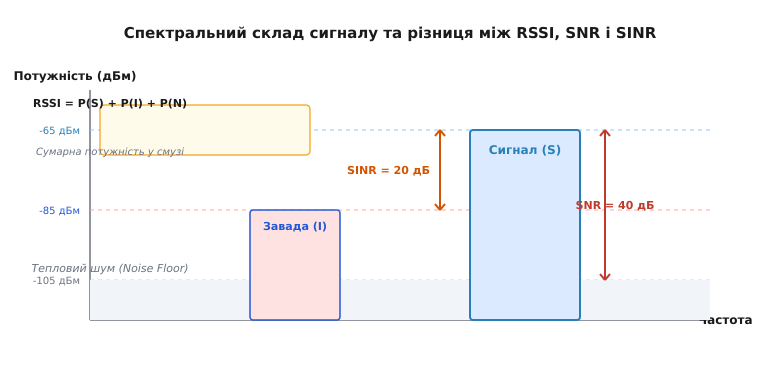
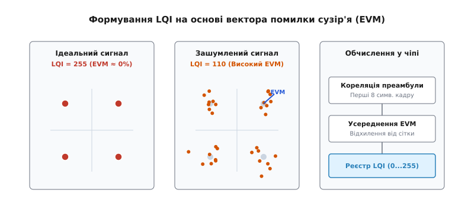
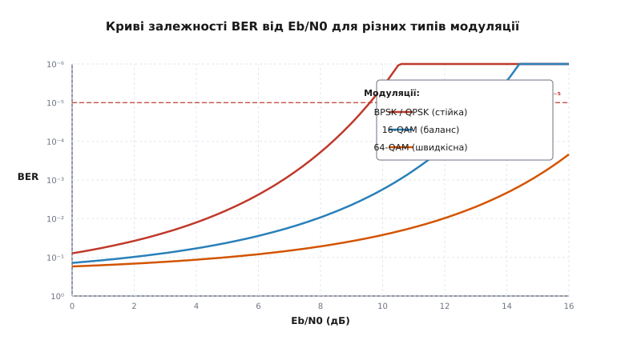
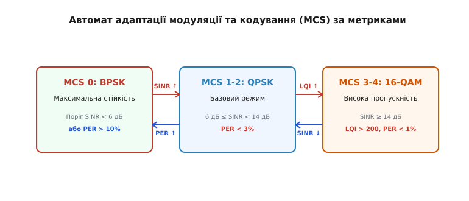

# Метрики якості каналу: SNR, SINR, LQI та BER

<preknowlist>
- [Потужність і децибели](topic:com-medium/power-decibels) — логарифмічна шкала дБ та відносні одиниці дБм.
- [Загасання у просторі](topic:com-medium/free-space-loss) — модель зменшення потужності сигналу з відстанню.
- [RSSI і вимірювання рівня сигналу](topic:com-medium/rssi-signal-strength) — вимірювання загальної сили прийнятого радіочастотного сигналу.
- [Багатопроменевість](topic:com-medium/multipath-fading) — виникнення завад через інтерференцію відбитих променів.
</preknowlist>

Радіотрансивер бездротового датчика у промисловому цеху реєструє високий рівень прийнятого сигналу `-62 дБм`. Індикатор потужності свідчить про ідеальні умови поширення хвиль, проте більше ніж 80% переданих пакетів втрачаються через помилки контрольної суми (CRC). Проблема полягає в тому, що поруч працює потужний бездротовий модуль зварювального робота, який заповнює ефір високорівневою інтерференційною завадою. Оцінювати якість бездротового каналу лише за силою прийнятого сигналу — це все одно що намагатися вести бесіду на галасливому концерті: навіть якщо співрозмовник кричить прямо у вухо, слова залишаються нерозбірливими через високий рівень навколишнього акустичного шуму.

Для об'єктивної оцінки придатності радіоефіру до передачі даних цифровий зв'язок використовує комплексну систему метрик. Співвідношення сигнал/шум (SNR) та відношення сигналу до завад і шуму (SINR) вимірюють енергетичну чистоту ефіру. Індикатор якості лінку (LQI) аналізує спотворення фазового сузір'я на рівні апаратного оброблення приймача. Коефіцієнт бітових помилок (BER) та коефіцієнт втрати пакетів (PER) дають підсумкову статистику надійності доставлення інформації. У сукупності ці метрики дозволяють адаптивним мережевим протоколам динамічно обирати швидкісні режими модуляції, регулювати випромінювану потужність та будувати надійні маршрути у нестабільному середовищі.

## Обмеження RSSI та необхідність розділення складових сигналу

Показник сили прийнятого сигналу (Received Signal Strength Indicator, RSSI) вимірює загальну високочастотну енергію, присутню у смузі пропускання приймального тракту під час налаштування аналогового підсилювача (AGC). Проте аналоговий детектор потужності приймача не в змозі відрізнити корисну енергію передавача від фонового теплового шуму, завад від сусідніх радіомереж чи нелінійних випромінювань промислового обладнання.

Математично виміряне значення потужності на вхідному роз'ємі приймача `P_total` є сумою трьох незалежних фізичних складових:

```
P_total = P_s + P_n + ∑ P_i
```

де `P_s` — потужність корисного сигналу (*Signal*), `P_n` — потужність внутрішнього та екзогенного теплового шуму (*Noise*), а `∑ P_i` — сумарна потужність усіх сторонніх інтерференційних завад (*Interference*).

Якщо у приймальний тракт надходить слабкий корисний сигнал `P_s = -95 дБм` на тлі відсутності завад `P_n = -110 дБм`, підсумковий RSSI дорівнюватиме `-94.8 дБм`. Приймач із високою чутливістю легко демодулює такий кадр з нульовою кількістю помилок. Якщо ж у іншому випадку завада створює рівень `P_i = -65 дБм`, RSSI становитиме `-64.9 дБм`. Попри високе значення RSSI, декодування кадру виявиться неможливим, оскільки завада перекриває корисний сигнал на 30 дБ.

### Апаратні механізми вимірювання RSSI у приймачах

У сучасних трансиверах вимірювання RSSI відбувається на етапі аналогово-цифрового перетворення у тракті проміжної частоти (IF) або базових смуг I/Q. Вхідний радіочастотний сигнал проходить крізь малошумний підсилювач (LNA) та підсилювач із регульованим коефіцієнтом підсилення (PGA). Петля автоматичного регулювання підсилення (AGC) прагне утримувати амплітуду сигналу на вході АЦП у оптимальному динамічному діапазоні.

Значення RSSI обчислюється як зворотна функція від поточного коефіцієнта підсилення AGC плюс значення логарифмічного детектора амплітуди:

```
RSSI_dBm = G_LNA_dB + G_PGA_dB + 10 · log10(ADC_power) - Calibration_Offset
```

Час встановлення AGC становить від кількох мікросекунд до десятків мікросекунд. Це означає, що значення RSSI замилюється і відображає інтегральну енергію лише на початку кадру. Саме тому для оцінки придатності каналу зв'язку інженери спираються не на абсолютну потужність, а на відносні енергетичні співвідношення та статистичні показники помилок.


*_Спектральне розділення потужності корисного сигналу, інтерференційної завади та теплового шуму. Рівень RSSI показує сумарну енергію, тоді як SNR та SINR ізолюють чистий сигнал від завад._*

## SNR (Signal-to-Noise Ratio) — Співвідношення сигнал/шум

Співвідношення сигнал/шум (Signal-to-Noise Ratio, SNR) визначає, наскільки потужність корисного випромінювання перевищує поріг природного теплового шуму приймального тракту та навколишнього середовища. 

У лінійному масштабі SNR обчислюється як просте відношення потужностей:

```
SNR_linear = P_s / P_n
```

Оскільки потужність радіосигналів варіюється на багато порядків, у радіотехніці SNR завжди виражають у децибелах (dB). Віднімання логарифмічних величин замінює ділення лінійних:

```
SNR_dB = 10 · log10(P_s / P_n) = P_s_dBm - P_n_dBm
```

де `P_s_dBm` — потужність корисного сигналу в децибел-міліватах, а `P_n_dBm` — потужність шумової підлоги (*Noise Floor*).

### Формування шумової підлоги та межа чутливості

Шумова підлога `P_n` не є довільним параметром; вона визначається фундаментальними законами термодинаміки. Мінімальний рівень теплового шуму у провіднику з температурою `T` у смузі частот `B` виражається формулою Джонсона-Найквіста:

```
P_n_ideal = k · T · B
```

де `k = 1.38 · 10⁻²³ Дж/К` — стала Больцмана, а `T` — абсолютна температура в кельвінах (стандартне значення `T = 290 К` відповідає +17 °C).

У логарифмічній формі для смуги `B = 1 Гц` при кімнатній температурі спектральна щільність шуму становить `-174 дБм/Гц`. Для реального приймача з шириною смуги `B` та власним коефіцієнтом шуму `F` (*Noise Figure*, дБ) підсумкова шумова підлога дорівнює:

```
P_n_dBm = -174 + 10 · log10(B) + F
```

Наприклад, для бездротового модуля LoRa зі смугою `B = 125 кГц` (`10 · log10(125000) ≈ 51 дБ`) та коефіцієнтом шуму підсилювача `F = 5 дБ` шумова підлога становить `P_n = -174 + 51 + 5 = -118 дБм`. Якщо приймач реєструє сигнал з рівнем `-100 дБм`, значення `SNR = -100 - (-118) = 18 дБ`.

У мережах Wi-Fi (802.11ax) при ширині смуги `B = 80 МГц` (`10 · log10(80000000) ≈ 79 дБ`) шумова підлога зростає до `-174 + 79 + 6 = -89 дБм`. Це пояснює, чому ширші канали вимагають значно більшої потужності передавача для збереження того самого значення SNR.

> 🔧 **Навіщо це.** Знання шумової підлоги дозволяє розрахувати граничну чутливість приймача (*Receiver Sensitivity*). Для успішної роботи модуляції BPSK необхідно мати `SNR ≥ 6 дБ`. Це означає, що при шумовому порозі `-118 дБм` мінімальний розпізнаваний сигнал становить `-112 дБм`. Будь-яка спроба прийняти сигнал нижче цього рівня призведе до втрати синхронізації.

### Енергетичне співвідношення Eb/N0 та розширення спектра

У цифрових системах передачі даних параметром для порівняння різних методів модуляції є знормована метрика `E_b / N_0` — відношення енергії, припадаючої на один біт інформації (`E_b`), до спектральної щільності потужності шуму (`N_0`). Зв'язок між `SNR` та `E_b / N_0` визначається через бітову швидкість `R_b` та смугу частот `B`:

```
E_b / N_0 = SNR · (B / R_b)
```

У логарифмічній формі:

```
(E_b / N_0)_dB = SNR_dB + 10 · log10(B / R_b)
```

Завдяки розширенню спектра (наприклад, у LoRa з фактором розширення SF12 або у DSSS) бітова швидкість стає значно меншою за ширину смуги (`R_b << B`). Базове відношення `B / R_b` досягає 4096 (36 дБ). Це дозволяє цифровим приймачам впевнено демодулювати кадри при **від'ємних значеннях SNR** (до `SNR = -20 дБ`), коли корисний сигнал повністю занурений нижче рівня теплового шуму.

Крім теплового шуму, на реальне значення SNR впливають внутрішні спотворення приймального тракту: фазове тремтіння гетеродина (Phase Noise), дисбаланс квадратурних каналів (IQ Imbalance) та нелінійні спотворення підсилювача (IP3).

Детальний математичний аналіз залежності бітових помилок винесено в окремий матеріал [Математичний вивід BER та PER](topic:com-medium/link-quality-metrics/math-ber-snr-derivation.md).

## SINR (Signal-to-Interference-plus-Noise Ratio) — Вплив завад

У сучасних бездротових мережах із високою щільністю пристроїв (Wi-Fi, 4G/5G, Bluetooth, Zigbee) головним ворогом якості зв'язку є не внутрішній тепловий шум, а взаємна інтерференція від інших передавачів, які працюють у тому самому або суміжному частотному діапазоні.

Співвідношення сигнал/(шум + завада) (Signal-to-Interference-plus-Noise Ratio, SINR) описує реальні умови демодуляції сигналу у зашумленому та завадовому середовищі:

```
SINR_linear = P_s / (P_n + ∑ P_i)
```

У логарифмічній формі SINR обчислюється через переведення потужностей у лінійні величини з подальшим логарифмуванням суми:

```
SINR_dB = P_s_dBm - 10 · log10(10^(P_n_dBm / 10) + ∑ 10^(P_i_dBm / 10))
```

### Фізична відмінність між шумом та інтерференцією

Хоча у формулі SINR шум `P_n` та завада `P_i` знаходяться у знаменнику, їхній фізичний вплив на приймальний тракт різний:

1. **Гаусів шум (`P_n`):** Має рівномірну спектральну щільність і неструктурований характер. Його джерелом є теплові коливання носіїв заряду. Вплив шуму компенсується збільшенням потужності передавача або розширенням спектра.
2. **Інтерференція (`P_i`):** Являє собою когерентне або деструктивне випромінювання сторонніх цифрових передавачів (Co-Channel Interference, CCI). Інтерференція часто має детерміновану структуру, викликає симетричний зсув точок сигнального сузір'я та руйнує роботу алгоритмів фазового автопідлаштування частоти (ФАПЧ/PLL).

Розрізняють два основні типи інтерференції у бездротових мережах:

* **Внутрішньоканальна інтерференція (Co-Channel Interference, CCI):** Завади від передавачів, що працюють на тій самій частоті (наприклад, сусідні точки доступу Wi-Fi на 6-му каналі).
* **Суміжноканальна інтерференція (Adjacent Channel Interference, ACI):** Просочування потужності з сусідніх смуг частот через неідеальність вихідних фільтрів передавача.

Якщо потужність завади значно перевищує тепловий шум (`P_i >> P_n`), система переходить у стан **обмеження завадами** (*Interference-Limited System*). У цьому стані подальше збільшення потужності передавача `P_s` не підвищує SINR, якщо сусідні базові станції також пропорційно збільшують свою потужність.

### Вимірювання SINR у системах OFDM (Wi-Fi та 5G)

У мультикар'єрних системах OFDM (Orthogonal Frequency Division Multiplexing) вимірювання SINR здійснюється окремо для кожної підносійної частоти (*Subcarrier*). Приймач використовує опорні пілотні сигнали (Pilots або SRS — Sounding Reference Signals) для побудови оцінки матриці каналу `H`.

Значення SINR для `k`-ї підносійної обчислюється через оцінку кореляційної матриці шуму та завад `R_nn`:

```
SINR[k] = |H[k]|² · P_tx / R_nn[k]
```

Отриманий вектор `SINR[k]` стискається в єдиний еквівалентний показник за допомогою алгоритму ESM (Effective SNR Mapping) і відправляється на базову станцію у формі звіту CQI (Channel Quality Indicator).

> 🔧 **Навіщо це.** В алгоритмах адаптивного вибору модуляції та кодування (MCS) у мережах 5G NR та Wi-Fi 7 орієнтуються виключно на SINR. Якщо значення `SINR > 30 дБ`, точка доступу перемикається на швидкісну модуляцію 4096-QAM. Якщо через появу завади `SINR` падає до `8 дБ`, система миттєво знижує швидкість до стійкої QPSK, запобігаючи масовій втраті пакетів.

## LQI (Link Quality Indicator) — Апаратна оцінка якості лінку

На відміну від SNR та SINR, які є обчислювальними фізичними величинами у децибелах, індикатор якості лінку (Link Quality Indicator, LQI) — це цифровий безрозмірний параметр, який генерується апаратним демодулятором трансивера під час прийому кадру.

Поняття LQI було стандартизовано у специфікації IEEE 802.15.4 (основа для протоколів Zigbee, Thread, 6LoWPAN). Стандарт визначає, що LQI має бути цілим числом у діапазоні від `0` до `255` (або від `0` до `127` залежно від архітектури чіпа), яке відображає якість прийнятого пакета.

### Механізм апаратного обчислення LQI

Виробники мікросхем трансиверів (Texas Instruments CC1101/CC2530, Semtech SX1276/SX1262, Nordic Semiconductor nRF52840) використовують два основні підходи до формування значення LQI:

1. **Кореляція преамбули (Preamble Correlation):** Приймач порівнює перші 4–8 байтів преамбули кадру з ідеальним математичним шаблоном. Чим менше розбіжностей виявлено на рівні чипів (чипів послідовності розширення DSSS), тим вище значення LQI записується у регістр.
2. **Оцінка амплітуди вектора помилки (Error Vector Magnitude, EVM):** Цифровий процесор сигналів (DSP) вимірює усереднену відстань між фактичними координатами прийнятих символів на комплексній площині I/Q та ідеальними точками сітки модуляційного сузір'я.


*_Апаратне вимірювання LQI у цифрових приймачах. Оцінка кореляції преамбули та усередненого вектора помилки сузір'я (EVM) дозволяє визначити якість фазової синхронізації._*

Математично вектор помилки EVM обчислюється як відношення середньої потужності вектора помилки `E_err` до потужності ідеального символу `E_ideal`:

```
EVM_percent = √(∑ |I_rx - I_ideal|² + |Q_rx - Q_ideal|²) / √(∑ |I_ideal|² + |Q_ideal|²) · 100%
```

Трансивер лінійно або логарифмічно відображає значення `EVM` у шкалу LQI:

```
LQI = max(0, min(255, 255 · (1 - EVM_percent / EVM_max)))
```

У мікросхемах Texas Instruments CC1101 значення LQI формується з оцінки чипової помилки (Chip Error Rate) під час прийому перших 8 символів після виявлення синхрослова (Sync Word). Значення регістру LQI змінюється в межах від 0 до 127, де менші значення відповідають кращому каналу, тому драйвер інвертує це значення для приведення до стандарту 0..255.

### Ключова відмінність LQI від RSSI

Головна практична перевага LQI полягає у тому, що цей показник обчислюється **тільки під час прийому валидного кадру**. 

Якщо в ефірі присутня сильна завада, RSSI буде високим, проте приймач не зможе синхронізувати преамбулу, і LQI взагалі не згенерується (кадр буде відкинуто на рівні PHY). Якщо ж кадр прийнято, але через завади фази символів викривлені, значення LQI буде низьким (наприклад, `LQI = 35`), що чітко вкаже протокольному стеку на деградацію чистоти каналу.

Характерні етапи розвитку методів вимірювання помилок у зв'язку описані в матеріалі [Історія вимірювання помилок](topic:com-medium/link-quality-metrics/hist-ber-testing.md).

## BER (Bit Error Rate) та PER (Packet Error Rate) — Статистичні метрики

Фізичні метрики (SNR, SINR, LQI) характеризують стан радіосередовища на рівні аналогових та фазових сигналів. Проте для мережевого рівня важливо знати підсумкову статистику помилок при передачі інформаційних даних.

### BER (Bit Error Rate) — Коефіцієнт бітових помилок

Коефіцієнт бітових помилок (Bit Error Rate, BER) визначається як відношення кількості неправильно декодованих бітів `N_err` до загальної кількості переданих бітів `N_total` за визначений проміжок часу:

```
BER = N_err / N_total
```

При теоретичному аналізі BER розглядають як ймовірність `P_e` того, що один прийнятий біт буде спотворено шумом. Для кожного виду модуляції існує точна математична залежність `BER` від значення `E_b / N_0`. Для двопозиційної модуляції BPSK у каналі з гаусовим шумом (AWGN) ця залежність описується додатковою функцією помилок `erfc`:

```
BER_BPSK = 0.5 · erfc(√(E_b / N_0))
```

Графічне зображення залежності BER від `E_b / N_0` називають **кривою водоспаду** (*Waterfall Curve*). Назва пояснюється тим, що при досягненні певного порогу `E_b / N_0` графік BER стрімко падає до нуля.


*_Залежність ймовірності бітової помилки (BER) від знормованого співвідношення енергії біта до шуму (Eb/N0). Перехід до вищих модуляцій вимагає значно вищого SNR для збереження надійності._*

Як видно з графіків, модуляція BPSK вимагає значення `E_b / N_0 ≈ 9.6 дБ` для досягнення цільового рівня `BER = 10⁻⁵`. Для складнішої модуляції 64-QAM, яка передає 6 бітів на символ, для досягнення такого самого рівня BER необхідно забезпечити `E_b / N_0 ≥ 18.5 дБ`.

### PER (Packet Error Rate) — Коефіцієнт втрати пакетів

У реальних мережах дані передаються не суцільним потоком бітів, а дискретними кадрами (пакетами). Якщо у кадрі довжиною `N` бітів спотворено хоча б один біт, контрольна сума CRC не збігається, і весь пакет відкидається приймачем як непридатний.

Коефіцієнт втрати пакетів (Packet Error Rate, PER) — це відношення кількості втрачених або спотворених пакетів до загальної кількості відправлених пакетів:

```
PER = N_lost_packets / N_total_packets
```

Якщо помилки у бітах виникають статистично незалежно, ймовірність успішного прийому пакета з `N` бітів дорівнює `(1 - BER)ⁿ`. Звідси ймовірність втрати пакета PER становить:

```
PER = 1 - (1 - BER)ⁿ
```

При малих значеннях `BER` (коли `N · BER << 1`) вираз спрощується до лінійного наближення:

```
PER ≈ N · BER
```

Залежність PER від довжини пакета пояснює, чому при погіршенні радіоумов необхідно зменшувати розмір кадру (MTU). При фіксованому `BER = 10⁻⁴` пакет довжиною 64 біти буде втрачатися з ймовірністю `PER ≈ 0.6%`, тоді як пакет довжиною 1500 байтів (12 000 бітів) буде втрачатися з ймовірністю `PER ≈ 70%`.

Для компенсації зростання PER на рівні канального протоколу (MAC) використовують механізми автоматичного повторного запиту (ARQ) та гібридного ARQ (HARQ) із м'яким об'єднанням накопичених кадрів (Chase Combining та Incremental Redundancy).

## Порівняльний аналіз та матриця діагностики радіоканалу

Жодна з метрик якості каналу не є універсальною. Ефективна діагностика бездротової системи вимагає комплексного аналізу сукупності показників.

| Метрика | Фізичний зміст | Одиниці | Точка вимірювання | Основні переваги | Основні обмеження |
| :--- | :--- | :--- | :--- | :--- | :--- |
| **RSSI** | Загальна потужність у смузі | дБм | Аналоговий AGC | Простота вимірювання, швидка реакція | Не відрізняє сигнал від шуму та завад |
| **SNR** | Чистий сигнал над тепловим шумом | дБ | Обчислення DSP | Фундаментальна міра чутливості | Не враховує когерентну інтерференцію |
| **SINR** | Сигнал над шумом та завадами | дБ | Обчислення DSP | Головний орієнтир для адаптації MCS | Вимагає складних математичних алгоритмів |
| **LQI** | Якість фазового сузір'я та преамбули | 0..255 | Демодулятор PHY | Оцінюється тільки для валидних кадрів | Специфічний для конкретного трансивера |
| **BER** | Статистика бітових помилок | відношення | Декодер FEC | Точна міра якості цифрового каналу | Вимагає тривалого часу на накопичення статистики |
| **PER** | Статистика втрати пакетів | % або проміле | Рівень MAC | Безпосередньо відображає якість для застосунків | Реагує із запізненням на короткі завади |

### Матриця діагностики станів радіоефіру

Порівнюючи комбінації значень RSSI, SINR та LQI, інженер або автоматичний мережевий контролер може точно встановити причину деградації зв'язку:

1. **Високий RSSI, високий SINR, високий LQI:** Ідеальний канал. Простір вільний від завад, передавач знаходиться у зоні прямої видимості. Система може працювати на максимальній швидкості MCS.
2. **Високий RSSI, низький SINR, низький LQI:** Наявність сильної внутрішньосистемної або зовнішньої завади (CCI). Приймач отримує потужну енергію, проте вона є завадою. Необхідно змінити частотний канал або застосувати просторове формування променя (*Beamforming*).
3. **Низький RSSI, високий SINR, високий LQI:** Канал із великим загасанням (велика відстань або перешкоди), але без завад. Сигнал слабкий, але чистий. Застосування підсилювача з низьким рівнем шуму (LNA) або антени з вищим підсиленням повністю відновлює якість.
4. **Низький RSSI, низький SINR, низький LQI:** Гранична зона покриття мережі. Сигнал знаходиться на рівні шумової підлоги. Необхідно знижувати швидкість модуляції (перехід на BPSK/DSSS/LoRa) або збільшувати потужність передавача.

## Алгоритми адаптації каналу на основі метрик

Сучасні бездротові протоколи (Wi-Fi Minstrel, LoRaWAN ADR, 5G AMC) використовують метрики якості для динамічного управління параметрами фізичного рівня.


*_Динамічний автомат станів адаптивного вибору швидкісного режиму. Гістерезисні пороги за SINR, LQI та PER запобігають пінг-понгу режимів при нестабільному ефірі._*

### Практична реалізація алгоритмів адаптації

Розглянемо алгоритм Minstrel, який є стандартом адаптації швидкості у підсистемі `mac80211` ядра Linux:

* Для кожного доступного режиму MCS підсистема веде статистику підтверджених кадрів (ACK) та повторних спроб (Retries).
* Кожні 100 мілісекунд алгоритм обчислює еквівалентну пропускну здатність для кожного MCS: `Throughput = Rate · (1 - PER)`.
* Більшість пакетів відправляється на підтвердженому найшвидшому MCS, проте 10% пакетів відправляються на випадкових сусідніх MCS для пробного дослідження стану каналу (*Probing*).

У LoRaWAN алгоритм адаптивної швидкості передачі даних (Adaptive Data Rate, ADR) працює на боці мережевого сервера. Сервер вимірює максимальне значення `SNR` за останні 20 пакетів від кінцевого пристрою. Якщо `SNR_max` перевищує поріг демодуляції з запасом `Margin > 10 дБ`, сервер відправляє команду `LinkADRReq` на зменшення фактора розширення (наприклад, з SF12 до SF7) або зниження потужності передавача.

### Запобігання ефекту «пінг-понгу» режимів

Найпоширенішою помилкою при розробці систем адаптації є миттєва реакція на одиничні зміни метрик. Якщо радіоканал зазнає короткочасних завмирань через проїзд автомобіля, миттєве зниження швидкості після кожного втраченого пакета призведе до падіння пропускної здатності мережі.

Для забезпечення стабільності застосовують наступні інженерні прийоми:

1. **Експоненційне згладжування (EMA):** Сирі значення SNR та LQI фільтруються низькочастотним фільтром `Y[k] = α · X[k] + (1 - α) · Y[k-1]` із коефіцієнтом `α = 0.1 ... 0.2`.
2. **Гістерезисні пороги:** Порогове значення SINR для підвищення швидкості MCS розраховують на `2...3 дБ` вище, ніж поріг для зниження швидкості. Це створює петлю гістерезису, яка виключає частоті перемикання режимів.
3. **Ковзне вікно PER:** Оцінка втрати пакетів проводиться на вікні з останніх 32 або 64 відправлених кадрів. Перехід на вищу модуляцію дозволяється лише за умови `PER < 2%` протягом кількох послідовних вікон.

Програмну реалізацію фільтрації метрик та автомата станів на мовах C та C++ наведено у практичному матеріалі [Реалізація аналізатора якості радіоканалу](topic:com-medium/link-quality-metrics/proj-link-monitor.md). Опис програмних структур даних та API форматування звітів міститься у матеріалі [Інтерфейс структур даних якості лінку](topic:com-medium/link-quality-metrics/api-link-metrics-parser.md).

Розуміння фізичної природи метрик SNR, SINR, LQI та BER дозволяє розробникам будувати надійні бездротові системи, здатні ефективно функціонувати у складних умовах реального радіоефіру.
