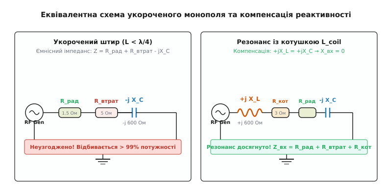
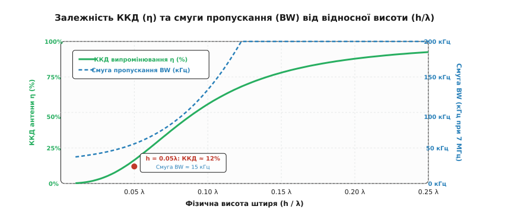
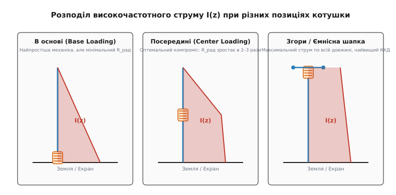
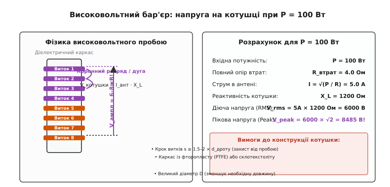

# Завантажувальна котушка: укорочення антени індуктивністю

<preknowlist>
- [Антена](root:com-medium/antenna) — перетворення веденого струму на вільну електромагнітну хвилю та опір випромінювання.
- [Резонансний диполь](root:com-medium/resonance-dipole) — стоячі хвилі, чвертьхвильовий штир та резонансна довжина.
- [Узгодження імпедансу антени](root:com-medium/antenna-feedline-matching-and-balun) — реактивний опір, коефіцієнт відбиття та компенсація реактивностей.
</preknowlist>

Спроба вийти в радіоефір на низьких частотах завжди впирається в жорстокі закони геометрії. Для діапазону 160 метрів (1.8 МГц) повнорозмірна чвертьхвильова вертикальна антена повинна мати висоту **40 метрів** — це розмір чотирнадцятиповерхового будинку. На короткохвильовому діапазоні 40 метрів (7 МГц) класичний штир розтягується на **10 метрів**, що абсолютно неприйнятно для автомобіля чи переносної радіостанції. А для цивільного зв'язку CB (27 МГц) чвертьхвильовий багнет довжиною 2.75 метра на даху легковика збиватиме гілки дерев та перекриття підземних паркінгів.

Якщо ж ми просто зріжемо металевий провідник до зручної довжини — наприклад, до 1.5 чи 1.8 метра — антена перестає працювати. Радіопередавач відмовляється віддавати потужність, вихідний каскад підсилювача перегрівається, а коефіцієнт відбиття наближається до 100%. Чому фізично короткий дріт блокує радіосигнал і як індуктивна котушка дозволяє «стиснути» багатометрову антену в компактний пристрій — розберімося послідовно.

---

### Фізика ємнісної пастки укороченого штиря

Щоб зрозуміти причину відмови короткої антени, пригадаймо розподіл струму й напруги на резонансному чвертьхвильовому монополі (`h = λ / 4`). На резонансній частоті високочастотна хвиля струму встигає пройти від основи до верхівки антени й відбитися назад рівно за чверть періоду. Струм біля основи антени є максимальним, а напруга мінімальною. Реактивний опір обнуляється (`X_вх = 0`), і антена виглядає для фідера як чисто активний опір випромінювання `R_рад ≈ 36.5 Ом`.

Але якщо фізична висота штиря менша за чверть довжини хвилі (`h < λ / 4`), стояча хвиля струму не встигає повністю сформуватися на короткому відрізку дроту.

```
Повнорозмірний штир (h = λ/4):   Струм і напруга в фазі біля основи  ⇒  X_вх = 0  (Резонанс)
Укорочений штир (h < λ/4):       Струм випереджає напругу            ⇒  X_вх = -j X_C  (Ємнісний опір)
```

У ближній реактивній зоні антени (на відстанях `r < λ / 2π`) електромагнітне поле розділяється на два незамкнені накопичувачі енергії. На укороченому провіднику електричний заряд, який жене передавач, дуже швидко добігає кінця дроту й зупиняється, не маючи куди текти далі. Цей накопичений на верхівці заряд створює потужне змінне електричне поле відносно землі. Вектор електричної напруженості `E` суттєво переважає магнітну напруженість `H`.

Відношення накопиченого амплітудного заряду `Q` до напруги `V` — це ємність `C`. Електрично такий короткий штир поводиться як **найзвичніший високовольтний конденсатор малих розмірів**, підключений послідовно з малим опором випромінювання.

Вхідний імпеданс укороченого штиря стає комплексною величиною із величезною від'ємною реактивністю:

```
Z_вх = R_рад + R_втрат - j · X_C
```

Для автомобільного штиря довжиною 1.8 м на частоті 7.1 МГц (`λ = 42.25 м`) власний ємнісний опір `X_C` досягає **майже 1300 Ом**, тоді як активний опір випромінювання `R_рад` становить всього **2.86 Ом**.

При спробі підключити таку антену безпосередньо до стандартного 50-омного коаксіального кабелю коефіцієнт відбиття за напругою `|Γ|` перевищує `0.99`. Понад 98% потужності передавача відбивається від антени назад у кабель, утворюючи руйнівну стоячу хвилю з КСХ понад 100:1. Ефір залишається мовчазним.

---

### Компенсація реактивності: як котушка «дурить» передавач

Щоб змусити антену приймати потужність від генератора, необхідно ліквідувати уявний складник імпедансу, тобто досягти умови `X_вх = 0`. 

З фундаментальної електротехніки відомо: ємнісний реактивний опір `-j X_C` компенсується рівним за модулем **індуктивним реактивним опором** `+j X_L`. Якщо ввімкнути послідовно з антенним провідником індуктивну котушку, її індуктивність створює опір `X_L = ω · L_coil`.


*Зліва: короткий монополь виглядає для генератора як послідовне з'єднання мізерного опору R_рад та велетенської ємності -jX_C, що відбиває всю потужність. Справа: додавання послідовної завантажувальної котушки з опором +jX_L скасовує ємність, повертаючи систему в стан електричного резонансу.*

Коли індуктивність котушки підібрана так, що `ω · L_coil = 1 / (ω · C_ant)`, сумарна реактивність кола стає нульовою:

```
X_вх = +j X_L - j X_C = 0
```

Цю котушку називають **завантажувальною** або **подовжувальною котушкою** (*loading coil*). Вона штучно уповільнює фазову швидкість хвилі струму в точці включення, створюючи додатковий фазовий зсув. Електрична довжина антени збільшується до резонансних `λ / 4`, хоча її фізичний розмір залишається короткому штиреві. Передавач «бачить» перед собою чисто активне навантаження й віддає в нього всю потужність без відбиття.

Проте індуктивне завантаження — це не безкоштовне диво. Прочитавши [історію індуктивного завантаження від дротів Пупіна до радіоантен](root:com-medium/loading-coil/hist-loading-coil.md), можна переконатися, що боротьба за геометричне скорочення завжди супроводжується важкими інженерними компромісами.

---

### Ефективна висота та анатомія опору випромінювання

Щоб глибше зрозуміти механіку випромінювання короткої антени, введемо поняття **ефективної висоти антени** `h_eff`. Фізична висота `h` визначає геометричний розмір штиря, але випромінювання електромагнітної хвилі визначається площею під кривою розподілу струму `I(z)` вздовж цього штиря.

Ефективна висота `h_eff` описується інтегралом:

```
h_eff = (1 / I_0) · ∫₀ʰ I(z) dz
```

де `I_0` — струм у точці живлення в основі антени.

1. **Для повнорозмірного чвертьхвильового штиря (`h = λ / 4`)** струм має косинусоїдальний розподіл `I(z) = I_0 · cos(2πz / λ)`. Його ефективна висота становить `h_eff = (2 / π) · h ≈ 0.637 · h`.
2. **Для незавантаженого короткого штиря (`h < λ / 4`)** струм спадає від значення `I_0` в основі до нуля на кінці майже за лінійним (трикутним) законом. Його ефективна висота становить всього **половину фізичної висоти**:

```
h_eff ≈ h / 2
```

Загальна формула опору випромінювання будь-якого вертикального монополя через ефективну висоту виглядає так:

```
R_рад = 160 · π² · (h_eff / λ)²   [Ом]
```

Підставивши у цю формулу значення `h_eff = h / 2` для незавантаженого трикутного розподілу струму, отримуємо класичне вираження:

```
R_рад = 160 · π² · (h / 2λ)² = 40 · π² · (h / λ)² ≈ 160 · π² · (h / λ)²   [Ом]
```

Зверніть увагу на квадрат співвідношення `(h / λ)²`! Зменшення фізичної висоти антени вдвічі зменшує опір випромінювання **у чотири рази**.

---

### Економіка укорочення: драматичне падіння ККД

Виникає логічне питання: якщо котушка здатна резонувати з будь-яким коротких штирем, чи можна зробити антену довжиною 10 сантиметрів для 3.5 МГц, мотати велику котушку й отримувати повноцінний радіозв'язок? 

Відповідь — ні. Причиною тому є жорстоке спадання `R_рад`:

- Для повнорозмірного штиря `h = 0.25 · λ` опір випромінювання становить `R_рад ≈ 36.5 Ом`.
- При укороченні до `h = 0.10 · λ` опір спадає до `R_рад ≈ 15.8 Ом`.
- При укороченні до `h = 0.0426 · λ` (автомобільний штир 1.8 м на 7 МГц) `R_рад` падає до **2.86 Ом**.
- При укороченні до `h = 0.01 · λ` (штир 40 см на 7 МГц) `R_рад` становить мізерні **0.15 Ом**!


*При укороченні штиря нижче 0.1λ опір випромінювання падає за квадратичним законом. Опір втрат у котушці та заземленні починає домінувати, через що ККД антени η стрімко падає від 90% до одиниць відсотків, а смуга пропускання звужується до кількох кілогерців.*

Повний активний опір резонансної укороченої антени `R_повн` є сумою чотирьох складових:

```
R_повн = R_рад + R_землі + R_котушки + R_поблизу
```

1. `R_рад` — корисний опір випромінювання (єдина частина, що випромінює радіохвилю).
2. `R_землі` — опір втрат у землі, противагах або металевому кузові автомобіля (типово 3–8 Ом). Він виникає через вихрові струми у ґрунті під антеною та поверхневий опір металу кузова.
3. `R_котушки` — опір омічних втрат у дроті котушки на ВЧ за рахунок скін-ефекту та ефекту близькості витків (*proximity effect*):

```
R_котушки = X_L / Q_котушки
```
4. `R_поблизу` — опір вихрових втрат у близьких провідних або діелектичних об'єктах (наприклад, вологих деревах, елементах кузова чи щогли), які поглинають енергію високовольтного електричного поля.

Глибина скін-шару `δ` у мідному провіднику зменшується з ростом частоти `f`:

```
δ = √(ρ / (π · f · μ₀ · μᵣ))
```

На частоті 7.1 МГц струм протікає лише у тонкому поверхневому шарі міді товщиною всього **24 мікрони**! Через це активний опір ВЧ-струму в десятки разів перевищує опір постійному струму.

Навіть у дуже якісної високодобротної котушки з `Q_котушки = 200` при індуктивному опорі `X_L = 1300 Ом` власний опір втрат становить `R_котушки = 1300 / 200 = 6.5 Ом`!

ККД антени `η` дорівнює відношенню корисної потужності випромінювання до всієї потужності, поглинутої системою:

```
η = R_рад / (R_рад + R_землі + R_котушки + R_поблизу) × 100%
```

**Числовий розрахунок ККД.** Для автомобільної антени заввишки 1.8 м на 7.1 МГц:

```
R_рад = 2.86 Ом,   R_землі = 4.0 Ом,   R_котушки = 6.49 Ом
R_повн = 2.86 + 4.0 + 6.49 = 13.35 Ом

η = 2.86 / 13.35 × 100% ≈ 21.4%
```

Понад **78.6% потужності передавача** взагалі не вилітає в ефір, а перетворюється на тепло: нагріває витки котушки та поверхню кузова автомобіля! Якщо ж скоротити цей штир до 80 см, `R_рад` впаде до `0.56 Ом`, а ККД просяде нижче **5%**. 

Детальний числовий аналіз та формули наведено у вставці [математичний вивід імпедансу, ККД та високої напруги](root:com-medium/loading-coil/math-coil-design.md).

---

### Просторова геометрія: де ставити котушку на штирі?

Місце врізання завантажувальної котушки вздовж вертикального штиря кардинально впливає на розподіл струму та підсумковий ККД антени. 


*Порівняння профілів струму I(z): В основі (Base Loading) — струм швидко падає вздовж штиря; Посередині (Center Loading) — високий струм підтримується по всій нижній половині; Згори з ємнісною шапкою (Top Loading) — струм майже рівномірний по всій довжині, що дає максимальний R_рад.*

Існує три класичних варіанти розміщення котушки:

#### 1. Завантаження в основі (*Base Loading*)
Котушка встановлюється безпосередньо біля ізолятора живлення в основі антени (`z = 0`).
- **Переваги:** Максимальна механічна простота та надійність. Важка котушка знаходиться внизу, не створює вітрового важеля на гнучкий прут. Просте налаштування індуктивності.
- **Недоліки:** Весь штир вище котушки несе струм, який лінійно спадає від максимуму до нуля на верхівці (`h_eff = h / 2`). Середній струм на випромінювачі є найнижчим. Опір випромінювання `R_рад` — мінімальний, ККД — найнижчий.

#### 2. Завантаження посередині (*Center Loading*)
Котушка врізається приблизно на середині висоти штиря (`z = h / 2`).
- **Переваги:** Повний струм живлення від передавача протікає по всій нижній половині металевого штиря до котушки. Профіль струму на нижній ділянці стає майже прямокутним, а ефективна висота зростає до `h_eff ≈ 0.75 · h`. Це піднімає опір випромінювання `R_рад` у **2–3 рази** порівняно з базовим завантаженням! ККД зростає з 20% до 40–50%.
- **Недоліки:** Масивна котушка височіє на метровому пруті, розгойдуючись від вірту та вібрацій автомобіля. Потрібен міцний діелектричний каркас та потовщений прут.

#### 3. Завантаження згори та ємнісна шапка (*Top Loading / Top-Hat*)
Котушка розміщується біля верхівки штиря, або поєднується з так званою **ємнісною шапкою** (*Top-Hat*) — металевим диском або спицями.
- **Переваги:** Ємнісна шапка додає зосереджену ємність на самому верху антени. Це «витягує» амплітуду струму вгору: струм залишається високим та майже незмінним по всій вертикальній довжині штиря (`h_eff ≈ h`). Опір випромінювання наближається до максимально можливого для даної фізичної висоти, ККД — найвищий.
- **Недоліки:** Максимальне парусність та механічне навантаження на вежу чи штир.

---

### Порівняння індуктивного та ємнісного завантаження

Укорочення антени можна здійснювати не лише індуктивністю, а й за допомогою додаткових провідників на верхівці — **ємнісного завантаження** (*Capacitive loading / Top-Hat*).

```
Індуктивне завантаження (Coil):   Компенсує -jX_C за допомогою котушки +jX_L  ⇒  Втрати R_котушки = X_L / Q
Ємнісне завантаження (Top-Hat):  Збільшує C_ant за рахунок спиць на верхівці   ⇒  R_втрат ≈ 0, зростає h_eff
```

Головна перевага ємнісного завантаження — абсолютна відсутність дротових омічних втрат! Металеві спиці або диск на верхівці антени не мають активного опору ВЧ, тому ККД антени з ємнісною шапкою завжди на 20–40% вищий, ніж у антени з котушкою в основі. 

Однак ємнісна шапка створює колосальний вітровий опір, тому в реальній інженерії найчастіше застосовують **комбіноване завантаження**: невеликі ємнісні спиці на верхівці знижують необхідну індуктивність котушки вдвічі, зменшуючи її омическі втрати та нагрівання.

---

### Криза смуги пропускання та високовольтний бар'єр

Використання індуктивного укорочення ставить перед інженером два критичних бар'єри: вузькосмуговість та кіловольтні напруги.

#### 1. Парадокс високої добротності та вузької смуги
Еквівалентна добротність укороченої антени `Q_ант` визначається відношенням реактивного опору до повного активного опору:

```
Q_ант = X_C / R_повн
```

Оскільки для короткого штиря `X_C` вимірюється кілоомами, а `R_повн` — одиницями ом, добротність `Q_ант` сягає значень **100–300**. Смуга пропускання антени по рівню КСХ = 2.0 (`BW`) розраховується як:

```
BW = f₀ / Q_ант
```

На частоті 7.1 МГц при `Q_ант = 100` смуга пропускання становить всього `71 кГц`. На діапазоні 3.5 МГц смуга звужується до **10–15 кГц**! Це означає, що при зміні частоти передавача всього на кілька каналів КСХ стрімко зростає від 1.1 до 5.0, і антену доводиться постійно підлаштовувати механічно або за допомогою дистанційного приводу.

#### 2. Високовольтний пробій на витках котушки
При підключенні передавача середньої потужності (`P = 100 Вт`) через антенний струм `I_ант` на індуктивному опорі котушки `X_L` виникає величезне падіння напруги ВЧ:

```
V_котушки = I_ант · X_L
```

При `P = 100 Вт` та `R_повн = 13.35 Ом` струм в антені дорівнює `I_ант = √(100 / 13.35) ≈ 2.74 А`.

При `X_L = 1300 Ом` діюча напруга на котушці становить:

```
V_rms = 2.74 А × 1300 Ом = 3560 В
```

Пікове (амплітудне) значення напруги сягає:

```
V_peak = 3560 · √2 ≈ 5030 В = 5.03 кВ!
```


*При потужності передавача 100 Вт на клемах завантажувальної котушки виникає пікова ВЧ-напруга понад 5 кіловольт. Між витками виникає ризик іонізації повітря, коронного розряду та високовольтної дуги.*

При роботі потужністю **1000 Вт (1 кВт)** пікова напруга на котушці перевищує **16 кіловольт**! Повітря між сусідніми витками іонізується, виникає коронний розряд, дуговий пробій та спалахування діелектричного каркаса.

---

### Багатодіапазонні завантажувальні котушки та ВЧ-трапи

На практиці радіостанція повинна працювати не на одній частоті, а на кількох аматорських чи службових діапазонах (наприклад, 7 МГц, 14 МГц та 21 МГц).

Для створення багатодіапазонної укороченої антени застосовують два конструктивних рішення:

1. **Котушки з проміжними відводами (*Tapped Coils*):**  
   Завантажувальна котушка має кілька паяних відводів від витків. Галетный перемикач або ВЧ-реле закорочує непотрібну частину витків на високочастотних діапазонах, залишаючи повну індуктивність лише для найнижчого діапазону.
2. **Антенні трапи (*Antenna Traps*):**  
   Трап є паралельним `LC`-контуром, настроєним у резонанс на вищий діапазон (наприклад, 14 МГц). На цій частоті трап має величезний опір і «відсікає» решту провідника з котушкою. На нижчій частоті (7 МГц) паралельний контур трапу поводиться як звичайна послідовна індуктивність, подовжуючи антену для роботи на нижчому діапазоні.

---

### Вплив навколишнього середовища та температурний дрейф

У реальній експлуатації завантажувальна котушка стикається з факторами зовнішнього середовища, які можуть повністю розладнати вузькосмугову антенну систему.

1. **Вологість та дощ:** Вода має високу відносну діелектричну проникність (`εᵣ ≈ 80`). Поява плівки води на каркасі котушки або поверхні штиря збільшує паразитну ємність `C_ant` на 5–15%. Через високу добротність антени `Q ≈ 100...200` це спричиняє зсув резонансної частоти `f₀` вниз на 50–150 кГц, виводячи антену за межі робочої смуги передавача.
2. **Температурне розширення:** При тривалій передачі струм 3–5 А нагріває витки котушки до 60–90 °C. Мідний дріт та фторопластовий каркас розширюються, змінюючи індуктивність `L_coil` (температурний коефіціент індуктивності TKI). У поєднанні з вузькою смугою пропускання це вимагає застосування термостабільних матеріалів або автоматичних тюнерів.

---

### Інженерна практика та сучасні реалізації

Для подолання цих обмежень у сучасній радіотехніці застосовують перевірені конструктивні рішення:

1. **Мобільні викруткові антени (*Screwdriver Antennas*):** На автомобілях встановлюють циліндричні котушки великого діаметра (7–10 см), усередині яких ходовий гвинт від мікроелектродвигуна переміщує струмознімач. За командою з кабіни мотор змінює кількість активних витків котушки, автоматично підлаштовуючи антену в точний резонанс на будь-якій частоті від 3.5 до 30 МГц.
2. **Спіральні штирі (*Helical Whips*) та «Rubber Ducky»:** У портативних раціях діапазонів 144/433 МГц замість окремої котушки використовують мідний дріт, намотаний спіраллю по всій довжині гнучкого пластикового або силіконового стержня. Індуктивність витків рівномірно розподілена по довжині, що робить антену міцною та компактною (10–15 см).
3. **Оптимізація добротності котушки:** Завантажувальні котушки намотують товстим посрібленим мідним дротом або трубиною з кроком намотки `s = 1.5–2.0` діаметра дроту. Застосовують каркаси з матеріалів із низькими діелектричними втратами (фторопласт/PTFE, склотекстоліт) або роблять котушки безкаркасними (повітряна намотка).

Щоб самостійно розрахувати всі параметри антени та котушки для власної частоти й габаритів, скористайтеся інструментом [калькулятор завантажувальної котушки мовами C та C++](root:com-medium/loading-coil/proj-coil-calc.md).

---

> 🔧 **Навіщо це.**
> 
> Індуктивне завантаження — єдиний спосіб розширити фізичні межі розмірів антен при роботі в діапазонах НЧ та СЧ (від довгих хвиль до 7 МГц). Воно дозволяє розмістити короткохвильову станцію на авто, безпілотнику чи кораблі, де встановлення 10-метрової вежі фізично неможливе.
> 
> Працюючи з укороченими антенними системами, пам'ятайте головні правило інженерного компромісу: **що коротший штир, то нижчий ККД, то вужча смуга та вища напруга на котушці**. Оптимізуйте систему: обирайте завантаження посередині (Center Loading) замість основи, забезпечуйте низький опір заземлення `R_землі` (хороша сітка радіалів або кузов авто) та використовуйте котушки з високою добротністю `Q ≥ 200` та пробійною міцністю ізоляції.
