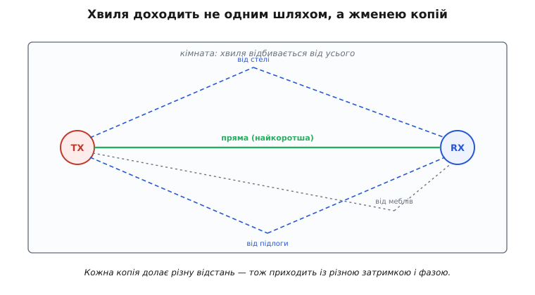
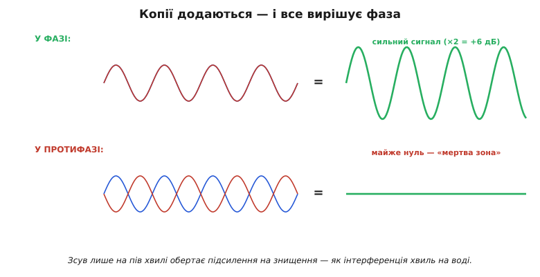
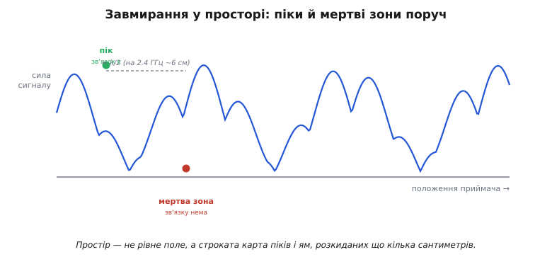
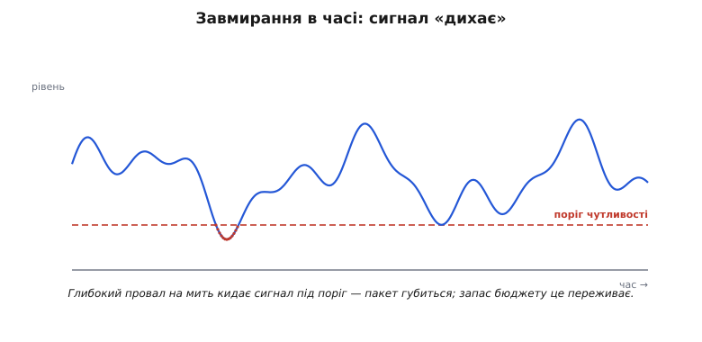
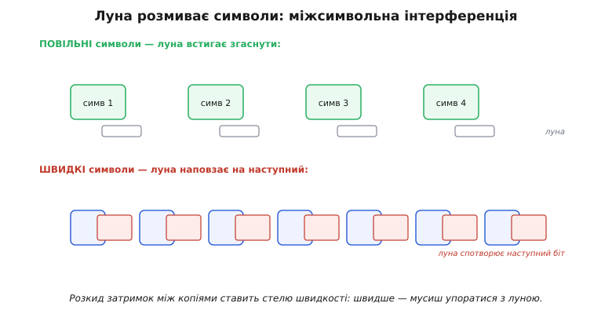
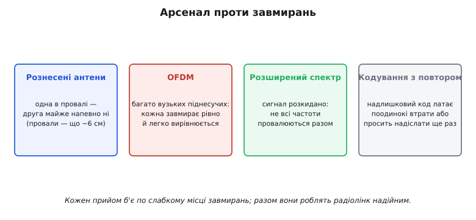
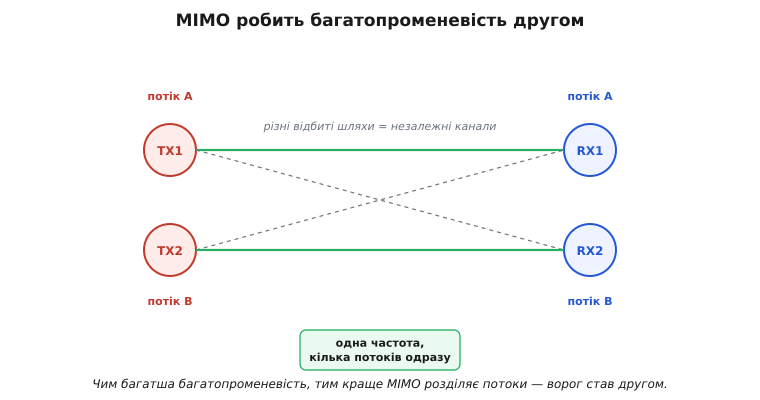

# Багатопроменевість і завмирання

[Бюджет лінії](root:embedded/link-budget) малює спокійну картину: сигнал виходить, рівно слабшає з відстанню, приходить — і якщо запас додатний, усе працює. Та хто користувався Wi-Fi чи дивився, як стрибає рівень сигналу телефона, знає: реальність куди примхливіша. Сигнал **дихає** — то злітає, то провалюється; ступив крок убік — і зв'язок ожив або помер. Причина — у красивому й важливому явищі: **багатопроменевість** (*multipath*, від латинського *multus* — багато, тобто «багатошляховість») і породжене нею **завмирання** (англ. *fading*, згасання). Зрозумівши його, бачиш заразом, навіщо запас бюджету лінії, навіщо дві антени на роутері і як сучасний Wi-Fi обернув цю біду собі на користь.

### Хвиля приходить багатьма шляхами

Уся справа в тому, що радіохвиля, на відміну від променя в нашій уяві, доходить до приймача **не одним** шляхом.


*До приймача приходять кілька копій однієї хвилі: пряма (найкоротша) і відбиті — від стелі, підлоги, стін, меблів. Кожна копія долає різну відстань, тож приходить із різною затримкою й, головне, з різною фазою.*

У відкритому полі ще сяк-так буває «один промінь», та в кімнаті, на вулиці міста, у лісі хвиля **відбивається** від усього — стін, підлоги, металу, машин — точно як світло від дзеркал, як і за будь-якого [поширення радіохвиль](root:com-medium/propagation-polarization). Тому в приймальну антену прилітає не одна хвиля, а **жменя копій** тієї самої, кожна своїм маршрутом. А раз маршрути різної довжини, то й приходять копії **не одночасно** і з різними фазами. Далі вони складаються — і ось тут починається найцікавіше.

### Копії складаються — вирішує фаза

Що буде, коли кілька копій однієї хвилі зійдуться на антені? Вони **додаються** — але результат залежить від їхньої взаємної **фази**, і він буває діаметрально протилежним.


*Якщо копії приходять у фазі (гребінь до гребеня), вони підсилюють одна одну — сигнал міцнішає (дві рівні копії дають +6 дБ). Якщо у протифазі (гребінь до западини) — гасять одна одну, аж до майже повного нуля. Те саме явище, що й інтерференція хвиль на воді.*

Фаза залежить від різниці пройдених шляхів, виміряної в довжинах хвилі. Зсув на **пів хвилі** обертає підсилення на знищення. А яка це відстань на практиці? Візьмімо [λ = c/f](root:embedded/frequency-wavelength) для 2.4 ГГц:

```
λ      = 3·10⁸ / 2.4·10⁹ = 0.125 м = 12.5 см
λ / 2  = 6.25 см
```

Тобто **лише 6 сантиметрів** різниці ходу — і ти переходиш від яскравого піка до глибокого провалу. Дві рівні копії у фазі дають удвічі більшу амплітуду — а це вчетверо більша потужність, тобто **+6 дБ**; ті самі копії в протифазі дають майже **нуль**, «мертву зону». Ось чому радіо таке примхливе: усе вирішують сантиметри. А коли копій не дві, а десяток, з випадковими фазами, їхня сума стає випадковою величиною з власним статистичним законом — це окрема й глибока тема, що описує саме [математику завмирання](root:com-medium/multipath-fading/math-rayleigh-fading.md).

### Завмирання у просторі: піки й мертві зони поруч

Наслідок інтерференції копій — у тому, що сила сигналу **залежить від положення** приймача, і то надзвичайно різко.


*Якщо рухати приймач, сила сигналу не спадає плавно, а мерехтить: яскраві піки чергуються з глибокими мертвими зонами що кілька сантиметрів. Між сусіднім піком і нулем — близько λ/2 (на 2.4 ГГц приблизно 6 см).*

Простір довкола передавача — це не рівне поле, що тихо слабшає з відстанню, а строката **карта** з пагорбами-піками й ямами-провалами, розкиданими що кілька сантиметрів. У піку зв'язок чудовий, у сусідній ямі — нема зовсім. Ось чому, коли телефон «не ловить», часом досить **посунути** його на долоню, повернути чи переступити крок — і зв'язок повертається: ти просто вийшов із мертвої зони. Те саме з роутером удома: пересунув на півметра — і кутова кімната ожила.

### Завмирання в часі: сигнал дихає

Та сама карта завмирань, варто комусь у кімнаті **рухатися**, попливе вже **в часі**.


*Коли рухається передавач, приймач або будь-що між ними (люди, машини, двері), малюнок інтерференції безперервно змінюється — і рівень прийнятого сигналу стрибає в часі. Інколи глибокий провал на мить кидає його під поріг чутливості — пакет губиться.*

Світ навколо радіо рідко стоїть на місці: ходять люди, їдуть авто, ти сам рухаєш телефон. Кожен рух пересуває «карту» завмирань — і рівень сигналу починає **коливатися в часі**, інколи на десятки децибел. Здебільшого це непомітно, та час від часу глибокий провал кидає сигнал **нижче порогу чутливості** — і пакет на ту мить губиться. Ось де набуває сенсу **запас на завмирання**, який закладають у [бюджет лінії](root:embedded/link-budget): ті 10–20 дБ резерву існують саме для того, щоб звичайний провал **не** дотягувався до порогу й зв'язок переживав «дихання» сигналу без обривів.

> 🔧 **Навіщо це.** Запас на завмирання — це не перестраховка «про всяк випадок», а конкретний рядок у бюджеті лінії, від якого залежить, чи переживе пристрій нормальну фізику ефіру. Закладеш замало (скажімо, рахуватимеш лише вільне загасання) — лінк працюватиме на столі й розсиплеться в реальній кімнаті з людьми. Тому для рухомого або кімнатного зв'язку до спокійного розрахунку додають резерв саме під провали, і його величину беруть не зі стелі, а зі статистики завмирання.

**Приклад (чи переживе лінк завмирання).** Нехай на столі бюджет лінії дає прийнятий рівень −70 дБм, а чутливість приймача −90 дБм — запас 20 дБ. Глибина завмирання, яку треба перекрити для надійного зв'язку в кімнаті, — 15 дБ. Прошивка може сама вирішити, чи варто піднімати швидкість (а отже, і потрібну чутливість), порівнявши наявний запас із потрібним:

:::tabs
```cpp
// чи лишається зв'язок над порогом при заданій глибині провалу
bool link_survives_fade(int rx_dbm, int sensitivity_dbm, int fade_depth_db) {
    int margin = rx_dbm - sensitivity_dbm;   // запас бюджету, дБ
    return margin >= fade_depth_db;          // true = провал не дотягнеться до порога
}

// rx=-70, sens=-90 -> margin=20; fade=15 -> 20>=15 -> true (переживе)
bool ok = link_survives_fade(-70, -90, 15);  // ok == true
```
```py
# чи лишається зв'язок над порогом при заданій глибині провалу
def link_survives_fade(rx_dbm, sensitivity_dbm, fade_depth_db):
    margin = rx_dbm - sensitivity_dbm    # запас бюджету, дБ
    return margin >= fade_depth_db       # True = провал не дотягнеться до порога

# rx=-70, sens=-90 -> margin=20; fade=15 -> 20>=15 -> True (переживе)
ok = link_survives_fade(-70, -90, 15)    # ok == True
```
```js
// чи лишається зв'язок над порогом при заданій глибині провалу
function linkSurvivesFade(rxDbm, sensitivityDbm, fadeDepthDb) {
    const margin = rxDbm - sensitivityDbm;   // запас бюджету, дБ
    return margin >= fadeDepthDb;            // true = провал не дотягнеться до порога
}

// rx=-70, sens=-90 -> margin=20; fade=15 -> 20>=15 -> true (переживе)
const ok = linkSurvivesFade(-70, -90, 15);   // ok === true
```
:::

Запас 20 дБ більший за глибину провалу 15 дБ, тож звичайне завмирання лінк переживе. Якби приймач підняв швидкість і його чутливість погіршала до −78 дБм, запас упав би до 8 дБ — менше за 15, і провали почали б рвати зв'язок. Звідси практичне правило: вища швидкість коштує запасу на завмирання, і цей розмін треба рахувати, а не вгадувати.

### Луна розмиває символи

У багатопроменевості є й окрема, підступніша вада, що шкодить саме **швидким** цифровим лініям, — **міжсимвольна інтерференція**.


*Затримані копії (луна) приходять із запізненням і наповзають на наступні символи, розмиваючи їх. На повільному потоці це дрібниця, а на швидкому луна від попереднього символу спотворює наступний — приймач плутає біти.*

Відбиті копії приходять **із затримкою**. Якщо [символи модуляції](root:com-modulation/fsk-psk) йдуть повільно, запізніла луна встигає згаснути до наступного символу — байдуже. Та коли символи летять **швидко**, луна від попереднього ще звучить, коли вже почався наступний, — і вони **накладаються**, плутаючи приймач. Це й є **міжсимвольна інтерференція** (*intersymbol interference*, ISI). Розкид затримок між копіями (*delay spread*) тим самим ставить **стелю швидкості**: хочеш швидше — мусиш якось упоратися з луною. Це ще одна, окрема від [межі Шеннона](root:math-information/bandwidth-capacity), причина, чому дальність і швидкість так важко поєднати.

### Арсенал проти завмирань

З багатопроменевістю інженери дають раду — і то кількома взаємодоповняльними способами, кожен б'є по своєму слабкому місцю завмирань.


*Чотири головні прийоми: рознесені антени (одна в провалі — друга ні); OFDM (багато вузьких піднесучих, кожна завмирає рівно й легко вирівнюється); розширений спектр (не всі частоти завмирають разом); завадостійке кодування з повтором, що латає поодинокі втрати.*

**Рознесення** (*diversity*, розмаїття): постав дві антени за кілька сантиметрів — якщо одна потрапила в мертву зону, інша майже напевно ні (бо провали трапляються що λ/2, тобто на 2.4 ГГц що ~6 см); приймач бере кращу. **OFDM** (*orthogonal frequency-division multiplexing*, ортогональне частотне ущільнення): розбий швидкий потік на безліч **повільних** вузьких піднесучих — кожна бачить рівне («пласке») завмирання, яке легко вирівняти, а повільні символи не страждають від ISI; на цьому стоять Wi-Fi і LTE. [Розширений спектр](root:com-modulation/spread-spectrum): стрибки частоти й коди розкидають сигнал так, що не всі частоти провалюються одночасно. І нарешті **кодування з перевідправленням**: втрачені під час провалу біти відновлюють надлишковим кодом або просто [просять надіслати ще раз](root:com-transport/reliable-link).

### Несподіваний фінал: ворог стає другом

Найкрасивіший поворот усієї історії такий. Багатопроменевість десятиліттями вважали **ворогом** зв'язку. А сучасні системи навчилися робити з неї **джерело швидкості**.


*MIMO ставить кілька антен на обох кінцях. Різні відбиті шляхи між ними утворюють кілька незалежних каналів — і по них одночасно женуть кілька різних потоків даних. Те, що псувало один сигнал, тепер у кілька разів збільшує ємність.*

Ідея зветься **MIMO** (*multiple-input multiple-output*, багато входів — багато виходів) і звучить як парадокс. Постав кілька антен на передавачі й кілька на приймачі. Багатопроменевість робить шлях від кожної TX-антени до кожної RX-антени **трохи іншим** — і ці відмінності дають змогу математично **розділити** кілька потоків даних, що летять **одночасно на одній частоті**. Чим **багатша** багатопроменевість, тим краще MIMO розрізняє потоки — отже, колишній ворог став **другом**, що множить швидкість. Саме MIMO дало сучасному Wi-Fi і 5G їхні високі швидкості. Гарний урок інженерної винахідливості: явище, з яким півстоліття боролися, зрештою обернули на перевагу.
