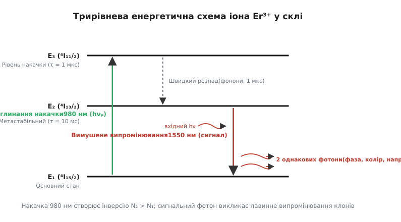
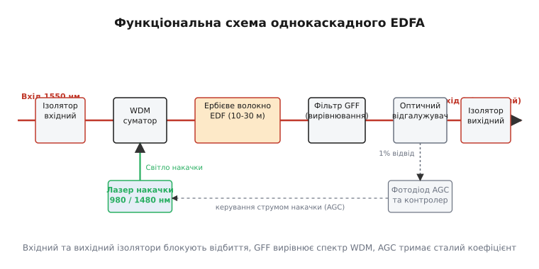
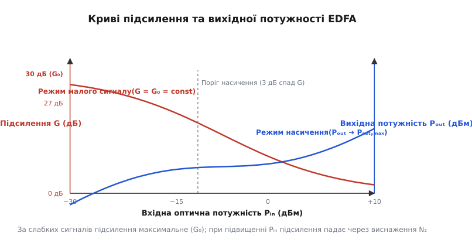

# Оптичний підсилювач (EDFA)

<preknowlist>
- [Оптоволокно](topic:com-medium/optical-fiber) — структура ядра й оболонки, повне внутрішнє відбиття та вікна прозорості (1310 нм та 1550 нм).
- [Хвильове мультиплексування (WDM)](topic:com-medium/wdm) — передача десятків світлових сигналів різної довжини хвилі по єдиній скляній нитці.
</preknowlist>

Уявіть, що по дну Атлантичного океану прокладено тонкий скляний кабель завдовжки шість тисяч кілометрів. Світловий імпульс, створений лазером у Нью-Йорку, виходить у лінію з потужністю в кілька міліват. Згасання найчистішого кварцового скла на довжині хвилі 1550 нанометрів становить приблизно 0.2 децибела на кілометр. На перших ста кілометрах сигнал слабне у сто разів; на п'ятистах кілометрах від початкового спалаху не лишається жодного фотона. Без проміжного підсилення жодна глобальна оптична мережа не здатна передати дані далі кількох десятків кілометрів.

Протягом перших десятиліть волоконної ери цю проблему вирішували так званими електронними регенераторами (O-E-O перетворювачами: *Optical-Electronic-Optical*). Кожні 50–80 кілометрів світло приймали фотодіодом, перетворювали на електричний струм, підсилювали й очищали високочастотною електронікою, а потім знову модулювали місцевий лазерний діод. Це створювало важкий технологічний тупик: регенератор був жорстко прив'язаний до швидкості передачі й коду, а з появою хвильового мультиплексування (WDM), коли по волокну пустили десятки світлових хвиль різного кольору, електронна станція вимагала розщеплення кабелю на десятки окремих електронних плат.

Рішенням, яке врятувало волоконні магістралі й створило сучасний високошвидкісний Інтернет, став **оптичний підсилювач на волокні, легованому ербієм** (EDFA — *Erbium-Doped Fiber Amplifier*). Цей пристрій не перетворює світло на струм. Він підсилює світлові фотони безпосередньо у скляному ядрі за допомогою квантового явища вимушеного випромінювання, залишаючись цілком «прозорим» до швидкості даних, кодування та кількості спектральних каналів.

### Тупик електронної регенерації: чому звичайні повторювачі зламалися

Щоб зрозуміти, чому поява волоконного підсилювача викликала справжній переворот, варто поглянути на фізичні та економічні обмеження електронної регенерації 3R (*Re-amplifying, Re-shaping, Re-timing*).

Електронний регенератор — це пристрій прямої дії. Його завдання — не просто підсилити електричний аналог сигналу, а повністю відновити прямокутні цифровий фронт та тактову синхронізацію бітів. Якщо лінія працює на швидкості 2.5 гігабіта за секунду, транзистори й мікросхеми розраховують під смугу 2.5 ГГц. Та як тільки виникає потреба модернізувати мережу до 10 або 40 гігабітів за секунду, уся електронна начинка регенератора перетворюється на непридатне залізо. У випадку підводного кабелю це означало необхідність піднімати з глибини кількох кілометрів сотні герметичних контейнерів і вручну міняти високочастотні плати.

Додатковим обтяженням електронних повторювачів було колосальне тепловиділення та високе споживання енергії. Підводний корпус 3R-регенератора змушений був розсіювати десятки ватів тепла через мікросхеми високочастотних підсилювачів, аналогових коректорів та прецизійних генераторів тактової частоти. Живлення таких станцій вимагало підведення по мідному екрану кабелю постійного струму напругою в кілька тисяч вольтів, що створювало високий ризик пробою ізоляції в агресивному солоному морському середовищі.

Драматичнішою виявилася несумісність електронних регенераторів із хвильовим мультиплексуванням. Коли у 1990-х роках виникла технологія WDM, що дозволила передавати по єдиному волокну 80 або 160 незалежних оптичних каналів на різних довжинах хвиль, підхід O-E-O зайшов у глухий кут. На кожній регенераційній станції оптичний потік доводилося розкладати спектральним демультиплексором на 80 окремих ниток скла, ставити 80 фотоприймачів, 80 електронних 3R-підсилювачів, 80 прецизійних лазерів із фіксованою довжиною хвилі, а потім знову збирати вихідні промені оптичним суматором. Габарити, споживання енергії, вартість та ймовірність відмови такої регенераторної станції зростали прямо пропорційно кількості WDM-каналів.

```text
O-E-O регенератор (WDM на M каналів):
Оптичний вхід ➔ [Демультиплексор] ➔ M фотодіодів ➔ M електронних 3R-плат ➔ M лазерів ➔ [Мультиплексор] ➔ Оптичний вихід
(Складність O(M), жорстка прив'язка до битової швидкості, високе тепловиділення)

Оптичний підсилювач (EDFA):
Оптичний вхід ➔ [ Шар ербієвого скла + Накачка ] ➔ Оптичний вихід
(Складність O(1), підсилює всі M каналів одночасно без O-E-O перетворення!)
```

Виходом міг бути лише пристрій, здатний підсилювати оптичне поле аналоговим способом без розщеплення спектра — прямо у волокні, зберігаючи фазу, частоту й поляризацію фотонів.

### Фізика квантового підсилення: трирівнева система ербію

Фізичним підгрунтям роботи EDFA є явище **вимушеного (індукованого) випромінювання** (*stimulated emission*, від латинського *stimulare* — «збуджувати, спонукати»), передбачене Альбертом Ейнштейном у 1917 році. Якщо атом перебуває у збудженому енергетичному стані `E₂`, а повз нього пролітає зовнішній фотон із енергією `h · ν = E₂ − E₁`, цей фотон може спровокувати перехід атома в основний стан `E₁`. При цьому атом випромінює другий фотон, який є точним клоном вхідного: він має абсолютно тотожну частоту, фазу, напрямок поширення та стан поляризації.

Для побудови оптичного підсилювача необхідно розв'язати дві задачі: знайти відповідний активний матеріал і забезпечити **інверсію населеностей** (*population inversion*), коли кількість збуджених атомів `N₂` перевищує кількість атомів в основному стані `N₁` (`N₂ > N₁`).

Ідеальним кандидатом виявився рідкісноземельний елемент **ербій** (*Erbium*, від назви шведського селища Іттербю, де було знайдено рідкісноземельні мінерали), що вводиться у вигляді тривалентних іонів Er³⁺ у кварцову матрицю ядра волокна. Електронна оболонка іона Er³⁺ має розщеплені під впливом внутрішньокристалічного поля скла енергетичні рівні, серед яких виділяється трирівнева система:

1. **Основний стан `E₁` (мультиплет ⁴I₁₅/₂):** Початковий енергетичний рівень іонів ербію, розщеплений кристалічним полем скла на 8 Штарківських підрівнів.
2. **Рівень накачки `E₃` (мультиплет ⁴I₁₁/₂):** Верхній збуджений рівень із Штарківським розщепленням на 6 підрівнів.
3. **Метастабільний рівень `E₂` (мультиплет ⁴I₁₃/₂):** Проміжний збуджений рівень (7 Штарківських підрівнів) із надзвичайно великим часом життя.


*Накачка на довжині хвилі 980 нм піднімає іони Er³⁺ з основного стану E₁ у стан E₃. Звідти вони за 1 мікросекунду безвипромінювально падають у метастабільний рівень E₂, де накопичуються завдяки довгому часу життя (τ ≈ 10 мс). Сигнальний фотон 1550 нм викликає вимушений перехід E₂ ➔ E₁, створюючи другий ідентичний фотон.*

Процес підсилення відбувається у три етапи:
- **Збудження (накачка):** Зовнішній напівпровідниковий лазер накачки випромінює фотони з довжиною хвилі `λ_p = 980 нм` (або `1480 нм`). Іони Er³⁺ поглинають ці фотони й переходять із основного стану `E₁` на верхній рівень `E₃`.
- **Швидка безвипромінювальна релаксація:** Перебуваючи на рівні `E₃`, іони ербію вкрай нестабільні. За час порядка `τ_32 ≈ 1 мкс` вони скидають лишкову енергію у вигляді теплових коливань скляної ґратки (фононів) і падають на метастабільний рівень `E₂`.
- **Накопичення інверсії та вимушене випромінювання:** Рівень `E₂` є метастабільним: природний спонтанний час життя іона на ньому становить близько `τ_21 ≈ 10 мс` (величезний час за мірками квантової фізики). Оскільки іони прибувають з рівня `E₃` за 1 мкс, а залишають `E₂` лише за 10 мс, на рівні `E₂` виникає висока концентрація збуджених іонів — утворюється стабільна інверсія населеностей (`N₂ > N₁`).

Різниця між накачкою 980 нм та 1480 нм полягає у термодинамічному ККД та рівні шуму. При 980 нм квантовий вихід визначається відношенням довжин хвиль `η_quant = 980 / 1550 ≈ 63.2%`, де 36.8% енергії перетворюється на фонони (тепло). Проте накачка 980 нм забезпечує майже повну 100% інверсію населеностей. При 1480 нм накачка йде безпосередньо на верхні Штарківські підрівні стану `E₂` (внутрішньосмугова накачка). Квантовий вихід зростає до `1480 / 1550 ≈ 95.5%`, але зворотні вимушені переходи під дією накачки обмежують максимальну інверсію на рівні близько 80–85%, що трохи підвищує власний шум підсилювача.

Коли через таке збуджене волокно проходить слабкий корисний оптичний сигнал із довжиною хвилі в діапазоні 1530–1565 нанометрів (C-band) або 1565–1610 нанометрів (L-band), його фотони резонансно індукують масові вимушені переходи `E₂ ➔ E₁`. Кожен вхідний фотон породжує лавину фотонів-клонів. Оптична потужність сигналу `P(z)` зростає вздовж волокна за експоненційним законом:

```text
P(z) = P_in · exp(g · z)
```

де `g` — локальний коефіцієнт підсилення активного волокна.

Подробиці того, як створювалися перші волоконні підсилювачі в лабораторіях Саутгемптона та Bell Labs, викладено в історичному екскурсі [Історія винаходу EDFA](topic:com-medium/optical-amplifier/hist-edfa.md).

### Анатомія та схема реального EDFA

Сучасний волоконний підсилювач EDFA є законсервованим оптоелектронним модулем, у якому зібрано активні оптичні компоненти, напівпровідникові лазери та схеми цифрового моніторингу.


*Світловий сигнал проходить вхідний ізолятор, поєднується із випромінюванням лазера накачки у WDM-суматорі й потрапляє в ербієве волокно. Фільтр GFF вирівнює спектральний пік, відгалужувач відводить 1% світла на фотодіод схеми авторегулювання (AGC), а вихідний ізолятор упереджує паразитного відбиття.*

Основними елементами структури є:

1. **Ербієве волокно (EDF — *Erbium-Doped Fiber*):** Відрізок одномодового кварцового волокна завдовжки від 10 до 30 метрів, ядро якого леговано іонами Er³⁺ із концентрацією 300–1000 ppm. Для запобігання кластеризації іонів у ядро додають со-домішки алюмінію ($Al_2O_3$) та германію ($GeO_2$).
2. **Лазер накачки (*Pump Laser*):** Напівпровідниковий лазерний діод високої потужності (від 50 до 500 міліват). Застосовують дві основні довжини хвиль:
   - **980 нм:** Забезпечує найнижчий рівень шуму (`NF ≈ 3.5–4.5 дБ`), оскільки збудження йде через вищий рівень `E₃`, гарантуючи майже 100% інверсію населеностей.
   - **1480 нм:** Безпосередньо збуджує іони на верхні підрівні метастабільного стану `E₂` (внутрішньосмугова накачка). Діоди 1480 нм мають вищий ККД і дозволяють отримати більшу граничну вихідну потужність, але дають трохи вищий шум (`NF ≈ 5.5–6.5 дБ`).
3. **WDM-суматор накачки (*Pump WDM Coupler*):** Спектрально-селективний волоконний розгалужувач, що зводить в одне ядро корисний сигнал 1550 нм та світло накачки (980/1480 нм) із мінімальними оптичними втратами (менше 0.2 дБ).
4. **Оптичні ізолятори (*Optical Isolators*):** Магнітооптичні пристрої на основі ефекту Фарадея, встановлені на вході й виході підсилювача. Вони пропускають світло лише в одному напрямку, затримуючи зворотні відбиття від конекторів та неоднорідностей ліка на рівні > 40 дБ. Без ізоляторів відбите світло створить зворотний зв'язок, перетворивши підсилювач на паразитний лазер-генератор.
5. **Фільтр вирівнювання підсилення (GFF — *Gain Flattening Filter*):** Спектр підсилення ербію в склі має гострий пік на довжині хвилі 1530 нм і плоскіший «шельф» на 1550 нм. У багатоканальних WDM-системах канал на 1530 нм підсилювався б значно сильніше за інші, забираючи на себе всю енергію накачки. Фільтр GFF на основі довгоперіодних волоконних ґраток Брегга (FBG) або тонкоплівкових інтерферометрів має амплітудно-частотну характеристику, що є дзеркальним відображенням спектрального піку ербію, роблячи коефіцієнт підсилення рівномірним (`±0.5 дБ`) у всій робочій смузі C-band (1530–1565 нм).
6. **Оптичний відгалужувач та схема AGC (*Automatic Gain Control*):** Відгалужувач відводить 1–2% вихідної потужності на вимірювальний фотодіод. Вбудований мікроконтролер неперервно аналізує вихідну потужність і динамічно змінює струм накачувального лазера зі швидкістю реакції менше 1 мікросекунди. Це необхідно для того, щоб під час відключення або додавання WDM-каналів (канальна комутація OADM) підсилення для решти каналів залишалося суворо стабільним і не викликало сплесків потужності (*power transients*), здатних пропалити приймальні фотодіоди.

За топологією введення накачки розрізняють три схеми:
- **Попутна накачка (*Co-propagating*):** Світло накачки й сигнал біжать в одному напрямку. Дає найнижчий рівень шуму на вході, ідеальна для попередніх підсилювачів.
- **Зустрічна накачка (*Counter-propagating*):** Накачка вводиться з вихідного кінця волокна назустріч сигналу. Забезпечує максимальну інверсію там, де сигнал найпотужніший, гарантуючи високу вихідну потужність насичення.
- **Двонапрямлена накачка (*Bidirectional*):** Використовує два лазери накачки з обох кінців волокна, поєднуючи низький шум вхідної зони з високою потужністю виходу.

Для магістралей великої дальності часто будують **двокаскадні EDFA з проміжним доступом (MSA — *Mid-Stage Access*)**. У проміжок між першим (низькошумним) та другим (потужнісним) каскадами вставляють компенсатори хроматичної дисперсії (DCM) або вузли спектрального виведення каналів (OADM). Втрати в компенсаторі підсилюються другим каскадом, не погіршуючи початковий шум-фактор першого каскаду.

### Робочі режими та насичення підсилення (Gain Saturation)

Залежність коефіцієнта підсилення `G` від вхідної оптичної потужності `P_in` є важливою характеристикою EDFA.


*За слабких вхідних сигналів (ліва частина) підсилювач працює в режимі малого сигналу із максимальним сталим підсиленням G₀. Зі зростанням вхідної потужності Pᵢₙ вимушені переходи виснажують рівень E₂ швидше, ніж працює накачка — підсилення G падає (насичення), а вихідна потужність Pₒᵤₜ виходить на горизонтальне плато Pₛₐₜ.*

Розрізняють два основні режими роботи:

1. **Режим малого сигналу (*Small-Signal Regime*):** Коли вхідна потужність сигналу дуже мала (`P_in < -20 дБм`), кількість вхідних фотонів незначна порівняно з кількістю збуджених іонів ербію. Швидкість вимушеного випромінювання набагато менша за швидкість накачки. Населеність метастабільного стану утримується на максимумі (`N₂ ≈ N_total`). Підсилення є максимальним і сталим (`G = G₀ = const`), не залежним від потужності сигналу.
2. **Режим насичення (*Gain Saturation Regime*):** При збільшенні вхідної потужності (`P_in > -10 дБм`) інтенсивний потік фотонів викликає настільки часті вимушені переходи `E₂ ➔ E₁`, що лазер накачки не встигає повертати іони з основного стану `E₁` назад у `E₂`. Накопичена інверсія населеностей `N₂ − N₁` падає, і реальний коефіцієнт підсилення `G` зменшується.

Рівняння підсилення у режимі насичення описується трансцендентним співвідношенням:

```text
G(P_out) = G₀ · exp[ − ( (G − 1) / G ) · (P_out / P_sat) ]
```

де `P_sat` — **потужність насичення** підсилювача (потужність, за якої підсилення спадає на 3 децибели від малосигнального значення `G₀`).

Залежно від місця встановлення у волоконній лінії розрізняють три функціональні типи підсилювачів EDFA:

| Тип підсилювача | Розміщення | Вхідна потужність | Головна вимога |
| :--- | :--- | :--- | :--- |
| **Бустер (Booster / Power Amp)** | Одразу після лазерного передавача | Висока (0…+10 дБм) | Максимальна вихідна потужність насичення (+17…+23 дБм) |
| **Лінійний (In-line Amp)** | Уздовж магістралі кожні 80–100 км | Середня (−15…−5 дБм) | Баланс між підсиленням (20 дБ) та помірним шумом |
| **Попередній (Preamplifier)** | Безпосередньо перед фотоприймачем | Дуже низька (−35…−20 дБм) | Мінімальний власний Шум-фактор (NF < 4 дБ) |

Строгий математичний виведення кінетичних рівнянь населеностей та рівняння насичення наведено у вставці [Виведення рівнянь насичення підсилення та шуму](topic:com-medium/optical-amplifier/math-gain-saturation.md).

### Шум підсилювача: ASE та квантова межа (Noise Figure & OSNR)

Жоден оптичний підсилювач не є ідеальним: поряд із підсиленням корисного сигналу він додає у волокно власний оптичний шум.

Головним джерелом шуму в EDFA є **ампліфіковане спонтанне випромінювання** (ASE — *Amplified Spontaneous Emission*). Частина іонів ербію на метастабільному рівні `E₂` розпадається спонтанно, випромінюючи фотони з випадковими напрямками, фазами та поляризаціями. Ті спонтанні фотони, що випромінюються в межах прийому ядра волокна, поширюються вздовж нього й підсилюються вимушеним випромінюванням точно так само, як і корисний сигнал.

На виході підсилювача ASE являє собою широкий спектральний «п'єдестал» оптичного шуму у діапазоні 1520–1610 нм. Спектральна щільність потужності шуму ASE в одній поляризації описується формулою:

```text
S_ase = n_sp · (G − 1) · h · ν
```

де `n_sp = (σ_e · N₂) / (σ_e · N₂ − σ_a · N₁) ≥ 1` — фактор спонтанного випромінювання (інверсійний параметр), `h` — константа Планка, `ν` — оптична частота.

При фотодетектуванні підсиленого сигналу фотодіодом виникає взаємодія між електромагнітними полями сигналу та шуму ASE. Струм фотоприймача містить три головні шумові компоненти:
1. **Шот-шум (Shot Noise):** Дробовий шум випадкового прибуття фотонів.
2. **Шум биття «сигнал-ASE» (Signal-Spontaneous Beat Noise):** Взаємодія фотонів корисного сигналу із фотонами ASE. Це домінуючий доданок шуму у системі з оптичним підсилювачем.
3. **Шум биття «ASE-ASE» (Spontaneous-Spontaneous Beat Noise):** Взаємодією різних флуктуацій самого шуму ASE між собою.

Мірою погіршення якості сигналу підсилювачем є **Шум-фактор** (NF — *Noise Figure*), що визначається як відношення вхідного оптичного відношення сигнал/шум до вихідного:

```text
NF = OSNR_in / OSNR_out
```

З законів квантової механіки (зокрема, з принципу невизначеності Гейзенберга та наявності нульових коливань вакууму) випливає фундаментальне обмеження: будь-який фазонезалежний лінійний оптичний підсилювач із високим підсиленням (`G >> 1`) мусить додавати щонайменше пів фотона шуму на моду. Це задає **теоретичну квантову межу Шум-фактора**:

```text
NF_min = 2  (у лінійному масштабі)  =  +3.01 дБ
```

Жоден оптичний підсилювач у Всесвіті не здатний мати Шум-фактор менший за **3.01 дБ**. Найкращі комерційні EDFA з попутною накачкою 980 нм досягають `NF ≈ 3.5–4.5 дБ`, наближаючись до квантової межі.

У довгих лініях зв'язку із `N` каскадами підсилювачів шум ASE кожного підсилювача додається некогерентно. Загальна потужність шуму зростає лінійно з кількістю прольотів:

```text
P_ASE,total ≈ N · P_ASE,single
```

Це спричиняє неухильне падіння OSNR уздовж лінії на `10 · log₁₀(N) дБ`. Саме накопичення шуму ASE, а не загасання світла, ставить абсолютну межу на дальність передачі інформації без повного електронного переструктурування сигналу.

### Поза межами EDFA: Раманівські та напівпровідникові підсилювачі

Хоча EDFA є домінуючим оптичним підсилювачем, у сучасних наддалеких і надширокосмугових лініях застосовують й інші фізичні принципи підсилення.

#### 1. Раманівське підсилення (Raman Amplification)
Раманівський підсилювач використовує не домішкові іони, а нелінійне **вимушене раманівське розсіяння** (SRS — *Stimulated Raman Scattering*) безпосередньо у звичайному кварцовому волокні лінії зв'язку.

Якщо у звичайну скляну нитку ввести потужне світло накачки (`P_pump ≈ 0.5–1 Вт`), фотон накачки розсіюється на молекулярних коливаннях кварцової ґратки (оптичних фононах). Випромінений фотон отримує зсув частоти вниз на величину ротаційно-коливального спектра скла `Δν ≈ 13.2 ТГц` (що відповідає зсуву довжини хвилі приблизно на +100 нм).

```text
Фотон накачки (1450 нм) + Молекулярне коливання SiO₂ ➔ Сигнальний фотон (1550 нм) + Фонон
```

Головні переваги раманівського підсилення:
- **Розподілене підсилення (*Distributed Amplification*):** Підсилювальним середовищем стає сам лінійний кабель завдовжки 20–40 км перед приймальним вузлом. Сигнал підсилюється плавно під час поширення, що знижує ефективний шум-фактор лінії на 3–5 дБ порівняно із зосередженим EDFA.
- **Будь-який спектральний діапазон:** Змінюючи довжину хвилі накачки, можна підсилювати світло у будь-якій області прозорості скла (S-, C-, L-банди), де EDFA не працює.
- **Гібридні EDFA-Raman підсилювачі:** У сучасних ультрамагістралях зустрічна раманівська накачка готує ослаблений сигнал у волокні, після чого EDFA піднімає його до номінального рівня. Це дозволяє збільшити довжину прольоту між станціями з 80 км до 120–140 км без прокладки нових кабелів.

#### 2. Напівпровідниковий оптичний підсилювач (SOA — Semiconductor Optical Amplifier)
SOA є лазерним діодом на основі гетероструктур InGaAsP/InP, грані якого покрито противідбивальними просвітлюючими покриттями. Інверсія населеностей створюється безпосередньо інжекцією електричного струму через p-n перехід.

Перевагою SOA є надзвичайна компактність та можливість інтеграції на фотонних інтегральних схемах (PIC). Однак малий час життя носіїв у напівпровіднику (`τ ≈ 100 пікосекунд`) викликає сильні міжканальні перехресні викривлення (*cross-gain modulation*) та часову фазову модуляцію у WDM-системах. Тому SOA застосовують переважно в одноканальних лініях, оптичних комутаторах та перетворювачах довжини хвилі.

### Покроковий розрахунок каскаду підсилювачів

Розглянемо практичний розрахунок параметрів оптичної лінії завдовжки 800 кілометрів, що складається з `N = 10` однакових прольотів по `L_span = 80 км` кожен.

**Вихідні дані:**
- Довжина хвилі сигналу: `λ = 1550 нм` (частота `ν = c / λ = 1.93418 × 10¹⁴ Гц`).
- Загасання волокна: `α = 0.20 дБ/км`.
- Вхідна потужність сигналу від передавача: `P_tx = 0 дБм = 1.0 мВт`.
- Параметри EDFA: малосигнальне підсилення `G₀ = 16.0 дБ`, Шум-фактор `NF = 4.5 дБ` (`NF_lin = 10^(4.5/10) ≈ 2.818`).
- Смуга вимірювання OSNR: `B_o = 0.1 нм = 12.5 ГГц`.

**Крок 1. Обчислення втрат одного прольоту волокна.**

```text
L_span_dB = 80 км · 0.20 дБ/км
          = 16.0 дБ                  [втрати сигналу на відрізку 80 км]
```

```text
Loss_linear = 10^(16.0 / 10)
            = 39.81                  [переведення втрат у лінійний масштаб]
```

Потужність сигналу на вході підсилювача після 80 км волокна:

```text
P_in_amp = P_tx − L_span_dB          [віднімання втрат волокна]
         = 0 дБм − 16.0 дБ           [підстановка вихідних значень]
         = −16.0 дБм                 [потужність сигналу на вході EDFA]
```

```text
P_in_amp_watts = 1.0 мВт / 39.81     [ділення потужності на коефіцієнт втрат]
               = 0.02512 мВт = 25.12 мкВт [переведення у мкВт]
```

**Крок 2. Обчислення необхідного підсилення EDFA.**

Щоб повністю компенсувати втрати прольоту волокна, підсилювач мусить мати коефіцієнт підсилення `G = 16.0 дБ` (`G_linear = 39.81`).

**Крок 3. Обчислення спектральної щільності шуму ASE одного підсилювача.**

Зв'язок між Шум-фактором `NF` та фактором інверсії `n_sp` при `G >> 1`:

```text
n_sp = NF_linear / 2                 [ділення шуму на 2 за квантовою межею]
     = 2.818 / 2                     [підстановка NF_linear]
     = 1.409                         [параметр інверсії населеностей]
```

Спектральна щільність потужності шуму ASE на виході одного EDFA в двох поляризаціях (`2 · S_ase`):

```text
S_ase_1stage = 2 · n_sp · (G_linear − 1) · h · ν [формула спектральної щільності]
             = 2 · 1.409 · (39.81 − 1) · (6.62607 × 10⁻³⁴ Дж·с) · (1.93418 × 10¹⁴ Гц) [підстановка]
             = 2.818 · 38.81 · (1.28160 × 10⁻¹⁹ Дж) [перемноження квантових констант]
             = 1.4016 × 10⁻¹⁷ Вт/Гц [спектральна щільність шуму ASE]
```

Потужність шуму ASE одного підсилювача в оптичній смузі `B_o = 12.5 ГГц`:

```text
P_ase_1stage = S_ase_1stage · B_o     [інтегрування шуму по смузі 12.5 ГГц]
             = (1.4016 × 10⁻¹⁷ Вт/Гц) · (12.5 × 10⁹ Гц) [підстановка значень]
             = 1.7520 × 10⁻⁷ Вт = 0.1752 мкВт [обчислення потужності в мкВт]
```

Переведемо потужність шуму одного каскаду в дБм:

```text
P_ase_1stage_dBm = 10 · log₁₀(0.1752 мкВт / 1 мВт) [формула логарифмування]
                 = −37.56 дБм        [потужність ASE одного EDFA]
```

**Крок 4. Накопичення шуму ASE уздовж 10 каскадів.**

Оскільки кожен підсилювач компенсує втрати попереднього прольоту, шуми ASE усіх 10 каскадів додаються на виході лінії некогерентно:

```text
P_ase_total_watts = 10 · P_ase_1stage [сумування шуму 10 однакових каскадів]
                  = 10 · 1.7520 × 10⁻⁷ Вт [підстановка значення 1 каскаду]
                  = 1.7520 × 10⁻⁶ Вт = 1.752 мкВт [сумарна потужність ASE]
```

```text
P_ase_total_dBm = 10 · log₁₀(1.752 мкВт / 1 мВт) [переведення шуму в дБм]
                = −27.56 дБм         [сумарний шум ASE після 10 каскадів]
```

**Крок 5. Обчислення підсумкового оптичного відношення сигнал/шум (OSNR).**

Сигнал на виході 10-го підсилювача відновлено до початкового рівня `P_out = 0 дБм = 1.0 мВт`. Знайдемо `OSNR`:

```text
OSNR = P_out_watts / P_ase_total_watts [ділення потужності сигналу на шум]
     = 1.0 × 10⁻³ Вт / (1.7520 × 10⁻⁶ Вт) [підстановка лінійних потужностей]
     = 570.77                        [OSNR у лінійній шкалі]
```

```text
OSNR_dB = 10 · log₁₀(570.77)         [логарифмування відношення]
        = 27.56 дБ                   [підсумковий OSNR після 800 км]
```

Отже, після 800 км пробігу волокном та 10 етапів підсилення оптичний сигнал зберігає високе відношення сигнал/шум `OSNR = 27.56 дБ`. Цей показник дає колосальний запас міцності для когерентного приймача 100G/400G із кодуванням QPSK або 16-QAM (поріг декодування яких становить близько 13–15 дБ).

Практичну реалізацію алгоритму моделювання каскадних ліній EDFA для DWDM-систем мовами C та C++ наведено у практичному матеріалі [Симуляція насичення EDFA та накоплення шуму OSNR](topic:com-medium/optical-amplifier/proj-edfa-sim.md).

> 🔧 **Навіщо це.** Впровадження волоконних підсилювачів EDFA стало найбільшим технічним стрибком в історії оптичних комунікацій. Воно усунуло потребу в електронному розборці сигналів на проміжних вузлах, проклавши шлях для багатотерабітних DWDM-магістралей та підводних міжконтинентальних кабелів. Розуміння фізики інверсії населеностей ербію, режимів насичення та закономірностей накопичення шуму ASE дозволяє інженерам проєктувати оптичні мережі із гарантованим оптичним запасом OSNR, що забезпечують роботу сучасного глобального Інтернету.
