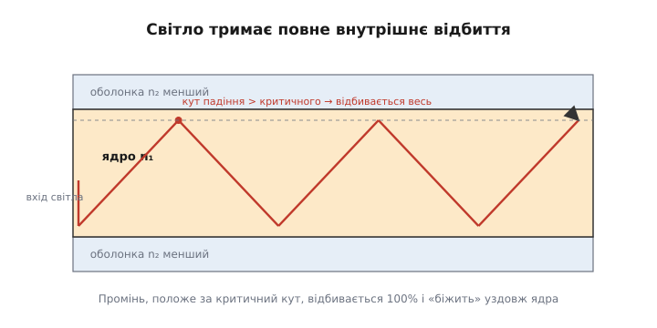
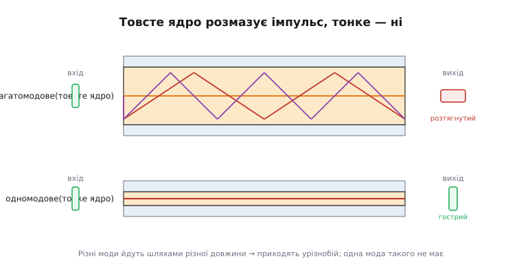
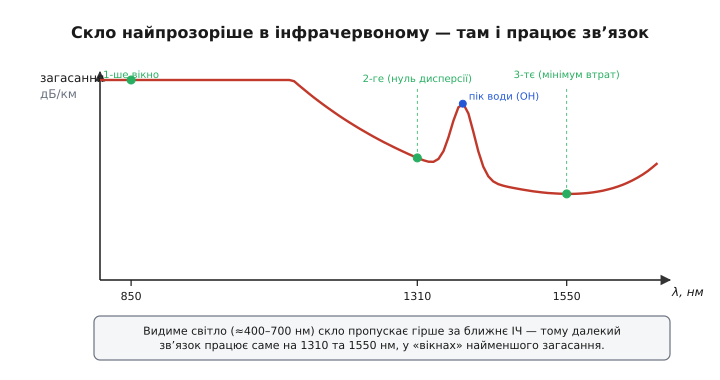

# Оптоволокно

Уявіть, що треба передати фільм у високій роздільності з одного боку океану на інший — за частку секунди й без єдиної помилки. Мідний дріт тут безсилий: на високих швидкостях він гріється, випромінює, ловить наводки й глухне вже за десятки метрів. А тонка скляна волосина, не товща за людський волос, переносить десятки терабітів за секунду через тисячі кілометрів дна. Як скло, крихке й начебто звичайне, перемагає метал у його ж ремеслі — передачі сигналу?

Відповідь починається з простого спостереження, яке кожен бачив у басейні. Пірнувши й глянувши вгору під гострим кутом, ви не побачите неба — поверхня води зсередини виглядає дзеркалом. Світло, що падає на межу «вода → повітря» досить положе, не виходить назовні зовсім, а **повністю** відбивається назад у воду. Це не часткове відблискування, як від шибки, а стовідсоткове повернення без втрат. Саме на цьому ефекті — і ні на чому іншому — тримається все оптоволокно.

### Світло, замкнене у склі

Щоб світло не розбіглося, його треба втримати всередині. Жодне дзеркало для цього не годиться: навіть найкраще металеве дзеркало повертає десь 95–98% світла, а решту з'їдає. Після тисячі відбить від такого дзеркала від променя не лишилося б нічого. Потрібне відбиття **без жодної втрати** — і фізика його дарує безкоштовно.

Світло сповільнюється, коли входить у прозоре середовище; наскільки — каже **показник заломлення** (*refractive index*, від латинського *refringere* — «надломлювати») n: у вакуумі n = 1, у воді ≈ 1.33, у склі ≈ 1.46. На межі двох середовищ промінь заломлюється — змінює напрям, відхиляючись від нормалі тим більше, чим рідше середовище попереду. Та коли світло йде з **щільнішого** середовища (більший n) у **рідше** (менший n) під досить положим кутом, заломленому променю «нема куди подітися»: кут, під яким він мав би вийти, перевищив би 90°. І тоді промінь не виходить узагалі — він повертається назад **на всі сто відсотків**, без утрати енергії. Це й є [повне внутрішнє відбиття](root:ph-waves/total-internal-reflection), а найположіший кут, із якого воно вмикається, звуть **критичним**; задається він простим співвідношенням, де менший показник ділять на більший:

```text
sin θ_c = n₂ / n₁
```

Що ближчі показники двох середовищ, то більший критичний кут — і то вужчий діапазон напрямів, за яких світло замикається всередині.

Тепер зрозуміло, як збудувати світловод. Беремо скляну серцевину — **ядро** (*core*) з показником n₁ — і одягаємо її в шар скла з трохи **меншим** показником n₂ — **оболонку** (*cladding*, від англ. *to clad* — «облицьовувати»). Ядро щільніше за оболонку, тож світло, пущене в ядро досить положе, на кожній зустрічі з межею ядро/оболонка відбивається повністю назад усередину. Промінь не може вийти — він приречений зиґзаґом бігти вздовж ядра, відбиваючись тисячі разів на метр і не втрачаючи на цьому нічого.


*Ядро з вищим показником заломлення n₁ оточене оболонкою з меншим n₂. Промінь, що падає на межу положе за критичний кут, відбивається повністю — і так зиґзаґом «біжить» уздовж ядра без утрат на відбиттях. Саме різниця показників, а не дзеркало, замикає світло всередині.*

Звідси й перша вимога до волокна: ядро мусить мати показник вищий за оболонку. Без цієї різниці немає повного відбиття — світло просто витекло б крізь бічну поверхню. Уся хитрість — у крихітній, на кілька десятих відсотка, різниці n₁ та n₂.

### Чому смуга — велетенська

Тепер до головного питання: чому скляна нитка переносить незрівнянно більше даних, ніж мідь? Відповідь — у **частоті носія**.

Будь-який канал передає тим більше за секунду, чим вища частота його хвилі-носія: груба межа швидкості пропорційна частоті. Радіо Wi-Fi працює на 2.4 чи 5 гігагерцах — мільярдах коливань за секунду. А світло в оптоволокні має частоту близько **200 терагерц** — двісті трильйонів коливань за секунду, у десятки тисяч разів вище за будь-яке радіо. Ця колосальна частота й дає колосальну смугу: на такому носії вміщується незрівнянно більше окремих сигналів за ту саму секунду.

Мідь принципово не може піднятися так високо. Зі зростанням частоти струм у дроті витискається до самої поверхні (скін-ефект), опір росте, дріт перетворюється на антену й випромінює енергію геть, а сусідні пари наводять одна на одну завади. На десятках гігагерців мідь уже задихається. Скло ж переносить світло терагерцового діапазону так само спокійно, як видиме світло проходить крізь шибку.

Є й другий, тонший виграш — **спектральне ущільнення**. Оскільки несуча — це світло, у те саме волокно можна пустити багато променів **різного кольору** (різної довжини хвилі) одночасно. Кожен колір несе свій незалежний потік даних, і вони не заважають один одному, бо це різні хвилі. Так одна нитка веде десятки окремих каналів паралельно, множачи й без того велику смугу ще на порядок.

### Гальванічна розв'язка задарма

У світловоді тече **світло, а не струм**. Скло — діелектрик, ізолятор: між двома кінцями оптичної лінії немає електричного зв'язку взагалі. Це дає властивість, за яку інженери цінують волокно окремо від швидкості, — повну **гальванічну розв'язку** (*galvanic isolation*): жоден струм, жодна різниця потенціалів не передається з боку в бік.

Чому це таке цінне? Бо мідний кабель, з'єднуючи два пристрої, мимоволі сполучає і їхні «землі». Якщо між двома будівлями земля має різний потенціал (а вона майже завжди має), мідною лінією потече **зрівнювальний струм**, що псує сигнал, гріє екран і здатен спалити входи. Удар блискавки поряд наводить у довгій мідній лінії тисячі вольтів — і вони летять прямо в апаратуру. Світло ж не несе ні струму, ні потенціалу: гроза, різниця земель, наводки від силового кабелю поряд — усе це для скляної нитки просто не існує. Тому оптикою з'єднують прилади в шумному цеху, медичну техніку біля пацієнта, давачі на високовольтній підстанції — усюди, де електричний зв'язок між кінцями небезпечний або шкідливий.

> 🔧 **Навіщо це.** Дві ці властивості — терагерцова смуга й цілковита ізоляція — і визначають, де тягнути оптику. Потрібна величезна пропускна здатність на велику відстань (магістраль між містами, дно океану, кабель до серверної) — мідь не тягне, кладуть волокно. Потрібно розірвати електричний зв'язок між кінцями (різні «землі» будівель, гроза, високовольтне оточення, чутливий вимірювальний вхід) — оптична вставка дає розв'язку, якої мідним бар'єром не досягти. А там, де відстань коротка й завад мало (плата, шафа, кімната), мідь і досі дешевша та простіша — оптику беруть не «бо модно», а коли впирається смуга або потрібна ізоляція.

### Одна мода чи багато

Замкнути світло в ядрі — пів справи; треба, щоб сигнал дійшов **неспотвореним**. І тут вирішує товщина ядра.

Якщо ядро товсте (десятки мікрометрів), світло може бігти ним **різними шляхами**. Один промінь іде майже прямо по осі — найкоротший шлях. Інший відбивається круто, зиґзаґом, і проходить помітно довшу дорогу. Кожен такий дозволений шлях називають **модою** (*mode*, від лат. *modus* — «спосіб»). Лихо в тім, що промені різних мод долають різну відстань, тож вийшовши разом одним коротким спалахом, вони приходять **урізнобій** — спалах розпливається в часі. Це **модова дисперсія** (*dispersion*, від лат. *dispergere* — «розсіювати»): той самий імпульс на виході довший, ніж на вході.

Чому це нищить швидкість? Бо дані передаються імпульсами: є спалах — одиниця, нема — нуль. Якщо сусідні імпульси розпливлися й налізли один на одного, приймач уже не розрізнить, де кінчається один біт і починається наступний. Що довша лінія, то сильніше розповзання, то рідше доводиться слати імпульси — і то нижча гранична швидкість. Таке товсте, **багатомодове** (*multimode*) волокно дешеве й прощає недбалу стиковку, але далі кількасот метрів його імпульси розмазуються безнадійно.


*У товстому (багатомодовому) ядрі промені йдуть шляхами різної довжини й приходять урізнобій — короткий вхідний імпульс виходить розтягнутим (модова дисперсія). Тонке (одномодове) ядро лишає світлу єдиний шлях, тож імпульс долітає таким самим гострим. Саме тому далекий зв'язок будують на одномодовому волокні.*

Розв'язок прямий: зробити ядро таким **тонким**, щоб у ньому лишався лише **один** шлях. Коли діаметр ядра наближається до самої довжини хвилі світла (близько 9 мкм проти 1.3 мкм хвилі), фізика дозволяє єдину моду — промінь практично вздовж осі. Зникає вибір шляхів — зникає й модова дисперсія. Це **одномодове** (*single-mode*) волокно: тонше, вибагливіше до стикування, зате саме воно несе сигнал на тисячі кілометрів. Магістралі й океанські кабелі — завжди одномодові; багатомодове лишають для коротких ліній усередині будівлі, де його дешевизна важить більше за дальність.

Модова дисперсія — не єдина. Навіть в одномодовому волокні різні **кольори** світла йдуть трохи з різною швидкістю (хроматична дисперсія), тож і єдиний імпульс помалу розпливається — але цей ефект на порядки слабший і ним керують підбором довжини хвилі та компенсаторами.

### Загасання й вікна прозорості

Світло у волокні слабшає, хоч і повільно. Дві причини. Перша — **розсіяння** на дрібних, застиглих у склі неоднорідностях: воно сильніше для коротких хвиль (тому небо синє з тієї ж причини). Друга — **поглинання**: домішки, надто сліди води (групи OH), ловлять світло на певних довжинах хвиль. Через це скло прозоріше не там, де око сподівається.

Видиме світло (400–700 нм) скло пропускає **гірше**, ніж ближнє інфрачервоне. Найменше загасання припадає на дві-три вузькі смуги в інфрачервоному — їх звуть **вікнами прозорості**. Саме на них і працює зв'язок: близько 1310 нм (тут до того ж хроматична дисперсія майже нульова) і 1550 нм (тут абсолютний мінімум втрат). На 1550 нм найкраще волокно гасить лише ≈ 0.2 децибела на кілометр — це значить, що навіть за 100 км до приймача доходить помітна частка світла, тоді як мідь на потрібній частоті здохла б за сотні метрів.


*Загасання скла найменше не для видимого світла, а для ближнього інфрачервоного. Розсіяння росте на коротких хвилях, поглинання води дає пік близько 1383 нм, а між ними лежать «вікна» — 850, 1310 та 1550 нм. Далекі лінії будують на 1550 нм, де втрати падають до ≈ 0.2 дБ/км.*

Низьке загасання — третя причина переваги волокна: рідкі підсилювачі на величезних відстанях. Океанський кабель ставить регенератори світла раз на ≈ 50–100 км — і цього досить, бо за такий перегін сигнал майже не слабне.

### Числовий приклад: апертура захоплення

Лишилося питання практика: під яким кутом світло взагалі **зайде** у волокно й там утримається? Промінь, спрямований у ядро надто круто, впаде на бічну межу занадто прямовисно — положе за критичний кут не вийде — і вискочить крізь оболонку, не давши повного відбиття. Тож волокно приймає лише світло, що влітає в його торець усередині певного **конуса**. Півкут цього конуса описує **числова апертура** (*numerical aperture*, NA) — міра того, наскільки широко волокно «зачерпує» світло:

```text
NA = √(n₁² − n₂²)
```

Тут n₁ — показник ядра, n₂ — оболонки. Чим більша різниця показників, тим ширший приймальний конус. Порахуймо для типового волокна.

**Приклад (числова апертура й кут прийому).** Ядро n₁ = 1.4690, оболонка n₂ = 1.4570. Знайдемо NA й максимальний півкут конуса прийому в повітрі (n₀ = 1), де sin θ_max = NA / n₀:

```text
NA = √(1.4690² − 1.4570²)
   = √(2.15796 − 2.12285)
   = √(0.03511)
   = 0.1874

θ_max = arcsin(0.1874 / 1) ≈ 10.8°
```

Отже, це волокно ловить світло, що влітає в торець у межах ≈ 10.8° від осі; усе, що крутіше, не втримається. Невелика різниця показників (тут лише ≈ 0.8%) дає вузький конус — звідси й вимога до точності стикування одномодових волокон: торці треба звести майже ідеально співвісно, бо «промах» по куту чи зміщенню виводить світло за межі прийому й додає втрат.

У прошивці цю саму формулу зручно тримати під рукою — наприклад, прикинути кут прийому для вибраного волокна:

:::tabs
```c
#include <math.h>

// Числова апертура й максимальний кут прийому (у повітрі), градуси
float acceptance_angle_deg(float n_core, float n_clad) {
    float na = sqrtf(n_core * n_core - n_clad * n_clad);
    return asinf(na) * 180.0f / 3.14159265f;   // n0 = 1 (повітря)
}
// acceptance_angle_deg(1.4690f, 1.4570f) -> ~10.8
```
```py
import math

# Числова апертура й максимальний кут прийому (у повітрі), градуси
def acceptance_angle_deg(n_core, n_clad):
    na = math.sqrt(n_core * n_core - n_clad * n_clad)
    return math.degrees(math.asin(na))          # n0 = 1 (повітря)

# acceptance_angle_deg(1.4690, 1.4570) -> ~10.8
```
```js
// Числова апертура й максимальний кут прийому (у повітрі), градуси
function acceptanceAngleDeg(nCore, nClad) {
    const na = Math.sqrt(nCore * nCore - nClad * nClad);
    return Math.asin(na) * 180 / Math.PI;       // n0 = 1 (повітря)
}
// acceptanceAngleDeg(1.4690, 1.4570) -> ~10.8
```
:::

### Де працює оптоволокно

Складімо причини докупи. Світло замикає в ядрі **повне внутрішнє відбиття** — відбиття без утрат, якого не дасть жодне дзеркало. Терагерцова частота носія дає **смугу**, недосяжну для міді. Скло-діелектрик дає **гальванічну розв'язку** задарма. Тонке одномодове ядро прибирає **модову дисперсію**, а вікна прозорості в інфрачервоному тримають **загасання** мізерним. Кожна з цих властивостей випливає з тієї самої фізики світла в склі.

Тому оптоволокно стало хребтом усієї далекої передачі даних: магістралі між містами, кабелі по дну океанів, що зшивають континенти, підведення інтернету до будинків (відоме як «волокно до дому»), з'єднання серверів усередині дата-центрів. Там, де треба багато даних далеко, або де електричний зв'язок між кінцями небезпечний, скляна волосина не має рівних. А коротку дешеву лінію в межах шафи чи плати, де смуги й ізоляції вистачає, досі веде звичайна мідь — кожне середовище на своєму місці.
