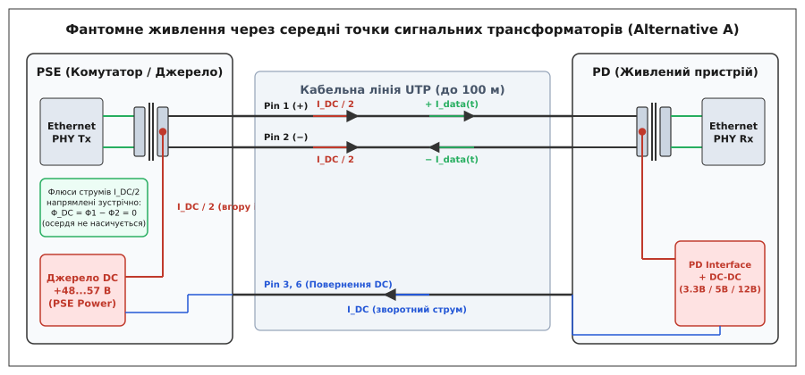
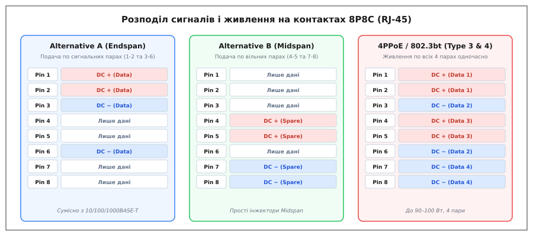
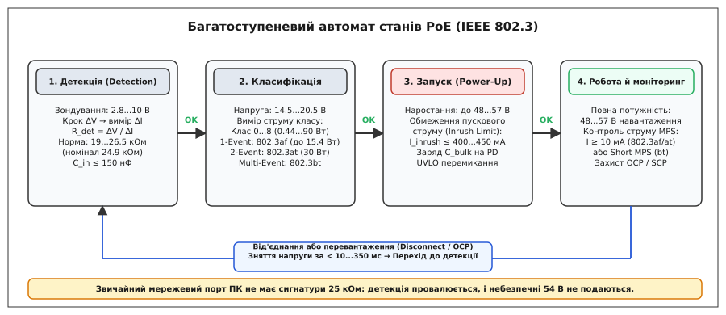

# PoE: живлення по витій парі

<preknowlist>
- [Вита пара](topic:com-medium/twisted-pair) — звивання жил у пари, симетрія й диференційне передавання сигналу.
- [UTP-кабель](topic:com-medium/utp-cable) — конструкція кабелю, категорії Cat5e/Cat6A та опір мідних жил.
- [Диференційна передача сигналу](topic:hw-analog/differential-signaling) — відкидання синфазного шуму та робота сигнальних трансформаторів.
- [Закон Ома](topic:hw-analog/ohms-law) — напруга, струм, спад напруги й опір провідника.
- [Джоулеве тепло](topic:ph-electromagnetism/joule-heating) — виділення теплової потужності на активному опорі лінії.
</preknowlist>

Коли цифрову камеру відеоспостереження або бездротову точку доступу монтують під стелею високого складу, на вуличній щоглі чи всередині вентиляційної шахти на відстані вісімдесяти метрів від серверної стійки, підведення окремої силової лінії 230 В перетворюється на головний кошторисний бар'єр. Потрібно прокладати броньовані силові кабелі у вибухобезпечних рукавах, встановлювати локальні розетки, монтувати понижувальні блоки живлення та залучати електриків із допуском до високовольтних робіт. Якщо ж спробувати просто подати постійну напругу по вільних мідних жилах мережевого кабелю, виникають дві протилежні небезпеки: подача високої напруги на випадково увімкнений звичайний комп'ютер спалить його мережевий порт, а опір тонких стаметрових провідників викличе такий спад напруги й виділення тепла, що навантаження взагалі не запуститься.

Технологія **PoE** (англ. *Power over Ethernet* — живлення через Ethernet) вирішує це завдання, поєднуючи передавання високошвидкісних цифрових даних та електроживлення потужністю до 90–100 Вт в одному стандартному восьмижильному кабелі [UTP](topic:com-medium/utp-cable) на повну дистанцію 100 метрів. Це досягається завдяки використанню принципу фантомного живлення через середні точки сигнальних трансформаторів та суворому багатоступеневому апаратному рукостисканню, яке унеможливлює подачу небезпечної напруги на непідготовлені пристрої.

## Фантомне живлення: як постійний струм ділить дріт із гігабітним сигналом

Головне фізичне питання технології — як пропустити амперний постійний струм живлення крізь ті самі мідні жили, якими одночасно передаються високочастотні цифрові імпульси зі спектром до 100–500 МГц, не спотворивши дані й не спаливши приймачі [PHY](topic:com-medium/ethernet-link-phy).

Основою для цього слугує схема **фантомного живлення** (англ. *phantom power*), запозичена з професійної студійної аудіотехніки. Її робота тримається на властивостях симетричної [витої пари](topic:com-medium/twisted-pair) та імпульсних сигнальних трансформаторів (Ethernet Magnetics), які обов'язково встановлюються на кожному порту мережевого обладнання для забезпечення [гальванічної розв'язки](topic:hw-components/galvanic-isolation).


*Фантомне живлення через середні точки сигнальних трансформаторів (Alternative A). Постійний струм I_DC ділиться порівну між жилами пари (по I_DC/2). У трансформаторі ці струми течуть у протилежних напрямках відносно осердя, тому їхні магнітні потоки Φ1 і Φ2 взаємно віднімаються (Φ_DC = 0), запобігаючи магнітному насиченню фериту. Водночас високочастотний диференційний сигнал I_data(t) утворює замкнений контур у вторинній обмотці та безперешкодно транслюється на вхід приймача PHY.*

Розглянемо проходження струмів крізь один сигнальний трансформатор:

1. **Диференційний інформаційний сигнал (AC).** Корисні цифрові дані передаються як високочастотна різниця потенціалів між двома жилами пари ([диференційна пара](topic:hw-analog/differential-signaling)). Струм даних `I_data(t)` виходить із виводу PHY, тече по верхній половині первинної обмотки, проходить по першій жилі кабелю, повертається по другій жилі й замикається крізь нижню половину обмотки. В обох половинках обмотки інформаційний струм тече в одному й тому самому напрямку по колу осердя, створюючи сумарний змінний магнітний потік `Φ_AC(t)`, який транслюється у вторинну обмотку приймача.
2. **Синфазне живлення (DC).** Постійна напруга живлення (+48...57 В) подається не на крайні виводи обмотки, а в її **середню точку** (англ. *Center Tap*). У цій точці струм живлення `I_DC` розгалужується на дві абсолютно рівні частини: струм `I_DC / 2` тече вгору через верхню половину обмотки до контакту 1, а струм `I_DC / 2` тече вниз через нижню половину до контакту 2.

Оскільки струми в двох половинках обмотки течуть у протилежних напрямках відносно феритового осердя, створені ними постійні магнітні поля мають однаковий модуль, але протилежний знак:

```
Φ_DC = Φ_top - Φ_bottom
= (I_DC / 2) · N_turns - (I_DC / 2) · N_turns [магнітні потоки двох напівобмоток]
= 0                                           [взаємна компенсація постійних полів]
```

Сумарний постійний магнітний потік у трансформаторі дорівнює нулю. Феритове осердя не входить у магнітне насичення, його динамічна магнітна проникність не падає, і трансформатор зберігає повну індуктивність (не менше 350 мкГн за стандартом), необхідну для передавання інформаційних імпульсів без спотворень форми сигналу.

На приймальному боці кабелю стоїть такий самий вхідний сигнальний трансформатор. Постійні струми `I_DC / 2`, що прийшли по двох жилах, стікаються у вторинній обмотці до її середньої точки, звідки сумарний струм `I_DC` знімається і спрямовується до імпульсного стабілізатора живлення. Для диференційного приймача PHY ця постійна напруга є строго синфазною (однаковою на обох жилах), тому вхідний каскад її повністю ігнорує.

> ⚠️ **Вимога до симетрії опору жил.** Компенсація магнітних потоків працює ідеально лише за умови, що опори двох жил пари суворо однакові. Якщо через виробничий дефект або поганий контакт роз'єму опір однієї жили відрізнятиметься від іншої (асиметрія опору `ΔR > 3%`), струм розділиться нерівномірно. Виникне залишковий постійний струм різниці `ΔI`, який створить постійне підмагнічування осердя. Це зменшить індуктивність трансформатора, викликавши спотворення прямокутних імпульсів і зростання кількості бітових помилок на гігабітних швидкостях.

## Архітектура системи: джерела PSE та споживачі PD

Стандарт IEEE 802.3 чітко розділяє обладнання PoE на дві функціональні ролі:

```general
[ Джерело PSE ] ──────── (кабель UTP до 100 м) ────────► [ Споживач PD ]
Power Sourcing Equipment                                   Powered Device
(комутатор або інжектор)                                   (камера, AP, телефон)
```

### 1. Джерело живлення — PSE (Power Sourcing Equipment)
Обладнання, яке формує постійну напругу, зондує кабельну лінію, класифікує підключений пристрій, контролює ліміти споживання струму та миттєво знімає напругу при від'єднанні кабелю або короткому замиканні.

За способом фізичного розміщення джерела PSE діляться на два типи:
* **Endspan (кінцеве джерело):** функція PoE інтегрована безпосередньо в мережевий комутатор (*PoE Switch*). Кожен порт комутатора має власний контролер живлення, що дозволяє керувати подачею енергії програмно, знімати телеметрію струму, перезавантажувати завислі пристрої за розкладом або вимикати живлення непріоритетних портів при переході на резервні батареї.
* **Midspan (проміжне джерело / PoE-інжектор):** окремий автономний модуль, який вмикається в розрив кабелю між звичайним (non-PoE) комутатором та кінцевим пристроєм. Інжектор пропускає інформаційні сигнали наскрізь, підмішуючи в кабель постійну напругу від власного силового блока. Проміжні джерела дозволяють живити окремі PoE-пристрої без заміни всієї комутаційної інфраструктури будівлі.

### 2. Живлений пристрій — PD (Powered Device)
Кінцевий споживач електроенергії: IP-камера, бездротова точка доступу, VoIP-телефон, мережевий гучномовець, термінал контролю доступу, датчик інтернету речей чи керований світлодіодний світильник. 

Живлений пристрій містить спеціалізований контролер узгодження, схему випрямлення, силовий ключ плавного пуску та ізольований імпульсний перетворювач напруги (DC-DC), який трансформує вхідні 48–57 В у стабілізовані низьковольтні рівні 3.3 В, 5 В або 12 В, необхідні для роботи мікропроцесорів та сенсорів.

## Методи подачі напруги: Alternative A, Alternative B та 4PPoE

Стандарт витої пари передбачає вісім ізольованих провідників (чотири скручені пари). Залежно від конструкції джерела живлення та стандарту швидкості Ethernet, живлення може подаватися трьома різними способами.


*Розподіл контактів роз'єму 8P8C (RJ-45) для трьох методів подачі живлення. Alternative A використовує інформаційні пари 1-2 та 3-6 (фантомне живлення). Alternative B задіює вільні пари 4-5 та 7-8. Режим 4PPoE (IEEE 802.3bt) подає струм по всіх чотирьох парах одночасно, забезпечуючи потужність до 90–100 Вт і вдвічі знижуючи втрати на опір шлейфу.*

### 1. Alternative A (Mode A)
Живлення подається по **сигнальних парах** (контакти 1-2 та 3-6) через середні точки трансформаторів. 
* У мережах 10BASE-T та 100BASE-TX цими парами передаються пакети даних (Tx та Rx).
* Цей метод є основним для комутаторів Endspan, оскільки він дозволяє живити пристрої навіть по застарілих двопарних кабельних трасах.
* Завдяки обов'язковій наявності діодних мостів на вході PD, полярність напруги може бути довільною: пара 1-2 може бути як плюсом, так і мінусом.

### 2. Alternative B (Mode B)
Живлення подається по **додаткових (вільних) парах** (контакти 4-5 та 7-8).
* У стандартах 10BASE-T і 100BASE-TX ці жили взагалі не використовуються для передавання даних, тому напруга подається безпосередньо на контакти роз'єму без необхідності пропускати її крізь сигнальні трансформатори.
* Зазвичай контакти 4 і 5 підключаються до позитивного полюса джерела (+48 В), а контакти 7 і 8 — до негативного (0 В / Return).
* Цей метод традиційно реалізується в простих і недорогих проміжних інжекторах Midspan.
* У мережах 1000BASE-T (Gigabit Ethernet) та вище, де для передавання даних задіяні всі чотири пари, Alternative B також використовує середні точки трансформаторів пар 4-5 і 7-8.

### 3. Чотирипарне живлення (4-Pair PoE / 4PPoE)
Для передавання великої потужності (від 60 до 90–100 Вт) у стандарті IEEE 802.3bt струм подається **по всіх чотирьох витих парах одночасно**.
* Пари 1-2 та 4-5 об'єднуються паралельно для прямого струму (+).
* Пари 3-6 та 7-8 об'єднуються паралельно для зворотного струму (−).
* Завдяки паралельному з'єднанню еквівалентний опір кабельної лінії зменшується вдвічі, що знижує теплові втрати в кабелі на 50% при тому самому струмі або дозволяє подвоїти передавану потужність без перегріву дротів.

Згідно зі стандартом, джерело PSE має право підтримувати лише один із методів (Alternative A або Alternative B), але **кожен живлений пристрій PD зобов'язаний підтримувати обидва методи та будь-яку полярність напруги**. Це гарантує стовідсоткову сумісність: будь-який сертифікований PD-пристрій гарантовано працюватиме з будь-яким комутатором або інжектором.

Детальний аналіз схемотехніки випрямних мостів та внутрішніх вузлів керування наведено у вставці [Схемотехніка PD-інтерфейсу та гальванічна розв'язка](topic:com-medium/poe/comp-pd-interface.md).

## Еволюція стандартів: від 15.4 Вт до 90–100 Вт

Зростання енергоспоживання мережевого обладнання спонукало IEEE послідовно розробити три покоління стандартів, які поділяють пристрої на чотири типи (*Type 1–4*):

```general
Покоління стандартів IEEE 802.3 PoE:

Параметр                802.3af (Type 1)   802.3at (Type 2)   802.3bt (Type 3)   802.3bt (Type 4)
Назва                   PoE                PoE+               PoE++ / 4PPoE      PoE++ / High Power
Рік прийняття           2003               2009               2018               2018
Кількість пар           2 пари             2 пари             4 пари (або 2)     4 пари
Напруга PSE             44.0...57.0 В      50.0...57.0 В      50.0...57.0 В      52.0...57.0 В
Напруга на PD           37.0...57.0 В      42.5...57.0 В      42.5...57.0 В      41.1...57.0 В
Максимальний струм      350 мА             600 мА             600 мА на пару     960 мА на пару
Потужність джерела PSE  15.4 Вт            30.0 Вт            60.0 Вт            90.0...100.0 Вт
Гарантована потужність  12.95 Вт           25.5 Вт            51.0 Вт            71.3...90.0 Вт
на вході пристрою (PD)
Мінімальна категорія    Cat3               Cat5e              Cat5e              Cat5e (рек. Cat6A)
```

Різниця між потужністю джерела (наприклад, 30 Вт у PoE+) та гарантованою потужністю на вході навантаження (25.5 Вт) — це запас на теплові втрати на активному опорі 100-метрової кабельної лінії за найгірших умов експлуатації.

### Односигнатурні та двосигнатурні пристрої (Single vs Dual Signature)
У стандарті IEEE 802.3bt введено два типи топології приймачів:
* **Single-Signature PD (односигнатурний):** пристрій має один спільний контролер детекції та класифікації для всіх чотирьох пар. Обидві пари пар живлять спільне внутрішнє навантаження. Це стандартне рішення для більшості потужних точок доступу та комп'ютерів.
* **Dual-Signature PD (двосигнатурний):** пари 1-2/3-6 та пари 4-5/7-8 мають повністю розділені, незалежні контролери зі своїми сигнатурними резисторами. Комутатор бачить такий кабель як два окремі незалежні порти живлення. Це дозволяє створювати пристрої зі змішаним навантаженням: наприклад, вулична поворотна PTZ-камера, де перший канал (30 Вт) живить чутливу електроніку та відеосенсор, а другий ізольований канал (45 Вт) вмикає електродвигуни повороту та потужний інфрачервоний прожектор за потреби.

Історію створення пропрієтарного протоколу Cisco Inline Power, боротьбу виробників та стандартизацію описано у вставці [Від Cisco Inline Power до 90-ватного 802.3bt](topic:com-medium/poe/hist-poe-origins.md).

## Багатоступеневий процес підключення: як працює автомат станів

Найважливіша вимога безпеки PoE — **ніколи не подавати 48–57 В у лінію наосліп**. Якщо користувач увімкне в порт патч-корд від звичайного ноутбука, вимірювального приладу або комутатора без підтримки PoE, висока напруга негайно проб'є вторинні кола мережевої карти.

Тому контролер PSE реалізує жорсткий апаратний автомат станів, що складається з чотирьох послідовних фаз.


*Багатоступеневий автомат станів підключення PoE. Фаза 1 (Detection) перевіряє наявність сигнатури 25 кОм низькою напругою. Фаза 2 (Classification) визначає клас потужності навантаження через вимір струму. Фаза 3 (Startup) плавно нарощує напругу до 48–57 В з обмеженням пускового струму Inrush. Фаза 4 (Monitoring) безперервно контролює струм утримання MPS і миттєво знімає напругу при розриві лінії або короткому замиканні.*

### Фаза 1. Детекція підключення (Detection)
Комутатор генерує в лінію два низьковольтні імпульси постійної напруги в безпечному діапазоні **від 2.8 В до 10.0 В** із різницею напруг `ΔV ≥ 1.0 В` (наприклад, 4.0 В та 8.0 В).

За цими двома точками контролер вимірює зміну струму `ΔI` та обчислює диференційний опір навантаження:

```
R_det = ΔV / ΔI
= (V2 - V1) / (I2 - I1)
```

Двохточковий диференційний вимір дозволяє повністю відкинути нелінійний спад напруги на діодах вхідного випрямного моста пристрою PD.

Критерії успішної детекції за стандартом IEEE 802.3:
* **Опір сигнатури:** строго в межах **19.0 кОм ≤ R_det ≤ 26.5 кОм** (номінальне значення — високоточний резистор **24.9 кОм ±1%**).
* **Вхідна ємність:** `C_in ≤ 150 нФ` (захищає від помилкового вмикання на лінії з великою паразитною ємністю).

Якщо до порту підключено звичайну мережеву карту (де опір термінації становить 75 Ом, або присутнє коротке замикання обмоток), обчислений опір виявиться меншим за 19 кОм. Якщо кабель висить у повітрі — опір прямує до нескінченності. В обох випадках детекція вважається проваленою, і процес зупиняється. Напруга вимикається, а комутатор повторює спробу зондування через кожні 0.5–2 секунди.

### Фаза 2. Класифікація потужності (Classification)
Після успішного знаходження сигнатури 25 кОм джерело PSE зобов'язане з'ясувати, скільки саме ватів потрібно цьому конкретному пристрою, щоб зарезервувати відповідний бюджет у своєму блоці живлення.

Комутатор піднімає напругу на порту до рівня **14.5–20.5 В**. У відповідь контролер PD вмикає внутрішнє каліброване джерело струму, споживаючи фіксований струм класифікації:

```general
Класифікація пристроїв за стандартом IEEE 802.3:

Клас      Струм класифікації  Потужність PD      Потужність PSE     Тип стандарту
Class 0   0...4 мА            0.44...12.95 Вт    15.4 Вт            Type 1 (дефолт)
Class 1   9...12 мА           0.44...3.84 Вт     4.0 Вт             Type 1
Class 2   17...20 мА          3.84...6.49 Вт     7.0 Вт             Type 1
Class 3   26...30 мА          6.49...12.95 Вт    15.4 Вт            Type 1
Class 4   36...44 мА          12.95...25.5 Вт    30.0 Вт            Type 2 (PoE+)
Class 5   36...44 мА (імпульс) 25.5...40.0 Вт    45.0 Вт            Type 3 (PoE++)
Class 6   36...44 мА (імпульс) 40.0...51.0 Вт    60.0 Вт            Type 3 (PoE++)
Class 7   36...44 мА (імпульс) 51.0...62.0 Вт    75.0 Вт            Type 4 (PoE++)
Class 8   36...44 мА (імпульс) 62.0...71.3 Вт    90.0 Вт            Type 4 (PoE++)
```

Стандарти використовують кілька методів класифікації:
* **Single-Event (одноподійна):** один імпульс 14.5–20.5 В. Застосовується для пристроїв Type 1 (класи 0–3).
* **Two-Event (двоподійна / Ping-Pong):** комутатор видає два імпульси напруги 14.5–20.5 В, розділені скиданням напруги до рівня 7–9 В (Mark Region). Якщо пристрій підтримує PoE+ (Class 4), він відповідає струмом 40 мА на обидва імпульси. Це підтверджує взаємну здатність обох сторін працювати на потужності 30 Вт.
* **Multiple-Event (багатоподійна):** у стандарті 802.3bt комутатор генерує до п'яти послідовних імпульсів класифікації для опитування класів 5–8.
* **Autoclass (автокласифікація 802.3bt):** джерело PSE вимірює реальний фізичний струм навантаження одразу після запуску пристрою. Якщо камера класу 6 (60 Вт) у реальності споживає лише 22 Вт, комутатор автоматично звільняє неробочі 38 Вт потужності силового блока для інших портів.
* **Програмне узгодження LLDP (Data Link Layer):** після завершення апаратного запуску пристрій обмінюється з комутатором кадрами канального протоколу [LLDP](topic:com-transport/ethernet-frame) зі спеціальними інформаційними блоками TLV (*Organizationally Specific PoE TLVs*). Це дозволяє пристрою динамічно запитувати живлення з точністю до 0.1 Вт залежно від поточного режиму роботи.

### Фаза 3. Запуск і обмеження пускового струму (Power-Up / Inrush)
Після класифікації комутатор плавно підвищує вихідну напругу до повного номінального рівня **44–57 В** (для Type 1) або **50–57 В** (для Type 2–4).

Головна небезпека цього етапу — заряд великих конденсаторів фільтра (`C_bulk` 100–470 мкФ) на вході перетворювача PD. Стрибок струму міг би викликати просідання напруги джерела. 

Тому на етапі запуску (перші 50–75 мс) струм примусово обмежується:
* Контролер PSE обмежує максимальний вихідний струм на рівні `400...450 мА`.
* Внутрішній польовий транзистор (Hot-Swap Pass Switch) на боці PD плавно відкривається, забезпечуючи контрольовану швидкість наростання напруги `dv/dt`.
* Імпульсний стабілізатор навантаження залишається заблокованим сигналом UVLO (блокування при зниженні напруги) доти, доки конденсатор фільтра повністю не зарядиться до напруги вище 38–42 В.

### Фаза 4. Штатна робота, моніторинг та сигнал утримання (MPS)
Після виходу на робочий режим комутатор постійно вимірює вихідний струм:

```general
                       [ Контроль струму в робочому режимі ]
                                        │
           ┌────────────────────────────┼────────────────────────────┐
           ▼                            ▼                            ▼
   I < I_min (обрив)           I_min ≤ I ≤ I_max             I > I_cut (перевантаження)
   Розрив зв'язку               Штатна робота                Аварійне вимкнення OCP
   Зняття 54 В за 300...400 мс                               Зняття напруги за < 1...10 мс
```

1. **Захист від перевантаження (OCP / Short Circuit Protection):** якщо струм перевищує граничний ліміт класу або виникає коротке замикання, живлення вимикається за час менше 10 мс.
2. **Сигнал утримання живлення (MPS, Maintain Power Signature):** щоб джерело знало, що прилад усе ще увімкнений у розетку, споживач зобов'язаний споживати мінімальний струм утримання:
   * **Класичний DC MPS (802.3af/at):** пристрій повинен споживати струм не менше **10 мА** безперервно або імпульсами тривалістю не менше 75 мс кожні 325 мс. Якщо струм падає нижче 5 мА на час понад 300–400 мс (кабель висмикнули з гнізда), комутатор негайно знеструмлює порт.
   * **Енергоощадний Short MPS (802.3bt):** для пристроїв, що перебувають у глибокому сні (Standby), вимогу скорочено до імпульсу струму амплітудою від **7 мА** тривалістю всього **7 мс кожні 318 мс**. Це знизило чергове енергоспоживання у сплячому режимі в десять разів — з 200–500 мВт до менш ніж 20 мВт.

## Нагрівання кабельних трас, опір петлі та вибір категорії кабелю

Передавання високої потужності низьковольтним постійним струмом неминуче супроводжується втратами на опір міді. Згідно з законом Джоуля-Ленца, потужність теплових втрат у кабелі становить:

```
P_loss = I^2 · R_loop
```

Опір шлейфу постійному струму `R_loop` для 100-метрової лінії залежить від діаметра жили (калібру AWG) та кількості задіяних пар:
* Для кабелю **Cat5e (24 AWG)** опір жили становить близько 9.38 Ом / 100 м, а опір 2-парного шлейфу сягає `R_loop ≈ 18.8...20.0 Ом`.
* Для кабелю **Cat6A (23 AWG)** використовуються товстіші жили (діаметр 0.57 мм проти 0.51 мм у Cat5e), що знижує опір жили до 7.4 Ом / 100 м, а опір шлейфу — до `R_loop ≈ 14.0...15.0 Ом`.

Якщо при передаванні 25.5 Вт (PoE+) струм становить 0.6 А, то в кабелі Cat5e у вигляді тепла розсіюється:

```
P_loss = (0.6 А)^2 · 20.0 Ом
= 0.36 · 20.0                 [піднесення струму до квадрата]
= 7.2 Вт                      [теплова потужність втрат на 100 м лінії]
```

Для окремого відкритого кабелю розсіювання 7 Вт на 100 метрах довжини майже непомітне (температура зростає лише на 1–2 °C). Проте в сучасних офісних і дата-центрових будівлях кабелі вкладаються в **щільні круглі джгути по 24, 48 або 96 штук** усередині закритих перфорованих лотків або гофрованих пластикових труб під перекриттями.

Усередині великого джгута тепло не має вільного виходу назовні. Внутрішні кабелі гріють один одного:
1. **Перегрів ядра джгута:** згідно з даними стандарту TIA TSB-184-A, у джгуті з 96 кабелів Cat5e під навантаженням PoE+ температура в центрі пучка зростає на **+15...25 °C** відносно кімнатної, а під навантаженням 802.3bt Type 4 (90 Вт) — на **+35...45 °C**!
2. **Зростання опору міді:** мідь має додатний температурний коефіцієнт опору `α ≈ +0.00393 / °C`. При нагріванні від 20 °C до 60 °C опір провідника збільшується на 15.7%, що ще більше збільшує втрати напруги.
3. **Збільшення високочастотного загасання:** нагрівання ізоляції та міді збільшує втрати високочастотного сигналу (*Insertion Loss*) приблизно на 0.4% на кожен градус вище 20 °C. Це вимагає обов'язкового скорочення максимальної довжини кабельної траси зі 100 м до 75–85 м за високих температур (температурний дерейтинг, *Thermal Derating*).

Математичне виведення формул теплового балансу, диференційного опору та розрахунків джгутів наведено у вставці [Розрахунок втрат, опору петлі та нагріву кабельних джгутів PoE](topic:com-medium/poe/math-cable-heating.md).

## Управління бюджетом живлення та динамічний розподіл потужності

Кожен керований PoE-комутатор має обмежений сумарний бюджет силового блока живлення (*PoE Power Budget*), наприклад 370 Вт для 24-портового комутатора. Якщо всі 24 порти увімкнуть пристрої PoE+ (по 30 Вт на порт), сумарний попит складе `24 · 30 Вт = 720 Вт`, що майже вдвічі перевищує фізичні можливості силового блока.

Для запобігання аварійному вимкненню контролери комутаторів використовують два механізми управління бюджетом:

### 1. Статичний бюджет за класом (Class-Based Allocation)
Комутатор резервує за кожним портом максимальну теоретичну потужність за його класом (наприклад, 15.4 Вт для Class 3 або 30 Вт для Class 4). Коли вільний залишок бюджету стає меншим за клас наступного підключеного пристрою, комутатор відмовляє в подачі живлення на цей порт, навіть якщо попередні підключені пристрої в реальності споживають лише 20% від заявленого ліміту.

### 2. Динамічний бюджет за споживанням (Consumption-Based Allocation) та LLDP
Комутатор резервує потужність не за класом, а за реальним виміряним фізичним струмом порту або за даними протоколу [LLDP](topic:com-transport/ethernet-frame):
* Пристрій завантажується на базовій потужності.
* Після підняття лінку канального рівня пристрій надсилає комутатору повідомлення LLDP із точним запитом: «Мені потрібно рівно 8.4 Вт».
* Комутатор виділяє рівно 8.4 Вт (плюс фіксований кабельний запас 1.2 Вт) замість «сліпих» 15.4 Вт.
* Це дозволяє збільшити кількість одночасно підключених точок доступу та камер на одному комутаторі майже в півтора-два рази без ризику перевантаження.

### 3. Пріоритетизація портів при аваріях живлення
Для кожного порту адміністратор задає рівень пріоритету (*Critical*, *High*, *Low*). Якщо зовнішнє електропостачання будівлі вимикається, і комутатор переходить на аварійні акумулятори ДБЖ, контролер PoE автоматично вимикає порти з низьким пріоритетом (розумні лампи освітлення та інформаційні панелі), зберігаючи безперервну роботу критичних вузлів (камери безпеки, турнікети СКУД та телефони екстреного зв'язку).

> 🔧 **Навіщо це.** Під час проєктування та практичного монтажу мереж із підтримкою PoE слід дотримуватися трьох суворих інженерних правил:
>
> 1. **Категорична заборона на кабелі CCA (обміднений алюміній).** У дешевих кабелях *Copper-Clad Aluminum* використовують алюмінієве ядро. Алюміній має в 1.6 раза вищий опір і набагато нижчу температуру плавлення. Під струмом PoE+ такий дріт розжарюється, викликає циклічні перезавантаження пристроїв через просідання напруги, плавить пластикову оболонку й нерідко спричиняє пожежі всередині кабельних каналів. Для PoE допустимий **лише кабель із 100% суцільної електротехнічної міді (Solid Bare Copper)** калібру 23 AWG (Cat6 / Cat6A) або 24 AWG (Cat5e).
> 2. **Захист від дугового зносу контактів роз'єму (Spark Erosion).** Якщо висмикнути патч-корд із гнізда RJ-45 під час передавання потужності 90 Вт (струм близько 1 А), у момент розмикання між контактом вилки та гнізда спалахує мікроскопічна електрична дуга. Температура дуги випаровує шар золотого напилення (товщиною 50 мікродюймів) на контакті. Щоб запобігти цьому, якісні роз'єми за стандартом IEC 60512-99-002 мають особливу геометрію: точка первинного механічного розмикання (де горить іскра) геометрично відокремлена від кінцевої точки контакту, де провідник лежить у замкненому стані.
> 3. **Обмеження розміру джгутів.** При монтажі ліній PoE Type 3 та Type 4 (60–90 Вт) кабельники формують пучки не більше ніж по 24–48 кабелів, розділяючи їх вентиляційними проміжками, щоб запобігти кумулятивному тепловому розгону в закритих трасах.
