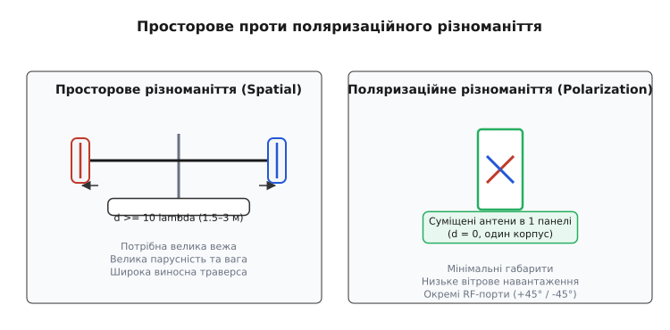
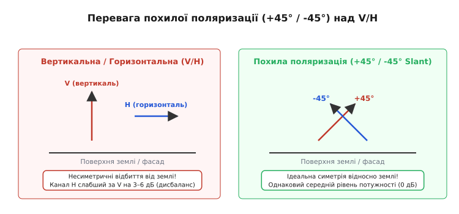
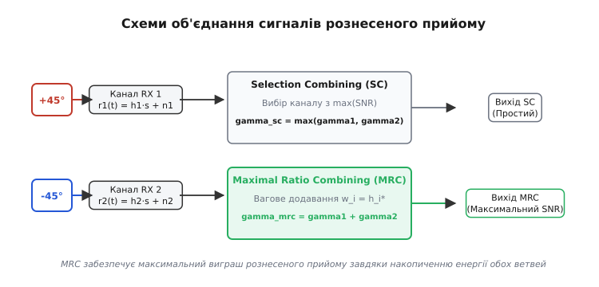
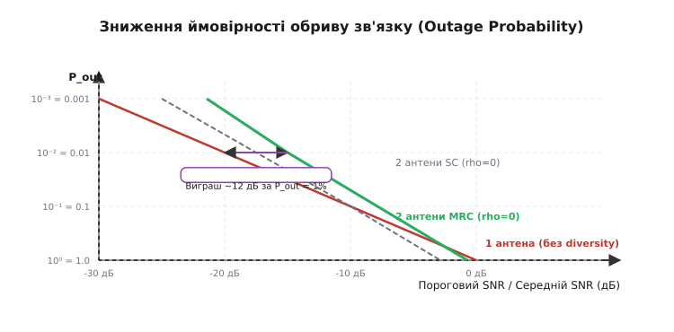

# Поляризаційне різноманіття

<preknowlist>
- [Поляризація антени](root:com-medium/antenna-polarization) — як орієнтація антени задає вектор E хвилі та чим загрожує неузгодження.
- [Загасання в багатопроменевому каналі](root:com-medium/multipath-fading) — інтерференція відбитих хвиль, Rayleigh-загасання та замирання сигналу.
- [Бюджет радіолінії](root:com-medium/link-budget) — запас потужності та ймовірність обриву зв'язку.
</preknowlist>

На даху висотки в центрі мегаполіса стоїть базова станція стільникового зв'язку діапазону 1800 МГц. Через багатопроменеве відбиття радіохвиль від будинків і машин рівень сигналу на приймачі постійно зазнає глибоких замирань амплітуди — локальних провалів потужності на 20–30 дБ (так зване [загасання Релея](root:com-medium/fading-statistics)). Щоб подолати ці провали за допомогою класичного просторового рознесення, дві приймальні антени довелося б розсунути вздовж вежі на відстань 10–20 довжин хвилі, тобто на 1.5–3 метри одна від одної. На тісному даху з жорсткими обмеженнями на оренду площі й вітрове навантаження розгортати такі громіздкі ферми нереально. Але якщо розмістити дві схрещені антени з ортогональними поляризаціями в **одному-єдиному компактному корпусі**, можна отримати аналогічне підвищення надійності лінії взагалі без збільшення габаритів. Цей метод має назву **поляризаційне різноманіття** (*polarization diversity*, від латинського *polus* — полюс, вісь та *diversus* — різний, повернутий убік).

### Фізичний механізм раскореляції поляризаційних каналів

Чому дві антени, що знаходяться в одній точці простору, взагалі здатні бачити «різні» радіоканали? Відповідь криється у фізиці багатопроменевого розсіювання електромагнітної хвилі в складному середовищі.

Коли випромінена передавачем електромагнітна хвиля поширюється в міському чи внутрішньому середовищі, вона зазнає сотень актів відбиття від стін, рефракції на кутах будинків та розсіювання на дрібних перешкодах (автомобілях, деревах, металевих сітках). Кожне таке відбиття повертає вектор електричного поля `E` на довільний кут — відбувається деполяризація сигналу.


*Ліворуч: просторове рознесення вимагає розсування антен на відстань d ≥ 10λ (1.5–3 м), що створює величезне вітрове навантаження. Праворуч: поляризаційне різноманіття суміщає дві схрещені антени в одному компактному корпусі без збільшення габаритів.*

У точку прийому одночасно приходять дві незалежні хвильові складові: вертикально поляризована `E_v` та горизонтально поляризована `E_h`. Оскільки вони утворюються в результаті додавання різних груп інтерферуючих променів з випадковими амплітудами й фазами, їхні амплітудні замирання відбуваються незалежно.

Математично вектор прийнятого поля `E_rx` зв'язаний із переданим вектором `E_tx` через матрицю деполяризації каналу розміром 2×2:

```
┌      ┐   ┌                ┐ ┌      ┐
│ E_rx1│ = │ h_vv    h_vh   │ │ E_tx1│
│ E_rx2│   │ h_hv    h_hh   │ │ E_tx2│
└      ┘   └                ┘ └      ┘
```

де діагональні елементи `h_vv`, `h_hh` описують збереження основної поляризації, а недіагональні елементи `h_vh`, `h_hv` відповідають за перетік енергії з однієї поляризації в іншу унаслідок розсіювання. Оскільки недіагональні складові формуються в результаті складання багатьох незалежних відбитих променів, коефіцієнти `h_vh` та `h_hv` є комплексно-гауссівськими випадковими величинами.

Коли вертикальна складова хвилі втрапляє в глибокий противофазний провал (руйнівна інтерференція відбитих променів), горизонтальна складова з високою ймовірністю залишається сильною, оскільки її промені пройшли трохи інші шляхи та відбилися під іншими кутами.

Два головні параметри описують якість поляризаційного каналу:

1. **Коефіцієнт взаємної кореляції огинаючих `ρ` (Cross-Correlation Coefficient):** Міра статистичного зв'язку між замираннями амплітуд двох каналів. Якщо `ρ = 0`, замирання абсолютно незалежні. Для ефективного рознесення достатньо, щоб `ρ < 0.7`. У реальних міських умовах схрещені антени забезпечують низьку кореляцію в межах `ρ ≈ 0.1…0.3`.
2. **Дискримінація крос-поляризації XPD (Cross-Polarization Discrimination):** Здатність середовища або антени зберігати чистоту поляризації. Вона вимірюється в децибелах як відношення прийнятої потужності основної поляризації до витеклого сигналу в ортогональну поляризацію:

```
XPD = 10 · log₁₀(P_основна / P_крос)     [дБ]
```

Якщо `XPD` каналу занадто високий (наприклад, у чистому відкритому космосі чи ідеальному вакуумі, де відбиттів немає і `XPD > 30 дБ`), хвиля однієї поляризації не створює енергії в ортогональній антені. Тоді поляризаційне рознесення на прийомі працювати не буде, бо друга антена взагалі не отримає сигналу. Але в багатому на відбиття міському каналі (де `XPD` падає до 0…6 дБ) енергія рівномірно перерозподіляється між обома поляризаціями, утворюючи два рівноцінні статистично незалежні канали.

### Фізика відбиття та кут Брюстера: чому V/H програє Slant ±45°

На зорі розвитку стільникового зв'язку перші системи з поляризаційним різноманіттям будували на базі вертикальної та горизонтальної антен (система V/H — Vertical/Horizontal). Проте польові випробування виявили суттєвий недолік цієї конфігурації.

У сухопутному радіозв'язку поверхня землі, асфальт та вертикальні фасади будівель створюють асиметричні умови для відбиття хвиль. Для вертикальної поляризації (TM-хвиля відносно поверхні землі) коефіцієнт відбиття за формулами Френеля істотно залежить від кута падіння `θ_i`:

```
R_v = (ε_r · cos(θ_i) − √(ε_r − sin²(θ_i))) / (ε_r · cos(θ_i) + √(ε_r − sin²(θ_i)))
```

де `ε_r` — комплексна діелектрична проникність ґрунту чи бетону (`ε_r ≈ 5…15`). При певному куті падіння (куті Брюстера `θ_B = arctan(√ε_r) ≈ 65°…75°`) коефіцієнт відбиття вертикальної хвилі `R_v` прямує до нуля! Це означає, що вертикально поляризована хвиля майже повністю поглинається земною поверхнею без відбиття.

Для горизонтальної поляризації (TE-хвиля) коефіцієнт відбиття `R_h` ніколи не обнуляється і залишається високим за будь-яких кутів падіння:

```
R_h = (cos(θ_i) − √(ε_r − sin²(θ_i))) / (cos(θ_i) + √(ε_r − sin²(θ_i)))
```


*Вертикальна та горизонтальна поляризації (ліворуч) відбиваються від землі несиметрично, утворюючи дисбаланс потужності Γ = 3–6 дБ. Похила поляризація +45°/−45° (праворуч) створює ідеальну симетрію відносно землі й будинків, забезпечуючи однакову середню потужність в обох каналах.*

У результаті горизонтально поляризована хвиля `H` при поширенні вздовж поверхні землі зазнає сильнішого середнього загасання, ніж вертикальна `V`. У середньому канал `H` стає слабшим за канал `V` на **3–6 дБ**. Це явище називають **дисбалансом середньої потужності гілок** (*mean power imbalance*):

```
Γ = 10 · log₁₀(P_V / P_H) ≈ 3…6 дБ     [для V/H каналів]
```

Якщо одна з двох гілок прийому в середньому на 6 дБ слабша за іншу, її внесок у підсумкову надійність лінії різко знижується — слабший канал рідко може «врятувати» ситуацію, коли сильний канал втрапляє в провал.

Щоб розв'язати цю проблему, інженери повернули осі антен на 45 градусів відносно вертикалі, створивши систему **похилої поляризації +45° / −45°** (*Slant 45°*).

Завдяки повертанню на 45° обидва поляризаційні вібратори знаходяться в абсолютно однаковому (симетричному) геометричному положенні відносно плоскої поверхні землі та вертикальних стін. Кожна з двох антен сприймає і вертикальну, і горизонтальну складові розсіяного поля в рівній пропорції `1 / √2`.

Звідси випливають три вирішальні переваги похилої поляризації Slant ±45°:

1. **Ідеальний баланс потужності (`Γ = 0 дБ`):** Обидва канали отримують абсолютно однакову середню потужність сигналу, що забезпечує гранично можливу ефективність об'єднання.
2. **Одинаковий коефіцієнт підсилення антен:** Діаграми випромінювання обох гілок в антенній панелі повністю ідентичні за формою та шириною пелюстка.
3. **Компактність конструкції:** Дві схрещені патч-антени чи вібратори розміщуються в тому самому об'ємі, що й одна класична антена.

Саме тому 100% сучасних баз стільникових мереж LTE (4G) та 5G NR використовують крос-поляризаційні панелі саме з похилою поляризацією `+45° / −45°`.

### Радіоканали з прямою видимістю (LoS) та замирання Райса

У той час як у міських каньйонах радіоканал підпорядковується статистиці Релея, у сільській місцевості чи при зв'язку між висотними вежами виникає сильна складова прямої видимості (Line-of-Sight, LoS). У таких умовах замирання описуються розподілом Райса (Rician fading) з K-фактором:

```
K = P_los / P_scattered     [відношення потужності прямого променя до розсіяної потужності]
```

При високих значеннях K-фактора (`K > 10 дБ`):
1. **Деполяризація падає:** Прямий промінь зберігає свою початкову поляризацію (XPD зростає до 20…30 дБ).
2. **Виграш рознесення зменшується:** Оскільки замирання стають неглибокими, потреба в компенсації провалів зникає.
3. **Кореляція зростає:** При прямому промені обидві антени сприймають одну й ту саму домінуючу хвилю.

Тому поляризаційне різноманіття найбільш ефективне саме у зашумлених багаторакурсних середовищах із низьким K-фактором (`K < 3 дБ`) — у центрах міст, усередині офісних будівель, заводських цехів та торгових центрів.

### Схеми об'єднання сигналів рознесеного прийому

Отримання двох незалежних радіосигналів на приймальних портах антени — це лише перша половина задачі. Друга половина полягає в тому, щоб правильно об'єднати ці два сигнали в цифровому процесорі приймача (DSP) для отримання результуючого стійкого потоку даних.

Нехай прийняті сигнали на двох поляризаційних гілках мають вигляд:

```
r₁(t) = h₁(t) · s(t) + n₁(t)
r₂(t) = h₂(t) · s(t) + n₂(t)
```

де `s(t)` — переданий корисний символ, `h₁(t)` та `h₂(t)` — комплексні коефіцієнти передачі радіоканалу для першої та другої поляризації, а `n₁(t)`, `n₂(t)` — незалежні шуми приймальних трактів з однаковою дисперсією `σ²`.

На практиці застосовують три основні методи об'єднання сигналів (*diversity combining schemes*):


*Верхній тракт (SC) просто вибирає один канал з найбільшим миттєвим SNR. Нижній тракт (MRC) вирівнює фази й додає сигнали з вагами, пропорційними до їхніх амплітуд, досягаючи максимального виходу SNR.*

#### 1. Вибірне об'єднання (Selection Combining, SC)

Найпростіший метод обробки: електронний комутатор постійно вимірює миттєвий рівень сигнал/шум (`SNR`) на обох поляризаційних портах і підключає до демодулятора той канал, де `SNR` вищий у даний момент часу:

```
γ_sc = max(γ₁, γ₂)
```

Перевага SC полягає в простоті: системі не потрібно знати точні фази сигналів у каналах. Проте SC є марнотратним методом, оскільки енергія другого (слабшого) каналу повністю відкидається, навіть якщо вона становить 80% від потужності першого.

#### 2. Об'єднання з однаковим підсиленням (Equal Gain Combining, EGC)

У схемі EGC процесор вимірює фази `θ₁` та `θ₂` обох каналів, зсуває прийняті сигнали так, щоб їхні фази збігалися, і додає їх із однаковими ваговими коефіцієнтами:

```
r_egc(t) = r₁(t) · exp(−j·θ₁) + r₂(t) · exp(−j·θ₂)
```

Завдяки фазовому вирівнюванню корисні сигнали додаються когерентно (за амплітудою), а шуми — некогерентно (за потужністю). Це дозволяє зберегти енергію обох каналів без складного зважування амплітуд.

#### 3. Максимально-пропорційне об'єднання (Maximal Ratio Combining, MRC)

Математично оптимальний метод об'єднання в умовах білого гауссівського шуму. Кожна поляризаційна гілка множиться на комплексно-спряжений коефіцієнт відповідного каналу `w_i = h_i*`. Слабкі й зашумлені сигнали множаться на малі коефіцієнти, а сильні — на великі.

Сумарний миттєвий SNR на виході MRC дорівнює точній сумі SNR обох поляризацій:

```
γ_mrc = γ₁ + γ₂
```

MRC забезпечує теоретичний максимум відношення сигнал/шум на виході й дає подвійну перевагу: виграш рознесення (захист від провалів) плюс **+3 дБ** виграшу антенного накопичення потужності.

### Розрахунок ймовірності обриву та виграшу рознесення

Головний результат застосування поляризаційного різноманіття — зміна статистики замирань сигналу та кардинальне зменшення ймовірності обриву зв'язку (*outage probability* `P_out`).

У замираннях Релея ймовірність того, що миттєвий SNR однієї антени впаде нижче за необхідний поріг `γ_th`, для малого порогу становить:

```
P_out^(1) ≈ γ_th / γ̄     [для 1 антени]
```

де `γ̄` — середнє значення SNR у каналі. Графік цієї ймовірності на логарифмічній шкалі є прямою лінією з нахилом **1 десятиліття ймовірності на 10 дБ зниження SNR** (10 dB per decade).


*Застосування 2 рознесених антен (SC або MRC) змінює кут нахилу кривої замирань з 10 дБ/декаду до 5 дБ/декаду. На рівні надійності 99% (P_out = 1%) поляризаційне різноманіття дає виграш у запасі потужності біля 12 дБ.*

Коли ми використовуємо дві поляризаційні антени з незалежними замираннями (`ρ = 0`), зв'язок переривається тільки тоді, коли **обидві** антени одночасно потрапляють у провал. Для вибірного об'єднання SC ця ймовірність дорівнює добутку двох незалежних подій:

```
P_out^(2,sc) = P_out^(1) · P_out^(1) ≈ (γ_th / γ̄)²     [для 2 антен SC]
```

Зміна степеня з 1 на 2 означає, що нахил кривої замирань подвоюється: тепер для зниження ймовірності обриву в 100 разів потрібно не 20 дБ запасу потужності, а лише 10 дБ!

Порівняємо необхідний запас потужності для досягнення цільової надійності лінії **99%** (`P_out = 0.01`):

- **1 антена (без рознесення):** `γ_th / γ̄ = 0.01` → необхідний запас `γ̄ / γ_th = 100` (**20 дБ**).
- **2 антени SC (поляризаційне рознесення):** `(γ_th / γ̄)² = 0.01` → необхідний запас `γ̄ / γ_th = 10` (**10 дБ**).
- **2 антени MRC (оптимальне об'єднання):** `(1/2) · (γ_th / γ̄)² = 0.01` → необхідний запас `γ̄ / γ_th = √50 ≈ 7.07` (**8.5 дБ**).

Різниця між необхідним запасом для однієї антени й для системи з рознесенням і називається **виграшем рознесення** (*diversity gain*).

Детальний математичний вивід густин розподілу Релея, Ерланга та аналітичні формули втрат виграшу при довільному коефіцієнту кореляції `ρ` наведено в [математичній вставці про виграш рознесеного прийому](root:com-medium/polarization-diversity/math-diversity-gain.md).

Для практичної перевірки цих кривих ви можете скористатися [симулятором радіоканалу з замираннями](root:com-medium/polarization-diversity/proj-diversity-sim.md), який реалізує генерацію корельованих Релеєвських огинаючих і розрахунок виграшу SC та MRC мовами C і C++.

### Будова крос-поляризаційних антенних панелей

З технічного боку реалізація поляризаційного різноманіття вимагає високої якості проектування антенних панелей. Головна проблема — забезпечення високої електромагнітної ізоляції між двома поляризаційними каналами, розташованими в одному корпусі.

Якщо між випромінювачами +45° та −45° існує паразитне зв'язування, потужність з одного порту витікає в інший. Це призводить до трьох неприємних наслідків:
1. Збільшення взаємної кореляції каналів `ρ`.
2. Падіння коефіцієнта корисної дії (ККД) антени.
3. Поява високого рівня пасивної інтермодуляції (PIM), яка засліплює приймач базової станції.

Тому конструкція сучасної крос-поляризаційної панелі підпорядковується суворим вимогам. Конкретні електричні параметри, принципи розведення фідерів та типові характеристики антенних панелей розглянуто в [довідниковій вставці про двополяризаційні панельні антени](root:com-medium/polarization-diversity/comp-dual-slant-antenna.md).

Основними елементами панелі є схрещені симетричні вібратори, встановлені на загальному металевому рефлекторі. Вібратори виготовляються методом точного штампування з алюмінієвих сплавів або друкуються на текстолітових платах. 

Входи двох поляризацій розводяться на два незалежні високочастотні роз'єми з міжканальною ізоляцією не менше **25–30 дБ**.

### Вплив конструкції антен мобільних терміналів

У той час як на базовій станції антени жорстко зафіксовані на вежі, мобільний смартфон постійно змінює своє положення у тривимірному просторі. Користувач тримає телефон біля вуха вертикально, кладе його горизонтально на стіл чи тримає під кутом під час перегляду відео.

Крім того, рука та голова людини створюють сильне поглинання сигналу (так званий Head/Hand Shadowing Effect), яке може послаблювати одну з поляризацій на **10…15 дБ**.

У сучасних смартфонах встановлюють декілька крихітних друкованих антен (Inverted-F Antennas, IFA чи Slot Antennas), орієнтованих у різних площинах корпусу. Завдяки поляризаційному різноманіттю на базовій станції (Slant ±45°), вежа завжди може підтримувати якісний зв'язок зі смартфоном, незалежно від того, як саме користувач тримає гаджет у руці.

### Порівняння з іншими видами рознесення сигналів

Поляризаційне різноманіття є одним із п'яти класичних типів рознесеного прийому у бездротовому зв'язку. Порівняємо його з альтернативними підходами:

1. **Просторове рознесення (Space Diversity):** Вимагає фізичного віддалення антен на `d ≥ 10λ` (на 2 ГГц це 1.5 метра). Забезпечує найнижчу кореляцію `ρ < 0.1`, але створює величезні габарити й вітрове навантаження. Поляризаційне рознесення забезпечує аналогічну кореляцію `ρ ≈ 0.2` при нульовій відстані між антенами.
2. **Частотне рознесення (Frequency Diversity):** Передача одного й того самого сигналу на двох різних несучих частотах, рознесених на величину, більшу за смугу когерентності каналу `Δf > B_c`. Не вимагає додаткових антен, але вимагає подвійної частотної смуги (подвійна плата за ліцензійний спектр).
3. **Часове рознесення (Time Diversity):** Повторна передача блоків даних із часовим інтервалом, більшим за час когерентності каналу `Δt > T_c` (застосовується впереміжку з кодуванням FEC). Забезпечує високу стійкість у мобільних об'єктах, що рухаються, але створює значну затримку (latency), неприпустиму для голосового зв'язку та онлайнових ігор.
4. **Кутове рознесення (Angle / Pattern Diversity):** Використання двох антен із вузькими діаграмами випромінювання, спрямованими під різними азимутами чи кутами місця. Застосовується в супутникових та радіорелейних лініях.

Саме поляризаційне різноманіття є єдиним методом, який надає повноцінний виграш рознесення без розширення смуги частот, без збільшення часової затримки й без зростання фізичних габаритів антенної системи.

### Компенсація крос-поляризаційних завад (XPIC) у радіорелейних лініях

У магістральних радіорелейних лініях (РРЛ) діапазонів 7…80 ГГц поляризаційне різноманіття використовується не лише для боротьби з замираннями, а й для подвоєння пропускної здатності за допомогою відновлення чистоти поляризацій.

Цей режим називається **Co-Channel Dual Polarization (CCDP)**. Для компенсації витоку потужності між каналами через дощ чи сніг у цифровому демодуляторі застосовують адаптивний компенсатор крос-поляризації **XPIC** (*Cross-Polarization Interference Canceller*).

```
Received V ────►[ Equalizer V ]───────(+)────► Output Data Stream V
                     ▲                 │
                     │  [ XPIC H->V ]  │ (віднімання крос-завади)
                     └─────────────────┴───── Received H
```

Алгоритм XPIC віднімає від сигналу вертикальної поляризації відфільтровану й оцінену крос-складову з горизонтального каналу, відновлюючи значення XPD з 10 дБ до понад 30 дБ прямо під час зливи.

### Об'єднання поляризаційного різноманіття з MIMO

Розвиток технологій зв'язку 4G LTE та 5G NR вивів використання поляризації на новий рівень. Поляризаційне різноманіття стало фізичною основою для створення систем **MIMO 2x2, 4x4 та Massive MIMO** (Multiple Input Multiple Output).

У класичному рознесенні прийому дві поляризаційні антени використовуються для передачі **одного й того самого** потоку даних з метою підвищення надійності. Проте якщо канал має високе відношення сигнал/шум, ці самі дві ортогональні поляризації можна використати для одночасної передачі **двох різних** незалежних інформаційних потоків на одній і тій самій частоті!

```
                 ┌────────────────────────────────┐
                 │ 2x2 MIMO Dual-Slant Connection │
                 │                                │
                 │  Stream 1   ┌──────────────┐   │
                 ├────────────►│ Port 1 (+45°)│───┼──► Polarized Wave +45°
                 │             └──────────────┘   │
                 │  Stream 2   ┌──────────────┐   │
                 ├────────────►│ Port 2 (-45°)│───┼──► Polarized Wave -45°
                 │             └──────────────┘   │
                 └────────────────────────────────┘
```

Оскільки хвилі з поляризаціями +45° та −45° є ортогональними в просторі, приймач із аналогічною крос-поляризаційною антеною здатен розділити ці два потоки за допомогою матричного алгоритму Zero-Forcing або MMSE.

Це дозволяє **подвоїти спектральну ефективність** та пікову швидкість передачі даних без розширення смуги частот та без збільшення кількості фізичних антен на вежі!

У сучасних антених решітках Massive MIMO (Active Antenna Units, AAU) для 5G NR в одному корпусі об'єднують від 32 до 64 випромінювальних елементів, розташованих у вигляді матриці схрещених вібраторів `+45°/−45°`. Це дозволяє одночасно формувати вузькі тривимірні промені (Beamforming) для десятків користувачів і передавати до 8 або 16 незалежних MIMO-просторових потоків.

> 🔧 **Навіщо це.**
> Поляризаційне різноманіття є фундаментом сучасної мобільної інфраструктури. 100% секторних антен базових станцій LTE та 5G NR будуються на базі двополяризаційних панелей `+45° / −45°`. Це дозволяє операторам:
> - Скоротити вдвічі кількість антен на вежах, знизивши вартість оренди та вітрове навантаження.
> - Отримати виграш 10–12 дБ у запасі потужності на прийомі (Diversity Gain), що розширює радіус покриття стільника на 30–40%.
> - Реалізувати режими 2x2 та 4x4 MIMO, подвоюючи та потрійнюючи швидкість інтернет-доступу для користувачів у щільній міській забудові.
