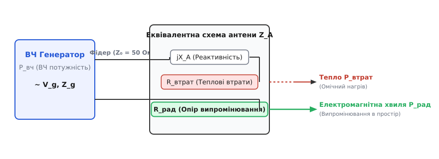
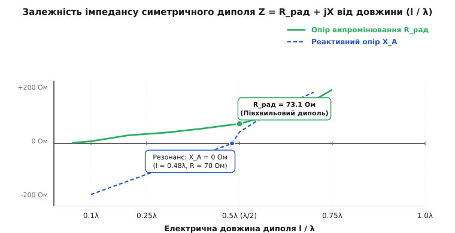
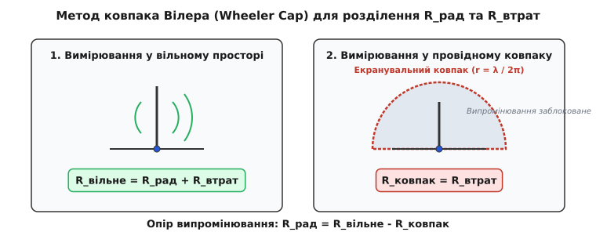

# Опір випромінювання антени

<preknowlist>
- [Антена](topic:com-medium/antenna) — конвертація змінного струму у вільну електромагнітну хвилю, випромінювання та ближня зона.
- [Пойнтингів вектор](topic:ph-electromagnetism/poynting-vector) — щільність потоку електромагнітної енергії та її інтегрування по замкненій поверхні.
- [Узгодження імпедансу антени](topic:com-medium/antenna-feedline-matching-and-balun) — комплексно-спряжене узгодження, вхідний імпеданс та коефіцієнт відбиття.
- [Резонанс диполя](topic:com-medium/resonance-dipole) — струмовий розподіл уздовж елементарно випромінюючої нитки.
</preknowlist>

Якщо підключити високочастотний генератор до звичайного 50-омного резистора, вся електрична потужність виділиться на ньому у вигляді тепла за законами класичної електротехніки Джоуля-Ленца. Проте якщо замінити резистор резонансним півхвильовим диполем у вільному просторі, генератор бачитиме майже те саме навантаження — активний опір біля `73 Ом`, але сам мідний провідник антени залишиться холодним. Енергія генератора не перетворилася на хаотичний тепловий рух атомів міді, а безповоротно відлетіла у довкілля у формі вільної електромагнітної хвилі зі швидкістю світла. 

Еквівалентна величина, яка характеризує здатність антени поглинати високочастотну потужність від генератора та незворотно перетворювати її на енергію випромінюваних хвиль, називається **опором випромінювання** (*radiation resistance*).

---

### Фізична природа та енергетичний баланс випромінювання

З боку клем живлення будь-яка антена виглядає для генератора або фідерної лінії як еквівалентний двополюсник із комплексним вхідним імпедансом:

```
Z_A = R_A + j · X_A
```

Реактивний складник `X_A` описує квазистатичну енергію ближнього поля (електричного та магнітного), яка почергово запасається у просторі навколо випромінювача і повертається назад у коло живлення кожного півперіоду коливань. Ця енергія не залишає антену, а утворює пульсуючу «реактивну оболонку» на відстанях менших за радіус реактивної ближньої зони `r_near ≈ λ / (2·π)`.

Активний складник імпедансу `R_A` описує незворотний відбір енергії від генератора. На відміну від звичайних електричних кіл низької частоти, де активний опір обумовлений виключно сокненнями та розсіюванням носіїв заряду (омічним нагрівом провідника), активний опір антени розкладається на дві фундаментальні складові з абсолютно різною фізичною природою:

```
R_A = R_рад + R_втрат
```

Опір втрат `R_втрат` враховує реальний омічний нагрів металевих провідників через високочастотний скін-ефект, вихрові струми у поверхні землі та діелектричне поглинання у конструктивних ізоляторах і підкладках друкованих плат.

Опір випромінювання `R_рад` — це фіктивний (еквівалентний) опір, який розсіював би у вигляді тепла точно таку ж активну потужність `P_рад`, яку реальна антена випромінює у довкілля у вигляді електромагнітних хвиль при проходженні струму `I_вх`:

```
P_рад = (1/2) · I₀² · R_рад = I_rms² · R_рад
```

де `I₀` — пікова амплітуда високочастотного струму у точці живлення антени, а `I_rms = I₀ / √2` — його середньоквадратичне (діюче) значення.


*Розподіл високочастотної потужності генератора P_вч в імпедансі антени Z_A. Енергія розділяється між реактивним ближнім полем jX_A, омічними тепловими втратами R_втрат та незворотним випромінюванням у далеке поле через опір випромінювання R_рад.*

З точки зору фундаментальної теоретичної фізики, опір випромінювання виникає через **гальмівну силу реакції випромінювання** (силу Абрагама-Лоренца). Коли заряди у провіднику прискорюються під дією зовнішньої електрорушійної сили генератора, вони самі починають випромінювати електромагнітні хвилі. Власне згенероване поле діє назад на носії заряду, створюючи сила опору, яка зсунута за фазою відносно швидкості електронів точно так само, як і механічне тертя. Генератор змушений постійно долати це електродинамічне гальмування, виконуючи роботу, яка і перетворюється на випромінену енергію.

Кількісний зв'язок між полем у далекій зоні та опором випромінювання встановлюється через [Пойнтингів вектор](topic:ph-electromagnetism/poynting-vector) `S = E × H`. Повна випромінювана потужність знаходиться шляхом інтегрування усередненого за часом вектора Пойнтинга `S_avg` по замкненій сферичній поверхні `A`, що охоплює антену у далекій зоні:

```
P_рад = ∬_A S_avg · dA = ∬_A (1/2) · Re( E × H* ) · dA
```

Прирівнявши цей поверхневий інтеграл до виразу через еквівалентні активні втрати `(1/2) · I₀² · R_рад`, отримуємо фундаментальне математичне визначення:

```
R_рад = (2 / I₀²) · ∬_A S_avg · dA
```

Ця формула показує, що опір випромінювання повністю визначається просторовою конфігурацією полів `E` та `H` у далекій зоні антени і не залежить від омічного опору металу, з якого зроблено провідники.

Зв'язок між опором випромінювання та спрямованістю антени визначається через амплітуду електричного поля у напрямку максимуму випромінювання `E_max`. Якщо антена має коефіцієнт спрямованої дії `D₀` (відносно ізотропного випромінювача), щільність потоку потужності у максимумі дорівнює `S_max = (P_рад · D₀) / (4·π·r²)`. Звідси вхідний опір випромінювання пов'язаний із максимальним полем у далекій зоні співвідношенням:

```
R_рад = (r² · |E_max|²) / (60 · I₀² · D₀)
```

Це рівняння широко застосовується у чисельних методах обчислення полів, коли відома діаграма спрямованості та напруженість поля в одній точці простору.

Детальніше про те, як фізики та інженери пройшли шлях від перших експериментів Герца до математичного формалізму Абрагама та Ван дер Поля, дивіться у [📜 Історія відкриття опору випромінювання](topic:com-medium/radiation-resistance/hist-radiation-resistance.md).

---

### Короткі антени та закон квадрата довжини

Для випромінювачів, фізичні розміри яких значно менші за довжину хвилі (`l << λ`), опір випромінювання можна розрахувати аналітично у замкненому вигляді через інтегрування полів у далекій зоні.

#### 1. Диполь Герца (ідеальний короткий випромінювач)
Якщо струм вздовж усього диполя довжиною `dl` розподілений рівномірно (що можна реалізувати додаванням великих ємнісних капелюхів чи дисків на кінцях), інтегрування вектора Пойнтинга дає класичну формулу Абрагама:

```
R_рад = (80 · π²) · (dl / λ)² ≈ 789.6 · (dl / λ)² Ом
```

#### 2. Реальний короткий симетричний диполь
У звичайному прямолінійному провіднику довжиною `l << λ` з відкритими кінцями струм мусить дорівнювати нулю на краях, тому він розподіляється за лінійним (трикутним) законом: `I(z) = I₀ · (1 - 2·|z| / l)`. Середня амплітуда струму вздовж антени виявляється у два рази меншою за струм у точці живлення `I₀`. Оскільки потужність пропорційна квадрату струму, опір випромінювання зменшується у `2² = 4` рази:

```
R_рад = (20 · π²) · (l / λ)² ≈ 197.4 · (l / λ)² Ом
```

#### 3. Короткий несиметричний монополь
Якщо короткий вертикальний штир висотою `h << λ` встановлено над ідеально провідною нескінченною площиною (землею), за методом дзеркальних відображень він утворює у верхній півсфері таке ж поле, як і диполь довжиною `l = 2·h`. Проте вся потужність випромінюється лише в один півпростір (2π стерадіан замість 4π), тому за тієї ж амплітуди струму випромінювана потужність та опір випромінювання зменшуються удвічі порівняно з диполем:

```
R_рад = (10 · π²) · (h / λ)² ≈ 98.7 · (h / λ)² Ом
```

#### 4. Мала рамкова (петльова) антена
Для кругової або квадратної рамки з площею `A << λ²` та кількістю витків `N`, по якій протікає рівномірний високочастотний струм, випромінювання має магнітно-дипольний характер. Опір випромінювання описується формулою:

```
R_рад = 31200 · N² · ( A / λ² )² Ом
```

```
Приклад розрахунку для коротких антен на частоті f = 10 МГц (довжина хвилі λ = 30 м):

1. Короткий диполь l = 1.5 м (l/λ = 0.05):
   R_рад = 197.4 · (0.05)² = 0.493 Ом

2. Короткий монополь h = 0.75 м (h/λ = 0.025):
   R_рад = 98.7 · (0.025)² = 0.0617 Ом (61.7 міліом!)

3. Одновиткова рамка радіусом r = 0.5 м (площа A = 0.785 м²):
   R_рад = 31200 · 1² · ( 0.785 / 30² )² = 0.0238 Ом (23.8 міліом!)
```

Такий мікроскопічний опір випромінювання електрично малих антен є головною інженерною перепоною при розробці компактних радіопристроїв. Коли `R_рад` вимірюється міліомами, навіть мізерний омічний опір дротів або контактів `R_втрат ≈ 0.5 Ом` поглинає понад 90–99% усієї потужності передавача, перетворюючи антену на звичайний нагрівач.

Окрім низького ККД, електрично малі антени мають колосальний ємнісний реактивний опір (`X_A ≈ 1000...5000 Ом`), що створює високу добротність кола `Q = |X_A| / (R_рад + R_втрат) >> 100`. Це катастрофічно звужує робочу смугу частот антени до лічених кілогерц відповідно до межі Чу-Харінгтона і вимагає застосування прецизійних узгоджувальних елементів.

Крок за кроком векторний математичний вивід формул для диполя Герца та півхвильового диполя наведено у [🧮 Виведення опору випромінювання диполя Герца та півхвильового диполя](topic:com-medium/radiation-resistance/math-dipole-radiation.md).

---

### Резонансні антени та залежність від електричної довжини

Коли фізичні розміри антени порівнянні з довжиною хвилі, розподіл струму перестає бути лінійним і описується синусоїдальною хвилею, а опір випромінювання стрімко зростає.


*Залежність активного опору випромінювання R_рад (зелена суцільна лінія) та реактивного опору X_A (синя пунктирна лінія) симетричного диполя від його відносної довжини l/λ. На рівні l = 0.5λ R_рад становить 73.1 Ом, а на резонансній довжині l ≈ 0.48λ реактивний опір обнуляється (X_A = 0).*

#### Півхвильовий диполь (`l = 0.5·λ`)
Для точного півхвильового диполя струм розподілений за законом `I(z) = I₀ · cos(2·π·z / λ)`. Суворе інтегрування вектора Пойнтинга дає класичне фундаментальне значення:

```
R_рад = 73.13 Ом
```

При цьому реактивний опір ідеально тонкого півхвильового диполя має індуктивний характер `X_A ≈ +j 42.5 Ом`. Щоб отримати чисто активний вхідний імпеданс (`X_A = 0`), антену трохи вкорочують до так званого **резонансного розміру** (`l ≈ 0.47...0.48·λ`), при якому вхідний опір стає чисто активним і дорівнює:

```
Z_A = R_рад ≈ 68...70 Ом
```

Це значення ідеально узгоджується із 75-омними коаксіальними кабелями без застосування складних трансформаторів.

#### Чвертьхвильовий штир (`h = 0.25·λ`)
Вертикальний монополь довжиною `λ/4` над ідеальним проводящим екраном має опір випромінювання рівно вдвічі менший за півхвильовий диполь:

```
R_рад = 73.13 / 2 ≈ 36.56 Ом
```

При трохи вкороченій резонансній довжині `h ≈ 0.235·λ` реактивність зникає, а активний опір стає `R_A ≈ 35 Ом`. При підключенні до стандартного 50-омного кабелю такий монополь забезпечує КСХ `SWR = 50 / 35 ≈ 1.43`, що є цілком прийнятним для практичного радіозв'язку навіть без узгоджувальних кіл.

#### Шлейфовий (петльовий) півхвильовий диполь
Якщо паралельно до півхвильового диполя додати другий замкнений провідник такого ж діаметра (утворивши замкнену петлю), загальний струм випромінювання розділиться порівну між двома провідниками. Струм у точці живлення зменшиться у 2 рази, а оскільки потужність `P = I² · R` має залишитися незмінною, вхідний опір випромінювання зросте у `2² = 4` рази:

```
R_петльового_диполя = 4 · 73.13 Ом ≈ 292.5 Ом
```

Якщо використовуються провідники різних діаметрів `d₁` та `d₂`, коефіцієнт трансформації опору випромінювання можна плавно змінювати в межах від `4` до `10...15` за формулою:

```
N² = ( 1 + log(2·S / d₁) / log(2·S / d₂) )²
```

де `S` — відстань між вісями провідників. Це значення близьке до **300 Ом**, що робить шлейфові диполі ідеальними для підключення до симетричних двопровідних стрічкових ліній передачі або узгодження з 75-омним кабелем через стандартний балун 4:1.

#### Друковані мікросмужкові (Patch) антени
У мікрохвильових системах (Wi-Fi, 5G, GPS) широко використовуються прямокутні пач-антени. Така антена моделюється як резонансний резонатор із двома випромінювальними щілинами провідністю `G_slot`. Опір випромінювання прямокутного пача на краю дорівнює:

```
R_рад_patch = 1 / (2 · G_slot) ≈ 90...150 Ом
```

Підключаючи мікросмужкову лінію живлення не до краю пача, а із заглибленням (*infeed distance y₀*), інженер плавно зменшує вхідний опір за законом `R_in(y₀) = R_рад_patch · cos²(π · y₀ / L)`, досягаючи точних 50 Ом без зовнішніх деталей.

---

### Взаємний опір випромінювання у зв'язаних антенах

Коли дві або більше антен розташовані поруч одна від одної (наприклад, у багатоелементних антенних решітках Ягі-Уда або MIMO-системах смартфона), поле першої антени наводить ЕРС у другій антені, створюючи ефект зв'язку.

У цьому випадку напруга на клемах першої антени залежить від струмів у обох випромінювачах:

```
V₁ = Z₁₁ · I₁ + Z₁₂ · I₂
V₂ = Z₂₁ · I₁ + Z₂₂ · I₂
```

де `Z₁₁` та `Z₂₂` — власні імпеданси антен, а `Z₁₂ = R₁₂ + j·X₁₂` — **взаємний імпеданс** (*mutual impedance*).

Взаємний опір випромінювання `R₁₂` виражає активну потужність, яка передається через поле від першого випромінювача до другого. Для двох паралельних півхвильових диполів, розташованих на відстані `d`:
- При `d → 0` (антени поруч) `R₁₂ → 73.1 Ом`;
- При `d = 0.1·λ` `R₁₂ ≈ 65 Ом`, що різко змінює вхідний опір веденого диполя у решітці Ягі-Уда (падає до `15...25 Ом`);
- При `d = 0.5·λ` `R₁₂ ≈ -12.5 Ом`;
- При `d >> λ` взаємний опір згасає як `1/d`.

Розрахунок `R₁₂` є критичним при проектуванні фазованих антенних решіток (ФАР) та рефлекторів антен Ягі-Уда.

---

### Співвідношення струмів та вибір точки живлення

Опір випромінювання не є абсолютизованою константою антени — його числове значення залежить від того, у якій саме точці вимірюється або розраховується струм `I_ref`.

Існує дві класичні конвенції вимірювання:

1. **Опір випромінювання відносно пучності струму (`R_рад0`):** Струм вимірюється у точці його максимуму уздовж антени (`I_max`). Ця величина характеризує саму випромінювальну геометрію і не залежить від точки підключення кабелю.
2. **Вхідний опір випромінювання (`R_in`):** Струм вимірюється безпосередньо на клемах живлення `I_in`.

Зв'язок між ними визначається збереженням повної випромінюваної потужності:

```
P_рад = (1/2) · I_max² · R_рад0 = (1/2) · I_in² · R_in
```

Звідси вхідний опір випромінювання при підключенні на відстані `z` від пучності струму виражається як:

```
R_in = R_рад0 / ( I_in / I_max )² = R_рад0 / sin²(k·h)
```

де `h` — відстань від відкритого кінця антени до точки живлення.

Змінюючи точку підключення фідеру, можна реалізувати різні методи живлення:
- **Центральне живлення (Center-Fed):** Стандартне підключення для півхвильового диполя (`R_in ≈ 73 Ом`).
- **Зміщене живлення (Off-Center Fed Dipole, OCFD):** Точка живлення зміщується на відстань `1/6` від центру, що підвищує вхідний опір до `200 Ом` і дозволяє використовувати антену у кількох гармонічних діапазонах через трансформатор 4:1.
- **Живлення з кінця (End-Fed Half-Wave, EFHW):** Кабель підключається до самого краю півхвильового провідника, де струм мінімальний. Вхідний опір зростає до `2000...4000 Ом`, що вимагає застосування узгоджувального автотрансформатора 49:1 або 64:1.

> 🔧 **Навіщо це у техніці:** Переміщуючи точку живлення вздовж елемента антени (наприклад, використовуючи Гамма-узгодження чи зміщене живлення OCFD), інженер може плавно трансформувати вхідний активний опір антени від `73 Ом` у центрі до `2000 Ом` біля краю, домагаючись точного узгодження із будь-яким фідером без використання важких трансформаторів на феритах.

---

### Опір втрат та радіаційний ККД антени

Високий опір випромінювання важливий не лише для зручності узгодження, але й для забезпечення високого коефіцієнта корисної дії (ККД).

Повний активний опір антени `R_A = R_рад + R_втрат` визначає радіаційну ефективність `η`:

```
η = P_рад / P_вх = R_рад / (R_рад + R_втрат)
```

Опір втрат `R_втрат` формується за рахунок трьох основних фізичних ефектів:

1. **Скін-ефект у провідниках (`R_скін`):** На високих частотах струм протікає у тонкому поверхневому шарі товщиною `δ = 1 / √(π·f·μ·σ)`. Для мідного дроту радіуса `a` опір втрат зростає з частотою як `√f`: `R_скін = l / (2·π·a·σ·δ)`.
2. **Втрати у землі та оточенні (`R_земля`):** Вихрові струми у поверхні ґрунту або корпусі пристрою під впливом ближнього поля.
3. **Діелектричні втрати (`R_діелектрик`):** Поглинання енергії у несучих ізоляторах та матеріалі друкованої плати.

```
Типові значення ККД для антен різних габаритів:

1. Повнорозмірний півхвильовий диполь на КХ (14 МГц, мідь 2 мм):
   R_рад = 73.1 Ом, R_втрат = 0.15 Ом
   η = 73.1 / (73.1 + 0.15) = 99.8%  (-0.01 дБ)

2. Автомобільний штир 27 МГц (h = 1 м, h/λ = 0.09):
   R_рад ≈ 8 Ом, R_втрат (подовжувальна котушка + заземлення) ≈ 12 Ом
   η = 8 / (8 + 12) = 40.0%  (-4.0 дБ)

3. Вбудована NFC чип-антена смартфона (13.56 МГц, 3x5 см):
   R_рад ≈ 0.002 Ом, R_втрат ≈ 0.8 Ом
   η = 0.002 / (0.002 + 0.8) = 0.25%  (-26 дБ)
```

Варто відзначити, що при зменшенні розмірів антени `l` опір випромінювання падає квадратично (`R_рад ∝ l²`), тоді як опір втрат у провіднику падає лише лінійно (`R_втрат ∝ l`). Це створює так зване «тиранство малих антен»: при зменшенні габаритів нижче `0.1·λ` ККД антени падає експоненційно, і левова частка потужності генератора перетворюється на звичайне тепло.

Повний аналіз еквівалентної схеми та детальний розбір механізмів втрат у провідниках та ґрунті наведено у [🔌 Еквівалентна схема антени та механізми втрат](topic:com-medium/radiation-resistance/comp-antenna-loss.md).

---

### Методи обчислення та лабораторного вимірювання

Опір випромінювання неможливо виміряти звичайним мультиметром чи DC-омметром: при постійному струмі мультиметр покаже лише низький омічний опір металевого дроту (частки Ома) або розрив кола для диполя.

У сучасній інженерії застосовують три основні методи визначення `R_рад`:

#### 1. Метод ковпака Вілера (Wheeler Cap Method)
Експериментальний метод розділення `R_рад` та `R_втрат` для малих антен.


*Методика вимірювання ККД за методом Вілера. Загальний опір вимірюється у вільному просторі (R_вільне = R_рад + R_втрат), після чого антена накривається металевим екранувальним ковпаком радіуса r ≈ λ/2π, який блокує випромінювання (R_ковпак = R_втрат).*

Порядок вимірювання:
1. За допомогою векторного аналізатора ланцюгів (VNA) вимірюють вхідний активний опір антени у вільному просторі: `R_вільне = R_рад + R_втрат`.
2. Антену накривають замкненим провідним екранувальним ковпаком радіуса `r ≈ λ / (2·π)`. Ковпак блокує випромінювання хвилі у дальню зону, але практично не змінює струми у провідниках: `R_ковпак = R_втрат`.
3. Обчислюють опір випромінювання: `R_рад = R_вільне - R_ковпак`.

#### 2. Метод моментів (Method of Moments, MoM)
Чисельний електродинамічний розрахунок у програмах моделювання (NEC-2, NEC-4, FEKO). Провідники антени розбиваються на малі сегменти `dz`, складеться система лінійних алгебраїчних рівнянь відносно струмів у сегментах, після чого інтегруванням полів обчислюється вектор Пойнтинга та вхідний імпеданс.

#### 3. Польові тривимірні симулятори (FEM / FDTD)
У пакетах HFSS та CST Studio Suite випромінювач моделюється у повному 3D-об'ємі із врахуванням реальних властивостей матеріалів. Симулятор розраховує поля `E` та `H` на поверхні куба випромінювання і виділяє `R_рад` шляхом інтегрування вектора Пойнтинга.

Практичний алгоритм розрахунку опору випромінювання та ККД мовами C та C++ наведено у [⚙️ Розрахунок опору випромінювання та ККД антени](topic:com-medium/radiation-resistance/proj-rad-resistance-calc.md).

---

### Практичні інженерні застосування

> 🔧 **Навіщо це.**
> 
> Розуміння фізики опору випромінювання прямо визначає архітектуру сучасних бездротових пристроїв:
> 
> 1. **Антени мобільних телефонів та IoT (LTE, Wi-Fi, Bluetooth):**
>    У сучасних смартфонах під антену відводиться мінімальний об'єм. При фізичних розмірах `l ≈ 15...20 мм` на частотах 700 МГц опір випромінювання падає до `1...3 Ом`. Щоб узгодити таку антену з 50-омним трактом модема, використовують високодобротні керамічні L-мережі або IFA-топології (*Inverted-F Antenna*), де точка живлення зміщена від краю для штучного підвищення вхідного опору до 50 Ом.
> 
> 2. **Автомобільні та портативні КХ/УКХ радіостанції:**
>    Гнучкий «куликовський» штир діапазону 27 МГц має довжину всього `1.8 м` замість резонансних `2.75 м` (`λ/4`). Його `R_рад` становить близько `10 Ом`. Для компенсації ємнісної реактивності у основу штиря вбудовують подовжувальну індуктивну котушку. Добротність такої котушки визначає опір втрат `R_котушки`: якщо опір дроту котушки дорівнює `10 Ом`, ККД антени не перевищить `10 / (10 + 10) = 50%`.
> 
> 3. **Радіоаматорські та мовні КХ-передавачі:**
>    При побудові чвертьхвильових вертикальних антен (GP — *Ground Plane*) на частоти 1.8–3.5 МГц опір випромінювання становить `36.5 Ом`. Основне завдання інженера — зменшити `R_земля`. Для цього під антену у ґрунт закопують сітку з 30–120 мідних радіальних провідників довжиною `λ/4`. Це знижує опір втрат у землі з `30 Ом` до `1...2 Ом`, піднімаючи ККД антени з 50% до 95%.
