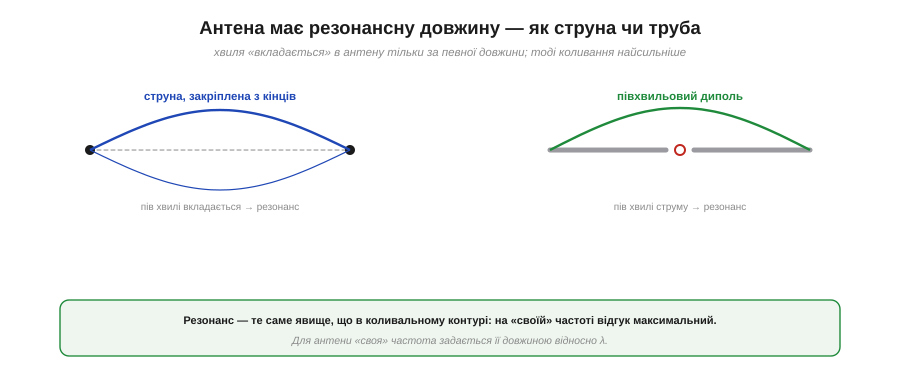
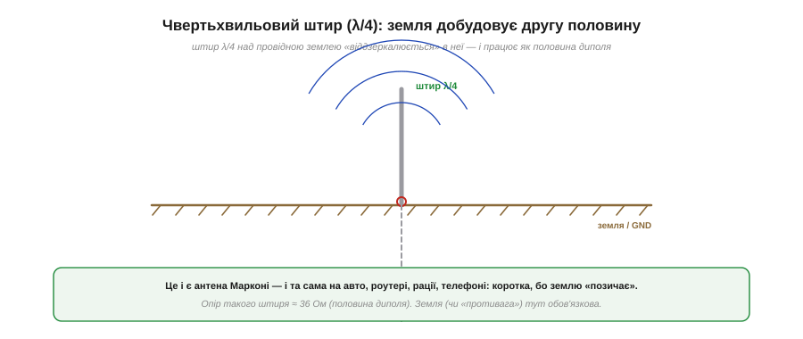
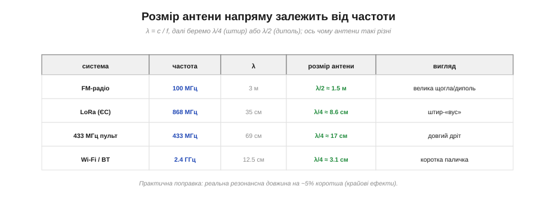
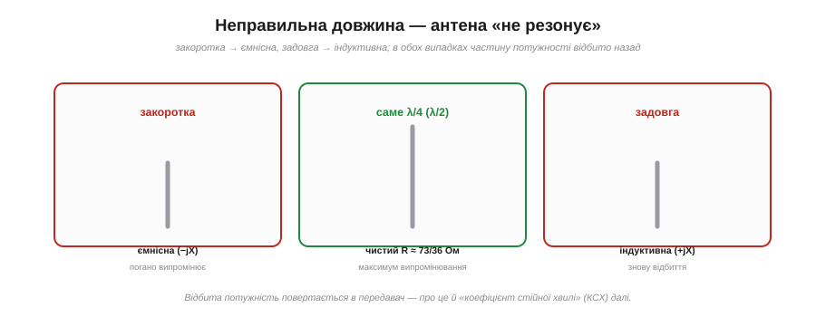
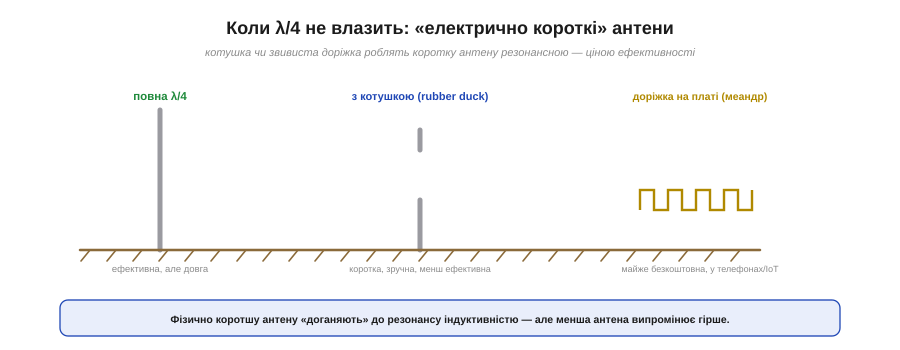
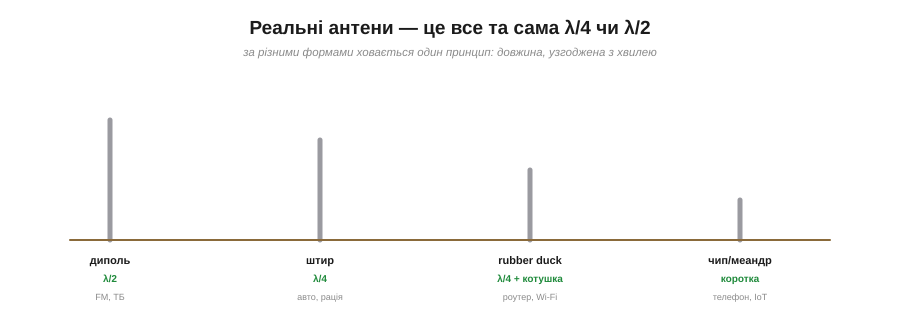

# Резонанс і довжина: чверть хвилі, диполь

На антені стоїть **хвиля струму**, а повна довжина диполя — близько λ/2. З'ясуймо, **чому саме так**, — це, мабуть, найпрактичніша річ у всій темі антен. Бо відповідь на питання «якої довжини робити антену» визначає геть усе: чи добиватиме твій передавач, чи влізе антена в корпус, чи не «глухий» твій приймач. А в основі лежить явище, добре знайоме з теорії кіл, — [**резонанс**](topic:hw-analog/lc-resonance).

### Антена резонує, як струна

Найкраща інтуїція для антени — це **музичний інструмент**. Гітарна струна чи орга́нна труба звучать не на будь-якій частоті, а лише на **своїй**, резонансній, — тій, де хвиля рівно «вкладається» в довжину струни чи труби.


*Струна, закріплена з кінців, найсильніше коливається, коли в неї вкладається ціле число півхвиль. Так само й антена: коли її довжина узгоджена з λ, хвиля струму «вкладається» ідеально — і антена резонує, віддаючи максимум енергії в простір. Це той самий резонанс, що в [коливальному контурі](topic:hw-analog/lc-resonance).*

Антена поводиться точнісінько так. Шматок дроту має **розподілену** ємність та індуктивність — і на певній частоті вони складаються в **резонанс**, як [LC-контур](topic:hw-analog/lc-resonance), тільки «розмазаний» уздовж дроту. На цій резонансній частоті відгук антени **максимальний**: хвиля струму ідеально вкладається в її довжину, заряди гойдаються найрозмашистіше, випромінювання найсильніше. А резонансна частота задається **довжиною антени відносно λ**. Тому питання «яка довжина» — це насправді питання «де резонанс».

### Півхвильовий диполь: реактивність зникає

Розгляньмо найважливіший випадок — **півхвильовий диполь** (гр. *di-* — двічі, *pólos* — полюс: два плеча-полюси), повна довжина якого ≈ λ/2. Чому ця довжина особлива?


*Коли довжина диполя ≈ λ/2, його розподілені ємність та індуктивність **гасять одна одну** — реактивність обертається на нуль. Передавач «бачить» уже не примхливе реактивне навантаження, а чистий **опір** ≈ 73 Ом, у який легко й ефективно віддавати потужність.*

Уся краса резонансу — у тому, що на ньому **реактивність зникає** (від лат. *re-actio* — зворотна дія: струм і напруга не в такт, опір «штовхає» енергію назад). Поза резонансом антена «впирається»: вона виглядає для передавача або ємнісною, або індуктивною (має реактивний опір X ≠ 0), і віддати в неї потужність важко. А на резонансній довжині λ/2 ємнісна й індуктивна частини **точно компенсуються** — і передавач бачить **чистий активний опір**, той самий [**опір випромінювання ≈ 73 Ом**](topic:com-medium/antenna). У таке навантаження потужність ллється легко й майже без втрат. Ось чому λ/2 — «магічна» довжина диполя: на ній антена і резонує, і зручно живиться.

### Чвертьхвильовий штир: земля добудовує половину

Диполь чудовий, але має ваду — він довгий (цілих λ/2) і йому потрібні **два** плеча. Часто зручніше мати **один** короткий штир. І тут є геніальний хід — **чвертьхвильовий монополь** (гр. *mónos* — один: одне плече) — штир λ/4 над **землею**.


*Вертикальний штир завдовжки лише λ/4 над провідною поверхнею «віддзеркалюється» в ній: земля створює **уявне зображення** другої чверті хвилі. Разом штир і його відображення працюють як повний півхвильовий диполь — але металу вдвічі менше.*

Хитрість — у **дзеркалі**. Провідна земля (чи металева «противага») відбиває поле штиря так, ніби під землею є його **дзеркальна копія**. Реальний штир λ/4 плюс уявне відображення λ/4 разом складають **повний диполь λ/2** — але фізично ти ставиш **удвічі коротшу** антену, бо другу половину «позичаєш» у землі. Це і є класична **антена Марконі** — і та сама, що стоїть на **автомобілі, роутері, рації, телефоні**: коротка вертикальна паличка над металевим корпусом-землею. Опір такого штиря — близько **36 Ом** (половина від 73). Важливо лише пам'ятати: штирю **обов'язково потрібна земля** чи противага — без неї «дзеркала» немає, і він працює погано.

### Розмір антени напряму залежить від частоти

Тепер найпрактичніше — числа. Раз довжина антени прив'язана до λ, а [λ = c/f](root:embedded/frequency-wavelength), то **розмір антени прямо диктується частотою**.


*Та сама арифметика для різних систем: рахуємо λ = c/f, тоді λ/4 (штир) або λ/2 (диполь). FM на 100 МГц вимагає півтораметрового диполя, а Wi-Fi на 2.4 ГГц — лише трисантиметрової палички. Ось чому антени такі різні на вигляд.*

**Приклад (антена під свою частоту).** Порахуймо λ/4 для кількох знайомих систем (λ = c/f, c ≈ 3×10⁸ м/с):

```
FM 100 МГц : λ = 3 м      → λ/2 ≈ 1.5 м    (велика щогла)
433 МГц    : λ = 69 см    → λ/4 ≈ 17 см    (довгий «вус»)
Wi-Fi 2.4 ГГц: λ = 12.5 см → λ/4 ≈ 3.1 см  (коротка паличка)
```

Тепер зрозуміло, чому FM-антена на даху — велика, а Wi-Fi у телефоні — крихітна: усе диктує частота. Маленька практична поправка: реальна резонансна довжина виходить приблизно на **5% коротшою** за теоретичну (через крайові ефекти на кінцях дроту). Тому в довідниках для розрахунку штиря часто беруть не точне λ/4, а трохи менше — але для розуміння принципу нам досить «приблизно λ/4».

### Не та довжина — і антена «глухне»

А що, як зробити антену **неправильної** довжини? Тоді вона перестає резонувати — і це одразу б'є по ефективності.


*Закоротка антена стає **ємнісною**, задовга — **індуктивною**; в обох випадках з'являється реактивність, передавачу важко віддати потужність, і частину її **відбиває** назад. Лише на «своїй» довжині (λ/4 чи λ/2) опір чисто активний — і випромінювання максимальне.*

Поза резонансом антена знову набуває **реактивності**: закоротка поводиться як ємність, задовга — як індуктивність. Передавач уже не може віддати в неї всю потужність — частина енергії **відбивається назад** у кабель, замість того щоб полетіти в простір. Антена «глухне»: і випромінює слабше, і приймає гірше (тут спрацьовує [взаємність](topic:com-medium/antenna) — антена приймає й передає однаково). Цю відбиту потужність міряють [**коефіцієнтом стійної хвилі**](topic:com-medium/vswr) (КСХ) — окремою важливою величиною радіотракту. Практичний підсумок простий: **антена не тієї довжини — це майже завжди втрачені децибели [бюджету радіолінії](root:embedded/link-budget)**.

### Коли λ/4 не влазить: електрично короткі антени

Буває, що повноцінну λ/4 **нема куди подіти**: на низькій частоті вона завелика, а пристрій крихітний (телефон, IoT-давач, брелок). Що робити? Тут інженери йдуть на компроміс — **електрично короткі** антени.


*Фізично коротку антену «доганяють» до резонансу додатковою індуктивністю — котушкою біля основи (так зроблено в «гумовій качечці» роутера) або звивистою доріжкою-меандром на платі (телефони, IoT). Антена стає компактною — але платить за це **ефективністю**.*

Ідея проста: якщо антена закоротка й тому ємнісна, додамо їй **індуктивності**, щоб повернути в резонанс. На практиці це **котушка** біля основи — саме так влаштована знайома **«гумова качечка»** (*rubber duck*) на роутерах і раціях: усередині короткого гумового корпусу схована котушка, що робить його електрично рівним λ/4. Або **звивиста доріжка-меандр** прямо на платі — майже безкоштовна антена в кожному телефоні й IoT-пристрої. Розплата за компактність — **гірша ефективність**: маленька антена принципово випромінює слабше за повнорозмірну. Це чесний обмін «розмір ↔ ефективність», який варто усвідомлювати.

> 🔧 **Навіщо це.** Тепер у тебе є готове правило для будь-якого радіопроєкту. Перше: **порахуй λ/4** для своєї частоти (λ = c/f, поділи на 4) — це орієнтир розміру антени. Друге: якщо стільки **влазить** — чудово, зроби прямий штир чи диполь, він буде ефективний. Третє: якщо **не влазить** — бери готову «качечку» або PCB-антену, але знай, що втратиш частину дальності. І ніколи не чіпляй «який-небудь» шматок дроту навмання: антена не тієї довжини зведе нанівець навіть найкращий передавач. Розмір антени — це не дрібниця, а половина успіху радіолінії.

### Реальні антени — це все та сама λ/4 чи λ/2

Наостанок зведімо різноманіття антен до спільного знаменника.


*За різними формами — один принцип. Диполь (λ/2) у FM і ТБ; штир (λ/4) на авто й рації; «гумова качечка» (λ/4 з котушкою) на роутері; крихітна чип- чи меандр-антена (електрично коротка) у телефоні та IoT. Усе це — варіації на тему «довжина, узгоджена з хвилею».*

Хоч антени бувають геть різні на вигляд — від півтораметрового телевізійного диполя до міліметрової кераміки в телефоні, — за всіма ними стоїть **одна й та сама ідея резонансу**: довжина, узгоджена з довжиною хвилі. Диполь — λ/2, штир — λ/4, «качечка» — електрично доведена до λ/4 котушкою, чип-антена — мудро згорнута коротка. Побачивши будь-яку антену, тепер можна одразу прикинути: на яку приблизно частоту вона налаштована й чому має саме такий розмір.

Резонансна довжина — це те, що робить антену **ефективною**: вона віддає максимум енергії в простір саме тому, що хвиля струму ідеально вкладається в її розмір. Окреме питання — **куди** саме антена випромінює: диполь світить не однаково навсібіч, а [тарілка чи спрямована антена](topic:com-medium/antenna-gain) б'є вузьким променем. Але хоч би якою була форма й [спрямованість](topic:com-medium/antenna-gain), фундамент завжди той самий — довжина, узгоджена з довжиною хвилі.

---
