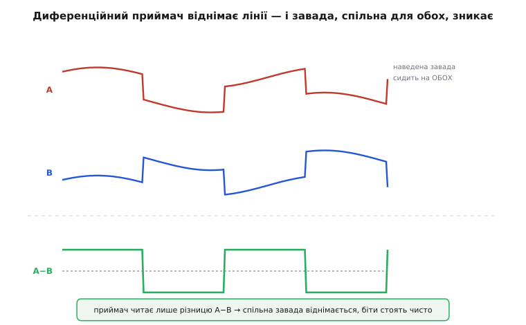
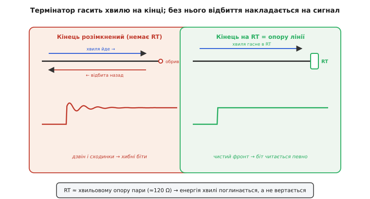
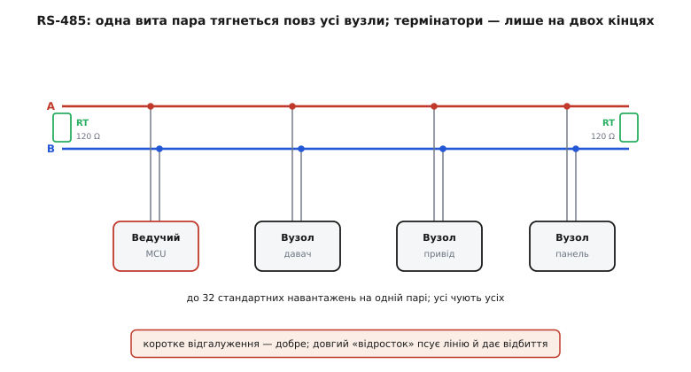
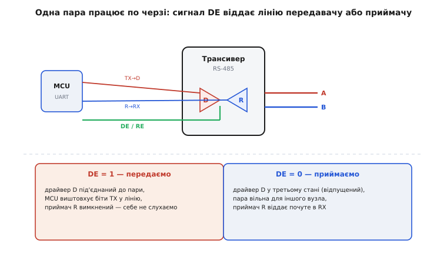
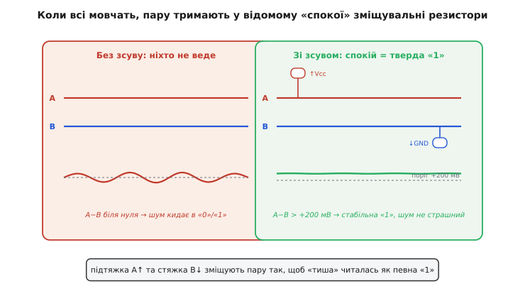

# RS-485

Уявімо звичайну заводську ситуацію: уздовж конвеєра завдовжки півсотні метрів стоять десяток давачів і приводів, а в шафі — один контролер, що має з усіма ними говорити. Поряд гудуть силові кабелі, вмикаються й вимикаються потужні двигуни, кожен пуск кидає в повітря електромагнітний сплеск. Спробуйте простягнути туди звичайну логічну лінію, де «1» — це 3.3 В відносно землі, а «0» — нуль, і вона захлинеться: на такій довжині сигнал просяде, а перша ж завада від двигуна перекине рівень і зіпсує біт. RS-485 — це відповідь саме на цю задачу: **диференційна багатоточкова шина**, що тягне дані на сотні метрів повз промислові завади й чіпляє на одну виту пару десятки пристроїв. Розберімо, чому кожне її рішення випливає з фізики, а не з примхи стандарту.

### Чому одна лінія відносно землі не доживає до того кінця

Звичайний логічний сигнал — **однобічний** (*single-ended*, «один кінець»): рівень одного дроту читають **відносно спільної землі**. Приймач питає просте: напруга на дроті вища за поріг — це «1», нижча — «0». Поки дріт короткий і обидва пристрої поруч, усе гаразд. Та щойно лінія видовжується й проходить повз джерела завад, виходить дві біди заразом.

Перша — **наведена завада**. Будь-який змінний струм поряд (двигун, перетворювач, навіть мережа 50 Гц) наводить у дроті паразитну напругу. Вона додається до корисного сигналу, і коли її розмах наближається до половини логічного перепаду, приймач починає бачити «1» там, де передавач слав «0». Друга біда тонша — **зсув землі**. Два пристрої за десятки метрів живляться, як правило, від різних точок, і їхні «землі» не однакові: по спільному дроту течуть струми, падають напруги, і нуль на одному кінці виявляється, скажімо, на вольт вищим за нуль на іншому. А приймач однобічної лінії все міряє саме **відносно своєї землі** — отже, цей зсув він прийме за частину сигналу. Чому однобічні лінії впираються в стіну на довжині й швидкості — окрема тема; тут досить знати, що на промисловій дистанції вони просто не виживають.

> 🔧 **Навіщо це.** Поки прилади на одній маленькій платі, однобічні UART/SPI/I2C — ідеальні: дешево й просто. Щойно дріт виходить із плати в кабель між шафами чи вузлами машини — однобічний рівень стає ненадійним, і потрібна інша фізика. RS-485 і є тією фізикою для «довгих» внутрішньозаводських ліній.

### Диференційність: читаємо різницю, а не рівень

Ось ключова ідея, з якої виростає весь RS-485. Замість одного дроту відносно землі беремо **два дроти** й передаємо сигнал як **різницю напруг між ними**. Назвімо їх **A** і **B** (у стандарті трапляються й позначення D−/D+). Передавач жене їх **протифазно**: щоб послати «1», він робить B вищим за A; щоб «0» — навпаки. Приймач не дивиться на жоден дріт окремо — він міряє лише **A−B** і за знаком цієї різниці вирішує, який біт прийшов.

> 🔗 RS-485 — це конкретний промисловий стандарт поверх загального прийому **диференційної пари**: двох протифазних дротів, де корисне — різниця, а спільне для обох — викидається. Той загальний прийом (чому скручування в пару й протифаза разом дають завадостійкість) розібрано окремо.
> [Диференційна пара](topic:com-medium/differential-pair)

Чому це дрібне на вигляд рішення так радикально все міняє? Бо **завада чіпляє обидва дроти майже однаково**. Якщо A і B скручені в одну виту пару й лежать поряд, то наведення від сусіднього двигуна, і зсув землі, і фон мережі додаються **до обох рівно**. А приймач рахує різницю — і все, що було **спільним** для обох дротів, у різниці просто віднімається й зникає. Це і є **подавлення спільного сигналу** (*common-mode rejection*, «відкидання того, що спільне»).


*Угорі — лінії A і B: корисний сигнал на них протифазний, а наведена завада (хвиляста складова) сидить на обох однаково. Унизу — різниця A−B: спільна завада скоротилась, корисний перепад навіть подвоївся. Саме тому приймач читає біти чисто там, де однобічна лінія вже захлинулась би.*

Звідси одразу два наслідки. По-перше, **дальність**: корисний сигнал у різниці подвоюється (бо дроти йдуть у протифазі, їхні перепади додаються), а головний ворог дальності — завада — відкидається; тому RS-485 упевнено працює там, де однобічна лінія давно б здалася. По-друге, **завадостійкість**: приймач спрацьовує вже від невеликої різниці — стандарт гарантує надійне розрізнення біта за |A−B| усього **±200 мВ**, тоді як спільна завада може гойдати обидва дроти в широкому діапазоні (приблизно від −7 до +12 В відносно землі приймача), і це не зіб'є читання. Саме цей запас і дає змогу пережити і зсув землі, і промислове наведення.

```
біт = знак(A − B)
   A − B > +200 мВ  →  один логічний стан
   A − B < −200 мВ  →  протилежний стан
спільна завада зсуває A і B РАЗОМ → у різниці A−B зникає
```

### Чому кінці лінії треба термінувати

З диференційності виростає несподіване на перший погляд правило: **кінці лінії треба замикати резистором-термінатором**. Щоб зрозуміти навіщо, доведеться побачити дріт не як просту перемичку, а як **лінію передачі**, по якій сигнал біжить хвилею зі скінченною швидкістю — близько двох третин швидкості світла в типовому кабелі, тобто метр десь за 5 наносекунд.

Будь-яка вита пара має свій **хвильовий опір** (*characteristic impedance*) — для стандартного кабелю RS-485 це приблизно 120 Ω. Поки хвиля біжить по однорідній парі, вона «бачить» цей опір і йде спокійно. Та коли вона добігає до кінця, важить, що там на неї чекає. Якщо кінець розімкнений (опір нескінченний) або, навпаки, закорочений (нуль) — словом, **не дорівнює хвильовому опору**, — частина енергії хвилі **відбивається** й біжить назад. Ця відбита хвиля накладається на корисний сигнал, дає «дзвін» і сходинки на фронтах, і на швидкій лінії цього досить, щоб приймач читав хибні біти.

Ліки прямі: на кінці поставити резистор, що **дорівнює хвильовому опору пари** — ті самі ≈120 Ω між A і B. Тоді хвиля, добігши до кінця, «бачить» опір, такий самий, як у самої лінії, віддає йому всю енергію — і відбивати нíчому. Хвиля гасне, фронт лишається чистим.


*Ліворуч — розімкнений кінець: хвиля відбивається назад, накладається на сигнал, фронт «дзвенить» сходинками — біти стають непевними. Праворуч — кінець замкнений на RT ≈ опору лінії: хвиля віддає енергію резистору, відбивати нíчому, фронт чистий.*

Тонкощі, що випливають із самої причини. Термінатор ставлять **тільки на двох фізичних кінцях** найдовшого кабелю — там, де хвилі нíкуди далі бігти. Вузли всередині лінії термінувати **не можна**: кожен зайвий резистор на 120 Ω — це додаткове навантаження, що просаджує сигнал. І ще: термінація потрібна тим більше, чим **довша лінія й швидший обмін**; на коротенькому шматку на повільній швидкості нею іноді нехтують, але як звичка «два кінці — два термінатори» вона надійніша за здогади.

```
RT ≈ Z₀(пари) ≈ 120 Ω        # резистор = хвильовому опору
ставимо РІВНО два: на обох фізичних кінцях лінії
всередині лінії — НЕ термінувати (зайве навантаження)
```

### Багатоточковість: одна пара, багато вузлів

Тепер складімо картину шини в цілому. RS-485 — **багатоточковий** (*multipoint*): на одній витій парі сидять **багато** пристроїв, а не лише двоє. Кабель тягнеться однією лінією повз усі вузли, кожен чіпляється коротким відгалуженням, і на двох кінцях стоять термінатори.


*Лінія A/B тягнеться через увесь сегмент; до неї короткими відгалуженнями підключені ведучий і ведені. Термінатори RT — лише на двох кінцях. Довгий «відросток» від лінії до вузла давав би власні відбиття, тож відгалуження тримають короткими.*

Скільки вузлів витримає шина? Стандарт міряє навантаження в **одиницях навантаження** (*unit load*) — це частка струму, яку один приймач відбирає з лінії, — і класичний приймач RS-485 розрахований так, щоб передавач тягнув **до 32 таких одиниць**. Звідси й відоме «до 32 пристроїв на сегмент». Сучасні мікросхеми часто мають **дробове** навантаження (¼ чи ⅛ одиниці), і тоді на ту саму пару лягає 128 чи навіть 256 вузлів — арифметика проста: чим менший апетит кожного приймача, тим більше їх влазить, поки сумарне навантаження не перевищить ті самі 32 одиниці.

Є й давнє правило компромісу між **довжиною і швидкістю**: добуток їх приблизно сталий. Класична межа — близько **10 Мбіт/с на коротких метрах** або **близько 100 кбіт/с на повних ~1200 метрах**; між цими краями — плавний обмін одного на інше. Причина та сама фізика лінії передачі: що довший кабель, то більше він «розмазує» швидкі фронти, тож для надійності доводиться вповільнюватись.

### Напівдуплекс і керування напрямком

Класичний RS-485 — це **дві лінії**, одна вита пара, і працює вона **напівдуплексом** (*half-duplex*): по тій самій парі говорять **по черзі**. У кожну мить лінію тримає лише **один** передавач; решта слухають. (Існує і повнодуплексний варіант на двох парах — окрема пара «туди» й окрема «назад», — але типовий двопровідний RS-485 саме напівдуплексний.)

Звідси постає питання, якого не було в простому UART: як той самий дріт то **віддавати** передавачу, то **звільняти** для приймачів? Адже якщо два передавачі ввімкнуться на спільну пару одночасно, вони битимуться за рівень — це **конфлікт шини**, зайвий струм і зіпсовані дані. Рішення — особлива здатність вихідного каскаду: **третій стан** (*tri-state*). Окрім «штовхати лінію в 1» і «тягти в 0», передавач уміє **відпустити** лінію — від'єднатися від неї електрично, ніби його там і немає. Тоді парою може скористатися інший вузол.

Перемикає це **спеціальна лінія керування напрямком — DE** (*Driver Enable*, «увімкнення передавача»). Мікроконтролер тримає її окремою ніжкою:

```
DE = 1 → передавач під'єднаний до пари (вузол ГОВОРИТЬ)
DE = 0 → передавач у третьому стані (вузол СЛУХАЄ, пара вільна)
```

Поряд зазвичай є парний сигнал **RE** (*Receiver Enable*, «увімкнення приймача»), часто з інверсією; на багатьох мікросхемах DE і RE зводять в одну ніжку, щоб одним рівнем одночасно вмикати передавач і вимикати власний приймач (і навпаки).


*Трансивер містить передавач D і приймач R на спільній парі A/B. Сигнал DE/RE вирішує напрямок: DE=1 — D жене біти з TX мікроконтролера в лінію, приймач вимкнено; DE=0 — D у третьому стані, пара вільна для іншого вузла, а R віддає почуте в RX.*

Звідси випливає правило, на якому спотикаються чи не всі новачки: **DE треба ввімкнути перед відправкою й вимкнути одразу після неї**, причому вимкнути не раніше, ніж останній біт фізично пішов у лінію. Притримаєш DE надто довго — і твій передавач блокуватиме пару, коли відповідач уже хоче говорити; відпустиш зарано — обріжеш собі ж останній біт. На практиці DE піднімають перед першим байтом і опускають за мить **після** того, як апаратний передавач UART повідомив, що зсунув останній стоп-біт.

**Приклад (як керувати DE у прошивці).** Хай контролер на 9600 бод посилає кадр і має певно віддати лінію. Спершу прикиньмо час одного байта, щоб знати, скільки чекати спорожнення передавача:

```
кадр UART = 1 старт + 8 даних + 1 стоп = 10 біт
час біта  = 1 / 9600           = 104.2 мкс
час байта = 10 × 104.2 мкс     ≈ 1.04 мс
```

А ось мінімальна, але коректна обгортка передачі на C — підняти DE, віддати байти, дочекатися, поки залізо **дотисне останній біт**, і лише тоді опустити DE:

:::tabs
```c
// DE і RE зведені в один пін (DE=1 → передаємо, DE=0 → слухаємо)
#define RS485_DE_PIN  4

void rs485_send(const uint8_t *buf, size_t n) {
    digitalWrite(RS485_DE_PIN, HIGH);   // беремо лінію: вузол говорить
    Serial.write(buf, n);               // штовхаємо байти в апаратний UART
    Serial.flush();                     // ЧЕКАЄМО, поки піде ОСТАННІЙ стоп-біт
    digitalWrite(RS485_DE_PIN, LOW);    // відпускаємо лінію: знову слухаємо
}
```
```python
# MicroPython: DE і RE зведені в один пін (DE=1 → передаємо, DE=0 → слухаємо)
from machine import Pin, UART

de = Pin(4, Pin.OUT)
uart = UART(1, baudrate=9600, bits=8, parity=None, stop=1)

def rs485_send(buf):
    de.value(1)          # беремо лінію: вузол говорить
    uart.write(buf)      # штовхаємо байти в апаратний UART
    uart.flush()         # ЧЕКАЄМО, поки піде ОСТАННІЙ стоп-біт
    de.value(0)          # відпускаємо лінію: знову слухаємо
```
:::

Уся суть — у `flush()` між `write()` і опусканням DE: без нього програма зняла б DE, поки останні байти ще сидять у буфері передавача, і обірвала б власний кадр. Це найчастіша причина, чому «передаю — а на тому кінці сміття».

### Зміщувальні резистори: щоб тиша не плавала

Лишилася остання тонкість, і вона теж випливає прямо з напівдуплексу. Буває мить, коли **всі** вузли мовчать: один договорив, відпустив лінію (DE=0), а інший ще не почав. У цю мить **жоден передавач не тримає пару** — вона «висить» ні в 1, ні в 0. Через диференційність приймач читає різницю A−B, а вона тепер близька до нуля й гуляє від найменшої завади. Приймачі починають бачити випадкові переходи й приймати їх за початок даних — на лінії з'являється сміття «нізвідки».

Щоб тиша мала **визначений** стан, ставлять **зміщувальні резистори** (*fail-safe biasing*, «зміщення в безпечний стан»): один підтягує лінію A до живлення, інший стягує B до землі. Вони злегка розводять A і B так, щоб у спокої різниця певно перевищувала поріг розрізнення (ті самі ≥ +200 мВ) — і «тиша» читалася як стабільна логічна «1» (стан спокою, той самий, що й стоп-біт UART). Тепер навіть невелика завада вже не перекине приймач, бо різниця тримається з запасом над порогом.


*Ліворуч — без зсуву: коли ніхто не веде лінію, A−B біля нуля, і будь-який шум кидає приймач між «0» і «1». Праворуч — підтяжка A↑ до Vcc і стяжка B↓ до GND зміщують пару так, що в спокої A−B певно вища за поріг +200 мВ, тож тиша читається як тверда «1».*

Зміщувальні резистори ставлять **раз на сегмент** (зазвичай біля ведучого), а не на кожному вузлі — інакше їх паралельне ввімкнення перевантажить лінію, як і зайві термінатори. На багатьох сучасних трансиверах є **вбудований fail-safe**, що сам тримає спокій у визначеному стані, і тоді зовнішні зміщувальні резистори не потрібні — але знати, навіщо вони, треба, бо «плаваюча тиша» — класична причина загадкових збоїв у старіших системах.

### Де це працює: Modbus і промисловість

Тепер видно, чому RS-485 став робочою конячкою промисловості. Він дає рівно те, чого там бракує іншим шинам: **велику дальність** (до ~1200 м), **завадостійкість** серед силового обладнання, **багато вузлів** на одній дешевій витій парі й просту, передбачувану електрику. Тому його ставлять усюди, де треба з'єднати розкидані по цеху чи будівлі пристрої: давачі й приводи на конвеєрах, частотні перетворювачі, лічильники електрики й тепла, системи будівельної автоматики, сонячні інвертори.

Та сам RS-485 — це лише **фізичний рівень**: він описує дроти, рівні, термінацію, напрямок — тобто *як* біти їдуть по парі. Він **не каже**, хто коли говорить і що означають байти. Цю роль бере на себе **протокол** поверх нього, і найпоширеніший — **Modbus**. Modbus працює просто: один **ведучий** опитує **ведених** за адресами (кожному вузлу дають свій номер), шле запит «віддай регістри з такого по такий» — і чекає відповідь. Така схема «запит–відповідь» ідеально лягає на напівдуплекс: у кожну мить говорить рівно один, і не треба складного арбітражу. Інші протоколи поверх RS-485 — PROFIBUS DP, DMX512 для сценічного освітлення — теж спираються на ту саму фізику пари.

> 🔧 **Навіщо це.** Коли у вашому пристрої треба зв'язати по кабелю кілька плат чи поговорити з промисловим лічильником або інвертором — найімовірніше, це буде RS-485, найчастіше під Modbus. На стороні мікроконтролера це звичайний UART плюс мікросхема-трансивер і одна ніжка DE, якою ви керуєте напрямком. Пам'ятайте про три речі, на яких усе тримається: **термінатори на двох кінцях**, **зміщення** для певної тиші й **акуратне зняття DE** після останнього біта — і лінія працюватиме надійно навіть у цеху серед двигунів.

Отже, RS-485 цілком виростає з однієї ідеї — **читати різницю двох протифазних дротів, а не рівень одного**. Звідси й дальність, і завадостійкість; звідси потреба термінувати кінці, бо пара поводиться як лінія передачі; звідси напівдуплекс із керуванням напрямком через DE; звідси ж зміщення, щоб спільна тиша не плавала. Складені разом, ці рішення й роблять скромну виту пару надійним хребтом промислового зв'язку.

---
