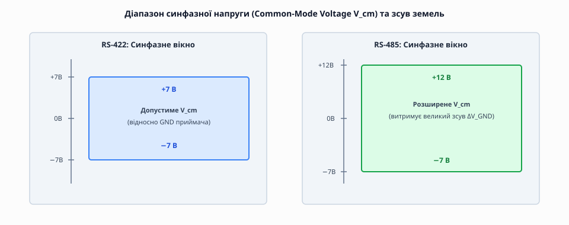
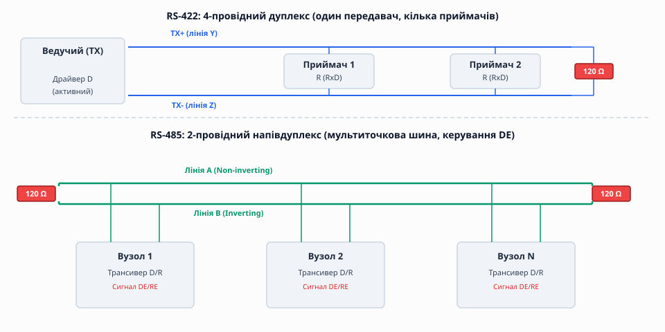
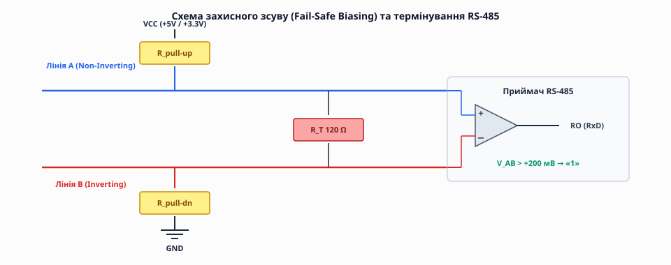

# RS-422 і RS-485: диференційний послідовний зв'язок

<preknowlist>
- [Асинхронна передача](root:com-devices/async-serial) — старт- і стоп-біти, узгоджена швидкість baud, кадр UART.
- [Диференційна пара](root:com-medium/differential-pair) — протифазні сигнал і інверсія для пригнічення синфазної завади.
- [Термінування ліній передачі](root:com-medium/termination) — хвильовий опір кабелю та гасіння відбитого сигналу.
</preknowlist>

Уявімо типовий промисловий цех: уздовж конвеєра завдовжки сотню метрів розставлені десятки датчиків температури, тиску та крокових двигунів, а в центральній шафі стоїть керувальний мікроконтролер. Поряд із кабелем прокладені силові шини 380 В, умикаються потужні частотні перетворювачі, а віддалені шафи автоматики живляться від різних трансформаторних підстанцій. Спроба з'єднати ці пристрої звичайною послідовною лінією з однобічним сигналом (де одиниця чи нуль зчитуються як напруга одного дроту відносно місцевої землі) приречена на збій: на такій дистанції корисний перепад напруги згасне в ємності кабелю, наведена від двигунів завада спотворить біти, а різниця потенціалів між «землями» двох шаф у десяток вольтів просто випалить вхідні каскади мікросхем. Стандарти **RS-422** та **RS-485** народилися як пряма відповідь на цю фізичну стіну: це технології **диференційного послідовного зв'язку**, які дозволяють передавати дані на відстань до 1200 метрів зі швидкістю до 10 Мбіт/с крізь кілометри промислових перешкод і об'єднувати десятки пристроїв у спільну виту пару.

> 🔧 **Навіщо це.** Усередині однієї друкованої плати однобічні інтерфейси UART, SPI та I²C є ідеальними за простотою й ціною. Та щойно послідовний потік виходить за межі плати в кабель між корпусами чи цехами — однобічний рівень перестає працювати, і виникає потреба в диференційних фізичних стандартах RS-422 та RS-485.

---

### Фізика диференційного приймача: синфазне вікно та пригнічення завад

Фундаментальна ідея, на якій стоять обидва стандарти, полягає у відмові від вимірювання напруги одного сигнального провідника відносно спільної лінії землі. Замість одного провідника потік даних передається по **двох симетричних дрітах**, які формують диференційну пару. Назвемо ці лінії `A` (неінверсна) та `B` (інверсна).

Вихідний каскад передавача побудовано за мостовою схемою (H-bridge). Він жене струм у дріт строго протифазно:
- Для передачі логічної **одиниці** (стан *Mark* / спокій) передавач підтягує лінію `A` до позитивного потенціалу живлення VCC, а лінію `B` — до землі GND.
- Для передачі логічного **нуля** (стан *Space* / старт-біт) ключі моста перемикаються навпаки: лінія `B` підключається до VCC, а лінія `A` — до GND.

Приймач на протилежному кінці кабелю дивиться не на абсолютний потенціал кожного дроту відносно своєї місцевої землі, а обчислює **різницю напруг між провідниками**:

```
V_AB = V_A − V_B

V_AB > +200 мВ  →  Логічна «1» (Mark / Стан спокою)
V_AB < −200 мВ  →  Логічний «0» (Space / Старт-біт)
```

Діапазон напруг від `-200 мВ` до `+200 мВ` становить **сіру зону гістерезису**: якщо різниця напруг потрапляє у цей проміжок, компаратор приймача утримує свій попередній стан, захищаючи потік від дрібних високочастотних коливань та флуктуацій.


*Діапазон синфазної напруги V_cm відносно місцевої землі приймача для RS-422 (±7 В) та розширене вікно RS-485 (-7 В..+12 В).*

Чому вимірювання різниці напруг надає феноменальну завадостійкість? Будь-яка зовнішня електромагнітна завада від сусіднього силового кабелю, змінного магнітного поля або електрозварювального апарата наводить на близько скручені провідники `A` і `B` **однакову за величиною та знаком заваду**. Вона зміщує потенціали обох дротів в один бік на однакову величину. Приймач обчислює різницю `(V_A + V_noise) - (V_B + V_noise) = V_A - V_B`. Наведена завада математично віднімається й зникає. Це явище називається **пригніченням синфазного сигналу** (*Common-Mode Rejection*, CMR).

Протім приймач має фізичну межу: електрична міцність ізоляції його вхідних транзисторів обмежена. Сума напруги корисного сигналу та різниці потенціалів земель створює **синфазну напругу** (*Common-Mode Voltage*):

```
V_cm = (V_A + V_B) / 2
```

Стандарт **RS-422** регламентує допустимий діапазон синфазної напруги від **`-7 В` до `+7 В`** відносно місцевої землі приймача. Стандарт **RS-485** розширює це вікно до діапазону від **`-7 В` до `+12 В`**. Це розширення дає змогу RS-485 витримувати значні струми вирівнювання та зсуви потенціалів земель, які неминуче виникають між віддаленими будинками й цехами.

> 📜 Перехід від однобічних ліній RS-232 до диференційних систем у 1970-1980-х роках став наслідком швидкого зростання промислової автоматизації. Докладніше про це розвідано в [історії стандартизації RS-422 та RS-485](root:com-medium/rs485-multidrop-bus/hist-standardization.md).

---

### Спільний провідник землі: чому диференційній парі потрібен третій дріт

Поширеною та небезпечною помилкою початківців є думка, що диференційній парі RS-485 взагалі не потрібна земля, оскільки приймач вимірює лише різницю `V_A - V_B`. Це міф, який призводить до масового виходу з ладу трансиверів під час першої ж грози або перемикання потужного навантаження.

Приймач дійсно обчислює різницю, але його компаратор фізично виготовлено на кремнієвому кристалі мікросхеми, яка заживлена від місцевого джерела живлення та прив'язана до місцевої землі вузла `GND_local`. Якщо два вузли на відстані 500 метрів з'єднати тільки двома провідниками `A` і `B`, а їхні землі залишити ізольованими або з'єднати через контури заземлення з різницею потенціалів у 30 Вольтів (через статичний заряд, витік мережевого фільтра чи відсутність спільного контуру), синфазна напруга `V_cm` вийде далеко за межі дозволеного вікна `[-7 В..+12 В]`. Вхідний p-n перехід компаратора проб'є, і трансивер згорить.

Правильне проєктування вимагає **трипровідного підключення**:
1. Двопровідна вита пара для диференційних сигналів `A` і `B`.
2. Третій провідник (або ізольований екран кабелю), який вирівнює потенціали земель усіх вузлів мережі.

Щоб по цьому третьому провіднику не текли руйнівні вирівнювальні струми великої потужності, його підключають до землі кожного вузла через **низькоомний резистор (типово 100 Ом, 0.5 Вт)** або застосовують гальванічно ізольовані трансивери.

---

### RS-422: Повнодуплексний зв'язок точка-багатоточка

Стандарт **ANSI/TIA/EIA-422-B** розроблявся першим (1975 рік) як високошвидкісна диференційна заміна RS-232. Його архітектура розрахована на **чотирипровідне підключення** (дві окремі виті пари):
- Одна пара `TX+ / TX-` (лінії `Y / Z`) для передачі даних від ведучого до приймачів.
- Друга пара `RX+ / RX-` (лінії `A / B`) для приймання даних ведучим від веденого пристрою.


*Згори — RS-422: 4-провідна схема з постійно активним передавачем (Master) і 10 приймачами. Знизу — RS-485: 2-провідна шина з керуванням напрямком DE та термінуванням по 120 Ом.*

Головні характеристики RS-422:
- **Один передавач (Master Driver):** На кожній диференційній парі може бути присутній **лише один передавач**. Вихідний каскад драйвера RS-422 постійно активний і перебуває під низьким імпедансом. Він не вміє виходити у третій стан (High-Z).
- **До 10 приймачів (Listeners):** Один передавач RS-422 здатний розгалужуватися та тиснути сигнал на входи до 10 приймачів, з'єднаних паралельно.
- **Повний дуплекс (*Full-Duplex*):** Завдяки наявності двох окремих диференційних пар передача й приймання відбуваються одночасно й незалежно, без жодних затримок на перемикання напрямку.

Завдяки відсутності потреби в керуванні напрямком лінії RS-422 простий у програмуванні: для мікроконтролера він виглядає як звичайний UART із двома незалежними лініями `TX` та `RX`, пропущеними через диференційні буфери.

> 📋 Детальні числові параметри напруг, чутливості та навантаження для порівняння RS-232, RS-422 та RS-485 наведено у [довідкових специфікаціях інтерфейсів](root:com-medium/rs485-multidrop-bus/api-spec-comparison.md).

---

### RS-485: Багатоточкова шина та керування напрямком (DE)

Стандарт **ANSI/TIA/EIA-485-A** (1983 рік) зробив наступний крок: він дозволив об'єднувати багато передавачів і приймачів на **одній спільній витій парі** у напівдуплексному режимі (*Half-Duplex*).

Щоб кілька пристроїв могли говорити по тих самих двох дротах `A` і `B`, передавачі RS-485 отримали ключову властивість: **третій високоімпедансний стан (High-Z)**.

Кожен трансивер RS-485 має додаткові сигнальні виводи керування:
- **`DE` (*Driver Enable*):** Високий рівень (HIGH) вмикає передавач у шину. Низький рівень (LOW) від'єднує передавач, переводячи його виходи в High-Z (витік струму < 10 мкА).
- **`/RE` (*Receiver Enable*, інверсний):** Низький рівень (LOW) вмикає приймач. Високий рівень (HIGH) вимикає вихід `RO`.

```
DE = 1, /RE = 1  →  Вузол ГОВОРИТЬ у шину (приймач вимкнено)
DE = 0, /RE = 0  →  Вузол СЛУХАЄ шину (передавач у High-Z)
```

#### Одиничне навантаження (Unit Load, UL)
Скільки вузлів можна підключити до однієї шини RS-485? Стандарт визначає навантажувальну здатність через **одиничне навантаження (1 UL)**. Класичний приймач RS-485 має вхідний опір `12 кОм`. Стандартний передавач розрахований на віддачу струму у сумарне навантаження **до 32 UL**.

Сучасні напівпровідникові трансивери мають зменшені вхідні струми витоку:
- Приймачі **1/4 UL** (вхідний опір `48 кОм`) дозволяють підключати до **128 вузлів**.
- Приймачі **1/8 UL** (вхідний опір `96 кОм`) дозволяють підключати до **256 вузлів** на один фізичний сегмент кабелю.

#### Захист від колізій і струмового перевантаження
Якщо через програмний збій два вузли одночасно піднімуть `DE = 1` і почнуть передавати протилежні біти (один тисне лінію в `+5 В`, інший — у `0 В`), виникне **конфлікт шини** (*Bus Contention*). Стандарт RS-485 вимагає, щоб трансивери мали апаратне обмеження струму короткого замикання (не більше `250 мА`) та схему теплового вимкнення (*Thermal Shutdown*), яка автоматично вимикає передавач при нагріві кристала понад `+150 °C`.

> 🔌 Внутрішню схему драйвера, компаратора та методи гальванічної ізоляції розглянуто у [вставці про архітектуру трансиверів RS-485](root:com-medium/rs485-multidrop-bus/comp-transceivers.md).

---

### Термінування та хвильова физика лінії

На високих швидкостях передачі або на довгих дистанціях кабель витої пари перестає бути простою електропровідною перемичкою й перетворюється на **лінійну систему з розподіленими параметрами (лінію передачі)**.

Електромагнітна хвиля поширюється по мідній витій парі зі швидкістю приблизно `200 000 км/с` (близько 5 нс на кожен метр кабелю). Типова вита пара має **хвильовий опір** (*Characteristic Impedance*):

```
Z_0 ≈ 120 Ом
```

Коли фронт напруги добігає до кінця кабелю, подальша поведінка хвилі залежить від опору навантаження на цьому кінці:
1. Якщо кінець кабелю розімкнений (опір прямує до нескінченності ∞), хвиля не може передати свою енергію далі. Вона **відбивається повністю від кінця кабелю** й біжить назад до передавача.
2. Відбита хвиля накладається на корисний сигнал, створюючи сильну заваду — **дзвін (ringing)** та сходинки на фронтах імпульсів. Приймач бачить ці сходинки як хибні переходи й зчитує спотворені байти.


*Схема термінування резистором R_T (120 Ом) та резистивного захисного зсуву (Fail-Safe Biasing) для утримання V_AB > +200 мВ у стані High-Z.*

Щоб повністю усунути відбиття хвилі, на **обох фізичних кінцях найдовшого кабелю** встановлюють узгоджувальні резистори — **термінатори**:

```
R_T = Z_0 ≈ 120 Ом
```

Коли електромагнітна хвиля доходить до термінатора `R_T = 120 Ом`, вона розсіює свою енергію на резисторі у вигляді тепла, не створюючи жодної відбитої хвилі. Фронт сигналу лишається чистим і прямокутним.

#### Правила термінування:
- Термінатори `120 Ом` встановлюють **строго два** — на першому та на останньому фізичному вузлі шини.
- Проміжні вузли термінувати **заборонено**: кожен додатковий резистор 120 Ом паралельно просаджує диференційну напругу й перевантажує передавач.
- **Топологія зв'язку — тільки «ланцюжок» (Daisy-Chain):** Кабель повинен іти послідовно від вузла до вузла. Довгі відгалуження (*Stubs*) створюють власні нетерміновані точки відбиття. Довжина відгалуження від основної шини до плати вузла не повинна перевищувати `0.3 м`.

---

### Захисний зсув лінії (Fail-Safe Biasing)

Коли всі вузли на шині RS-485 перебувають у режимі приймання (`DE = 0`), жоден передавач не формує напругу. Термінатори 120 Ом швидко розряджають ємність кабелю, і диференційна напруга стає рівною нулю:

```
V_AB = 0 мВ
```

Значення `0 мВ` потрапляє строго в сіру зону компаратора `[-200 мВ..+200 мВ]`. Найменша наведена завада змушує вихід приймача `RO` довільно перемикатися між `0` та `1`, що призводить до генерації сміттєвих байтів на вході UART мікроконтролера.

Для запобігання цьому використовують **захисний зсув (Fail-Safe Biasing)**:
- До лінії `A` підключають резистор підтяжки `R_pull-up` до джерела живлення VCC.
- До лінії `B` підключають резистор підтяжки `R_pull-down` до землі GND.

Ці резистори утворюють дільник напруги разом із термінаторами `R_T`, який примусово створює невелику додатну різницю напруг:

```
V_AB(idle) ≈ +200 мВ .. +300 мВ
```

Завдяки цьому при вільній шині приймач завжди бачить стійку логічну **одиницю** (стан *Idle*), що відповідає нормальному спокійному стану асинхронного кадру UART.

У сучасних мікросхемах трансиверів (наприклад, MAX3080, SN65HVD72) використовують **інтегровану схему True Fail-Safe**: пороги компаратора зміщені від симетричних `±200 мВ` до асиметричних **`-200 мВ .. -50 мВ`**. Для таких трансиверів різниця `0 мВ` уже гарантовано є логічною одиницею, тому зовнішні резистори підтяжки не потрібні.

---

### Програмне керування напрямком у коді

Для роботи з напівдуплексним RS-485 у прошивці мікроконтролера необхідно суворо синхронізувати перемикання піна `DE`.

Типова помилка полягає у вимкненні `DE` за прапорцем порожнього буфера передачі `TXE` (*TX Register Empty*). `TXE` означає лише те, що байт переписався з програмного регістру в апаратний зсувний регістр, але його фізична випромінюваність у дріт ще триває! Вимкнення `DE` у цей момент обріже останній біт кадру.

Опускати `DE = 0` можна лише після отримання прапорця **`TC` (*Transmission Complete*)**, який свідчить про те, що останній стоп-біт фізично залишив апаратний зсувний регістр UART.

:::tabs
```c
// ============================================================================
// Мова C: Коректний алгоритм відправки кадру по RS-485 з перевіркою прапорця TC
// ============================================================================
#include <stdint.h>
#include <stdbool.h>
#include <stddef.h>

extern void gpio_set_de_pin(bool state);
extern bool uart_is_txe(void);
extern bool uart_is_tc(void);
extern void uart_send_byte_raw(uint8_t b);

void rs485_send_buffer(const uint8_t *data, size_t len) {
    // 1. Переводимо трансивер у режим передачі
    gpio_set_de_pin(true);

    for (size_t i = 0; i < len; i++) {
        // Очікуємо готовності апаратного буфера передачі (TXE)
        while (!uart_is_txe());
        uart_send_byte_raw(data[i]);
    }

    // 2. Обов'язково чекаємо повного виходу останнього стоп-біта у дріт (TC!)
    while (!uart_is_tc());

    // 3. Звільняємо шину — повертаємося в режим приймання High-Z
    gpio_set_de_pin(false);
}
```
```cpp
// ============================================================================
// Мова C++: Ідіоматичне RAII-керування піном напрямку RS-485 із std::span
// ============================================================================
#include <cstdint>
#include <cstddef>
#include <span>

class Rs485DirectionGuard {
public:
    Rs485DirectionGuard() {
        setDeHardware(true);  // Умикаємо передавач RS-485 при створенні об'єкта
    }
    
    ~Rs485DirectionGuard() {
        waitUartTcHardware(); // Чекаємо повного виходу останнього стоп-біта (TC)
        setDeHardware(false); // Завжди відпускаємо шину в RX навіть при винятках
    }

    Rs485DirectionGuard(const Rs485DirectionGuard&) = delete;
    Rs485DirectionGuard& operator=(const Rs485DirectionGuard&) = delete;

private:
    static void setDeHardware(bool active) {
        extern void platform_set_de(bool);
        platform_set_de(active);
    }

    static void waitUartTcHardware() {
        extern void platform_wait_tc(void);
        platform_wait_tc();
    }
};

void send_telemetry_packet(std::span<const std::uint8_t> packet) {
    Rs485DirectionGuard guard; // RAII тримає шину під час роботи функції
    for (std::uint8_t byte : packet) {
        extern void platform_uart_write(std::uint8_t);
        platform_uart_write(byte);
    }
}
```
:::

> ⚙️ Детальний неблокуючий драйвер RS-485 на перериваннях, обробку гонок та налаштування апаратного режиму `DE` у мікроконтролерах STM32 розібрано у [вставці про керування напрямком RS-485 у коді](root:com-medium/rs485-multidrop-bus/proj-dir-control.md).

---

### Порівняльний синтез: коли обирати RS-422, а коли RS-485

Обидва стандарти зарекомендували себе як винятково надійні рішення для складних умов. Для вибору між ними використовують наступні критерії:

| Критерій | RS-422 | RS-485 |
| :--- | :--- | :--- |
| **Топологія мережі** | Точка-точка або точка-багатоточка (1 Master → N Listeners) | Мультиточкова шина (Multi-drop, багатвузловий обмін) |
| **Дуплексність** | Повний дуплекс (Full-Duplex, 4 дроти) | Напівдуплекс (Half-Duplex, 2 дроти) або Дуплекс (4 дроти) |
| **Складність програмного драйвера** | Простий (звичайний UART, без керування пінами) | Потребує суворого керування піном `DE` або апаратного RS-485 |
| **Синфазне вікно V_cm** | `-7 В .. +7 В` | **`-7 В .. +12 В`** (вищий захист від зсуву земель) |
| **Максимальна кількість пристроїв** | 10 приймачів | **Від 32 до 256 вузлів** |
| **Типові застосування** | Енкодери верстатів ЧПУ, медичне обладнання, виділені лінійні датчики | Промислові шини Modbus RTU, Profibus, сценічне світло DMX512 |

Завдяки симетричній фізиці, пригніченню синфазного шуму та здатності працювати на кілометрових відстанях стандарти RS-422 та RS-485 залишаються неодмінним золотим стандартом промислової електроніки та робототехніки.
